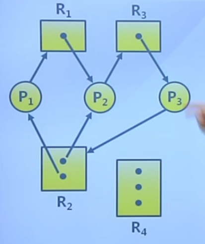
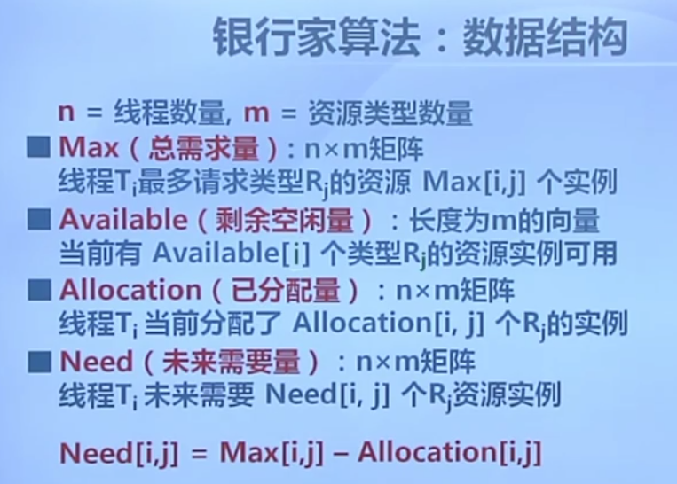

# 死锁

进程间由于共享资源所导致的一种无限期等待的情况

## 概念

由于竞争资源或者通信关系，两个或者更多线程在执行中出现，永远相互等待只能由其他进程引发的事件

**进程访问资源的流程**

- 资源类型 
  - CPU执行时间、内存空间、IO设备等
- 每类资源R有W个实例
- 进程访问资源的流程
  - 请求/获取
  - 使用/占用
  - 释放

**资源分类**

- 可重用资源
  - 资源不能被删除，且任何时刻只能有一个进程使用
  - 进程释放资源后，其他进程可重用
  - 可重用资源示例
    - 硬件：处理器、IO、主和副存储器、设备等
    - 软件：文件、数据库、信号量等数据结构
  - 可能出现死锁
    - 一个进程占用一部分资源并请求其他资源
- 消耗资源
  - 资源创建和销毁
  - 销毁资源示例：
    - 在IO缓冲区的中断、信号、消息等
  - 可能出现死锁
    - 进程间相互等待接收对方的消息

**资源分配图**

描述资源和进程间的分配和占用关系的有向图

- 两类定点
  - 系统中的所有进程P
  - 系统中的所有资源R
- 两类有向边
  - 资源请求边P->R
  - 资源分配边R->P

存在死锁的分配图：

**出现死锁的必要条件**

- 互斥：任何时刻只能有一个进程使用一个资源实例
- 持有并等待：进程保持至少一个资源，并正在等待获取其他进程持有的资源
- 非抢占：资源只能再进程使用后自愿释放
- 循环等待：存在等待进程集合，形成循环

## 处理方法

类似于消防系统

- 死锁预防
  - 确保系统永远不会进入死锁状态
  - 资源利用效率可能较低
- 死锁避免
  - 使用前进行判断，只允许不会出现死锁的进程请求资源
- 死锁检测和恢复
  - 在检测到运行系统进入死锁状态后，进行恢复
- 由应用进程处理死锁
  - 通常操作系统忽略死锁的存在

**死锁预防**

预防是采用某种策略，限制并发进程对资源的请求，使系统在任何时刻都不满足死锁的必要条件

- 互斥：把互斥的共享资源封装成可同时访问
- 持有并等待：
  - 进程请求资源时，要求它不能持有任何其他资源
  - 仅允许进程在开始执行时，一次请求所有需要的资源
  - 资源利用率低
- 非抢占：
  - 如进程请求不能立即分配的资源，则释放已占有资源
  - 只有能同时获得所有需要资源时，才执行分配操作
- 循环等待：对资源排序，要求进程按顺序请求资源

**死锁避免**

- 利用额外的先验信息，在分配资源时判断是否会出现死锁，只在不会死锁时分配资源
  - 要求进程声明需要的资源的最大数目
  - 限定提供与分配的资源数量，确保满足进程的最大需求
  - 动态检查资源分配状态，确保不会出现环路等待
    - 系统资源分配的安全状态
    - 进行执行的安全序列

## 银行家算法

一种死锁避免的方法，以银行借贷分配策略为基础，判断并保证系统处于安全状态

问题模型：

数据结构

## 死锁检测

- 允许系统进入死锁状态
- 维护系统的资源分配图
- 定期调用死锁检测算法来搜索图红是非存在死锁
- 出现死锁使用死锁恢复机制

死锁检测算法的使用

- 检测的时间和周期选择依据
  - 死锁多久可能会发生
  - 多少进程需要被回滚
- 资源图可能有多个循环
  - 难于分辨造成死锁的关键进程

## 死锁恢复

进程终止

- 终止所有的死锁进程
- 一次只终止一个进程直到死锁消除
- 终止进程的顺序应该是
  - 进程的优先级
  - 进程已运行时间以及还需运行时间
  - 进程已占有资源
  - 进程完成需要的资源
  - 终止进程数目
  - 进程是交互还是批处理

资源抢占

- 选择被抢占进程
  - 最小成本目标
- 进程回退
  - 返回到一些安全状态，重启进程到安全状态
- 可能出现饥饿
  - 同一进程可能一直被抢占

# 参考 #

1. 
