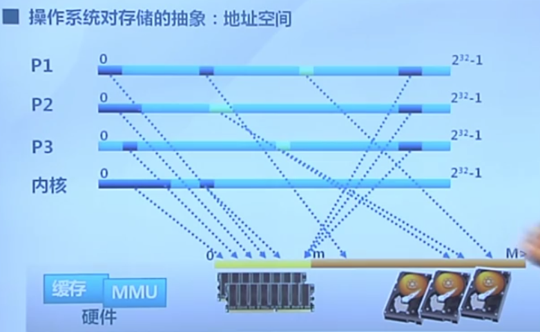
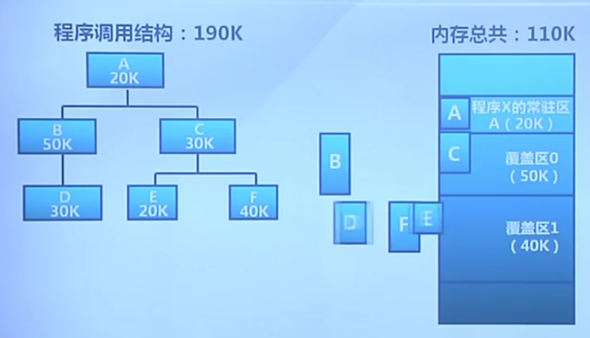
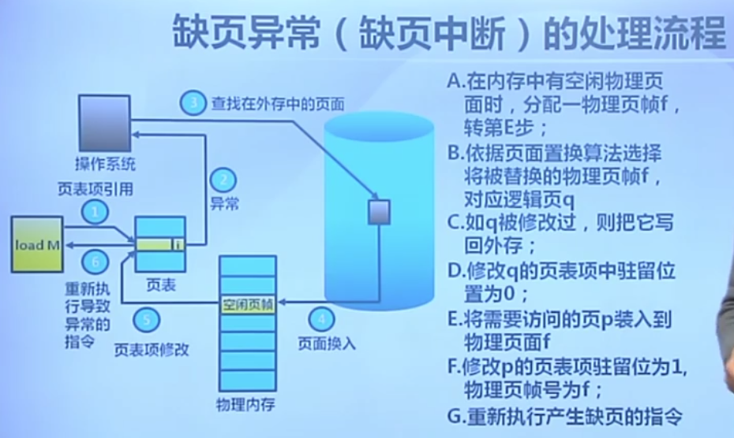
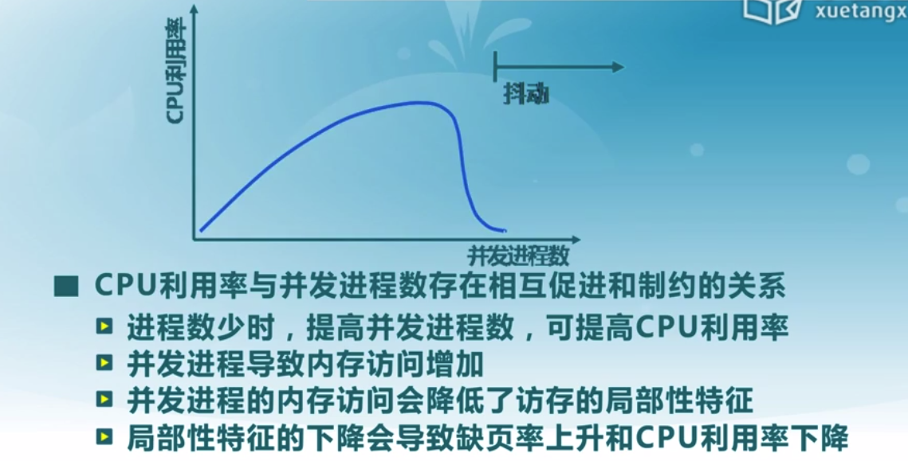
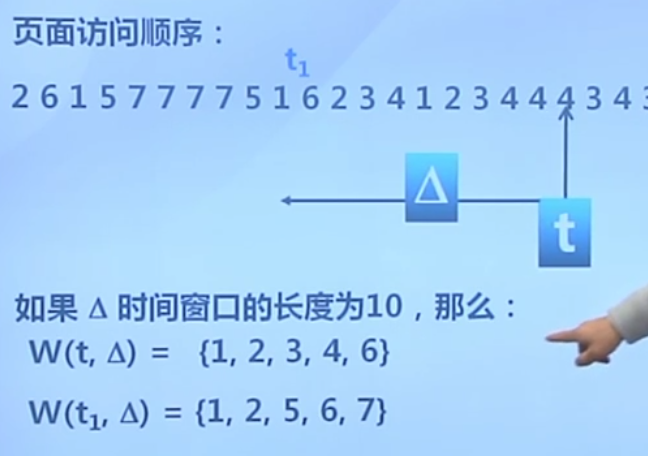
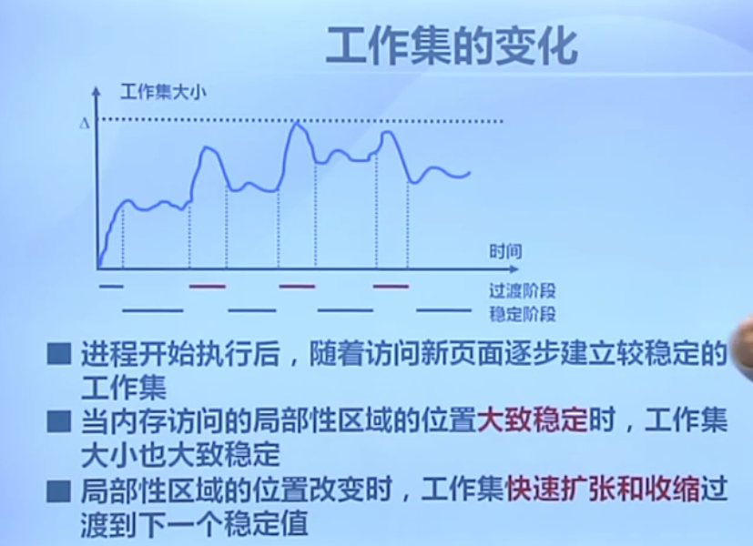
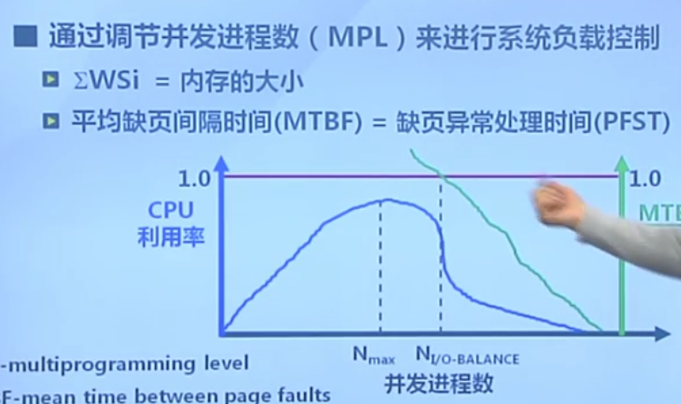

# 虚拟内存概念

物理内存的管理：分区、非连续分区等

虚拟内存是非连续内存分配的基础上，把原来要放在内存里的整个进程地址空间的信息，将其中的一部分数据放到外存当中，使得内存空间更大。

具体做法：覆盖与交换。

局部性原理：程序的执行有一定特征，要么是指令顺序执行，要么是跳转（循环，跳转到之前的一个地方）

目标

- 只把部分程序放到内存，从而运行比物理内存大的程序
  - 由OS完成
- 实现进程在内存与外存之间的交换，从而获得更多的空闲内存空间
  - 在内存和外存间只交换进程的部分内容

## 需求背景

- 增长迅速的存储需求，OS当中常出现的内存空间不够用
  - 解决：覆盖，应用程序手动把需要的指令和数据保存在内存中（将代码分为若干模块，相互独立，在需要的时候加载）
  - 交换，OS自动把暂时不能执行的程序保存到外存当中（一次对换是整个进程）
  - 虚拟存储，在有限容量的内存中，以页为单位自动装入更多更大的程序

**存储层次结构**

- 理想中的存储器
  - 容量更大，速度更快，价格更便宜、非易失
- 实际
  - 寄存器、高速缓存、内存、磁盘、磁带

**操作系统的存储抽象**

地址空间

## 覆盖和交换

### 覆盖

目标：在较小的可用内存中运行较大的程序（单个大程序无法运行）

方法：

- 依据程序的逻辑结构，将程序划分为若干功能相对独立的模块。将不会同时执行的模块共享同一块内存区域

  - 必要部分的代码和数据常驻内存
  - 可选部分放在其他程序模块中，只在需要时装入
  - 不存在调用关系的模块相互覆盖，放在同一内存区域

覆盖示例：

不足：

- 增加编程困难
  - 需要划分功能模块
  - 增加复杂度
- 增加执行时间
  - 从外存装入

### 交换

目的：增加正在运行或需要运行的程序的内存（考虑多个程序时候空间不够）

实现方法

- 将暂时不能运行的程序放到外存
- 换入换出的基本单位
  - 整个进程的地址空间
- 换出：将一个进程的整个地址空间保存到外存
- 换入：将外存中莫进程的地址空间换入内存

问题：

- 交换时机：何时需要发生交换
  - 当内存空间不够或有不够的可能时
- 交换区的大小
  - 存放所有用户进程的所有内存映像的拷贝
- 程序换入时的重定位：换出后再换入要放在原处吗？
  - 动态地址映射

## 局部性原理

概念：指访问的数据具有很好的集中性

- 程序在执行过程中的一个较短时期，所执行的指令地址和指令的操作数地址，分别局限于一定区域
  - 时间局部性
    - 一条指令的一次执行与下一次执行，一个数据的一次访问与下次访问都集中在一个较短时期内
  - 空间局部性
    - 当前指令与邻近的几条指令，当前访问的数据和邻近的几个数据都集中在一个较小区域内
  - 分支局部性
    - 一条跳转指令的两次执行，很可能跳到相同的内存位置

## 虚拟存储概念

思路：将不常用的部分内存块暂存到外存

原理：

- 加载程序时，只将当前指令执行需要的部分页面或段装入内存
- 指令执行中需要的指令或数据不在内存（缺页）时
  - 处理器通知操作系统将相应的页面调入内存
- OS将内存中暂时不用的页面保存到外存（置换算法）

实现方式：虚拟页式、段式存储

支持技术：

- 硬件
  - 页式或短时存储中的地址转换机制
- 操作系统
  - 管理内存和外存间页面或段的换入或换出

## 虚拟页式存储

在页式存储管理的基础上，增加请求调页和页面置换

思路

- 在用户程序要装在到内存运行时，只装入部分页面，就启动程序
- 进程在运行中发现有需要的代码或数据不在内存时，则向系统发出缺页异常请求
- 操作系统在处理缺页异常时，将外存中相应的页面调入内存

页表项结构

- 驻留位，表示该页是否存在内存
- 修改位：表示在内存中的该页是否被修改过
- 访问位：表示该页面是否被访问过（读或写）
- 保护位：表示该页的允许访问方式

## 缺页异常

虚拟页式存储中的外存管理

- 在何处保存未被映射的页
  - 应能方便地找到在外存中的页面内容
  - 交换空间（磁盘或者文件）
    - 采用特殊格式存储未被映射的页面
- 外存选择
  - 代码段：可执行二进制文件
  - 动态加载的共享库程序段：动态调用的库文件
  - 其他段：交换空间

虚拟页式存储管理的性能

有效存储访问时间

EAT=访存（内存）时间×（1-p）+缺页异常处理时间（远大于访存时间）×缺页率p

# 虚拟存储页面置换算法

## 概念

功能

- 当出现缺页异常，需调入新页面而内存已满时，置换算法选择被置换的物理页面

设计目标：

- 尽可能减少页面的调入调出此时
- 把未来不再访问或短期内不访问的页面调出

页面锁定：

- 描述必须常驻内存的逻辑页面（OS的关键代码等）
- OS的关键部分
- 要求响应速度的代码和数据
- 页表中的锁定标志位

置换算法的评价

- 记录进程访问内存的页面轨迹
  - 虚拟地址访问用（页号，位移）表示
- 评价方法：
  - 模拟页面置换行为，记录产生缺页的次数
  - 更少的缺页，更好的性能

算法分类

- 局部页面置换算法
  - 分配一个进程的物理页面数是确定的
  - 置换页面的选择范围仅限于当前进程占用的物理页面内
  - 难以实现：最优算法、先进先出算法（性能差）、最近最久未使用算法
  - 常用：时钟算法、最不常用算法
- 全局页面置换算法
  - 分配一个进程的物理页面数是确定的

## 局部页面置换算法

- 分配一个进程的物理页面数是确定的
- 置换页面的选择范围仅限于当前进程占用的物理页面内

### 最优算法OPT

预测未来

基本思路

- 置换在**未来**最长时间不访问的页面

算法实现

- 缺页时，计算内存中每个逻辑页面的下一次访问时间（假设可以）
- 选择未来最长时间不访问的页面

特征

- 缺页最少，最好
- 实际系统无法实现
- 无法预知每个页面在下次访问前的等待时间
- 作为性能评价依据

### 先进先出算法FIFO

思路

- 选择在内存中驻留时间最长的页面进行置换

实现

- 维护一个记录所有位于内存中的逻辑页面链表
- 链表元素按驻留内存的时间排序
- 出现缺页时，选择链首页面进行置换，新页面加到链尾

特征

- 实现简单
- 性能较差
- 进程分配物理页面数增加时，缺页不一定减少 **belady现象**
- 很少单独使用

### 最近最久未使用算法LRU

统计过去，实现复杂度较高

思路

- 选择最长时间没有被引用的页面进行置换
- 依据：如某些页面长时间未被访问，则它们在将来还可能会长时间不会访问

实现

- 缺页时，计算内存中每个逻辑页面的上一次访问时间
- 选择上一次使用到当前时间最长的页面

特征

- 最优置换算法的一种近似
- 非常复杂，不太可能实现

**LRU算法的可能实现方法**

- 页面链表
  - 系统维护一个按最近一次访问时间排序的页面链表
    - 链表首节点是最近刚刚使用过的页面
    - 链表尾节点是最久未使用的页面
  - 访问内存时，找到相应的页面，并把它移到链表首
  - 缺页时，置换链表尾部的页面
- 活动页面栈，相对较优
  - 访问页面时，将页号压入栈顶，并将栈内相同的页号抽出
  - 缺页时，置换栈底的页面（双端栈）

### 时钟置换算法CLOCK

思路：

- 仅对页面的访问情况作大致统计

数据结构：

- 在页表项中增加**访问位**，描述页面在过去一段时间的内访问情况
- 各页面组织成环形链表
- 指针指向最先调入的页面，指针在链表上进行周期性循环

算法

- 访问页面时，在页表项纪录页面访问情况
- 缺页时，从指针处开始顺序查找未被访问的页面进行置换
- 在LRU与FIFO折中

实现

- 页面装入内存时，访问位初始化为0
- 访问页面时，访问位置1
- 缺页时，从指针当前位置顺序检查环形链表
  - 访问位为0，置换该页
  - 访问位为1，则重置为0，指针移动到下一个位置直到找到可置换页面

**改进的clock算法**

思路

- 减少修改页的缺页处理开销（修改的页面要写回外存，因此存在开销）

算法

- 在页面中增加修改位，并在访问时进行相应修改
- 缺页时，修改页面的标志位，以跳过有修改的页面

数据写回外存有一定的延迟

### 最不常用算法LFU

思路

- 缺页时，置换访问次数最少的页面

实现

- 每个页面设置一个访问计数
- 访问页面，访问计数+1
- 缺页时，置换计数最小的页面

特征

- 算法开销大
- 开始时频繁使用，但以后不使用的页面很难置换
  - 解决：计数定期右移
- LRU与LFU区别
  - LRU关注多久没访问
  - LFU关注次数

### belady现象

局部置换算法的一个特征

- 采用FIFO等算法时，可能会出现分配的物理页面增加，缺页次数反而会升高的异常现象

原因

- FIFO算法的置换特征与进程访问内存的动态特征矛盾（进程的访问特征不同，排序算法与word编辑进程的访问特征完全不同）
- 被它置换出去的页面并不一定是进程近期不会访问的

LRU算法无belady现象

### LRU、FIFO、Clock的比较

- LRU算法与FIFO本质上都是先进先出

  - LRU依据页面的最近访问时间排序
  - LRU需要动态调整顺序
  - LRU算法性能好，但是开销大
  - FIFO依据页面进入内存的时间排序
  - FIFO顺序固定不变
  - LRU开销小，但是belady现象
- LRU可退化为FIFO

  - 如果页面进入内存后没有被访问（视频信息等）
- Clock算法是折中
- 对于被访问的页面，clock算法不能记录准确访问顺序，而LRU算法可以

# 全局页面置换算法

考虑不同进程对于内存需求量的差异

思路

- 给进程分配可变数目的物理页面

需要解决的问题

- 进程在不同阶段的内存需求是变化的
- 分配给进程的内存也需要在不同阶段有所变化
- 全局置换算法需要确定分配给进程的物理页面数

**CPU利用率与并发进程数的关系**

局部性特征的下降！

### 工作集置换算法

最优算法在全局里的一种体现

工作集：一个进程当前正在使用的逻辑页面集合，表示为二元函数W（t,L）

- t是当前执行时刻
- L为工作集窗口，即一个订场的页面访问时间窗口
- W指在当前时刻t前的L时间窗口中的所有访问页面所组成的集合
- |W|指工作集的大小，即页面数目

工作集的变化

常驻集

- 当前时刻，进程实际驻留内存当中的页面集合

工作集与常驻集的关系

- 工作集是进程在运行过程中固有的性质
- 常驻集取决于系统分配给进程的物理页面数目和页面置换算法

缺页率与常驻集关系

- 常驻集包含工作集，缺页较少
- 工作集发生剧烈变动，缺页较多
- 进程常驻集大小达到一定数目后，缺页率也不会明显下降

**思路**

- 换出不在工作集的页面
- 窗口大小L，当前时刻前T个内存访问的页引用是工作集

实现方法

- 访问链表：维护窗口内的访问页面链表
- 访存时，换出不在工作集的页面，更新访存链表
- 缺页时，换入页面，更新访存链表

### 缺页率置换算法PFF

缺页率：缺页次数/内存访问次数 或 缺页平均时间间隔的倒数

影响缺页率因素

- 页面置换算法
- 分配给进程的物理页面数目
- 页面大小
- 编程内容

原理：

- 通过调节常驻集大小，使每个进程的缺页率保持在一个合理的范围内

  - 若进程缺页率过高，则增加常驻集以分配更多
  - 若缺页率过低，则减小常驻集

实现

- 访存时，设置引用位标志
- 缺页时，计算上次缺页时间到现在缺页时间的间隔
  - 如果间隔>T，则置换所有在该间隔中所有没有被引用的页
  - 否则，增加缺失页到常驻集

### 抖动和负载控制

**抖动：**

- 进程物理页面太少，不能包含工作集
- 造成大量缺页，频繁置换
- 进程运行速度变慢

产生抖动的原因

- 随着驻留内存的进程数目增加，分配给每个进程的物理页面数不断减小，缺页率不断上升

操作系统需要在并发和缺页率到达一个平衡。

**负载控制**

- 通过调节并发进程数来进行系统负载控制

# 参考 #

1. 
