# 进程通信

进程间通信是为了进程间进行协作。这样做的***原因***有

- 信息共享。多个用户可能对同样的信息感兴趣
- 提高运算速度。
- 模块化。
- 方便。单个用户可以同时执行很多任务

## 进程通信机制IPC

- 低级通信
  - 进程互斥与同步交换的信息量小，每次通信传递的信息量固定且效率较低
  - 如：信号量
- 高级通信
  - 进程之间以较高的效率传送大量数据的通信方式。
  - 高级通信方式可分为三大类：共享存储器系统、消息传递系统以及管道通信系统。

进程间通信的两种基本模式。

### 共享内存

建立起一块供协作进程共享的内存区域，进程通过向此共享区域读或写入数据来交换信息。

**优点**

- 允许以最快的速度进行方便地通信，可以达到内存的速度。

**概述**

### 消息传递

通过在协作进程间交换信息来实现通信。通常借助于系统调用来实现。

**优点**

- 在交换较少数量的数据很有用，因为不需要避免冲突。
- 更容易实现。
- 在分布式环境当中非常有用。

消息传递工具必须至少支持两种操作：发送和接受（消息）。

如果两个进程P与Q需要通信，则他们间必须要有通信线路。线路有多种实现方法，在不考虑线路的物理实现下，只关心逻辑实现。

- 直接或间接通信
- 同步或异步通信
- 自动或显式缓冲

#### 命名

需要通信的进程必须有一个办法以互相引用，它们可使用直接或间接通信。

**直接通信**

直接通信：需要通信的每个进程都必须直接指明通信的接收方或发送方。

- send(P,message)：发送消息到进程P
- receive(Q,message)：接受来自进程Q的消息。

这种方案的通信线路具有如下属性：

- 在需要通信的每对进程之间自动建立线路。进程只需要知道相互通信的标识符
- 一个线路只和两个进程相关
- 每对进程之间只有一个线路。
- 链路可以是单向也可以是双向

这种方案为对称寻址，即双方进程必须命名对方以便通信。方案变种为非对称寻址，即只需要命名接受者，接受者不需要命名发送者。

- send(P,message)：发送消息到进程P
- receive(id,message)：接受来自任何进程的消息，变量ID设置成与其通信的进程名称。

*对称寻址与非对称寻址缺陷*：限制了进程定义的模块化，因为一旦修改进程名称，需要修改其他进程的定义，修改为新名称。

**间接通信**

通过邮箱或端口来发送和接受消息。邮箱可以抽象为一个对象，进程向其中存放、删除消息。每个抽象具有一个标识符。

- send(A,message)：发送一个消息到邮箱A
- receive(A,message)：接受来自邮箱A的消息

通信链路的属性为：

- 只有在两个进程共享一个邮箱时，才能建立通信线路
- 一个线路可以与两个或更多的进程相关联
- 两个通信进程间可以有多个不同的线路，每个线路对应于一个邮箱

通信流程

- 创建一个新的消息队列
- 通过消息队列发送和接受消息
- 销毁消息队列

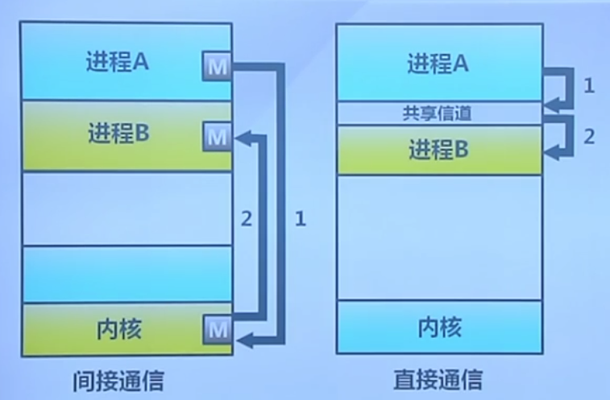

#### 同步

消息传递可以是阻塞或者非阻塞的，即同步或异步

- 阻塞send：发送进程阻塞，直到消息被接收进程或邮箱所接收
- 非阻塞send：发送进程发送消息并再继续操作
- 阻塞receive：接受者阻塞，直到有消息可用
- 非阻塞receive：接受者收到一个有效消息或空消息

#### 缓冲

不管通信是直接还是间接，交换的信息都驻留在临时队列中。简单队列实现有三种方法

- 0容量，即无缓冲。发送方必须等待接收方
- 有限容量。通信链路缓冲队列满时，发送方必须等待
- 无限容量。发送方不需要等待

## 通信方式

### 信号

操作系统提供，一种快速地通信机制

- 进程间的软件中断通知和处理机制

信号的接受处理

- 捕获：执行进程制定的信号处理函数被调用(软件定义)
- 忽略：执行操作系统制定的缺省处理（进程注册时，操作系统注册处理函数）
  - Ctrl C
- 屏蔽：禁止进程接受和处理信号
  - 可能是暂时的

不足：传递的信息量小，只有一个信号类型

### 管道

操作系统提供

- 进程间基于内存文件的通信机制
  - 子进程从父进程继承文件描述符
  - 缺省文件描述符：0 stdin 1 stdout 2stderr
- 进程不关心另一端
  - 可能从键盘、文件、程序读取
  - 可能写入到终端、文件、程序
- 读管道：read（）,scanf（）
- 写管道：write(),printf（）
- 创建管道 pipe

### 消息队列

- 消息队列是由操作系统维护的以字节序列为基本单位的间接通信机制
  - 每个消息是一个字节序列
  - 相同标识的消息组成按先进先出顺序组成一个消息队列
- 消息队列的系统调用
  - msgget获得消息队列标识
  - msgsnd发送消息
  - msgrcv接受消息
  - msgctl消息队列控制

### 共享内存

- 共享内存是把同一个物理内存区域同时映射到多个进程的内存地址的通信机制
- 进程
  - 每个进程都有私有内存地址空间
  - 每个进程的内存地址空间需要明确设置共享内存段
- 线程：同一进程中的线程总是共享相同的内存地址空间
- 优点：快速、方便地共享数据
- 缺点：必须用额外的同步机制

依据页表项进行映射

- 最快的方法
- 一个进程写，另一个进程立即可见
- 没有系统调用干预
- 没有数据复制
- 不提供同步，需要程序员进行同步

### TCP/IP套接字

### UNIX域套接字

### 信号量通信

# 客户机-服务器系统通信

客户机-服务器系统通信方法：socket（较低级）、RPC（高级）、RMI（高级）

## socket

socket（套接字）可定义为通信的端点。

socket组成：IP地址、一个端口号。

### 优缺

- 常用、高效
- 低级的分布式进程通信。只允许通信线程间交换无结构的字节流。需要客户机或服务器负责加上数据结构

### socket通信机制

- 一对通过网络通信的进程需要使用一对Socket，即每个进程各有一个。
- Socket通常采用客户机-服务器结构。
  - 服务器监听指定端口来等待进来的客户请求。一旦收到请求，服务器就接受来自客户Socket的连接从而完成连接。
  - 服务器实现的特定服务是通过监听众所周知的端口来进行的。低于1024的端口认为是众所周知的，用于实现标准服务，如FTP、telnet等。
  - 客户机进程发出连接请求，被主机赋予一个端口（大于1024）。
  - 每一对连接都有唯一的一对socket。

### Java实现

Java提供3种不同类型的socket。

- TCP的Socket，由Socket类实现
- UDP的socket，由DatagramSocket
- 多点传送的socket，允许数据发送给多个接受者，MulticastSocket

以TCP的socket实现日期服务器。

- 允许客户机从服务器请求当前的日期和时间
- 服务器监听端口6013（任意>1024）。接受到连接，服务器将日期与时间返回客户机。

服务器代码：

```Java
import java.io.IOException;
import java.io.PrintWriter;
import java.net.ServerSocket;
import java.net.Socket;

public class DateServer {
    public static void main(String[] args) {
        try {
            //监听端口6013
            ServerSocket socket = new ServerSocket(6013);
            //轮询监听
            while (true) {
                //阻塞在方法上，等待客户请求连接
                //获得Socket与客户端进行通信
                Socket client = socket.accept();
                //服务器通过PrintWriter向客户端进行写操作。
                PrintWriter pout = new PrintWriter(client.getOutputStream(), true);
                pout.println(new java.util.Date().toString());
                //关闭socket，重新监听其他请求。
                client.close();
            }
        } catch (IOException e) {
            e.printStackTrace();
        }
    }
}
```

客户端代码：

```Java
import java.io.BufferedReader;
import java.io.IOException;
import java.io.InputStream;
import java.io.InputStreamReader;
import java.net.Socket;
import java.net.UnknownHostException;

public class DateClient {
    public static void main(String[] args) {
        try {
            //请求的IP地址为127.0.0.1，端口为6013
            Socket sock = new Socket("127.0.0.1", 6013);
            //向socket写入
            InputStream in = sock.getInputStream();
            //写入到缓冲区当中
            BufferedReader bin = new BufferedReader(new InputStreamReader(in));
            String line;
            while ((line = bin.readLine()) != null) {
                System.out.println(line);
            }
            sock.close();
        } catch (UnknownHostException e) {
            e.printStackTrace();
        } catch (IOException e) {
            e.printStackTrace();
        }
    }
}
```

## RPC

RPC（远程过程调用），用于通过网络连接系统。最为普通的远程服务，尽量使远程过程调用具有与本地调用相同的形式。

因为在所处理的环境中，进程在不同系统上执行，所以必须提供基于消息的通信方案来提供远程服务。

### 优缺

- RPC消息有很好的结构，不仅仅是数据包。
- 对于实现分布式文件系统非常有用
- 程序员可以使用过程调用语义来调用远程函数并获取响应
- 简化了编写分布式应用程序的难度,因为 RPC 隐藏了所有的网络代码存根函数。应用程序不必担心一些细节,比如 socket、端口号以及数据的转换和解析。在 OSI 参考模型,RPC 跨越了会话层和表示层。

### 本地过程调用

考虑C语言的调用

```C
//fd：一个整形数，表示一个文件
//buf：一个字符数组，用于存储读入的数据
//nbytes：另一个整形数，记录实际读入的字节数，即数组长度
count = read(fd , buf , nbytes);
```

在主程序中进行调用该函数，则调用之前堆栈的状态如图2(a)所示。为了进行调用，调用方首先把参数反序压入堆栈，即为最后一个参数先压入，如图2(b)所示。在 read 操作运行完毕后，它将返回值放在某个寄存器中，移出返回地址，并将控制权交回给调用方。调用方随后将参数从堆栈中移出，使堆栈还原到最初的状态。

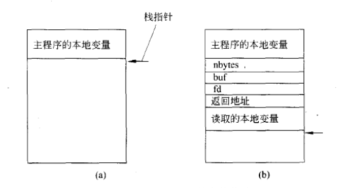

一般为阻塞send，因为如同本地方法调用一般，需要先执行完需要执行的函数，才执行之后的

### RPC通信机制

- 客户过程以正常的方式调用客户存根；
- 客户存根生成一个消息，然后调用本地操作系统；
- 客户端操作系统将消息发送给远程操作系统；
- 远程操作系统将消息交给服务器存根；
- 服务器存根调将参数提取出来，而后调用服务器；
- 服务器执行要求的操作，操作完成后将结果返回给服务器存根；
- 服务器存根将结果打包成一个消息，而后调用本地操作系统；
- 服务器操作系统将含有结果的消息发送给客户端操作系统；
- 客户端操作系统将消息交给客户存根；
- 客户存根将结果从消息中提取出来，返回给调用它的客户存根。

#### 存根

在传统系统当中，read例程由链接器从库中提取出来，然后插入到目标程序当中。

而在RPC当中，当read实际上是一个远程过程时（位于文件服务器所在机器上运行的过程），库中就放入read的另一个版本，即**客户存根**

**服务器存根**：客户存根的等价物

RPC语义允许客户机调用位于远程主机上的过程，就如同调用本地过程一样。原理为：

- 通过在客户端提供**存根**，RPC系统隐藏了允许通信发生的必要细节
  - 对于每个独立的远程过程都有一个存根。当客户机调用原厂过程时，RPC系统调用合适的存根，并传递远程过程的参数
  - 该存根位于服务器的端口，并编组参数（涉及将参数打包成可通过网络传输的形式），接着存根使用消息传递向服务器发送一个消息。
  - 服务器的一个类似存根接收这一消息，并调用服务器上的过程。如有必要，返回值可通过同样的技术返回客户机

#### XDR

如何处理客户机和服务器的数据表示的差别：

- 对于一个32位整数的表示，有的系统使用高内存地址以存储高字节，有的系统使用高内存地址以存储低字节
- 许多RPC系统定义了数据的机器无关表示，称为外部数据表示（XDR）
  - 在客户机端，参数编组涉及将机器有关数据在被发送到服务器前编组成XDR
  - 在服务器端，XDR数据将重新转换为服务器所用的机器有关表示

#### 确保执行

调用的语义问题

- 本地过程调用只有在极端情况下才可能失败。而由于普通网络错误，RPC可能会失败或重复多次执行。
- 利用操作系统确保一个消息刚好执行一次，而不是最多只执行一次。
  - 最多一次：为每个消息附加时间戳来做到。服务器对其处理的消息，必须有一个完整的或足够长的时间戳历史，以便能确保检测到重复消息
  - 刚好一次：需要消除服务器从未收到请求的风险。服务器首先执行“最多一次”协议，并且通知客户端已经接收到RPC且执行，利用ACK进行确认

#### 通信绑定

服务器与客户机的通信问题

- 对于标准过程调用，在连接、装入或执行时会出现一定形式的绑定，从而使过程名称被过程的内存地址所代替。
- RPC方案要求一个类似客户机和服务器端口的绑定，但是客户机如何知道服务器上的端口呢
  - 绑定信息以固定端口地址形式预先固定。
    - 编译时，RPC调用一个相应的固定端口，一旦编译后，服务器就不能改变请求服务的端口号。
  - 绑定通过集合点机制动态地进行。
    - 操作系统在一个固定RPC端口上提供集合点服务程序。客户机发送一个包括RPC的名称的消息给集合点服务程序，以请求它所需要执行的RPC端口地址。
    - 该端口号返回，RPC调用可发送到这一端口号直到进程终止。
    - 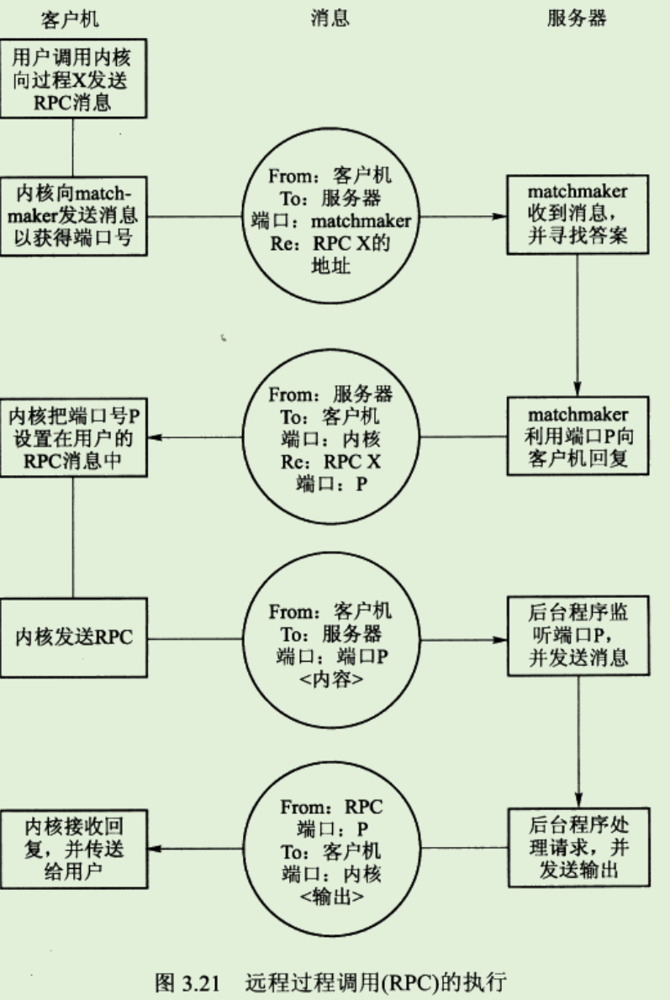


## RMI

RMI（Java的远程方法调用）

RMI允许线程调用远程对象的方法，如果对象位于不同的JVM上，那么就认为它是远程的。

### RMI与RPC的不同

- RPC支持子程序编程，即只能调用远程的子程序或函数RMI是基于对象的，支持调用远程对象的方法
- RPC中远程过程的参数是普通数据结构，而RMI可以将对象作为参数传递给远程方法。

### 优缺

- RMI通过允许Java程序调用远程对象的方法，使得用户能够开发分布在网络上的Java应用程序。

### RMI通信机制

RMI采用**存根**和**骨干**实现远程对象。

- 存根为原厂对象的代理，驻留在客户机中。
  - 当客户机调用原厂方法时，远程对象的存根被调用。客户端存根负责创建一个包，具有服务器上要调用方法的名称和用于该方法的编排参数。
  - 存根将该包发送给服务器
- 远程对象的骨干负责接收包
  - 重新编排参数并调用服务器上所要执行的方法。
  - 骨干接着编排返回值（或异常），然后打包，将包返回给客户机
- 存根重新编排返回值，并传递给客户机

#### 参数传递规则

- 如果编排参数是本地（非远程）对象，那么通过对象串行化的技术来复制传递。如果参数也是远程对象，那么可通过引用传递
- 如果本地对象需要作为参数传递给远程对象，那么必须实现Serializable接口

### Java实现

- **IService接口：**

```Java
package com.king.rmi;

import java.rmi.Remote;
import java.rmi.RemoteException;

public interface IService extends Remote {
    //声明服务器端必须提供的服务
    String service(String content) throws RemoteException;
}
```

- **ServiceImpl实现类：**

```Java
package com.king.rmi;

import java.rmi.RemoteException;
import java.rmi.server.UnicastRemoteObject;

// UnicastRemoteObject用于导出的远程对象和获得与该远程对象通信的存根。
public class ServiceImpl extends UnicastRemoteObject implements IService {

    private String name;

    public ServiceImpl(String name) throws RemoteException {
        this.name = name;
    }

    @Override
    public String service(String content) {
        return "server >> " + content;
    }
}
```

- **Server类：**

```Java
package com.king.rmi;

import java.rmi.Naming;
import java.rmi.registry.LocateRegistry;

public class Server {
    public static void main(String[] args) {
        try {
            // 实例化实现了IService接口的远程服务ServiceImpl对象
            IService service02 = new ServiceImpl("service02");

            // 本地主机上的远程对象注册表Registry的实例，并指定端口为8888，这一步必不可少（Java默认端口是1099），必不可缺的一步，缺少注册表创建，则无法绑定对象到远程注册表上
            LocateRegistry.createRegistry(8888);

            // 把远程对象注册到RMI注册服务器上，并命名为service02
            //绑定的URL标准格式为：rmi://host:port/name(其中协议名可以省略，下面两种写法都是正确的）
            Naming.bind("rmi://localhost:8888/service02",service02);
        } catch (Exception e) {
            e.printStackTrace();
        }

        System.out.println("服务器向命名表注册了1个远程服务对象！");
    }
}
```

- **Client类：**

```Java
package com.king.rmi;

import java.rmi.Naming;

public class Client {
    public static void main(String[] args) {
        String url = "rmi://localhost:8888/";
        try {
            // 在RMI服务注册表中查找名称为service02的对象，并调用其上的方法
            IService service02 =(IService) Naming.lookup(url + "service02");

            Class stubClass = service02.getClass();
            System.out.println(service02 + " 是 " + stubClass.getName() + " 的实例！");
            // 获得本底存根已实现的接口类型
            Class[] interfaces = stubClass.getInterfaces();
            for (Class c : interfaces) {
                System.out.println("存根类实现了 " + c.getName() + " 接口！");
            }
            System.out.println(service02.service("你好！"));
        } catch (Exception e) {
            e.printStackTrace();
        }
    }
}
```

各个类的交互时序如下图：

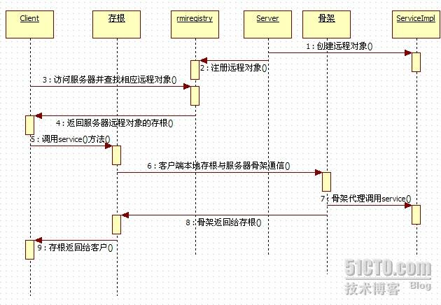

# 进程同步

## 同步互斥

同步互斥是OS当中协调进程之间动作和相互关系之间的机制。

## 背景

并发基础的正确性

- 独立进程
  - 不和其他进程共享资源或状态
  - 确定性：输入状态决定结果
  - 可重现：能够重现其实条件
  - 调度顺序不重要
- 并发进程
  - 在多个进程间有资源共享
  - 不确定性
  - 不可重现
- 并发进程的正确性
  - 执行过程是不确定性和不可重现的
  - 程序错误可能是间歇性发生的

进程并发执行的好处

- 进程需要与计算机中的其他进程和设备进行协作
- 好处1：共享资源
  - 多个用户使用同一台计算机
  - 银行账户存款余额在多ATM上操作
- 好处2：加速
  - IO操作与CPU计算并行
  - 程序可以划分为多个模块放在多个处理器上并行执行
- 好处3：模块化
  - 将大程序分解为小程序
  - 使系统易于复用与扩展

并发创建新进程时的标识分配

- 程序可以调用函数fork来创建一个新的进程
  - 操作系统需要分配一个新的并且唯一的进程PID
  - new_pid=next_pid++;
    - 读取值
    - 写入值
    - 即不是原子操作
    - 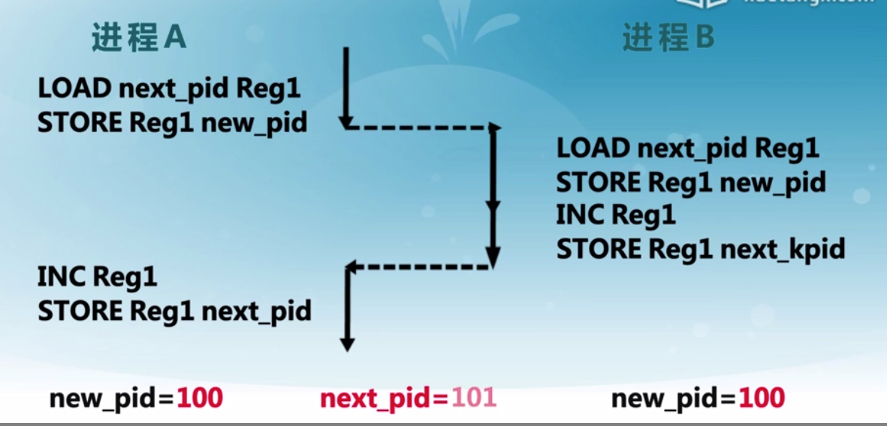

### 原子操作

- 原子操作时指一次不存在任何中断或失败的操作
  - 要么操作成功执行
  - 要么操作没有执行
  - 不会出现部分执行的状态
- 操作系统需要利用同步机制在并发执行的同时，保证一些操作时原子操作

## 现实生活的同步问题

进程间的交互关系：相互感知程度

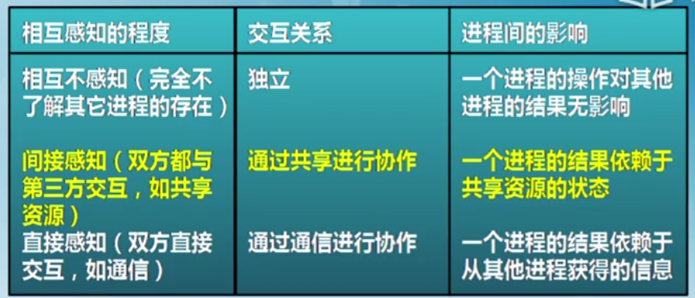

三种关系：

- 互斥
  - 一个进程占用资源，其他进程不能使用
- 死锁
  - 多个进程各自占用部分资源，形成循环等待
- 饥饿
  - 其他进程可能轮流占用资源，一个进程一直得不到资源

## 临界区

临界区：进程中访问临界资源的一端需要互斥执行的代码

进入区：

- 检查可否进入临界区的一段代码
- 如可进入，则设置正在访问临界区标志

退出区：清除正在访问临界区标志

**临界区的访问规则**

- 空闲则入
  - 没有进程在临界区时，任何进程可进入
- 忙则等待
  - 与进程在临界区时，则其他进程均不能进入临界区
- 有限等待
  - 等待进入临界区的进程不能无限制等待
- 让权等待
  - 不能进入临界区的进程，应当释放CPU

不同临界区实现机制的比较

- 性能：并发级别

### 禁用硬件中断的同步方法

- 没有中断，没有上下文切换，因此没有切换
  - 硬件将中断处理延迟到中断被启用之后
  - 现代OS都提供指令来实现禁用中断
- 进入临界区
  - 禁止所有中断，并保存标志
- 退出临界区
  - 使能中断

**缺点**

- 禁用中断后，进程无法被停止
  - 整个系统都会为此停下来
  - 可能导致其他进程处于饥饿状态
- 临界区可能很长
  - 无法确定响应中断所需的时间
- 要小心使用，只在不用的时候才用

### 基于软件的同步方法

在两个进程间，通过对共享变量的访问实现同步

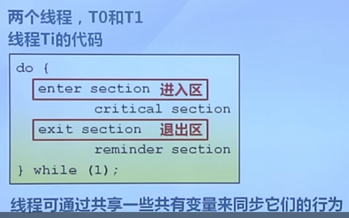

#### Peterson算法

- 满足线程T0与T1之间互斥的经典的基于软件的解决方案
- 共享变量
  - 
- 进入区代码
  - 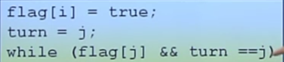
  - turn=，是写操作，是原子性的
- 退出区代码
  - flag[i]=false

基于软件的解决方法分析

- 复杂
  - 需要两个进程间共享数据
- 需要忙等待
  - 浪费CPU时间

### 高级抽象的同步方法

基于硬件的同步原语

- 硬件提供了一些同步原语
  - 中断禁用、原子操作指令等
- 操作系统提供更高级的编程抽象来简化进程同步
  - 锁、信号量等
  - 使用硬件原语来构建
  - 简化进程同步

#### 锁

锁是一个抽象的数据结构

- 一个二进制变量（锁定、解锁）
- Lock::Acquire()
  - 锁被释放前一直等待，然后得到锁
- Lock::Release
  - 释放锁，唤醒任何等待的进程

#### 原子操作指令

- 现代CPU体系结构当中都提供一些特殊的原子操作指令
  - 这些指令将若干个操作合成一个原子操作
- 测试和置位（Test and Set）TS指令
  - 从内存单元中读取值
  - 测试该值是否为1（然后返回真或假）
  - 内存单元设置为1
  - 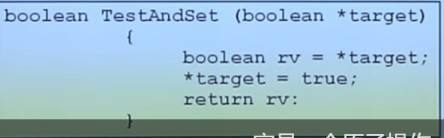
- 交换指令
  - 交换内存中的两个值
  - 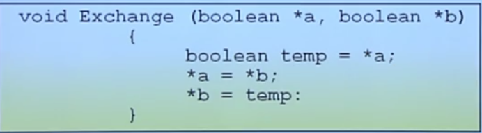

**使用TS指令实现自旋锁**

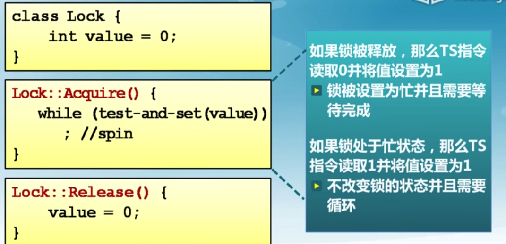

线程在等待的时候消耗CPU时间

**无忙等待锁**

增加一个等待队列

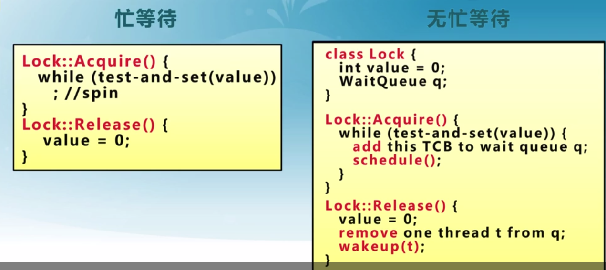

原子操作指令锁的**特征**

- 优点
  - 适用于单处理器或者共享主存的多处理器中任意数量的进程同步
  - 简单且容易证明
  - 支持多临界区
- 缺点
  - 忙等待消耗CPU时间
  - 可能导致饥饿
    - 进程离开临界区时有多个等待进程的情况
  - 死锁
    - 用于临界区的低优先级进程
    - 请求访问临界区的高优先级进程获得处理器并等待临界区

### 同步方法总结

- 锁是一种高级的同步抽象方法
  - 互斥可以使用锁来实现
  - 需要硬件支持
- 常用的三种同步实现方法
  - 禁用中断。仅限于单处理器
  - 软件。复杂
  - 原子操作指令。使用最多，容易验证。

## 信号量

- 信号量是操作系统提供的一种协调共享资源访问的方法
  - 软件同步是平等线程间的一种同步协商机制
  - OS是管理者，地位高于进程，即一个仲裁者
  - 用信号量表示系统资源的数量
- 早期的操作系统的主要同步机制

信号量

- 是一种抽象数据结构
  - 由一个整数变量sem和两个原子操作组成
  - P操作
    - sem-1
    - 如sem<0，进入等待，否则在继续
  - V操作
    - sem+1
    - 如sem<=0，唤醒一个等待进程
- 是被保护的整数变量
  - 初始化完成后，只能通过P和V操作修改
  - 由操作系统保证，PV操作是原子操作
    - OS高于进程，是管理者，不会受到进程干扰
- P可能阻塞，V不会阻塞
- 通常假定信号量是个屁的
  - 线程不会被无限期阻塞在P操作
  - 假定信号量等待按先进先出排队

实现

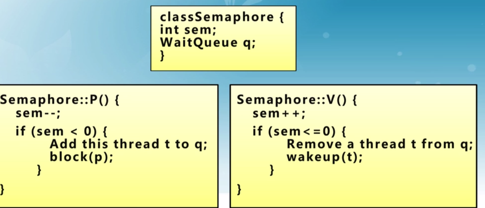

信号量分类

- 二进制信号量：资源数目为0或1
- 资源信号量：资源数目为任何非负值
- 两者等价
  - 基于一个可以实现另一个

### 信号量的使用

- 互斥访问
  - 临界区的互斥访问控制
- 条件同步
  - 线程间的事件等待

**互斥访问**

每类资源设置一个信号量，其初值为1.

- 必须成对使用P操作与V操作

**条件同步**

条件同步设置一个信号量，其初值为0

一个线程进行V操作，一个线程进行P操作实现同步协作。

**信号量的困难**

- 读/开发代码比较困难
- 容易出错
  - 使用的信号量已经被另一个线程占用等
- 不能处理死锁问题，在写程序中解决

## 管程

改进信号量在处理临界区的一些麻烦，解决PV操作的配对

- 管程是一种用于多线程互斥访问共享资源的程序结果
  - 采用面向对象方法，简化了线程间的同步控制
  - 任一时刻最多只有一个线程执行管程代码
  - 正在管程中的线程可以临时放弃管程的互斥访问，等待事件出现时恢复。
    - 一个赛道上，只有一辆赛车可以跑，赛车加燃料期间，可以让另一辆车进场
- 管程的使用
  - 在对象/模块中，收集相关共享数据
  - 定义访问共享数据的方法
- 管程的组成
  - 一个锁
    - 控制管程代码的互斥访问
  - 0或多个条件变量
    - 管理共享数据的并发访问
  - 条件变量：
    - 是管程内的等待机制
    - 进入管程的线程因资源被占用而进入等待状态
    - 每个条件变量表示一种等待原因，对应一个等待队列
  - wait操作
    - 将自己阻塞在等待队列中
    - 唤醒一个等待者或释放管程的互斥访问
  - signal操作
    - 将等待队列中的一个县城唤醒
    - 如果等待队列为空，则等于空操作
  - 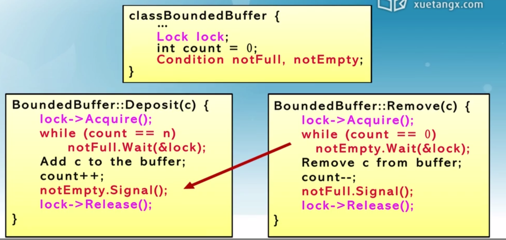

两种不同的管程

真实系统中常用hansen管程（当前执行的管程更具有优先权，要在当前执行管程放弃使用权后，才转移），少一次切换。

Hoare管程行为确定性更好

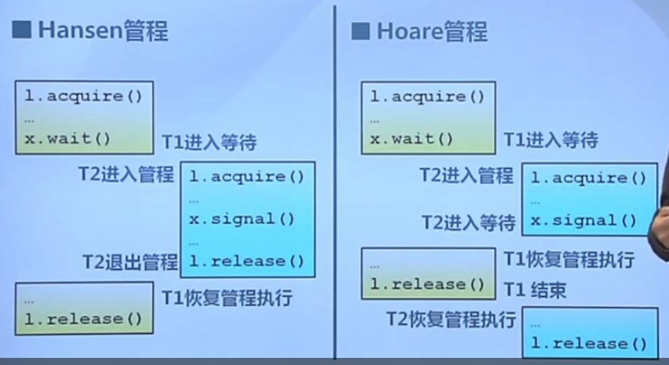

## 生产者消费者问题

有界缓冲区的生产者-消费者问题

- 一个或多个生产者在生成数据后放在一个缓冲区里
- 单个消费者从缓冲区取出数据处理
- 任何时刻只能有一个生产者或消费者进入缓冲区

问题分析

- 任何时刻只能有一个线程操作缓冲区 ： 互斥访问
- 缓冲区空时，消费者必须等待生产者 ： 条件同步
- 缓冲区满时，生产者必须等待消费者 ： 条件同步

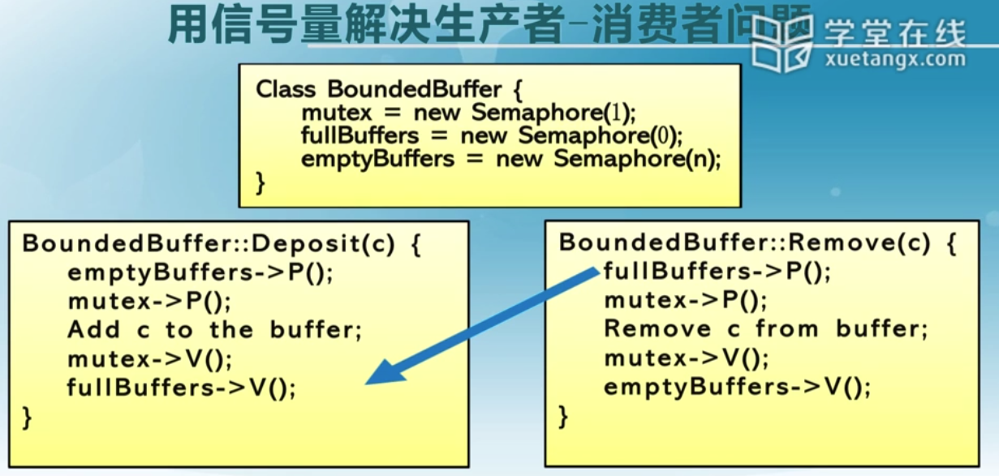

### 哲学家就餐问题

问题描述：

- 5个哲学家围绕一张圆桌而坐
  - 桌子上放着5支叉子
  - 每两个哲学家之间放一支
- 哲学家的动作包括思考和进餐
  - 进餐时需同时拿到左右两边的叉子
  - 思考时将两支叉子放回原处

**信号量**

偶数号先右后左，奇数先左后右，因此不会构成环路

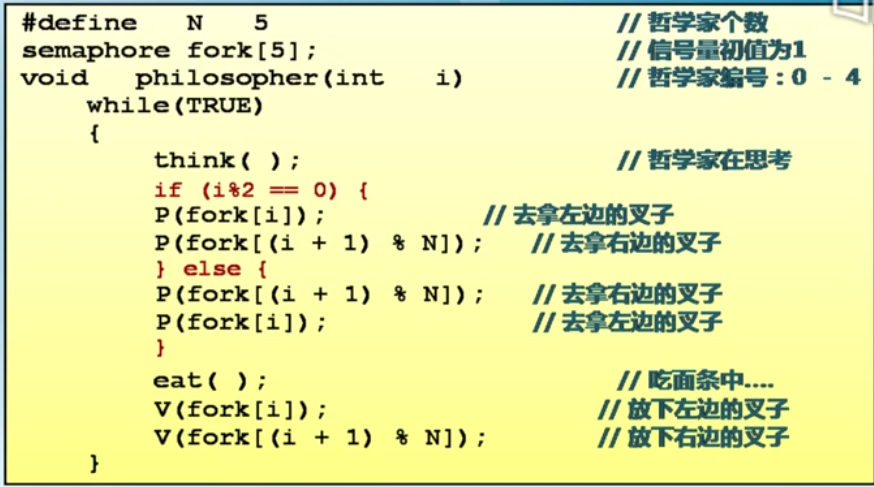

### 读者-写者问题

问题描述：

- 共享数据的两类使用者
  - 读者：只读取数据，不修改
  - 写者：读取和修改数据
- 问题描述：对共享数据的读-写
  - 读 - 读 允许
    - 同一时刻运行有多个读者同时读
  - 读-写 互斥
    - 没有写者时读者才能读
    - 没有读者时，写者才能写
  - 写-写 互斥

**信号量**

- 用信号量描述每个约束
  - 信号量WriteMutex
    - 控制读写操作的互斥
    - 初始化为1
  - 读者计数Rcount
    - 正在进行读操作的读者数目
  - 信号量CountMutex
    - 控制对读者计数的互斥修改
    - 初始为1

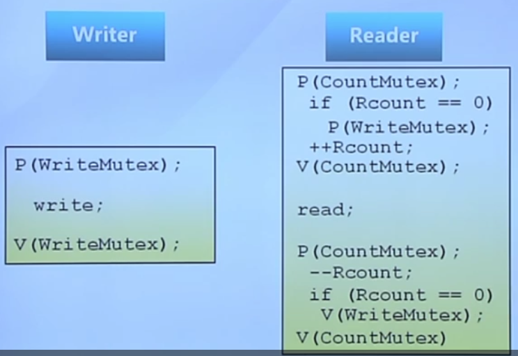

# 总结


# 参考 #

1. [远程过程调用(RPC)详解](<https://waylau.com/remote-procedure-calls/>)
