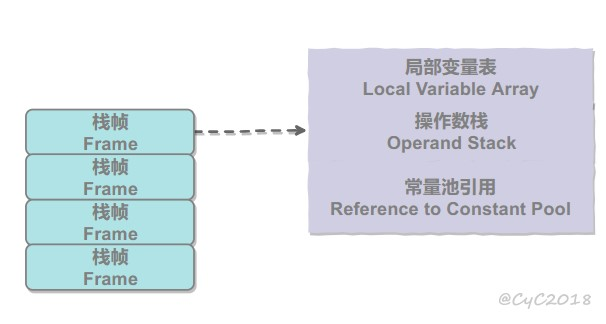

title: JVM（2）：内存管理
type: tags
tags:

  - JVM
date: 2019-03-01 10:45:42
categories: Java
description:

# java内存区域与内存溢出异常

Java将内存扩展的权利交给了jvm，虚拟机自动内存管理机制的帮助下，不再需要为每个new操作写配对的delete/free代码，不容易出现内存泄露与内存溢出问题。如果出现问题，如果不了解JVM如何使用内存，那么排查错误将会成为一项异常艰难的工作。

## 运行时数据区域

- Java虚拟机在执行Java程序的过程中，会将它管理的内存划分为若干个不同的数据区域
- 区域有各自的用途、创建时间、销毁时间。
- 有的区域随着虚拟机进程的启动而存在，有的区域随着用户线程的启动和结束而建立和销毁

区域包括


### 方法区

- 各个线程共享的内存区域，用于存储已被虚拟机加载的类信息、常量、静态变量、class文件、即时编译器编译后的代码等数据
- 垃圾回收器也会对这部分进行回收，如常量池的清理和类型的卸载
- Non-Heap、永久代
- **运行时常量池**（方法区的一部分）
  - 存放编译期生成的各种字面量和符号引用

### 堆

- 虚拟机管理的内存中最大的一块，在虚拟机启动时创建，所有线程共享
- 存放对象实例，几乎所有对象实例都在这里分配内存
- 垃圾收集器管理的主要区域，也称为GC堆
  - 从内存回收的角度，使用分代收集算法
  - 堆可分为新生代和老年代
  - Eden空间、From Survivor空间、To Survivor空间
- 从内存分配的角度
  - 划分出多个线程私有的分配缓冲区TLAB
- 当堆无法再扩展OutOfMemoryError

### 虚拟机栈

- 线程私有，生命周期与线程相同

- 描述Java方法执行的内存模型（栈内存）

  - 每个方法在执行的同时都会创建一个栈帧用于存储局部变量表、操作数栈、动态链接、方法出口等信息。一个方法从调用至完成则对应一个栈帧在虚拟机栈入栈到出栈
  - 方法体内的局部变量（其中包括基础数据类型、对象的引用）

- 线程请求栈深度大于虚拟机允许深度，StackOverflowError异常

- 大部分虚拟机允许动态扩展，如果扩展无法申请到足够内存，则OutOfMemoryError

  

  

### 本地方法栈

- 虚拟机使用到的Native方法服务，不一定是Java实现的

### 程序计数器

- 一块较小的内存空间（线程私有）

  - 如果共享，则无法准确的执行当前线程需要执行的语句

- 执行本地方法时，值为undefined

- 当前线程所执行的字节码的行号指示器，字节码解释器工作时通过改变这个计数器的值来选取下一条需要执行的字节码指令

  - 分支、循环、跳转、异常处理、线程恢复等基本功能
- CPU通过时分复用实现多线程，对确定时刻，一个CPU只会执行一条线程中的指令。每个线程都有一个独立的程序计数器。

### 直接内存

- 不是虚拟机运行时数据区的一部分，也不是JVM定义的内存区域
- NIO，基于通道与缓冲区的IO方式，使用Native函数库直接分配堆外内存，通过一个堆中的对象引用
  - 避免了在Java堆与native堆中来回复制
- 不受Java堆大小限制，受本机总内存等限制

## Hotspot虚拟机对象揭秘

虚拟机内存中的数据如何创建、如何布局、如何访问等问题

揭秘Hotspot虚拟机在Java堆中对象分配、布局和访问全过程

### 对象的创建

对于普通的Java对象，不包括数组和Class对象

- 虚拟机遇到一条new指令，检查这个指令的参数是否能在常量池中定位到一个类的符号引用，并且检查一个符号引用代表的类是否已经被加载、解析和初始化过
- 如果没有，则必须先执行相应的类加载过程
- 为新生对象分配内存，所需内存在类加载完成后便可完全确定。将一块大小确定的内存从Java堆当中划分出来
  - 划分内存的方法
  - 指针碰撞：Java堆中内存绝对规整（所有已用在一边，空闲在另一边），中间一个指针作为分界点的知识点，即将指针向空闲移动一段距离
  - 空闲列表：内存不规整，维护一个记录可用内存的列表，分配一个足够大的空间
  - 内存是否规整由垃圾收集器是否带有压缩整理的功能决定
- 分配内存空间可能存在线程安全问题
  - 对分配内存空间的动作做同步处理
    - CAS配失败重试的方法
  - 把内存分配的动作按线程划分在不同的空间中进行
    - 每个线程在Java堆中预先分配一小块内存，称为本地线程分配缓冲（TLAB），线程在各自的TLAB上分配内存。当TLAB用完，才需要同步锁定。
- 虚拟机将分配到的内存空间初始化为0（不包括对象头）
- 对对象进行必要的设置，存放在对象头中。如对象是哪个类的实例、如何找到类的元数据信息、对象的哈希码、对象的GC分代年龄等信息。根据JVM当前运行状态不同，是否启用偏向锁等。
- 对象进行init，进行构造

### 对象的内存布局

dioxide造内存中存储的布局分为三部分

- 对象头
  - 存储对象自身的运行时数据。哈希码、GC分代年龄、锁状态标志、线程持有的锁、偏向线程ID、偏向时间戳等。
  - 类型指针。对象指向它类元数据的指针，JVM通过这个指针来确定这个对象是那个类的实例
    - 并不是所有JVM都实现，即查找对象的元数据不一定经过对象本身
  - 如果是数组，则记录数组长度的数据
- 实例数据
  - 对象真正存储的有效信息
  - 存储顺序受虚拟机分配策略参数与字段在Java源码中定义顺序的影响
    - longs/double、ints、shorts/chars、bytes/booleans、oops。相同宽度的字段被分配到一起
    - 父类变量会出现在子类前（CompactFields为true（默认），子类中较窄的遍历也可能插入到父类变量的空隙中）
- 对齐填充
  - 并不必然存在，起到占位符作用
  - Hotspot自动内存管理相同要求对象的其实对这必须为8字节的整数倍

### 对象的访问定位

Java程序需要通过栈上的reference数据来操作堆上的具体对象。

解释引用通过何种方式去定位、访问堆中的对象的具体位置。依据JVM实现而定

- 句柄
  - Java堆当中划分一块内存作为句柄池，reference中存储的是对象的句柄地址
  - 句柄中包含了对象实例数据域类型数据各自的地址信息
  - 稳定的句柄地址，即使对象被移动（垃圾收集时，非常普遍），也不会修改reference
  - 
- 直接指针
  - reference存储的就是对象地址
  - Java堆对象的布局中需要考虑如何放置访问类型数据的相关信息
  - 速度快，节约一次指针定位，对于非常频繁的对象访问有较好的提升。Hotspot使用的方式
  - 

# 垃圾收集器与内存分配策略

## 概述

垃圾收集GC需要完成的三件事情：

- 哪些内存需要回收
- 什么时候回收
- 如何回收

无需关注的内存：对于程序计数器、虚拟机栈、本地方法栈。随线程而生灭，一个栈帧内分配多少内存基本上在类结果确定下来就已知，因此内存分配与回收都具备确定性。并且方法结束或者线程线束，内存就回收了。

GC关注的内存：对于Java堆和方法区，一个接口中的多个实现类需要的内存可能不一样，一个方法中多个分支需要的内存也可能不一样，只能在程序运行期间才能知道会创建哪些对象，分配与回收都是动态的。

## 对象是否存活

GC在对堆进行回收前，要确定这些对象中哪些还存活着，哪些已经死去（不可能再被任何途径使用的对象）

### 引用计数算法

定义：为对象添加一个计数器，每当有一个地方引用它时，计数器就++，引用失效时，计数器--

优点：实现简单、判定效率高

缺陷：难以解决对象间相互循环引用的问题

```Java
objA.instance=objB;
objB.instance=objA;
//相互引用，导致无法回收
```

### 可达性分析算法

Java等语言的主流实现

基本思想：

- 通过一系列称为GC Roots的对象作为起始点，从这些结点开始向下搜索，走过的路径称为引用链

- 一个对象到GC Roots没有任何引用链，即不可达，则对象不可用

- GC Roots对象：

  - 虚拟机栈中引用的对象
  - 方法区中类静态属性引用的对象
  - 方法区中常量引用的对象
  - 本地方法栈当Native方法引用的对象

- 

  


### 引用

判断对象是否存活均与引用有关

- 强引用
  - 指在程序代码中还普遍存在，类似“Object o=new Object()”的引用，只要强引用还存在，则永不回收
- 软引用
  - 描述还有用，但并非必须的对象。在系统将内存溢出异常前，会将这些对象进行第二次回收。如果还没有足够内存，才会异常。
  - 以SoftReference类实现软引用
- 弱引用
  - 描述非必须对象，强度弱于软引用只能生存到下一次垃圾回收前
  - WeafReference实现
- 虚引用
  - 最弱的引用关系，无法通过虚引用获得一个对象的实例
  - 唯一母的是能在这个对象被回收时收到一个系统通知
  - PhantomReference实现

### 生存还是死亡

要宣告一个对象死亡，至少要经历两次标记过程

- 如果在可达性分析中，发现无连接，则进行第一次标记以及第一次筛选

- 第一次筛选，条件为此对象是否有必要执行finalize方法。

  - 没有必要执行的情况：

    - 对象没有覆盖finalize方法
    - finalize方法已经被虚拟机调用过

  - 有必要执行

    - 将对象放置在一个F-Queue队列，并在稍后由一个虚拟机自动建立，低优先级的finalizer线程去执行
    - 执行：虚拟机会触发这个方法，但并不承诺会等待它允许结束

      - 防止一个对象在finalize执行缓慢，或者死循环，使得其他对象等待
    - GC对F-Queue中对象进行第二次小规模标记，
    - finalize是对象最后一次自救机会，如果对象此时与引用链上一个对象建立关联，则此时将被移出“即将回收”集合

### 回收方法区

永久代的垃圾回收效率非常低

回收内容：

- 废弃常量
  - 常量池存在“abc”，无String引用引用，则为废弃常量
- 无用的类
  - 该类所有实例都被回收
  - 加载该类的ClassLoader被回收
  - 该类对应的Class对象没有被引用，无法通过反射访问该类的方法

## 垃圾回收算法

垃圾回收算法

### 标记-清除算法 Mark-Sweep

最基础的算法，算法分为标记与清除两个阶段

- 标记出所有需要回收的对象，在标记完成后统一回收被标记的对象

不足：

- 效率低下
- 清除后会产生大量不连续的内存碎片

### 复制算法

解决效率问题

将可用内存按容量划分为两块，每次使用一块，一块内存使用完后，将其复制到另一块，然后回收

用于回收新生代

- 新生代对象98%朝生夕死，因此将内存分为一块较大的Eden空间与两块较小的Survivor空间（8：1）。
- 每次使用Eden空间与一块Survivor空间
- 当Survivor空间不够时，依赖其他内存（老年代）进行分配担保

### 标记-整理算法 Mark-Compact

标记过后，让所有存活的对象都向一端移动，然后清理端边界外的内存

### 分代收集算法

**实际采用的算法**

根据对象存活周期的不同将内存划分为几块：新生代、老年代

根据各个年代的特点采用适当的收集算法，新生代：复制算法，老年代：标记-清理（整理）算法

## HotSpot算法实现

以上是理论实现，而虚拟机高效允许需要对算法的执行效率进行严格的考量

### 枚举根节点

帮助快速准确完成GC Roots枚举

困难

- GC Roots的节点非常多，逐个检查引用需要小号非常多的时间
- GC停顿问题（GC进行时必须停顿所有执行线程），必须在一个确保一致性（整个执行系统冻结在某个时间节点，不可以出现在分析过程中，引用关系还在不断变化）的快照中进行

主流JVM使用准确式GC，当执行系统停顿下来，并不需要一个不漏检查完所有的引用位置，应当有办法直接得知哪些地方存放着对象引用

HotSpot使用OopMap达到目的，在类加载完成时，HotSpot将对象内什么偏移量是什么类型数据计算出来，在JIT编译时也会在特点位置记录栈和寄存器哪些位置是引用。

**OopMap数据解构**： 保存`GC Roots` 节点，避免全局扫描去一一查找。

### 安全点

- 引用关系可能变化，OopMap内容变化指令非常多，如果为每一条指令生成对应的OopMap则需要大量空间
  - 程序执行时只有在到达**安全点**时才能暂停，进行GC。
  - **安全点的选择**：以是否具有让程序长时间执行的特征为标准选定。即指令序列复用，如方法调用、循环跳转、异常跳转等
- 如何在GC发生时，让所有线程都跑到最近的安全点再停顿
  - 抢先式中断（几乎JVM使用）
    - GC发生时，首先把所有线程中断，如果线程不在安全点，就恢复线程，让它跑到安全点
  - 主动式中断
    - 当GC需要中断时，不直接对线程操作，设置一个标志（与安全点重合），各个线程执行时轮询这个标志，如果为真则自己中断挂起

### 安全区域

- 对于不执行的程序，如挂起或者blocked状态，无法响应中断请求，走到安全点。
  - 安全区域：在一段代码片段中，引用关系不会发生变化。则在这个区域的任意地方开始GC都是安全的
  - 当线程执行到安全区域时，标识自己已经进入安全区域，当JVM发生GC时，不用管已经标识的线程。当线程离开时，需要检查系统是否完成GC，如果完成则继续执行，否则继续等待

## 垃圾收集器

**并行和并发概念补充：**

- **并行（Parallel）** ：指多条垃圾收集线程并行工作，但此时用户线程仍然处于等待状态。
- **并发（Concurrent）**：指用户线程与垃圾收集线程同时执行（但不一定是并行，可能会交替执行），用户程序在继续运行，而垃圾收集器运行在另一个CPU上。

内存回收的具体实现


存在连线，则说明可以搭配使用。所处区域，说明属于新生代还是老年代收集器

为了对具体应用最合适的收集器

### Serial收集器

Serial （Old）收集器是最基本最古老的收集器，是一个单线程收集器，并且在它进行垃圾回收时，必须暂停所有的用户线程。

- Serial是针对新生代收集器，采用copying算法
- Serial Old针对老年代，采用Mark-Compact算法
- 简单高效，但是给用户带来停顿，client模式下默认的新生代收集器

### Serial Old收集器

### ParNew收集器

是Seial收集器的多线程版本

- 除了serial收集器外，只有它可以与CMS收集器配合工作

### ParNew Old收集器

是老年代版本，采用Mark-Compact

### Parallel Scavenge收集器

是新生代的多线程收集器，它在回收期间不需要暂停其他用户线程，采用Copying算法，它主要是为了达到一个可控的吞吐量

停顿时间与吞吐量是矛盾的

- GC时，垃圾回收的工作总量是不变的
  - 停顿时间减少，则频率提高，
  - 频率提高，则频繁进行GC，即吞吐量降低，性能降低

### CMS收集器

以获取最短回收停顿时间为目标的收集器，重视服务的响应速度，希望系统停顿时间最短，给用户带来体验，是一种并发收集器，采用Mark-Sweep（标记清除）算法

运作过程

- 初始标记
  - 需要stop the world
  - 仅仅只标记一下GC Roots能**直接关联**到的对象，速度较快
- 并发标记
  - 进行GC Roots Tracing
  - 耗时长，但可以与用户线程一起工作，但是会占用一定CPU资源，使得程序变慢
- 重新标记
  - 需要stop the world
  - 修正并发标记期间因用户程序继续运作而导致标记产生变动的那一部分对象的标记记录
- 并发清除

缺点：

- 对CPU资源非常敏感。
  - 会占用CPU资源，使得程序变慢，总吞吐量降低。默认线程数是(CPU数+3)/4，即在CPU4个以上，获得至少25%的CPU资源，当CPU不足4时，对用户程序影响较大。当CPU负载比较大，则分出一半运算能力会使得用户程序执行速度降低一半。
- 无法处理浮动垃圾，可能出现Concurrent Mode Failure失败而导致另一次Full GC（进行全部GC，老年代临时使用Serial Old收集器）的产生
  - 由于用户线程依然运行，可能产生新的垃圾。这部分垃圾产生在标记过程后，只能在下一次GC清理，即浮动垃圾
  - 由于在垃圾收集时，用户线程依然需要运行，则需要预留足够的内存给用户线程。设定合理的阈值，减少FULL GC出现的机会
  - 空间碎片

### G1收集器

当前收集器最前沿的成果，面向服务端应用的收集器，能充分利用多CPU、多核环境。因此是一款并行和并发收集器，并能建立可预测的停顿时间模型。

G1特点：

- 并行与并发
  - 能充分利用CPU、多核环境下的硬件优势，缩短Stop The World停顿时间，可以以并发使得Java程序继续执行
- 分代收集
- 空间整合
  - 整体上是标记整理算法实现，局部（两个区域Region间）上是基于复制算法，不会产生内存碎片，导致提取GC
- 可预测的停顿
  - 低停顿，并可建立可预测的停顿时间模型，能让使用者明确指定一个长度为M毫秒的时间片段内，消耗在垃圾收集上的时间不得超过N毫秒
  - 实时Java的垃圾回收器特征
  - 原因：
    - 可以有计划地避免在整个Java堆当中进行全区域的垃圾收集。跟踪各个Region的垃圾堆积的价值大小（回收所获得的空间大小以及需要的时间），在后台维护一个优先列表，根据允许的时间，优先回收价值最大的Region
  - Region困难
    - 垃圾回收不能真的以Region为单位，因为一个对象存放在Region中，它可以与整个Java堆中任意对象发生引用关系。在可达性判断时，扫描困难，需要对整个堆扫描
    - 使用Remembered Set避免全堆扫描，每个Region都有一个与之对应的Remembered Set，对引用类型数据进行写操作时，产生一个Write Barrier暂时中断，判断是否引用的对象处于不同的Region中，如果是，则通过CardTable把相关引用信息记录到该Region的Remembered Set中，在可达性分析中加入该Remembered Set。

G1将Java堆的内存布局划分为多个大小相等的独立区域（Region），保留新生代、老年代概念，但是不物理隔离，都是一部分Region的集合。

G1的步骤

- 初始标记
- 并发标记
- 最终标记
- 筛选回收

### 理解GC日志

## 内存分配与回收策略

Java的自动内存管理自动化解决了两个问题

- 给对象分配内存
  - 主要分配在新生代的Eden区
  - 如果启动了本地线程分配缓冲，将线程优先在TLAB上分配
  - 少数情况直接分配到老年代中
  - 分配规则取决于当前使用哪一种垃圾回收器组合，还要虚拟机中与内存相关的参数的设置
- 回收分配给对象的内存

### 什么时候进行GC

MinGC

- 新生代当中的垃圾收集动作，采用复制算法
- 对于较大的对象，在Minor GC时候，直接进入老年代

FullGC

### 对象优先在Eden分配

大多数情况，对象在新生代Eden区分配。当Eden区没有足够空间进行分配时，虚拟机将发起一次Minor GC

- 新生代GC（Minor GC）指发生在新生代的垃圾回收动作，因为Java对象大多具备朝生夕死的特性，所以该GC频繁，且速度快
- 老年代GC（Major GC/Full GC）指发生在老年代GC，比新生代GC慢10倍以上

### 大对象直接进入老年代

大对象：需要大量连续内存空间的Java对象，例如很长的字符串与数组

经常出现大对象容易导致内存还有不少空间时就需要提前触发垃圾收集以获得连续空间

### 长期存活的对象进入老年代

虚拟机为每个对象定义了一个对象年龄Age计数器，每经过一次Minor GC则age+1，当达到15（MaxTenuringThreshold设置）则升级到老年代

### 动态对象年龄判定

为了更好适应不同程序内存情况，并不是永远要求年龄到达阈值才能晋升老年代，如果在Survivor空间中相同年龄所有对象大小总和大于空间的一般，年龄大于等于该年龄的对象就可以直接进入老年代

### 空间分配担保

- 在发生Minor GC前，虚拟机会先检查老年代最大可用的连续空间是否大于新生代所有对象总空间。
  - 如果大于，则Minor GC可以确保安全
  - 如果不大于，则虚拟机查看HandlePromotionFailure设置值是否允许担保失败
    - 允许，则继续检查老年代最大可用的连续空间是否大于历次晋升到老年代对象的平均大小
      - 如果大于则尝试进行Minor GC,尽管有风险
      - 如果小于，或者HandlePromotionFailure不允许冒险，则进行一次Full GC

## JVM分析

### 内存泄漏

***定义***

内存泄漏就是存在一些被分配的对象，有两个特点

- 在可达性分析时可达，即无法被GC回收
- 这些对象是无用的，即程序以后不会再使用这些对象。但占有着内存。

***原因***

- 长生命周期的对象持有短生命周期对象的引用就很可能发生内存泄漏，尽管短生命周期对象已经不再需要，但是因为长生命周期持有它的引用而导致不能被回收，这就是Java中内存泄漏的发生场景

#### 工具

- MemoryAnalyzer。Java堆转储文件分析工具，帮助发现内存漏洞和减少内存消耗
- EclipseMAT。开源Java内存分析软件，查找内存泄漏，能容易找到大块内存并验证谁在一直占用它
- JProbe。分析Java的内存泄漏

#### 示例

***集合类泄漏***

像HashMap、Vector等的使用最容易出现内存泄露，这些**静态变量**的生命周期和应用程序一致，他们所引用的所有的对象Object也不能被释放，因为他们也将一直被Vector等引用着。

如果是非静态，那么在方法执行结束时，由于vector=null释放，因此内部的对象也释放了。

```Java
Vector v = new Vector(10);
for (int i = 1; i < 100; i++) {
    Object o = new Object();
    v.add(o);
    o = null;   
}
```

我们仅仅释放引用本身，那么 Vector 仍然引用该对象，所以这个对象对 GC 来说是不可回收的。因此，如果对象加入到Vector 后，还必须从 Vector 中删除，最简单的方法就是将 Vector 对象设置为 null。

**当集合里面的对象属性被修改后，再调用remove()方法时不起作用。**

```Java
public static void main(String[] args){
	Set<Person> set = new HashSet<Person>();
	Person p1 = new Person("唐僧","pwd1",25);
	Person p2 = new Person("孙悟空","pwd2",26);
	Person p3 = new Person("猪八戒","pwd3",27);
	set.add(p1);
	set.add(p2);
	set.add(p3);
	System.out.println("总共有:"+set.size()+" 个元素!"); //结果：总共有:3 个元素!
	p3.setAge(2); //修改p3的年龄,此时p3元素对应的hashcode值发生改变

	set.remove(p3); //此时remove不掉，造成内存泄漏

	set.add(p3); //重新添加，居然添加成功
	System.out.println("总共有:"+set.size()+" 个元素!"); //结果：总共有:4 个元素!
	for (Person person : set)
	{
		System.out.println(person);
	}
}
```

***单例/静态变量造成的内存泄漏***

不正确使用单例模式是引起内存泄漏的一个常见问题，单例对象在初始化后将在JVM的整个生命周期中存在（以静态变量的方式），如果单例对象持有外部的引用，那么这个对象将不能被JVM正常回收，导致内存泄漏

```Java
class A{
	public A(){
		B.getInstance().setA(this);
	}
....
}

//B类采用单例模式
class B{
	private A a;
	private static B instance=new B();
	public B(){}
	public static B getInstance(){
		return instance;
	}
	public void setA(A a){
		this.a=a;
	}
//getter...
} 

```

***匿名内部类/非静态内部类***

内部类的引用是比较容易遗忘的一种，而且一旦没释放可能导致一系列的后继类对象没有释放。此外程序员还要小心外部模块不经意的引用，例如程序员A 负责A 模块，调用了B 模块的一个方法如： 
public void registerMsg(Object b); 

这种调用就要非常小心了，传入了一个对象，很可能模块B就保持了对该对象的引用，这时候就需要注意模块B 是否提供相应的操作去除引用。

***资源未关闭造成的内存泄漏***

如各种连接，包括数据库连接等。

比如数据库连接（dataSourse.getConnection()），网络连接(socket)和io连接，除非其显式的调用了其close（）方法将其连接关闭，否则是不会自动被GC 回收的，**因为这些连接是独立于JVM的**。

对于Resultset 和Statement 对象可以不进行显式回收，但Connection 一定要显式回收，因为Connection 在任何时候都无法自动回收，**而Connection一旦回收，Resultset 和Statement 对象就会立即为NULL**。但是如果使用连接池，情况就不一样了，除了要显式地关闭连接，还必须显式地关闭Resultset Statement 对象（关闭其中一个，另外一个也会关闭），否则就会造成大量的Statement 对象无法释放，从而引起内存泄漏。这种情况下一般都会在try里面去的连接，在finally里面释放连接，就能避免此类泄漏。

***监听器***

在java 编程中，我们都需要和监听器打交道，通常一个应用当中会用到很多监听器，我们会调用一个控件的诸如addXXXListener()等方法来增加监听器，但往往在释放对象的时候却没有记住去删除这些监听器，从而增加了内存泄漏的机会。

***ThreadLocal内存泄漏***

实际上 ThreadLocalMap 中使用的 key 为 ThreadLocal 的弱引用，弱引用的特点是，如果这个对象只存在弱引用，那么在下一次垃圾回收的时候必然会被清理掉。

所以如果 ThreadLocal 没有被外部强引用的情况下，在垃圾回收的时候会被清理掉的，这样一来 ThreadLocalMap中使用这个 ThreadLocal 的 key 也会被清理掉。但是，value 是强引用，不会被清理，这样一来就会出现 key 为 null 的 value。

ThreadLocalMap实现中已经考虑了这种情况，在调用 set()、get()、remove() 方法的时候，会清理掉 key 为 null 的记录。如果说会出现内存泄漏，那只有在出现了 key 为 null 的记录后，没有手动调用 remove() 方法，并且之后也不再调用 get()、set()、remove() 方法的情况下。

### 线程死锁

如何判断JVM线程死锁。

- 在间隔两分钟后再次收集一次thread dump，如果输出相同，仍然是大量thread都在等待给同一个地址上锁，则是死锁 

如果使用VisualVM dump线程信息出来，会有哪些信息

### JConsole

### JVM调优

# OOM分析


# 参考 #

1. [Java内存溢出(OOM)异常完全指南](<https://www.jianshu.com/p/2fdee831ed03>)
