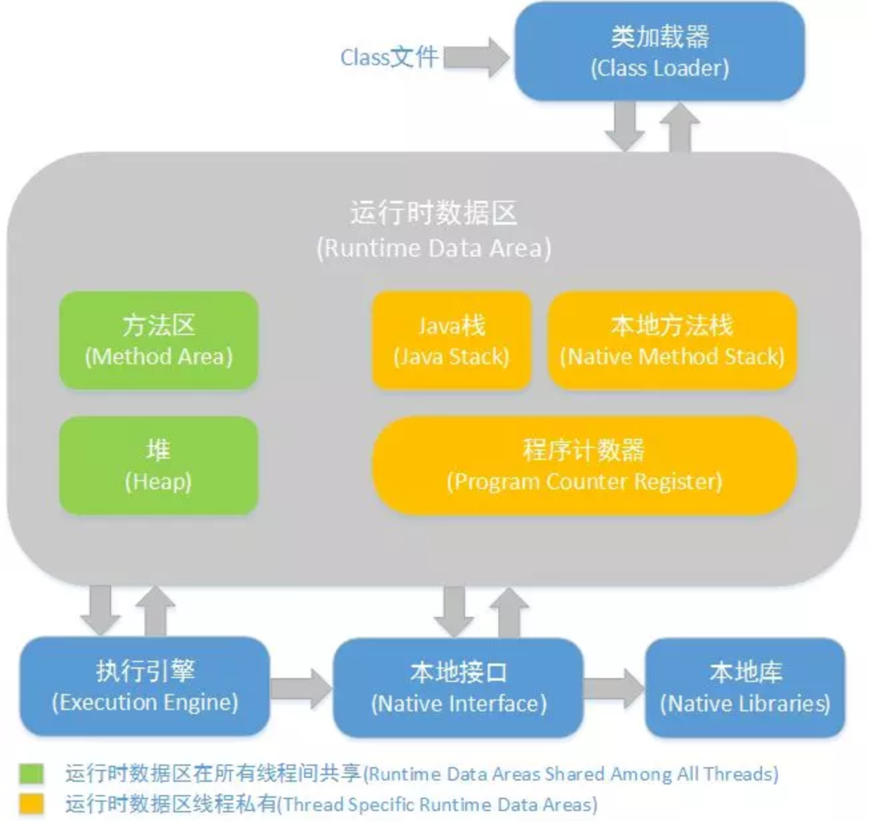

# Java技术体系

包括

- Java程序设计语言
- 各种硬件平台上的Java虚拟机
- Class文件格式
- Java API类库
- 来自商业机构和开源社区的第三方Java类库

JDK：

- Java程序设计语言
- Java虚拟机
- Java API类库
- 支持Java程序开发的最小环境

JRE

- Java SE API子集
- Java虚拟机
- 支持Java程序运行的标准环境

# Java的跨平台特性

将Java代码编译为字节码，可以在网络上进行传播，当碰到Java虚拟机，就可以在其上运行

# Java虚拟机的生存周期

- 一个运行中的Java虚拟机有着一个清晰的任务，执行Java程序，程序开始执行时它才运行，程序结束时它就停止。每个Java程序会单独运行一个Java虚拟机。
- Java虚拟机总是开始于一个main方法，固定格式。
- main方法是程序的起点，它被执行的线程初始化为程序的初始线程。程序中其他线程都由它启动，Java中线程分为两种：守护线程、普通线程。
  - 守护线程：Java虚拟机自己使用的线程，比如负责GC的线程，也可以把自己的程序设置为守护线程。
  - 初始线程不是守护线程 。
- 只要Java虚拟机中还有普通的线程还在执行，就不会停止。也可以使用exit终止。

# Java虚拟机体系结构

- 在Java虚拟机的规范中定义类一系列的子系统、内存区域、数据类型和使用指南。这些组件构成了Java虚拟机的内部结构，他们不仅仅为Java虚拟机的实现提供了清晰的内部结构，更规定了Java虚拟机实现的外部行为
- 每个Java虚拟机都有一个类加载子系统，负责加载程序中的类型（class与interface），并赋予唯一的名字。每一个Java虚拟机都有一个执行引擎，负责执行被加载类中包含的指令

数据类型：

- 原始数据类型
- 引用数据类型：类类型、接口类型、数组类型。

**JVM体系结构**

基本上由四部分组成

- 类加载器，在 JVM 启动时或者类运行时将需要的 class 加载到 JVM 中
- 执行引擎，执行引擎的任务是负责执行 class 文件中包含的字节码指令，相当于实际机器上的 CPU
- 内存区，将内存划分成若干个区以模拟实际机器上的存储、记录和调度功能模块，如实际机器上的各种功能的寄存器或者 PC 指针的记录器等
- 本地方法调用，调用 C 或 C++ 实现的本地方法的代码返回结果

# 参考 #

1. 
