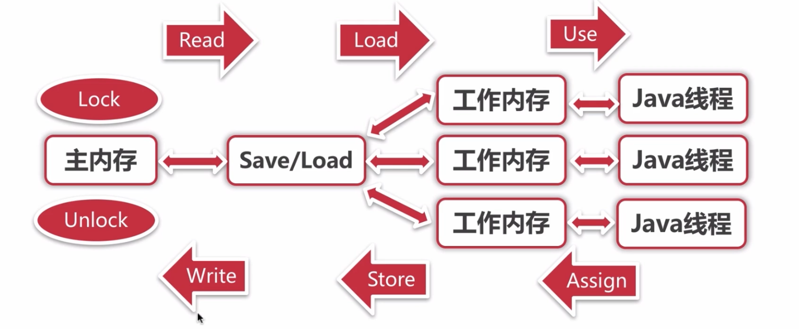
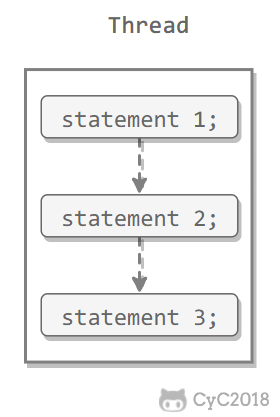
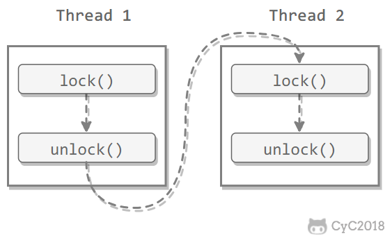
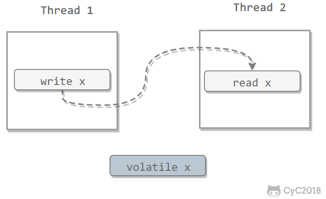
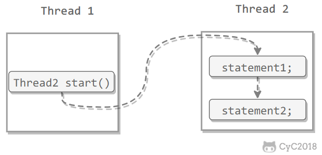
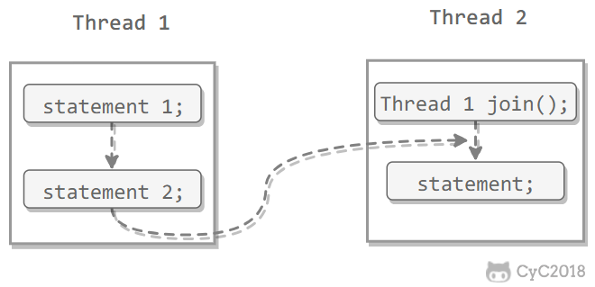

# Java内存模型与线程

## 概述

计算机运算速度与它的存储和通信子系统速度差距太大，大量的时间花费在磁盘IO、网络通信或者数据库访问上。

## 硬件的效率与一致性

- 大多数运算任务不可能只靠处理器计算完成，至少需要与内存交互
  - IO操作与CPU的运算速度有几个数量级差距
    - 加入高速缓存，将运算需要使用的数据复制到缓存中
    - 缓存一致性。各个CPU有字节的高速缓存，他们共享同一主内存。如何解决缓存与主存不一致的现象
    - 
- 指令重排序优化

## Java内存模型

屏蔽各自硬件和操作系统的内存访问差异，使得Java程序在各平台下都能达到一致的内存访问效果。

目的是定义程序中各个变量（不包括局部变量）的访问规则，即在虚拟机中将变量存储到内存和从内存中取出变量这样的底层细节。

### 主内存与工作内存

处理器上的寄存器的读写的速度比内存快几个数量级，为了解决这种速度矛盾，在它们之间加入了高速缓存。

加入高速缓存带来了一个新的问题：缓存一致性。如果多个缓存共享同一块主内存区域，那么多个缓存的数据可能会不一致，需要一些协议来解决这个问题。


所有的变量都存储在主内存中。每个线程还有自己的工作内存。工作内存存储在高速缓存或者寄存器中，保存了该线程使用的变量的主内存副本拷贝。

线程只能直接操作工作内存中的变量，不同线程之间的变量值传递需要通过主内存来完成。


### 内存间交互操作

一个变量如何从主内存拷贝到工作内存，如何从工作内存同步回主内存等细节。Java内存模型定义了8种操作来完成，虚拟机实现必须保证操作都是原子性的。



8条内存访问操作

- lock锁定：作用于主内存的变量，把一个变量标识为一条线程独占状态
- unlock解锁：作用于主内存的变量，把一个处于锁定状态的变量释放出来，释放后的变量才可以被其他线程锁定
- read读取：作用于主内存的变量，把一个变量值从主内存传输到线程的工作内存中，以便随后load动作使用
- load载入：作用于工作内存的变量，把read操作从主内存得到的变量值放入工作内存的**变量副本**中
- use使用：作用于工作内存的变量，把工作内存的一个变量值传递给**执行引擎**（线程）
- assign赋值：作用于工作内存的变量，把一个从执行引擎接收到的值赋值给工作内存的变量
- store存储：作用于工作内存的变量，把工作内存的一个变量的值传递到主内存中，以便随后的write操作
- write写入：作用于主内存的变量，把store操作从工作内存中一个变量的值传送到主内存的变量中

同步规则

- 不允许read、load与store、write操作单一出现，但是不必连续执行，中间可以插入其他指令
- 不允许一个线程丢弃掉它最近的assign操作，必须将变化同步给主内存
- 不允许一个线程无原因地（没有assign操作）将数据同步给主内存。
- 一个新的变量只能从主内存中诞生，不允许在工作内存直接使用一个未初始化（load或assign）的变量，即在use与store前，必须先assign
- 一个变量在同一时刻只允许一个线程进行lock，lock可以被同一线程执行多次。
- 如果一个变量执行了lock操作，将清空工作内存中次变量的值，在执行引擎使用这个变量前需要重新load或assign操作初始化变量
- 如果一个变量没有lock，则不允许unlock操作，也不能unlock其他线程lock的变量
- 对变量unlock前，必须先将变量同步到主内存

**确定内存访问是否并发安全**

- 内存访问操作与规则，加上volatile，就已经完全确定了Java程序中哪些内存访问操作在并发下是安全的。（繁琐）
- 或：先行发生happens-before原则

### 对应volatile变量的特殊规则

对于volatile变量

- 保证此变量对所有线程的可见性，当一个线程修改了这个变量的值，新值对于其他线程来说是立即得知的
- 禁止指令重排优化
  - 普通的变量仅仅会保证在该方法执行过程中所有赋值结构的地方都能获取正确的值，而不能保证遍历赋值的操作顺序
    - boolean a=false;
    - action();
    - a=true;（可能action方法没有执行，a就已经等于true了）
  - 实现方法：内存屏障

**内存屏障：**

对于volatile修饰的变量，赋值后会多执行一个lock addl操作，这个操作相当于一个内存屏障，指重排序时不能把后面的指令重排序到内存屏障前的位置。

指令重排序是CPU采用了允许将多条指令不按程序规定的顺序分开发送给各相应电路单元处理，但是如果指令间有依赖则不会重排。当进行volatile变量赋值，则会将缓存数据写入内存，即此时前面所有操作都已经执行完成，因此无法越过内存屏障。

### 对于long和double的特殊规则

允许虚拟机将没有被volatile修饰的64位数据的读写操作划分为两次32位的操作。

### 内存模型三大特性

#### 原子性

Java 内存模型保证了 read、load、use、assign、store、write、lock 和 unlock 操作具有原子性，例如对一个 int 类型的变量执行 assign 赋值操作，这个操作就是原子性的。但是 Java 内存模型允许虚拟机将没有被 volatile 修饰的 64 位数据（long，double）的读写操作划分为两次 32 位的操作来进行，即 load、store、read 和 write 操作可以不具备原子性。

有一个错误认识就是，int 等原子性的类型在多线程环境中不会出现线程安全问题。前面的线程不安全示例代码中，cnt 属于 int 类型变量，1000 个线程对它进行自增操作之后，得到的值为 997 而不是 1000。

为了方便讨论，将内存间的交互操作简化为 3 个：load、assign、store。

下图演示了两个线程同时对 cnt 进行操作，load、assign、store 这一系列操作整体上看不具备原子性，那么在 T1 修改 cnt 并且还没有将修改后的值写入主内存，T2 依然可以读入旧值。可以看出，这两个线程虽然执行了两次自增运算，但是主内存中 cnt 的值最后为 1 而不是 2。因此对 int 类型读写操作满足原子性只是说明 load、assign、store 这些单个操作具备原子性。


AtomicInteger 能保证多个线程修改的原子性。


使用 AtomicInteger 重写之前线程不安全的代码之后得到以下线程安全实现：

```java
public class AtomicExample {
    private AtomicInteger cnt = new AtomicInteger();

    public void add() {
        cnt.incrementAndGet();
    }

    public int get() {
        return cnt.get();
    }
}Copy to clipboardErrorCopied
public static void main(String[] args) throws InterruptedException {
    final int threadSize = 1000;
    AtomicExample example = new AtomicExample(); // 只修改这条语句
    final CountDownLatch countDownLatch = new CountDownLatch(threadSize);
    ExecutorService executorService = Executors.newCachedThreadPool();
    for (int i = 0; i < threadSize; i++) {
        executorService.execute(() -> {
            example.add();
            countDownLatch.countDown();
        });
    }
    countDownLatch.await();
    executorService.shutdown();
    System.out.println(example.get());
}
1000
```

除了使用原子类之外，也可以使用 synchronized 互斥锁来保证操作的原子性。它对应的内存间交互操作为：lock 和 unlock，在虚拟机实现上对应的字节码指令为 monitorenter 和 monitorexit。

```java
public class AtomicSynchronizedExample {
    private int cnt = 0;

    public synchronized void add() {
        cnt++;
    }

    public synchronized int get() {
        return cnt;
    }
}Copy to clipboardErrorCopied
public static void main(String[] args) throws InterruptedException {
    final int threadSize = 1000;
    AtomicSynchronizedExample example = new AtomicSynchronizedExample();
    final CountDownLatch countDownLatch = new CountDownLatch(threadSize);
    ExecutorService executorService = Executors.newCachedThreadPool();
    for (int i = 0; i < threadSize; i++) {
        executorService.execute(() -> {
            example.add();
            countDownLatch.countDown();
        });
    }
    countDownLatch.await();
    executorService.shutdown();
    System.out.println(example.get());
}
1000
```

#### 可见性

可见性指当一个线程修改了共享变量的值，其它线程能够立即得知这个修改。Java 内存模型是通过在变量修改后将新值同步回主内存，在变量读取前从主内存刷新变量值来实现可见性的。

主要有三种实现可见性的方式：

- volatile
- synchronized，对一个变量执行 unlock 操作之前，必须把变量值同步回主内存。
- final，被 final 关键字修饰的字段在构造器中一旦初始化完成，并且没有发生 this 逃逸（其它线程通过 this 引用访问到初始化了一半的对象），那么其它线程就能看见 final 字段的值。

对前面的线程不安全示例中的 cnt 变量使用 volatile 修饰，不能解决线程不安全问题，因为 volatile 并不能保证操作的原子性。

#### 有序性

有序性是指：在本线程内观察，所有操作都是有序的。在一个线程观察另一个线程，所有操作都是无序的，无序是因为发生了指令重排序。在 Java 内存模型中，允许编译器和处理器对指令进行重排序，重排序过程不会影响到单线程程序的执行，却会影响到多线程并发执行的正确性。

volatile 关键字通过添加内存屏障的方式来禁止指令重排，即重排序时不能把后面的指令放到内存屏障之前。

也可以通过 synchronized 来保证有序性，它保证每个时刻只有一个线程执行同步代码，相当于是让线程顺序执行同步代码。


一个线程观察其他线程中的指令执行顺序，由于指令重排序的存在，该观察结果一般无序

方式：volatile、synchronized、lock、java内存模型的先天有序性（happens before原则）

### 先行发生原则

是Java内存模型重定义的两项操作之间的偏序关系，如果操作A先行发生于操作B，即在发生操作B之前，操作A产生的影响能够被操作B观察到。（影响包括修改了内存中共享变量的值、发送了消息、调用了方法等）

- 程序次序规则：一个线程内，按照代码顺序，书写在前面的操作先行发生于书写在后面的操作



- 锁定操作：一个unlock操作先行发生于后面对同一个锁的lock操作



- volatile变量规则：对一个变量的写操作先行发生于后面对于这个变量的读操作



- 传递规则；如果操作A先行发生于操作B，而操作B又先行发生于操作C，则操作A先行发生于操作C
- 线程启动规则：Thread对象的start（）方法先行发生于此线程的每一个动作



- 线程中断规则：对线程interrupt()方法的调用先行发生于被中断线程的代码检测到中断事件的发生
- 线程终结规则：线程中所有的操作都先行发生于线程的终止检测。Thread 对象的结束先行发生于 join() 方法返回。



- 对象终结规则：一个对象的初始化完成先行发生于它的finalize（）方法的开始

如果两个操作的执行次序无法从happens before推导出来，则JVM可以对它进行随意的重排序。

## Java与线程

### 线程的实现

Java线程在虚拟机中的实现

Thread类中的关键方法都是Native的，即方法没有使用或无法使用平台无关的手段来实现。即平台相关，因此是线程的实现，而不是Java线程的实现

**内核线程实现**

内核线程KLT：直接由操作系统内核支持的线程，内核通过操纵调度器对线程进行调度，并负责将线程的任务映射到各个处理器上。

程序一般直接使用内核线程，而是使用内核线程的一种高级接口：轻量级进程LWP，即线程。每个线程都由一个内核线程支持。


- 基于内核线程实现，所以各自操作都需要系统调用，需要在用户态与内核态间相互切换，代价高
- 每个轻量级线程都有一个内核线程支持，因此需要消耗一定内核资源，如栈空间，因此一个系统可支持的线程数量有限

**使用用户线程实现**

广义：一个线程只要不是内核线程，就可以认为是用户线程。

狭义：完全建立在用户空间的线程库，内核不能感知线程的存在。

- 不需要系统内核支援，操作快速，低消耗，可以支持规模更大的并发
- 没有系统内核支援，所有线程操作都需要用户自己考虑
- 操作系统只把CPU分配给进程，阻塞处理、映射等问题解决非常困难

**使用用户线程加轻量级进程实现**


**Java线程的实现**

依据平台而定，windows与linux是一对一的线程模型实现，一条Java线程就映射到一条轻量级进程中。

### Java线程调度

**协同式线程调度**

线程的执行时间由线程本身控制，线程在自己的工作**执行完**后，主动通知系统切换到另一个线程，没有同步问题。

线程的执行时间不可控制，可能出现线程永久阻塞，使得整个系统不稳定

**抢占式线程调度**

线程由系统分配执行时间，线程的切换不由线程本身决定（yield让出执行时间）

设置线程优先级可以建议系统给某些线程多分配时间，但是并不可靠，因为Java的线程是通过映射到系统的原生线程实现的，所有线程的调度还是取决于操作系统

# 线程安全与锁优化

## 概述

在一项工作进行前，会被不停中断与切换，对象的属性可能会在中断期间被修改和变脏。如何保证程序在计算机中正确无误地运行

## 线程安全

当多个线程访问一个对象，如果不用考虑这些线程在运行时环境下的调度和交替执行，也不需要额外的同步，或者在调用放进行任何其他的协调操作， **调用这个对象的行为**（有些时候弱化定义，指单次调用）都可以获得正确的结果，那这个对象是线程安全的。

### Java语言中的线程安全

**不可变**

final对象

**绝对线程安全**

完全满足定义

在相对线程安全的示例基础上，进行synchronize同步

**相对线程安全**

保证单次调用下，线程是安全的，对于特定顺序的连续调用，则可能需要使用额外的同步手段。

需要额外的同步


**线程兼容**

对象本身并不是线程安全，但可以在调用端正确使用同步手段来保证对象在并发环境可以安全使用

**线程对立**

无论调用端是否采用了同步措施，都无法再多线程环境并发使用的代码

### 线程安全的实现方法

**互斥同步**

指多个线程并发访问共享数据时，保证共享数据在同一个时刻只被一个线程使用。

互斥同步最主要的问题是进行线程阻塞与唤醒带来的性能问题。悲观的并发策略。

临界区、互斥量、信号量都是主要互斥实现方法。

synchronized关键字：需要系统帮助完成

J.U.C包下的重入锁

ReentrantLock：

- 等待可中断：持有锁的线程长期不释放锁的时候，正则等待的线程可以选择放弃等待，改为处理其他事情。对于处理执行时间非常长的同步块有帮助
- 可实现公平锁：多个新车等待同一个锁时，按申请的先后次序获得锁
- 锁可以帮定多个条件：可以同时绑定多个Condition

**非阻塞同步**

由于硬件指令集的发展而出现

基于冲突检测的乐观并发策略，先进行操作，如果没有其他线程争用共享数据，那操作就成功了，如果共享数据有争用，则采用其他补偿措施（不断重试，直到成功）

- 测试并设置 Test and Set
- 获取并增加 Fetch and Increment
- 交换 Swap
- 比较并交换 Compare and Swap     CAS
  - ABA问题
- 加载链接/条件存储 Load-Linked/Store-Conditional     LL/SC

**无同步方案**

- 可重入代码
- 线程本地存储

## 锁优化

### 自旋锁与自适应自旋

通常一些情况共享数据的锁定只持续很短时间，为此进行挂起与恢复并不值得。

让后面请求锁的线程稍等一会，但不放弃处理器执行时间，看持有锁的线程是否会释放锁。使线程执行一个忙循环（自旋，默认10次），JDK1.6当中默认开启

自适应自旋：由前一次在同一个锁上的自选时间以及锁拥有者状态决定。

- 如果同一个锁，自旋刚刚成功获得锁，那么此次自旋也有可能成功，允许自旋等待持续相对更长的时间。
- 如果这个锁自旋很少成功获得，那么以后可能忽略掉自旋过程

### 锁消除

虚拟机即时编译器允许时，对一些代码上要求同步，但被检测到不可能存在共享数据竞争的锁进行消除

判定依据：逃逸分析的数据支持，如果判断一段代码中，堆上所有的数据都不会逃逸出去从而被其他线程访问到，那就可以把它们当做栈上数据对待，认为它们是线程私有的，同步加锁就无须进行了。

对于一些看起来没有加锁的代码，其实隐式的加了很多锁。例如下面的字符串拼接代码就隐式加了锁：

``` Java
public static String concatString(String s1, String s2, String s3) {
    return s1 + s2 + s3;
}
```

String 是一个不可变的类，编译器会对 String 的拼接自动优化。在 JDK 1.5 之前，会转化为 StringBuffer 对象的连续 append() 操作：

``` Java
public static String concatString(String s1, String s2, String s3) {
    StringBuffer sb = new StringBuffer();
    sb.append(s1);
    sb.append(s2);
    sb.append(s3);
    return sb.toString();
}
```

每个 append() 方法中都有一个同步块。虚拟机观察变量 sb，很快就会发现它的动态作用域被限制在 concatString() 方法内部。也就是说，sb 的所有引用永远不会逃逸到 concatString() 方法之外，其他线程无法访问到它，因此可以进行消除。

### 锁粗化

推荐同步块的作用范围限制尽量小，但如果一系列连续操作都对同一个对象反复加锁和解锁。这时虚拟机探测到这些时，将会将加锁同步的范围扩展到整个操作序列的外部。

### 轻量级锁

JDK 1.6 引入了偏向锁和轻量级锁，从而让锁拥有了四个状态：无锁状态（unlocked）、偏向锁状态（biasble）、轻量级锁状态（lightweight locked）和重量级锁状态（inflated）。

在没有多线程竞争的前提下，减少传统的重量级锁使用操作系统互斥量产生的性能消耗。

无竞争下使用CAS操作去消除同步使用的互斥量

- HotSpot虚拟机的对象内存布局：对象头包括两部分
  - 存储对象自身的运行时数据，如哈希码，GC分代年龄等，在64位虚拟机中为64Bits，称为Mark Word，是轻量级锁与偏向锁的关键
  - 存储指向方法区对象类型数据的指针，如果是数组对象，则还会存储数组长度。
  - 
  - 
- 轻量级锁执行过程：
  - 代码进入同步块时，如果此同步对象没有被锁定（标志位01），虚拟机将在当前线程的栈帧建立一个名为锁记录的空间，存储锁对象目前的Mark Word拷贝
  - 虚拟机将使用CAS操作尝试将对象的Mark Word更新为指向Lock Record的指针
    - 如果更新成功，则线程拥有了该对象的锁，锁标志位变为00
    - 
    - 更新失败，虚拟机首先检查对象的Mark Word是否指向当前线程的栈帧，
      - 如果只说明当前线程已经拥有了这个对象的锁，那么就可以直接进入同步块继续执行。
      - 否则说明这个锁对象已经被其他线程抢占
    - 如果两条以上的线程争用同一个锁，则锁膨胀为重量级锁，标志位为10，Mark Word存放指向重量级锁的指针
- 依据：对于绝大部分锁，整个同步周期内是不存在竞争的
  - 如果存在竞争，则额外CAS操作
  - 不存在竞争，则避免了开销

### 偏向锁

消除数据在无竞争情况下的同步原语，进一步提高程序的运行性能。在无竞争的情况下，把整个同步都消除掉。

锁会偏向于第一个获得它的线程，在接下来执行过程中，该锁没有被其他线程获取，则持有偏向锁的线程永远不需要再进行同步。

- 当锁第一次被线程获取时，会把对象头中的标志设置为01。使用CAS操作把获取到这个锁的线程的ID记录在对象的Mark Word中
- 如果CAS操作成功，持有偏向锁的线程每次进入这个锁相关的同步块时，虚拟机都可以不再进行任何同步操作
- 当另一个线程尝试获取这个锁，偏向模式宣告结束。
- 转为轻量级锁

# 参考 #

1. 
