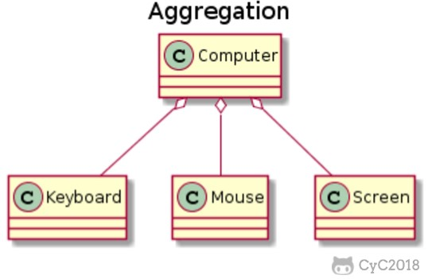
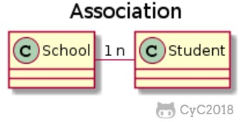

# 面向对象概述

## 关于面向对象OOP的程序设计模式 ##

对象:对象具有状态,行为,标识.意味着每一个对象都可以拥有内部数据（对象的状态）和方法（对象的行为），每一个对象在内存当中都有一个地址

- 万物皆为对象.
   1. 对象可以存储数据,可以在自身上执行操作.
   2. 是指可以抽取问题当中的任何概念化的构件(一个生物,一个建筑零件,一项服务),将其表示为程序当中的对象.

- 程序是对象的集合,通过发送消息来告知彼此所要做的
   1. 要请求一个对象,就要对对象发送一条信息
   2. 消息是对象或对象的方法调用的请求

- 每个对象度有自己的由全体对象所构成的存储
- 每个对象都拥有其类型   
   1. 每个对象都有一个类,对象是类的实例
   2. 类区别于其他类的最重要的特性就是可以发送什么信息给它

- 某一特定类型的缩影对象度可以接受相同的消息
   1. 圆形是几何形,那么可以接受几何形的消息

对象的特性：

-  对象的行为 （ behavior ) — 可以对对象施加哪些操作 ， 或可以对对象施加哪些方法 ？
-  对象的状态 （ state ) — 当施加那些方法时 ， 对象如何响应 ？
-  对象标识 （ identity ) — 如何辨别具有相同行为与状态的不同对象 ？

## 四个基本特性

抽象：将一类对象的共同特征总结出来构造类的过程，包括数据抽象和行为抽象两方面，抽象只关注对象有哪些属性和行为，并不关注这些行为的细节是什么

三大特性

## 三大特性

### 封装

将数据和操作数据的方法绑定起来，对数据的访问只能通过已定义的接口。尽可能地隐藏内部的细节，只保留一些对外接口使之与外部发生联系。用户无需知道对象内部的细节，但可以通过对象对外提供的接口来访问该对象。可以说，封装就是隐藏一切可隐藏的东西，只向外界提供最简单的编程接口

优点：

- 减少耦合：可以独立地开发、测试、优化、使用、理解和修改
- 减轻维护的负担：可以更容易被程序员理解，并且在调试的时候可以不影响其他模块
- 有效地调节性能：可以通过剖析确定哪些模块影响了系统的性能
- 提高软件的可重用性
- 降低了构建大型系统的风险：即使整个系统不可用，但是这些独立的模块却有可能是可用的

以下 Person 类封装 name、gender、age 等属性，外界只能通过 get() 方法获取一个 Person 对象的 name 属性和 gender 属性，而无法获取 age 属性，但是 age 属性可以供 work() 方法使用。

注意到 gender 属性使用 int 数据类型进行存储，封装使得用户注意不到这种实现细节。并且在需要修改 gender 属性使用的数据类型时，也可以在不影响客户端代码的情况下进行。

```java
public class Person {

    private String name;
    private int gender;
    private int age;

    public String getName() {
        return name;
    }

    public String getGender() {
        return gender == 0 ? "man" : "woman";
    }

    public void work() {
        if (18 <= age && age <= 50) {
            System.out.println(name + " is working very hard!");
        } else {
            System.out.println(name + " can't work any more!");
        }
    }
}
```

### 继承

继承是从已有类得到继承信息创建心累的过程。提供继承信息的称为父类（超类、基类）；得到继承信息的称为子类（派生类）

继承实现了 **IS-A** 关系，例如 Cat 和 Animal 就是一种 IS-A 关系，因此 Cat 可以继承自 Animal，从而获得 Animal 非 private 的属性和方法。

继承应该遵循里氏替换原则，子类对象必须能够替换掉所有父类对象。

Cat 可以当做 Animal 来使用，也就是说可以使用 Animal 引用 Cat 对象。父类引用指向子类对象称为 **向上转型**。

```java
Animal animal = new Cat();
```

### 多态

允许不同子类型的对象对同一消息作出不同的响应

多态分为编译时多态和运行时多态：

- 编译时多态主要指方法的重载（前绑定）
- 运行时多态指程序中定义的对象引用所指向的具体类型在运行期间才确定。指方法重写（后绑定）

运行时多态有三个条件：

- 继承
- 覆盖（重写）
- 向上转型

下面的代码中，乐器类（Instrument）有两个子类：Wind 和 Percussion，它们都覆盖了父类的 play() 方法，并且在 main() 方法中使用父类 Instrument 来引用 Wind 和 Percussion 对象。在 Instrument 引用调用 play() 方法时，会执行实际引用对象所在类的 play() 方法，而不是 Instrument 类的方法。

```java
public class Instrument {

    public void play() {
        System.out.println("Instument is playing...");
    }
}

public class Wind extends Instrument {

    public void play() {
        System.out.println("Wind is playing...");
    }
}

public class Percussion extends Instrument {

    public void play() {
        System.out.println("Percussion is playing...");
    }
}

public class Music {

    public static void main(String[] args) {
        List<Instrument> instruments = new ArrayList<>();
        instruments.add(new Wind());
        instruments.add(new Percussion());
        for(Instrument instrument : instruments) {
            instrument.play();
        }
    }
}
```

## 程序设计 ##

### 对象是服务的提供者 ###

程序本身向用户提供服务，它将调用其他对象提供的服务来实现这一目的。

# 对象与类

类是构造对象的模板与蓝图，由类构造对象的过程为创建类的实例

类的关系：
- 依赖：一个类的方法操纵另一个类的对象
- 聚合：一个Order 对象包含一些 Item 对象
- 继承：

## 类图

### 泛化关系

用来描述继承关系，在 Java 中使用 extends 关键字。


### 实现关系

用来实现一个接口，在 Java 中使用 implements 关键字。


### 聚合关系

表示整体由部分组成，但是整体和部分不是强依赖的，整体不存在了部分还是会存在。



### 组合关系

和聚合不同，组合中整体和部分是强依赖的，整体不存在了部分也不存在了。比如公司和部门，公司没了部门就不存在了。但是公司和员工就属于聚合关系了，因为公司没了员工还在。


### 关联关系

表示不同类对象之间有关联，这是一种静态关系，与运行过程的状态无关，在最开始就可以确定。因此也可以用 1 对 1、多对 1、多对多这种关联关系来表示。比如学生和学校就是一种关联关系，一个学校可以有很多学生，但是一个学生只属于一个学校，因此这是一种多对一的关系，在运行开始之前就可以确定。



### 依赖关系

和关联关系不同的是，依赖关系是在运行过程中起作用的。A 类和 B 类是依赖关系主要有三种形式：

- A 类是 B 类方法的局部变量；
- A 类是 B 类方法当中的一个参数；
- A 类向 B 类发送消息，从而影响 B 类发生变化。


## 类设计技巧


1. 一定要保证数据私有

这是最重要的；绝对不要破坏封装性。有时候，需要编写一个访问器方法或更改器方法，但是最好还是保持实例域的私有性。很多惨痛的经验告诉我们，数据的表示形式很可能会改变，但它们的使用方式却不会经常发生变化。当数据保持私有时，它们的表示形式的变化不会对类的使用者产生影响，即使出现 bug 也易于检测。  

2. 一定要对数据初始化  

Java 不对局部变量进行初始化，但是会对对象的实例域进行初始化。最好不要依赖于系统的默认值 ， 而是应该显式地初始化所有的数据，具体的初始化方式可以是提供默认值，也可以是在所有构造器中设置默认值。  

3.  不要在类中使用过多的基本类型  

就是说，用其他的类代替多个相关的基本类型的使用。这样会使类更加易于理解且易于修改。例如，用一个称为Address的新的类替换一个Customer类中以下的实例域：
``` java
private String street ;
private String city ;
private String state ;
private int zip ;
```
这样，可以很容易处理地址的变化，例如，需要增加对国际地址的处理。

4. 不是所有的域都需要独立的域访问器和域更改器

或许，需要获得或设置雇员的薪金。 而一旦构造了雇员对象，就应该禁止更改雇用日期，并且在对象中，常常包含一些不希望别人获得或设置的实例域，例如，在Address类中，存放州缩写的数组。

5. 将职责过多的类进行分解

这样说似乎有点含糊不清，究竟多少算是“过多”？每个人的看法不同。但是，如果明显地可以将一个复杂的类分解成两个更为简单的类，就应该将其分解（但另一方面，也不要走极端。设计10个类，每个类只有一个方法，显然有些矫枉过正了）

6. 类名和方法名要能够体现它们的职责

与变量应该有一个能够反映其含义的名字一样，类也应该如此

7. 优先使用不可变的类

LocalDate类以及java.time包中的其他类是不可变的—没有方法能修改对象的状态。类似 plusDays 的方法并不是更改对象，而是返回状态已修改的新对象

更改对象的问题在于，如果多个线程试图同时更新一个对象，就会发生并发更改。其结果是不可预料的。如果类是不可变的，就可以安全地在多个线程间共享其对象。

因此，要尽可能让类是不可变的，这是一个很好的想法。对于表示值的类，如一个字符串或一个时间点，这尤其容易。计算会生成新值，而不是更新原来的值。

当然，并不是所有类都应当是不可变的。如果员工加薪时让raiseSalary方法返回一个新的Employee对象，这会很奇怪。

## 抽象类

Java中可以定义没有方法体的方法，该方法由其子类来具体的实现。该没有方法体的方法我们称之为抽象方法，含有抽象方法的类我们称之为抽象类。

### 特点

**抽象方法的特点**

- 只有方法头没有方法体的方法称之为抽象方法。（即只有方法的声明，没有方法的实现）
- 抽象方法用abstract关键字来修饰。
- 抽象方法代表一种不确定的操作或行为。（由子类去具体实现）
- 抽象方法不能被调用。

**抽象类的特点**

- 定义中含有抽象方法的类叫做抽象类。
- 抽象类用abstract关键字来修饰。
- 抽象类代表一种抽象的对象类型。
- 抽象类不能实例化。
- 抽象类中可以有具体方法，可以没有抽象方法。（也就是说一个类中只要有一个方法是抽象方法那么这个类一定是抽象类，反过来，一个抽象类中可以没有抽象方法，可以带有具体实现的方法）
- 一旦一个类中有抽象方法，那么这个类必须也要用abstract来修饰，代表这个类是抽象类，它是不能被实例化的。

### 意义

抽象类往往用来表征对问题领域进行分析、设计中得出的抽象概念，是对一系列看上去不同，但是本质上相同的具体概念的抽象。

- 为子类提供一个公共的类型；

- 封装子类中重复内容（成员变量和方法）；

- 定义有抽象方法，子类虽然有不同的实现，但该方法的定义是一致的。

  - 当我看到类是抽象的，我会很关心它的抽象方法。我知道它的子类一定会重写它，而且，我会去找到抽象类的引用。它一定会有多态性的体现。

# static静态

## 静态域与常量

如果将域或者常量定义为static，每个类将只有一个这样的域，所有的对象将对静态的域进行共享。因为静态域是属于类的，而不是对象

## 静态方法

静态的东西皆是属于类的，而并不属于对象，因此对静态方法的调用时，应使用类去调用。   

当然对象可以去调用静态方法，因为对象都具有一个共享的静态空间，所以它也可以去调用这个静态空间，但是如果使用对象的话，容易造成混淆。因为该方法与这个对象并无关系。

### 使用静态方法的情况

- 方法不需要访问对象状态 ， 其所需参数都是通过显式参数提供 
- 一个方法只需要访问类的静态域 

### 静态工厂

- 工厂方法的功能是类似于构造器的
- 工厂方法生成不同风格的格式化对象

使用静态工厂的原因：
- 无法命名构造器，构造器的名字必须与类名相同，但是通过工厂方法可以获得采用不用的名字的实例
- 当使用构造器时， 无法改变所构造的对象类型 。

### main方法

## 方法参数

关于按值调用与按引用调用
- 按值调用：方法接收的是调用者提供的值，方法得到的是所有参数值的一个拷贝
- 按引用调用：方法接收的是调用者提供的变量地址

java的参数为按值调用

解释为什么参数为对象的时候，改变了真正对象的值

因为创建对象的时候，使用语句 Object o = new Object()，所得到的对象为o，而o是一个对象的引用，当将它传递给方法，方法得到的是o的拷贝，即一个引用的拷贝，即依然是一个队对象的引用，所以对它修改，实际上是通过了这个引用，改变了实际对象的值。

## 方法重载

### 如何区分重载方法

问题：多个方法具有相同的名字，那么Java是如何知道我想使用的是哪一个方法呢。

解决：区分指标为类名于方法的形参，为每一个重载的方法建立一个独一无二的参数类型列表

注：不能只改变方法的返回类型,而不改变方法的参数,当然如果改变了参数,改变返回类型也是可以的

### 涉及基本类型的重载

基本类型能从一个“较小”的类型，自动提升到一个较大的类型，该过程的重载又是如何？

假设传入一个5，分以下的情况：
- 存在接受int类型的方法，则调用该方法
- 传入的数据类型小于声明的参数类型，例如double,则提升原数据类型的数据类型
- 其中char类型会直接提升到int类型
- 传入的数据类型大于声明的参数类型，则会报错，需要进行类型转换进行窄化处理

# 参考 #
1. [面向对象思想](http://zhangchangle.com/#/notes/面向对象思想)
