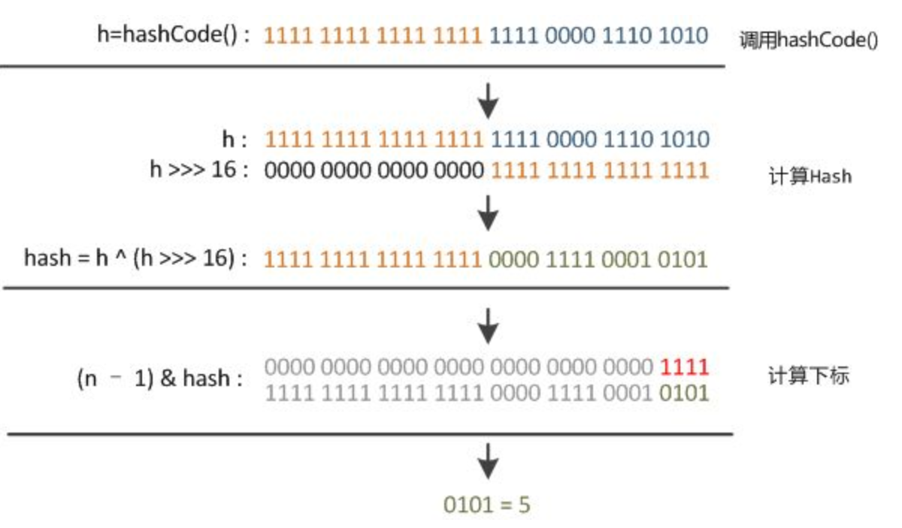
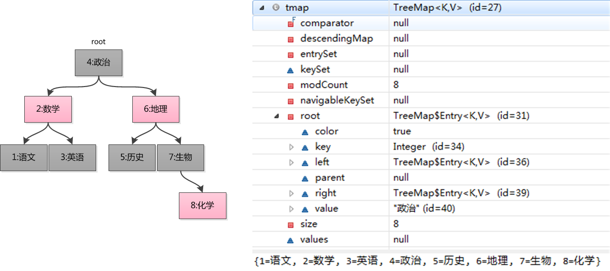
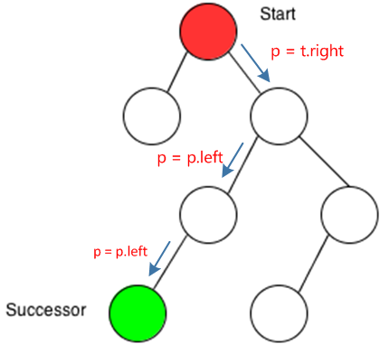
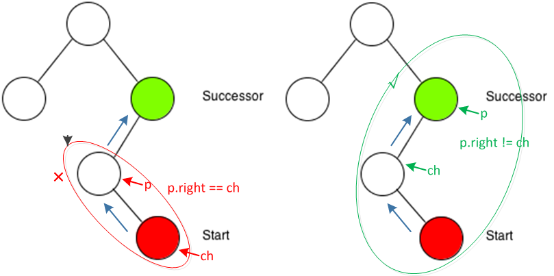

# 一、概览

容器主要包括 Collection 和 Map 两种，Collection 存储着对象的集合，而 Map 存储着键值对（两个对象）的映射表。

## Collection


### 1. Set

- TreeSet：基于红黑树实现，支持有序性操作，例如根据一个范围查找元素的操作。但是查找效率不如 HashSet，HashSet 查找的时间复杂度为 O(1)，TreeSet 则为 O(logN)。
- HashSet：基于哈希表实现，支持快速查找，但不支持有序性操作。并且失去了元素的插入顺序信息，也就是说使用 Iterator 遍历 HashSet 得到的结果是不确定的。
- LinkedHashSet：具有 HashSet 的查找效率，且内部使用双向链表维护元素的插入顺序。

### 2. List

- ArrayList：基于动态数组实现，支持随机访问。
- Vector：和 ArrayList 类似，但它是线程安全的。
- LinkedList：基于双向链表实现，只能顺序访问，但是可以快速地在链表中间插入和删除元素。不仅如此，LinkedList 还可以用作栈、队列和双向队列。

### 3. Queue

- LinkedList：可以用它来实现双向队列。
- PriorityQueue：基于堆结构实现，可以用它来实现优先队列。

## Map


- TreeMap：基于红黑树实现。
- HashMap：基于哈希表实现。
- HashTable：和 HashMap 类似，但它是线程安全的，这意味着同一时刻多个线程可以同时写入 HashTable 并且不会导致数据不一致。它是遗留类，不应该去使用它。现在可以使用 ConcurrentHashMap 来支持线程安全，并且 ConcurrentHashMap 的效率会更高，因为 ConcurrentHashMap 引入了分段锁。
- LinkedHashMap：使用双向链表来维护元素的顺序，顺序为插入顺序或者最近最少使用（LRU）顺序。

# 二、容器中的设计模式

## 迭代器模式


Collection 继承了 Iterable 接口，其中的 iterator() 方法能够产生一个 Iterator 对象，通过这个对象就可以迭代遍历 Collection 中的元素。

从 JDK 1.5 之后可以使用 foreach 方法来遍历实现了 Iterable 接口的聚合对象。

```java
List<String> list = new ArrayList<>();
list.add("a");
list.add("b");
for (String item : list) {
    System.out.println(item);
} 
```

## 适配器模式

java.util.Arrays#asList() 可以把数组类型转换为 List 类型。

```java
@SafeVarargs
public static <T> List<T> asList(T... a) 
```

应该注意的是 asList() 的参数为泛型的变长参数，不能使用基本类型数组作为参数，只能使用相应的包装类型数组。

```java
Integer[] arr = {1, 2, 3};
List list = Arrays.asList(arr); 
```

也可以使用以下方式调用 asList()：

```java
List list = Arrays.asList(1, 2, 3); 
```

# 三、源码分析

如果没有特别说明，以下源码分析基于 JDK 1.8。

## ArrayList

非线程安全

### 1. 概览

- 实现了 RandomAccess 接口，因此支持随机访问。这是理所当然的，因为 ArrayList 是基于数组实现的。
- java.io.Serializable接口，实现序列化。
- Cloneable接口，实现对象的可克隆
- List接口

```Java
//ArrayList<E>定义泛型的元素类型
public class ArrayList<E> extends AbstractList<E>
        implements List<E>, RandomAccess, Cloneable, java.io.Serializable
```

数组的默认大小为 10。

```java
private static final int DEFAULT_CAPACITY = 10;
```


### 2. 扩容

添加元素时使用 ensureCapacityInternal() 方法来保证容量足够，如果不够时，需要使用 grow() 方法进行扩容，新容量的大小为 `oldCapacity + (oldCapacity >> 1)`，也就是旧容量的 1.5 倍。

扩容操作需要调用 `Arrays.copyOf()` 把原数组整个复制到新数组中，这个操作代价很高，因此最好在创建 ArrayList 对象时就指定大概的容量大小，减少扩容操作的次数。

```java
//向ArrayList里增加元素
public boolean add(E e) {
    ensureCapacityInternal(size + 1);  // Increments modCount!!保证容量足够
    elementData[size++] = e;
    return true;
}

private void ensureCapacityInternal(int minCapacity) {
    //elementData是存放数组元素的数组
   	ensureExplicitCapacity(calculateCapacity(elementData, minCapacity));
}

private static int calculateCapacity(Object[] elementData, int minCapacity) {
    // 当第一次调用add(E e)方法的时候，判读是不是无参构造函数创建的对象，如果是，
    // 将DEFAULT_CAPACITY即10作为ArrayList的容量，此时minCapacity = 1
    //DEFAULTCAPACITY_EMPTY_ELEMENTDATA
    if (elementData == DEFAULTCAPACITY_EMPTY_ELEMENTDATA) {
        return Math.max(DEFAULT_CAPACITY, minCapacity);
    }
    return minCapacity;
}

private void ensureExplicitCapacity(int minCapacity) {
    modCount++;//修改次数，在使用迭代器遍历的时候，用来检查列表中的元素是否发生结构性变化
    // overflow-conscious code
    if (minCapacity - elementData.length > 0)
        grow(minCapacity);
}

private void grow(int minCapacity) {
    // overflow-conscious code
    int oldCapacity = elementData.length;//原有长度
    int newCapacity = oldCapacity + (oldCapacity >> 1);//新长度
    if (newCapacity - minCapacity < 0)
        newCapacity = minCapacity;
    if (newCapacity - MAX_ARRAY_SIZE > 0)
        newCapacity = hugeCapacity(minCapacity);
    // minCapacity is usually close to size, so this is a win:
    //方法传回的数组是新的数组对象，改变传回数组中的元素值，不会影响原来的数组。
    elementData = Arrays.copyOf(elementData, newCapacity);
}
```

### 3. 删除元素

需要调用 System.arraycopy() 将 index+1 后面的元素都复制到 index 位置上，该操作的时间复杂度为 O(N)，可以看出 ArrayList 删除元素的代价是非常高的。

```java
public E remove(int index) {
    rangeCheck(index);//检查越界
    modCount++;
    E oldValue = elementData(index);
    int numMoved = size - index - 1;
    if (numMoved > 0)
        System.arraycopy(elementData, index+1, elementData, index, numMoved);
    elementData[--size] = null; // clear to let GC do its work
    return oldValue;
} 
```

### 4. Fail-Fast

modCount 用来记录 ArrayList 结构发生变化的次数。结构发生变化是指添加或者删除至少一个元素的所有操作，或者是调整内部数组的大小，仅仅只是设置元素的值不算结构发生变化。

在进行序列化或者迭代等操作时，需要比较操作前后 modCount 是否改变，如果改变了需要抛出 ConcurrentModificationException。

```java
private void writeObject(java.io.ObjectOutputStream s)
    throws java.io.IOException{
    // Write out element count, and any hidden stuff
    int expectedModCount = modCount;
    s.defaultWriteObject();

    // Write out size as capacity for behavioural compatibility with clone()
    s.writeInt(size);

    // Write out all elements in the proper order.
    for (int i=0; i<size; i++) {
        s.writeObject(elementData[i]);
    }

    if (modCount != expectedModCount) {
        throw new ConcurrentModificationException();
    }
} 
```

### 5. 序列化

ArrayList 基于数组实现，并且具有动态扩容特性，因此保存元素的数组不一定都会被使用，那么就没必要全部进行序列化。

保存元素的数组 elementData 使用 transient 修饰，该关键字声明数组默认不会被序列化。

```java
transient Object[] elementData; // non-private to simplify nested class access 
```

ArrayList 实现了 writeObject() 和 readObject() 来控制只序列化数组中有元素填充那部分内容。

```java
private void readObject(java.io.ObjectInputStream s)
    throws java.io.IOException, ClassNotFoundException {
    elementData = EMPTY_ELEMENTDATA;

    // Read in size, and any hidden stuff
    s.defaultReadObject();

    // Read in capacity
    s.readInt(); // ignored

    if (size > 0) {
        // be like clone(), allocate array based upon size not capacity
        ensureCapacityInternal(size);

        Object[] a = elementData;
        // Read in all elements in the proper order.
        for (int i=0; i<size; i++) {
            a[i] = s.readObject();
        }
    }
} 
private void writeObject(java.io.ObjectOutputStream s)
    throws java.io.IOException{
    // Write out element count, and any hidden stuff
    int expectedModCount = modCount;
    s.defaultWriteObject();

    // Write out size as capacity for behavioural compatibility with clone()
    s.writeInt(size);

    // Write out all elements in the proper order.
    for (int i=0; i<size; i++) {
        s.writeObject(elementData[i]);
    }

    if (modCount != expectedModCount) {
        throw new ConcurrentModificationException();
    }
} 
```

序列化时需要使用 ObjectOutputStream 的 writeObject() 将对象转换为字节流并输出。而 writeObject() 方法在传入的对象存在 writeObject() 的时候会去反射调用该对象的 writeObject() 来实现序列化。反序列化使用的是 ObjectInputStream 的 readObject() 方法，原理类似。

```java
ArrayList list = new ArrayList();
ObjectOutputStream oos = new ObjectOutputStream(new FileOutputStream(file));
oos.writeObject(list);
```

## LinkedList

### 1. 概览

基于双向链表实现，使用 Node 存储链表节点信息。

```java
private static class Node<E> {
    E item;
    Node<E> next;
    Node<E> prev;
}
```

每个链表存储了 first 和 last 指针：

```java
transient Node<E> first;
transient Node<E> last;
```


### 2. 与 ArrayList 的比较

- ArrayList 基于动态数组实现，LinkedList 基于双向链表实现；
- ArrayList 支持随机访问，LinkedList 不支持；
- LinkedList 在任意位置添加删除元素更快。

## HashMap

为了便于理解，以下源码分析以 JDK 1.7 为主。

```Java
public class HashMap<K,V> extends AbstractMap<K,V>
    implements Map<K,V>, Cloneable, Serializable {
    /**
     * 核心成员变量
     */
     //初始化桶大小，因为底层是数组，所以这是数组默认的大小。
     static final int DEFAULT_INITIAL_CAPACITY = 1 << 4; // aka 16
     //桶最大值。
     static final int MAXIMUM_CAPACITY = 1 << 30;
     //默认的负载因子（0.75）
     static final float DEFAULT_LOAD_FACTOR = 0.75f;
     //table 真正存放数据的数组。
     transient Entry<K,V>[] table =(Entry<K,V>[]) EMPTY_TABLE;
     //Map 存放数量的大小。
     transient int size;
     //桶大小，可在初始化时显式指定。
     int threshold;
     //负载因子，可在初始化时显式指定。
     final float loadFactor;
```

### 1. 存储结构

内部包含了一个 Entry 类型的数组 table。

```java
transient Entry[] table;
```

Entry 存储着键值对。它包含了四个字段，从 next 字段我们可以看出 Entry 是一个链表。即数组中的每个位置被当成一个桶，一个桶存放一个链表。HashMap 使用拉链法来解决冲突，同一个链表中存放哈希值相同的 Entry。


```java
static class Entry<K,V> implements Map.Entry<K,V> {
    final K key;
    V value;
    Entry<K,V> next;
    int hash;

    Entry(int h, K k, V v, Entry<K,V> n) {
        value = v;
        next = n;
        key = k;
        hash = h;
    }

    public final K getKey() {
        return key;
    }

    public final V getValue() {
        return value;
    }

    public final V setValue(V newValue) {
        V oldValue = value;
        value = newValue;
        return oldValue;
    }

    public final boolean equals(Object o) {
        if (!(o instanceof Map.Entry))
            return false;
        Map.Entry e = (Map.Entry)o;
        Object k1 = getKey();
        Object k2 = e.getKey();
        if (k1 == k2 || (k1 != null && k1.equals(k2))) {
            Object v1 = getValue();
            Object v2 = e.getValue();
            if (v1 == v2 || (v1 != null && v1.equals(v2)))
                return true;
        }
        return false;
    }

    public final int hashCode() {
        return Objects.hashCode(getKey()) ^ Objects.hashCode(getValue());
    }

    public final String toString() {
        return getKey() + "=" + getValue();
    }
}
```

### 2. 拉链法的工作原理

```java
HashMap<String, String> map = new HashMap<>();
map.put("K1", "V1");
map.put("K2", "V2");
map.put("K3", "V3"); 
```

- 新建一个 HashMap，默认大小为 16；
- 插入 <K1,V1> 键值对，先计算 K1 的 hashCode 为 115，使用除留余数法得到所在的桶下标 115%16=3。
- 插入 <K2,V2> 键值对，先计算 K2 的 hashCode 为 118，使用除留余数法得到所在的桶下标 118%16=6。
- 插入 <K3,V3> 键值对，先计算 K3 的 hashCode 为 118，使用除留余数法得到所在的桶下标 118%16=6，插在 <K2,V2> 前面。

应该注意到链表的插入是以头插法方式进行的，例如上面的 <K3,V3> 不是插在 <K2,V2> 后面，而是插入在链表头部。

查找需要分成两步进行：

- 计算键值对所在的桶；
- 在链表上顺序查找，时间复杂度显然和链表的长度成正比。


### 3. put 操作

```java
public V put(K key, V value) {
    if (table == EMPTY_TABLE) {
        inflateTable(threshold);
    }
    // 键为 null 单独处理
    if (key == null)
        return putForNullKey(value);
    int hash = hash(key);
    // 确定桶下标
    int i = indexFor(hash, table.length);
    // 先找出是否已经存在键为 key 的键值对，如果存在的话就更新这个键值对的值为 value
    for (Entry<K,V> e = table[i]; e != null; e = e.next) {
        Object k;
        if (e.hash == hash && ((k = e.key) == key || key.equals(k))) {
            V oldValue = e.value;
            e.value = value;
            e.recordAccess(this);
            return oldValue;
        }
    }

    modCount++;
    // 插入新键值对
    addEntry(hash, key, value, i);
    return null;
}
```

- 判断当前数组是否需要初始化。
- 如果 key 为空，则 put 一个空值进去。
- 根据 key 计算出 hashcode。
- 根据计算出的 hashcode 定位出所在桶。
- 如果桶是一个链表则需要遍历判断里面的 hashcode、key 是否和传入 key 相等，如果相等则进行覆盖，并返回原来的值。
- 如果桶是空的，说明当前位置没有数据存入；新增一个 Entry 对象写入当前位置。

HashMap 允许插入键为 null 的键值对。但是因为无法调用 null 的 hashCode() 方法，也就无法确定该键值对的桶下标，只能通过强制指定一个桶下标来存放。HashMap 使用第 0 个桶存放键为 null 的键值对。

```java
private V putForNullKey(V value) {
    for (Entry<K,V> e = table[0]; e != null; e = e.next) {
        if (e.key == null) {
            V oldValue = e.value;
            e.value = value;
            e.recordAccess(this);
            return oldValue;
        }
    }
    modCount++;
    addEntry(0, null, value, 0);
    return null;
} 
```

使用链表的头插法，也就是新的键值对插在链表的头部，而不是链表的尾部。

当调用 addEntry 写入 Entry 时需要判断是否需要扩容。

如果需要就进行两倍扩充，并将当前的 key 重新 hash 并定位。

而在 `createEntry` 中会将当前位置的桶传入到新建的桶中，如果当前桶有值就会在位置形成链表。

```java
void addEntry(int hash, K key, V value, int bucketIndex) {
    if ((size >= threshold) && (null != table[bucketIndex])) {
        resize(2 * table.length);
        hash = (null != key) ? hash(key) : 0;
        bucketIndex = indexFor(hash, table.length);
    }

    createEntry(hash, key, value, bucketIndex);
}

void createEntry(int hash, K key, V value, int bucketIndex) {
    Entry<K,V> e = table[bucketIndex];
    // 头插法，链表头部指向新的键值对
    table[bucketIndex] = new Entry<>(hash, key, value, e);
    size++;
}
Entry(int h, K k, V v, Entry<K,V> n) {
    value = v;
    next = n;
    key = k;
    hash = h;
}
```

### 3. get操作

```Java
public V get(Object key) {
    if (key == null)
        return getForNullKey();
    Entry<K,V> entry = getEntry(key);

    return null == entry ? null : entry.getValue();
}

final Entry<K,V> getEntry(Object key) {
    if (size == 0) {
        return null;
    }

    int hash = (key == null) ? 0 : hash(key);
    for (Entry<K,V> e = table[indexFor(hash, table.length)];
         e != null;
         e = e.next) {
        Object k;
        if (e.hash == hash &&
            ((k = e.key) == key || (key != null && key.equals(k))))
            return e;
    }
    return null;
}
```

- 首先也是根据 key 计算出 hashcode，然后定位到具体的桶中。
- 判断该位置是否为链表。
- 不是链表就根据 `key、key 的 hashcode` 是否相等来返回值。
- 为链表则需要遍历直到 key 及 hashcode 相等时候就返回值。
- 啥都没取到就直接返回 null 。

### 4. 确定桶下标

很多操作都需要先确定一个键值对所在的桶下标。

```java
int hash = hash(key);
int i = indexFor(hash, table.length);
```

**4.1 计算 hash 值**

```java
final int hash(Object k) {
    int h = hashSeed;
    if (0 != h && k instanceof String) {
        return sun.misc.Hashing.stringHash32((String) k);
    }

    h ^= k.hashCode();

    // This function ensures that hashCodes that differ only by
    // constant multiples at each bit position have a bounded
    // number of collisions (approximately 8 at default load factor).
    h ^= (h >>> 20) ^ (h >>> 12);
    return h ^ (h >>> 7) ^ (h >>> 4);
}
public final int hashCode() {
    return Objects.hashCode(key) ^ Objects.hashCode(value);
} 
```

**4.2 取模**

令 x = 1<<4，即 x 为 2 的 4 次方，它具有以下性质：

```
x   : 00010000
x-1 : 00001111 
```

令一个数 y 与 x-1 做与运算，可以去除 y 位级表示的第 4 位以上数：

```
y       : 10110010
x-1     : 00001111
y&(x-1) : 00000010 
```

这个性质和 y 对 x 取模效果是一样的：

```
y   : 10110010
x   : 00010000
y%x : 00000010 
```

我们知道，位运算的代价比求模运算小的多，因此在进行这种计算时用位运算的话能带来更高的性能。

确定桶下标的最后一步是将 key 的 hash 值对桶个数取模：hash%capacity，如果能保证 capacity 为 2 的 n 次方，那么就可以将这个操作转换为位运算。

```java
static int indexFor(int h, int length) {
    return h & (length-1);
} 
```

### 5. 扩容-基本原理

设 HashMap 的 table 长度为 M，需要存储的键值对数量为 N，如果哈希函数满足均匀性的要求，那么每条链表的长度大约为 N/M，因此平均查找次数的复杂度为 O(N/M)。

为了让查找的成本降低，应该尽可能使得 N/M 尽可能小，因此需要保证 M 尽可能大，也就是说 table 要尽可能大。HashMap 采用动态扩容来根据当前的 N 值来调整 M 值，使得空间效率和时间效率都能得到保证。

和扩容相关的参数主要有：capacity、size、threshold 和 load_factor。

| 参数       | 含义                                                         |
| ---------- | ------------------------------------------------------------ |
| capacity   | table 的容量大小，默认为 16。需要注意的是 capacity 必须保证为 2 的 n 次方。 |
| size       | 键值对数量。                                                 |
| threshold  | size 的临界值，当 size 大于等于 threshold 就必须进行扩容操作。 |
| loadFactor | 装载因子，table 能够使用的比例，threshold = capacity * loadFactor。 |

```java
static final int DEFAULT_INITIAL_CAPACITY = 16;

static final int MAXIMUM_CAPACITY = 1 << 30;

static final float DEFAULT_LOAD_FACTOR = 0.75f;

transient Entry[] table;

transient int size;

int threshold;

final float loadFactor;

transient int modCount; 
```

从下面的添加元素代码中可以看出，当需要扩容时，令 capacity 为原来的两倍。

```java
void addEntry(int hash, K key, V value, int bucketIndex) {
    Entry<K,V> e = table[bucketIndex];
    table[bucketIndex] = new Entry<>(hash, key, value, e);//先进行赋值
    if (size++ >= threshold)//然后进行扩容
        resize(2 * table.length);
} 
```

扩容使用 resize() 实现，需要注意的是，扩容操作同样需要把 oldTable 的所有键值对重新插入 newTable 中，因此这一步是很费时的。

```java
void resize(int newCapacity) {
    Entry[] oldTable = table;
    int oldCapacity = oldTable.length;
    if (oldCapacity == MAXIMUM_CAPACITY) {
        threshold = Integer.MAX_VALUE;
        return;
    }
    Entry[] newTable = new Entry[newCapacity];
    transfer(newTable);
    table = newTable;
    threshold = (int)(newCapacity * loadFactor);
}

void transfer(Entry[] newTable) {
    Entry[] src = table;
    int newCapacity = newTable.length;
    for (int j = 0; j < src.length; j++) {
        Entry<K,V> e = src[j];
        if (e != null) {
            src[j] = null;
            do {
                Entry<K,V> next = e.next;
                int i = indexFor(e.hash, newCapacity);
                e.next = newTable[i];
                newTable[i] = e;
                e = next;
            } while (e != null);
        }
    }
} 
```

### 6. 扩容-重新计算桶下标

在进行扩容时，需要把键值对重新放到对应的桶上。HashMap 使用了一个特殊的机制，可以降低重新计算桶下标的操作。

假设原数组长度 capacity 为 16，扩容之后 new capacity 为 32：

```html
capacity     : 00010000
new capacity : 00100000 
```

对于一个 Key，

- 它的哈希值如果在第 5 位上为 0，那么取模得到的结果和之前一样；
- 如果为 1，那么得到的结果为原来的结果 +16。

### 7. 计算数组容量

HashMap 构造函数允许用户传入的容量不是 2 的 n 次方，因为它可以自动地将传入的容量转换为 2 的 n 次方。

先考虑如何求一个数的掩码，对于 10010000，它的掩码为 11111111，可以使用以下方法得到：

```
mask |= mask >> 1    11011000
mask |= mask >> 2    11111110
mask |= mask >> 4    11111111 
```

mask+1 是大于原始数字的最小的 2 的 n 次方。

```
num     10010000
mask+1 100000000 
```

以下是 HashMap 中计算数组容量的代码：

```java
static final int tableSizeFor(int cap) {
    int n = cap - 1;
    n |= n >>> 1;
    n |= n >>> 2;
    n |= n >>> 4;
    n |= n >>> 8;
    n |= n >>> 16;
    return (n < 0) ? 1 : (n >= MAXIMUM_CAPACITY) ? MAXIMUM_CAPACITY : n + 1;
} 
```

### 8. 链表转红黑树

从 JDK 1.8 开始，一个桶存储的链表长度大于 8 时会将链表转换为红黑树。

HashMap在JDK1.8及以后的版本中引入了红黑树结构，若桶中链表元素个数大于等于8时，链表转换成树结构；若桶中链表元素个数小于等于6时，树结构还原成链表。因为红黑树的平均查找长度是log(n)，长度为8的时候，平均查找长度为3，如果继续使用链表，平均查找长度为8/2=4，这才有转换为树的必要。链表长度如果是小于等于6，6/2=3，虽然速度也很快的，但是转化为树结构和生成树的时间并不会太短。

还有选择6和8，中间有个差值7可以有效防止链表和树频繁转换。假设一下，如果设计成链表个数超过8则链表转换成树结构，链表个数小于8则树结构转换成链表，如果一个HashMap不停的插入、删除元素，链表个数在8左右徘徊，就会频繁的发生树转链表、链表转树，效率会很低。

### 9. 与 HashTable 的比较

- HashTable 使用 synchronized 来进行同步。
- HashMap 可以插入键为 null 的 Entry。
- HashMap 的迭代器是 fail-fast 迭代器。
- HashMap 不能保证随着时间的推移 Map 中的元素次序是不变的。

### 10. JDK1.8

不知道 1.7 的实现大家看出需要优化的点没有？

其实一个很明显的地方就是：

> 当 Hash 冲突严重时，在桶上形成的链表会变的越来越长，这样在查询时的效率就会越来越低；时间复杂度为 `O(N)`。

因此 1.8 中重点优化了这个查询效率。

1.8 HashMap 结构图：


先来看看几个核心的成员变量：

```Java
static final int DEFAULT_INITIAL_CAPACITY = 1 << 4; // aka 16

static final int MAXIMUM_CAPACITY = 1 << 30;

static final float DEFAULT_LOAD_FACTOR = 0.75f;

static final int TREEIFY_THRESHOLD = 8;

transient Node<K,V>[] table;

transient Set<Map.Entry<K,V>> entrySet;

transient int size;
```

和 1.7 大体上都差不多，还是有几个重要的区别：

- `TREEIFY_THRESHOLD` 用于判断是否需要将链表转换为红黑树的阈值。
- HashEntry 修改为 Node。

Node 的核心组成其实也是和 1.7 中的 HashEntry 一样，存放的都是 `key value hashcode next` 等数据。

再来看看核心方法。

#### put 方法


看似要比 1.7 的复杂，我们一步步拆解：

1. 判断当前桶是否为空，空的就需要初始化（resize 中会判断是否进行初始化）。
2. 根据当前 key 的 hashcode 定位到具体的桶中并判断是否为空，为空表明没有 Hash 冲突就直接在当前位置创建一个新桶即可。
3. 如果当前桶有值（ Hash 冲突），那么就要比较当前桶中的 `key、key 的 hashcode` 与写入的 key 是否相等，相等就赋值给 `e`,在第 8 步的时候会统一进行赋值及返回。
4. 如果当前桶为红黑树，那就要按照红黑树的方式写入数据。
5. 如果是个链表，就需要将当前的 key、value 封装成一个新节点写入到当前桶的后面（形成链表）。
6. 接着判断当前链表的大小是否大于预设的阈值，大于时就要转换为红黑树。
7. 如果在遍历过程中找到 key 相同时直接退出遍历。
8. 如果 `e != null` 就相当于存在相同的 key,那就需要将值覆盖。
9. 最后判断是否需要进行扩容。

#### get 方法

```Java
public V get(Object key) {
    Node<K,V> e;
    return (e = getNode(hash(key), key)) == null ? null : e.value;
}

final Node<K,V> getNode(int hash, Object key) {
    Node<K,V>[] tab; Node<K,V> first, e; int n; K k;
    if ((tab = table) != null && (n = tab.length) > 0 &&
        (first = tab[(n - 1) & hash]) != null) {
        if (first.hash == hash && // always check first node
            ((k = first.key) == key || (key != null && key.equals(k))))
            return first;
        if ((e = first.next) != null) {
            if (first instanceof TreeNode)
                return ((TreeNode<K,V>)first).getTreeNode(hash, key);
            do {
                if (e.hash == hash &&
                    ((k = e.key) == key || (key != null && key.equals(k))))
                    return e;
            } while ((e = e.next) != null);
        }
    }
    return null;
}
```

get 方法看起来就要简单许多了。

- 首先将 key hash 之后取得所定位的桶。
- 如果桶为空则直接返回 null 。
- 否则判断桶的第一个位置(有可能是链表、红黑树)的 key 是否为查询的 key，是就直接返回 value。
- 如果第一个不匹配，则判断它的下一个是红黑树还是链表。
- 红黑树就按照树的查找方式返回值。
- 不然就按照链表的方式遍历匹配返回值。

从这两个核心方法（get/put）可以看出 1.8 中对大链表做了优化，修改为红黑树之后查询效率直接提高到了 `O(logn)`。

但是 HashMap 原有的问题也都存在，比如在并发场景下使用时容易出现死循环。

```
final HashMap<String, String> map = new HashMap<String, String>();
for (int i = 0; i < 1000; i++) {
    new Thread(new Runnable() {
        @Override
        public void run() {
            map.put(UUID.randomUUID().toString(), "");
        }
    }).start();
}
```

但是为什么呢？简单分析下。

看过上文的还记得在 HashMap 扩容的时候会调用 `resize()` 方法，就是这里的并发操作容易在一个桶上形成环形链表；这样当获取一个不存在的 key 时，计算出的 index 正好是环形链表的下标就会出现死循环。

如下图：


### 11. 遍历方式

还有一个值得注意的是 HashMap 的遍历方式，通常有以下几种：

```Java
Iterator<Map.Entry<String, Integer>> entryIterator = map.entrySet().iterator();
        while (entryIterator.hasNext()) {
            Map.Entry<String, Integer> next = entryIterator.next();
            System.out.println("key=" + next.getKey() + " value=" + next.getValue());
        }
        
Iterator<String> iterator = map.keySet().iterator();
        while (iterator.hasNext()){
            String key = iterator.next();
            System.out.println("key=" + key + " value=" + map.get(key));

        }
```

`强烈建议`使用第一种 EntrySet 进行遍历。

第一种可以把 key value 同时取出，第二种还得需要通过 key 取一次 value，效率较低。

> 简单总结下 HashMap：无论是 1.7 还是 1.8 其实都能看出 JDK 没有对它做任何的同步操作，所以并发会出问题，甚至 1.7 中出现死循环导致系统不可用（1.8 已经修复死循环问题）。

因此 JDK 推出了专项专用的 ConcurrentHashMap ，该类位于 `java.util.concurrent` 包下，专门用于解决并发问题。

### 哈希算法

扰动函数

```java
//混合原始哈希码的高位和低位，以此来加大低位的随机性。而且混合后的低位掺杂了高位的部分特征，这样高位的信息也被变相保留下来。
static final int hash(Object key){
    int h;
    return (key==null) ? 0 : (h = key.hashCode())^(h>>>16);
}
//计算下标，指与桶的个数进行取余，通过异或运算实现，异或运算运算速度快。
```



## LinkedHashMap

### 存储结构

继承自 HashMap，因此具有和 HashMap 一样的快速查找特性。

```java
public class LinkedHashMap<K,V> extends HashMap<K,V> implements Map<K,V> 
```

内部维护了一个双向链表，用来维护插入顺序或者 LRU 顺序。

```java
/**
 * The head (eldest) of the doubly linked list.
 */
transient LinkedHashMap.Entry<K,V> head;

/**
 * The tail (youngest) of the doubly linked list.
 */
transient LinkedHashMap.Entry<K,V> tail; 
```

accessOrder 决定了顺序，默认为 false，此时维护的是插入顺序。

```java
final boolean accessOrder; 
```

LinkedHashMap 最重要的是以下用于维护顺序的函数，它们会在 put、get 等方法中调用。

```java
void afterNodeAccess(Node<K,V> p) { }
void afterNodeInsertion(boolean evict) { } 
```

- next用于维护HashMap各个桶中的Entry链
- before、after用于维护LinkedHashMap的双向链表

### afterNodeAccess()

当一个节点被访问时，如果 accessOrder 为 true，则会将该节点移到链表尾部。也就是说指定为 LRU 顺序之后，在每次访问一个节点时，会将这个节点移到链表尾部，保证链表尾部是最近访问的节点，那么链表首部就是最近最久未使用的节点。

```java
void afterNodeAccess(Node<K,V> e) { // move node to last
    LinkedHashMap.Entry<K,V> last;
    if (accessOrder && (last = tail) != e) {
        LinkedHashMap.Entry<K,V> p =
            (LinkedHashMap.Entry<K,V>)e, b = p.before, a = p.after;
        p.after = null;
        if (b == null)
            head = a;
        else
            b.after = a;
        if (a != null)
            a.before = b;
        else
            last = b;
        if (last == null)
            head = p;
        else {
            p.before = last;
            last.after = p;
        }
        tail = p;
        ++modCount;
    }
} 
```

### afterNodeInsertion()

在 put 等操作之后执行，当 removeEldestEntry() 方法返回 true 时会移除最晚的节点，也就是链表首部节点 first。

evict 只有在构建 Map 的时候才为 false，在这里为 true。

```java
void afterNodeInsertion(boolean evict) { // possibly remove eldest
    LinkedHashMap.Entry<K,V> first;
    if (evict && (first = head) != null && removeEldestEntry(first)) {
        K key = first.key;
        removeNode(hash(key), key, null, false, true);
    }
} 
```

removeEldestEntry() 默认为 false，如果需要让它为 true，需要继承 LinkedHashMap 并且覆盖这个方法的实现，这在实现 LRU 的缓存中特别有用，通过移除最近最久未使用的节点，从而保证缓存空间足够，并且缓存的数据都是热点数据。

```java
protected boolean removeEldestEntry(Map.Entry<K,V> eldest) {
    return false;
} 
```

### LRU 缓存

以下是使用 LinkedHashMap 实现的一个 LRU 缓存：

- 设定最大缓存空间 MAX_ENTRIES 为 3；
- 使用 LinkedHashMap 的构造函数将 accessOrder 设置为 true，开启 LRU 顺序；
- 覆盖 removeEldestEntry() 方法实现，在节点多于 MAX_ENTRIES 就会将最近最久未使用的数据移除。

```java
class LRUCache<K, V> extends LinkedHashMap<K, V> {
    private static final int MAX_ENTRIES = 3;

    protected boolean removeEldestEntry(Map.Entry eldest) {
        return size() > MAX_ENTRIES;
    }

    LRUCache() {
        super(MAX_ENTRIES, 0.75f, true);
    }
} 
public static void main(String[] args) {
    LRUCache<Integer, String> cache = new LRUCache<>();
    cache.put(1, "a");
    cache.put(2, "b");
    cache.put(3, "c");
    cache.get(1);
    cache.put(4, "d");
    System.out.println(cache.keySet());
} 
[3, 1, 4] 
```

## TreeMap

如果我们希望Map可以保持key的大小顺序的时候，我们就需要利用TreeMap了。

```java
TreeMap<Integer, String> tmap = new TreeMap<Integer, String>();
tmap.put(1, "语文");
tmap.put(3, "英语");
tmap.put(2, "数学");
tmap.put(4, "政治");
tmap.put(5, "历史");
tmap.put(6, "地理");
tmap.put(7, "生物");
tmap.put(8, "化学");
for(Entry<Integer, String> entry : tmap.entrySet()) {
    System.out.println(entry.getKey() + ": " + entry.getValue());
}
```

其大致的结构如下所示：

使用红黑树的好处是能够使得树具有不错的平衡性，这样操作的速度就可以达到log(n)的水平了。

###  put函数

如果存在的话，old value被替换；如果不存在的话，则新添一个节点，然后对做红黑树的平衡操作。

```java
public V put(K key, V value) {
    Entry<K,V> t = root;
    if (t == null) {
        compare(key, key); // type (and possibly null) check

        root = new Entry<>(key, value, null);
        size = 1;
        modCount++;
        return null;
    }
    int cmp;
    Entry<K,V> parent;
    // split comparator and comparable paths
    Comparator<? super K> cpr = comparator;
        // 如果该节点存在，则替换值直接返回
    if (cpr != null) {
        do {
            parent = t;
            cmp = cpr.compare(key, t.key);
            if (cmp < 0)
                t = t.left;
            else if (cmp > 0)
                t = t.right;
            else
                return t.setValue(value);
        } while (t != null);
    }
    else {
        if (key == null)
            throw new NullPointerException();
        @SuppressWarnings("unchecked")
            Comparable<? super K> k = (Comparable<? super K>) key;
        do {
            parent = t;
            cmp = k.compareTo(t.key);
            if (cmp < 0)
                t = t.left;
            else if (cmp > 0)
                t = t.right;
            else
                return t.setValue(value);
        } while (t != null);
    }
        // 如果该节点未存在，则新建
    Entry<K,V> e = new Entry<>(key, value, parent);
    if (cmp < 0)
        parent.left = e;
    else
        parent.right = e;
        // 红黑树平衡调整
    fixAfterInsertion(e);
    size++;
    modCount++;
    return null;
}
```

### get函数

get函数则相对来说比较简单，以log(n)的复杂度进行get

```java
final Entry<K,V> getEntry(Object key) {
    // Offload comparator-based version for sake of performance
    if (comparator != null)
        return getEntryUsingComparator(key);
    if (key == null)
        throw new NullPointerException();
    @SuppressWarnings("unchecked")
        Comparable<? super K> k = (Comparable<? super K>) key;
    Entry<K,V> p = root;
        // 按照二叉树搜索的方式进行搜索，搜到返回
    while (p != null) {
        int cmp = k.compareTo(p.key);
        if (cmp < 0)
            p = p.left;
        else if (cmp > 0)
            p = p.right;
        else
            return p;
    }
    return null;
}

public V get(Object key) {
    Entry<K,V> p = getEntry(key);
    return (p==null ? null : p.value);
}
```

### successor后继

TreeMap是如何保证其迭代输出是有序的呢？其实从宏观上来讲，就相当于树的中序遍历(LDR)。我们先看一下迭代输出的步骤

```java
for(Entry<Integer, String> entry : tmap.entrySet()) {
    System.out.println(entry.getKey() + ": " + entry.getValue());
}
```

for语句会做如下转换为：

```java
for(Iterator<Map.Entry<String, String>> it = tmap.entrySet().iterator() ; tmap.hasNext(); ) {
    Entry<Integer, String> entry = it.next();
    System.out.println(entry.getKey() + ": " + entry.getValue());
}
```

在**it.next()**的调用中会使用**nextEntry**调用`successor`这个是过的后继的重点，具体实现如下：

```java
static <K,V> TreeMap.Entry<K,V> successor(Entry<K,V> t) {
    if (t == null)
        return null;
    else if (t.right != null) {
        // 有右子树的节点，后继节点就是右子树的“最左节点”
        // 因为“最左子树”是右子树的最小节点
        Entry<K,V> p = t.right;
        while (p.left != null)
            p = p.left;
        return p;
    } else {
        // 如果右子树为空，则寻找当前节点所在左子树的第一个祖先节点
        // 因为左子树找完了，根据LDR该D了
        Entry<K,V> p = t.parent;
        Entry<K,V> ch = t;
        // 保证左子树
        while (p != null && ch == p.right) {
            ch = p;
            p = p.parent;
        }
        return p;
    }
}
```

怎么理解这个successor呢？只要记住，这个是中序遍历就好了，L-D-R。具体细节如下：

> **a. 空节点，没有后继**
> **b. 有右子树的节点，后继就是右子树的“最左节点”**
> **c. 无右子树的节点，后继就是该节点所在左子树的第一个祖先节点**

a.好理解，不过b, c，有点像绕口令啊，没关系，上图举个例子就懂了！

**有右子树的节点**，节点的下一个节点，肯定在右子树中，而右子树中“最左”的那个节点则是右子树中最小的一个，那么当然是**右子树的“最左节点”**，就好像下图所示：


**无右子树的节点**，先找到这个节点所在的左子树(右图)，那么这个节点所在的左子树的父节点(绿色节点)，就是下一个节点。


## WeakHashMap

### 存储结构

WeakHashMap 的 Entry 继承自 WeakReference，被 WeakReference 关联的对象在下一次垃圾回收时会被回收。

WeakHashMap 主要用来实现缓存，通过使用 WeakHashMap 来引用缓存对象，由 JVM 对这部分缓存进行回收。

```java
private static class Entry<K,V> extends WeakReference<Object> implements Map.Entry<K,V> 
```

### ConcurrentCache

Tomcat 中的 ConcurrentCache 使用了 WeakHashMap 来实现缓存功能。

ConcurrentCache 采取的是分代缓存：

- 经常使用的对象放入 eden 中，eden 使用 ConcurrentHashMap 实现，不用担心会被回收（伊甸园）；
- 不常用的对象放入 longterm，longterm 使用 WeakHashMap 实现，这些老对象会被垃圾收集器回收。
- 当调用 get() 方法时，会先从 eden 区获取，如果没有找到的话再到 longterm 获取，当从 longterm 获取到就把对象放入 eden 中，从而保证经常被访问的节点不容易被回收。
- 当调用 put() 方法时，如果 eden 的大小超过了 size，那么就将 eden 中的所有对象都放入 longterm 中，利用虚拟机回收掉一部分不经常使用的对象。

```java
public final class ConcurrentCache<K, V> {

    private final int size;

    private final Map<K, V> eden;

    private final Map<K, V> longterm;

    public ConcurrentCache(int size) {
        this.size = size;
        this.eden = new ConcurrentHashMap<>(size);
        this.longterm = new WeakHashMap<>(size);
    }

    public V get(K k) {
        V v = this.eden.get(k);
        if (v == null) {
            v = this.longterm.get(k);
            if (v != null)
                this.eden.put(k, v);
        }
        return v;
    }

    public void put(K k, V v) {
        if (this.eden.size() >= size) {
            this.longterm.putAll(this.eden);
            this.eden.clear();
        }
        this.eden.put(k, v);
    }
}
```

# 参考 #

1. [Java容器](http://zhangchangle.com/#/notes/Java%20%E5%AE%B9%E5%99%A8?id=%E4%B8%80%E3%80%81%E6%A6%82%E8%A7%88)
2. [crossoverJie](https://github.com/crossoverJie)
3. [Java TreeMap工作原理及实现](<https://yikun.github.io/2015/04/06/Java-TreeMap%E5%B7%A5%E4%BD%9C%E5%8E%9F%E7%90%86%E5%8F%8A%E5%AE%9E%E7%8E%B0/>)
