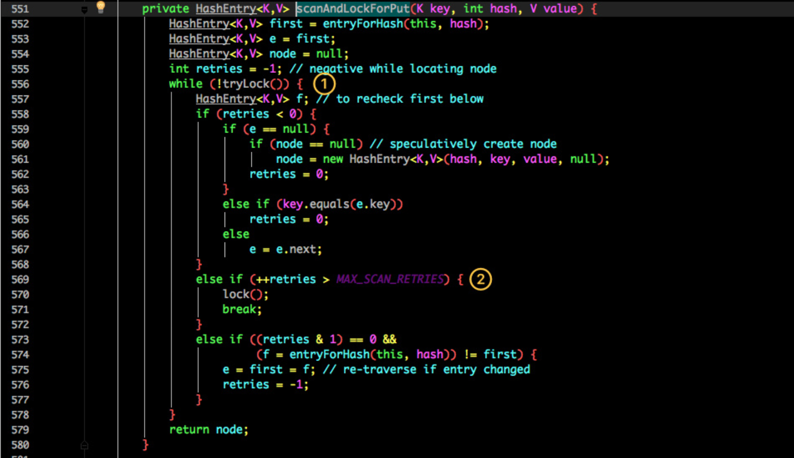
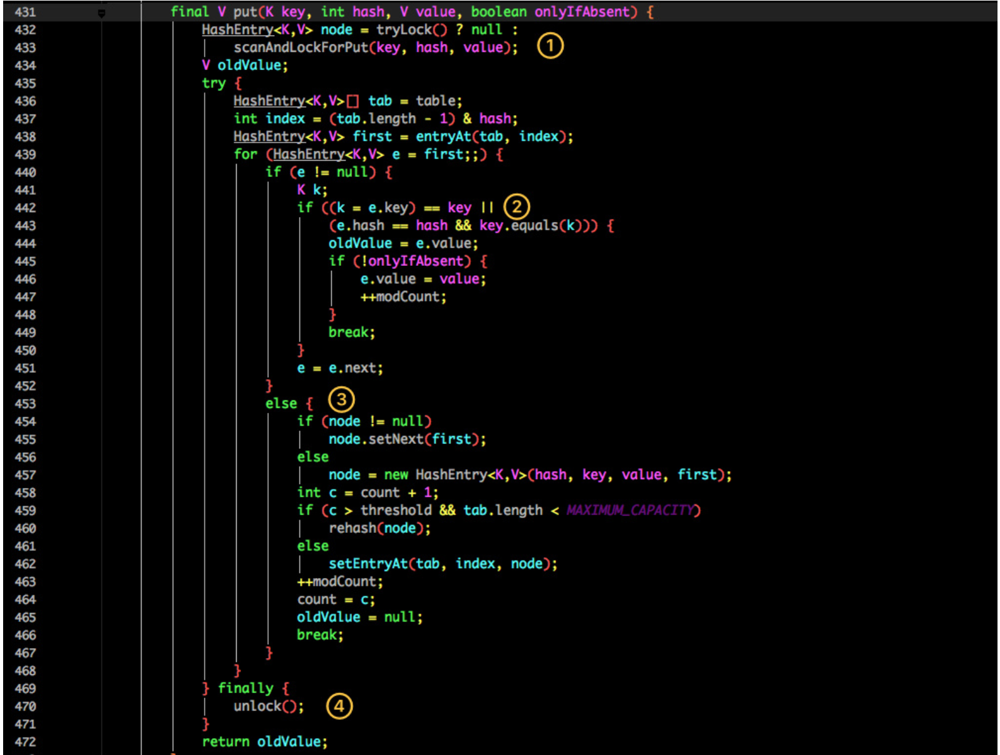
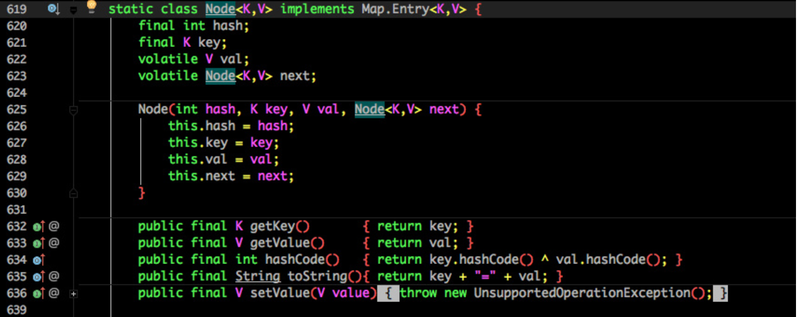
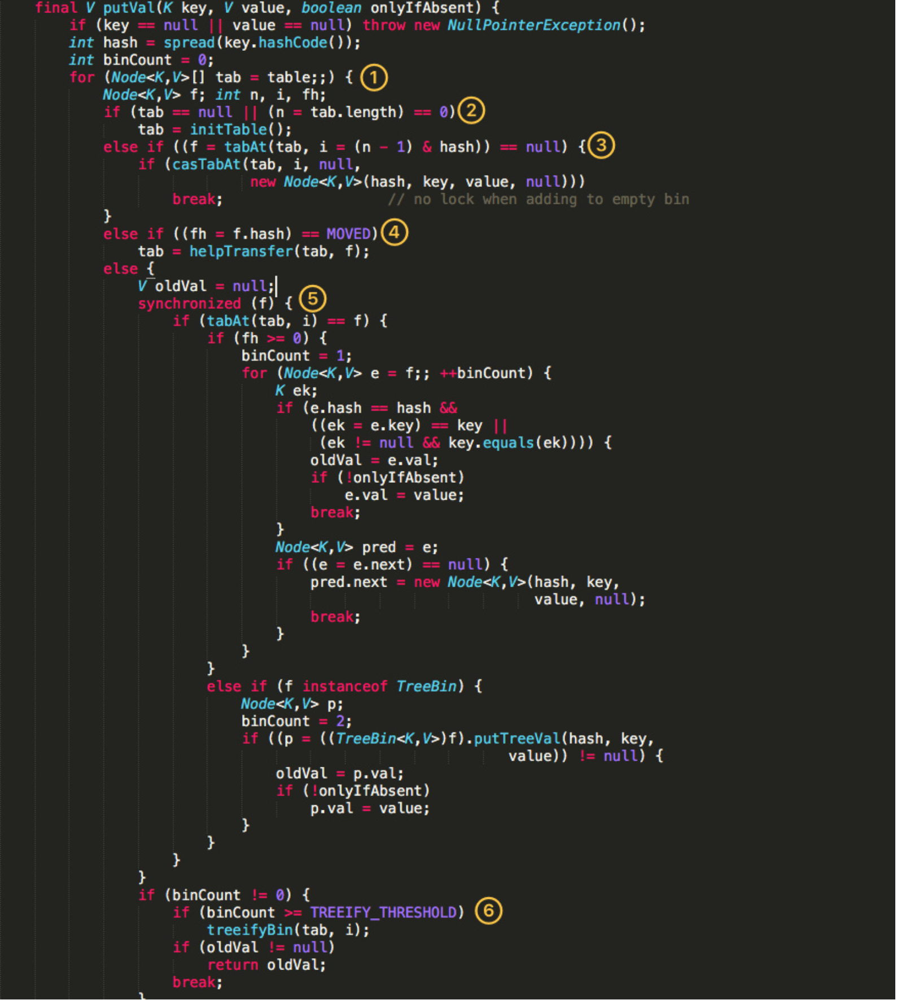
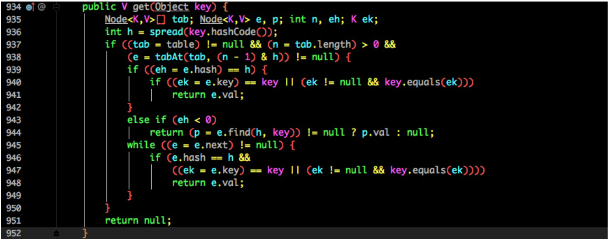

# 同步容器

早期版本的JDK提供的同步容器类为Vector和Hashtable和Stack

JDK1.2 提供了Collections.synchronizedXxx等工程方法，将普通的容器继续包装。对每个共有方法都进行同步。

- Vector
- Stack
- HashTable
- Collections.synchronized方法生成，例如：
  - Collectinons.synchronizedList()
  - Collections.synchronizedSet()
  - Collections.synchronizedMap()
  - Collections.synchronizedSortedSet()
  - Collections.synchronizedSortedMap()

## Vector

### 1. 同步

它的实现与 ArrayList 类似，但是使用了 synchronized 进行同步。

```java
public synchronized boolean add(E e) {
    modCount++;
    ensureCapacityHelper(elementCount + 1);
    elementData[elementCount++] = e;
    return true;
}

public synchronized E get(int index) {
    if (index >= elementCount)
        throw new ArrayIndexOutOfBoundsException(index);

    return elementData(index);
} 
```

### 2. 与 ArrayList 的比较

- Vector 是同步的，因此开销就比 ArrayList 要大，访问速度更慢。最好使用 ArrayList 而不是 Vector，因为同步操作完全可以由程序员自己来控制；
- Vector 每次扩容请求其大小的 2 倍空间，而 ArrayList 是 1.5 倍。

### 3. 替代方案

可以使用 `Collections.synchronizedList();` 得到一个线程安全的 ArrayList。

```java
List<String> list = new ArrayList<>();
List<String> synList = Collections.synchronizedList(list); 
```

也可以使用 concurrent 并发包下的 CopyOnWriteArrayList 类。

```java
List<String> list = new CopyOnWriteArrayList<>(); 
```


# 并发容器

由上面的分析我们知道，同步容器并不能保证多线程安全，而并发容器是针对多个线程并发访问而设计的，在jdk5.0引入了concurrent包，其中提供了很多并发容器，极大的提升同步容器类的性能。

## ConcurrentHashMap

- 对应的非并发容器：HashMap
- 目标：代替Hashtable、synchronizedMap，支持复合操作
- 原理：JDK6中采用一种更加细粒度的加锁机制Segment“分段锁”，JDK8中采用CAS无锁算法，详细分析推荐阅读[【JDK】：ConcurrentHashMap高并发机制——【转载】](http://blog.csdn.net/u011080472/article/details/51392712)。

### 1. 存储结构

```java
static final class HashEntry<K,V> {
    final int hash;
    final K key;
    volatile V value;
    volatile HashEntry<K,V> next;
} 
```

ConcurrentHashMap 和 HashMap 实现上类似，最主要的差别是 ConcurrentHashMap 采用了分段锁（Segment），每个分段锁维护着几个桶（HashEntry），多个线程可以同时访问不同分段锁上的桶，从而使其并发度更高（并发度就是 Segment 的个数）。

Segment 继承自 ReentrantLock。

```java
static final class Segment<K,V> extends ReentrantLock implements Serializable {

    private static final long serialVersionUID = 2249069246763182397L;

    static final int MAX_SCAN_RETRIES =
        Runtime.getRuntime().availableProcessors() > 1 ? 64 : 1;

    transient volatile HashEntry<K,V>[] table;

    transient int count;

    transient int modCount;

    transient int threshold;

    final float loadFactor;
} 
final Segment<K,V>[] segments; 
```

默认的并发级别为 16，也就是说默认创建 16 个 Segment。

```java
static final int DEFAULT_CONCURRENCY_LEVEL = 16; 
```


### 2. size 操作

每个 Segment 维护了一个 count 变量来统计该 Segment 中的键值对个数。

```java
/**
 * The number of elements. Accessed only either within locks
 * or among other volatile reads that maintain visibility.
 */
transient int count; 
```

在执行 size 操作时，需要遍历所有 Segment 然后把 count 累计起来。

ConcurrentHashMap 在执行 size 操作时先尝试不加锁，如果连续两次不加锁操作得到的结果一致，那么可以认为这个结果是正确的。

尝试次数使用 RETRIES_BEFORE_LOCK 定义，该值为 2，retries 初始值为 -1，因此尝试次数为 3。

如果尝试的次数超过 3 次，就需要对每个 Segment 加锁。

```java
/**
 * Number of unsynchronized retries in size and containsValue
 * methods before resorting to locking. This is used to avoid
 * unbounded retries if tables undergo continuous modification
 * which would make it impossible to obtain an accurate result.
 */
static final int RETRIES_BEFORE_LOCK = 2;

public int size() {
    // Try a few times to get accurate count. On failure due to
    // continuous async changes in table, resort to locking.
    final Segment<K,V>[] segments = this.segments;
    int size;
    boolean overflow; // true if size overflows 32 bits
    long sum;         // sum of modCounts
    long last = 0L;   // previous sum
    int retries = -1; // first iteration isn't retry
    try {
        for (;;) {
            // 超过尝试次数，则对每个 Segment 加锁
            if (retries++ == RETRIES_BEFORE_LOCK) {
                for (int j = 0; j < segments.length; ++j)
                    ensureSegment(j).lock(); // force creation
            }
            sum = 0L;
            size = 0;
            overflow = false;
            for (int j = 0; j < segments.length; ++j) {
                Segment<K,V> seg = segmentAt(segments, j);
                if (seg != null) {
                    sum += seg.modCount;
                    int c = seg.count;
                    if (c < 0 || (size += c) < 0)
                        overflow = true;
                }
            }
            // 连续两次得到的结果一致，则认为这个结果是正确的
            if (sum == last)
                break;
            last = sum;
        }
    } finally {
        if (retries > RETRIES_BEFORE_LOCK) {
            for (int j = 0; j < segments.length; ++j)
                segmentAt(segments, j).unlock();
        }
    }
    return overflow ? Integer.MAX_VALUE : size;
} 
```

### 3. JDK 1.8 的改动

JDK 1.7 使用分段锁机制来实现并发更新操作，核心类为 Segment，它继承自重入锁 ReentrantLock，并发度与 Segment 数量相等。

JDK 1.8 使用了 CAS 操作来支持更高的并发度，在 CAS 操作失败时使用内置锁 synchronized。

并且 JDK 1.8 的实现也在链表过长时会转换为红黑树。

## ConcurrentHashMap

ConcurrentHashMap 同样也分为 1.7 、1.8 版，两者在实现上略有不同。

### Base 1.7

先来看看 1.7 的实现，下面是他的结构图：

[](https://ws4.sinaimg.cn/large/006tNc79gy1ftj0evlsrgj30dw073gm2.jpg)

如图所示，是由 Segment 数组、HashEntry 组成，和 HashMap 一样，仍然是数组加链表。

它的核心成员变量：

```java
/**
 * Segment 数组，存放数据时首先需要定位到具体的 Segment 中。
 */
final Segment<K,V>[] segments;

transient Set<K> keySet;
transient Set<Map.Entry<K,V>> entrySet;
```

Segment 是 ConcurrentHashMap 的一个内部类，主要的组成如下：

```java
static final class Segment<K,V> extends ReentrantLock implements Serializable {

       private static final long serialVersionUID = 2249069246763182397L;
       
       // 和 HashMap 中的 HashEntry 作用一样，真正存放数据的桶
       transient volatile HashEntry<K,V>[] table;

       transient int count;

       transient int modCount;

       transient int threshold;

       final float loadFactor;
       
}
```

看看其中 HashEntry 的组成：

[](https://ws1.sinaimg.cn/large/006tNc79gy1ftj0mugrgnj30mo06l0tq.jpg)

和 HashMap 非常类似，唯一的区别就是其中的核心数据如 value ，以及链表都是 volatile 修饰的，保证了获取时的可见性。

原理上来说：ConcurrentHashMap 采用了分段锁技术，其中 Segment 继承于 ReentrantLock。不会像 HashTable 那样不管是 put 还是 get 操作都需要做同步处理，理论上 ConcurrentHashMap 支持 CurrencyLevel (Segment 数组数量)的线程并发。每当一个线程占用锁访问一个 Segment 时，不会影响到其他的 Segment。

下面也来看看核心的 `put get` 方法。

#### put 方法

```Java
public V put(K key, V value) {
    Segment<K,V> s;
    if (value == null)
        throw new NullPointerException();
    int hash = hash(key);
    int j = (hash >>> segmentShift) & segmentMask;
    if ((s = (Segment<K,V>)UNSAFE.getObject          // nonvolatile; recheck
         (segments, (j << SSHIFT) + SBASE)) == null) //  in ensureSegment
        s = ensureSegment(j);
    return s.put(key, hash, value, false);
}
```

首先是通过 key 定位到 Segment，之后在对应的 Segment 中进行具体的 put。

```Java
final V put(K key, int hash, V value, boolean onlyIfAbsent) {
    HashEntry<K,V> node = tryLock() ? null :
        scanAndLockForPut(key, hash, value);
    V oldValue;
    try {
        HashEntry<K,V>[] tab = table;
        int index = (tab.length - 1) & hash;
        HashEntry<K,V> first = entryAt(tab, index);
        for (HashEntry<K,V> e = first;;) {
            if (e != null) {
                K k;
                if ((k = e.key) == key ||
                    (e.hash == hash && key.equals(k))) {
                    oldValue = e.value;
                    if (!onlyIfAbsent) {
                        e.value = value;
                        ++modCount;
                    }
                    break;
                }
                e = e.next;
            }
            else {
                if (node != null)
                    node.setNext(first);
                else
                    node = new HashEntry<K,V>(hash, key, value, first);
                int c = count + 1;
                if (c > threshold && tab.length < MAXIMUM_CAPACITY)
                    rehash(node);
                else
                    setEntryAt(tab, index, node);
                ++modCount;
                count = c;
                oldValue = null;
                break;
            }
        }
    } finally {
        unlock();
    }
    return oldValue;
}
```

虽然 HashEntry 中的 value 是用 volatile 关键词修饰的，但是并不能保证并发的原子性，所以 put 操作时仍然需要加锁处理。

首先第一步的时候会尝试获取锁，如果获取失败肯定就有其他线程存在竞争，则利用 `scanAndLockForPut()` 自旋获取锁。



1. 尝试自旋获取锁。
2. 如果重试的次数达到了 `MAX_SCAN_RETRIES` 则改为阻塞锁获取，保证能获取成功。



再结合图看看 put 的流程。

1. 将当前 Segment 中的 table 通过 key 的 hashcode 定位到 HashEntry。
2. 遍历该 HashEntry，如果不为空则判断传入的 key 和当前遍历的 key 是否相等，相等则覆盖旧的 value。
3. 不为空则需要新建一个 HashEntry 并加入到 Segment 中，同时会先判断是否需要扩容。
4. 最后会解除在 1 中所获取当前 Segment 的锁。

#### get 方法

```Java
public V get(Object key) {
    Segment<K,V> s; // manually integrate access methods to reduce overhead
    HashEntry<K,V>[] tab;
    int h = hash(key);
    long u = (((h >>> segmentShift) & segmentMask) << SSHIFT) + SBASE;
    if ((s = (Segment<K,V>)UNSAFE.getObjectVolatile(segments, u)) != null &&
        (tab = s.table) != null) {
        for (HashEntry<K,V> e = (HashEntry<K,V>) UNSAFE.getObjectVolatile
                 (tab, ((long)(((tab.length - 1) & h)) << TSHIFT) + TBASE);
             e != null; e = e.next) {
            K k;
            if ((k = e.key) == key || (e.hash == h && key.equals(k)))
                return e.value;
        }
    }
    return null;
}
```

get 逻辑比较简单：

只需要将 Key 通过 Hash 之后定位到具体的 Segment ，再通过一次 Hash 定位到具体的元素上。

由于 HashEntry 中的 value 属性是用 volatile 关键词修饰的，保证了内存可见性，所以每次获取时都是最新值。

ConcurrentHashMap 的 get 方法是非常高效的，**因为整个过程都不需要加锁**。

### Base 1.8

1.7 已经解决了并发问题，并且能支持 N 个 Segment 这么多次数的并发，但依然存在 HashMap 在 1.7 版本中的问题。

> 那就是查询遍历链表效率太低。

因此 1.8 做了一些数据结构上的调整。

首先来看下底层的组成结构：

[](https://ws3.sinaimg.cn/large/006tNc79gy1fthpv4odbsj30lp0drmxr.jpg)

看起来是不是和 1.8 HashMap 结构类似？

其中抛弃了原有的 Segment 分段锁，而采用了 `CAS + synchronized` 来保证并发安全性。



也将 1.7 中存放数据的 HashEntry 改为 Node，但作用都是相同的。

其中的 `val next` 都用了 volatile 修饰，保证了可见性。

#### put 方法

重点来看看 put 函数：



- 根据 key 计算出 hashcode 。
- 判断是否需要进行初始化。
- `f` 即为当前 key 定位出的 Node，如果为空表示当前位置可以写入数据，利用 CAS 尝试写入，失败则自旋保证成功。
- 如果当前位置的 `hashcode == MOVED == -1`,则需要进行扩容。
- 如果都不满足，则利用 synchronized 锁写入数据。
- 如果数量大于 `TREEIFY_THRESHOLD` 则要转换为红黑树。

#### get 方法



- 根据计算出来的 hashcode 寻址，如果就在桶上那么直接返回值。
- 如果是红黑树那就按照树的方式获取值。
- 就不满足那就按照链表的方式遍历获取值。

> 1.8 在 1.7 的数据结构上做了大的改动，采用红黑树之后可以保证查询效率（`O(logn)`），甚至取消了 ReentrantLock 改为了 synchronized，这样可以看出在新版的 JDK 中对 synchronized 优化是很到位的。

## CopyOnWriteArrayList

- 对应的非并发容器：ArrayList
- 目标：代替Vector、synchronizedList
- 原理：利用高并发往往是读多写少的特性，对读操作不加锁，对写操作，先复制一份新的集合，在新的集合上面修改，然后将新集合赋值给旧的引用，并通过volatile 保证其可见性，当然写操作的锁是必不可少的了。

关于这一部分可参考[【JDK】：CopyOnWriteArrayList、CopyOnWriteArraySet 源码解析](http://blog.csdn.net/u011080472/article/details/51419001)

```Java
public class CopyOnWriteArrayList<E>
    implements List<E>, RandomAccess, Cloneable, java.io.Serializable {
```

### 读写分离

写操作在一个复制的数组上进行，读操作还是在原始数组中进行，读写分离，互不影响。

写操作需要加锁，防止并发写入时导致写入数据丢失。

写操作结束之后需要把原始数组指向新的复制数组。

```java
public boolean add(E e) {
    final ReentrantLock lock = this.lock;
    //加锁
    lock.lock();
    try {
        Object[] elements = getArray();
        int len = elements.length;
        Object[] newElements = Arrays.copyOf(elements, len + 1);
        newElements[len] = e;
        setArray(newElements);
        return true;
    } finally {
        lock.unlock();
    }
}

    final void setArray(Object[] a) {
        array = a;
    }
@SuppressWarnings("unchecked")
private E get(Object[] a, int index) {
    return (E) a[index];
}
```

### 适用场景

CopyOnWriteArrayList 在写操作的同时允许读操作，大大提高了读操作的性能，因此很适合读多写少的应用场景。

但是 CopyOnWriteArrayList 有其缺陷：

- 内存占用：在写操作时需要复制一个新的数组，使得内存占用为原来的两倍左右；
- 数据不一致：读操作不能读取实时性的数据，因为部分写操作的数据还未同步到读数组中。

所以 CopyOnWriteArrayList 不适合内存敏感以及对实时性要求很高的场景。

## **CopyOnWriteArraySet**

- 对应的非并发容器：HashSet
- 目标：代替synchronizedSet
- 原理：基于CopyOnWriteArrayList实现，其唯一的不同是在add时调用的是CopyOnWriteArrayList的addIfAbsent方法，其遍历当前Object数组，如Object数组中已有了当前元素，则直接返回，如果没有则放入Object数组的尾部，并返回。

关于这一部分可参考[【JDK】：CopyOnWriteArrayList、CopyOnWriteArraySet 源码解析](http://blog.csdn.net/u011080472/article/details/51419001)

## **ConcurrentSkipListMap**

- 对应的非并发容器：TreeMap
- 目标：代替synchronizedSortedMap(TreeMap)
- 原理：Skip list（跳表）是一种可以代替平衡树的数据结构，默认是按照Key值升序的。Skip list让已排序的数据分布在多层链表中，以0-1随机数决定一个数据的向上攀升与否，通过”空间来换取时间”的一个算法。ConcurrentSkipListMap提供了一种线程安全的并发访问的排序映射表。内部是SkipList（跳表）结构实现，在理论上能够在O（log（n））时间内完成查找、插入、删除操作。

## **ConcurrentSkipListSet**

- 对应的非并发容器：TreeSet
- 目标：代替synchronizedSortedSet
- 原理：内部基于ConcurrentSkipListMap实现

## 非阻塞队列

### ConcurrentLinkedQueue**

不会阻塞的队列

- 对应的非并发容器：Queue
- 原理：基于链表实现的FIFO队列（LinkedList的并发版本）

## 阻塞队列

阻塞队列最核心的功能是，能够可阻塞式的插入和删除队列元素。当前队列为空时，会阻塞消费数据的线程，直至队列非空时，通知被阻塞的线程；当队列满时，会阻塞插入数据的线程，直至队列未满时，通知插入数据的线程（生产者线程）。

- 对应的接口：BlockingQueue
- 特点：拓展了Queue，增加了可阻塞的插入和获取等操作
- 原理：通过ReentrantLock实现线程安全，通过Condition实现阻塞和唤醒
- 实现类：
  - LinkedBlockingQueue：基于链表实现的可阻塞的FIFO队列
  - ArrayBlockingQueue：基于数组实现的可阻塞的FIFO队列
  - PriorityBlockingQueue：按优先级排序的队列

### ArrayBlockingQueue

该并发集合其底层是使用了java.util.ReentrantLock和java.util.Condition来完成并发控制的

#### 主要属性

ArrayBlockingQueue的主要属性如下:

```Java
/** The queued items */
//采用数组存储
final Object[] items;

/** items index for next take, poll, peek or remove */
int takeIndex;

/** items index for next put, offer, or add */
int putIndex;

/** Number of elements in the queue */
int count;

/*
 * Concurrency control uses the classic two-condition algorithm
 * found in any textbook.
 */

/** Main lock guarding all access */
//使用ReentrantLock保证线程安全
final ReentrantLock lock;

/** Condition for waiting takes */
//Condition实现锁的条件
//当获取数据的消费者线程被阻塞时会将该线程放置到notEmpty等待队列中
private final Condition notEmpty;

/** Condition for waiting puts */
//当插入数据的生产者线程被阻塞时，会将该线程放置到notFull等待队列中
private final Condition notFull;
```

- 从源码中可以看出ArrayBlockingQueue内部是采用数组进行数据存储的（`属性items`）
- 为了保证线程安全，采用的是`ReentrantLock lock`，为了保证可阻塞式的插入删除数据利用的是Condition
- 当获取数据的消费者线程被阻塞时会将该线程放置到notEmpty等待队列中
- 当插入数据的生产者线程被阻塞时，会将该线程放置到notFull等待队列中。
- 而notEmpty和notFull等中要属性在构造方法中进行创建：

```Java
public ArrayBlockingQueue(int capacity, boolean fair) {
    if (capacity <= 0)
        throw new IllegalArgumentException();
    this.items = new Object[capacity];
    lock = new ReentrantLock(fair);
    notEmpty = lock.newCondition();
    notFull =  lock.newCondition();
}
```

接下来，主要看看可阻塞式的put和take方法是怎样实现的。

#### put方法详解

`put(E e)`方法源码如下：

```java
public void put(E e) throws InterruptedException {
    checkNotNull(e);
    final ReentrantLock lock = this.lock;
    lock.lockInterruptibly();
    try {
		//如果当前队列已满，将线程移入到notFull等待队列中
        while (count == items.length)
            notFull.await();
		//满足插入数据的要求，直接进行入队操作
        enqueue(e);
    } finally {
        lock.unlock();
    }
}
```

该方法的逻辑很简单，当队列已满时（`count == items.length`）将线程移入到notFull等待队列中，如果当前满足插入数据的条件，就可以直接调用`enqueue(e)`插入数据元素。enqueue方法源码为：

```java
private void enqueue(E x) {
    // assert lock.getHoldCount() == 1;
    // assert items[putIndex] == null;
    final Object[] items = this.items;
	//插入数据
    items[putIndex] = x;
    if (++putIndex == items.length)
        putIndex = 0;
    count++;
	//通知消费者线程，当前队列中有数据可供消费
    notEmpty.signal();
}
```

enqueue方法的逻辑同样也很简单，先完成插入数据，即往数组中添加数据（`items[putIndex] = x`），然后通知被阻塞的消费者线程，当前队列中有数据可供消费（`notEmpty.signal()`）。

#### take方法详解

take方法源码如下：

```java
public E take() throws InterruptedException {
    final ReentrantLock lock = this.lock;
    lock.lockInterruptibly();
    try {
		//如果队列为空，没有数据，将消费者线程移入等待队列中
        while (count == 0)
            notEmpty.await();
		//获取数据
        return dequeue();
    } finally {
        lock.unlock();
    }
}

```

take方法也主要做了两步：1. 如果当前队列为空的话，则将获取数据的消费者线程移入到等待队列中；2. 若队列不为空则获取数据，即完成出队操作`dequeue`。dequeue方法源码为：

```java
private E dequeue() {
    // assert lock.getHoldCount() == 1;
    // assert items[takeIndex] != null;
    final Object[] items = this.items;
    @SuppressWarnings("unchecked")
	//获取数据
    E x = (E) items[takeIndex];
    items[takeIndex] = null;
    if (++takeIndex == items.length)
        takeIndex = 0;
    count--;
    if (itrs != null)
        itrs.elementDequeued();
    //通知被阻塞的生产者线程
	notFull.signal();
    return x;
}
```

dequeue方法也主要做了两件事情：

1. 获取队列中的数据，即获取数组中的数据元素（`(E) items[takeIndex]`）；
2.  通知notFull等待队列中的线程，使其由等待队列移入到同步队列中，使其能够有机会获得lock，并执行完成功退出。

从以上分析，可以看出put和take方法主要是通过condition的通知机制来完成可阻塞式的插入数据和获取数据。在理解ArrayBlockingQueue后再去理解LinkedBlockingQueue就很容易了。

### LinkedBlockingQueue

LinkedBlockingQueue是用链表实现的有界阻塞队列，当构造对象时为指定队列大小时，队列默认大小为`Integer.MAX_VALUE`。从它的构造方法可以看出：

```java
public LinkedBlockingQueue() {
    this(Integer.MAX_VALUE);
}
```

#### LinkedBlockingQueue的主要属性

LinkedBlockingQueue的主要属性有：

```java
/** Current number of elements */
private final AtomicInteger count = new AtomicInteger();

/**
 * Head of linked list.
 * Invariant: head.item == null
 */
transient Node<E> head;

/**
 * Tail of linked list.
 * Invariant: last.next == null
 */
private transient Node<E> last;

/** Lock held by take, poll, etc */
private final ReentrantLock takeLock = new ReentrantLock();

/** Wait queue for waiting takes */
private final Condition notEmpty = takeLock.newCondition();

/** Lock held by put, offer, etc */
private final ReentrantLock putLock = new ReentrantLock();

/** Wait queue for waiting puts */
private final Condition notFull = putLock.newCondition();
```

可以看出与ArrayBlockingQueue主要的区别是，LinkedBlockingQueue在插入数据和删除数据时分别是由两个不同的lock（`takeLock`和`putLock`）来控制线程安全的，因此，也由这两个lock生成了两个对应的condition（`notEmpty`和`notFull`）来实现可阻塞的插入和删除数据。并且，采用了链表的数据结构来实现队列，Node结点的定义为：

```java
static class Node<E> {
    E item;

    /**
     * One of:
     * - the real successor Node
     * - this Node, meaning the successor is head.next
     * - null, meaning there is no successor (this is the last node)
     */
    Node<E> next;

    Node(E x) { item = x; }
}
```

接下来，我们也同样来看看put方法和take方法的实现。

#### put方法详解

put方法源码为:

```java
public void put(E e) throws InterruptedException {
    if (e == null) throw new NullPointerException();
    // Note: convention in all put/take/etc is to preset local var
    // holding count negative to indicate failure unless set.
    int c = -1;
    Node<E> node = new Node<E>(e);
    final ReentrantLock putLock = this.putLock;
    final AtomicInteger count = this.count;
    putLock.lockInterruptibly();
    try {
        /*
         * Note that count is used in wait guard even though it is
         * not protected by lock. This works because count can
         * only decrease at this point (all other puts are shut
         * out by lock), and we (or some other waiting put) are
         * signalled if it ever changes from capacity. Similarly
         * for all other uses of count in other wait guards.
         */
		//如果队列已满，则阻塞当前线程，将其移入等待队列
        while (count.get() == capacity) {
            notFull.await();
        }
		//入队操作，插入数据
        enqueue(node);
        c = count.getAndIncrement();
		//若队列满足插入数据的条件，则通知被阻塞的生产者线程
        if (c + 1 < capacity)
            notFull.signal();
    } finally {
        putLock.unlock();
    }
    if (c == 0)
        signalNotEmpty();
}
```

put方法的逻辑也同样很容易理解，可见注释。基本上和ArrayBlockingQueue的put方法一样。take方法的源码如下：

```java
public E take() throws InterruptedException {
    E x;
    int c = -1;
    final AtomicInteger count = this.count;
    final ReentrantLock takeLock = this.takeLock;
    takeLock.lockInterruptibly();
    try {
		//当前队列为空，则阻塞当前线程，将其移入到等待队列中，直至满足条件
        while (count.get() == 0) {
            notEmpty.await();
        }
		//移除队头元素，获取数据
        x = dequeue();
        c = count.getAndDecrement();
        //如果当前满足移除元素的条件，则通知被阻塞的消费者线程
		if (c > 1)
            notEmpty.signal();
    } finally {
        takeLock.unlock();
    }
    if (c == capacity)
        signalNotFull();
    return x;
}
```

take方法的主要逻辑请见于注释，也很容易理解。

### 比较

**相同点**：

ArrayBlockingQueue和LinkedBlockingQueue都是通过condition通知机制来实现可阻塞式插入和删除元素，并满足线程安全的特性；

**不同点**：

1. ArrayBlockingQueue底层是采用的数组进行实现，而LinkedBlockingQueue则是采用链表数据结构； 
2. ArrayBlockingQueue插入和删除数据，只采用了一个lock，而LinkedBlockingQueue则是在插入和删除分别采用了`putLock`和`takeLock`，这样可以降低线程由于线程无法获取到lock而进入WAITING状态的可能性，从而提高了线程并发执行的效率。

### PriorityBlockingQueue

## Condition

[详解Condition的await和signal等待/通知机制](https://juejin.im/post/5aeea5e951882506a36c67f0)


# 参考 #

1. [crossoverJie](https://github.com/crossoverJie)
2. 
