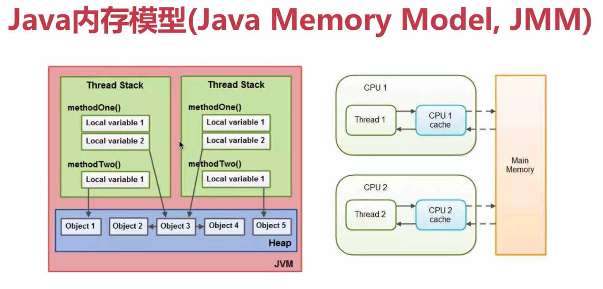
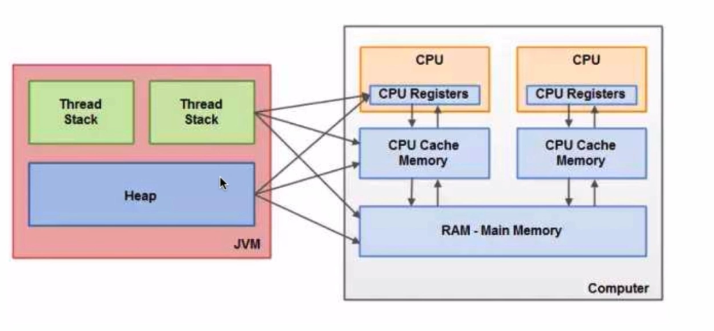
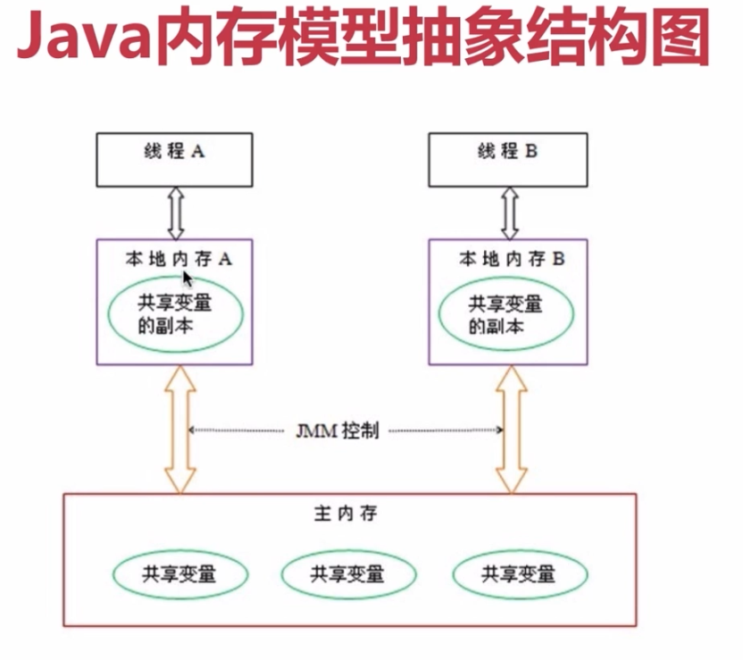
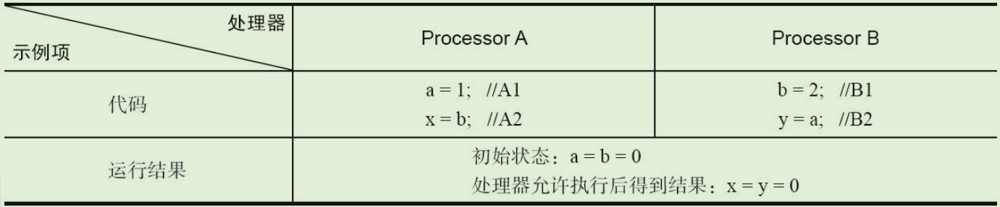
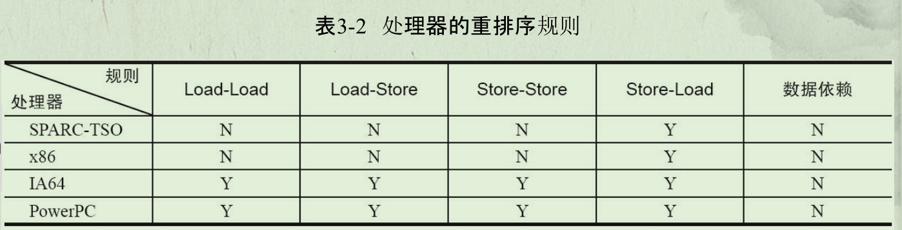
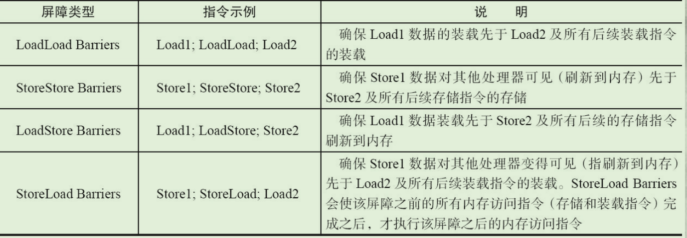
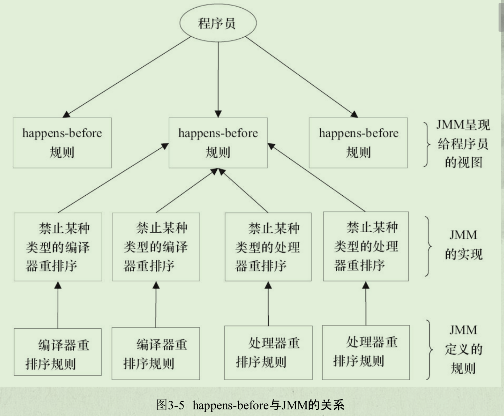
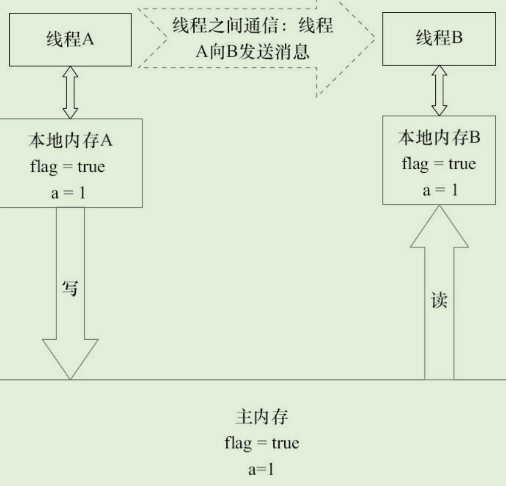
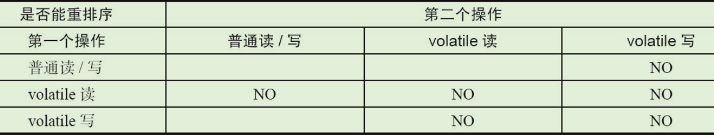

# JMM基础

## 并发编程模型的两个关键问题

1. 线程间如何通信。通信指线程间以何种机制交换信息
2. 线程间如何同步

在命令式编程中，线程通信机制有两种：

- 共享内存。
  - 线程间共享程序的公共状态，通过读写内存中的公共状态进行隐式通信
  - 同步是显式进行的，程序员必须显式指定某个方法或某段代码需要在线程间互斥执行
- 消息传递。
  - 线程间没有公共状态，必须通过发送消息来显式进行通信
  - 同步是隐式进行的，消息的发送必须在消息的接受前

**Java并发采用的是共享内存模型**

Java线程间通信总是隐式进行，整个通信过程对程序员完全透明

## JMM

为了屏蔽各种硬件与操作系统的内存访问差异，以实现java程序在各种系统下都能并发。

JMM规范了java虚拟机与计算机内存如何协同工作，规定了一个线程如何和何时能看到其他线程修改过的共享变量的值，以及在必须时如何同步地访问共享变量

### JMM结构

堆：运行时的数据区，由垃圾回收负责，动态分配内存。由于运行时动态分配，存取速度慢

栈：存取速度快，数据可共享。存在栈当中的数据大小与生存期必须确定。

当线程中对对象的引用，引用了在堆上的对象，调用了对象的方法，访问了对象的数据，这个时候他们拥有的是对象成员变量的私有**拷贝**




**CPU寄存器**

CPU registers，访问缓存的速度最快，其次是高速缓存






## JMM的抽象结构

- Java中，所有实例域、静态域和数组元素都存放在堆内存中，堆内存在线程间共享。即共享变量
- 局部变量和异常处理器参数不会在线程间共享，不会有内存可见性问题，不受内存模型影响。

Java线程间通信由JMM控制，JMM决定一个线程对共享变量的写入何时对另一个线程可见。JMM定义了线程和主内存间的抽象关系。

JMM通过控制主内存与每个线程的本地内存间的交互，为程序员提供内存可见性保证。

## 从源代码到指令序列的重排序

在执行程序时，为了提高性能，编译器和处理器常常会对指令做重排序。重排序分3种类型。

- 编译器重排序：编译器优化的重排序。编译器在不改变单线程程序语义的前提下，可以重新安排语句的执行顺序。
- 处理器重排序：
  - 指令级并行的重排序。现代处理器采用了指令级并行技术（Instruction-LevelParallelism，ILP）来将多条指令重叠执行。如果不存在数据依赖性，处理器可以改变语句对应机器指令的执行顺序。
  - 内存系统的重排序。由于处理器使用缓存和读/写缓冲区，这使得加载和存储操作看上去可能是在乱序执行。

对于Java源代码到最终执行的指令序列，会经历三种重排序，可能导致内存可见性问题：


JMM属于语言级别的内存模型，确保在不同的编译器和处理器平台上，通过禁止特定类型的编译器重排序和处理器重排序，保证一致性的内存可见性。

- 对于编译器，JMM的编译器重排序规则会禁止**特定类型**的编译器重排序
- 对于处理器重排序。JMM的处理器重排序规则会要求Java编译器在生成指令序列时，插入特定类型的内存屏障指令，禁止特定类型的处理器重排序

## 并发编程模型的分类

现代处理器的写缓冲区：

- 临时保存向内存写入的数据。
- 优点：保证指令流水线的持续运行，避免由于处理器停顿下来等待向内存写入数据而产生的延迟。以批处理方式刷新写缓冲区，合并对同一内存地址的多次写，减少对内存总线的占用
- 缺点：写缓冲区只对其所在处理器可见。对内存操作的执行顺序产生重要影响。导致处理器对内存的读、写操作的执行顺序，不一定与内存实际发生的读、写顺序一致

示例：在并行执行下



现代处理器都会允许对写-读操作重排序



### 内存屏障指令

为了保证内存可见性，Java编译器在生成指令序列的适当位置会插入内存屏障指令来禁止特定类型的处理器重排序



- StoreLoad Barriers
  - 全能型屏障，具有其他3个屏障的效果。现代处理器大多数支持该屏障
  - 开销很高，要把写缓冲区的数据全部刷新到内存中

## 同步八种操作

- lock锁定：作用于主内存的变量，把一个变量标识为一条线程独占状态
- unlock解锁：作用于主内存的变量，把一个处于锁定状态的变量释放出来，释放后的变量才可以被其他线程锁定
- read读取：作用于主内存的变量，把一个变量值从主内存传输到线程的工作内存中，以便随后load动作使用
- load载入：作用于工作内存的变量，把read操作从主内存得到的变量值放入工作内存的**变量副本**中
- use使用：作用于工作内存的变量，把工作内存的一个变量值传递给**执行引擎**（线程）
- assign赋值：作用于工作内存的变量，把一个从执行引擎接收到的值赋值给工作内存的变量
- store存储：作用于工作内存的变量，把工作内存的一个变量的值传递到主内存中，以便随后的write操作
- write写入：作用于主内存的变量，把store操作从工作内存中一个变量的值传送到主内存的变量中


## happens-before

JDK5开始，Java使用新的JSR-133内存模型，JSR-133使用happens-before的概念来阐述操作之间的内存可见性

**概述**

在JMM中，**如果一个操作执行的结果需要对另一个操作可见**，那么这两个操作之间**必须要存在**happens-before关系。这里提到的两个操作既可以是在一个线程之内，也可以是在不同线程之间。



**happens-before规则**

- **程序次序规则**：一个线程内，按照代码顺序，书写在前面的操作先行发生于书写在后面的操作
- **锁定操作**：一个unlock操作先行发生于后面对同一个锁的lock操作
- **volatile变量规则**：对一个变量的写操作先行发生于后面对于这个变量的读操作
- **传递规则**；如果操作A先行发生于操作B，而操作B又先行发生于操作C，则操作A先行发生于操作C
- 线程启动规则：Thread对象的start（）方法先行发生于此线程的每一个动作
- 线程中断规则：对线程interrupt()方法的调用先行发生于被中断线程的代码检测到中断事件的发生
- 线程终结规则：线程中所有的操作都先行发生于线程的终止检测
- 对象终结规则：一个对象的初始化完成先行发生于它的finalize（）方法的开始

**优点**

happens-before规则避免Java程序员为了理解JMM提供的内存可见性保证而去学习复杂的重排序规则以及这些规则的具体实现方法

# 重排序

重排序是指编译器和处理器为了优化程序性能而对指令序列进行重新排序的一种手段。

## 数据依赖性

数据依赖性：如果两个操作访问同一个变量，且这两个操作中有一个为写操作，此时这两个操作间就存在数据依赖性。（只考虑单个处理器中执行的指令序列和单个线程中执行的操作）

分类：

- 写后读。`a=1;b=a;`
- 写后写。`a=1;a=2;`
- 读后写。`a=b;b=1;`

在数据依赖性下，只要重排序两个操作的执行顺序，程序的执行结果就会改变。

## as-if-serial语义

as-if-serial语义指：不管怎么重排序，单线程程序的执行结果不能被改变。编译器、runtime和处理器必须遵守as-if-serial语义。

为了遵守as-if-serial语义，编译器和处理器不会对存在数据依赖关系的操作做重排序，因为这种重排序会改变执行结果。但如果操作间不存在数据依赖关系，则这些操作可能被重排序。

as-if-serial语义将单线程保护了起来，编译器、runtime、处理器共同为单线程程序员创造了一个幻觉，即单线程程序是按照程序的顺序来执行的。因此单线程程序员无需担心重排序、内存可见性问题。

## 程序顺序规则

对于代码段

```java
double pi=3.14;
double r=1.0;
double area=pi*r*r;
```

根据程序顺序规则，则有

A happens-before B、B happens-before C、A happens-before C

- 但是在实际操作中，B可以排在A之前执行
  - 这里的A结果不需要对B可见，因此这种重排序并不非法，JMM允许这种重排序。
- A happens-before B，JMM仅仅要求前一个操作执行的结果对后又改操作可见，且前一个操作按顺序排在第二个操作之前。

软件技术和硬件技术有一个共同的目标：在不改变程序执行结果的前提下，尽可能提高并行度。

## 重排序对多线程的影响

但在多线程程序中，对存在控制依赖的操作重排序，可能会改变程序的执行结果。

# 顺序一致性

顺序一致性内存模型是一个理论参考模型，在设计的时候，处理器的内存模型和编程语言的内存模型都会以顺序一致性内存模型作为参照。

## 数据竞争与顺序一致性

当程序未正确同步时，就可能存在数据竞争。

数据竞争：在一个线程中写一个变量，在另一个线程中读一个编程，而且写和读没有通过同步来排序。

**JMM对正确同步的多线程程序的内存一致性做了如下保证**

如果程序是正确同步的，程序的执行将具有顺序一致性（Sequentially Consistent）——即程序的执行结果与该程序在顺序一致性内存模型中的执行结果相同。

## 顺序一致性内存模型

顺序一致性内存模型是一个被计算机科学家理想化了的理论参考模型，它为程序员提供了极强的内存可见性保证。顺序一致性内存模型有两大特性。

- 一个线程中的所有操作必须按照程序的顺序来执行
- 不管程序是否同步，所有线程都只能看到一个单一的操作执行顺序。在顺序一致性内存模型中，每个操作都必须原子执行且立刻对所有线程可见

而在JMM当中**是没有这个保证的**

- 未同步程序在JMM中不但整体的执行顺序是无序的，而且所有线程看到的操作执行顺序也可能不一致。
  - 比如，在当前线程把写过的数据缓存在本地内存中，在没有刷新到主内存之前，这个写操作仅对当前线程可见；
  - 从其他线程的角度来观察，会认为这个写操作根本没有被当前线程执行。
  - 只有当前线程把本地内存中写过的数据刷新到主内存之后，这个写操作才能对其他线程可见。在这种情况下，当前线程和其他线程看到的操作执行顺序将不一致。

## 同步程序的顺序一致性效果

示例代码：

```Java
class SynchronizedExample{
    int a = 0;
    boolean flag = false;
    public synchronized void writer(){
        a = 1;
        flag = true;
    }
    public synchronized void reader(){
        if(flag)
        	int i = a;
    }
}
```

根据JMM规范，该程序的执行结果将与程序在顺序一致性模型中的执行结果相同。

- JMM中，临界区内的代码可以重排序（但是临界区的代码不能逸出到临界区外，那样会破坏监视器的语义），JMM会在退出、进入临界区这两个时间点做一些特别处理，使得线程在这两个时间点具有与顺序一致性模型相同的内存视图
- 虽然线程A在临界区做了重排序，但由于监视器互斥执行的特性。线程B无法观察到线程A在临界区内的重排序。这种重排序既提高了执行效率，又没有改变程序的执行结果。

## 未同步程序的执行特性

对于未同步或未正确同步的多线程程序，JMM只提供最小安全性：线程执行时读取到的值，要么是之前某个线程写入的值，要么是默认值（0，Null，False），JMM保证线程读操作读取到的值不会无中生有（Out Of Thin Air）的冒出来。为了实现最小安全性，JVM在堆上分配对象时，首先会对内存空间进行清零，然后才会在上面分配对象（JVM内部会同步这两个操作）。因此，在已清零的内存空间（Pre-zeroed Memory）分配对象时，域的默认初始化已经完成了。

# volatile的内存语义

当声明共享变量为volatile后，对这个变量的读/写将会很特别。

## volatile的特性

理解volatile特性的一个好方法是把对volatile变量的单个读/写，看成是使用同一个锁对这些单个读/写操作做了同步。

示例代码：

```Java
class VolatileFeaturesExample {
	volatile long vl = 0L; // 使用volatile声明64位的long型变量
	public void set(long l) {
		vl = l; // 单个volatile变量的写
	}
	public void getAndIncrement () {
		vl++; // 复合（多个）volatile变量的读/写
	}
	public long get() {
		return vl; // 单个volatile变量的读
	}
}
```

假设有多个线程分别调用上面程序的3个方法，这个程序在语义上和下面程序等价。

```Java
class VolatileFeaturesExample {
	long vl = 0L; // 64位的long型普通变量
	public synchronized void set(long l) { // 对单个的普通变量的写用同一个锁同步
		vl = l;
	}
	public void getAndIncrement () { // 普通方法调用
		long temp = get(); // 调用已同步的读方法
		temp += 1L; // 普通写操作
		set(temp); // 调用已同步的写方法
	}
	public synchronized long get() { // 对单个的普通变量的读用同一个锁同步
		return vl;
	}
}
```

volatile变量特性：

- 可见性：对一个volatile变量的读，总是能看到（任意线程）对这个volatile变量最后的写入。
- 原子性：对任意单个volatile变量的读/写具有原子性，但类似于volatile++这种复合操作不具有原子性。

## volatile写-读建立的happens-before关系

volatile对线程的内存可见性的影响比volatile自身的特性更为重要。

JDK5开始，volatile变量的写-读可以实现线程间的通信。

从内存语义的角度来说

- volatile的写-读与锁的释放-获取有相同的内存效果。
- volatile写和锁的释放有相同的内存语义。
- volatile读与锁的获取有相同的内存语义。

```Java
class VolatileExample {
	int a = 0;
	volatile boolean flag = false;
	public void writer() {
		a = 1;　　　　　// 1
		flag = true;　　　// 2
	}
	public void reader() {
		if (flag) {　　　　// 3
			int i = a;　　// 4
			……
		}
	}
}
```

当线程A执行writer()，线程B执行reader()，则根据happens-before

- 根据程序次序规则，1 before 2,3 before 4
- 根据volatile规则，2 before 3
- 根据传递性规则，**1 before 4**

即这里A线程写一个volatile变量后，B线程读同一个volatile变量。

A线程在写volatile变量之前所有可见的共享变量，在B线程读同一个volatile变量后，**将立即变得对B线程可见**。

## volatile写-读的内存语义

**volatile写**内存语义：当写一个volatile变量时，JMM会把该线程对应的本地内存中的共享变量值刷新到主内存。

**volatile读**的内存语义：当读一个volatile变量时，JMM会把该线程对应的本地内存置为无效。线程接下来将从主内存中读取共享变量。

图为线程B读同一个volatile变量后，共享变量的状态示意图。



**总结**

- 线程A写一个volatile变量，实质上是线程A向接下来将要读这个volatile变量的某个线程发出了（其对共享变量所做修改的）消息。
- 线程B读一个volatile变量，实质上是线程B接收了之前某个线程发出的（在写这个volatile变量之前对共享变量所做修改的）消息。
- 线程A写一个volatile变量，随后线程B读这个volatile变量，这个过程实质上是线程A通过主内存向线程B发送消息。

## volatile内存语义的实现

JMM如何实现volatile写/读的内存语义。

为实现volatile，JMM限制编译器重排序与处理器重排序

volatile重排序规则表：



- 第三行最后一个单元格的意思是：在程序中，当第一个操作为普通变量的读或写时，如果第二个操作为volatile写，则编译器不能重排序这两个操作。
- 当第二个操作是volatile写时，不管第一个操作是什么，都不能重排序。这个规则确保volatile写之前的操作不会被编译器重排序到volatile写之后。

- 当第一个操作是volatile读时，不管第二个操作是什么，都不能重排序。这个规则确保volatile读之后的操作不会被编译器重排序到volatile读之前。
- 当第一个操作是volatile写，第二个操作是volatile读时，不能重排序。

### JMM实现

编译器在生成字节码时，会在指令序列中插入内存屏障来禁止特定类型的处理器重排序。对于编译器来说，发现一个最优布置来最小化插入屏障的总数几乎不可能。为此，JMM采取保守策略。下面是基于保守策略的JMM内存屏障插入策略。

- 在每个volatile写操作的前面插入一个StoreStore屏障。
- 在每个volatile写操作的后面插入一个StoreLoad屏障。
- 在每个volatile读操作的后面插入一个LoadLoad屏障。
- 在每个volatile读操作的后面插入一个LoadStore屏障。

上述内存屏障插入策略非常保守，但它可以保证在任意处理器平台，任意的程序中都能得到正确的volatile内存语义。

## JSR-133为什么要增强volatile的内存语义

在JSR-133之前的旧Java内存模型中，虽然不允许volatile变量之间重排序，但旧的Java内
存模型允许volatile变量与普通变量重排序。

为了提供一种比锁更轻量级的线程之间通信的机制，JSR-133专家组决定增强volatile的内存语义：严格
限制编译器和处理器对volatile变量与普通变量的重排序，确保volatile的写-读和锁的释放-获取具有相同的内存语义。

# 锁的内存语义

锁可以让临界区互斥执行。

## 锁的释放-获取建立的happens-before 

# final域的内存语义

# happens-before

# 双重检查锁定与延迟初始化

# JMM综述

# 总结

# 参考 #

1. 
