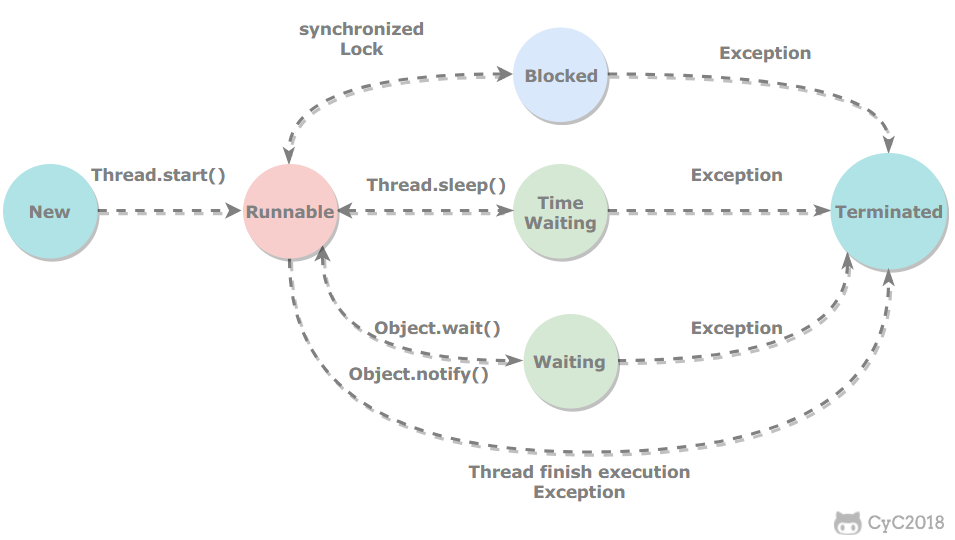

# 目录

## 基础知识

- 并发、高并发相关概念 
- CPU多级缓存 
- java内存模型
- 并发优势与风险
- 并发模拟

## 并发及并发的线程安全处理：

- 多线程并发编程
  - 线程安全性
    - 原子性、可见性、有序性
    - atomic包
    - CAS算法
    - synchronize与Lock、volatile、happes-before
  - 安全发布对象
    - 安全发布方法
    - 不可变对象、final关键字的使用、不可变方法
    - 线程不安全类与写法
  - 线程封闭、同步容器、并发容器
    - 堆栈封闭
    - ThreadLocal线程封闭、JDBC的线程封闭
    - 同步容器、并发容器
    - J.U.C
  - AQS等J.U.C组件
    - 
  - 线程调度
    - 线程池好处
    - new Thread弊端
    - ThreadPoolExecutor、Executor框架接口
  - 线程安全补充内容
    - 死锁产生于预防
    - 多线程并发的最佳实践
    - spring的线程安全
    - hashmap与concurrentHashMap

## 高并发解决思路与手段

- 扩容
  - 水平扩容
  - 垂直扩容
- 缓存
  - redis
  - memcache
  - guavaCache
- 队列
  - kafka
  - rabbitMQ
  - rocketMQ
- 拆分
  - 服务化Dubbo
  - 微服务spring cloud
- 服务降级与熔断
  - hystrix介绍与使用
  - 服务降级的多种选择
- 数据库切库分库分表
  - 切库、分表、支持多数据源的原理及实现
- 高可用的一些手段
  - 任务调度分布式elastic-job
  - 主备curator的实现
  - 监控报警机制
- 限流
  - guava rateLimiter
  - 常用限流算法
  - 分布式限流

## 知识技能

总体架构：springboot、maven、jdk8、mysql

基础组件：mybatis、guava、lombok、redis 、kafka

高级组件（类）：joda-Time、atomic包、J.U.C、AQS、ThreadLocal、RateLimiter、Hystrix、threadPool、shardbatis、curator、elastic-job

J.U.C java并发编程核心

# 并发、高并发相关概念

并发：同时拥有两个或多个线程，如果程序在单核处理器上运行，多个线程将交替地还如或者换出内存，线程同时存在， 每个线程都处于执行过程中的某个状态，如果运行在多核处理器上，程序的每个线程都将分配到一个处理器核上，因此可以同时运行。

高并发：通过设计保证系统能够同时并行处理很多请求

## 多线程

线程将复杂、异步的代码转换为更直接、直观的代码，线程是控制和利用多CPU系统计算能力的最简单方式

**异步**：当烧水的时候，水还在烧，这个时候水是否烧开了引起关注，在任务结束的时候发出信号，一边做其他的事情

多线程将异步操作转换为了顺序，同步的代码

### 多线程的特点

**优势：**

- 速度：同时处理多个请求，响应快，复杂操作可以分为多个进程同时执行
- 设计：在某些情况更简单，将异步的代码转换为顺序的代码，容易维护
  - 在单线程上进行文件读取与处理，则必须跟踪每个文件的读取与处理状态
  - 多线程下，可以启动两个线程，每个线程只读取和处理单个文件。
- 资源利用：CPU在等待IO时可以做其他的事情
  - 在IO时候，进程在读取文件，CPU在等待文件，因此CPU的资源浪费了，而利用多线程，可以使得在读取第二个文件的时候，处理第一个文件
- 多线程可以利用多个处理器进行计算，提高吞吐量

**成本：**

- 更复杂的设计
  - 访问共享数据的多个线程执行的代码需要特别注意。线程交互远非简单。错误的线程同步引起的错误很难检测，重现和修复。
- 上下文切换开销
  - 当CPU从执行一个线程切换到执行另一个线程时，CPU需要保存当前线程的本地数据，程序指针等，并加载下一个线程的本地数据，程序指针等来执行。
- 资源消耗增加
  - 线程需要来自计算机的一些资源才能运行。除了CPU时间，线程需要一些内存来保持其本地堆栈。它还可能占用管理线程所需的操作系统内部的一些资源。

**风险：**

- 安全性：多个线程共享数据可能会产生与预期不相符的结果
  - 一个简单的next++分为三步：读取，++，写入新值。由于线程之间可能交替占有运行时，因此可能报错。它取决于运行时如何交替进行这些操作。
  - 同步机制：将方法声明为synchronized可以修正该问题
- 活跃性：某个操作无法继续执行下去，如死锁、饥饿等
- 性能：线程过多使得CPU频繁切换（上下文切换），调度时间增多；同步机制；消耗过多内存

## 线程状态

***新建（New）***

创建后尚未启动。

***可运行（Runnable）***

可能正在运行，也可能正在等待 CPU 时间片。

包含了操作系统线程状态中的 Running 和 Ready。

***阻塞（Blocking）***

等待获取一个排它锁，如果其线程释放了锁就会结束此状态。

***无限期等待（Waiting）***

等待其它线程显式地唤醒，否则不会被分配 CPU 时间片。

| 进入方法                                   | 退出方法                             |
| ------------------------------------------ | ------------------------------------ |
| 没有设置 Timeout 参数的 Object.wait() 方法 | Object.notify() / Object.notifyAll() |
| 没有设置 Timeout 参数的 Thread.join() 方法 | 被调用的线程执行完毕                 |
| LockSupport.park() 方法                    | LockSupport.unpark(Thread)           |

***限期等待（Timed Waiting）***

无需等待其它线程显式地唤醒，在一定时间之后会被系统自动唤醒。

调用 Thread.sleep() 方法使线程进入限期等待状态时，常常用“使一个线程睡眠”进行描述。

调用 Object.wait() 方法使线程进入限期等待或者无限期等待时，常常用“挂起一个线程”进行描述。

睡眠和挂起是用来描述行为，而阻塞和等待用来描述状态。

阻塞和等待的区别在于，阻塞是被动的，它是在等待获取一个排它锁。而等待是主动的，通过调用 Thread.sleep() 和 Object.wait() 等方法进入。

| 进入方法                                 | 退出方法                                        |
| ---------------------------------------- | ----------------------------------------------- |
| Thread.sleep() 方法                      | 时间结束                                        |
| 设置了 Timeout 参数的 Object.wait() 方法 | 时间结束 / Object.notify() / Object.notifyAll() |
| 设置了 Timeout 参数的 Thread.join() 方法 | 时间结束 / 被调用的线程执行完毕                 |
| LockSupport.parkNanos() 方法             | LockSupport.unpark(Thread)                      |
| LockSupport.parkUntil() 方法             | LockSupport.unpark(Thread)                      |

***死亡（Terminated）***

可以是线程结束任务之后自己结束，或者产生了异常而结束。

# 硬件知识

## CPU多级缓存 

高速缓存的配置：数据的读取与存储都经过高速缓存，CPU核心与高速缓存有一条快速通道。主存与高速缓存都连接在系统总线上，并且该主线还用于与其他通信

多级缓存：一级缓存的速度与主存速度拉大。加入二级缓存、三级缓存，速度慢于1级，但是更大

**多级缓存的意义**：

- CPU的频率太快，主存无法跟上，在处理器时钟周期内，CPU常常需要等待主存，浪费资源。缓存是为了缓解CPU与内存间速度不匹配的问题
- 缓存无法存放CPU需要的全部数据，但是由于：
  - 时间局部性：如果某个数据被访问，那么在不久的将来可能再次被访问
  - 空间局部性：如果某个数据被访问，那么与它相邻的数据很快也可能被访问

## **缓存一致性(MESI协议)**

利用CPU的**嗅探**总线实现。

用于保证多个CPU 缓存之间共享数据的一致，定义了cache的四种状态

- M：被修改，该缓存只缓存在CPU的缓存中，并且被修改过，与主存数据不一致，需要在某个时间写回主存（这个时间其他CPU不能读取该数据），被写会主存当中后转换为E。
- E：独享，只缓存在CPU缓存中，但是没有被修改，与主存数据一致，当其他CPU读取该数据，转换为S，当修改该数据则转换为M
- S：共享，该缓存可能被多个CPU共享，并与主存一致，如果有一个CPU修改该缓存，则转换为M。其他CPU的缓存转换为I
- I：无效，

操作：

- local read：读本地缓存数据
- local write：将数据写入本地缓存
- remote read：将主存数据读取过来
- remote write：将数据写入主存

**乱序执行优化**

处理器为提高运算速度而做出违背代码原有顺序的优化。在不影响结果的情况下，代码的执行次序可能会发生变化

在多核CPU中，后写入缓存的数据未必真的写入缓存。

# 并发模型

## 并发模型与分布式系统相似性

在并发系统中，不同的线程彼此通信。在分布式系统中，不同的进程彼此通信（可能在不同的计算机上）

## 模型

一个顺序处理相同类型问题的程序更加简单，更少出错，容易测试。如果处理多种类型的问题， 则需要考虑优先级，时间截止等，较为复杂。

因此，为每一个相同类型任务的程序提供一个线程，提供理想上的顺序，并且将域逻辑与时序调度的细节分割开，进行相互交替的操作，只有在特定的同步点进行彼此间的交互。	

### 并行工人

​	传入的工作分配给不同的工作人员。这是一个说明并行工作者并发模型的图表：

​	在并行工作者并发模型中，委托者将传入的作业分发给不同的工作者。每个工人完成整个工作。这些工作程序并行工作，在不同的线程中运行，并且可能在不同的CPU上运行。是Java应用程序中最常用的并发模型（虽然这种情况正在发生变化）。

#### 优劣

- 易于理解。要增加应用程序的并行化，您只需添加更多工作程序。
- 共享可能变得复杂

# 并发模拟

- postman：http请求模拟
- Apache bench：测试网站性能
- JMeter：压力测试工具
- 代码：semaphore信号量、CountDownLatch计数器。通常与线程池共同使用

# 参考 #

1. java并发编程入门与高并发解决方案
2. [慕课网《Java并发编程入门与高并发面试 》课程学习](https://github.com/youzhidakeai/concurrency)
