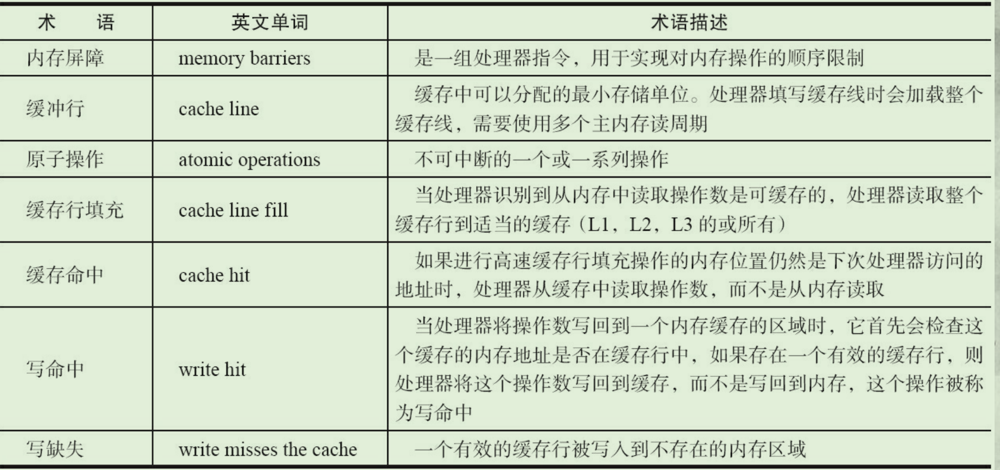
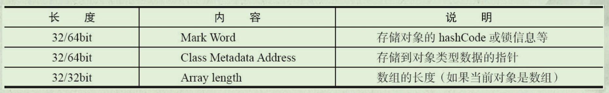
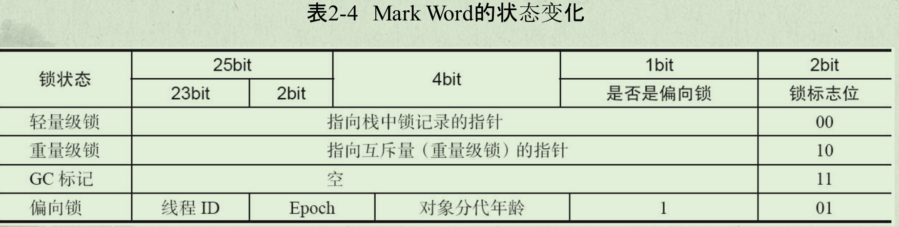
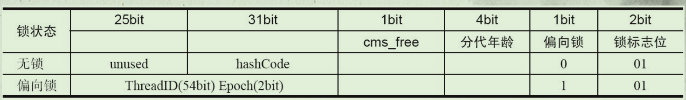
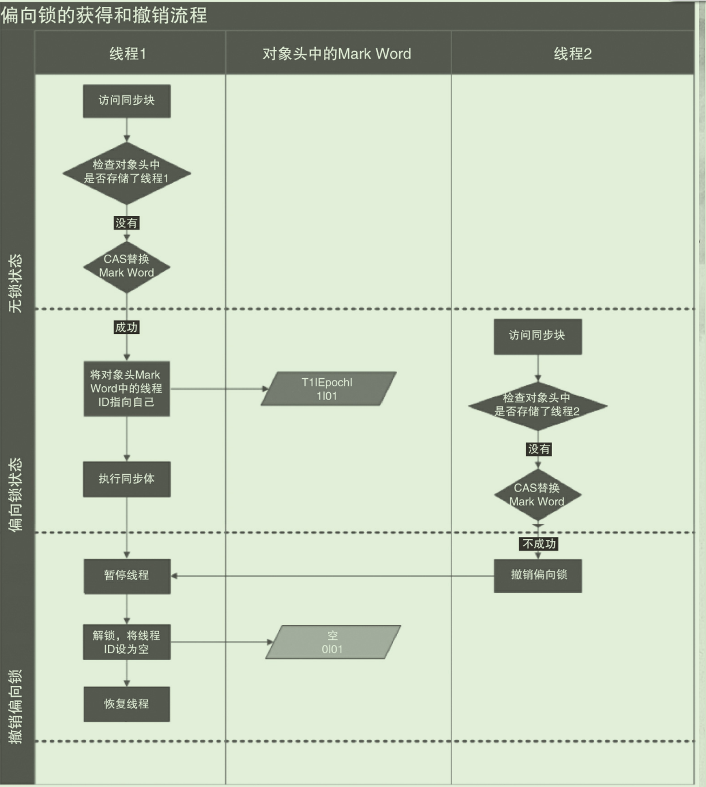
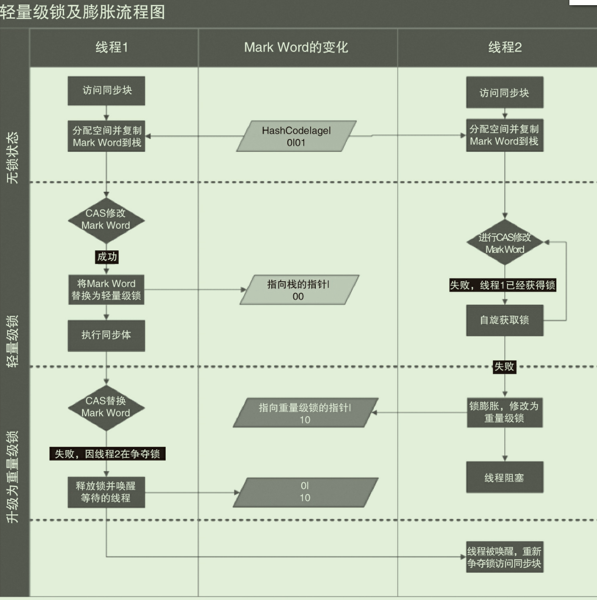
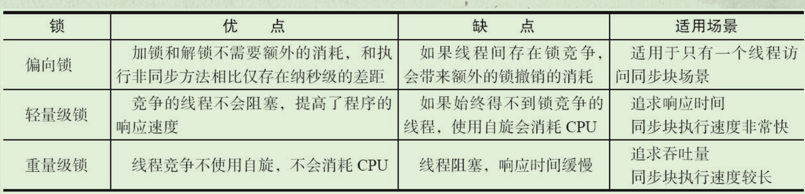
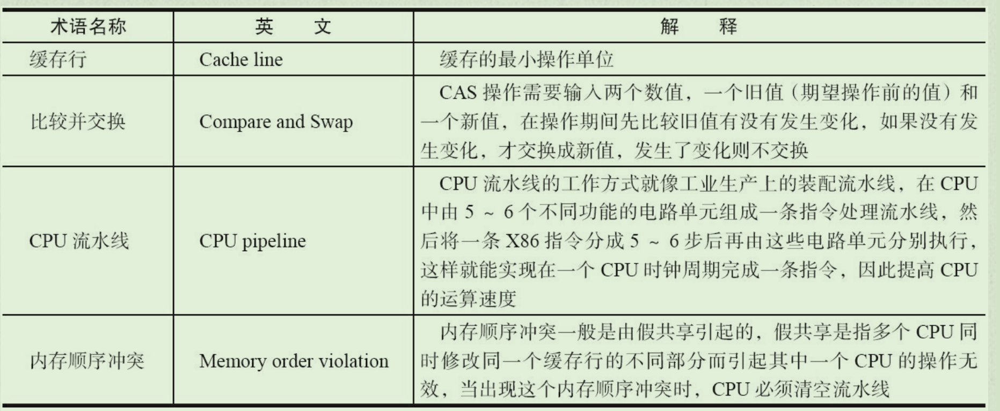

# 并发机制的底层原理

Java代码在编译后会变成Java字节码，字节码被类加载器加载到JVM里，JVM执行字节码，最终需要转化为汇编指令在CPU上执行，Java中所使用的并发机制依赖于JVM的实现和CPU的指令。

# Volatile

## 概述

**定义**

Java编程语言允许线程访问共享变量，为了确保共享变量能被准确和一致地更新，线程应该确保通过排他锁单独获得这个变量。Java语言提供了volatile，在某些情况下比锁要更加方便。如果一个字段被声明成volatile，Java线程内存模型确保所有线程看到这个变量的值是一致的。

**特性**

- 轻量级synchronized
  - 在使用恰当情况下，比synchronized的使用和执行成本更低。它不会引起线程的上下文切换与调度
- 保证共享变量的**可见性**
  - 可见性：当一个线程修改一个共享变量的值，另外一个线程能读到这个修改的值

## 实现原理

### CPU术语



### volatile如何保证可见性

在X86处理器下通过工具获取JIT编译器生成的汇编指令来查看对volatile进行写操作时，CPU会做什么事情。

```Java
//Java代码：
volatile instance = new Singleton();
//汇编代码
0x01a3de1d: movb $0×0,0×1104800(%esi);
0x01a3de24: lock addl $0×0,(%esp);//由于volatile而多出
```

Lock前缀的指令在多核处理器下会引发了两件事情

- 将当前处理器缓存行的数据写回到系统内存。
- 这个写回内存的操作会使在其他CPU里缓存了该内存地址的数据无效。

#### JMM内存模型

- 为了提高处理速度，处理器不直接和内存进行通信，而是先将系统内存的数据读到内部缓存（L1，L2或其他）后再进行操作，但操作完不知道何时会写到内存。
- 如果对声明了volatile的变量进行写操作，JVM就会向处理器发送一条Lock前缀的指令，将这个变量所在缓存行的数据写回到系统内存。但是，就算写回到内存，如果其他处理器缓存的值还是旧的，再执行计算操作就会有问题。所以，
- 在多处理器下，为了保证各个处理器的缓存是一致的，就会实现缓存一致性协议，每个处理器通过**嗅探在总线上传播的数据来检查自己缓存的值是不是过期了**，当处理器发现自己缓存行对应的内存地址被修改，就会将当前处理器的缓存行设置成无效状态，当处理器对这个数据进行修改操作的时候，会重新从系统内存中把数据读到处理器缓存里。

#### volatile的两条实现原则

##### 处理器缓存回写到内存。

- Lock前缀指令会引起处理器缓存回写到内存。

  - Lock前缀指令导致在执行指令期间，声言处理器的LOCK#信号。在多处理器环境中，LOCK#信号确保在声言该信号期间，处理器可以独占任何共享内存。但是，在最近的处理器里，LOCK＃信号一般不锁总线，而是锁缓存，毕竟锁总线开销的比较大。
    - 处理器可以独占任何共享内存 ：因为它会锁住总线，导致其他CPU不能访问总线，不能访问总线就意味着不能访问系统内存。
  - 在8.1.4节有详细说明锁定操作对处理器缓存的影响，对于Intel486和Pentium处理器，在锁操作时，总是在总线上声言LOCK#信号。但在P6和目前的处理器中，如果访问的内存区域已经缓存在处理器内部，则不会声言LOCK#信号。相反，它会锁定这块内存区域的缓存并回写到内存，并使用缓存一致性机制来确保修改的原子性，此操作被称为“**缓存锁定**”，缓存一致性机制会阻止同时修改由两个以上处理器缓存的内存区域数据。


##### 缓存无效。

- 一个处理器的缓存回写到内存会导致其他处理器的缓存无效。

  - IA-32处理器和Intel 64处理器使用**MESI（修改、独占、共享、无效）控制协议**去维护内部缓存和其他处理器缓存的一致性。在多核处理器系统中进行操作的时候，IA-32和Intel 64处理器能嗅探其他处理器访问系统内存和它们的内部缓存。
  - 处理器使用**嗅探技术**保证它的内部缓存、系统内存和其他处理器的缓存的数据在总线上保持一致。例如，在Pentium和P6 family处理器中，如果通过嗅探一个处理器来检测其他处理器打算写内存地址，而这个地址当前处于共享状态，那么正在嗅探的处理器将使它的缓存行无效，在下次访问相同内存地址时，强制执行缓存行填充。

#### 嗅探技术

这是一个跟踪每个缓存行的状态的缓存子系统。该系统使用一个称为 *“总线动态监视”* 或者称为*“总线嗅探”* 的技术来监视在系统总线上发生的所有事务，以检测缓存中的某个地址上何时发生了读取或写入操作。

当这个缓存子系统在系统总线上检测到对缓存中加载的内存区域进行的读取操作时，它会将该缓存行的状态更改为 **“shared”**。如果它检测到对该地址的写入操作时，会将缓存行的状态更改为 **“invalid”**。

该缓存子系统想知道，当该系统在监视系统总线时，系统是否在其缓存中包含数据的惟一副本。如果数据由它自己的 CPU 进行了更新，那么这个缓存子系统会将缓存行的状态从 **“exclusive”** 更改为 **“modified”**。如果该缓存子系统检测到另一个处理器对该地址的读取，它会阻止访问，更新系统内存中的数据，然后允许该处理的访问继续进行。它还允许将该缓存行的状态标记为 **shared**。

## volatile使用优化

### 追加字节

著名的Java并发编程大师Doug lea在JDK 7的并发包里新增一个队列集合类Linked-TransferQueue，它在使用volatile变量时，用一种追加字节的方式来优化队列出队和入队的性能。LinkedTransferQueue的代码如下。

```Java
/** 队列中的头部节点 */
private transient final PaddedAtomicReference<QNode> head;
/** 队列中的尾部节点 */
private transient final PaddedAtomicReference<QNode> tail;
static final class PaddedAtomicReference <T> extends AtomicReference T> {
// 使用很多4个字节的引用追加到64个字节
	Object p0, p1, p2, p3, p4, p5, p6, p7, p8, p9, pa, pb, pc, pd, pe;
	PaddedAtomicReference(T r) {
		super(r);
	}
}
public class AtomicReference <V> implements java.io.Serializable {
	private volatile V value;
// 省略其他代码
｝
```

**追加字节能优化性能？**

这种方式看起来很神奇，但如果深入理解处理器架构就能理解其中的奥秘。让我们先来看看LinkedTransferQueue这个类，它使用一个内部类类型来定义队列的头节点（head）和尾节点（tail），而这个内部类PaddedAtomicReference相对于父类AtomicReference只做了一件事情，就是将共享变量追加到64字节。我们可以来计算下，一个对象的引用占4个字节，它追加了15个变量（共占60个字节），再加上父类的value变量，一共64个字节。

**为什么追加64字节能够提高并发编程的效率呢？**

- 因为对于英特尔酷睿i7、酷睿、Atom和NetBurst，以及Core Solo和Pentium M处理器的L1、L2或L3缓存的高速缓存行是64个字节宽，**不支持部分填充缓存行**。
- 这意味着，如果队列的头节点和尾节点都不足64字节的话，**处理器会将它们都读到同一个高速缓存行中**，在多处理器下每个处理器都会缓存同样的头、尾节点，**当一个处理器试图修改头节点时，会将整个缓存行锁定，那么在缓存一致性机制的作用下，会导致其他处理器不能访问自己高速缓存中的尾节点**，而队列的入队和出队操作则需要不停修改头节点和尾节点，所以在多处理器的情况下将会严重影响到队列的入队和出队效率。
- Doug lea使用追加到64字节的方式来填满高速缓冲区的缓存行，避免头节点和尾节点加载到同一个缓存行，**使头、尾节点在修改时不会互相锁定。**

**那么是不是在使用volatile变量时都应该追加到64字节呢？**

不是的。在两种场景下不应该使用这种方式。

- 缓存行非64字节宽的处理器。如P6系列和奔腾处理器，它们的L1和L2高速缓存行是32个
  字节宽。

- 共享变量不会被频繁地写。因为使用追加字节的方式需要处理器读取更多的字节到高速缓冲区，这本身就会带来一定的性能消耗，如果共享变量不被频繁写的话，锁的几率也非常小，就没必要通过追加字节的方式来避免相互锁定。

**Java7下可能不生效**

不过这种追加字节的方式在Java 7下可能不生效，因为Java 7变得更加智慧，它会淘汰或重新排列无用字段，需要使用其他追加字节的方式。除了volatile，Java并发编程中应用较多的是synchronized，下面一起来看一下。

# synchronized

## 概述

重量级锁，在Java SE1.6后进行了各种优化，显得并没有那么重了。

Java SE 1.6中为了减少获得锁和释放锁带来的性能消耗而引入的偏向锁和轻量级锁，以及锁的存储结构和升级过程。


## 实现原理与应用

synchronized实现同步的基础：Java中的每一个对象都可以作为锁

- 对于普通同步方法，锁是当前实例对象。
- 对于静态同步方法，锁是当前类的Class对象。  
- 对于同步方法块，锁是Synchonized括号里配置的对象。

当一个线程试图访问同步代码块时，它首先必须得到锁，退出或抛出异常时必须释放锁。那么锁到底存在哪里呢？锁里面会存储什么信息呢？

- 锁存放在Java对象头当中

### synchronized在JVM当中的实现原理

JVM基于进入和退出Monitor对象来实现方法同步和代码块同步，但两者的实现细节不一样。

- 代码块同步是使用monitorenter和monitorexit指令实现的
  - monitorenter指令是在编译后插入到同步代码块的开始位置，而monitorexit是插入到方法结束处和异常处，JVM要保证每个monitorenter必须有对应的monitorexit与之配对。
  - 任何对象都有一个monitor与之关联，当且一个monitor被持有后，它将处于锁定状态。线程执行到monitorenter指令时，将会尝试获取对象所对应的monitor的所有权，即尝试获得对象的锁。
- 而方法同步是使用另外一种方式实现的，细节在JVM规范里并没有详细说明。但是，方法的同步同样可以使用这两个指令来实现。

### Java对象头

如果对象是数组类型，则虚拟机用3个字宽（Word）存储对象头，如果对象是非数组类型，则用2字宽存储对象头。在32位虚拟机中，1字宽等于4字节，即32bit。

**Java对象头**



**Mark Word**32位机默认存储结构


结构随着锁标志位变化而变化



Mark Word **64位机**，大小64bit



## 锁升级

Java SE 1.6为了减少获得锁和释放锁带来的性能消耗，引入了“偏向锁”和“轻量级锁”

锁的四种状态：无锁状态、偏向锁状态、轻量级锁状态和重量级锁状态。随着竞争情况逐渐升级。

锁只可升级不可降级

### 偏向锁

#### **概念**

HotSpot [1] 的作者经过研究发现，大多数情况下，锁不仅不存在多线程竞争，而且总是由同一线程多次获得，为了让线程获得锁的代价更低而引入了偏向锁。

- 当一个线程访问同步块并获取锁时，会在对象头和栈帧中的锁记录里存储锁偏向的线程ID，以后该线程在进入和退出同步块时不需要进行CAS操作来加锁和解锁，只需简单地测试一下对象头的Mark Word里是否存储着指向当前线程的偏向锁。
  - 如果测试成功，表示线程已经获得了锁。
  - 如果测试失败，则需要再测试一下Mark Word中偏向锁的标识是否设置成1（表示当前是偏向锁）：
    - 如果没有设置，则使用CAS竞争锁；
    - 如果设置了，则尝试使用CAS将对象头的偏向锁指向当前线程。

#### **偏向锁的撤销**

偏向锁使用了一种等到竞争出现才释放锁的机制，所以当其他线程尝试竞争偏向锁时，持有偏向锁的线程才会释放锁。

- 偏向锁的撤销，需要等待全局安全点（在这个时间点上没有正在执行的字节码）。
- 它会首先暂停拥有偏向锁的线程，然后检查持有偏向锁的线程是否活着。
  - 如果线程不处于活动状态，则将对象头设置成无锁状态；
  - 如果线程仍然活着，拥有偏向锁的栈会被执行，遍历偏向对象的锁记录，栈中的锁记录和对象头的Mark Word要么重新偏向于其他线程，要么恢复到无锁或者标记对象不适合作为偏向锁，最后唤醒暂停的线程。

图中的线程1演示了偏向锁初始化的流程，线程2演示了偏向锁撤销的流程。



#### 关闭偏向锁

偏向锁在Java 6和Java 7里是默认启用的，但是它在应用程序启动几秒钟之后才激活。

- 如有必要可以使用JVM参数来关闭延迟：-XX:BiasedLockingStartupDelay=0。
- 如果你确定应用程序里所有的锁通常情况下处于竞争状态，可以通过JVM参数关闭偏向锁：-XX:-UseBiasedLocking=false，那么程序默认会进入轻量级锁状态。

### 轻量级锁

**加锁**

- 线程在执行同步块之前，JVM会先在当前线程的栈桢中创建用于存储锁记录的空间，并将对象头中的Mark Word复制到锁记录中，官方称为Displaced Mark Word。
- 然后线程尝试使用CAS将对象头中的Mark Word替换为指向锁记录的指针。
  - 如果成功，当前线程获得锁
  - 如果失败，表示其他线程竞争锁，当前线程便尝试使用**自旋来获取锁。**

**解锁**

- 轻量级解锁时，会使用原子的CAS操作将Displaced Mark Word替换回到对象头，

  - 如果成功，则表示没有竞争发生。

  - 如果失败，表示当前锁存在竞争，锁就会膨胀成重量级锁。

图中是两个线程同时争夺锁，导致锁膨胀的流程图。



因为自旋会消耗CPU，为了避免无用的自旋（比如获得锁的线程被阻塞住了），一旦锁升级成重量级锁，就不会再恢复到轻量级锁状态。当锁处于这个状态下，其他线程试图获取锁时，都会被阻塞住，当持有锁的线程释放锁之后会唤醒这些线程，被唤醒的线程就会进行新一轮的夺锁之争。

## 锁优缺点对比



# 原子操作

原子操作（atomic operation）意为“不可被中断的一个或一系列操作”。在多处理器上实现原子操作就变得有点复杂。

让我们一起来聊一聊在Intel处理器和Java里是如何实现原子操作的。

## 概述

### CPU术语定义



### CPU如何实现原子操作

32位IA-32处理器使用**基于对缓存加锁**或**总线加锁**的方式来实现多处理器之间的原子操作。

- 首先处理器会自动保证基本的内存操作的原子性。
  - 处理器保证从系统内存中读取或者写入一个字节是原子的，意思是当一个处理器读取一个字节时，其他处理器不能访问这个字节的内存地址。Pentium 6和最新的处理器能自动保证单处理器对同一个缓存行里进行16/32/64位的操作是原子的
- 但是复杂的内存操作处理器是不能自动保证其原子性的
  - 比如跨总线宽度、跨多个缓存行和跨页表的访问。

#### 总线锁

所谓总线锁就是使用处理器提供的一个LOCK＃信号，当一个处理器在总线上输出此信号时，其他处理器的请求将被阻塞住，那么该处理器可以独占共享内存。

保证了CPU1读改写共享变量的时候，CPU2不能操作缓存了该共享变量内存地址的缓存。

**缺陷：**

但总线锁定**把CPU和内存之间的通信**锁住了，这使得锁定期间，其他处理器不能操作其他内存地址的数据，所以总线锁定的开销比较大，目前处理器在某些场合下使用缓存锁定代替总线锁定来进行优化。

#### 缓存锁

在同一时刻，我们只需保证对某个内存地址的操作是原子性即可

**概述**

所谓“缓存锁定”是指内存区域如果被缓存在处理器的缓存行中，并且在Lock操作期间被锁定，那么当它执行锁操作回写到内存时，处理器不在总线上声言LOCK＃信号，而是修改内部的内存地址，并允许它的缓存一致性机制来保证操作的原子性，因为**缓存一致性机制会阻止同时修改由两个以上处理器缓存的内存区域数据**，当其他处理器回写已被锁定的缓存行的数据时，会使缓存行无效。

**有两种情况下处理器不会使用缓存锁定**

- 当操作的数据不能被缓存在处理器内部，或操作的数据跨多个缓存行（cache line）时，则处理器会调用总线锁定。
- 有些处理器不支持缓存锁定。对于Intel 486和Pentium处理器，就算锁定的内存区域在处理器的缓存行中也会调用总线锁定。

针对以上两个机制，我们通过Intel处理器提供了很多Lock前缀的指令来实现。例如，位测试和修改指令：BTS、BTR、BTC；交换指令XADD、CMPXCHG，以及其他一些操作数和逻辑指令（如ADD、OR）等，被这些指令操作的内存区域就会加锁，导致其他处理器不能同时访问它。

## Java原子操作

### 锁

锁机制有：偏向锁、轻量级锁和互斥锁

除了偏向锁，JVM实现锁的方式都用了循环CAS，即当一个线程想进入同步块的时候使用循环CAS的方式来获取锁，当它退出同步块的时候使用循环CAS释放锁。

### CAS

基于处理器提供的CMPXCHG指令实现的

Atomic包下的很多类支持原子操作

**问题**

- ABA问题
  - 使用版本号解决
  - AtomicStampedReference可解决
- 循环时间长开销大
  - 自旋的执行开销
  - 如果JVM支持pause指令，会有一定的效率提升
    - 它可以延迟流水线执行指令（de-pipeline），使CPU不会消耗过多的执行资源，延迟的时间取决于具体实现的版本，在一些处理器上延迟时间是零
    - 它可以避免在退出循环的时候因内存顺序冲突（Memory Order Violation）而引起CPU流水线被清空（CPU Pipeline Flush），从而提高CPU的执行效率。
- 只能保证一个共享变量的原子操作
  - AtomicReference类来保证引用对象之间的原子性，就可以把多个变量放在一个对象里来进行CAS操作。


# 参考 #

1. 
