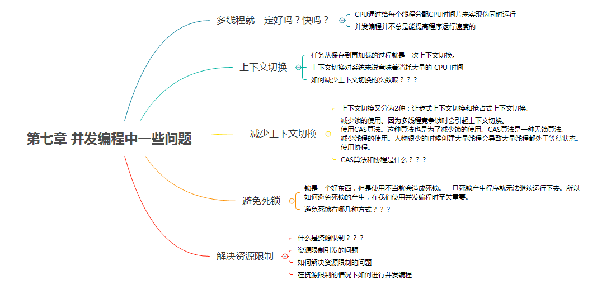
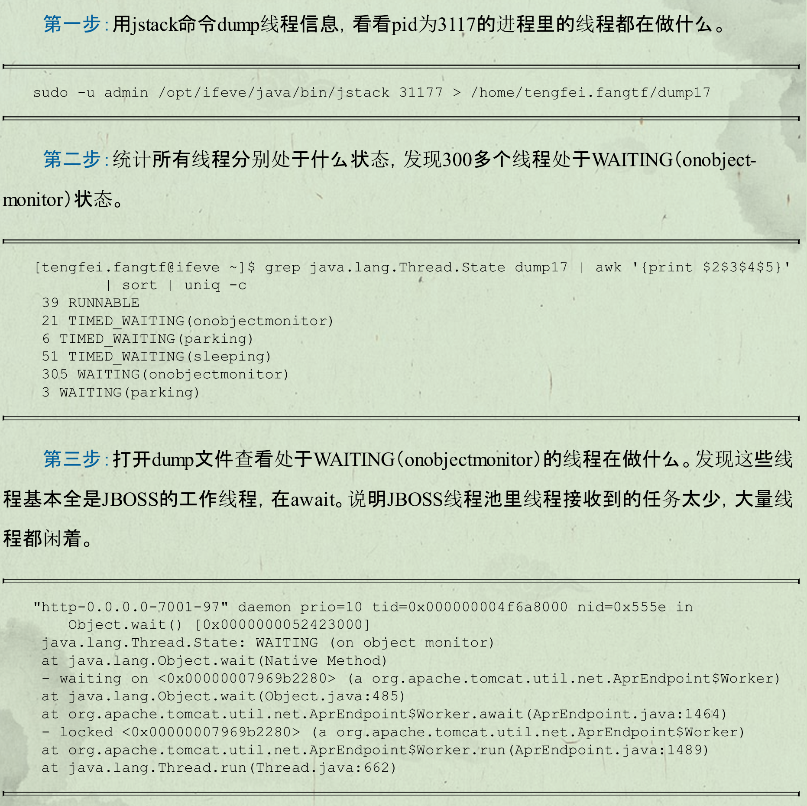
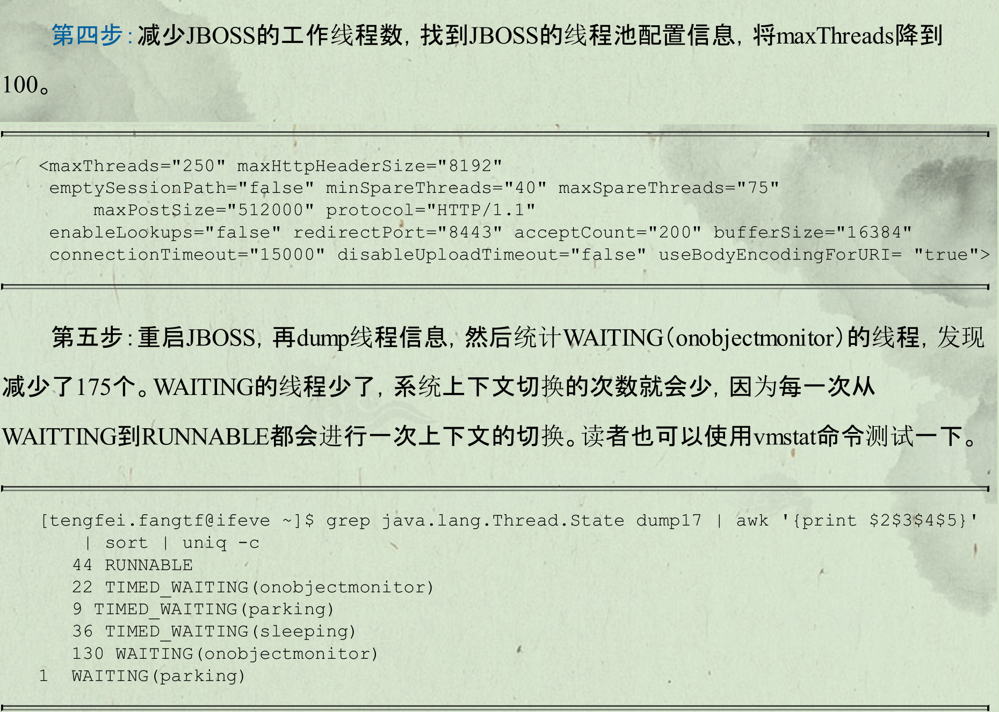
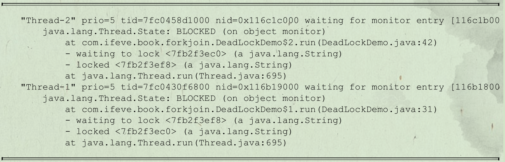

# 问题

并发编程的目的是为了让程序运行得更快，但是，并不是启动更多的线程就能让程序最大限度地并发执行。如果希望通过多线程执行任务让程序运行得更快，会面临非常多的挑战

- 上下文切换的问题
- 死锁的问题
- 受限于硬件和软件的资源限制问题

# 概述



## 上下文切换

**单核处理器实现多线程执行代码：**

CPU通过给每个线程分配CPU时间片来实现这个机制。时间片是CPU分配给各个线程的时间，因为时间片非常短，所以CPU通过不停地切换线程执行，让我们感觉多个线程是同时执行的，时间片一般是几十毫秒（ms）。

**上下文切换概念**

CPU通过时间片分配算法来循环执行任务，当前任务执行一个时间片后会切换到下一个任务。但是，在切换前会保存上一个任务的状态，以便下次切换回这个任务时，可以再加载这个任务的状态。所以任务从保存到再加载的过程就是一次上下文切换。

**损耗**：保存上一个任务状态、再加载下一个任务状态所消耗的时间

### 多线程未必很快

并发编程的目的就是为了能提高程序的执行效率提高程序运行速度，但是并发编程并不总是能提高程序运行速度的，而且并发编程可能会遇到很多问题，比如：内存泄漏、上下文切换、死锁还有受限于硬件和软件的资源闲置问题。

多线程就是几乎同时执行多个线程（一个处理器在某一个时间点上永远都只能是一个线程！即使这个处理器是多核的，除非有多个处理器才能实现多个线程同时运行）。CPU通过给每个线程分配CPU时间片来实现伪同时运行，因为CPU时间片一般很短很短，所以给人一种同时运行的感觉。

```Java
public class ConcurrencyTest {

/** 执行次数 */
private static final long count = 10000l;

public static void main(String[] args) throws InterruptedException {
    //并发计算
    concurrency();
    //单线程计算
    serial();
}

private static void concurrency() throws InterruptedException {
    long start = System.currentTimeMillis();
    Thread thread = new Thread(new Runnable() {
        @Override
        public void run() {
            int a = 0;
            for (long i = 0; i < count; i++) {
                a += 5;
            }
            System.out.println(a);
        }
    });
    thread.start();
    int b = 0;
    for (long i = 0; i < count; i++) {
        b--;
    }
    thread.join();
    long time = System.currentTimeMillis() - start;
    System.out.println("concurrency :" + time + "ms,b=" + b);
}

private static void serial() {
    long start = System.currentTimeMillis();
    int a = 0;
    for (long i = 0; i < count; i++) {
        a += 5;
    }
    int b = 0;
    for (long i = 0; i < count; i++) {
        b--;
    }
    long time = System.currentTimeMillis() - start;
    System.out.println("serial:" + time + "ms,b=" + b + ",a=" + a);
}
}
```


### 测试上下文切换

- 使用Lmbench3（性能分析工具）可以测量上下文切换的**时长。**
- 使用vmstat可以测量上下文切换的**次数。**
  - 一般一秒1000多次

### 如何减少上下文切换

上下文切换又分为2种：让步式上下文切换和抢占式上下文切换。前者是指执行线程主动释放CPU，与锁竞争严重程度成正比，可通过减少锁竞争和使用CAS算法来避免；后者是指线程因分配的时间片用尽而被迫放弃CPU或者被其他优先级更高的线程所抢占，一般由于线程数大于CPU可用核心数引起，可通过适当减少线程数和使用协程来避免。

**方法**

- 无锁并发编程
  - 避免使用锁，如将数据ID按照HASH算法取模分段，不同线程处理不同段的数据
- CAS算法
- 使用最少线程
  - 避免创造太多的线程，使得大量线程处于等待
- 使用协程
  - 单线程当中实现多任务的调度，并在单个线程里维持多个任务的切换

#### 实战

通过减少大量waiting线程来减少上下文切换





## 死锁

**死锁示例**

A、B锁互相等待

```Java
public class DeadLockDemo {

    /** A锁 */
    private static String A = "A";
    /** B锁 */
    private static String B = "B";

    public static void main(String[] args) {
        new DeadLockDemo().deadLock();
    }

    private void deadLock() {
        Thread t1 = new Thread(new Runnable() {
            @Override
            public void run() {
                synchronized (A) {
                    try {
                        Thread.sleep(2000);
                    } catch (InterruptedException e) {
                        e.printStackTrace();
                    }
                    synchronized (B) {
                        System.out.println("1");
                    }
                }
            }
        });

        Thread t2 = new Thread(new Runnable() {
            @Override
            public void run() {
                synchronized (B) {
                    synchronized (A) {
                        System.out.println("2");
                    }
                }
            }
        });
        t1.start();
        t2.start();
    }

}

```

### 出现的场景

- t1拿到锁之后，因为一些异常情况没有释放锁（死循环）。
- t1拿到一个数据库锁，释放锁的时候抛出了异常，没释放掉。

### 死锁检测

利用dump线程查看到底哪个线程出现了问题，可见是42行、31行出现死锁



### 死锁避免

常见方法：

- 避免一个线程同时获取多个锁。
- 避免一个线程在锁内同时占用多个资源，尽量保证每个锁只占用一个资源。
- 尝试使用定时锁，使用lock.tryLock（timeout）来替代使用内部锁机制。
- 对于数据库锁，加锁和解锁必须在一个数据库连接里，否则会出现解锁失败的情况。

## 资源限制

### 概念

资源限制是指在进行并发编程时，程序的执行速度受限于计算机硬件资源或软件资源。所以在进行并发编程时，要考虑这些资源的限制。

- 服务器的带宽只有2Mb/s，某个资源的下载速度是1Mb/s每秒，系统启动10个线程下载资源，下载速度不会变成10Mb/s
- 硬件资源限制有带宽的上传/下载速度、硬盘读写速度和CPU的处理速度。
- 软件资源限制有数据库的连接数和socket连接数等。

### 引发的问题

本来是并发编程，但由于资源限制，导致并行退化为串行。在此情况下，由于上下文切换与资源调度，导致执行速度更慢。

在并发编程中，将代码执行速度加快的原则是将代码中串行执行的部分变成并发执行，但是如果将某段串行的代码并发执行，因为受限于资源，仍然在串行执行，这时候程序不仅不会加快执行，反而会更慢，因为增加了上下文切换和资源调度的时间。例如，之前看到一段程序使用多线程在办公网并发地下载和处理数据时，导致CPU利用率达到100%，几个小时都不能运行完成任务，后来修改成单线程，一个小时就执行完成了。

### 解决资源限制

- 对于硬件资源限制，可以考虑使用集群并行执行程序。既然单机的资源有限制，那么就让程序在多机上运行。比如使用ODPS、Hadoop或者自己搭建服务器集群，不同的机器处理不同的数据。可以通过“数据ID%机器数”，计算得到一个机器编号，然后由对应编号的机器处理这笔数据。
- 对于软件资源限制，可以考虑使用资源池将资源复用。比如使用连接池将数据库和Socket连接复用，或者在调用对方webservice接口获取数据时，只建立一个连接。

### 在资源限制情况下进行并发编程

如何在资源限制的情况下，让程序执行得更快呢？

- 方法就是，根据不同的资源限制调整程序的并发度
  - 比如下载文件程序依赖于两个资源——带宽和硬盘读写速度。
  - 有数据库操作时，涉及数据库连接数，如果SQL语句执行非常快，而线程的数量比数据库连接数大很多，则某些线程会被阻塞，等待数据库连接。

# 多线程开发良好的实践

- 给线程起个有意义的名字，这样可以方便找 Bug。
- 缩小同步范围，从而减少锁争用。例如对于 synchronized，应该尽量使用同步块而不是同步方法。
- 多用同步工具少用 wait() 和 notify()。首先，CountDownLatch, CyclicBarrier, Semaphore 和 Exchanger 这些同步类简化了编码操作，而用 wait() 和 notify() 很难实现复杂控制流；其次，这些同步类是由最好的企业编写和维护，在后续的 JDK 中还会不断优化和完善。
- 使用 BlockingQueue 实现生产者消费者问题。
- 多用并发集合少用同步集合，例如应该使用 ConcurrentHashMap 而不是 Hashtable。
- 使用本地变量和不可变类来保证线程安全。
- 使用线程池而不是直接创建线程，这是因为创建线程代价很高，线程池可以有效地利用有限的线程来启动任务。

# 总结

建议多使用JDK并发包提供的并发容器和工具类来解决并发问题，因为这些类都已经通过了充分的测试和优化，均可解决了本章提到的几个挑战。

# 参考

1. [Java多线程学习（七）并发编程中一些问题](https://blog.csdn.net/qq_34337272/article/details/79844051)