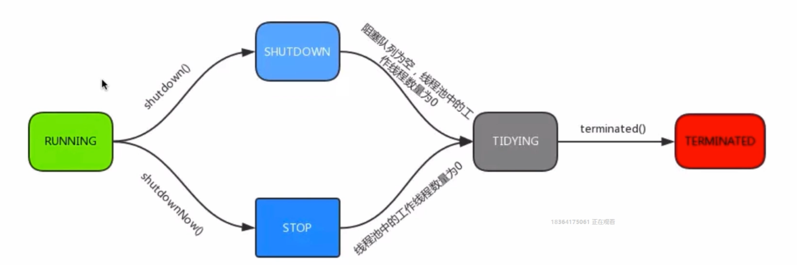

# 线程池

## 为什么要用

new Thread弊端

- 每次新建对象，性能差
- 线程缺乏统一管理，可能无限新建线程，相互竞争，有可能占用过多系统资源导致死机或OOM
- 缺少更多功能，如更多执行、定期执行、线程中断

线程池好处

- 重用存在的线程，减少对象创建、消亡的开销
- 可有效控制最大并发线程数，提高系统资源利用率，同时可以避免过多资源竞争，避免阻塞
- 提供定时执行、定期执行、单线程、并发控制等功能

## 基础概述

### 是什么

线程池是事先创建若干个可执行的线程放入一个池（容器）中，需要的时候从池中获取线程，使用完毕不需要销毁线程而是放回池中，从而减少创建和销毁线程对象的开销

线程池包括四个**基本组成部分**

- 线程管理器：用于创建并管理线程池，包括创建线程、销毁线程池、添加新任务
- 工作线程：线程池中线程，在没有任务时处于等待状态，可以循环地执行任务
- 任务接口：每个任务必须实现的接口，以供工作线程调度任务的执行，主要规定了任务的入口，任务执行完成的收尾工作，任务的执行状态等。
- 任务队列：用于存放没有处理的任务，提供一种缓冲机制。

### Executor框架接口

- Executors.newCachedThreadPool
  - 可以缓存的线程池
  - 如果线程超出处理需要，则回收空闲线程
- Executors.newFixedThreadPool
  - 创建定长线程池
- Executors.newScheduledThreadPool
  - 创建定长线程池，支持定时与周期任务执行
- Executors.newSingleThreadExecutor
  - 单线程化，按照每种规则执行

## 基础

线程池ThreadPoolExcutor

### 参数

- corePoolSize：核心线程数量
- maxmumPoolSize：线程最大线程数
  - 当核心线程都在工作，且阻塞队列满，且线程数目小于最大线程数，则创建新线程
  - 如果线程数目等于最大线程数，通过拒绝策略来处理新到来的任务
- workQueue：阻塞队列，存储等待执行的任务
  - 直接切换
  - 无界队列，基于链表，创建的最大线程即核心线程数目
  - 有界队列，创建的最大线程数目为最大线程数
- keepAliveTime：线程没有任务执行时最多保持多久时间终止
- unit：时间单位
- threadFactory：线程工厂，创建线程
- rejectHandler：拒绝处理任务时的策略
  - 直接抛出异常，默认
  - 用调用者所在的线程执行任务
  - 丢弃队列中最靠前的任务
  - 直接丢弃这个任务

降低系统资源消耗：较大队列容量，较小线程池容量

线程数目增加，则CPU利用率会提高，如果线程数目过大，则并发量过大，线程调度存在消耗

### 方法

- execute
  - 提交任务，交给线程池执行
- submit
  - 提交任务，能够返回执行结果
- shutdown
  - 关闭线程池，等待任务都执行完
- shutdownNow
  - 关闭线程池，不等待任务执行完
- getTaskCount
  - 线程池已执行和未执行的任务总数
- getCompletedTaskCount
  - 已完成的任务数
- getPoolSize
  - 线程池当前的线程数量
- getActiveCount
  - 当前线程池当中正在执行任务的线程数量

## 线程池实例的状态

- running
  - 能接受新提交的任务，并能处理阻塞队列的任务
- shutdown
  - 关闭状态，不能接受新提交的任务，但能处理阻塞队列的任务
- stop
  - 不能接受新提交的任务，也不能处理阻塞队列的任务
  - 会中断正在处理任务的线程
- tidying
  - 如果所有任务都已经中止
- terminated

## 进阶

### 线程池配置

- CPU密集型任务，需要尽量压榨CPU，参考值设置为NCPU（CPU数量）+1
- IO密集型任务，参照值设置为2*NCPU

# 参考 #

1. 
