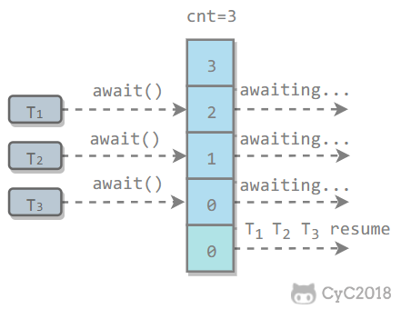
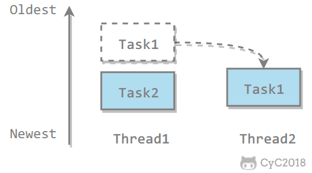

AbstractQueuedSynchronizer-AQS


底层数据结构

- 双向链表
- Condition queue，单向链表
  - 当使用到condition时存在，并可能存在多个

设计

- 使用Node实现FIFO队列，可以用于构建锁或者其他同步装置的基础框架
- 利用一个int类型表示状态
  - state变量，表示获取锁的线程锁，>1表示重入锁的数量
- 使用方法是继承
  - 复写其中方法
- 子类通过继承并通过实现它的方法管理其状态（acquire和release）的方法操纵状态
- 可以同时实现排它锁和共享锁模式（独占、共享）

实现思路

- 内部维护一个队列来管理锁
- 线程尝试获取锁
  - 如果失败，将当前线程以及等待状态信息包装为一个node节点加入同步队列
  - 不断尝试获取锁，只有head的直接后继才会尝试，如果失败则阻塞自己
  - 当持有锁的线程释放锁的时候，唤醒head的直接后继

AQS同步组件

- CountDownLatch
- Semaphore
- CyclicBarrier
- ReentrantLock  锁
- Condition
- FutureTask

## CountDownLatch

**功能**：用来同步一个或多个任务，强制它们等待由其他任务执行的一组操作完成

- 对象初始化时设置一个值
- 任何在这个对象上调用wait方法都将阻塞，直至计数为0
- 在对象上调用countDown来减小计数值
- 只能触发一次，计数值不能被重置
- 可重置版为CyclicBarrier
- 在对await的调用会被阻塞，直至计数值达到0

```Java
// Performs some portion of a task:
class TaskPortion implements Runnable {
  private static int counter = 0;
  private final int id = counter++;
  private static Random rand = new Random(47);
    //这只是个引用
  private final CountDownLatch latch;
  TaskPortion(CountDownLatch latch) {
      //在这里引用到真正的对象
    this.latch = latch;
  }
    
  public void run() {
    try {
      doWork();
        //计数值减一
      latch.countDown();
    } catch(InterruptedException ex) {
      // Acceptable way to exit
    }
  }
    
  public void doWork() throws InterruptedException {
    TimeUnit.MILLISECONDS.sleep(rand.nextInt(2000));
    print(this + "completed");
  }
    
  public String toString() {
    return String.format("%1$-3d ", id);
  }
}

// Waits on the CountDownLatch:
class WaitingTask implements Runnable {
  private static int counter = 0;
  private final int id = counter++;
  private final CountDownLatch latch;
    
  WaitingTask(CountDownLatch latch) {
    this.latch = latch;
  }
    
  public void run() {
    try {
        //等待CountDownLatch的值到达0
      latch.await();
      print("Latch barrier passed for " + this);
    } catch(InterruptedException ex) {
      print(this + " interrupted");
    }
  }
    
  public String toString() {
    return String.format("WaitingTask %1$-3d ", id);
  }
}

public class CountDownLatchDemo {
  static final int SIZE = 100;
    
  public static void main(String[] args) throws Exception {
    ExecutorService exec = Executors.newCachedThreadPool();
    // 初始化值为100All must share a single CountDownLatch object:
    CountDownLatch latch = new CountDownLatch(SIZE);
      //尽管这些线程先启动，但是由于CountDownLatch的原因，他们阻塞
    for(int i = 0; i < 10; i++)
        //他们使用的是同一个latch
      exec.execute(new WaitingTask(latch));
    for(int i = 0; i < SIZE; i++)
      exec.execute(new TaskPortion(latch));
    print("Launched all tasks");
    exec.shutdown(); // Quit when all tasks complete
  }
}
```

## CyclicBarrier

**功能**：

- 希望创建一组任务，它们并行地执行工作，然后再进行下个步骤前等待，直至所有任务都完成。
- 使得所有的并行任务在栅栏处列队，一致向前移动
  - 一场场连续的比赛，当所有人到达终点后，才重置，开始下一场比赛

特性：CyclicBarrier可以多次重用

## DelayQueue

- 无界的BlockingQueue，用于放置实现了Delayed接口的对象
- 其中的对象只能再其到期时才能从队列中取走。
- 队列是有序的，队头对象的延迟到期时间最长
- 即优先级队列的一种变体。

## PriorityBlockingQueue

- 基础的优先级队列，具有可阻塞的读取操作。
- 在优先级队列中的对象是按照优先级顺序从队列中出现的任务

## ScheduledExecutor的温室控制器

- ScheduledThreadPoolExecutor
- 使用schedule运行一次任务
- scheduleAtFixedRate每隔规则的时间重复执行任务
- 可以将runnable设置为在将来的某个时刻执行

## Semaphore

信号量，允许n个任务同时访问整个资源。

对象池，管理数量有限的对象，当要使用对象时可以签出他们，当用户使用完毕时，可以将他们签回。

## Exchanger

- Exchanger类可用于两个线程之间交换信息。
- 可简单地将Exchanger对象理解为一个包含两个格子的容器，通过exchanger方法可以向两个格子中填充信息。
- 当两个格子中的均被填充时，该对象会自动将两个格子的信息交换，然后返回给线程，从而实现两个线程的信息交换。

# J.U.C - AQS

java.util.concurrent（J.U.C）大大提高了并发性能，AQS 被认为是 J.U.C 的核心。

## CountDownLatch

用来控制一个线程等待多个线程。

维护了一个计数器 cnt，每次调用 countDown() 方法会让计数器的值减 1，减到 0 的时候，那些因为调用 await() 方法而在等待的线程就会被唤醒。


```Java
public class CountdownLatchExample {

    public static void main(String[] args) throws InterruptedException {
        final int totalThread = 10;
        CountDownLatch countDownLatch = new CountDownLatch(totalThread);
        ExecutorService executorService = Executors.newCachedThreadPool();
        for (int i = 0; i < totalThread; i++) {
            executorService.execute(() -> {
                System.out.print("run..");
                countDownLatch.countDown();
            });
        }
        countDownLatch.await();
        System.out.println("end");
        executorService.shutdown();
    }
}
run..run..run..run..run..run..run..run..run..run..end
```

## CyclicBarrier

用来控制多个线程互相等待，只有当多个线程都到达时，这些线程才会继续执行。

和 CountdownLatch 相似，都是通过维护计数器来实现的。线程执行 await() 方法之后计数器会减 1，并进行等待，直到计数器为 0，所有调用 await() 方法而在等待的线程才能继续执行。

CyclicBarrier 和 CountdownLatch 的一个区别是，CyclicBarrier 的计数器通过调用 reset() 方法可以循环使用，所以它才叫做循环屏障。

CyclicBarrier 有两个构造函数，其中 parties 指示计数器的初始值，barrierAction 在所有线程都到达屏障的时候会执行一次。

```Java
public CyclicBarrier(int parties, Runnable barrierAction) {
    if (parties <= 0) throw new IllegalArgumentException();
    this.parties = parties;
    this.count = parties;
    this.barrierCommand = barrierAction;
}

public CyclicBarrier(int parties) {
    this(parties, null);
}
```



```Java
public class CyclicBarrierExample {

    public static void main(String[] args) {
        final int totalThread = 10;
        CyclicBarrier cyclicBarrier = new CyclicBarrier(totalThread);
        ExecutorService executorService = Executors.newCachedThreadPool();
        for (int i = 0; i < totalThread; i++) {
            executorService.execute(() -> {
                System.out.print("before..");
                try {
                    cyclicBarrier.await();
                } catch (InterruptedException | BrokenBarrierException e) {
                    e.printStackTrace();
                }
                System.out.print("after..");
            });
        }
        executorService.shutdown();
    }
}
before..before..before..before..before..before..before..before..before..before..after..after..after..after..after..after..after..after..after..after..
```

## Semaphore

Semaphore 类似于操作系统中的信号量，可以控制对互斥资源的访问线程数。

以下代码模拟了对某个服务的并发请求，每次只能有 3 个客户端同时访问，请求总数为 10。

```Java
public class SemaphoreExample {

    public static void main(String[] args) {
        final int clientCount = 3;
        final int totalRequestCount = 10;
        Semaphore semaphore = new Semaphore(clientCount);
        ExecutorService executorService = Executors.newCachedThreadPool();
        for (int i = 0; i < totalRequestCount; i++) {
            executorService.execute(()->{
                try {
                    semaphore.acquire();
                    System.out.print(semaphore.availablePermits() + " ");
                } catch (InterruptedException e) {
                    e.printStackTrace();
                } finally {
                    semaphore.release();
                }
            });
        }
        executorService.shutdown();
    }
}
2 1 2 2 2 2 2 1 2 2
```

# J.U.C - 其它组件

## FutureTask

在介绍 Callable 时我们知道它可以有返回值，返回值通过 Future 进行封装。FutureTask 实现了 RunnableFuture 接口，该接口继承自 Runnable 和 Future 接口，这使得 FutureTask 既可以当做一个任务执行，也可以有返回值。

```
public class FutureTask<V> implements RunnableFuture<V>
public interface RunnableFuture<V> extends Runnable, Future<V>
```

FutureTask 可用于异步获取执行结果或取消执行任务的场景。当一个计算任务需要执行很长时间，那么就可以用 FutureTask 来封装这个任务，主线程在完成自己的任务之后再去获取结果。

```Java
public class FutureTaskExample {

    public static void main(String[] args) throws ExecutionException, InterruptedException {
        FutureTask<Integer> futureTask = new FutureTask<Integer>(new Callable<Integer>() {
            @Override
            public Integer call() throws Exception {
                int result = 0;
                for (int i = 0; i < 100; i++) {
                    Thread.sleep(10);
                    result += i;
                }
                return result;
            }
        });

        Thread computeThread = new Thread(futureTask);
        computeThread.start();

        Thread otherThread = new Thread(() -> {
            System.out.println("other task is running...");
            try {
                Thread.sleep(1000);
            } catch (InterruptedException e) {
                e.printStackTrace();
            }
        });
        otherThread.start();
        System.out.println(futureTask.get());
    }
}
other task is running...
4950
```

## BlockingQueue

java.util.concurrent.BlockingQueue 接口有以下阻塞队列的实现：

- **FIFO 队列** ：LinkedBlockingQueue、ArrayBlockingQueue（固定长度）
- **优先级队列** ：PriorityBlockingQueue

提供了阻塞的 take() 和 put() 方法：如果队列为空 take() 将阻塞，直到队列中有内容；如果队列为满 put() 将阻塞，直到队列有空闲位置。

**使用 BlockingQueue 实现生产者消费者问题**

```Java
public class ProducerConsumer {

    private static BlockingQueue<String> queue = new ArrayBlockingQueue<>(5);

    private static class Producer extends Thread {
        @Override
        public void run() {
            try {
                queue.put("product");
            } catch (InterruptedException e) {
                e.printStackTrace();
            }
            System.out.print("produce..");
        }
    }

    private static class Consumer extends Thread {

        @Override
        public void run() {
            try {
                String product = queue.take();
            } catch (InterruptedException e) {
                e.printStackTrace();
            }
            System.out.print("consume..");
        }
    }
}
public static void main(String[] args) {
    for (int i = 0; i < 2; i++) {
        Producer producer = new Producer();
        producer.start();
    }
    for (int i = 0; i < 5; i++) {
        Consumer consumer = new Consumer();
        consumer.start();
    }
    for (int i = 0; i < 3; i++) {
        Producer producer = new Producer();
        producer.start();
    }
}
produce..produce..consume..consume..produce..consume..produce..consume..produce..consume..
```

## ForkJoin

主要用于并行计算中，和 MapReduce 原理类似，都是把大的计算任务拆分成多个小任务并行计算。

```Java
public class ForkJoinExample extends RecursiveTask<Integer> {

    private final int threshold = 5;
    private int first;
    private int last;

    public ForkJoinExample(int first, int last) {
        this.first = first;
        this.last = last;
    }

    @Override
    protected Integer compute() {
        int result = 0;
        if (last - first <= threshold) {
            // 任务足够小则直接计算
            for (int i = first; i <= last; i++) {
                result += i;
            }
        } else {
            // 拆分成小任务
            int middle = first + (last - first) / 2;
            ForkJoinExample leftTask = new ForkJoinExample(first, middle);
            ForkJoinExample rightTask = new ForkJoinExample(middle + 1, last);
            leftTask.fork();
            rightTask.fork();
            result = leftTask.join() + rightTask.join();
        }
        return result;
    }
}
public static void main(String[] args) throws ExecutionException, InterruptedException {
    ForkJoinExample example = new ForkJoinExample(1, 10000);
    ForkJoinPool forkJoinPool = new ForkJoinPool();
    Future result = forkJoinPool.submit(example);
    System.out.println(result.get());
}
```

ForkJoin 使用 ForkJoinPool 来启动，它是一个特殊的线程池，线程数量取决于 CPU 核数。

```Java
public class ForkJoinPool extends AbstractExecutorService
```

ForkJoinPool 实现了工作窃取算法来提高 CPU 的利用率。每个线程都维护了一个双端队列，用来存储需要执行的任务。工作窃取算法允许空闲的线程从其它线程的双端队列中窃取一个任务来执行。窃取的任务必须是最晚的任务，避免和队列所属线程发生竞争。例如下图中，Thread2 从 Thread1 的队列中拿出最晚的 Task1 任务，Thread1 会拿出 Task2 来执行，这样就避免发生竞争。但是如果队列中只有一个任务时还是会发生竞争。



# 参考 #

1. 
