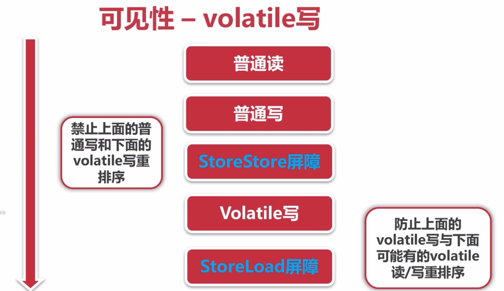
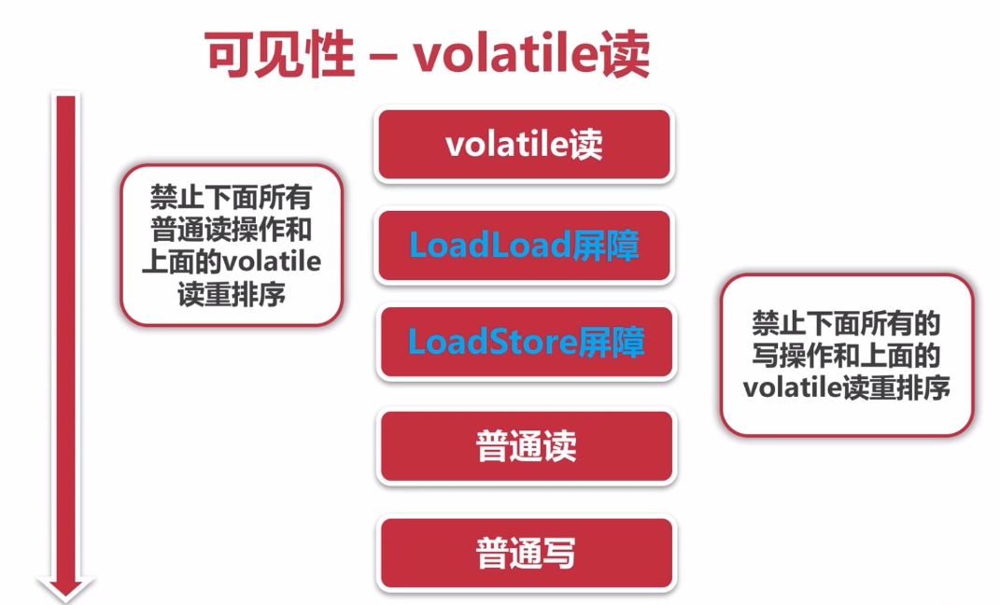

# 线程安全

多个线程不管以何种方式访问某个类，并且在主调代码中不需要进行同步，都能表现正确的行为。

## 概念

编写线程安全的代码，本质上就是管理对**状态**的访问，而且通常都是**共享、可变**的状态。

​	一个对象的状态就是它的数据，存储在状态变量中，如静态域、实例域。共享即一个变量可以被多个线程访问。可变即变量的值在其生命周期内都可以改变。真正要做到的线程安全是在不可控制的并发访问当中保护数据。

​	无论何时，只要有多于一个的线程访问给定的状态变量，而且其中某个线程会写入该变量，此时必须使用同步来协调线程对该变量的访问。

​	java的同步机制：synchronized(独占锁)，volatile(显示锁和原子变量的使用)

​	修复同步隐患

- 不跨线程的共享变量
- 使用状态变量为不可变的
- 在任何访问状态变量的时候使用同步

# 线程安全性

当多个线程访问某个类时，不管运行时环境采用**何种调度方式**或者这些进程将如何交替执行，并且在主调代码中不需要**任何额外的同步或协同**，这个类都能表现出**正确的行为**。

无状态的对象永远是安全的。即指这个对象没有状态域，也没有引用其他对象的域，是一次特定计算的瞬时状态，会唯一存放在一个本地变量当中，即线程的栈当中。而两个线程并不共享状态。

**三个方面**

- 原子性：提供了互斥访问，同一时刻只能有一个线程对它进行操作
- 可见性：一个线程对主内存的修改可以及时被其他线程观察到
- 有序性：一个线程观察其他线程中的指令执行顺序，由于指令重排序的存在，该观察结果一般无序

## 原子性

原子性：能作为一个单独的、不可分割的操作去执行

当向一个无状态的对象添加一个域，并进行long++操作（读+改+写），则不是线程安全

将long换作一个atomic包下的AtomicLong变量，则由于该变量是一个原子变量类，该计数器是线程安全的，该对象的状态即该计数器的对象，即该对象线程安全。（利用已有的线程安全类进行管理，如果只有一个，则线程安全，如果多个，则未必线程安全）

当变量之间相互关联，则在一个原子操作当中，要将几个相互关联的变量同时更新

**竞争条件**

​	想得到正确的答案，依赖时序。

### Atomic

JDK的Atomic包，通过CAS完成原子性

int类型变为AtomicInteger，自增的方法为incrementAndGet

#### CAS核心

```Java
    //计数方法
    private static void add(){
        count.incrementAndGet();//先执行增加操作，再获取值
//        count.getAndIncrement(); //先获取当前的值，再执行增加操作
    }
```

源码实现，基于一个unsafe类

```Java
    public final int incrementAndGet() {
        return unsafe.getAndAddInt(this, valueOffset, 1) + 1;
    }
```

以dowhile语句为核心实现,CompareAndSwap是C.A.S的核心.

因为使用循环，如果修改很频繁，会不断循环尝试修改，使得性能受到影响

```java
/**
 * var1:当前的对象
 */
public final int getAndAddInt(Object var1, long var2, int var4) {
        int var5;
        do {
            //通过调用底层方法,获得var1对象底层当前的值
            //如果没有其他线程更改,则var5就会等于var2
            var5 = this.getIntVolatile(var1, var2);
            //比较底层的值var5与传入的值var2
            //如果底层的值与传入值相同,那么更新为var5+增量var4
            //如果值不相同,则将var2的值更改为底层当前的值,然后重新do,获得var5的值,进行比较
        } while(!this.compareAndSwapInt(var1, var2, var5, var5 + var4));

        return var5;
    }
```

以native标识，即java底层的实现，不是java的实现

```java
    public final native boolean compareAndSwapInt(Object var1, long var2, int var4, int var5);
```

#### 源码解析

**AtomicLong**

对于很精确的数值需要使用

**LongAdder**

原理：JVM对于普通的long与double，允许将64位的读操作与写操作拆分为两个32位的操作。

核心：将热点数据分离，将一个value分割为一个数组，每个线程针对一个数值，最后的value由数组的值合成，将单点的更新压力分散为多点的更新压力。在低并行的时候，对value直接更新。

优点：在高并发下，效率很高

缺点：如果有并行更新，可能导致统计数据有一些误差

**AtomicReference**

```Java
   private static AtomicReference<Integer> count = new AtomicReference<>(0);

//输出4
    public static void main(String[] args) {
        count.compareAndSet(0,2); // 2
        count.compareAndSet(0,1); // no
        count.compareAndSet(1,3); // no
        count.compareAndSet(2,4); // 4
        count.compareAndSet(3,5); // no
        log.info("count:{}",count.get());
    }
```

**AtomicReferenceFieldUpdater**

以**原子性更新**某个类的一个实例的一个字段，字段必须volatile，并且非static

```Java
    private static AtomicIntegerFieldUpdater<AtomicExample5> updater = AtomicIntegerFieldUpdater.newUpdater(AtomicExample5.class,"count");

    @Getter
    public volatile int count = 100;

    private static AtomicExample5 atomicExample5 = new AtomicExample5();

    public static void main(String[] args) {
        if (updater.compareAndSet(atomicExample5,100,120)){
            log.info("update success,{}",atomicExample5.getCount());
        }
        if (updater.compareAndSet(atomicExample5,100,120)){
            log.info("update success,{}",atomicExample5.getCount());
        }else {
            log.error("update error{}",atomicExample5.getCount());
        }


    }
```

**AtomicLongArray**

更新一个long的数组

**AtomicBoolean**

实现代码只执行一次

```Java
   private static AtomicBoolean isHappend = new AtomicBoolean(false);
   private static void test(){
        if (isHappend.compareAndSet(false, true)) {

            log.info("execute");
        }
    }
```

#### CAS的ABA问题

ABA问题：在CAS操作中，其他线程将数据A改为B，又改为A。

解决：在每次更新的时候，记录一个版本号，每次更新+1

通过AtomicStampReference实现，核心方法为CompareAndSet

### 原子性：锁

synchronized：依赖JVM，在该关键字作用对象的作用范围内，只有一个线程可以操作

Lock：依赖特殊的CPU指令，由代码实现。ReentrantLock

#### synchronized

同步锁，修饰的对象：

- 修饰代码块：大括号括起来的代码，作用于**调用的对象**
- 修饰方法：整个方法，作用于**调用的对象**
- 修饰静态方法：整个静态方法，作用于**所有对象**
- 修饰类：括号括起来部分，作用于**所有对象**

作用于所有的对象。则如果两个对象调用一个修饰的方法，他们会并行执行。而如果调用一个静态方法，则他们无法并行执行。

对于修饰代码块与修饰方法，不同的调用对象互相不影响

***继承***

如果子类调用继承于父类的synchronize方法（synchronize不属于一个类），是没有synchronize效果的，必须显式声明

***特性***

- 重进入：内部锁是重进入的，当线程试图获得它自己所占有的锁时候，请求会成功，即重进入是基于每**线程**的，而不是调用。

  实现是通过为每个锁关联一个请求计数与一个占有它的线程，当同一线程访问，则计数++，线程退出该锁，则计数--，直到计数为0，释放该锁（父类与子类的使用）

***用锁来保持状态***

- 如果每个可被多个线程访问的可变状态变量，如果所有访问它的线程在执行状态当中占有同一个锁，则称该变量是由这个锁保护的
- 每个共享的可变变量都需要唯一一个确定的锁保护

***设计***

- 决定synchronize块大小需要权衡安全性（不能妥协）、简单性、性能。通常简单性与性能相互牵制，实现一个同步策略时候，不要过早地为了性能而牺牲简单性（是对安全性潜在的妥协）
- 有些耗时的计算或操作，如网络或者控制台IO，难以快速完成，执行它们的时候不要占有锁

#### Lock

### 原子性对比：

- synchronize；不可中断锁，适合竞争不激烈，可读性好
- Lock：可中断锁，多样化同步，竞争激烈能维持常态
- Atomic：竞争激烈能维持常态，比lock性能好，但是只能同步一个值

### 活跃度与性能

​	不能武断地将整个方法设置为synchronize的，通过缩小synchronize的范围来提高并发性


## 可见性

一个线程对主内存的修改可以及时被其他线程观察到。

导致共享变量在线程间不可见的原因

- 线程交叉执行
- 重排序结合线程交叉执行
- 共享变量更新后的值没有在工作内存与主内存间及时更新

### synchronized

JVM对synchronize的规定

- 线程解锁前，必须把共享变量的最新值刷新到主内存
- 线程加锁时，将清空工作内存中共享变量的值，从而使用共享内存是需要从主内存中重新读取最新的值

### volatile

通过加入内存屏障与禁止重排序优化来实现。

- 对volatile变量**写操作**时，会在写操作后加入一条store屏障指令，将本地内存中的共享变量值刷新到主内存。（每次写之后都刷新），CPU指令级别进行操作。




- 对volatile变量**读操作**时，会在读操作前加入一条load屏障指令，从主内存中读取共享变量。（每次读从主内存读）



但是volatile**无法保证**线程安全。

```java
count++;
// 1、count//获得的是最新值
// 2、+1   //两个进程同时++
// 3、count//同时写回,即丢掉了一次.
```

volatile**使用**

- 对变量的写操作不依赖于当前值
- 该变量没有包含在具有其他变量的不变式中。

可以被写入 volatile 变量的这些有效值独立于任何程序的状态，包括变量的当前状态。

使用场景

- 很适合作为状态标示量
- 检查两次

## 有序性

一个线程观察其他线程中的指令执行顺序，由于指令重排序的存在，该观察结果一般无序

方式：volatile、synchronized、lock、java内存模型的先天有序性（happens before原则）

### happens before原则

- 程序次序规则：一个线程内，按照代码顺序，书写在前面的操作先行发生于书写在后面的操作
- 锁定操作：一个unlock操作先行发生于后面对同一个锁的lock操作
- volatile变量规则：对一个变量的写操作先行发生于后面对于这个变量的读操作
- 传递规则；如果操作A先行发生于操作B，而操作B又先行发生于操作C，则操作A先行发生于操作C
- 线程启动规则：Thread对象的start（）方法先行发生于此线程的每一个动作
- 线程中断规则：对线程interrupt()方法的调用先行发生于被中断线程的代码检测到中断事件的发生
- 线程终结规则：线程中所有的操作都先行发生于线程的终止检测
- 对象终结规则：一个对象的初始化完成先行发生于它的finalize（）方法的开始

如果两个操作的执行次序无法从happens before推导出来，则JVM可以对它进行随意的重排序。

# 线程安全策略

进行共享和发布对象，使得多个线程可以安全地访问他们。

- 线程限制
  - 一个被线程限制的对象，由线程独占，并且只能被占有它的线程修改
  - 线程封闭：把对象封装到一个线程当中，只有一个线程可以看到它
- 共享只读
  - 一个共享只读的对象，在没有额外同步的情况下，可以被多个线程并发访问，但是任何线程都不能修改它
  - 不可变对象：一种对象只要发布了就是安全的，即不可变对象，是一种躲避并发的方法
- 线程安全对象
  - 一个线程安全的对象或者容器，在内部通过同步机制来保证线程安全，所有其他线程无需额外同步就可以通过公共接口随意访问它
- 被守护对象
  - 只能通过获取特定的锁来访问

## 线程安全的困难

### 可见性

​	重排序现象：在单个线程当中，只要重排序不会对结果产生影响，则不能保证操作一定按照程序写定的顺序执行（java虚拟机的高性能）

​	如果数据需要跨线程共享，就要进行恰当的同步。

**过期数据**

​	当读线程检查一个变量时，可能看到一个过期的数据。并且过期不会发生在全部变量上，也不会完全不出现。

​	对于get与set方法，同样需要同步化，进行synchronize

**锁与可见性**

​	锁不仅仅是关于同步与互斥的，也是关于内存可见的，为了保证所有线程都能看到共享的、可变变量的最新值，读取和写入线程必须使用公共的锁进行同步

​	volatile：弱同步，确保对一个变量的更新以可预见的方式告知其他线程

### 发布和逸出

​	发布：发布一个对象指它能够被当前范围以外的代码所使用。发布一个对象，同时将发布该对象所有的非私有域引用的对象。

​	逸出：一个对象在尚未准备好的时候就发布

发布方式：

- 将对象存放到公共静态域

逸出：

- this引用在构造期间逸出，即对象在没有通过构造函数构造完毕（执行到了构造函数的某一句）时候逸出。

  当对象在构造函数当中创建一个线程，this引用总是被新线程共享，

## 线程不安全类与写法

线程不安全类：

- 如果多个线程对同一个共享数据进行访问而不采取同步操作的话，那么操作的结果是不一致的。
- 如果一个类的对象可以同时被多个线程访问，如果没有做并发处理，则会出现异常

StringBuilder是线程不安全的。

StringBuffer是线程安全的，它内部方法添加了synchronized，但也因此它的性能有损耗。

**ArrayList、hashMap、hashSet等collection**

线程不安全

***示例***

以下代码演示了 1000 个线程同时对 cnt 执行自增操作，操作结束之后它的值有可能小于 1000。

```Java
public class ThreadUnsafeExample {

    private int cnt = 0;

    public void add() {
        cnt++;
    }

    public int get() {
        return cnt;
    }
}
public static void main(String[] args) throws InterruptedException {
    final int threadSize = 1000;
    ThreadUnsafeExample example = new ThreadUnsafeExample();
    final CountDownLatch countDownLatch = new CountDownLatch(threadSize);
    ExecutorService executorService = Executors.newCachedThreadPool();
    for (int i = 0; i < threadSize; i++) {
        executorService.execute(() -> {
            example.add();
            countDownLatch.countDown();
        });
    }
    countDownLatch.await();
    executorService.shutdown();
    System.out.println(example.get());
}
```

## 安全发布

​	如果希望跨线程共享对象，则必须安全地共享它

​	对象的引用对其他线程可见，但它的状态可能是过期的，即对象的状态不一定对消费线程可见。

**安全发布的模式**

- 通过静态初始化器初始化对象的引用（JVM内部的同步机制）
- 将它的引用存储到volatile域或者atomicReference
- 将它的引用存储到正确创建的对象的final域
- 或者将它的引用存储到由锁正确保护的域中

**线程安全容器**

​	线程安全容器的内部同步，即将对象置入这些容器的操作符合最后一条要求

- HashTable、synchronizedMap、concurrentMap
- Vector、CopyOnWriteArrayList、synchronizedList
- BlockingQueue、concurrentLinkedQueue

**高效不可变对象**

​	一个对象在技术上不是不可变得，但是它的状态在发布后不会再更改，即有效不可变对象。

> 任何线程都可以在没有额外同步的情况下安全使用一个**安全发布**的高效不可变对象

**可变对象**

​	安全发布仅仅保证发布当时的可见性，对于可变性，还需要线程安全或锁

- 可变对象必须要安全发布，同时必须要线程安全或者是锁保护的

  > - 线程限制：一个线程限制的对象，通过限制在线程中，而被线程独占，且只能被占有它的线程修改
  > - 共享只读：在没有额外同步的情况下可以被多个对象并发访问，但是任何线程都不可以修改它，包括可变对象和高效不可变对象
  > - 共享线程安全：一个线程安全的对象在内部同步，所以其他线程无须额外同步，就可以通过公共接口访问
  > - 被守护的：一个被守护的对象只能通过特定的锁来访问。被守护的对象包括那些被线程安全对象封装的对象，和已知被特定的锁保护起来的已发布对象

## 线程安全实现方式：

### 不可变

不可变（Immutable）的对象一定是线程安全的，不需要再采取任何的线程安全保障措施。只要一个不可变的对象被正确地构建出来，永远也不会看到它在多个线程之中处于不一致的状态。多线程环境下，应当尽量使对象成为不可变，来满足线程安全。

不可变的**类型**：

- final 关键字修饰的基本数据类型
- String
- 枚举类型
- Number 部分子类，如 Long 和 Double 等数值包装类型，BigInteger 和 BigDecimal 等大数据类型。但同为 Number 的原子类 AtomicInteger 和 AtomicLong 则是可变的。

不可变对象需要满足的**条件**

- 对象创建以后状态就不能修改
  - 将类声明为final
- 对象所有域都是final类型
  - 所有域声明为私有
  - 不通过set方法
  - 将所有可变数据声明为final
- 对象是正确创建的，this引用没有逸出
  - 通过构造器初始化所有成员
  - 在get方法不直接返回对象本身，而是返回一个clone

**final关键字**：类、方法、变量

- 修饰类：
  - 不能被继承
  - 所有成员方法会隐式选择为final
- 修饰方法
  - 锁定方法不能被继承修改
- 修饰变量
  - 基本数据类型变量
  - 引用类型变量（初始化后，不能指向另一个对象）

其他创建不可变对象方法

- 对于集合类型，Collections.unmodifiableXXX：Collection、List、Set、Map...

```java
public class ImmutableExample2 {

    private static Map<Integer,Integer> map = Maps.newHashMap();

    static {
        map.put(1,2);
        map.put(3,4);
        map.put(5,6);
        //创建final的map
        map = Collections.unmodifiableMap(map);
    }

    public static void main(String[] args) {
        //会抛出异常, map无法被修改
        map.put(1,3);
        log.info("{}",map.get(1));
    }
}
```

将返回一个新的map，将数据拷贝过去，然后将所有更改数据转换为了抛出异常

```Java
    public static <K,V> Map<K,V> unmodifiableMap(Map<? extends K, ? extends V> m) {
        return new UnmodifiableMap<>(m);
    }
```

- Guava：ImmutableXXX：Collection、List、Set、Map...

```Java
public class ImmutableExample3 {

    private final static ImmutableList<Integer> list = ImmutableList.of(1,2,3);

    private final static ImmutableSet set = ImmutableSet.copyOf(list);

    private final static ImmutableMap<Integer,Integer> map = ImmutableMap.of(1,2,3,4);

    private final static ImmutableMap<Integer,Integer> map2 = ImmutableMap.<Integer,Integer>builder()
            .put(1,2).put(3,4).put(5,6).build();

    public static void main(String[] args) {
//        set.add(4);
//        map2.put(1,4);
        System.out.println(map2.get(3));
    }
}
```

### 互斥同步

synchronized 和 ReentrantLock。

### 非阻塞同步

互斥同步最主要的问题就是线程阻塞和唤醒所带来的性能问题，因此这种同步也称为阻塞同步。

互斥同步属于一种悲观的并发策略，总是认为只要不去做正确的同步措施，那就肯定会出现问题。无论共享数据是否真的会出现竞争，它都要进行加锁（这里讨论的是概念模型，实际上虚拟机会优化掉很大一部分不必要的加锁）、用户态核心态转换、维护锁计数器和检查是否有被阻塞的线程需要唤醒等操作。

#### 1. CAS

随着硬件指令集的发展，我们可以使用基于冲突检测的乐观并发策略：先进行操作，如果没有其它线程争用共享数据，那操作就成功了，否则采取补偿措施（不断地重试，直到成功为止）。这种乐观的并发策略的许多实现都不需要将线程阻塞，因此这种同步操作称为非阻塞同步。

乐观锁需要操作和冲突检测这两个步骤具备原子性，这里就不能再使用互斥同步来保证了，只能靠硬件来完成。硬件支持的原子性操作最典型的是：比较并交换（Compare-and-Swap，CAS）。CAS 指令需要有 3 个操作数，分别是内存地址 V、旧的预期值 A 和新值 B。当执行操作时，只有当 V 的值等于 A，才将 V 的值更新为 B。

#### 2. AtomicInteger

J.U.C 包里面的整数原子类 AtomicInteger 的方法调用了 Unsafe 类的 CAS 操作。

以下代码使用了 AtomicInteger 执行了自增的操作。

```
private AtomicInteger cnt = new AtomicInteger();

public void add() {
    cnt.incrementAndGet();
}
```

以下代码是 incrementAndGet() 的源码，它调用了 Unsafe 的 getAndAddInt() 。

```
public final int incrementAndGet() {
    return unsafe.getAndAddInt(this, valueOffset, 1) + 1;
}
```

以下代码是 getAndAddInt() 源码，var1 指示对象内存地址，var2 指示该字段相对对象内存地址的偏移，var4 指示操作需要加的数值，这里为 1。通过 getIntVolatile(var1, var2) 得到旧的预期值，通过调用 compareAndSwapInt() 来进行 CAS 比较，如果该字段内存地址中的值等于 var5，那么就更新内存地址为 var1+var2 的变量为 var5+var4。

可以看到 getAndAddInt() 在一个循环中进行，发生冲突的做法是不断的进行重试。

```
public final int getAndAddInt(Object var1, long var2, int var4) {
    int var5;
    do {
        var5 = this.getIntVolatile(var1, var2);
    } while(!this.compareAndSwapInt(var1, var2, var5, var5 + var4));

    return var5;
}
```

#### 3. ABA

如果一个变量初次读取的时候是 A 值，它的值被改成了 B，后来又被改回为 A，那 CAS 操作就会误认为它从来没有被改变过。

J.U.C 包提供了一个带有标记的原子引用类 AtomicStampedReference 来解决这个问题，它可以通过控制变量值的版本来保证 CAS 的正确性。大部分情况下 ABA 问题不会影响程序并发的正确性，如果需要解决 ABA 问题，改用传统的互斥同步可能会比原子类更高效。

### 无同步方案

要保证线程安全，并不是一定就要进行同步。如果一个方法本来就不涉及共享数据，那它自然就无须任何同步措施去保证正确性。

#### 线程封闭

访问共享的、可变的数据要求使用同步。一个可以避免同步的方法就是不共享数据，如果数据仅仅在单线程当中访问，则不需要任何同步。当对象封装在一个线程当中，则自动成为线程安全的。

- Swing将事件分发到线程当中
- JDBC从池中分配一个对象给线程。

**线程封闭方法：**

- Ad-hoc线程封闭：程序控制实现，最糟糕。

  - 指维护线程限制性的任务全部落在实现上的情况
  - 确保只通过单一线程写入共享的volatile变量，则操作便是共享

- 堆栈封闭：局部变量，无并发问题。

  - 是线程限制的特例，只能通过本地变量才可以触及对象。本地变量使得对象更容易被限制在线程本地中**，本地变量本身就被限制在执行线程**中，它们存在于执行线程栈。其他线程无法访问这个栈

  - 示例

    ```Java
    public class StackClosedExample {
        public void add100() {
            int cnt = 0;
            for (int i = 0; i < 100; i++) {
                cnt++;
            }
            System.out.println(cnt);
        }
    }
    public static void main(String[] args) {
        StackClosedExample example = new StackClosedExample();
        ExecutorService executorService = Executors.newCachedThreadPool();
        executorService.execute(() -> example.add100());
        executorService.execute(() -> example.add100());
        executorService.shutdown();
    }
    100
    100
    ```

  - 例如方法当中的numPairs。在该方法当中，实例化的animals只有一个引用指向它，因此它保存在线程的栈当中，倘若发布了animals或其内部对象的引用，则破坏了限制，并导致了对象逸出

    


#### 线程本地存储（Thread Local Storage）

如果一段代码中所需要的数据必须与其他代码共享，那就看看这些共享数据的代码是否能保证在同一个线程中执行。如果能保证，我们就可以把共享数据的可见范围限制在同一个线程之内，这样，无须同步也能保证线程之间不出现数据争用的问题。

符合这种特点的应用并不少见，大部分使用消费队列的架构模式（如“生产者-消费者”模式）都会将产品的消费过程尽量在一个线程中消费完。其中最重要的一个应用实例就是经典 Web 交互模型中的“一个请求对应一个服务器线程”（Thread-per-Request）的处理方式，这种处理方式的广泛应用使得很多 Web 服务端应用都可以使用线程本地存储来解决线程安全问题。

- ThreadLocal线程封闭：特别好的封闭方法。
  - 内部维护了一个map，key是线程名称，值是对象
  - 更规范的方式，允许将每个线程与持有数值的对象关联在一起。ThradLocal提供了get和set，为每个使用它的线程维护一份单独的拷贝，所以get总是返回当前执行线程通过set设置的最新值。

> ThreadLocal 提供了线程本地的实例。它与普通变量的区别在于，每个使用该变量的线程都会初始化一个完全独立的实例副本。ThreadLocal 变量通常被`private static`修饰。当一个线程结束时，它所使用的所有 ThreadLocal 相对的实例副本都可被回收。

总的来说，**ThreadLocal 适用于每个线程需要自己独立的实例且该实例需要在多个方法中被使用，也即变量在线程间隔离而在方法或类间共享的场景**

可以使用 java.lang.ThreadLocal 类来实现线程本地存储功能。

对于以下代码，thread1 中设置 threadLocal 为 1，而 thread2 设置 threadLocal 为 2。过了一段时间之后，thread1 读取 threadLocal 依然是 1，不受 thread2 的影响。

```Java
public class ThreadLocalExample {
    public static void main(String[] args) {
        ThreadLocal threadLocal = new ThreadLocal();
        Thread thread1 = new Thread(() -> {
            threadLocal.set(1);
            try {
                Thread.sleep(1000);
            } catch (InterruptedException e) {
                e.printStackTrace();
            }
            System.out.println(threadLocal.get());
            threadLocal.remove();
        });
        Thread thread2 = new Thread(() -> {
            threadLocal.set(2);
            threadLocal.remove();
        });
        thread1.start();
        thread2.start();
    }
}
1
```

为了理解 ThreadLocal，先看以下代码：

```Java
public class ThreadLocalExample1 {
    public static void main(String[] args) {
        ThreadLocal threadLocal1 = new ThreadLocal();
        ThreadLocal threadLocal2 = new ThreadLocal();
        Thread thread1 = new Thread(() -> {
            threadLocal1.set(1);
            threadLocal2.set(1);
        });
        Thread thread2 = new Thread(() -> {
            threadLocal1.set(2);
            threadLocal2.set(2);
        });
        thread1.start();
        thread2.start();
    }
}
```

##### 底层原理

它所对应的底层结构图为：


每个 Thread 都有一个 ThreadLocal.ThreadLocalMap 对象。

```Java
/* ThreadLocal values pertaining to this thread. This map is maintained
 * by the ThreadLocal class. */
ThreadLocal.ThreadLocalMap threadLocals = null;
```

当调用一个 ThreadLocal 的 set(T value) 方法时，先得到当前线程的 ThreadLocalMap 对象，然后将 ThreadLocal->value 键值对插入到该 Map 中。

```Java
public void set(T value) {
    Thread t = Thread.currentThread();
    ThreadLocalMap map = getMap(t);
    if (map != null)
        map.set(this, value);
    else
        createMap(t, value);
}
```

get() 方法类似。

```Java
public T get() {
    Thread t = Thread.currentThread();
    ThreadLocalMap map = getMap(t);
    if (map != null) {
        ThreadLocalMap.Entry e = map.getEntry(this);
        if (e != null) {
            @SuppressWarnings("unchecked")
            T result = (T)e.value;
            return result;
        }
    }
    return setInitialValue();
}
```

ThreadLocal 从理论上讲并不是用来解决多线程并发问题的，因为根本不存在多线程竞争。

在一些场景 (尤其是使用线程池) 下，由于 ThreadLocal.ThreadLocalMap 的底层数据结构导致 ThreadLocal 有内存泄漏的情况，应该尽可能在每次使用 ThreadLocal 后手动调用 remove()，以避免出现 ThreadLocal 经典的内存泄漏甚至是造成自身业务混乱的风险。

#### 可重入代码（Reentrant Code）

这种代码也叫做纯代码（Pure Code），可以在代码执行的任何时刻中断它，转而去执行另外一段代码（包括递归调用它本身），而在控制权返回后，原来的程序不会出现任何错误。

可重入代码有一些共同的特征，例如不依赖存储在堆上的数据和公用的系统资源、用到的状态量都由参数中传入、不调用非可重入的方法等。

### 同步容器

类别

- ArrayList->Vector、Stack
- HashMap->HashTable
- Collections.synchronizedXXX(List、Set、Map)
  - collection的静态工厂创建

同步容器也未必线程安全

同步容器虽然保证了同一时刻只有一个线程可以访问，但是线程交替进行访问依然会出现问题

```Java
                Thread thread1 = new Thread() {
                    public void run() {
                        for (int i = 0; i < vector.size(); i++) {
                            vector.remove(i);
                        }
                    }

                };

                Thread thread2 = new Thread() {
                    public void run() 
                    //在size=10,i=9时刻,上面的线程将其删除,而此时读取则会出现异常
                        for (int i = 0; i < vector.size(); i++) {
                            vector.get(i);
                        }
                    }
                };

                thread1.start();
                thread2.start();
```

### 并发容器J.U.C

JDK下的一个包Java.util.concurrent

- ArrayList->CopyOnWriteArrayList
  - 写操作的时候复制，在新的数组上操作，写完后，将原有的数据指向新数组
  - 拷贝数组消耗内存
  - 不能用于实时读数组，可能读取到旧的，适合读多写少
- HashSet、TreeSet->CopyOnWriteArraySet、ConcurrentSkipListSet
  - ConcurrentSkipListSet：支持自然排序（TreeSet），基于map。对于批量操作并不能保证原子操作，对于单个cotains操作可以
- HashMap、TreeMap->ConcurrentHashMap、ConcurrentSkipListMap
  - ConcurrentHashMap:针对读操作做了大量的优化，能应付很大的并发，速度快
  - ConcurrentSkipListMap：TreeMap的安全版，基于跳表实现，支持更高的并发，线程越多越优秀
- Collections.synchronizedXXX(List、Set、Map)


#### HashMap与ConcurrentHashMap

HashMap

数据结构：

- 数组
- 引用


参数

- 初始容量
- 加载因子

寻址方式

- 取模操作消耗操作较大，使用与操作与2^n-1进行与运算

#### 同步器AQS

# 总结

原子性：Atomic包、CAS算法、synchronized、Lock

可见性：synchronized、volatile

有序性：happens-before

# 参考 #

1. [慕课网《Java并发编程入门与高并发面试 》课程学习](https://github.com/youzhidakeai/concurrency)