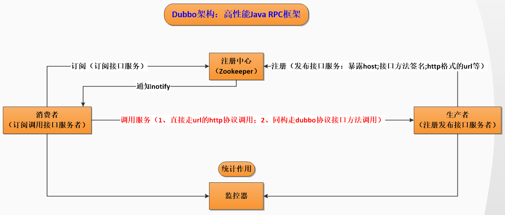
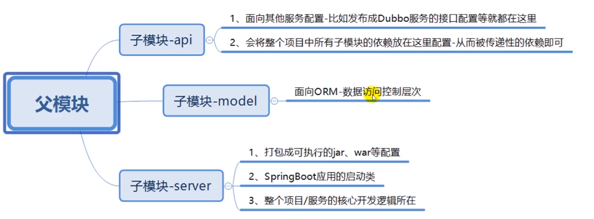

两大协议（不止两种）

- RPC协议/Dubbo协议：同构项目，犹如本地调用一般
- Http的Rest Api：通用（不要求同构，比如可以是多种语言）项目

# Dubbo

4个核心组件

- 生产者
- 消费者
- 监控器
- 注册中心

核心配置文件

- spring-dubbo.xml
  - 注解发布的dubbo服务所在包
  - 配置支持的两种调用方式对应的协议
  - 消费服务配置
- dubbo.yml
  - 配置两大协议对应的端口等信息

相关技术点

- 服务拆分。商品服务、用户商城服务、订单服务、支付服务
- 服务解耦：明确职责、服务调度、网络通信
- 服务管理：统一注册中心配置管理（发布注册、订阅调度）

# Zookeeper

# 参考 #

1. 
