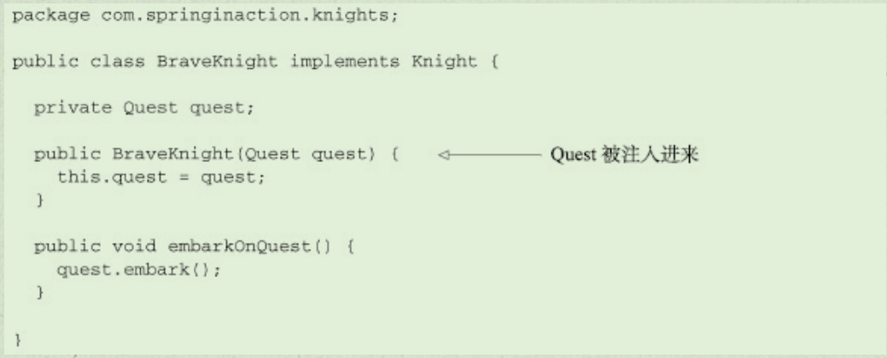
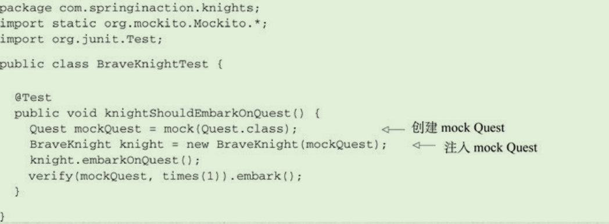
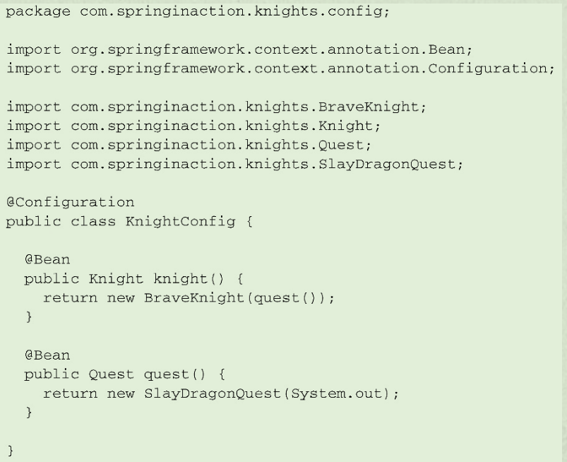
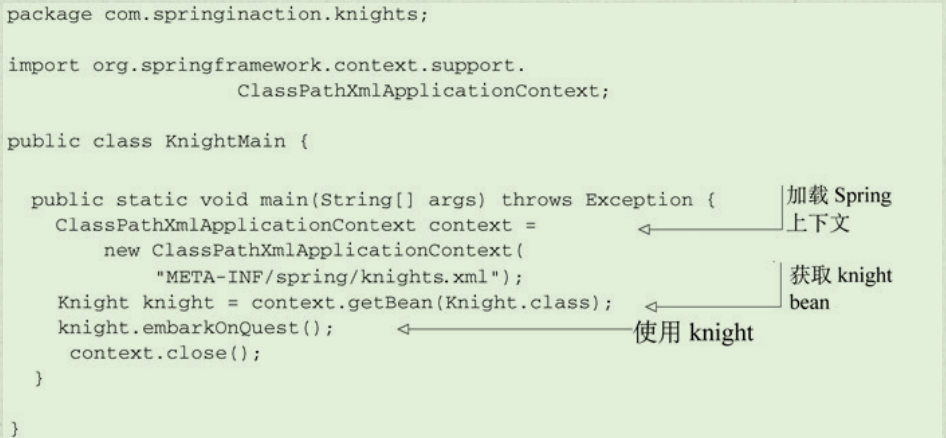
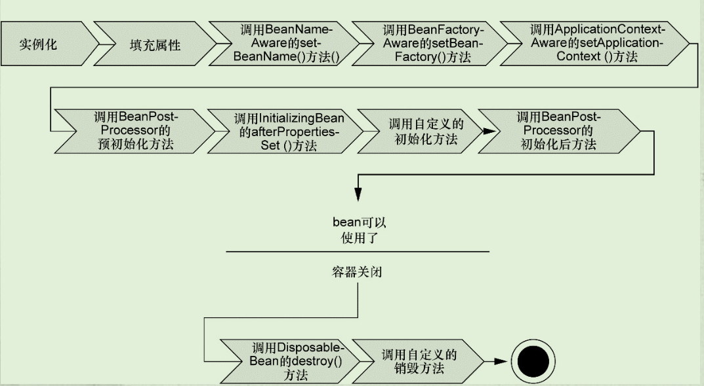
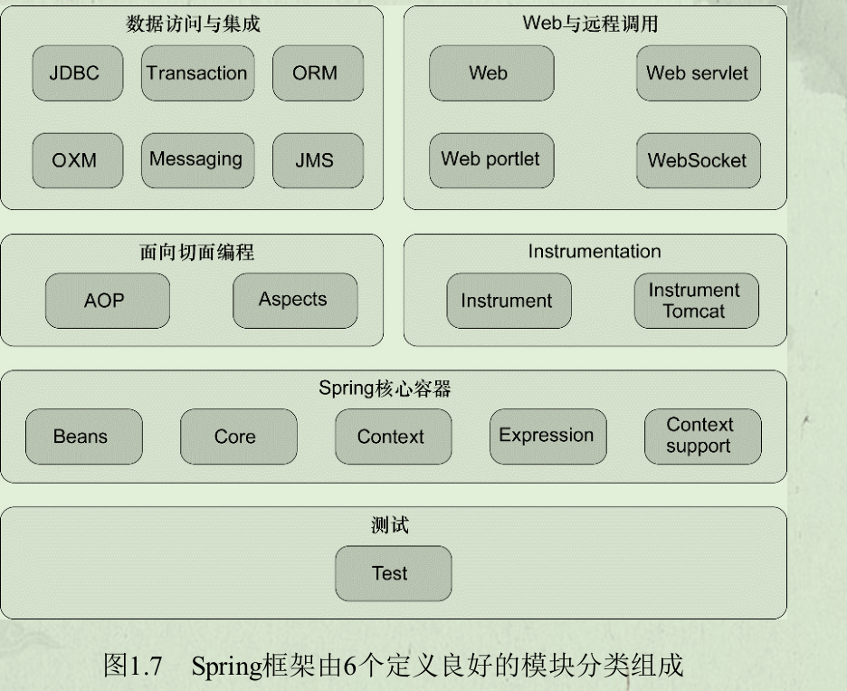
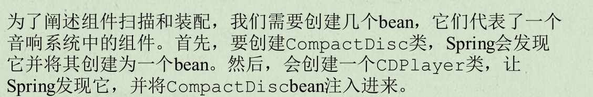

Spring框架核心知识

- spring容器
- 依赖注入DI
- 面向切面编程AOP

如何使用Spring构建Web应用程序

如何在应用程序的后端使用Spring

- JDBC等

如何使用Spring与其他的应用和服务进行集成

- RESTful
- 对异步消息的支持，消息服务与消息队列
- SpringBoot

# Spring的核心

## 简化Java开发

降低Java开发的复杂性

- 基于POJO的轻量级和最小入侵性编程
- 通过依赖注入和面向接口实现松耦合
- 基于切面和惯例进行声明式编程
- 通过切面和模板减少样板式代码

### 激发POJO的性能

POJO：

- 简单的Java对象，即普通的JavaBeans
- 有一些属性已经getter与setter方法，以及简单的运算属性，但不包括业务逻辑

在Spring当中，类通常没有任何痕迹表明使用了Spring，最坏的场景是使用了Spring的注解。因此Spring的非侵入编程模型意味着这个类在非Srping应用中可以发挥同样的作用

Spring通过依赖注入（DI）来进行装配，实现POJO

### 依赖注入DI

**松耦合**

前面我们在写程序的时候，都是**面向接口编程，通过DaoFactroy等方法来实现松耦合**

DAO层和Service层**通过DaoFactory来实现松耦合**

- 如果Serivce层直接new DaoBook()，那么DAO和Service就紧耦合了【Service层依赖紧紧依赖于Dao】

而Spring给我们更加合适的方法来实现松耦合，并且更加灵活、功能更加强大！---->**IOC控制反转**

#### DI功能的实现

- 任何一个实际意义的应用，都会有两个或者更多个类组成，这些类进行相互协作来完成特定的业务逻辑。
- 传统做法：每个对象负责管理与自己协作的对象（即它依赖的对象）的引用，这将会导致高度耦合和难以测试的代码。
  - 
  - 耦合的两面性
  - 紧密耦合的代码难以测试、复用、理解，并且典型地表现出“打地鼠”式bug的特性
  - 一定程度的耦合是必须的，完全没有耦合的代码什么也做不了，不同的类必须以适当的方式进行交互。
- DI：对象的依赖关系将由系统中负责协调各对象的第三方组件在创建对象时进行设定，对象无需自行创建或管理它们的依赖关系
  - 
  - 构造器注入，同时Quest是一个接口，也因此它可以引用实现该接口的其他类。即松耦合
  - 
  - 装配：创建应用组件间的协作的行为。即如何将一个Quest交给BraveKnight，
    - XML装配
    - Java描述配置
      - 
    - 尽管他们存在依赖关系，但是BraveKnight并不知道是什么样的Quest，也不知道来自哪里。
- DI如何工作
  - 通过应用上下文（Application Context）装载bean的定义，并把他们组装起来，Spring应用上下文全权负责对象的创建与组装
  - 

**应用切面AOP**

AOP允许把遍布应用各处的功能分离出来形成可重用的组件。定义为促使软件系统实现关注点的分离一项技术。

AOP保持POJO的简单些，并使得组件更关注自身业务。

系统由许多不同的组件组成，每一个组件各负责一块特定的功能，除了实现自身核心的功能外，这些组件还常承担着额外的职责。诸如日志、安全这样的系统服务经常融入到自身具有核心业务逻辑的组件中，这些系统服务童车被称为横切关注点，因为他们会跨越系统的多个组件。

**使用模板消除样板式代码**

样板式的代码：通常为了实现通用的和简单的任务，不得不一遍遍地重复编写这样的代码。

例如JDBC的查询修改代码，有异常捕获、connect，API等重复性代码

使用jdbcTemplate解决

## 容纳你的Bean

基于Spring的应用中，应用对象生存于Spring容器当中。Spring容器负责创建对象，装配他们，配置并管理他们整个生命周期。

Spring容器使用DI管理构成应用的组件，它会创建相互协作的组件间额关联。

- 两类容器实现
- bean工厂，最简单的容器，提供基本的DI支持
- 应用上下文，基于BeanFactory构建，提供应用框架级别的服务。
  - AnnotationConfigApplicationContext：从一个或多个基于Java的配置类中加载Spring应用上下文。
  - AnnotationConfigWebApplicationContext：从一个或
    多个基于Java的配置类中加载Spring Web应用上下文。
  - ClassPathXmlApplicationContext：从类路径下的一个或
    多个XML配置文件中加载上下文定义，把应用上下文的定义文件作为类资源。
  - FileSystemXmlapplicationcontext：从文件系统下的一
    个或多个XML配置文件中加载上下文定义。
  - XmlWebApplicationContext：从Web应用下的一个或多个
    XML配置文件中加载上下文定义。

**bean的生命周期**

1. Spring对bean进行实例化；
2. Spring将值和bean的引用注入到bean对应的属性中；
3. 如果bean实现了BeanNameAware接口，Spring将bean的ID传递给setBean-Name()方法；
4. 如果bean实现了BeanFactoryAware接口，Spring将调setBeanFactory()方法，将BeanFactory容器实例传入；
5. 如果bean实现了ApplicationContextAware接口，Spring将调用setApplicationContext()方法，将bean所在的应用上下文的引用传入进来；
6. 如果bean实现了BeanPostProcessor接口，Spring将调用它们的post-ProcessBeforeInitialization()方法；
7. 如果bean实现了InitializingBean接口，Spring将调用它们的after-PropertiesSet()方法。类似地，如果bean使用init-method声明了初始化方法，该方法也会被调用；
8. 如果bean实现了BeanPostProcessor接口，Spring将调用它们的post-ProcessAfterInitialization()方法；
9. 此时，bean已经准备就绪，可以被应用程序使用了，它们将一直驻留在应用上下文中，直到该应用上下文被销毁；
10. 如果bean实现了DisposableBean接口，Spring将调用它的destroy()接口方法。同样，如果bean使用destroy-method声明了销毁方法，该方法也会被调用。

## 俯瞰Spring

**Spring模块**

- Spring核心容器
- AOP模块
- 数据访问与集成
- Web与远程调用
- Instrumentation
- 测试

# 装配Bean

- 声明bean
- 构造器注入与setter方法注入
- 装配bean
- 控制bean的创建于销毁

## Spring配置的可选方案

Spring容器负责创建应用程序的bean并通过DI来协调这些对象间的关系。但是开发人员需要告诉Spring要创建哪些bean以及如何装配。

Spring三种主要装配机制

- 在XML中进行显式配置
- 在Java中进行显式配置（JavaConfig）
- 隐式的bean发现机制和自动装配
- 可以混合搭配
- 尽量使用自动配置。在有些源码不是由你维护，而当你需要为这些代码配置bean，则JavaConfig。当JavaConfig没有同样实现，则XML

### 自动装配bean

Spring从两个角度实现自动化装配

- 组件扫描：Spring会自动发现应用上下文中所创建的bean
- 自动装配：Spring自动满足bean间依赖

**创建可被发现的bean**

声明在类处的注解：

- @Component注解：表明该类会作为组件类，告知Spring要为这个类创建bean
- @ComponentScan注解：启用组件扫描
- @ContextConfiguration注解：@ContextConfiguration（class=XXXConfig.class）表明从该config当中加载配置

声明在属性上：

- @Autowried注解：注入，声明要进行自动装配
  - required=false则会在没有匹配的bean时不抛出异常，此bean处于未装配状态
  - 如果有多个bean满足依赖关系，则抛出异常，表明没有明确指定选择哪个bean进行自动装配

**为组件扫描的bean命名**

Spring应用上下文中所有的bean都会给定一个ID。一般将类名第一个字母小写。显式ID：@Component(ID)或@Named(ID)

**设置组件扫描的基础包**

@ComponentScan(扫描的包名称)

**通过为bean添加注解实现自动装配**

自动装配：让Spring自动满足bean依赖的一种方法，在满足依赖的过程中，会在Spring应用上下文中寻找匹配某个bean需求的其他bean。

构造器上添加@Autowried，即创建bean时，会选择该构造器进行实例化，并且传入符合需求参数的bean

### 通过Java代码装配bean

使用场景：

- 要将第三方库中的组件装配到应用中，无法再它的类上添加@Component

JavaConfig是配置代码，不应该包含任何业务逻辑，也不应该侵入业务逻辑代码

**创建配置类**

@Configuration注解：表明这个类是一个配置类，该类应该包含在Spring应用上下文中如何创建bean的细节。

**声明简单的bean**

@Bean：方法会返回一个对象，对象要注册为Spring应用上下文中的bean，方法体包含了最终产生bean实例的逻辑

在JavaConfig中声明bean，需要编写一个方法，方法会创建需要的类型的实例。然后为方法添加@Bean。

**借助JavaConfig实现注入**

对于@Bean注解的方法，Spring会拦截所有对它的调用，并确保直接返回该方法所创建的bean，而不是每次都对其进行实际的调用。

默认情况下bean是单例的。

# 高级装配

- Spring profile
- 条件化的bean声明
- 自动装配与歧义性
- bean的作用域
- Spring表达式语言

# 面向切面的Spring

P137

- 面向切面编程的基本原理
- 通过POJO创建切面
- 使用@AspectJ注解
- 为AspectJ切面注入依赖

# REST API

498

# Spring 消息

539

# Spring Boot

638

# 参考 #

1. Spring实战（第四版）
2. [Spring入门看这一篇就够了](<https://juejin.im/post/5aa7807af265da2377191404>)
