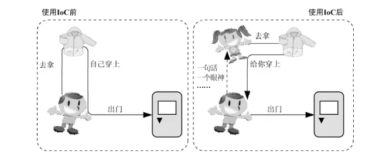
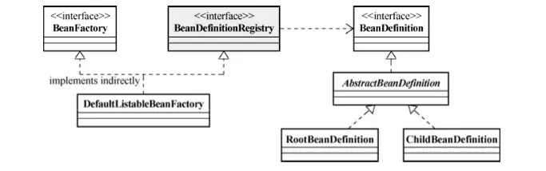
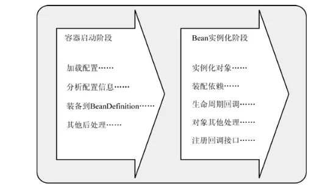
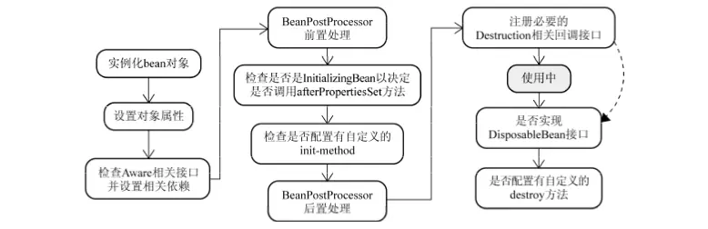
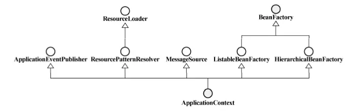
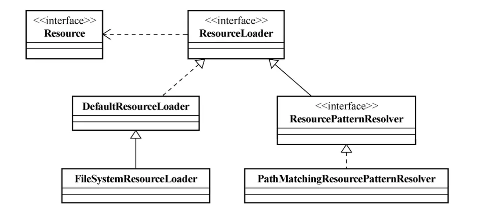
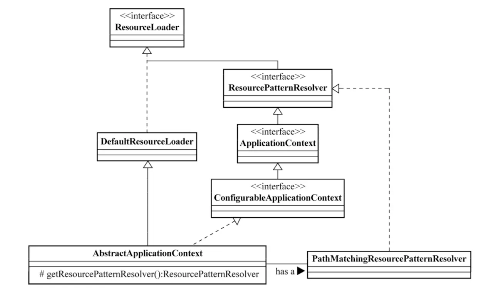

# 什么是IOC

## 提出问题

***IOC的理论背景***

我们知道在面向对象设计的软件系统中，它的底层都是由N个对象构成的，各个对象之间通过相互合作，最终实现系统地业务逻辑。


　　							图1 软件系统中耦合的对象

如果我们打开机械式手表的后盖，就会看到与上面类似的情形，各个齿轮分别带动时针、分针和秒针顺时针旋转，从而在表盘上产生正确的时间。图1中描述的就是这样的一个齿轮组，它拥有多个独立的齿轮，这些齿轮相互啮合在一起，协同工作，共同完成某项任务。我们可以看到，在这样的齿轮组中，如果有一个齿轮出了问题，就可能会影响到整个齿轮组的正常运转。

齿轮组中齿轮之间的啮合关系,与软件系统中对象之间的耦合关系非常相似。对象之间的耦合关系是无法避免的，也是必要的，这是协同工作的基础。现在，伴随着工业级应用的规模越来越庞大，对象之间的依赖关系也越来越复杂，经常会出现对象之间的多重依赖性关系，因此，架构师和设计师对于系统的分析和设计，将面临更大的挑战。对象之间耦合度过高的系统，必然会出现牵一发而动全身的情形。


　　									图2 对象之间的依赖关系

耦合关系不仅会出现在对象与对象之间，也会出现在软件系统的各模块之间，以及软件系统和硬件系统之间。如何降低系统之间、模块之间和对象之间的耦合度，是软件工程永远追求的目标之一。为了解决对象之间的耦合度过高的问题，软件专家Michael Mattson 1996年提出了IOC理论，用来实现对象之间的“解耦”，目前这个理论已经被成功地应用到实践当中。

## 为什么要用（作用）

IOC使得对象只需要发挥自己的特长即可

让你脱离对依赖对象的维护，只需要随用随取，不需要关心依赖对象的任何过程。（是不是感觉特别简单）



## 应用场景

## 基础概述

### 什么是IOC

IOC是Inversion of Control的缩写，多数书籍翻译成“控制反转”。

1996年，Michael Mattson在一篇有关探讨面向对象框架的文章中，首先提出了IOC 这个概念。对于面向对象设计及编程的基本思想，前面我们已经讲了很多了，不再赘述，简单来说就是把复杂系统分解成相互合作的对象，这些对象类通过封装以后，内部实现对外部是透明的，从而降低了解决问题的复杂度，而且可以灵活地被重用和扩展。

IOC理论提出的观点大体是这样的：借助于“第三方”实现具有依赖关系的对象之间的解耦。如下图：


​									图3 IOC解耦过程

大家看到了吧，由于引进了中间位置的“第三方”，也就是IOC容器，使得A、B、C、D这4个对象没有了耦合关系，齿轮之间的传动全部依靠“第三方”了，全部对象的控制权全部上缴给“第三方”IOC容器，所以，IOC容器成了整个系统的关键核心，它起到了一种类似“粘合剂”的作用，把系统中的所有对象粘合在一起发挥作用，如果没有这个“粘合剂”，对象与对象之间会彼此失去联系，这就是有人把IOC容器比喻成“粘合剂”的由来。

我们再来做个试验：把上图中间的IOC容器拿掉，然后再来看看这套系统：


​								图4 拿掉IOC容器后的系统

我们现在看到的画面，就是我们要实现整个系统所需要完成的全部内容。这时候，A、B、C、D这4个对象之间已经没有了耦合关系，彼此毫无联系，这样的话，当你在实现A的时候，根本无须再去考虑B、C和D了，对象之间的依赖关系已经降低到了最低程度。所以，如果真能实现IOC容器，对于系统开发而言，这将是一件多么美好的事情，参与开发的每一成员只要实现自己的类就可以了，跟别人没有任何关系！

我们再来看看，控制反转(IOC)到底为什么要起这么个名字？我们来对比一下：

软件系统在没有引入IOC容器之前，如图1所示，对象A依赖于对象B，那么对象A在初始化或者运行到某一点的时候，自己必须主动去创建对象B或者使用已经创建的对象B。无论是创建还是使用对象B，控制权都在自己手上。

软件系统在引入IOC容器之后，这种情形就完全改变了，如图3所示，由于IOC容器的加入，对象A与对象B之间失去了直接联系，所以，当对象A运行到需要对象B的时候，IOC容器会主动创建一个对象B注入到对象A需要的地方。

通过前后的对比，我们不难看出来：对象A获得依赖对象B的过程,由主动行为变为了被动行为，控制权颠倒过来了，这就是“控制反转”这个名称的由来。

#### Spring IOC

IOC为控制反转，把传统意义上由程序代码直接操控的对象的调用权交给容器，通过容器来实现对象组件的装配和管理。由容器动态地将某种依赖关系注入到组件中

#### 什么是IOC容器

Spring 框架的核心是 Spring 容器。容器创建对象，将它们装配在一起，配置它们并管理它们的完整生命周期。Spring 容器使用依赖注入来管理组成应用程序的组件。容器通过读取提供的配置元数据来接收对象进行实例化，配置和组装的指令。该元数据可以通过 XML，Java 注解或 Java 代码提供。

IOC容器支持加载服务时的饿汉式初始化和懒加载。

#### Spring实现

spring的IOC容器种类

- BeanFactory - BeanFactory 就像一个包含 bean 集合的工厂类。它会在客户端要求时实例化 bean。
- ApplicationContext - ApplicationContext 接口扩展了 BeanFactory 接口。它在 BeanFactory 基础上提供了一些额外的功能。

| BeanFactory                | ApplicationContext       |
| -------------------------- | ------------------------ |
| 它使用懒加载               | 它使用即时加载           |
| 它使用语法显式提供资源对象 | 它自己创建和管理资源对象 |
| 不支持国际化               | 支持国际化               |
| 不支持基于依赖的注解       | 支持基于依赖的注解       |

#### IOC也叫依赖注入(DI)

2004年，Martin Fowler探讨了同一个问题，既然IOC是控制反转，那么到底是“哪些方面的控制被反转了呢？”，经过详细地分析和论证后，他得出了答案：“获得依赖对象的过程被反转了”。控制被反转之后，获得依赖对象的过程由自身管理变为了由IOC容器主动注入。于是，他给“控制反转”取了一个更合适的名字叫做“依赖注入（Dependency Injection）”。他的这个答案，实际上给出了实现IOC的方法：注入。所谓依赖注入，就是由IOC容器在运行期间，动态地将某种依赖关系注入到对象之中。

所以，依赖注入(DI)和控制反转(IOC)是从不同的角度的描述的同一件事情，就是指通过引入IOC容器，利用依赖关系注入的方式，实现对象之间的解耦。

学过IOC的人可能都看过Martin Fowler(老马,2004年post)的这篇文章：Inversion of Control Containers and the Dependency Injection pattern[2]。

博客园的园友EagleFish(邢瑜琨)的文章： [深度理解依赖注入（Dependence Injection）](http://www.cnblogs.com/xingyukun/archive/2007/10/20/931331.html)[3]对老马那篇经典文章进行了解读。

CSDN黄忠成的[Inside ObjectBuilder](http://blog.csdn.net/Code6421/article/details/1282139)[4]也是，不过他应该来自台湾省，用的是繁体，看不管繁体中文的，可以看园中的吕震宇博友的简体中文版[[转\]Object Builder Application Block](http://www.cnblogs.com/zhenyulu/articles/641728.html)[5] 。

# 基础

## 优缺

***优点***

- 它将最小化应用程序中的代码量。
- 它将使您的应用程序易于测试，因为它不需要单元测试用例中的任何单例或 JNDI 查找机制。
- 它以最小的影响和最少的侵入机制促进松耦合。
- 它支持即时的实例化和延迟加载服务。

***缺点***

使用IOC框架产品能够给我们的开发过程带来很大的好处，但是也要充分认识引入IOC框架的缺点，做到心中有数，杜绝滥用框架[1]。

1. 软件系统中由于引入了第三方IOC容器，生成对象的步骤变得有些复杂，本来是两者之间的事情，又凭空多出一道手续，所以，我们在刚开始使用IOC框架的时候，会感觉系统变得不太直观。所以，引入了一个全新的框架，就会增加团队成员学习和认识的培训成本，并且在以后的运行维护中，还得让新加入者具备同样的知识体系。
2. 由于IOC容器生成对象是通过反射方式，在运行效率上有一定的损耗。如果你要追求运行效率的话，就必须对此进行权衡。
3. 具体到IOC框架产品(比如：Spring)来讲，需要进行大量的配制工作，比较繁琐，对于一些小的项目而言，客观上也可能加大一些工作成本。
4. IOC框架产品本身的成熟度需要进行评估，如果引入一个不成熟的IOC框架产品，那么会影响到整个项目，所以这也是一个隐性的风险。

我们大体可以得出这样的结论：

- 一些工作量不大的项目或者产品，不太适合使用IOC框架产品。
- 如果团队成员的知识能力欠缺，对于IOC框架产品缺乏深入的理解，也不要贸然引入。
- 最后，特别强调运行效率的项目或者产品，也不太适合引入IOC框架产品，像WEB2.0网站就是这种情况。

## 实现

**IOC的技术实现方式**

- 构造函数注入
- setter注入
- 接口注入

### 实现步骤

Spring 中的 IoC 的实现原理就是工厂模式加反射机制。

- 通过反射创造实例
- 获取需要注入的接口实现类并将其赋值给该接口

### 示例

```Java
interface Fruit {
     public abstract void eat();
}
class Apple implements Fruit {
    public void eat(){
        System.out.println("Apple");
    }
}
class Orange implements Fruit {
    public void eat(){
        System.out.println("Orange");
    }
}
class Factory {
    public static Fruit getInstance(String ClassName) {
        Fruit f=null;
        try {
            f=(Fruit)Class.forName(ClassName).newInstance();
        } catch (Exception e) {
            e.printStackTrace();
        }
        return f;
    }
}
class Client {
    public static void main(String[] a) {
        Fruit f=Factory.getInstance("io.github.dunwu.spring.Apple");
        if(f!=null){
            f.eat();
        }
    }
}
```


## 底层原理

Spring 中的 IOC的实现原理就是工厂模式加反射机制。

IOC中最基本的技术就是“**反射(Reflection)**”编程，目前.Net C#、Java和PHP5等语言均支持，其中PHP5的技术书籍中，有时候也被翻译成“映射”。有关反射的概念和用法，大家应该都很清楚，通俗来讲就是根据给出的类名（字符串方式）来动态地生成对象。这种编程方式可以让对象在生成时才决定到底是哪一种对象。反射的应用是很广泛的，很多的成熟的框架，比如象Java中的Hibernate、Spring框架，.Net中 NHibernate、Spring.Net框架都是把“反射”做为最基本的技术手段。

###  IOC容器的实现

需要实现的两个关键技术， 以明确服务的对象是谁、需要为服务对象提供什么样的服务

- 对象的构建
- 对象的绑定

实现方式

- 硬编码
- 配置文件
- 注解

#### ***BeanFactory***

如果没有特殊指定，默认采用**延迟初始化策略**(lazy-load)。只有当客户端对象需要访问容器中的某个受管对象的时候，才对该受管对象进行初始化以及依赖注入操作。所以，相对来说，容器启动初期速度较快，所需 要的资源有限。对于资源有限，并且功能要求不是很严格的场景，BeanFactory是比较合适的 IoC容器选择。

我们先来看一下BeanFactory类的关系图（如下所示）



- BeanDefinition 实现Bean的定义（即对象的定义）,且完成了对依赖的定义
- BeanDefinitionRegistry ，将定义好的bean，注册到容器中（此时会生成一个注册码）
- BeanFactory 是一个bean工厂类，从中可以取到任意定义过的bean

最重要的部分就是BeanDefinition,它完成了Bean的生成过程。一般情况下我们都是通过配置文件（xml,properties）的方式对bean进行配置，每种文件都需要实现BeanDefinitionReader，因此是reader本身现了配置文字 到bean对象的转换过程。当然我们自己也可以实现任意格式的配置文件，只需要自己来实现reader即可。

Bean的生成大致可以分为两个阶段：容器启动阶段和bean实例化阶段



**容器启动阶段：**

只完成bean的定义

- 加载配置文件（通常是xml文件）
- 通过reader生成beandefinition
- beanDefinition注册到beanDefinitionRegistry

**bean实例化阶段：**

完成bean的初始化

- 当某个bean 被 getBean()调用时
- bean需要完成初时化，以及其依赖对象的初始化
- 如果bean本身有回调，还需要调用其相应的回调函数

Spring Ioc在初始化完成之后，给了我们提供一些方法，让我们来改变一些bean的定义org.springframework.beans.factory.config.PropertyPlaceholderConfigurer：使我们可能通过配置文件的形式，配置一些参数

- PropertyOverrideConfigurer ：则可以覆盖原本的bean参数
- CustomEditorConfigurer ：则提供类型转换支持（配置文件都是string,它需要知道转换成何种类型）

**Bean的初始化过程：**



如果你认为实例化的对象就是通过我们定义的类new 出来的，那就大错特错了，其实这里用到了AOP机制，生成了其代理对象（**通过反射机制生成接口对象，或者是通过CGLIB生成子对象**）

- bean的具体装载过程是由beanWrapper实现的，它继承了PropertyAccessor （可以对属性进行访问）、PropertyEditorRegistry 和TypeConverter接口 （实现类型转换，就上前面说的）。
- 完成设置对象属性之后，则会检查是否实现了Aware类型的接口，如果实现了，则主动加载
- BeanPostprocessor 可以帮助完成在初始化bean之前或之后 帮我们完成一些必要工作，比如我们在连接数据库之前将密码存放在一个加密文件，当我们连接数据库之前，需要将密码进行加载解密。只要实现 相应的接口即可

```Java
public interface BeanPostProcessor {

   /**
    * Apply this BeanPostProcessor to the given new bean instance <i>before</i> any bean
    * initialization callbacks (like InitializingBean's {@code afterPropertiesSet}
    * or a custom init-method). The bean will already be populated with property values.
    * The returned bean instance may be a wrapper around the original.
    * @param bean the new bean instance
    * @param beanName the name of the bean
    * @return the bean instance to use, either the original or a wrapped one; if
    * {@code null}, no subsequent BeanPostProcessors will be invoked
    * @throws org.springframework.beans.BeansException in case of errors
    * @see org.springframework.beans.factory.InitializingBean#afterPropertiesSet
    */
   Object postProcessBeforeInitialization(Object bean, String beanName) throws BeansException;

   /**
    * Apply this BeanPostProcessor to the given new bean instance <i>after</i> any bean
    * initialization callbacks (like InitializingBean's {@code afterPropertiesSet}
    * or a custom init-method). The bean will already be populated with property values.
    * The returned bean instance may be a wrapper around the original.
    * <p>In case of a FactoryBean, this callback will be invoked for both the FactoryBean
    * instance and the objects created by the FactoryBean (as of Spring 2.0). The
    * post-processor can decide whether to apply to either the FactoryBean or created
    * objects or both through corresponding {@code bean instanceof FactoryBean} checks.
    * <p>This callback will also be invoked after a short-circuiting triggered by a
    * {@link InstantiationAwareBeanPostProcessor#postProcessBeforeInstantiation} method,
    * in contrast to all other BeanPostProcessor callbacks.
    * @param bean the new bean instance
    * @param beanName the name of the bean
    * @return the bean instance to use, either the original or a wrapped one; if
    * {@code null}, no subsequent BeanPostProcessors will be invoked
    * @throws org.springframework.beans.BeansException in case of errors
    * @see org.springframework.beans.factory.InitializingBean#afterPropertiesSet
    * @see org.springframework.beans.factory.FactoryBean
    */
   Object postProcessAfterInitialization(Object bean, String beanName) throws BeansException;

}
```

- 在完成postProcessor之后，则会看对象是否定义了InitializingBean 接口，如果是，则会调用其afterProper- tiesSet()方法进一步调整对象实例的状态 ，这种方式并不常见。spring还提供了另外一种指定初始化的方式，即在bean定义中指定init-method 。
- 当这一切完成之后，还可以指定对象销毁 的一些回调，比如数据库的连接池的配置，则销毁前需要关闭连接等。相应的可以实现DisposableBean 接口或指定destroy-method

#### ***ApplicationContext***

ApplicationContext 容器建立BeanFactory之上，拥有BeanFactory的所有功能，但在实现上会有所差别。

我认为**差别**主要体现在两个方面：

- bean的生成方式；
- 扩展了BeanFactory的功能，提供了更多企业级功能的支持。
- ApplicationContext采用的非懒加载方式。它会在启动阶段完成所有的初始化，并不会等到getBean()才执行
  - 所以，相对于BeanFactory来 说，ApplicationContext要求更多的系统资源，同时，因为在启动时就完成所有初始化，容 器启动时间较之BeanFactory也会长一些。在那些系统资源充足，并且要求更多功能的场景中， ApplicationContext类型的容器是比较合适的选择。

***bean的加载方式***

BeanFactory提供BeanReader来从配置文件中读取bean配置。相应的ApplicationContext也提供几个读取配置文件的方式：

- FileSystemXmlApplicationContext：该容器从 XML 文件中加载已被定义的 bean。在这里，你需要提供给构造器 XML 文件的完整路径

- ClassPathXmlApplicationContext：该容器从 XML 文件中加载已被定义的 bean。在这里，你不需要提供 XML 文件的完整路径，只需正确配置 CLASSPATH 环境变量即可，因为，容器会从 CLASSPATH 中搜索 bean 配置文件。

- WebXmlApplicationContext：该容器会在一个 web 应用程序的范围内加载在 XML 文件中已被定义的 bean。

- AnnotationConfigApplicationContext

- ConfigurableWebApplicationContext

  

  ApplicationContext 还额外增加了三个历能：

- ApplicationEventPublisher
- ResourceLoader
- MessageResource

### ***ResourceLoader***

ResourceLoader并不能将其看成是Spring独有的功能，spring Ioc只是借助于ResourceLoader来实现资源加载。也提供了各种各样的资源加载方式：

- DefaultResourceLoader 首先检查资源路径是否以classpath:前缀打头，如果是，则尝试构造ClassPathResource类 型资源并返回。否则， 尝试通过URL，根据资源路径来定位资源 

- FileSystemResourceLoader 它继承自Default-ResourceLoader，但覆写了getResourceByPath(String)方法，使之从文件系统加载资源并以 FileSystemResource类型返回 

  - ResourcePatternResolver  批量查找的ResourceLoader

    

    spring与ResourceLoader之间的关系

    

    所有ApplicationContext的具体实现类都会直接或者间接地实现AbstractApplicationContext,AbstactApplicationContext 依赖了了DeffaultResourceLoader, ApplicationContext 继承了ResourcePatternResolver,所到头来ApplicationContext的具体实现类都会具有DefaultResourceLoader 和 PathMatchingResourcePatterResolver的功能。这也就是会什么ApplicationContext可以实现统一资源定位。

***ApplicationEventPublisher（在介绍spring事件的时候再详细讲）***

1. ApplicationEvent：继承自EventObject，同时是spring的application中事件的父类，需要被自定义的事件继承。 
2. ApplicationListener：继承自EventListener，spring的application中的监听器必须实现的接口，需要被自定义的监听器实现其onApplicationEvent方法 
3. ApplicationEventPublisherAware：在spring的context中希望能发布事件的类必须实现的接口，该接口中定义了设置ApplicationEventPublisher的方法，由ApplicationContext调用并设置。在自己实现的ApplicationEventPublisherAware子类中，需要有ApplicationEventPublisher属性的定义。 
4. ApplicationEventPublisher：spring的事件发布者接口，定义了发布事件的接口方法publishEvent。因为ApplicationContext实现了该接口，因此spring的ApplicationContext实例具有发布事件的功能(publishEvent方法在AbstractApplicationContext中有实现)。在使用的时候，只需要把ApplicationEventPublisher的引用定义到ApplicationEventPublisherAware的实现中，spring容器会完成对ApplicationEventPublisher的注入。

***MessageSource***

提供国际化支持，不讲了，有需要请转至：[blog.sina.com.cn/s/blog_85d7…](https://link.juejin.im?target=http%3A%2F%2Fblog.sina.com.cn%2Fs%2Fblog_85d71fb70101cyp5.html)

\# 四、最佳实践
注解扫描

```xml
<beans xmlns="http://www.springframework.org/schema/beans"
xmlns:xsi="http://www.w3.org/2001/XMLSchema-instance"
xmlns:context="http://www.springframework.org/schema/context"
xsi:schemaLocation="http://www.springframework.org/schema/beans
http://www.springframework.org/schema/beans/spring-beans-2.5.xsd
http://www.springframework.org/schema/context
http://www.springframework.org/schema/context/spring-context-2.5.xsd">
<context:component-scan base-package="org.spring21"/>


</beans>
```

component/service/controller注解

```java
@Component
public class Person {
    @Resource
    private Food food;

    public void setFood(Food food) {
        this.food = food;
    }
}
```

bean的前置后置

```java
@Component
public class Person {
    @Resource
    private Food food;

    public setFood(Food food) {
        this.food = food;
    }

    @PostConstruct
    public void wash() {
        System.out.println("饭前洗手");
    }

    @PreDestroy
    public void brush() {
        System.out.println("饭后刷牙");
    }
}
```

#### IOC容器的初始化过程

Resource 定位：我们一般使用外部资源来描述 Bean 对象，所以 IOC 容器第一步就是需要定位 Resource 外部资源 。Resource 的定位其实就是 BeanDefinition 的资源定位，它是由 ResourceLoader 通过统一的 Resource 接口来完成的，这个 Resource 对各种形式的 BeanDefinition 的使用都提供了统一接口 。

载入：第二个过程就是 BeanDefinition 的载入 ,BeanDefinitionReader 读取 , 解析 Resource 定位的资源，也就是将用户定义好的 Bean 表示成 IOC 容器的内部数据结构也就是 BeanDefinition, 在 IOC 容器内部维护着一个 BeanDefinition Map 的数据结构，通过这样的数据结构， IOC 容器能够对 Bean 进行更好的管理 。 在配置文件中每一个都对应着一个 BeanDefinition 对象 。

注册：第三个过程则是注册，即向 IOC 容器注册这些 BeanDefinition ，这个过程是通过 BeanDefinitionRegistery 接口来实现的 。

### 设计思想

## 进阶

### 深度理解依赖注入（Dependence Injection）

#### 依赖在哪里

  老马举了一个小例子，是开发一个电影列举器（MovieList），这个电影列举器需要使用一个电影查找器（MovieFinder）提供的服务，伪码如下：

```Java
/*服务的接口*/
public interface MovieFinder {
  ArrayList findAll();
}

/*服务的消费者*/
class MovieLister
{
   public Movie[] moviesDirectedBy(String arg) {
      List allMovies = finder.findAll();
    for (Iterator it = allMovies.iterator(); it.hasNext();) {
         Movie movie = (Movie) it.next();
         if (!movie.getDirector().equals(arg)) it.remove();
       }
        return (Movie[]) allMovies.toArray(new Movie[allMovies.size()]);
    }


/*消费者内部包含一个将指向具体服务类型的实体对象*/


   private MovieFinder finder;
    /*消费者需要在某一个时刻去实例化具体的服务。这是我们要解耦的关键所在，
    *因为这样的处理方式造成了服务消费者和服务提供者的强耦合关系（这种耦合是在编译期就确定下来的）。
     **/
    public MovieLister() {
        finder = new ColonDelimitedMovieFinder("movies1.txt");
   }
}
```

从上面代码的注释中可以看到，MovieLister和ColonDelimitedMovieFinder（这可以使任意一个实现了MovieFinder接口的类型）之间存在强耦合关系，如下图所示：


这使得MovieList很难作为一个成熟的组件去发布，因为在不同的应用环境中（包括同一套软件系统被不同用户使用的时候），它所要依赖的电影查找器可能是千差万别的。所以，为了能实现真正的基于组件的开发，必须有一种机制能同时满足下面两个要求：

 （1）解除MovieList对具体MoveFinder类型的强依赖（编译期依赖）。

 （2）在运行的时候为MovieList提供正确的MovieFinder类型的实例。

换句话说，就是在运行的时候才产生MovieList和MovieFinder之间的依赖关系（把这种依赖关系在一个合适的时候“注入”运行时），这恐怕就是Dependency Injection这个术语的由来。再换句话说，我们提到过解除强依赖，这并不是说MovieList和MovieFinder之间的依赖关系不存在了，事实上MovieList无论如何也需要某类MovieFinder提供的服务，我们只是把这种依赖的建立时间推后了，从编译器推迟到运行时了。

依赖关系在OO程序中是广泛存在的，只要A类型中用到了B类型实例，A就依赖于B。前面笔者谈到的内容是把概念抽象到了服务使用者和服务提供者的角度，这也符合现在SOA的设计思路。从另一种抽象方式上来看，可以把MovieList看成我们要构建的主系统，而MovieFinder是系统中的plugin，主系统并不强依赖于任何一个插件，但一旦插件被加载，主系统就应该可以准确调用适当插件的功能。

其实不管是面向服务的编程模式，还是基于插件的框架式编程，为了实现松耦合（服务调用者和提供者之间的or框架和插件之间的），都需要在必要的位置实现面向接口编程，在此基础之上，还应该有一种方便的机制实现具体类型之间的运行时绑定，这就是DI所要解决的问题。

#### DI的实现方式

和上面的图1对应的是，如果我们的系统实现了依赖注入，组件间的依赖关系就变成了图2：


说白了，就是要提供一个容器，由容器来完成（1）具体ServiceProvider的创建（2）ServiceUser和ServiceProvider的运行时绑定。下面我们就依次来看一下三种典型的依赖注入方式的实现。特别要说明的是，要理解依赖注入的机制，关键是理解容器的实现方式。本文后面给出的容器参考实现，均为黄忠成老师的代码，笔者仅在其中加上了一些关键注释而已。

***Constructor Injection（构造器注入）***

 我们可以看到，在整个依赖注入的数据结构中，涉及到的重要的类型就是ServiceUser, ServiceProvider和Assembler三者，而这里所说的构造器，指的是ServiceUser的构造器。也就是说，在构造ServiceUser实例的时候，才把真正的ServiceProvider传给他：

```Java
class MovieLister
{
  	//其他内容，省略
   	public MovieLister(MovieFinder finder)
   	{
       this.finder = finder;
  	}
}
```

接下来我们看看Assembler应该如何构建：

```Java
private MutablePicoContainer configureContainer() {
  	MutablePicoContainer pico = new DefaultPicoContainer();


//下面就是把ServiceProvider和ServiceUser都放入容器的过程，以后就由容器来提供ServiceUser的已完成依赖注入实例，
//其中用到的实例参数和类型参数一般是从配置档中读取的，这里是个简单的写法。
//所有的依赖注入方法都会有类似的容器初始化过程，本文在后面的小节中就不再重复这一段代码了。


   	Parameter[] finderParams =  {new ConstantParameter("movies1.txt")};
    pico.registerComponentImplementation(MovieFinder.class, ColonMovieFinder.class, finderParams);
  	pico.registerComponentImplementation(MovieLister.class);
    //至此，容器里面装入了两个类型，其中没给出构造参数的那一个（MovieLister）将依靠其在构造器中定义的传入参数类型，在容器中
    //进行查找，找到一个类型匹配项即可进行构造初始化。
   	return pico;
}
```

需要在强调一下的是，依赖并未消失，只是延后到了容器被构建的时刻。所以正如图2中您已经看到的，容器本身（更准确的说，是一个容器运行实例的构建过程）对ServiceUser和ServiceProvoder都是存在依赖关系的。所以，在这样的体系结构里，ServiceUser、ServiceProvider和容器都是稳定的，互相之间也没有任何依赖关系；所有的依赖关系、所有的变化都被封装进了容器实例的创建过程里，符合我们对服务应用的理解。而且，在实际开发中我们一般会采用配置文件来辅助容器实例的创建，将这种变化性排斥到编译期之外。

即使还没给出后面的代码，你也一定猜得到，这个container类一定有一个GetInstance(Type t)这样的方法，这个方法会为我们返回一个已经注入完毕的MovieLister。 一个简单的应用如下：

```Java
public void testWithPico() 
{
   	MutablePicoContainer pico = configureContainer();
   	MovieLister lister = (MovieLister) pico.getComponentInstance(MovieLister.class);
   	Movie[] movies = lister.moviesDirectedBy("Sergio Leone");
    assertEquals("Once Upon a Time in the West", movies[0].getTitle());
}
```

上面最关键的就是对pico.getComponentInstance的调用。Assembler会在这个时候调用MovieLister的构造器，构造器的参数就是当时通过pico.registerComponentImplementation(MovieFinder.class, ColonMovieFinder.class, finderParams)设置进去的实际的ServiceProvider--ColonMovieFinder。下面请看这个容器的参考代码：

***Setter Injection（设值注入）***

这种注入方式和构造注入实在很类似，唯一的区别就是前者在构造函数的调用过程中进行注入，而它是通过给属性赋值来进行注入。无怪乎PicoContainer和Spring都是同时支持这两种注入方式。Spring对通过XML进行配置有比较好的支持，也使得Spring中更常使用设值注入的方式：

```Java
 <beans>
     <bean id="MovieLister" class="spring.MovieLister">
         <property name="finder">
             <ref local="MovieFinder"/>
         </property>
     </bean>
     <bean id="MovieFinder" class="spring.ColonMovieFinder">
         <property name="filename">
             <value>movies1.txt</value>
        </property>
    </bean>
</beans>
```

下面也给出支持设值注入的容器参考实现，大家可以和构造器注入的容器对照起来看，里面的差别很小，主要的差别就在于，在获取对象实例（GetInstance）的时候，前者是通过反射得到待创建类型的构造器信息，然后根据构造器传入参数的类型在容器中进行查找，并构造出合适的实例；而后者是通过反射得到待创建类型的所有属性，然后根据属性的类型在容器中查找相应类型的实例。

***Interface Injection (接口注入)***

   这是笔者认为最不够优雅的一种依赖注入方式。要实现接口注入，首先ServiceProvider要给出一个接口定义：

```Java
public interface InjectFinder {
    void injectFinder(MovieFinder finder);
}
```

接下来，ServiceUser必须实现这个接口：

```Java
class MovieLister: InjectFinder
{
        public void injectFinder(MovieFinder finder) {
            this.finder = finder;
        }
}
```

容器所要做的，就是根据接口定义调用其中的inject方法完成注入过程，这里就不在赘述了，总的原理和上面两种依赖注入模式没有太多区别。

#### 除了DI，还有Service Locator

上面提到的依赖注入只是消除ServiceUser和ServiceProvider之间的依赖关系的一种方法，还有另一种方法：服务定位器（Service Locator）。也就是说，由ServiceLocator来专门负责提供具体的ServiceProvider。当然，这样的话ServiceUser不仅要依赖于服务的接口，还依赖于ServiceContract。仍然是最早提到过的电影列举器的例子，如果使用Service Locator来解除依赖的话，整个依赖关系应当如下图所示：


用起来也很简单，在一个适当的位置（比如在一组相关服务即将被调用之前）对ServiceLocator进行初始化，用到的时候就直接用ServiceLocator返回ServiceProvider实例：

```Java
//服务定位器的初始化
ServiceLocator locator = new ServiceLocator();
locator.loadService("MovieFinder", new ColonMovieFinder("movies1.txt"));
ServiceLocator.load(locator);

//服务定义器的使用
//其实这个使用方式体现了服务定位器和依赖注入模式的最大差别：ServiceUser需要显示的调用ServiceLocator，从而获取自己需要的服务对象；
//而依赖注入则是隐式的由容器完成了这一切。
MovieFinder finder = (MovieFinder) ServiceLocator.getService("MovieFinder");
```

正因为上面提到过的ServiceUser对ServiceLocator的依赖性，从提高模块的独立性（比如说，你可能把你构造的ServiceUser或者ServiceProvider给第三方使用）上来说，依赖注入可能更好一些，这恐怕也是为什么大多数的IOC框架都选用了DI的原因。ServiceLocator最大的优点可能在于实现起来非常简单，如果您开发的应用没有复杂到需要采用一个IOC框架的程度，也许您可以试着采用它。

**3.广义的服务**
文中很多地方提到服务使用者（ServiceUser）和服务提供者（ServiceProvider）的概念，这里的“服务”是一种非常广义的概念，在语法层面就是指最普通的依赖关系（类型A中有一个B类型的变量，则A依赖于B）。如果您把服务理解为WCF或者Web Service中的那种服务概念，您会发现上面所说的所有技术手段都是没有意义的。以WCF而论，其客户端和服务器端本就是依赖于Contract的松耦合关系，其实这也从另一个角度说明了SOA应用的优势所在。

## 反省总结

# 参考 #

1. [深度理解依赖注入（Dependence Injection）](https://www.cnblogs.com/xingyukun/archive/2007/10/20/931331.html)
2. [浅谈IOC--说清楚IOC是什么](https://www.cnblogs.com/DebugLZQ/archive/2013/06/05/3107957.html)
3. [JAVA关于Spring 面试题汇总](<https://www.imooc.com/article/256370>)
4. [IoC-spring 的灵魂(带你轻松理解IOC思想及bean对象的生成过程)](<https://juejin.im/post/593386ca2f301e00584f8036#heading-4>)
