# 解决的问题

- shiro的介绍
- shiro的权限验证和角色管理
- 如何在jsp中集成shiro

# 关于 Apache Shiro

## 目的

- 想做一个对用户的登录进行权限的管理，保证安全性

## Shiro基础知识

Shiro需要的基础知识：权限管理

### 什么是权限管理？

**只要有用户参与的系统一般都要有权限管理**，权限管理实现对用户访问系统的控制，按照安全规则或者安全策略**控制用户可以访问而且只能访问自己被授权的资源**。

对权限的管理又分为两大类别：

- **用户认证**
- **用户授权**

#### 用户认证

用户认证，**用户去访问系统，系统要验证用户身份的合法性**

最常用的用户身份验证的方法：1、用户名密码方式、2、指纹打卡机、3、基于证书验证方法。。**系统验证用户身份合法，用户方可访问系统的资源。**

举个例子：

- 当我们输入了自己的淘宝的账户和密码，才能打开购物车

用户认证的流程：

- **判断该资源能否不认证就能访问【登陆页面、首页】**
- **如果该资源需要认证后才能访问，那么判断该访问者是否认证了**
- **如果还没有认证，那么需要返回到【登陆页面】进行认证**
- **认证通过后才能访问资源**

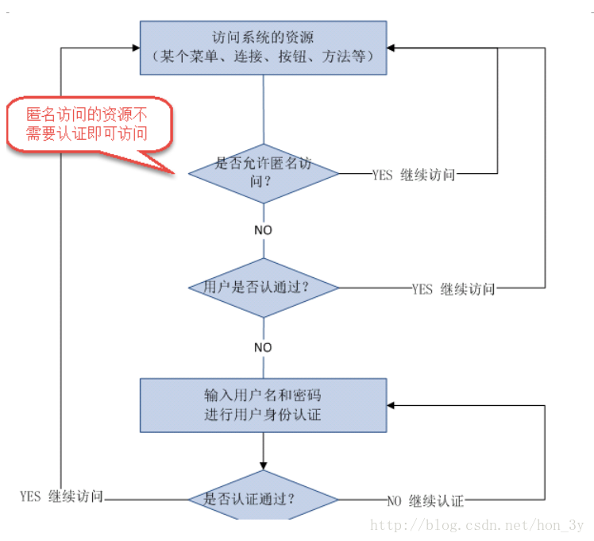

从用户认证我们可以抽取出这么几个概念

- subject主体：**理解为用户,可能是程序，都要去访问系统的资源，系统需要对subject进行身份认证**
- principal身份信息：**通常是唯一的，一个主体还有多个身份信息**，但是都有一个主身份信息（primary principal）【我们可以选择身份证认证、学生证认证等等都是我们的身份信息】
- credential凭证信息：**可以是密码 、证书、指纹。**

总结：**主体在进行身份认证时需要提供身份信息和凭证信息。**

#### 用户授权

用户授权，**简单理解为访问控制**，在用户认证通过后，**系统对用户访问资源进行控制，用户具有资源的访问权限方可访问**。

用户授权的流程

- 到达了用户授权环节，当然是需要用户认证之后了
- **用户访问资源，系统判断该用户是否有权限去操作该资源**
- **如果该用户有权限才能够访问，如果没有权限就不能访问了**

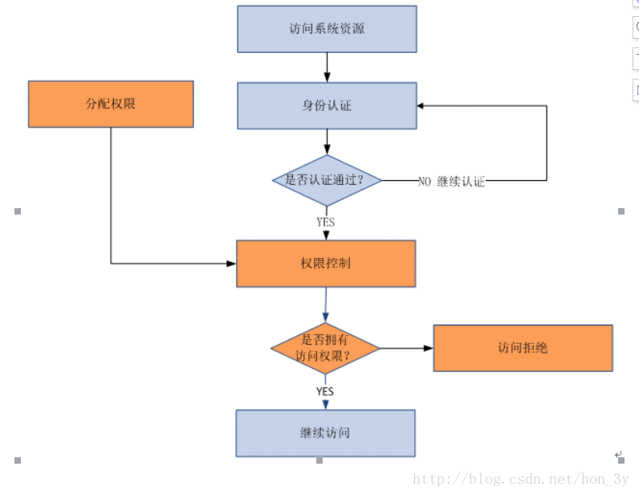

授权的过程可以简单理解为：**主体认证之后，系统进行访问控制**

subject必须具备资源的访问权限才可访问该资源..

权限/许可(permission) ：**针对资源的权限或许可，subject具有permission访问资源，如何访问/操作需要定义permission**，权限比如：用户添加、用户修改、商品删除

资源可以分为两种

- 资源类型:**系统的用户信息就是资源类型，相当于java类。**
- 资源实例:**系统中id为001的用户就是资源实例，相当于new的java对象。**

### 权限管理模型

一般地，我们可以抽取出这么几个模型：

- 主体（账号、密码）
- 资源（资源名称、访问地址）
- 权限（权限名称、资源id）
- 角色（角色名称）
- 角色和权限关系（角色id、权限id）
- 主体和角色关系（主体id、角色id）

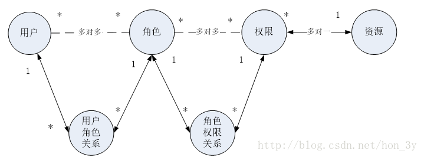

通常企业开发中将资源和权限表合并为一张权限表，如下：

- 资源（资源名称、访问地址）
- 权限（权限名称、资源id）

合并为：

- **权限（权限名称、资源名称、资源访问地址）**

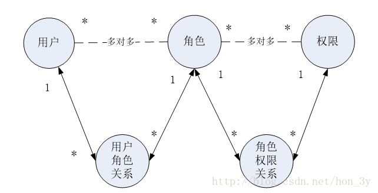

### 分配权限

**用户需要分配相应的权限才可访问相应的资源。权限是对于资源的操作许可。**

通常给**用户分配资源权限需要将权限信息持久化，比如存储在关系数据库中**。把用户信息、权限管理、用户分配的权限信息写到数据库（权限数据模型）

#### 基于角色访问控制

**RBAC(role based access control)，基于角色的访问控制。**

```Java
//如果该user是部门经理则可以访问if中的代码
if(user.hasRole('部门经理')){
    //系统资源内容
    //用户报表查看
}
```

角色针对人划分的，**人作为用户在系统中属于活动内容，如果该 角色可以访问的资源出现变更，需要修改你的代码了**，

```Java
if(user.hasRole('部门经理') || user.hasRole('总经理')  ){
    //系统资源内容
    //用户报表查看
}
```

**基于角色的访问控制是不利于系统维护(可扩展性不强)。**

#### 基于资源的访问控制

**RBAC(Resource based access control)，基于资源的访问控制。**

资源在系统中是不变的，比如资源有：**类中的方法，页面中的按钮。**

```
对资源的访问需要具有permission权限，代码可以写为：

if(user.hasPermission ('用户报表查看（权限标识符）')){
    //系统资源内容
    //用户报表查看
}
```

**建议使用基于资源的访问控制实现权限管理**。

# 粗粒度和细粒度权限

细粒度权限管理：对资源实例的权限管理。资源实例就资源类型的具体化，比如：用户id为001的修改连接，1110班的用户信息、行政部的员工。**细粒度权限管理就是数据级别的权限管理。**

粗粒度权限管理比如：超级管理员可以访问户添加页面、用户信息等全部页面。部门管理员可以访问用户信息页面包括 页面中所有按钮。

**粗粒度和细粒度例子**：

```
系统有一个用户列表查询页面，对用户列表查询分权限，

如果粗颗粒管理，张三和李四都有用户列表查询的权限，张三和李四都可以访问用户列表查询。

进一步进行细颗粒管理，张三（行政部）和李四(开发部)只可以查询自己本部门的用户信息。

张三只能查看行政部 的用户信息，李四只能查看开发部门的用户信息。

细粒度权限管理就是数据级别的权限管理。
```

## 如何实现粗粒度权限管理？

粗粒度权限管理比较容易**将权限管理的代码抽取出来在系统架构级别统一处理**。比如：通过**springmvc的拦截器实现授权**。

对细粒度权限管理在**数据级别是没有共性可言**，针对细粒度权限管理就是**系统业务逻辑的一部分**，**在业务层去处理相对比较简单**

比如：**部门经理只查询本部门员工信息，在service接口提供一个部门id的参数，controller中根据当前用户的信息得到该 用户属于哪个部门，调用service时将部门id传入service，实现该用户只查询本部门的员工。**

### 基于URL拦截

基于url拦截的方式实现在实际开发中比较常用的一种方式。

**对于web系统，通过filter过虑器实现url拦截，也可以springmvc的拦截器实现基于url的拦截。**

### 使用权限管理框架实现

对于粗粒度权限管理，建议使用优秀权限管理框架来实现，节省开发成功，提高开发效率。

**shiro就是一个优秀权限管理框架。**

# 回顾URL拦截

我们在学习的路途上也是使用过几次URL对权限进行拦截的

当时我们做了权限的增删该查的管理系统，**但是在权限表中是没有把资源添加进去，我们使用的是Map集合来进行替代的**。
<http://blog.csdn.net/hon_3y/article/details/61926175>

随后，我们学习了动态代理和注解，我们也做了一个基于注解的拦截

- **在Controller得到service对象的时候，service工厂返回的是一个动态代理对象回去**
- **Controller拿着代理对象去调用方法，代理对象就会去解析该方法上是否有注解**
- **如果有注解，那么就需要我们进行判断该主体是否认证了，如果认证了就判断该主体是否有权限**
- **当我们解析出该主体的权限和我们注解的权限是一致的时候，才放行！**

<http://blog.csdn.net/hon_3y/article/details/70767050>

流程:

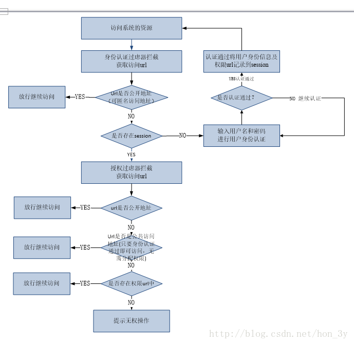

## 认证的JavaBean

我们之前认证都是放在默认的Javabean对象上的，现在既然我们准备学Shiro了，我们就得专业一点，弄一个**专门存储认证信息的JavaBean**

```java
/**
 * 用户身份信息，存入session 由于tomcat将session会序列化在本地硬盘上，所以使用Serializable接口
 * 
 * @author Thinkpad
 * 
 */
public class ActiveUser implements java.io.Serializable {
    private String userid;//用户id（主键）
    private String usercode;// 用户账号
    private String username;// 用户名称

    private List<SysPermission> menus;// 菜单
    private List<SysPermission> permissions;// 权限

    public String getUsername() {
        return username;
    }

    public void setUsername(String username) {
        this.username = username;
    }


    public String getUsercode() {
        return usercode;
    }

    public void setUsercode(String usercode) {
        this.usercode = usercode;
    }

    public String getUserid() {
        return userid;
    }

    public void setUserid(String userid) {
        this.userid = userid;
    }

    public List<SysPermission> getMenus() {
        return menus;
    }

    public void setMenus(List<SysPermission> menus) {
        this.menus = menus;
    }

    public List<SysPermission> getPermissions() {
        return permissions;
    }

    public void setPermissions(List<SysPermission> permissions) {
        this.permissions = permissions;
    }

    
}
```

认证的服务

```java
    @Override
    public ActiveUser authenticat(String userCode, String password)
            throws Exception {
        /**
    	认证过程：
    	根据用户身份（账号）查询数据库，如果查询不到用户不存在
    	对输入的密码 和数据库密码 进行比对，如果一致，认证通过
         */
        //根据用户账号查询数据库
        SysUser sysUser = this.findSysUserByUserCode(userCode);
        
        if(sysUser == null){
            //抛出异常
            throw new CustomException("用户账号不存在");
        }
        
        //数据库密码 (md5密码 )
        String password_db = sysUser.getPassword();
        
        //对输入的密码 和数据库密码 进行比对，如果一致，认证通过
        //对页面输入的密码 进行md5加密 
        String password_input_md5 = new MD5().getMD5ofStr(password);
        if(!password_input_md5.equalsIgnoreCase(password_db)){
            //抛出异常
            throw new CustomException("用户名或密码 错误");
        }
        //得到用户id
        String userid = sysUser.getId();
        //根据用户id查询菜单 
        List<SysPermission> menus =this.findMenuListByUserId(userid);
        
        //根据用户id查询权限url
        List<SysPermission> permissions = this.findPermissionListByUserId(userid);
        
        //认证通过，返回用户身份信息
        ActiveUser activeUser = new ActiveUser();
        activeUser.setUserid(sysUser.getId());
        activeUser.setUsercode(userCode);
        activeUser.setUsername(sysUser.getUsername());//用户名称
        
        //放入权限范围的菜单和url
        activeUser.setMenus(menus);
        activeUser.setPermissions(permissions);
        
        return activeUser;
    }
```

Controller处理认证，**如果身份认证成功，那么把认证信息存储在Session中**

```java
    @RequestMapping("/login")
    public String login(HttpSession session, String randomcode,String usercode,String password)throws Exception{
        //校验验证码，防止恶性攻击
        //从session获取正确验证码
        String validateCode = (String) session.getAttribute("validateCode");
        
        //输入的验证和session中的验证进行对比 
        if(!randomcode.equals(validateCode)){
            //抛出异常
            throw new CustomException("验证码输入错误");
        }
        
        //调用service校验用户账号和密码的正确性
        ActiveUser activeUser = sysService.authenticat(usercode, password);
        
        //如果service校验通过，将用户身份记录到session
        session.setAttribute("activeUser", activeUser);
        //重定向到商品查询页面
        return "redirect:/first.action";
    }
    
```

身份认证拦截器

```java
    //在执行handler之前来执行的
    //用于用户认证校验、用户权限校验
    @Override
    public boolean preHandle(HttpServletRequest request,
            HttpServletResponse response, Object handler) throws Exception {
        
        //得到请求的url
        String url = request.getRequestURI();
        //判断是否是公开 地址
        //实际开发中需要公开 地址配置在配置文件中
        //从配置中取逆名访问url
        List<String> open_urls = ResourcesUtil.gekeyList("anonymousURL");
        //遍历公开 地址，如果是公开 地址则放行
        for(String open_url:open_urls){
            if(url.indexOf(open_url)>=0){
                //如果是公开 地址则放行
                return true;
            }
        }
        //判断用户身份在session中是否存在
        HttpSession session = request.getSession();
        ActiveUser activeUser = (ActiveUser) session.getAttribute("activeUser");
        //如果用户身份在session中存在放行
        if(activeUser!=null){
            return true;
        }
        //执行到这里拦截，跳转到登陆页面，用户进行身份认证
        request.getRequestDispatcher("/WEB-INF/jsp/login.jsp").forward(request, response);
        
        //如果返回false表示拦截不继续执行handler，如果返回true表示放行
        return false;
    }
```

授权拦截器

```java
    //在执行handler之前来执行的
    //用于用户认证校验、用户权限校验
    @Override
    public boolean preHandle(HttpServletRequest request,
            HttpServletResponse response, Object handler) throws Exception {
        
        //得到请求的url
        String url = request.getRequestURI();
        //判断是否是公开 地址
        //实际开发中需要公开 地址配置在配置文件中
        //从配置中取逆名访问url
        
        List<String> open_urls = ResourcesUtil.gekeyList("anonymousURL");
        //遍历公开 地址，如果是公开 地址则放行
        for(String open_url:open_urls){
            if(url.indexOf(open_url)>=0){
                //如果是公开 地址则放行
                return true;
            }
        }
        //从配置文件中获取公共访问地址
        List<String> common_urls = ResourcesUtil.gekeyList("commonURL");
        //遍历公用 地址，如果是公用 地址则放行
        for(String common_url:common_urls){
            if(url.indexOf(common_url)>=0){
                //如果是公开 地址则放行
                return true;
            }
        }
        //获取session
        HttpSession session = request.getSession();
        ActiveUser activeUser = (ActiveUser) session.getAttribute("activeUser");
        //从session中取权限范围的url
        List<SysPermission> permissions = activeUser.getPermissions();
        for(SysPermission sysPermission:permissions){
            //权限的url
            String permission_url = sysPermission.getUrl();
            if(url.indexOf(permission_url)>=0){
                //如果是权限的url 地址则放行
                return true;
            }
        }
        
        //执行到这里拦截，跳转到无权访问的提示页面
        request.getRequestDispatcher("/WEB-INF/jsp/refuse.jsp").forward(request, response);
        
        //如果返回false表示拦截不继续执行handler，如果返回true表示放行
        return false;
    }
```

拦截器配置：

```java
    <!--拦截器 -->
    <mvc:interceptors>

        <mvc:interceptor>
            <!-- 用户认证拦截 -->
            <mvc:mapping path="/**" />
            <bean class="cn.itcast.ssm.controller.interceptor.LoginInterceptor"></bean>
        </mvc:interceptor>
        <mvc:interceptor>
            <!-- 授权拦截 -->
            <mvc:mapping path="/**" />
            <bean class="cn.itcast.ssm.controller.interceptor.PermissionInterceptor"></bean>
        </mvc:interceptor>
    </mvc:interceptors>
```

# 什么是Shiro

shiro是apache的一个开源框架，**是一个权限管理的框架，实现 用户认证、用户授权**。

spring中有spring security (原名Acegi)，是一个权限框架，它和spring依赖过于紧密，没有shiro使用简单。
shiro不依赖于spring，shiro不仅可以实现 web应用的权限管理，还可以实现c/s系统，分布式系统权限管理，**shiro属于轻量框架，越来越多企业项目开始使用shiro。**

Shiro架构：

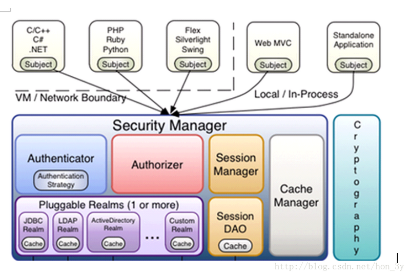

- subject：主体，可以是用户也可以是程序，主体要访问系统，系统需要对主体进行认证、授权。
- securityManager：安全管理器，主体进行认证和授权都 是通过securityManager进行。
- authenticator：认证器，主体进行认证最终通过authenticator进行的。
- authorizer：授权器，主体进行授权最终通过authorizer进行的。
- sessionManager：web应用中一般是用web容器对session进行管理，shiro也提供一套session管理的方式。
- SessionDao： 通过SessionDao管理session数据，针对个性化的session数据存储需要使用sessionDao。
- cache Manager：缓存管理器，主要对session和授权数据进行缓存，比如将授权数据通过cacheManager进行缓存管理，和ehcache整合对缓存数据进行管理。
- realm：域，领域，相当于数据源，**通过realm存取认证、授权相关数据。**

**cryptography：密码管理，提供了一套加密/解密的组件，方便开发。比如提供常用的散列、加/解密等功能。**

- 比如md5散列算法。

# 为什么使用Shiro

我们在使用URL拦截的时候，**要将所有的URL都配置起来，繁琐、不易维护**

而我们的Shiro实现**系统的权限管理，有效提高开发效率，从而降低开发成本。**

# Shiro认证

## 导入jar包

我们使用的是Maven的坐标就行了

```java
    <dependency>
            <groupId>org.apache.shiro</groupId>
            <artifactId>shiro-core</artifactId>
            <version>1.2.3</version>
        </dependency>
        <dependency>
            <groupId>org.apache.shiro</groupId>
            <artifactId>shiro-web</artifactId>
            <version>1.2.3</version>
        </dependency>
        <dependency>
            <groupId>org.apache.shiro</groupId>
            <artifactId>shiro-spring</artifactId>
            <version>1.2.3</version>
        </dependency>
        <dependency>
            <groupId>org.apache.shiro</groupId>
            <artifactId>shiro-ehcache</artifactId>
            <version>1.2.3</version>
        </dependency>
        <dependency>
            <groupId>org.apache.shiro</groupId>
            <artifactId>shiro-quartz</artifactId>
            <version>1.2.3</version>
        </dependency>
```

当然了，我们也可以把Shiro相关的jar包全部导入进去

```java
<dependency>
    <groupId>org.apache.shiro</groupId>
    <artifactId>shiro-all</artifactId>
    <version>1.2.3</version>
</dependency>
```

## Shiro认证流程

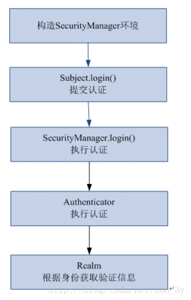

### 通过配置文件创建工厂

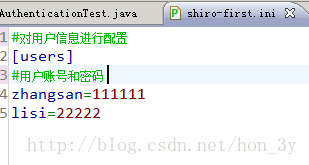

```java
    // 用户登陆和退出
    @Test
    public void testLoginAndLogout() {

        // 创建securityManager工厂，通过ini配置文件创建securityManager工厂
        Factory<SecurityManager> factory = new IniSecurityManagerFactory(
                "classpath:shiro-first.ini");

        // 创建SecurityManager
        SecurityManager securityManager = factory.getInstance();

        // 将securityManager设置当前的运行环境中
        SecurityUtils.setSecurityManager(securityManager);

        // 从SecurityUtils里边创建一个subject
        Subject subject = SecurityUtils.getSubject();

        // 在认证提交前准备token（令牌）
        // 这里的账号和密码 将来是由用户输入进去
        UsernamePasswordToken token = new UsernamePasswordToken("zhangsan",
                "111111");
        try {
            // 执行认证提交
            subject.login(token);
        } catch (AuthenticationException e) {
            // TODO Auto-generated catch block
            e.printStackTrace();
        }

        // 是否认证通过
        boolean isAuthenticated = subject.isAuthenticated();

        System.out.println("是否认证通过：" + isAuthenticated);

        // 退出操作
        subject.logout();

        // 是否认证通过
        isAuthenticated = subject.isAuthenticated();

        System.out.println("是否认证通过：" + isAuthenticated);

    }
```

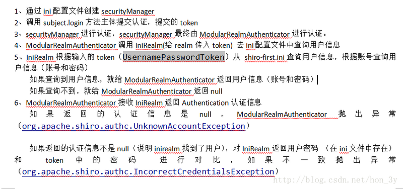

### 小结

- ModularRealmAuthenticator作用进行认证，**需要调用realm查询用户信息（在数据库中存在用户信息）**
- ModularRealmAuthenticator进行密码对比（认证过程）。
- realm：需要根据token中的身份信息去查询数据库（入门程序使用ini配置文件），**如果查到用户返回认证信息，如果查询不到返回null**。

## 自定义realm

从第一个认证程序我们可以看见，我们所说的流程，**是认证器去找realm去查询我们相对应的数据**。而默认的realm是直接去与配置文件来比对的，一般地，**我们在开发中都是让realm去数据库中比对。**
因此，我们需要自定义realm

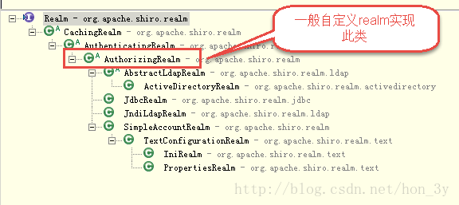

```java
public class CustomRealm extends AuthorizingRealm {

    // 设置realm的名称
    @Override
    public void setName(String name) {
        super.setName("customRealm");
    }

    // 用于认证
    @Override
    protected AuthenticationInfo doGetAuthenticationInfo(
            AuthenticationToken token) throws AuthenticationException {

        // token是用户输入的
        // 第一步从token中取出身份信息
        String userCode = (String) token.getPrincipal();

        // 第二步：根据用户输入的userCode从数据库查询
        // ....
    

        // 如果查询不到返回null
        //数据库中用户账号是zhangsansan
        /*if(!userCode.equals("zhangsansan")){//
            return null;
        }*/
        
        
        // 模拟从数据库查询到密码
        String password = "111112";

        // 如果查询到返回认证信息AuthenticationInfo

        SimpleAuthenticationInfo simpleAuthenticationInfo = new SimpleAuthenticationInfo(
                userCode, password, this.getName());

        return simpleAuthenticationInfo;
    }

    // 用于授权
    @Override
    protected AuthorizationInfo doGetAuthorizationInfo(
            PrincipalCollection principals) {
        // TODO Auto-generated method stub
        return null;
    }

}
```

## 配置realm

**需要在shiro-realm.ini配置realm注入到securityManager中。**

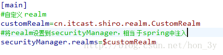

## 测试自定义realm

同上边的入门程序，需要更改ini配置文件路径：

```java
同上边的入门程序，需要更改ini配置文件路径：
Factory<SecurityManager> factory = new IniSecurityManagerFactory(
                "classpath:shiro-realm.ini");
```

## 散列算法

我们如果知道md5，我们就会知道md5是不可逆的，但是如果设置了一些安全性比较低的密码：111111...即时是不可逆的，但还是可以通过暴力算法来得到md5对应的明文...

**建议对md5进行散列时加salt（盐），进行加密相当 于对原始密码+盐进行散列。**\

正常使用时散列方法：

- 在程序中对原始密码+盐进行散列，将散列值存储到数据库中，并且还要将盐也要存储在数据库中。

测试：

```java
public class MD5Test {
    
    public static void main(String[] args) {
        
        //原始 密码 
        String source = "111111";
        //盐
        String salt = "qwerty";
        //散列次数
        int hashIterations = 2;
        //上边散列1次：f3694f162729b7d0254c6e40260bf15c
        //上边散列2次：36f2dfa24d0a9fa97276abbe13e596fc
        
        
        //构造方法中：
        //第一个参数：明文，原始密码 
        //第二个参数：盐，通过使用随机数
        //第三个参数：散列的次数，比如散列两次，相当 于md5(md5(''))
        Md5Hash md5Hash = new Md5Hash(source, salt, hashIterations);
        
        String password_md5 =  md5Hash.toString();
        System.out.println(password_md5);
        //第一个参数：散列算法 
        SimpleHash simpleHash = new SimpleHash("md5", source, salt, hashIterations);
        System.out.println(simpleHash.toString());
    }

}
```

## 自定义realm支持md5

**自定义realm**

```java
public class CustomRealmMd5 extends AuthorizingRealm {

    // 设置realm的名称
    @Override
    public void setName(String name) {
        super.setName("customRealmMd5");
    }

    // 用于认证
    @Override
    protected AuthenticationInfo doGetAuthenticationInfo(
            AuthenticationToken token) throws AuthenticationException {

        // token是用户输入的
        // 第一步从token中取出身份信息
        String userCode = (String) token.getPrincipal();

        // 第二步：根据用户输入的userCode从数据库查询
        // ....

        // 如果查询不到返回null
        // 数据库中用户账号是zhangsansan
        /*
         * if(!userCode.equals("zhangsansan")){// return null; }
         */

        // 模拟从数据库查询到密码,散列值
        String password = "f3694f162729b7d0254c6e40260bf15c";
        // 从数据库获取salt
        String salt = "qwerty";
        //上边散列值和盐对应的明文：111111

        // 如果查询到返回认证信息AuthenticationInfo
        SimpleAuthenticationInfo simpleAuthenticationInfo = new SimpleAuthenticationInfo(
                userCode, password, ByteSource.Util.bytes(salt), this.getName());

        return simpleAuthenticationInfo;
    }

    // 用于授权
    @Override
    protected AuthorizationInfo doGetAuthorizationInfo(
            PrincipalCollection principals) {
        // TODO Auto-generated method stub
        return null;
    }

}
```

配置文件：

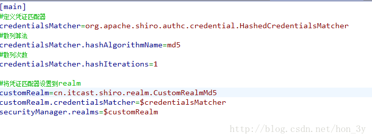

测试：

```java
// 自定义realm实现散列值匹配
    @Test
    public void testCustomRealmMd5() {

        // 创建securityManager工厂，通过ini配置文件创建securityManager工厂
        Factory<SecurityManager> factory = new IniSecurityManagerFactory(
                "classpath:shiro-realm-md5.ini");

        // 创建SecurityManager
        SecurityManager securityManager = factory.getInstance();

        // 将securityManager设置当前的运行环境中
        SecurityUtils.setSecurityManager(securityManager);

        // 从SecurityUtils里边创建一个subject
        Subject subject = SecurityUtils.getSubject();

        // 在认证提交前准备token（令牌）
        // 这里的账号和密码 将来是由用户输入进去
        UsernamePasswordToken token = new UsernamePasswordToken("zhangsan",
                "222222");
                
        try {
            // 执行认证提交
            subject.login(token);
        } catch (AuthenticationException e) {
            // TODO Auto-generated catch block
            e.printStackTrace();
        }

        // 是否认证通过
        boolean isAuthenticated = subject.isAuthenticated();

        System.out.println("是否认证通过：" + isAuthenticated);

    }
```

# Shiro介绍

Apache Shiro是一个功能强大、灵活的，开源的安全框架。它可以干净利落地处理身份验证、授权、企业会话管理和加密。

## 功能

- 验证用户身份
- 用户访问权限控制，比如：
1. 判断用户是否分配了一定的安全角色。
2. 判断用户是否被授予完成某个操作的权限
- 在非 web 或 EJB 容器的环境下可以任意使用Session API
- 可以响应认证、访问控制，或者 Session 生命周期中发生的事件
- 可将一个或以上用户安全数据源数据组合成一个复合的用户 “view”(视图)
- 支持单点登录(SSO)功能
- 支持提供“Remember Me”服务，获取用户关联信息而无需登录
···

等等——都集成到一个有凝聚力的易于使用的API。

Shiro 致力在所有应用环境下实现上述功能，小到命令行应用程序，大到企业应用中，而且不需要借助第三方框架、容器、应用服务器等。当然 Shiro 的目的是尽量的融入到这样的应用环境中去，但也可以在它们之外的任何环境下开箱即用。

## shiro的核心管理对象

1. ShiroFilterFactory：Shiro过滤器工厂类，具体的实现类是：ShiroFilterFactoryBean，此实现类是依赖于SecurityManager安全管理器的。
2. SecurityManager：Shiro的安全管理器，主要是身份认证的管理，缓存管理，Cookie管理，所以在时机开发中主要是和SecurityManager进行打交道的，ShiroFilterFacotory只要配置好Filter就可以了。
3. AccessControlFilter：访问控制过滤器，对请求进行拦截处理，在这里我们可以进行一些基本的判断以及数据的基本处理，然后生成一个AuthenticationToken，然后委托给Realm进行身份的验证和权限的验证。
4. Ream：用于身份信息权限的验证。

## Apache Shiro Features 特性

Apache Shiro是一个全面的、蕴含丰富功能的安全框架。下图为描述Shiro功能的框架图：

Authentication（认证）, Authorization（授权）, Session Management（会话管理）, Cryptography（加密）被 Shiro 框架的开发团队称之为应用安全的四大基石。那么就让我们来看看它们吧：

- Authentication（认证）：用户身份识别，通常被称为用户“登录”
- Authorization（授权）：访问控制。比如某个用户是否具有某个操作的使用权限。
- Session Management（会话管理）：特定于用户的会话管理,甚至在非web 或 EJB 应用程序。
- Cryptography（加密）：在对数据源使用加密算法加密的同时，保证易于使用。

还有其他的功能来支持和加强这些不同应用环境下安全领域的关注点。特别是对以下的功能支持：

- Web支持：Shiro 提供的 web 支持 api ，可以很轻松的保护 web 应用程序的安全。
- 缓存：缓存是 Apache Shiro 保证安全操作快速、高效的重要手段。
- 并发：Apache Shiro 支持多线程应用程序的并发特性。
- 测试：支持单元测试和集成测试，确保代码和预想的一样安全。
- “Run As”：这个功能允许用户假设另一个用户的身份(在许可的前提下)。
- “Remember Me”：跨 session 记录用户的身份，只有在强制需要时才需要登录。

注意： Shiro不会去维护用户、维护权限，这些需要我们自己去设计/提供，然后通过相应的接口注入给Shiro

## High-Level Overview 高级概述

在概念层，Shiro 架构包含三个主要的理念：Subject,SecurityManager和 Realm。下面的图展示了这些组件如何相互作用，我们将在下面依次对其进行描述。


- Subject：当前用户，Subject 可以是一个人，但也可以是第三方服务、守护进程帐户、时钟守护任务或者其它–当前和软件交互的任何事件。
- SecurityManager：管理所有Subject，SecurityManager 是 Shiro 架构的核心，配合内部安全组件共同组成安全伞。
- Realms：用于进行权限信息的验证，我们自己实现。Realm 本质上是一个特定的安全 DAO：它封装与数据源连接的细节，得到Shiro 所需的相关的数据。在配置 Shiro 的时候，你必须指定至少一个Realm 来实现认证（authentication）和/或授权（authorization）。

我们需要实现Realms的Authentication 和 Authorization。其中 Authentication 是用来验证用户身份，Authorization 是授权访问控制，用于对用户进行的操作授权，证明该用户是否允许进行当前操作，如访问某个链接，某个资源文件等。

# 快速上手

## 基础信息

### pom包依赖

```Java
<dependencies>
	<dependency>
		<groupId>org.springframework.boot</groupId>
		<artifactId>spring-boot-starter-data-jpa</artifactId>
	</dependency>
	<dependency>
		<groupId>org.springframework.boot</groupId>
		<artifactId>spring-boot-starter-thymeleaf</artifactId>
	</dependency>
	<dependency>
		<groupId>net.sourceforge.nekohtml</groupId>
		<artifactId>nekohtml</artifactId>
		<version>1.9.22</version>
	</dependency>
	<dependency>
		<groupId>org.springframework.boot</groupId>
		<artifactId>spring-boot-starter-web</artifactId>
	</dependency>
	<dependency>
		<groupId>org.apache.shiro</groupId>
		<artifactId>shiro-spring</artifactId>
		<version>1.4.0</version>
	</dependency>
	<dependency>
		<groupId>mysql</groupId>
		<artifactId>mysql-connector-java</artifactId>
		<scope>runtime</scope>
	</dependency>
</dependencies>
```

重点是 shiro-spring包

### 配置文件

```Java
spring:
datasource:
  url: jdbc:mysql://localhost:3306/test
  username: root
  password: root
  driver-class-name: com.mysql.jdbc.Driver

jpa:
  database: mysql
  show-sql: true
  hibernate:
    ddl-auto: update
    naming:
      strategy: org.hibernate.cfg.DefaultComponentSafeNamingStrategy
  properties:
     hibernate:
        dialect: org.hibernate.dialect.MySQL5Dialect

thymeleaf:
   cache: false
   mode: LEGACYHTML5
```

### 页面

我们新建了六个页面用来测试：

- index.html ：首页
- login.html ：登录页
- userInfo.html ： 用户信息页面
- userInfoAdd.html ：添加用户页面
- userInfoDel.html ：删除用户页面
- 403.html ： 没有权限的页面

除过登录页面其它都很简单，大概如下：

```Java
<!DOCTYPE html>
<html lang="en">
<head>
    <meta charset="UTF-8">
    <title>Title</title>
</head>
<body>
<h1>index</h1>
</body>
</html>
```

## RBAC

RBAC 是基于角色的访问控制（Role-Based Access Control ）在 RBAC 中，权限与角色相关联，用户通过成为适当角色的成员而得到这些角色的权限。这就极大地简化了权限的管理。这样管理都是层级相互依赖的，权限赋予给角色，而把角色又赋予用户，这样的权限设计很清楚，管理起来很方便。

采用jpa技术来自动生成基础表格，对应的entity如下：

#### 用户信息

```java
@Entity
public class UserInfo implements Serializable {
    @Id
    @GeneratedValue
    private Integer uid;
    @Column(unique =true)
    private String username;//帐号
    private String name;//名称（昵称或者真实姓名，不同系统不同定义）
    private String password; //密码;
    private String salt;//加密密码的盐
    private byte state;//用户状态,0:创建未认证（比如没有激活，没有输入验证码等等）--等待验证的用户 , 1:正常状态,2：用户被锁定.
    @ManyToMany(fetch= FetchType.EAGER)//立即从数据库中进行加载数据;
    @JoinTable(name = "SysUserRole", joinColumns = { @JoinColumn(name = "uid") }, inverseJoinColumns ={@JoinColumn(name = "roleId") })
    private List<SysRole> roleList;// 一个用户具有多个角色

    // 省略 get set 方法
}
```

#### 角色信息

```java
@Entity
public class SysRole {
    @Id@GeneratedValue
    private Integer id; // 编号
    private String role; // 角色标识程序中判断使用,如"admin",这个是唯一的:
    private String description; // 角色描述,UI界面显示使用
    private Boolean available = Boolean.FALSE; // 是否可用,如果不可用将不会添加给用户

    //角色 -- 权限关系：多对多关系;
    @ManyToMany(fetch= FetchType.EAGER)
    @JoinTable(name="SysRolePermission",joinColumns={@JoinColumn(name="roleId")},inverseJoinColumns={@JoinColumn(name="permissionId")})
    private List<SysPermission> permissions;

    // 用户 - 角色关系定义;
    @ManyToMany
    @JoinTable(name="SysUserRole",joinColumns={@JoinColumn(name="roleId")},inverseJoinColumns={@JoinColumn(name="uid")})
    private List<UserInfo> userInfos;// 一个角色对应多个用户

    // 省略 get set 方法
}
```

#### 权限信息

```java
@Entity
public class SysPermission implements Serializable {
    @Id@GeneratedValue
    private Integer id;//主键.
    private String name;//名称.
    @Column(columnDefinition="enum('menu','button')")
    private String resourceType;//资源类型，[menu|button]
    private String url;//资源路径.
    private String permission; //权限字符串,menu例子：role:*，button例子：role:create,role:update,role:delete,role:view
    private Long parentId; //父编号
    private String parentIds; //父编号列表
    private Boolean available = Boolean.FALSE;
    @ManyToMany
    @JoinTable(name="SysRolePermission",joinColumns={@JoinColumn(name="permissionId")},inverseJoinColumns={@JoinColumn(name="roleId")})
    private List<SysRole> roles;

    // 省略 get set 方法
}
```

根据以上的代码会自动生成user_info（用户信息表）、sys_role（角色表）、sys_permission（权限表）、sys_user_role（用户角色表）、sys_role_permission（角色权限表）这五张表，为了方便测试我们给这五张表插入一些初始化数据：

```java
INSERT INTO `user_info` (`uid`,`username`,`name`,`password`,`salt`,`state`) VALUES ('1', 'admin', '管理员', 'd3c59d25033dbf980d29554025c23a75', '8d78869f470951332959580424d4bf4f', 0);
INSERT INTO `sys_permission` (`id`,`available`,`name`,`parent_id`,`parent_ids`,`permission`,`resource_type`,`url`) VALUES (1,0,'用户管理',0,'0/','userInfo:view','menu','userInfo/userList');
INSERT INTO `sys_permission` (`id`,`available`,`name`,`parent_id`,`parent_ids`,`permission`,`resource_type`,`url`) VALUES (2,0,'用户添加',1,'0/1','userInfo:add','button','userInfo/userAdd');
INSERT INTO `sys_permission` (`id`,`available`,`name`,`parent_id`,`parent_ids`,`permission`,`resource_type`,`url`) VALUES (3,0,'用户删除',1,'0/1','userInfo:del','button','userInfo/userDel');
INSERT INTO `sys_role` (`id`,`available`,`description`,`role`) VALUES (1,0,'管理员','admin');
INSERT INTO `sys_role` (`id`,`available`,`description`,`role`) VALUES (2,0,'VIP会员','vip');
INSERT INTO `sys_role` (`id`,`available`,`description`,`role`) VALUES (3,1,'test','test');
INSERT INTO `sys_role_permission` VALUES ('1', '1');
INSERT INTO `sys_role_permission` (`permission_id`,`role_id`) VALUES (1,1);
INSERT INTO `sys_role_permission` (`permission_id`,`role_id`) VALUES (2,1);
INSERT INTO `sys_role_permission` (`permission_id`,`role_id`) VALUES (3,2);
INSERT INTO `sys_user_role` (`role_id`,`uid`) VALUES (1,1);
```

## Shiro 配置

首先要配置的是ShiroConfig类，Apache Shiro 核心通过 Filter 来实现，就好像SpringMvc 通过DispachServlet 来主控制一样。 既然是使用 Filter 一般也就能猜到，是通过URL规则来进行过滤和权限校验，所以我们需要定义一系列关于URL的规则和访问权限。

### ShiroConfig

```java
@Configuration

public class ShiroConfig {
	@Bean
	public ShiroFilterFactoryBean shirFilter(SecurityManager securityManager) {
		System.out.println("ShiroConfiguration.shirFilter()");
		ShiroFilterFactoryBean shiroFilterFactoryBean = new ShiroFilterFactoryBean();
		shiroFilterFactoryBean.setSecurityManager(securityManager);
		//拦截器.
		Map<String,String> filterChainDefinitionMap = new LinkedHashMap<String,String>();
		// 配置不会被拦截的链接 顺序判断
		filterChainDefinitionMap.put("/static/**", "anon");
		//配置退出 过滤器,其中的具体的退出代码Shiro已经替我们实现了
		filterChainDefinitionMap.put("/logout", "logout");
		//<!-- 过滤链定义，从上向下顺序执行，一般将/**放在最为下边 -->:这是一个坑呢，一不小心代码就不好使了;
		//<!-- authc:所有url都必须认证通过才可以访问; anon:所有url都都可以匿名访问-->
		filterChainDefinitionMap.put("/**", "authc");
		// 如果不设置默认会自动寻找Web工程根目录下的"/login.jsp"页面
		shiroFilterFactoryBean.setLoginUrl("/login");
		// 登录成功后要跳转的链接
		shiroFilterFactoryBean.setSuccessUrl("/index");

	//未授权界面;
	shiroFilterFactoryBean.setUnauthorizedUrl("/403");
	shiroFilterFactoryBean.setFilterChainDefinitionMap(filterChainDefinitionMap);
	return shiroFilterFactoryBean;
}

@Bean
public MyShiroRealm myShiroRealm(){
	MyShiroRealm myShiroRealm = new MyShiroRealm();
	return myShiroRealm;
}

@Bean
public SecurityManager securityManager(){
	DefaultWebSecurityManager securityManager =  new DefaultWebSecurityManager();
	securityManager.setRealm(myShiroRealm());
	return securityManager;
}

}
```

#### Filter Chain定义说明：

1. 一个URL可以配置多个Filter，使用逗号分隔
2. 当设置多个过滤器时，全部验证通过，才视为通过
3. 部分过滤器可指定参数，如perms，roles

Shiro内置的FilterChain

<table>
<tr>
<td>Filter Name</td>
<td>Class</td>
</tr>
<tr>
<td>anon</td>
<td>org.apache.shiro.web.filter.authc.AnonymousFilter</td>
</tr>
<tr>
<td>authc</td>
<td>org.apache.shiro.web.filter.authc.FormAuthenticationFilter</td>
</tr>
<tr>
<td>authcBasic</td>
<td>org.apache.shiro.web.filter.authc.BasicHttpAuthenticationFilter</td>
</tr>
<tr>
<td>perms</td>
<td>	org.apache.shiro.web.filter.authz.PermissionsAuthorizationFilter</td>
</tr>
<tr>
<td>port</td>
<td>org.apache.shiro.web.filter.authz.PortFilter</td>
</tr>
<tr>
<td>rest</td>
<td>org.apache.shiro.web.filter.authz.HttpMethodPermissionFilter</td>
</tr>
<tr>
<td>roles</td>
<td>org.apache.shiro.web.filter.authz.RolesAuthorizationFilter</td>
</tr>
<tr>
<td>ssl</td>
<td>org.apache.shiro.web.filter.authz.SslFilter</td>
</tr>
<tr>
<td>user</td>
<td>org.apache.shiro.web.filter.authc.UserFilter</td>
</tr>
</table>

- anon:所有url都都可以匿名访问
- authc: 需要认证才能进行访问
- user:配置记住我或认证通过可以访问

## 登录认证实现

在认证、授权内部实现机制中都有提到，最终处理都将交给Real进行处理。因为在Shiro中，最终是通过Realm来获取应用程序中的用户、角色及权限信息的。通常情况下，在Realm中会直接从我们的数据源中获取Shiro需要的验证信息。可以说，Realm是专用于安全框架的DAO. Shiro的认证过程最终会交由Realm执行，这时会调用Realm的getAuthenticationInfo(token)方法。

该方法主要执行以下操作:

1. 检查提交的进行认证的令牌信息
2. 根据令牌信息从数据源(通常为数据库)中获取用户信息
3. 对用户信息进行匹配验证。
4. 验证通过将返回一个封装了用户信息的AuthenticationInfo实例。
5. 验证失败则抛出AuthenticationException异常信息。

而在我们的应用程序中要做的就是自定义一个Realm类，继承AuthorizingRealm抽象类，重载doGetAuthenticationInfo()，重写获取用户信息的方法。

doGetAuthenticationInfo的重写

```java
@Override
protected AuthenticationInfo doGetAuthenticationInfo(AuthenticationToken token)
        throws AuthenticationException {
    System.out.println("MyShiroRealm.doGetAuthenticationInfo()");
    //获取用户的输入的账号.
    String username = (String)token.getPrincipal();
    System.out.println(token.getCredentials());
    //通过username从数据库中查找 User对象，如果找到，没找到.
    //实际项目中，这里可以根据实际情况做缓存，如果不做，Shiro自己也是有时间间隔机制，2分钟内不会重复执行该方法
    UserInfo userInfo = userInfoService.findByUsername(username);
    System.out.println("----->>userInfo="+userInfo);
    if(userInfo == null){
        return null;
    }
    SimpleAuthenticationInfo authenticationInfo = new SimpleAuthenticationInfo(
            userInfo, //用户名
            userInfo.getPassword(), //密码
            ByteSource.Util.bytes(userInfo.getCredentialsSalt()),//salt=username+salt
            getName()  //realm name
    );
    return authenticationInfo;
}
```

### 链接权限的实现

shiro的权限授权是通过继承AuthorizingRealm抽象类，重载doGetAuthorizationInfo();当访问到页面的时候，链接配置了相应的权限或者shiro标签才会执行此方法否则不会执行，所以如果只是简单的身份认证没有权限的控制的话，那么这个方法可以不进行实现，直接返回null即可。在这个方法中主要是使用类：SimpleAuthorizationInfo进行角色的添加和权限的添加。

```java
@Override
protected AuthorizationInfo doGetAuthorizationInfo(PrincipalCollection principals) {
    System.out.println("权限配置-->MyShiroRealm.doGetAuthorizationInfo()");
    SimpleAuthorizationInfo authorizationInfo = new SimpleAuthorizationInfo();
    UserInfo userInfo  = (UserInfo)principals.getPrimaryPrincipal();
    for(SysRole role:userInfo.getRoleList()){
        authorizationInfo.addRole(role.getRole());
        for(SysPermission p:role.getPermissions()){
            authorizationInfo.addStringPermission(p.getPermission());
        }
    }
    return authorizationInfo;
}
```

当然也可以添加set集合：roles是从数据库查询的当前用户的角色，stringPermissions是从数据库查询的当前用户对应的权限

```java
authorizationInfo.setRoles(roles);
authorizationInfo.setStringPermissions(stringPermissions);
```

就是说如果在shiro配置文件中添加了filterChainDefinitionMap.put(“/add”, “perms[权限添加]”);就说明访问/add这个链接必须要有“权限添加”这个权限才可以访问，如果在shiro配置文件中添加了filterChainDefinitionMap.put(“/add”, “roles[100002]，perms[权限添加]”);就说明访问/add这个链接必须要有“权限添加”这个权限和具有“100002”这个角色才可以访问。

### 登录实现

登录过程其实只是处理异常的相关信息，具体的登录验证交给shiro来处理

    @RequestMapping("/login")
    public String login(HttpServletRequest request, Map<String, Object> map) throws Exception{
        System.out.println("HomeController.login()");
        // 登录失败从request中获取shiro处理的异常信息。
        // shiroLoginFailure:就是shiro异常类的全类名.
        String exception = (String) request.getAttribute("shiroLoginFailure");
        System.out.println("exception=" + exception);
        String msg = "";
        if (exception != null) {
            if (UnknownAccountException.class.getName().equals(exception)) {
                System.out.println("UnknownAccountException -- > 账号不存在：");
                msg = "UnknownAccountException -- > 账号不存在：";
            } else if (IncorrectCredentialsException.class.getName().equals(exception)) {
                System.out.println("IncorrectCredentialsException -- > 密码不正确：");
                msg = "IncorrectCredentialsException -- > 密码不正确：";
            } else if ("kaptchaValidateFailed".equals(exception)) {
                System.out.println("kaptchaValidateFailed -- > 验证码错误");
                msg = "kaptchaValidateFailed -- > 验证码错误";
            } else {
                msg = "else >> "+exception;
                System.out.println("else -- >" + exception);
            }
        }
        map.put("msg", msg);
        // 此方法不处理登录成功,由shiro进行处理
        return "/login";
    }

其它dao层和service的代码就不贴出来了大家直接看代码。

## 测试

1. 编写好后就可以启动程序，访问http://localhost:8080/userInfo/userList页面，由于没有登录就会跳转到http://localhost:8080/login页面。登录之后就会跳转到index页面，登录后，直接在浏览器中输入http://localhost:8080/userInfo/userList访问就会看到用户信息。上面这些操作时候触发MyShiroRealm.doGetAuthenticationInfo()这个方法，也就是登录认证的方法。

2. 登录admin账户，访问：
http://127.0.0.1:8080/userInfo/userAdd显示用户添加界面，访问http://127.0.0.1:8080/userInfo/userDel显示403没有权限。上面这些操作时候触发MyShiroRealm.doGetAuthorizationInfo()这个方面，也就是权限校验的方法。

3. 修改admin不同的权限进行测试

shiro很强大，这仅仅是完成了登录认证和权限管理这两个功能，更多内容以后有时间再做探讨。

# 个人实战

## 踩坑

1. 关于出现Whitelabel Error Page(空指针页面),原因是自己没有考虑到返回值的问题,原先的页面为了api考虑,使用的是@RestController,也就是返回JSON,但是在一个需要跳转页面的情况下是不合适的,此处应该使用@Controller

# 总结

- 用户认证和用户授权是Shiro的基础，用户认证其实上就是登陆操作、用户授权实际上就是对资源拦截的操作。
- 权限管理的模型一般我们都将资源放在权限表中进行管理起来。
- 我们可以基于角色拦截，也可以基于资源拦截。要是基于角色拦截的话，那么如果角色的权限发生变化了，那就需要修改代码了**。推荐使用基于资源进行拦截**
- **这次URL拦截，我们使用一个JavaBean来封装所有的认证信息。当用户登陆了之后，我们就把用户对菜单栏的访问、对资源的访问权限都封装到该JavaBean中**
- 当使用拦截器进行用户认证的时候，我们只要判断Session域有没有JavaBen对象即可了。
- 当时候拦截器进行用户授权的时候，我们要判断JavaBean中的权限是否能够访问该资源。
- 以前URL拦截的方式需要把所有的URL都在数据库进行管理。非常麻烦，不易维护。
- **我们希望Shiro去认证的时候是通过realm去数据库查询数据的。而我们reaml默认是查询配置文件的数据的。**
- 因此，我们需要自定义reaml，使得它是去数据库查询数据。只要继承AuthorizingRealm类就行了。
- **当然了，自定义后的reaml也需要在配置文件中写上我们的自定义reaml的位置的。**
- 散列算法就是为了让密码不被别人给破解。**我们可对原始的密码加盐再进行散列，这就加大了破解的难度了。**
- 自定义的reaml也是支持散列算法的，相同的，还是需要我们在配置文件中配置一下就好了。

# 参考 #

1. [springboot(十四)：springboot整合shiro-登录认证和权限管理](http://www.ityouknow.com/springboot/2017/06/26/springboot-shiro.html)
2. [作者示例代码](https://github.com/ityouknow/spring-boot-examples)
3. [Spring Boot Shiro权限管理【从零开始学Spring Boot】](http://412887952-qq-com.iteye.com/blog/2299732)
4. [Shiro入门这篇就够了【Shiro的基础知识、回顾URL拦截】](https://segmentfault.com/a/1190000013875092)
5. [Shiro权限管理详解【面试+工作】 ](<http://www.sohu.com/a/212913571_100012573>)
