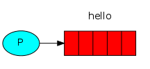
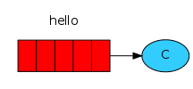
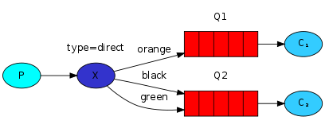
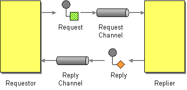

# 常用消息队列

一般商用的容器，比如WebLogic，JBoss，都支持JMS标准，开发上很方便。但免费的比如Tomcat，Jetty等则需要使用第三方的消息中间件。本部分内容介绍常用的消息中间件（Active MQ，Rabbit MQ，Zero MQ，Kafka）以及他们的特点。

# RabbitMQ

RabbitMQ是一个消息代理。它的核心思想非常简单：接收并转发消息。你可以把它想象成一个邮局：当你把邮件丢进邮箱时，你非常确定邮递员先生会把它送到收件人手中。在这个比喻中，RabbitMQ就是邮箱、邮局和邮递员。

## 概念

RabbitMQ是流行的开源消息队列系统，用erlang语言开发。RabbitMQ是AMQP（高级消息队列协议）的标准实现。支持多种客户端，如：Python、Ruby、.NET、Java、JMS、C、PHP、ActionScript、XMPP、STOMP等，支持AJAX，持久化。用于在分布式系统中存储转发消息，在易用性、扩展性、高可用性等方面表现不俗。


​									RabbitMQ结构图

通常我们谈到队列服务, 会有三个概念： 发消息者、队列、收消息者，RabbitMQ 在这个基本概念之上, 多做了一层抽象, 在发消息者和 队列之间, 加入了交换器 (Exchange). 这样发消息者和队列就没有直接联系, 转而变成发消息者把消息给交换器, 交换器根据调度策略再把消息再给队列。

上图中有几个重要概念：

- Broker：简单来说就是消息队列服务器实体。
- **Producer**：消息生产者，就是投递消息的程序。
- **Consumer**：消息消费者，就是接受消息的程序。
- **Exchange**：消息交换机，它指定消息按什么规则，路由到哪个队列。
  - *Exchange 用于转发消息，但是它不会做存储* ，如果没有 Queue bind 到 Exchange 的话，它会直接丢弃掉 Producer 发送过来的消息。 
- Queue：消息队列载体，每个消息都会被投入到一个或多个队列。
- Binding：绑定，它的作用就是把Exchange和Queue按照路由规则绑定起来。
  - 也就是交换机需要和队列相绑定，这其中如上图所示，是多对多的关系。
- Routing Key：路由关键字，Exchange根据这个关键字进行消息投递。
  - 消息到交换机的时候，交互机会转发到对应的队列中，那么究竟转发到哪个队列，就要根据该路由键。
- vhost：虚拟主机，一个broker里可以开设多个vhost，用作不同用户的权限分离。
  - 一个虚拟主机持有一组交换机、队列和绑定。为什么需要多个虚拟主机呢？很简单， RabbitMQ 当中，*用户只能在虚拟主机的粒度进行权限控制。* 因此，如果需要禁止A组访问B组的交换机/队列/绑定，必须为A和B分别创建一个虚拟主机。每一个 RabbitMQ 服务器都有一个默认的虚拟主机“/”。
- channel：消息通道，在客户端的每个连接里，可建立多个channel，每个channel代表一个会话任务。

消息队列的使用过程，如下：

1. 客户端连接到消息队列服务器，打开一个channel。
2. 客户端声明一个exchange，并设置相关属性。
3. 客户端声明一个queue，并设置相关属性。
4. 客户端使用routing key，在exchange和queue之间建立好绑定关系。
5. 客户端投递消息到exchange。

exchange接收到消息后，就根据消息的key和已经设置的binding，进行消息路由，将消息投递到一个或多个队列里。

### 交换机

交换机的功能主要是接收消息并且转发到绑定的队列，交换机不存储消息，在启用ack模式后，交换机找不到队列会返回错误。交换机有四种类型：Direct, Topic, Headers and Fanout

- Direct：direct 类型的行为是”先匹配, 再投送”. 即在绑定时设定一个 **routing_key**, 消息的**routing_key** 匹配时, 才会被交换器投送到绑定的队列中去.
- Topic：按规则转发消息（最灵活）
- Headers：设置 header attribute 参数类型的交换机
- Fanout：转发消息到所有绑定队列

**Direct Exchange**

Direct Exchange 是 RabbitMQ 默认的交换机模式，也是最简单的模式，根据key全文匹配去寻找队列。


第一个 X - Q1 就有一个 binding key，名字为 orange； X - Q2 就有 2 个 binding key，名字为 black 和 green。*当消息中的 路由键 和 这个 binding key 对应上的时候，那么就知道了该消息去到哪一个队列中。*

Ps：为什么 X 到 Q2 要有 black，green，2个 binding key呢，一个不就行了吗？ - 这个主要是因为可能又有 Q3，而Q3只接受 black 的信息，而Q2不仅接受black 的信息，还接受 green 的信息。

**Topic Exchange**

*Topic Exchange 转发消息主要是根据通配符。* 在这种交换机下，队列和交换机的绑定会定义一种路由模式，那么，通配符就要在这种路由模式和路由键之间匹配后交换机才能转发消息。

在这种交换机模式下：

- 路由键必须是一串字符，用句号（`.`） 隔开，比如说 agreements.us，或者 agreements.eu.stockholm 等。
- 路由模式必须包含一个 星号（`*`），主要用于匹配路由键指定位置的一个单词，比如说，一个路由模式是这样子：agreements..b.*，那么就只能匹配路由键是这样子的：第一个单词是 agreements，第四个单词是 b。 井号（#）就表示相当于一个或者多个单词，例如一个匹配模式是 agreements.eu.berlin.#，那么，以agreements.eu.berlin 开头的路由键都是可以的。

具体代码发送的时候还是一样，第一个参数表示交换机，第二个参数表示 routing key，第三个参数即消息。如下：

```java
rabbitTemplate.convertAndSend("testTopicExchange","key1.a.c.key2", " this is  RabbitMQ!");
```

topic 和 direct 类似, 只是匹配上支持了”模式”, 在”点分”的 routing_key 形式中, 可以使用两个通配符:

- `*`表示一个词.
- `#`表示零个或多个词.

**Headers Exchange**

headers 也是根据规则匹配, 相较于 direct 和 topic 固定地使用 routing_key , headers 则是一个自定义匹配规则的类型， 在队列与交换器绑定时, 会设定一组键值对规则， 消息中也包括一组键值对( headers 属性),，当这些键值对有一对,，或全部匹配时, 消息被投送到对应队列。

**Fanout Exchange**

Fanout Exchange 消息广播的模式，不管路由键或者是路由模式，*会把消息发给绑定给它的全部队列*，如果配置了 routing_key 会被忽略。

## Hello World

使用Java进行实现。

会写两个Java程序。一个发送一条消息的producer和一个接收消息并打印出来的consumer。因为只是刚刚起步，我们会忽略一些Java API的细节，只把精力集中在简单的事情上。消息的内容是“Hello World”。

### 先决条件

假定RabbitMQ 已在标准端口（5672）上的localhost上安装并运行。如果您使用不同的主机，端口或凭据，则需要调整连接设置。

> 下载客户端压缩包，按照描述检查它的signature。解压到你的工作目录下，并从中取出所有JAR文件。
>
> ```bash
> $ unzip rabbitmq-java-client-bin-*.zip
> $ cp rabbitmq-java-client-bin-*/*.jar ./
> ```
>
> RabbitMQ的java客户端可以通过maven下载，它的groupId是com.rabbitmq，artifactId是amqp-client。

### 发送



我们把发消息的类叫做Send，收消息的类叫做Recv。Send类将会连接（connect）RabbitMQ，发送一条消息然后退出。

在Send.java中，我们需要import一些类：

```java
import com.rabbitmq.client.ConnectionFactory;
import com.rabbitmq.client.Connection;
import com.rabbitmq.client.Channel;
```

创建类并且为queue起个名字：

```java
public class Send {
  private final static String QUEUE_NAME = "hello";

  public static void main(String[] argv)
      throws java.io.IOException {
      ...
  }
}
```

然后我们创建一个到server的connection：

```java
    ConnectionFactory factory = new ConnectionFactory();
    factory.setHost("localhost");
    Connection connection = factory.newConnection();
    Channel channel = connection.createChannel();
```

connection是socket连接的抽象，并且为我们管理协议版本协商（protocol version negotiation），认证（authentication ）等等事情。这里我们要连接的消息代理在本地，因此我们将host设为“localhost”。如果我们想连接其他机器上的代理，只需要将这里改为特定的主机名或IP地址。

接下来，我们创建一个channel，绝大部分API方法需要通过调用它来完成。

发送之前，我们必须声明消息要发往哪个队列，然后我们可以向队列发一条消息：

```java
    channel.queueDeclare(QUEUE_NAME, false, false, false, null);
    String message = "Hello World!";
    channel.basicPublish("", QUEUE_NAME, null, message.getBytes());
    System.out.println(" [x] Sent '" + message + "'");
```

队列的声明是幂等的，也就是说只有当队列不存在时才会创建它。消息内容是byte数组，因此你可以使用各种编码方式。

最后，我们把channel和connection关掉：

```java
    channel.close();
    connection.close();
```

> ## 消息没发出去！
>
> 如果这是你第一次使用RabbitMQ，并且你没有看到“Sent”信息被打印出来，那你可能会在抓耳挠腮，搞不清哪里出了错。也许消息代理启动时没有足够的磁盘空间（默认需要1Gb）所以它拒绝了消息。检查一下代理的logfile，假如有必要的话也可以减少磁盘空间的限制。
>
> 配置文件文档
>
> 将会告诉你如何设置disk_free_limit。

Send.java

```java
import com.rabbitmq.client.Channel;
import com.rabbitmq.client.Connection;
import com.rabbitmq.client.ConnectionFactory;

public class Send {

    private final static String QUEUE_NAME = "hello";

    public static void main(String[] argv) throws Exception {
        ConnectionFactory factory = new ConnectionFactory();
        factory.setHost("localhost");
        try (Connection connection = factory.newConnection();
             Channel channel = connection.createChannel()) {
            channel.queueDeclare(QUEUE_NAME, false, false, false, null);
            String message = "Hello World!";
            channel.basicPublish("", QUEUE_NAME, null, message.getBytes("UTF-8"));
            System.out.println(" [x] Sent '" + message + "'");
        }
    }
}
```

### 接收



以上就是我们的发送者。RabbitMQ会把消息推送给接收者，所以不同于只发了一条信息的发送者，我们会让接收者一直监听消息并打印出来。

Recv.java的import部分和Send类差不多：

```js
import com.rabbitmq.client.ConnectionFactory;
import com.rabbitmq.client.Connection;
import com.rabbitmq.client.Channel;
import com.rabbitmq.client.Consumer;
import com.rabbitmq.client.DefaultConsumer;
```

新增的DefaultConsumer类是Consumer接口的实现,我们使用它来接收server推送来的消息。
起始的代码和sender差不多（译注：都是样板代码）：我们创建连接，打开channel，并且声明我们要监听的队列。注意这个队列要与Send类要发送的队列一致。

```java
public class Recv {
  private final static String QUEUE_NAME = "hello";

  public static void main(String[] argv)
      throws java.io.IOException,
             java.lang.InterruptedException {

    ConnectionFactory factory = new ConnectionFactory();
    factory.setHost("localhost");
    Connection connection = factory.newConnection();
    Channel channel = connection.createChannel();

    channel.queueDeclare(QUEUE_NAME, false, false, false, null);
    System.out.println(" [*] Waiting for messages. To exit press CTRL+C");
    ...
    }
}
```

注意到，我们在这里也声明了队列。因为我们可能在启动发送者之前启动接收者，因此需要保证在接收消息之前，队列已经存在。

接下来我们要告诉server把队列中的消息发送给我们。因为推送消息是异步的，我们需要以对象的形式提供一个回调，它会缓存消息，直到我们准备好使用它。我们通过一个DefaultConsumer的子类来完成这件事：

```java
    Consumer consumer = new DefaultConsumer(channel) {
      @Override
      public void handleDelivery(String consumerTag, Envelope envelope, 
AMQP.BasicProperties properties, byte[] body)
          throws IOException {
        String message = new String(body, "UTF-8");
        System.out.println(" [x] Received '" + message + "'");
      }
    };
    channel.basicConsume(QUEUE_NAME, true, consumer);
```

Recv.java

```java
import com.rabbitmq.client.Channel;
import com.rabbitmq.client.Connection;
import com.rabbitmq.client.ConnectionFactory;
import com.rabbitmq.client.DeliverCallback;

public class Recv {

    private final static String QUEUE_NAME = "hello";

    public static void main(String[] argv) throws Exception {
        ConnectionFactory factory = new ConnectionFactory();
        factory.setHost("localhost");
        Connection connection = factory.newConnection();
        Channel channel = connection.createChannel();

        channel.queueDeclare(QUEUE_NAME, false, false, false, null);
        System.out.println(" [*] Waiting for messages. To exit press CTRL+C");

        DeliverCallback deliverCallback = (consumerTag, delivery) -> {
            String message = new String(delivery.getBody(), "UTF-8");
            System.out.println(" [x] Received '" + message + "'");
        };
        channel.basicConsume(QUEUE_NAME, true, deliverCallback, consumerTag -> { });
    }
}
```


## 工作队列

- 生产者消费者模式，在工人间分配任务


在这个中，我们将创建一个*工作队列*，用于在多个工作人员之间分配耗时的任务。

工作队列（又称：**任务队列**）背后的主要思想是避免立即执行资源密集型任务，并且必须等待它完成。相反，我们安排任务稍后完成。我们将*任务*封装 为消息并将其发送到队列。在后台运行的工作进程将弹出任务并最终执行作业。当您运行许多工作程序时，它们之间将共享任务。

这个概念在Web应用程序中特别有用，在这些应用程序中，在短HTTP请求窗口期间无法处理复杂任务。

### 准备

在本教程的前一部分中，我们发送了一条包含“Hello World！”的消息。现在我们将发送代表复杂任务的字符串。我们没有真实世界的任务，比如要调整大小的图像或要渲染的pdf文件，所以让我们通过**假装我们很忙**来伪造它 - 使用`Thread.sleep（）`函数。我们将字符串中的点数作为其复杂性; 每个点都会占据“工作”的一秒钟。例如，`Hello ...`描述的假任务 将花费三秒钟。

我们将稍微修改前一个示例中的*Send.java*代码，以允许从命令行发送任意消息。该程序将任务安排到我们的工作队列，所以我们将其命名为 `NewTask.java`：

```java
String message = String.join（“”，argv）;

channel.basicPublish（“”，“hello”，null，message.getBytes（））;
System.out.println（“[x] Sent'” + message + “'”）;
```

我们的旧*Recv.java*程序还需要进行一些更改：它需要伪造消息体中每个点的第二个工作。它将处理传递的消息并执行任务，所以我们称之为`Worker.java`：

```java
DeliverCallback deliverCallback =（consumerTag，delivery） - > {
  String message = new String（delivery.getBody（），“UTF-8”）;

  System.out.println（“[x] Received'” + message + “'”）;
  try {
    doWork(message);
  } finally {
    System.out.println（“[x] Done”）;
  }
};
boolean autoAck = true ; //确认如下
channel.basicConsume（TASK_QUEUE_NAME，autoAck，deliverCallback，consumerTag  - > {}）;
```

我们的假任务是模拟执行时间：

```java
private  static  void  doWork （String task） throws InterruptedException {
     for（ char ch：task.toCharArray（））{
         if（ch == '。'）Thread.sleep（ 1000）;
    }
}
```

进行编译

```bash
javac -cp $ CP NewTask.java Worker.java
```

### 循环调度

使用任务队列的一个优点是能够轻松地并行工作。如果我们正在积压工作积压，我们可以添加更多工人，这样就可以轻松扩展。

首先，让我们尝试同时运行两个worker实例。他们都会从队列中获取消息，但究竟如何呢？让我们来看看。

你需要打开三个控制台。两个将运行工作程序。这些游戏机将成为我们的两个消费者 - C1和C2。

~~~bash
#shell 1 java -cp $ CP Worker
 ＃=> [*]正在等待消息。要退出按CTRL + C.
~~~

~~~bash
#shell 2 java -cp $ CP Worker
 ＃=> [*]等待消息。要退出按CTRL + C.
~~~

在第三个中，我们将发布新任务。启动消费者后，您可以发布一些消息：

```bash
#shell 3 
java -cp $ CP NewTask First message。
＃=> [x]发送“第一条消息”。
java -cp $ CP NewTask第二条消息..
 ＃=> [x]发送'第二条消息..' 
java -cp $ CP NewTask第三条消息...
 ＃=> [x]发送'第三条消息......' 
java  - cp $ CP NewTask第四条消息....
 ＃=> [x]发送'第四条消息....' 
java -cp $ CP NewTask第五条消息.....
 ＃=> [x]发送'第五条消息.. ......”
```

让我们看看交给我们工人的是什么：

```bash
java -cp $ CP Worker
 ＃=> [*]正在等待消息。要退出，请按CTRL + C 
＃=> [x]收到“第一条消息”。
＃=> [x]收到'第三条消息......' 
＃=> [x]收到'第五条消息.....'
java -cp $ CP Worker
 ＃=> [*]正在等待消息。要退出按CTRL + C 
＃=> [x]收到'第二条消息..' 
＃=> [x]收到'第四条消息....'
```

默认情况下，RabbitMQ将按顺序将每条消息发送给下一个消费者。平均而言，每个消费者将获得相同数量的消息。这种分发消息的方式称为循环法。与三个或更多工人一起尝试。

### 消息确认

执行任务可能需要几秒钟。你可能想知道如果其中一个消费者开始一项长期任务并且只是部分完成而死亡会发生什么。使用我们当前的代码，一旦RabbitMQ向消费者发送消息，它立即将其标记为删除。在这种情况下，如果你杀死一个工人，我们将丢失它刚刚处理的消息。我们还将丢失分发给这个特定工作者但尚未处理的所有消息。

但我们不想失去任何任务。如果工人死亡，我们希望将任务交付给另一名工人。

为了确保消息永不丢失，RabbitMQ支持**消息确认**。消费者发回ack（nowledgement）告诉RabbitMQ已收到，处理了特定消息，RabbitMQ可以自由删除它。

如果消费者死亡（其通道关闭，连接关闭或TCP连接丢失）而不发送确认，RabbitMQ将理解消息未完全处理并将重新排队。如果同时有其他在线消费者，则会迅速将其重新发送给其他消费者。这样你就可以确保没有消息丢失，即使工人偶尔会死亡。

没有任何消息超时; 当消费者死亡时，RabbitMQ将重新发送消息。即使处理消息需要非常长的时间，也没关系。

默认情况下，**手动消息确认**已打开。在前面的示例中，我们通过`autoAck = true` 标志明确地将它们关闭。一旦我们完成任务，就应该将此标志设置为`false`并从工作人员发送适当的确认。

```java
channel.basicQos(1); // accept only one unack-ed message at a time (see below)

DeliverCallback deliverCallback = (consumerTag, delivery) -> {
  String message = new String(delivery.getBody(), "UTF-8");

  System.out.println(" [x] Received '" + message + "'");
  try {
    doWork(message);
  } finally {
    System.out.println(" [x] Done");
    channel.basicAck(delivery.getEnvelope().getDeliveryTag(), false);
  }
};
boolean autoAck = false;
channel.basicConsume(TASK_QUEUE_NAME, autoAck, deliverCallback, consumerTag -> { });
```

使用此代码，我们可以确定即使您在处理消息时使用CTRL + C杀死一名工作人员，也不会丢失任何内容。工人死后不久，所有未经确认的消息将被重新传递。

确认必须在收到交付的同一频道上发送。尝试使用不同的通道进行确认将导致通道级协议异常。

> #### 被遗忘的确认
>
> 错过basicAck是一个常见的错误。这是一个简单的错误，但后果是严重的。当您的客户端退出时，消息将被重新传递（这可能看起来像随机重新传递），但RabbitMQ会占用越来越多的内存，因为它无法释放任何未经消息的消息。
>
> 为了调试这种错误，您可以使用rabbitmqctl 来打印messages_unacknowledged字段：
>
> ```bash
> sudo rabbitmqctl list_queues name messages_ready messages_unacknowledged
> ```
>
> 在Windows上，删除sudo：
>
> ```bash
> rabbitmqctl.bat list_queues name messages_ready messages_unacknowledged
> ```


### 消息持久性

我们已经学会了如何确保即使消费者死亡，任务也不会丢失。但是如果RabbitMQ服务器停止，我们的任务仍然会丢失。

当RabbitMQ退出或崩溃时，它将忘记队列和消息，除非你告诉它不要。确保消息不会丢失需要做两件事：我们需要将队列和消息都标记为持久。

首先，我们需要确保RabbitMQ永远不会丢失我们的队列。为此，我们需要声明它是*持久的*：

```java
boolean durable = true ;
channel.queueDeclare（“hello”，durable，false，false，null）;
```

虽然此命令本身是正确的，但它在我们当前的设置中不起作用。那是因为我们已经定义了一个名为hello的队列 ，这个队列不耐用。RabbitMQ不允许您使用不同的参数重新定义现有队列，并且会向尝试执行此操作的任何程序返回错误。但是有一个快速的解决方法 - 让我们声明一个具有不同名称的队列，例如task_queue：

```java
boolean durable = true ;
channel.queueDeclare（“task_queue”，durable，false，false，null）;
```

此queueDeclare更改需要应用于生产者和消费者代码。

此时我们确信即使RabbitMQ重新启动，task_queue队列也不会丢失。现在我们需要将消息标记为持久性 - 通过将MessageProperties（实现BasicProperties）设置为值PERSISTENT_TEXT_PLAIN。

```java
import com.rabbitmq.client.MessageProperties;

channel.basicPublish（“”，“task_queue”，
            MessageProperties.PERSISTENT_TEXT_PLAIN，
            message.getBytes（））;
```

> #### 有关消息持久性的注释
>
> 将消息标记为持久性并不能完全保证消息不会丢失。虽然它告诉RabbitMQ将消息保存到磁盘，但是当RabbitMQ接受消息并且尚未保存消息时，仍然有一个短时间窗口。此外，RabbitMQ不会为每条消息执行fsync（2） - 它可能只是保存到缓存而不是真正写入磁盘。持久性保证不强，但对于我们简单的任务队列来说已经足够了。如果您需要更强的保证，那么您可以使用 **生产者确认**。

### 公平派遣

您可能已经注意到调度仍然无法完全按照我们的意愿运行。例如，在有两个工人的情况下，当所有奇怪的消息都很重，甚至消息很轻时，一个工人将经常忙，而另一个工作人员几乎不会做任何工作。那么，RabbitMQ对此一无所知，仍然会均匀地发送消息。

发生这种情况是因为RabbitMQ只是在消息进入队列时调度消息。它不会查看消费者未确认消息的数量。它只是盲目地向第n个消费者发送每个第n个消息。


为了打败我们可以使用basicQos方法和 prefetchCount = 1设置。这告诉RabbitMQ一次不向一个worker发送一条消息。或者，换句话说，在处理并确认前一个消息之前，不要向工作人员发送新消息。相反，它会将它发送给下一个仍然很忙的工人。

```java
int prefetchCount = 1 ;
channel.basicQos（prefetchCount）;
```

> #### 关于队列大小的说明
>
> 如果所有工作人员都很忙，您的队列就会填满。您将需要关注这一点，并可能添加更多工作人员，或者采取其他策略。

### 源码

Final code of our NewTask.java class:

```java
import com.rabbitmq.client.Channel;
import com.rabbitmq.client.Connection;
import com.rabbitmq.client.ConnectionFactory;
import com.rabbitmq.client.MessageProperties;

public class NewTask {

  private static final String TASK_QUEUE_NAME = "task_queue";

  public static void main(String[] argv) throws Exception {
    ConnectionFactory factory = new ConnectionFactory();
    factory.setHost("localhost");
    try (Connection connection = factory.newConnection();
         Channel channel = connection.createChannel()) {
        channel.queueDeclare(TASK_QUEUE_NAME, true, false, false, null);

        String message = String.join(" ", argv);

        channel.basicPublish("", TASK_QUEUE_NAME,
                MessageProperties.PERSISTENT_TEXT_PLAIN,
                message.getBytes("UTF-8"));
        System.out.println(" [x] Sent '" + message + "'");
    }
  }

}
```

And our Worker.java:

```java
import com.rabbitmq.client.Channel;
import com.rabbitmq.client.Connection;
import com.rabbitmq.client.ConnectionFactory;
import com.rabbitmq.client.DeliverCallback;

public class Worker {

  private static final String TASK_QUEUE_NAME = "task_queue";

  public static void main(String[] argv) throws Exception {
    ConnectionFactory factory = new ConnectionFactory();
    factory.setHost("localhost");
    final Connection connection = factory.newConnection();
    final Channel channel = connection.createChannel();

    channel.queueDeclare(TASK_QUEUE_NAME, true, false, false, null);
    System.out.println(" [*] Waiting for messages. To exit press CTRL+C");

    channel.basicQos(1);

    DeliverCallback deliverCallback = (consumerTag, delivery) -> {
        String message = new String(delivery.getBody(), "UTF-8");

        System.out.println(" [x] Received '" + message + "'");
        try {
            doWork(message);
        } finally {
            System.out.println(" [x] Done");
            channel.basicAck(delivery.getEnvelope().getDeliveryTag(), false);
        }
    };
    channel.basicConsume(TASK_QUEUE_NAME, false, deliverCallback, consumerTag -> { });
  }

  private static void doWork(String task) {
    for (char ch : task.toCharArray()) {
        if (ch == '.') {
            try {
                Thread.sleep(1000);
            } catch (InterruptedException _ignored) {
                Thread.currentThread().interrupt();
            }
        }
    }
  }
}
```

## 发布/订阅

我们将向多个消费者传递信息。此模式称为“发布/订阅”。

为了说明这种模式，我们将构建一个简单的日志记录系统。它将包含两个程序 - 第一个将发出日志消息，第二个将接收和打印它们。

在我们的日志记录系统中，接收程序的每个运行副本都将获取消息。这样我们就可以运行一个接收器并将日志指向磁盘; 同时我们将能够运行另一个接收器并在屏幕上看到日志。

基本上，发布的日志消息将被广播给所有接收者。

### Exchanges

让我们快速浏览前面教程中介绍的内容：

- 甲*生产者*是发送消息的用户的应用程序。
- 甲*队列*是存储消息的缓冲器。
- 甲*消费者*是接收消息的用户的应用程序。

RabbitMQ中消息传递模型的核心思想是生产者永远不会将任何消息直接发送到队列。实际上，生产者通常甚至不知道消息是否会被传递到任何队列。

相反，生产者只能向*Exchanges*发送消息。交换是一件非常简单的事情。一方面，它接收来自生产者的消息，另一方面将它们推送到队列。交易所必须确切知道如何处理它收到的消息。它应该附加到特定队列吗？它应该附加到许多队列吗？或者它应该被丢弃。其规则由*Exchange类型*定义 。


有几种交换类型可供选择：`direct, topic, headers和 fanout`.。我们将专注于最后一个 ` fanout`。让我们创建一个这种类型的交换，并将其称为日志：

```java
channel.exchangeDeclare（“logs”，“fanout”）;
```

fanout交换非常简单。正如您可能从名称中猜到的那样，它只是将收到的所有消息广播到它知道的所有队列中。而这正是我们记录器所需要的。

> #### 无名交流
>
> 在本教程的前几部分中，我们对交换一无所知，但仍然可以向队列发送消息。这是可能的，因为我们使用默认交换，我们通过空字符串（“”）来识别。
>
> 回想一下我们之前如何发布消息：
>
> ```java
> channel.basicPublish（“”，“hello”，null，message.getBytes（））;
> ```
>
> 第一个参数是交换的名称。空字符串表示默认或*无名*交换：消息通过routingKey指定的名称路由到队列（如果存在）。

现在，我们可以发布到我们的命名交换：

```java
channel.basicPublish（“logs”，“”，null，message.getBytes（））;
```

### 临时队列

您可能还记得以前我们使用过具有特定名称的队列（还记得`hello`和`task_queue`吗？）。能够命名队列对我们来说至关重要 - 我们需要将工作人员指向同一个队列。当您想要在生产者和消费者之间共享队列时，为队列命名非常重要。

但我们的记录器并非如此。我们希望了解所有日志消息，而不仅仅是它们的一部分。我们也只对目前流动的消息感兴趣，而不是旧消息。要解决这个问题，我们需要两件事。

首先，每当我们连接到Rabbit时，我们都需要一个新的空队列。为此，我们可以使用随机名称创建队列，或者更好 - 让服务器为我们选择随机队列名称。

其次，一旦我们断开消费者，就应该自动删除队列。

在Java客户端中，当我们没有向queueDeclare（）提供参数时，我们 使用生成的名称创建一个非持久的，独占的自动删除队列：

```java
String queueName = channel.queueDeclare（）。getQueue（）;
```

您可以在队列指南中了解有关独占标志和其他队列属性的更多信息。

此时，queueName包含随机队列名称。例如，它可能看起来像amq.gen-JzTY20BRgKO-HjmUJj0wLg。

### 绑定


我们已经创建了一个`fanout`交换和一个队列。现在我们需要告诉交换机将消息发送到我们的队列。交换和队列之间的关系称为*绑定*。

```java
channel.queueBind（queueName，“logs”，“”）;
```

从现在开始，日志交换会将消息附加到我们的队列中。

> #### 列出绑定
>
> 你猜对了，你可以列出现有的绑定
>
> ```bash
> rabbitmqctl list_bindings
> ```

### 把它们放在一起


生成日志消息的生产者程序与前一个教程没有太大的不同。最重要的变化是我们现在想要将消息发布到我们的日志交换而不是无名交换。我们需要在发送时提供routingKey，但是对于`fanout`交换，它的值会被忽略。这里是

`EmitLog.java`程序的代码 ：

```java
public class EmitLog {

  private static final String EXCHANGE_NAME = "logs";

  public static void main(String[] argv) throws Exception {
    ConnectionFactory factory = new ConnectionFactory();
    factory.setHost("localhost");
    try (Connection connection = factory.newConnection();
         Channel channel = connection.createChannel()) {
        channel.exchangeDeclare(EXCHANGE_NAME, "fanout");

        String message = argv.length < 1 ? "info: Hello World!" :
                            String.join(" ", argv);

        channel.basicPublish(EXCHANGE_NAME, "", null, message.getBytes("UTF-8"));
        System.out.println(" [x] Sent '" + message + "'");
    }
  }
}
```

如您所见，在建立连接后，我们宣布了交换。此步骤是必要的，因为禁止发布到不存在的交换。

如果没有队列绑定到交换机，消息将会丢失，但这对我们没有问题; 如果没有消费者在听，我们可以安全地丢弃该消息。

`ReceiveLogs.java`的代码：

```java
import com.rabbitmq.client.Channel;
import com.rabbitmq.client.Connection;
import com.rabbitmq.client.ConnectionFactory;
import com.rabbitmq.client.DeliverCallback;

public class ReceiveLogs {
  private static final String EXCHANGE_NAME = "logs";

  public static void main(String[] argv) throws Exception {
    ConnectionFactory factory = new ConnectionFactory();
    factory.setHost("localhost");
    Connection connection = factory.newConnection();
    Channel channel = connection.createChannel();

    channel.exchangeDeclare(EXCHANGE_NAME, "fanout");
    String queueName = channel.queueDeclare().getQueue();
    channel.queueBind(queueName, EXCHANGE_NAME, "");

    System.out.println(" [*] Waiting for messages. To exit press CTRL+C");

    DeliverCallback deliverCallback = (consumerTag, delivery) -> {
        String message = new String(delivery.getBody(), "UTF-8");
        System.out.println(" [x] Received '" + message + "'");
    };
    channel.basicConsume(queueName, true, deliverCallback, consumerTag -> { });
  }
}
```

## 路由

- 有选择地接收消息

上一个教程中，我们构建了一个简单的日志系统 我们能够向许多接收者广播日志消息。

在本教程中，我们将为其添加一个功能 - 我们将只能订阅一部分消息。例如，我们只能将关键错误消息定向到日志文件（以节省磁盘空间），同时仍然能够在控制台上打印所有日志消息。

### 绑定

在前面的例子中，我们已经创建了绑定。您可能会记得以下代码：

```java
channel.queueBind（queueName，EXCHANGE_NAME，“”）;
```

绑定是交换和队列之间的关系。这可以简单地理解为：队列对来自此交换的消息感兴趣。

绑定可以采用额外的routingKey参数。为了避免与basic_publish参数混淆，我们将其称为 绑定密钥。这就是我们如何使用键创建绑定：

```java
channel.queueBind（queueName，EXCHANGE_NAME，“black”）;
```

绑定密钥的含义取决于交换类型。我们之前使用的`fanout `交换只是忽略了它的价值。

### 直接交换

我们上一个教程中的日志记录系统向所有消费者广播所有消息。我们希望扩展它以允许根据消息的严重性过滤消息。例如，我们可能需要一个程序将日志消息写入磁盘以仅接收严重错误，而不是在警告或信息日志消息上浪费磁盘空间。

我们使用的是`fanout `交换，它没有给我们太大的灵活性 - 它只能进行无意识的广播。

我们将使用` direct`交换。`direct`交换背后的路由算法很简单 

- 消息进入队列，其 绑定密钥与消息的路由密钥完全匹配。

为了说明这一点，请考虑以下设置：



在此设置中，我们可以看到` direct`交换X与两个绑定到它的队列。第一个队列绑定橙色绑定，第二个绑定有两个绑定，一个绑定密钥为黑色，另一个绑定为绿色。

在这样的设置中，使用路由密钥orange发布到交换机的消息 将被路由到队列Q1。路由键为黑色 或绿色的消息将转到Q2。所有其他消息将被丢弃。

### 多个绑定


使用相同的绑定密钥绑定多个队列是完全合法的。在我们的示例中，我们可以在X和Q1之间添加绑定键黑色的绑定。在这种情况下，` direct`交换将表现得像`fanout `一样，并将消息广播到所有匹配的队列。路由键为黑色的消息将传送到 Q1和Q2。

### 发送日志

我们将此模型用于我们的日志系统。我们会将消息发送给` direct`交换，而不是`fanout `。我们将提供日志严重性作为路由密钥。这样接收程序将能够选择它想要接收的严重性。让我们首先关注发送日志。

一如既往，我们需要先创建一个交换：

```java
channel.exchangeDeclare（EXCHANGE_NAME，“direct”）;
```

我们已准备好发送消息：

```java
channel.basicPublish（EXCHANGE_NAME，severity，null，message.getBytes（））;
```

为简化起见，我们假设“严重性”可以是“信息”，“警告”，“错误”之一。

### 订阅

接收消息将像上一个教程一样工作，但有一个例外 - 我们将为我们感兴趣的每个严重性创建一个新的绑定。

```java
String queueName = channel.queueDeclare().getQueue();

for(String severity : argv){
  channel.queueBind(queueName, EXCHANGE_NAME, severity);
}
```

### 把它们放在一起


EmitLogDirect.java类的代码：

```java
import com.rabbitmq.client.Channel;
import com.rabbitmq.client.Connection;
import com.rabbitmq.client.ConnectionFactory;

public class EmitLogDirect {

  private static final String EXCHANGE_NAME = "direct_logs";

  public static void main(String[] argv) throws Exception {
    ConnectionFactory factory = new ConnectionFactory();
    factory.setHost("localhost");
    try (Connection connection = factory.newConnection();
         Channel channel = connection.createChannel()) {
        channel.exchangeDeclare(EXCHANGE_NAME, "direct");

        String severity = getSeverity(argv);
        String message = getMessage(argv);

        channel.basicPublish(EXCHANGE_NAME, severity, null, message.getBytes("UTF-8"));
        System.out.println(" [x] Sent '" + severity + "':'" + message + "'");
    }
  }
  //..
}
```

ReceiveLogsDirect.java的代码：

```java
import com.rabbitmq.client.*;

public class ReceiveLogsDirect {

  private static final String EXCHANGE_NAME = "direct_logs";

  public static void main(String[] argv) throws Exception {
    ConnectionFactory factory = new ConnectionFactory();
    factory.setHost("localhost");
    Connection connection = factory.newConnection();
    Channel channel = connection.createChannel();

    channel.exchangeDeclare(EXCHANGE_NAME, "direct");
    String queueName = channel.queueDeclare().getQueue();

    if (argv.length < 1) {
        System.err.println("Usage: ReceiveLogsDirect [info] [warning] [error]");
        System.exit(1);
    }

    for (String severity : argv) {
        channel.queueBind(queueName, EXCHANGE_NAME, severity);
    }
    System.out.println(" [*] Waiting for messages. To exit press CTRL+C");

    DeliverCallback deliverCallback = (consumerTag, delivery) -> {
        String message = new String(delivery.getBody(), "UTF-8");
        System.out.println(" [x] Received '" +
            delivery.getEnvelope().getRoutingKey() + "':'" + message + "'");
    };
    channel.basicConsume(queueName, true, deliverCallback, consumerTag -> { });
  }
}
```

## 主题

- 根据模式（主题）接收消息

在上一个教程中，我们改进了日志系统。我们使用的是`direct`的，而不是使用只能进行虚拟广播的`fanout`交换，并且有可能选择性地接收日志。

虽然使用`direct`交换改进了我们的系统，但它仍然有局限性 - 它不能基于多个标准进行路由。

在我们的日志记录系统中，我们可能不仅要根据严重性订阅日志，还要根据发出日志的源来订阅日志。您可能从syslog unix工具中了解这个概念，该 工具根据严重性（info / warn / crit ...）和facility（auth / cron / kern ...）来路由日志。

这会给我们带来很大的灵活性 - 我们可能想要听取来自'cron'的关键错误以及来自'kern'的所有日志。

要在我们的日志记录系统中实现这一点，我们需要了解更复杂的`topic`交换。

### Topic exchange

发送到主题交换的消息不能具有任意的 routing_key - 它必须是由点分隔的单词列表。单词可以是任何内容，但通常它们指定与消息相关的一些功能。一些有效的路由键示例：“ stock.usd.nyse ”，“ nyse.vmw”，“ quick.orange.rabbit ”。路由密钥中可以包含任意数量的单词，最多可达255个字节。

绑定密钥也必须采用相同的形式。主题交换背后的逻辑 类似于直接交换- 使用特定路由密钥发送的消息将被传递到与匹配绑定密钥绑定的所有队列。但是绑定键有两个重要的特殊情况：

- *（星号）可以替代一个单词。
- ＃（hash）可以替换零个或多个单词。

在一个例子中解释这个是最容易的：


在这个例子中，我们将发送所有描述动物的消息。消息将与包含三个单词（两个点）的路由键一起发送。路由键中的第一个单词将描述速度，第二个是颜色，第三个是物种：“ \<speed>。\<color>。\<species>”。

我们创建了三个绑定：Q1绑定了绑定**键“ * .orange.* ”**，Q2 绑定了**“ ..rabbit ”和“ lazy.＃ ”**。

这些绑定可以概括为：

- Q1对所有橙色动物感兴趣。
- Q2希望听到关于兔子的一切，以及关于懒惰动物的一切。

路由密钥设置为“ quick.orange.rabbit ”的消息将传递到两个队列。消息“ lazy.orange.elephant ”也将同时发送给他们。另一方面，“ quick.orange.fox ”只会转到第一个队列，而“ lazy.brown.fox ”只会转到第二个队列。“ lazy.pink.rabbit ”将仅传递到第二个队列一次，即使它匹配两个绑定。“ quick.brown.fox ”与任何绑定都不匹配，因此它将被丢弃。

如果我们违反合同并发送带有一个或四个单词的消息，例如“ orange ”或“ quick.orange.male.rabbit ”，会发生什么？好吧，这些消息将不匹配任何绑定，并将丢失。

另一方面，“ lazy.orange.male.rabbit ”，即使它有四个单词，也会匹配最后一个绑定，并将被传递到第二个队列。

> #### Topic 交流
>
> Topic 交换功能强大，可以像其他交易所一样运行。
>
> 当队列绑定“ ＃ ”（哈希）绑定密钥时 - 它将接收所有消息，而不管路由密钥 - 如fanout交换。
>
> 当特殊字符“ * ”（星号）和“ ＃ ”（哈希）未在绑定中使用时，topic交换的行为就像dirct交换一样。

### 把它们放在一起

我们将在我们的日志记录系统中使用主题交换。我们将首先假设日志的路由键有两个词：“ \<facility>。\<severity> ”。

代码与上一个教程中的代码几乎相同 。

EmitLogTopic.java的代码：

```java
import com.rabbitmq.client.Channel;
import com.rabbitmq.client.Connection;
import com.rabbitmq.client.ConnectionFactory;

public class EmitLogTopic {

  private static final String EXCHANGE_NAME = "topic_logs";

  public static void main(String[] argv) throws Exception {
    ConnectionFactory factory = new ConnectionFactory();
    factory.setHost("localhost");
    try (Connection connection = factory.newConnection();
         Channel channel = connection.createChannel()) {

        channel.exchangeDeclare(EXCHANGE_NAME, "topic");

        String routingKey = getRouting(argv);
        String message = getMessage(argv);

        channel.basicPublish(EXCHANGE_NAME, routingKey, null, message.getBytes("UTF-8"));
        System.out.println(" [x] Sent '" + routingKey + "':'" + message + "'");
    }
  }
  //..
}
```

ReceiveLogsTopic.java:

```java
import com.rabbitmq.client.Channel;
import com.rabbitmq.client.Connection;
import com.rabbitmq.client.ConnectionFactory;
import com.rabbitmq.client.DeliverCallback;

public class ReceiveLogsTopic {

  private static final String EXCHANGE_NAME = "topic_logs";

  public static void main(String[] argv) throws Exception {
    ConnectionFactory factory = new ConnectionFactory();
    factory.setHost("localhost");
    Connection connection = factory.newConnection();
    Channel channel = connection.createChannel();

    channel.exchangeDeclare(EXCHANGE_NAME, "topic");
    String queueName = channel.queueDeclare().getQueue();

    if (argv.length < 1) {
        System.err.println("Usage: ReceiveLogsTopic [binding_key]...");
        System.exit(1);
    }

    for (String bindingKey : argv) {
        channel.queueBind(queueName, EXCHANGE_NAME, bindingKey);
    }

    System.out.println(" [*] Waiting for messages. To exit press CTRL+C");

    DeliverCallback deliverCallback = (consumerTag, delivery) -> {
        String message = new String(delivery.getBody(), "UTF-8");
        System.out.println(" [x] Received '" +
            delivery.getEnvelope().getRoutingKey() + "':'" + message + "'");
    };
    channel.basicConsume(queueName, true, deliverCallback, consumerTag -> { });
  }
}
```

## RPC

- 如何将往返消息作为远程过程调用

### 请求回复模式

当两个应用程序通过*Messaging*进行通信时，通信是单向的。应用程序可能需要双向对话。

**当应用程序发送消息时，它如何从接收方获得响应？**



**发送一对请求 - 回复消息，每个消息都在自己的频道上。**

*Request-Reply*有两个参与者：

### Java实现

在第二篇教程中，我们学习了如何使用*工作队列*在多个工作人员之间分配耗时的任务。

但是如果我们需要在远程计算机上运行一个函数并等待结果呢？嗯，这是一个不同的故事。此模式通常称为*远程过程调用*或*RPC*。

在本教程中，我们将使用RabbitMQ构建RPC系统：客户端和可伸缩的RPC服务器。由于我们没有任何值得分发的耗时任务，我们将创建一个返回`Fibonacci`数字的虚拟RPC服务。

### 客户端界面

为了说明如何使用RPC服务，我们将创建一个简单的客户端类。它将公开一个名为`call`的方法，该方法发送一个RPC请求并阻塞，直到收到答案为止：

```java
FibonacciRpcClient fibonacciRpc = new FibonacciRpcClient();
String result = fibonacciRpc.call("4");
System.out.println( "fib(4) is " + result);
```

> #### 有关RPC的说明
>
> 尽管RPC在计算中是一种非常常见的模式，但它经常受到批评。当程序员不知道函数调用是本地的还是慢的RPC时，会出现问题。这样的混淆导致系统不可预测，并增加了调试的不必要的复杂性。错误使用RPC可以导致不可维护的意大利面条代码，而不是简化软件。
>
> 考虑到这一点，请考虑以下建议：
>
> - 确保明显哪个函数调用是本地的，哪个是远程的。
> - 记录您的系统。使组件之间的依赖关系变得清晰。
> - 处理错误案例。当RPC服务器长时间停机时，客户端应该如何反应？
>
> 如有疑问，请避免使用RPC。如果可以，您应该使用异步管道 - 而不是类似RPC的阻塞，将结果异步推送到下一个计算阶段。

### 回调队列

一般来说，通过RabbitMQ进行RPC很容易。客户端发送请求消息，服务器回复响应消息。为了接收响应，我们需要发送带有请求的“回调”队列地址。我们可以使用默认队列（在Java客户端中是独占的）。我们来试试吧：

```java
callbackQueueName = channel.queueDeclare().getQueue();

BasicProperties props = new BasicProperties
                            .Builder()
                            .replyTo(callbackQueueName)
                            .build();

channel.basicPublish("", "rpc_queue", props, message.getBytes());

// ... then code to read a response message from the callback_queue ...
```

> #### 消息属性
>
> AMQP 0-9-1协议预定义了一组带有消息的14个属性。大多数属性很少使用，但以下情况除外：
>
> - deliveryMode：将消息标记为持久性（值为2）或瞬态（任何其他值）。你可能还记得第二篇教程中的这个属性。
> - contentType：用于描述编码的mime类型。例如，对于经常使用的JSON编码，将此属性设置为：application / json是一种很好的做法。
> - replyTo：通常用于命名回调队列。
> - correlationId：用于将RPC响应与请求相关联。

我们需要这个新的导入：

```java
import com.rabbitmq.client.AMQP.BasicProperties;
```

### 相关ID

在上面介绍的方法中，我们建议为每个RPC请求创建一个回调队列。这是非常低效的，但幸运的是有更好的方法 - 让我们为每个客户端创建一个回调队列。

这引发了一个新问题，在该队列中收到响应后，不清楚响应属于哪个请求。那是在使用correlationId属性的时候 。我们将为每个请求将其设置为唯一值。稍后，当我们在回调队列中收到消息时，我们将查看此属性，并根据该属性，我们将能够将响应与请求进行匹配。如果我们看到未知的 correlationId值，我们可以安全地丢弃该消息 - 它不属于我们的请求。

您可能会问，为什么我们应该忽略回调队列中的未知消息，而不是因为错误而失败？这是由于服务器端存在竞争条件的可能性。尽管不太可能，但是在向我们发送答案之后，但在发送请求的确认消息之前，**RPC服务器可能会死亡**。如果发生这种情况，重新启动的RPC服务器将再次处理请求。这就是为什么在客户端上我们必须优雅地处理重复的响应，理想情况下RPC应该是幂等的。

### 摘要


我们的RPC将这样工作：

- 对于RPC请求，客户端发送带有两个属性的消息： replyTo（设置为仅为请求创建的匿名独占队列）和correlationId（设置为每个请求的唯一值）。
- 请求被发送到rpc_queue队列。
- RPC worker（aka：server）正在等待该队列上的请求。当出现请求时，它会执行该作业，并使用来自replyTo字段的队列将带有结果的消息发送回客户端。
- 客户端等待回复队列上的数据。出现消息时，它会检查correlationId属性。如果它与请求中的值匹配，则将响应返回给应用程序。

### 把它们放在一起

The Fibonacci task:

```java
private static int fib(int n) {
    if (n == 0) return 0;
    if (n == 1) return 1;
    return fib(n-1) + fib(n-2);
}
```

我们宣布我们的斐波那契函数。它假定只有有效的正整数输入。（不要指望这个适用于大数字，并且它可能是最慢的递归实现）。

我们的RPC服务器的代码可以在这里找到：[RPCServer.java](https://github.com/rabbitmq/rabbitmq-tutorials/blob/master/java/RPCServer.java)。

服务器代码非常简单：

- 像往常一样，我们首先建立连接，通道和声明队列。
- 我们可能希望运行多个服务器进程。为了在多个服务器上平均分配负载，我们需要在channel.basicQos中设置 prefetchCount设置。
- 我们使用basicConsume来访问队列，我们以对象（DeliverCallback）的形式提供回调，它将完成工作并发回响应。

我们的RPC客户端的代码可以在这里找到：[RPCClient.java](https://github.com/rabbitmq/rabbitmq-tutorials/blob/master/java/RPCClient.java)。

客户端代码稍微复杂一些：

- 我们建立了一个连接和渠道。
- 我们的调用方法生成实际的RPC请求。
- 在这里，我们首先生成一个唯一的correlationId 数并保存它 - 我们的消费者回调将使用此值来匹配相应的响应。
- 然后，我们为回复创建一个专用的独占队列并订阅它。
- 接下来，我们发布请求消息，其中包含两个属性： replyTo和correlationId。
- 在这一点上，我们可以坐下来等待正确的响应到来。
- 由于我们的消费者交付处理是在一个单独的线程中进行的，因此我们需要在响应到达之前暂停主线程。使用BlockingQueue是一种可能的解决方案。这里我们创建了ArrayBlockingQueue ，容量设置为1，因为我们只需要等待一个响应。
- 消费者正在做一个非常简单的工作，对于每个消费的响应消息，它检查correlationId 是否是我们正在寻找的那个。如果是这样，它会将响应置于BlockingQueue。
- 同时主线程正在等待响应从BlockingQueue获取它。
- 最后，我们将响应返回给用户。

发出客户请求：

```java
RPCClient fibonacciRpc = new RPCClient();

System.out.println(" [x] Requesting fib(30)");
String response = fibonacciRpc.call("30");
System.out.println(" [.] Got '" + response + "'");

fibonacciRpc.close();
```

[RPCClient.java](https://github.com/rabbitmq/rabbitmq-tutorials/blob/master/java/RPCClient.java)

```Java
import com.rabbitmq.client.AMQP;
import com.rabbitmq.client.Channel;
import com.rabbitmq.client.Connection;
import com.rabbitmq.client.ConnectionFactory;

import java.io.IOException;
import java.util.UUID;
import java.util.concurrent.ArrayBlockingQueue;
import java.util.concurrent.BlockingQueue;
import java.util.concurrent.TimeoutException;

public class RPCClient implements AutoCloseable {

    private Connection connection;
    private Channel channel;
    private String requestQueueName = "rpc_queue";

    public RPCClient() throws IOException, TimeoutException {
        ConnectionFactory factory = new ConnectionFactory();
        factory.setHost("localhost");

        connection = factory.newConnection();
        channel = connection.createChannel();
    }

    public static void main(String[] argv) {
        try (RPCClient fibonacciRpc = new RPCClient()) {
            for (int i = 0; i < 32; i++) {
                String i_str = Integer.toString(i);
                System.out.println(" [x] Requesting fib(" + i_str + ")");
                String response = fibonacciRpc.call(i_str);
                System.out.println(" [.] Got '" + response + "'");
            }
        } catch (IOException | TimeoutException | InterruptedException e) {
            e.printStackTrace();
        }
    }

    public String call(String message) throws IOException, InterruptedException {
        final String corrId = UUID.randomUUID().toString();

        String replyQueueName = channel.queueDeclare().getQueue();
        AMQP.BasicProperties props = new AMQP.BasicProperties
                .Builder()
                .correlationId(corrId)
                .replyTo(replyQueueName)
                .build();

        channel.basicPublish("", requestQueueName, props, message.getBytes("UTF-8"));

        final BlockingQueue<String> response = new ArrayBlockingQueue<>(1);

        String ctag = channel.basicConsume(replyQueueName, true, (consumerTag, delivery) -> {
            if (delivery.getProperties().getCorrelationId().equals(corrId)) {
                response.offer(new String(delivery.getBody(), "UTF-8"));
            }
        }, consumerTag -> {
        });

        String result = response.take();
        channel.basicCancel(ctag);
        return result;
    }

    public void close() throws IOException {
        connection.close();
    }
}
```

[RPCServer.java](https://github.com/rabbitmq/rabbitmq-tutorials/blob/master/java/RPCServer.java)

```Java
import com.rabbitmq.client.*;

public class RPCServer {

    private static final String RPC_QUEUE_NAME = "rpc_queue";

    private static int fib(int n) {
        if (n == 0) return 0;
        if (n == 1) return 1;
        return fib(n - 1) + fib(n - 2);
    }

    public static void main(String[] argv) throws Exception {
        ConnectionFactory factory = new ConnectionFactory();
        factory.setHost("localhost");

        try (Connection connection = factory.newConnection();
             Channel channel = connection.createChannel()) {
            channel.queueDeclare(RPC_QUEUE_NAME, false, false, false, null);
            channel.queuePurge(RPC_QUEUE_NAME);

            channel.basicQos(1);

            System.out.println(" [x] Awaiting RPC requests");

            Object monitor = new Object();
            DeliverCallback deliverCallback = (consumerTag, delivery) -> {
                AMQP.BasicProperties replyProps = new AMQP.BasicProperties
                        .Builder()
                        .correlationId(delivery.getProperties().getCorrelationId())
                        .build();

                String response = "";

                try {
                    String message = new String(delivery.getBody(), "UTF-8");
                    int n = Integer.parseInt(message);

                    System.out.println(" [.] fib(" + message + ")");
                    response += fib(n);
                } catch (RuntimeException e) {
                    System.out.println(" [.] " + e.toString());
                } finally {
                    channel.basicPublish("", delivery.getProperties().getReplyTo(), replyProps, response.getBytes("UTF-8"));
                    channel.basicAck(delivery.getEnvelope().getDeliveryTag(), false);
                    // RabbitMq consumer worker thread notifies the RPC server owner thread
                    synchronized (monitor) {
                        monitor.notify();
                    }
                }
            };

            channel.basicConsume(RPC_QUEUE_NAME, false, deliverCallback, (consumerTag -> { }));
            // Wait and be prepared to consume the message from RPC client.
            while (true) {
                synchronized (monitor) {
                    try {
                        monitor.wait();
                    } catch (InterruptedException e) {
                        e.printStackTrace();
                    }
                }
            }
        }
    }
}
```

此处介绍的设计并不是RPC服务的唯一可能实现，但它具有一些重要优势：

- 如果RPC服务器太慢，您可以通过运行另一个服务器来扩展。尝试在新控制台中运行第二个RPCServer。
- 在客户端，RPC只需要发送和接收一条消息。不需要像queueDeclare这样的同步调用 。因此，对于单个RPC请求，RPC客户端只需要一次网络往返。

我们的代码仍然相当简单，并不试图解决更复杂（但重要）的问题，例如：

- 如果没有运行服务器，客户应该如何反应？
- 客户端是否应该为RPC设置某种超时？
- 如果服务器出现故障并引发异常，是否应将其转发给客户端？
- 在处理之前防止无效的传入消息（例如检查边界，类型）。

# AMQP

AMQP解决了什么问题，或者说它的应用场景是什么？

对于一个大型的软件系统来说，它会有很多的组件或者说模块或者说子系统或者（subsystem or Component or submodule）。那么这些模块的如何通信？这和传统的IPC有很大的区别。传统的IPC很多都是在单一系统上的，模块耦合性很大，不适合扩展（Scalability）；如果使用socket那么不同的模块的确可以部署到不同的机器上，但是还是有很多问题需要解决。比如：

1. 信息的发送者和接收者如何维持这个连接，如果一方的连接中断，这期间的数据如何方式丢失？
2. 如何降低发送者和接收者的耦合度？
3. 如何让Priority高的接收者先接到数据？
4. 如何做到load balance？有效均衡接收者的负载？
5. 如何有效的将数据发送到相关的接收者？也就是说将接收者subscribe 不同的数据，如何做有效的filter。
6. 如何做到可扩展，甚至将这个通信模块发到cluster上？
7. 如何保证接收者接收到了完整，正确的数据？

AMDQ协议解决了以上的问题，而RabbitMQ实现了AMQP。

# 消费者致谢和生产者确认

根据定义，使用诸如RabbitMQ之类的消息传递代理的系统是分布式的。由于发送的协议方法（消息）无法保证到达对等方或被其成功处理，因此生产者和消费者都需要一种交付和处理确认的机制。RabbitMQ支持的几种消息传递协议提供了这些功能。本指南涵盖了AMQP 0-9-1中的功能，但其他协议（STOMP，MQTT等）的想法基本相同。

消费者对RabbitMQ的交付处理确认称为AMQP 0-9-1用语中的确认; 经纪人对生产者的确认是一种称为生产者确认的协议扩展。

这两个功能都基于相同的想法，并受到TCP的启发。它们对于从生产者到RabbitMQ节点以及从RabbitMQ节点到消费者的可靠传递至关重要。

## 消费者交货致谢

当RabbitMQ向消费者传递消息时，它需要知道何时考虑成功发送消息。什么样的逻辑是最佳的取决于系统。因此，它主要是一个应用决策。在AMQP 0-9-1当消费者使用注册它是由basic.consume方法或消息是与所述需求取出basic.get方法。

如果您更喜欢更面向示例和逐步的材料，[RabbitMQ教程＃2](https://www.rabbitmq.com/getstarted.html)中也涵盖了消费者的认可。

### 交货标识符：交货标签

在我们继续讨论其他主题之前，重要的是解释如何识别交付（并且确认表明它们各自的交付）。

注册使用者（订阅）时，RabbitMQ将使用`basic.deliver` 方法传递（推送）消息。该方法携带*传递标签*，其唯一地标识信道上的传递。因此，每个渠道确定交付标签的范围。

传递标签是单调增长的正整数，并由客户端库提供。确认交付的客户端库方法将交付标记作为参数。

由于交付标签的范围是每个渠道，因此必须在收到的相同渠道上确认交货。确认不同的通道将导致“未知的传递标签”协议异常并关闭通道。

### 消费者确认模式和数据安全注意事项

当节点向消费者传递消息时，它必须决定消费者是否应该考虑消息处理（或至少接收）消息。由于多个事物（客户端连接，消费者应用程序等）可能会失败，因此该决定是数据安全问题。消息传递协议通常提供一种确认机制，允许消费者确认交付给他们所连接的节点。是否使用该机制是在消费者订阅时决定的。

根据所使用的确认模式，RabbitMQ可以在发送消息（写入TCP套接字）后立即成功传递消息，或者在收到明确（“手动”）客户端确认时。手动发送的确认可以是正面的也可以是否定的，并使用以下协议方法之一：

- `basic.ack`用于肯定确认
- `basic.nack`用于否定确认（注意：这是[AMQP 0-9-1](https://www.rabbitmq.com/nack.html)的[RabbitMQ扩展](https://www.rabbitmq.com/nack.html)）
- `basic.reject`用于否定确认，但与`basic.nack`相比有一个限制

下面将讨论如何在客户端库API中公开这些方法。

肯定的确认只是指示RabbitMQ记录一条消息，并且可以丢弃。`basic.reject`的否定确认具有相同的效果。差异主要在于语义：正面确认假设消息已成功处理，而负面消息表明交付未处理但仍应删除。

在自动确认模式中，消息被认为在发送后立即成功传送。这种模式可以降低吞吐量（只要消费者可以跟上），以降低交付和消费者处理的安全性。这种模式通常被称为“即发即忘”。与手动确认模型不同，如果消费者的TCP连接或通道在成功交付之前关闭，则服务器发送的消息将丢失。因此，自动消息确认**应被视为不安全** ，并不适用于所有工作负载。

使用自动确认模式时需要考虑的另一件事是消费者过载。手动确认模式通常与有界信道预取一起使用，该预取限制了信道上未完成（“进行中”）交付的数量。但是，通过自动确认，根据定义没有这种限制。因此，消费者可能会被交付速度所淹没，可能会累积内存积压并耗尽堆或使操作系统终止其进程。某些客户端库将应用TCP反压（停止从套接字读取，直到未处理的交付积压超过某个限制）。因此，仅建议能够以稳定的速度有效处理交付的消费者使用自动交钥匙模式。

### 积极承认交付

用于传递确认的API方法通常作为客户端库中的通道上的操作公开。Java客户端用户将分别使用`Channel.basicAck`和`Channel.basicNack` 来执行`basic.ack`和`basic.nack`。这是一个Java客户端示例，它表明了一个积极的认可：

```java
// this example assumes an existing channel instance

boolean autoAck = false;
channel.basicConsume(queueName, autoAck, "a-consumer-tag",
     new DefaultConsumer(channel) {
         @Override
         public void handleDelivery(String consumerTag,
                                    Envelope envelope,
                                    AMQP.BasicProperties properties,
                                    byte[] body)
             throws IOException
         {
             long deliveryTag = envelope.getDeliveryTag();
             // positively acknowledge a single delivery, the message will
             // be discarded
             channel.basicAck(deliveryTag, false);
         }
     });
```

### 一次确认多次交付

可以对手动确认进行批处理以减少网络流量。这是通过将确认方法的多个字段（见上文）设置为true来完成的。请注意，basic.reject历史上没有该字段，这就是为什么basic.nack被RabbitMQ引入为协议扩展。

当multiple字段设置为true时，RabbitMQ将确认所有未完成的传递标记，包括确认中指定的标记。与确认相关的所有其他内容一样，这是每个频道的范围。例如，假设在信道Ch上未确认传送标签5,6,7和8 ，当确认帧到达该信道时，delivery_tag设置为8 并且multiple设置为true，则将确认从5到8的所有标签。 。如果multiple设置为false，则交付5,6和7仍然是未确认的。

为了确认与RabbitMQ的Java客户端多次交货，通过真正的 多参数通道＃basicAck：

```java
// this example assumes an existing channel instance

boolean autoAck = false;
channel.basicConsume(queueName, autoAck, "a-consumer-tag",
     new DefaultConsumer(channel) {
         @Override
         public void handleDelivery(String consumerTag,
                                    Envelope envelope,
                                    AMQP.BasicProperties properties,
                                    byte[] body)
             throws IOException
         {
             long deliveryTag = envelope.getDeliveryTag();
             // positively acknowledge all deliveries up to
             // this delivery tag
             channel.basicAck(deliveryTag, true);
         }
     });
```

### 交货的否定确认和重新排列

有时，消费者无法立即处理交付，但其他实例可能会。在这种情况下，可能希望将其重新排队并让另一个消费者接收并处理它。basic.reject和basic.nack是用于此的两种协议方法。

这些方法通常用于否定确认交付。经纪人可以丢弃此类提供或重新排队。此行为由重新排队字段控制。当该字段设置为true时，代理将使用指定的传递标记重新排列交付（或多次交付，如下所述）。

这两种方法通常作为客户端库中通道的操作公开。Java客户端用户将使用Channel＃basicReject和Channel＃basicNack 分别执行basic.reject和basic.nack：

```java
// this example assumes an existing channel instance

boolean autoAck = false;
channel.basicConsume(queueName, autoAck, "a-consumer-tag",
     new DefaultConsumer(channel) {
         @Override
         public void handleDelivery(String consumerTag,
                                    Envelope envelope,
                                    AMQP.BasicProperties properties,
                                    byte[] body)
             throws IOException
         {
             long deliveryTag = envelope.getDeliveryTag();
             // negatively acknowledge, the message will
             // be discarded
             channel.basicReject(deliveryTag, false);
         }
     });
// this example assumes an existing channel instance

boolean autoAck = false;
channel.basicConsume(queueName, autoAck, "a-consumer-tag",
     new DefaultConsumer(channel) {
         @Override
         public void handleDelivery(String consumerTag,
                                    Envelope envelope,
                                    AMQP.BasicProperties properties,
                                    byte[] body)
             throws IOException
         {
             long deliveryTag = envelope.getDeliveryTag();
             // requeue the delivery
             channel.basicReject(deliveryTag, true);
         }
     });
```

当消息被重新排队时，如果可能的话，它将被放置在其队列中的原始位置。如果不是（由于当多个消费者共享队列时同时传递和来自其他消费者的确认），该消息将被重新排队到更靠近队列头的位置。

重新排队的消息可以立即准备好重新发送，具体取决于它们在队列中的位置，即具有活动消费者的频道使用的预取值。这意味着如果所有消费者因为由于瞬态条件而无法处理交付而重新排队，则他们将创建重新排队/重新发送循环。就网络带宽和CPU资源而言，这种环路可能是昂贵的。消费者实施可以跟踪重新发送的数量并拒绝好消息（丢弃它们）或在延迟后安排重新排队。

可以使用basic.nack 方法一次拒绝或重新排队多条消息。这就是它与basic.reject的区别。它接受一个额外的参数，倍数。这是一个Java客户端示例：

```java
// this example assumes an existing channel instance

boolean autoAck = false;
channel.basicConsume(queueName, autoAck, "a-consumer-tag",
     new DefaultConsumer(channel) {
         @Override
         public void handleDelivery(String consumerTag,
                                    Envelope envelope,
                                    AMQP.BasicProperties properties,
                                    byte[] body)
             throws IOException
         {
             long deliveryTag = envelope.getDeliveryTag();
             // requeue all unacknowledged deliveries up to
             // this delivery tag
             channel.basicNack(deliveryTag, true, true);
         }
     });
```

### 信道预取设置（QoS）

因为消息是异步发送（推送）到客户端的，所以在任何给定时刻通常在通道上“飞行”中有多条消息。此外，客户的手动确认本质上也是异步的。因此，有一个未确认的交付标签的滑动窗口。开发人员通常更愿意限制此窗口的大小以避免消费者端的无限制缓冲区问题。这是通过使用basic.qos方法设置“预取计数”值来完成的 。该值定义通道上允许的最大未确认交货数。一旦数量达到配置的计数，RabbitMQ将停止在通道上传递更多消息，除非至少有一个未完成的消息被确认。

例如，假设在信道Ch上有未确认的传送标签5,6,7和8，并且信道 Ch的预取计数设置为4，则除非至少有一个未完成的传送，否则RabbitMQ将不再推送Ch的传送。得到承认。当确认帧到达该通道且delivery_tag设置为8时，RabbitMQ将注意到并再发送一条消息。

值得重申的是，交付流程和手动客户端确认完全是异步的。因此，如果在飞行中已经有交付的情况下改变了预取值，则会出现自然竞争条件，并且暂时可以在通道上预取未计数的未确认消息。

即使在手动确认模式下， QoS预取设置也不会影响使用basic.get（“pull API”）获取的消息。

可以为频道或消费者配置QoS设置。有关详细信息，请参阅[Consumer Prefetch](https://www.rabbitmq.com/consumer-prefetch.html)。

### 消费者确认模式，预取和吞吐量

确认模式和QoS预取值对消费者吞吐量具有显着影响。通常，增加预取将提高向消费者传递消息的速率。自动确认模式可以产生最佳的交付率。但是，在这两种情况下，已传送但尚未处理的消息的数量也将增加，从而增加了消费者的RAM消耗。

应谨慎使用具有无限预取功能的自动确认模式或手动确认模式。在没有确认的情况下消耗大量消息的消费者将导致他们所连接的节点上的内存消耗增长。找到合适的预取值是一个试验和错误的问题，并且会因工作负载而异。100到300范围内的值通常可提供最佳吞吐量，并且不会面临压倒性消费者的重大风险。较高的价值往往[会影响收益递减规律](https://www.rabbitmq.com/blog/2014/04/14/finding-bottlenecks-with-rabbitmq-3-3/)。

预取值1是最保守的。它将显着降低吞吐量，特别是在消费者连接延迟较高的环境中。对于许多应用来说，更高的值是合适的和最佳的。

### 当消费者失败或失去连接时：自动重新排队

使用手动确认时，任何未执行的传递（消息）将在关闭发生传递的通道（或连接）时自动重新排队。这包括客户端的TCP连接丢失，消费者应用程序（进程）故障和通道级协议异常（如下所述）。

请注意，检测不可用的客户端需要一段时间。

由于这种行为，消费者必须准备好处理重新发送，否则就要考虑到幂等性。Redeliveries将有一个特殊的布尔属性，即redeliver， 由RabbitMQ 设置为true。对于第一次交付，它将被设置为false。请注意，消费者可以接收先前传递给其他消费者的消息。

### 客户端错误：双重标记和未知标记

如果客户多次确认相同的交付标签，RabbitMQ将导致通道错误，例如PRECONDITION_FAILED  - 未知交货标签100。如果使用未知的传递标记，则将抛出相同的通道异常。

经纪人将抱怨“未知交付标签”的另一种情况是，在与接收交付的渠道不同的渠道上尝试确认（无论是正面还是负面）。交货必须在同一渠道上确认。

## 生产者确认

网络可能以不太明显的方式失败，并且检测到某些故障需要时间。因此，将协议帧或一组帧（例如，已发布的消息）写入其套接字的客户端不能假定该消息已到达服务器并且已成功处理。它可能在途中丢失或其交付可能会显着延迟。

使用标准AMQP 0-9-1，保证消息不丢失的唯一方法是使用事务 - 使事务事务处理然后为每个消息或消息集发布，提交。在这种情况下，交易不必要地重量级并且将吞吐量减少250倍。为了解决这个问题，引入了确认机制。它模仿协议中已存在的消费者认可机制。

要启用确认，客户端将发送 confirm.select方法。根据是否 设置了无等待，代理可以使用confirm.select-ok进行响应。一旦在 频道上使用confirm.select方法，就会说它处于确认模式。交易渠道不能进入确认模式，一旦渠道处于确认模式，就不能进行交易。

一旦通道处于确认模式，代理和客户端都会计数消息（计数在第一个confirm.select上从1 开始）。然后，代理通过在同一通道上发送basic.ack来确认消息 。所述输送标签字段包含确认消息的序列号。代理还可以在basic.ack中设置多个字段，以指示已经处理了包括具有序列号的消息的所有消息。

### 发布的否定致谢

在特殊情况下，当代理无法成功处理消息而不是basic.ack时，代理将发送basic.nack。在此背景下，该领域basic.nack的含义在对应部分相同basic.ack 和重新排队字段应该被忽略。通过nack一个或多个消息，经纪人表示它无法处理消息并拒绝对它们负责; 此时，客户端可以选择重新发布消息。

将频道置于确认模式后，将确认所有后续发布的消息或仅确认一次。不保证消息的确定时间。没有消息将被确认和nack'd。

只有在负责队列的Erlang进程中发生内部错误时，才会传递basic.nack。

### 什么时候发布的消息会被经纪人确认？

对于不可路由的消息，代理将在交换验证消息不会路由到任何队列（发回一个空的队列列表）后发出确认。如果消息也作为必需消息发布，则basic.return将在basic.ack之前发送给客户端。负面确认（basic.nack）也是如此。

对于可路由消息，当所有队列都接受消息时，将发送basic.ack。对于路由到持久队列的持久性消息，这**意味着持久化到磁盘**。对于镜像队列，这意味着所有镜像都已接受该消息。

### 永久消息的Ack延迟

在将消息持久保存到磁盘后，将发送路由到持久队列的持久消息的basic.ack。RabbitMQ消息存储在一段时间（几百毫秒）之后批量传递消息到磁盘，以最小化fsync（2）调用的数量，或者当队列空闲时。这意味着在恒定负载下，basic.ack的延迟 可以达到几百毫秒。为了提高吞吐量，强烈建议应用程序异步处理确认（作为流）或发布批量消息并等待未完成的确认。确切的API因客户端库而异。

### 订购Publisher确认的注意事项

在大多数情况下，RabbitMQ将以与发布时相同的顺序向生产者确认消息（这适用于在单个频道上发布的消息）。但是，生产者确认是异步发出的，可以确认单个消息或一组消息。发出确认的确切时刻取决于消息的传递模式（持久性与瞬态）以及消息路由到的队列的属性（参见上文）。也就是说，可以认为不同的消息可以在不同时间进行确认。这意味着与其各自的消息相比，确认可以以不同的顺序到达。应用程序不应该尽可能依赖于确认的顺序。

### 生产者确认并保证交付

如果代理在将所述消息写入磁盘之前崩溃，则代理会丢失持久消息。在某些情况下，这会导致经纪人以令人惊讶的方式行事。

例如，考虑这种情况：

1. 客户端将持久性消息发布到持久队列
2. 客户端使用队列中的消息（注意消息是持久的并且队列持久），但确认不活动，
3. 经纪人去世并重新启动，并且
4. 客户端重新连接并开始使用消息。

此时，客户端可以合理地假设该消息将再次传递。情况并非如此：重启导致代理丢失消息。为了保证持久性，客户应该使用确认。如果生产者的频道处于确认模式，则生产者将不会收到丢失消息的确认（因为该消息尚未写入磁盘）。

## 限制

### 最大交货标签

传递标记是64位长的值，因此其最大值是9223372036854775807.由于传递标记是按通道确定范围的，因此生产者或消费者在实践中不太可能运行此值。

# 参考 #

1. [RabbitMQ教程](<https://www.rabbitmq.com/getstarted.html>)
2. [消费者致谢和生产者确认](<https://www.rabbitmq.com/confirms.html>)
