# 什么是微服务

解析微服务架构系列文章将分几篇描述微服务的定义、特点、应用场景、企业集成架构的演进以及微服务转型思路和技术决策考虑等内容，并以IBM技术为例介绍如何实现微服务架构转型。

## 为什么需要微服务架构

“微服务”架构是近期软件应用领域非常热门的概念。让我们先来看看传统IT架构面临的一些问题：

- 使用传统的整体式架构(Monolithic Architecture)应用开发系统，如CRM、ERP等大型应用，随着新需求的不断增加，企业更新和修复大型整体式应用变得越来越困难；
- 随着移动互联网的发展，企业被迫将其应用迁移至现代化UI界面架构以便能兼容移动设备，这要求企业能实现应用功能的快速上线；
- 许多企业在SOA投资中得到的回报有限，SOA可以通过标准化服务接口实现能力的重用，但对于快速变化的需求，受到整体式应用的限制，有时候显得力不从心；
- 随着应用云化的日益普及，生于云端的应用具有与传统IT不同的技术基因和开发运维模式。

此外，从技术方面看，云计算及互联网公司大量开源轻量级技术不停涌现并日渐成熟：

- 互联网/内联网/网络更加成熟；
- 轻量级运行时技术的出现(node.js, WAS Liberty等)；
- 新的方法与工具(Agile, DevOps, TDD, CI, XP, Puppet, Chef…)；
- 新的轻量级协议(RESTful API接口, 轻量级消息机制)；
- 简化的基础设施：操作系统虚拟化(hypervisors), 容器化(e.g. Docker), 基础设施即服务 (IaaS), 工作负载虚拟化(Kubernetes,Spark…)等；
- 服务平台化(PaaS)： 云服务平台上具有自动缩放、工作负载管理、SLA 管理、消息机制、缓存、构建管理等各种按需使用的服务；
- 新的可替代数据持久化模型：如NoSQL, MapReduce, BASE, CQRS等；
- 标准化代码管理：如Github等。

这一切都催生了新的架构设计风格 – 微服务架构的出现。

## 什么是微服务

什么是微服务

微服务是一种架构风格，一个大型复杂软件应用由一个或多个微服务组成。系统中的各个微服务可被独立部署，各个微服务之间是松耦合的。每个微服务仅关注于完成一件任务并很好地完成该任务。在所有情况下，每个任务代表着一个小的业务能力。

微服务的概念源于2014年3月Martin Fowler所写的一篇文章[Microservices](<http://martinfowler.com/articles/microservices.html>)。

尽管“微服务”这种架构风格没有精确的定义，但其具有一些共同的特性，如围绕业务能力组织服务、自动化部署、智能端点、对语言及数据的“去集中化”控制等等。

微服务架构的思考是从与整体应用对比而产生的。

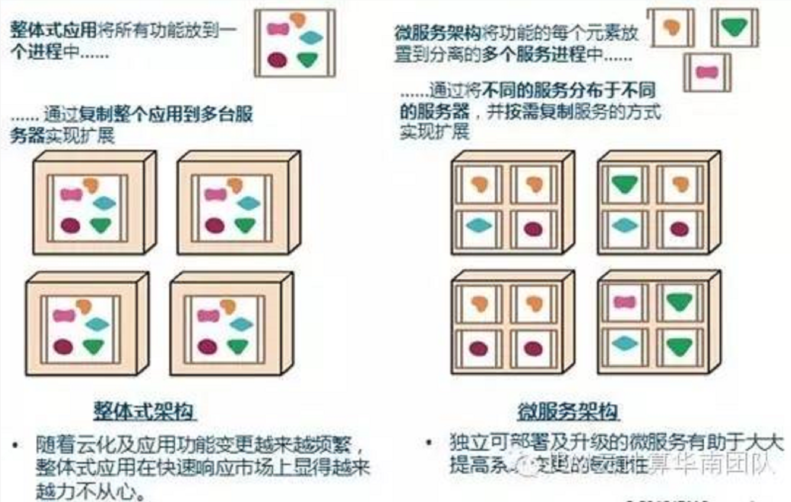

其中，对应用组件封装的方式是整体架构与微服务架构的主要差异，微服务架构将相关联的业务逻辑及数据放在一起形成独立的边界，其目的是能在不影响其他应用组件(微服务)的情况下更快地交付并推出市场。

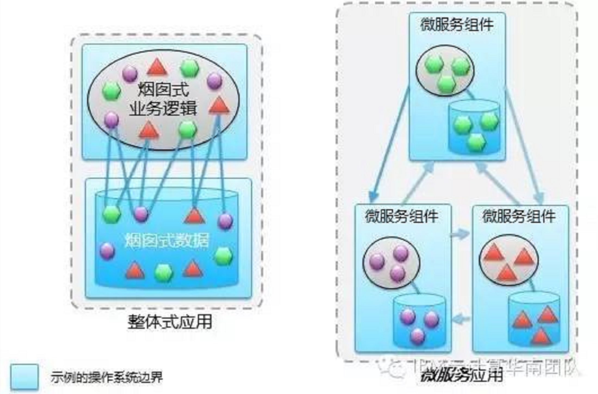

### 微服务架构的一些通用特性

根据MartinFowler的分析，微服务架构有以下的一些通用特性，但并非所有微服务架构应用都必须具备所有这些特性：

1. 通过服务实现应用的组件化(Componentizationvia Services)：微服务架构中将组件定义为可被独立替换和升级的软件单元，在应用架构设计中通过将整体应用切分成可独立部署及升级的微服务方式进行组件化设计。
2. 围绕业务能力组织服务(Organizedaround Business Capabilities)：微服务架构采取以业务能力为出发点组织服务的策略，因此微服务团队的组织结构必须是跨功能的（如：既管应用，也管数据库）、强搭配的DevOps开发运维一体化团队，通常这些团队不会太大（如：亚马逊的“Two pizzateam”- 不超过12人）。

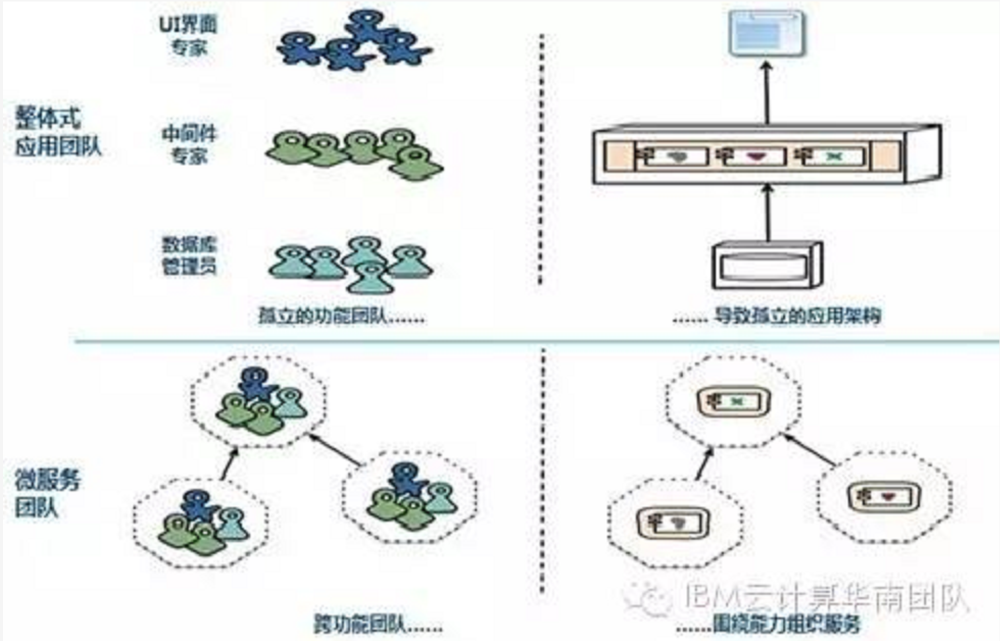

1. 产品而非项目模式(Productsnot Projects)：传统的应用模式是一个团队以项目模式开发完整的应用，开发完成后就交付给运维团队负责维护；微服务架构则倡导一个团队应该如开发产品般负责一个“微服务”完整的生命周期，倡导“谁开发，谁运营”的开发运维一体化方法。
2. 智能端点与管道扁平化(Smartendpoints and dumb pipes)：微服务架构主张将组件间通讯的相关业务逻辑/智能放在组件端点侧而非放在通讯组件中，通讯机制或组件应该尽量简单及松耦合。RESTful HTTP协议和仅提供消息路由功能的轻量级异步机制是微服务架构中最常用的通讯机制。
3. “去中心化”治理(DecentralizedGovernance)：整体式应用往往倾向于采用单一技术平台，微服务架构则鼓励使用合适的工具完成各自的任务，每个微服务可以考虑选用最佳工具完成(如不同的编程语言)。微服务的技术标准倾向于寻找其他开发者已成功验证解决类似问题的技术。
4. “去中心化”数据管理(DecentralizedData Management)：微服务架构倡导采用多样性持久化(PolyglotPersistence)的方法，让每个微服务管理其自有数据库，并允许不同微服务采用不同的数据持久化技术。
5. 基础设施自动化(InfrastructureAutomation)：云化及自动化部署等技术极大地降低了微服务构建、部署和运维的难度，通过应用持续集成和持续交付等方法有助于达到加速推出市场的目的。
6. 故障处理设计(Designfor failure)：微服务架构所带来的一个后果是必须考虑每个服务的失败容错机制。因此，微服务非常重视建立架构及业务相关指标的实时监控和日志机制。
7. 演进式的设计(EvolutionaryDesign)：微服务应用更注重快速更新，因此系统的计会随时间不断变化及演进。微服务的设计受业务功能的生命周期等因素影响。如某应用是整体式应用，但逐渐朝微应用架构方向演进，整体式应用仍是核心，但新功能将使用应用所提供的API构建。再如在某微服务应用中，可替代性模块化设计的基本原则，在实施后发现某两个微服务经常必须同时更新，则这很可能意味着应将其合并为一个微服务。

 

### 微服务的一些常见误解

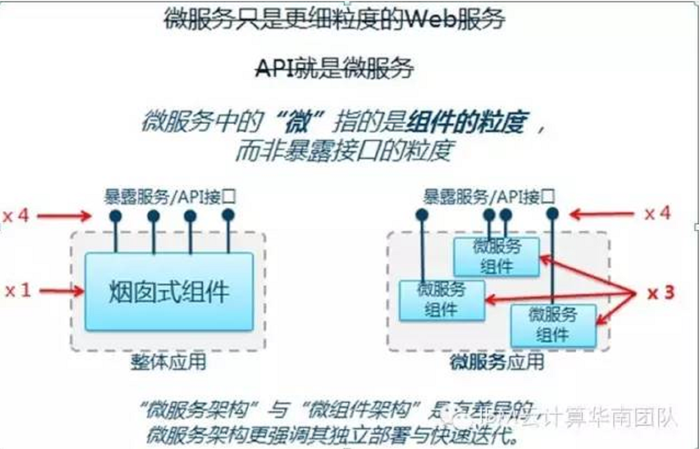

关于一些比较概念的澄清：

1. 在同一范畴内比较才有意义：
   - **微服务架构 vs. SOA** – 两者都是架构风格范畴，但其关注领域与涉及范围不同。SOA更关注企业规模范围，微服务架构则更关注应用规模范围。
   - **微服务组件 vs. 服务组件** – 两者都是描述业务功能的具体实现，其区别在于粒度不同，此外还有在可管理性、灵活性上的差异。
2. 概念混淆的不恰当比较
   - **微服务 vs. SOA – 不恰当的比较**。微服务是组件范畴，而SOA是一种架构设计风格。因此应该比较的是微服务架构与SOA。
   - **微服务 vs. API – 不恰当的比较**。 API是接口，是业务功能暴露的一种机制。微服务架构是用于实施业务功能的组件架构。因此直接比较它们是没有意义的。
   - **微服务 vs. 服务– 不恰当的比较**。“服务”在不同的场景下有不同的含义，需要进一步澄清其描述的语境，是指服务实施、服务暴露、服务定义还是其他？微服务亦是如此，需要有特定语境才可判断比较是否有意义。

 

- **微服务架构与SOA架构的比较**

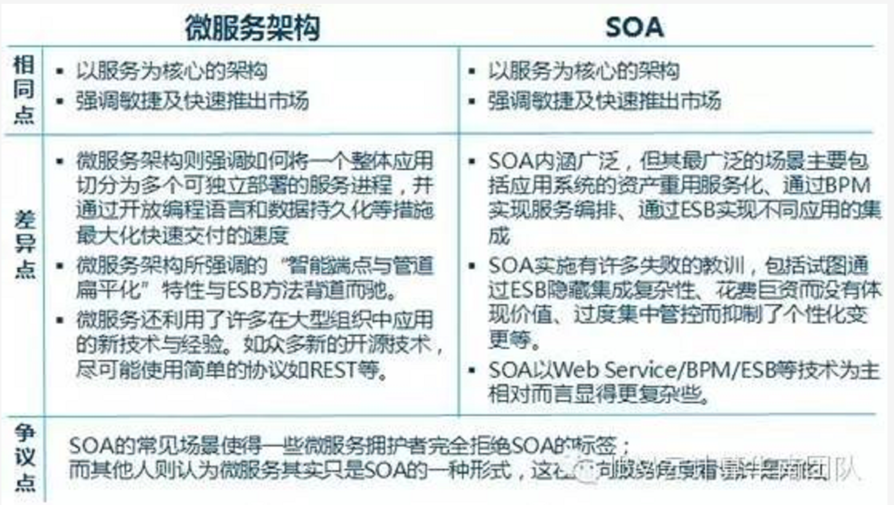

- **一个简单的微服务应用例子：航班预订应用**

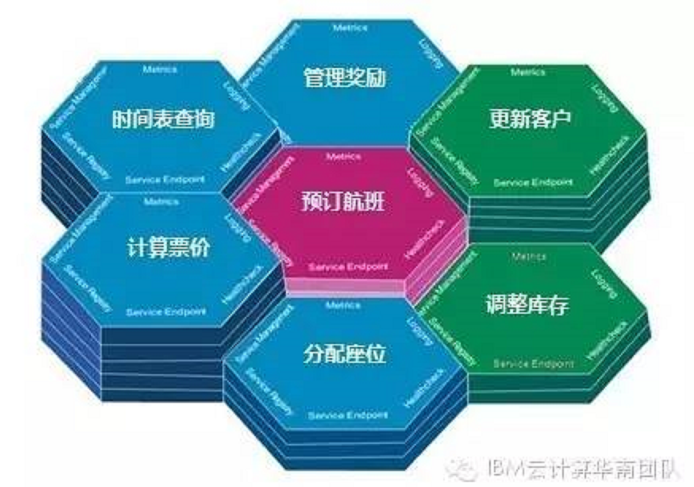

将航班预订应用划分为预订航班、时间表查询、计算票价、分配座位、管理奖励、更新客户、调整库存七个微服务实施。

## 哪些应用会从微服务收益 ？

1. **记录型系统(System of Record)**将从微服务方法中获益最多。例如可将大型应用按相对独立的业务功能分解成若干个微服务实现。
2. **交互型系统(System of Engagement)**也将受益于微服务方法，例如渠道应用可以应用“后端服务前端”的模式实现。
3. **分析型系统(System of Insight)**则可能对微服务受益不多。其他架构模式如管道及过滤模式可能更适用于分析型系统。

 

## 微服务架构的优点：

1. 每个服务都比较简单，只关注于一个业务功能。
2. 微服务架构方式是松耦合的，可以提供更高的灵活性。
3. 微服务可通过最佳及最合适的不同的编程语言与工具进行开发，能够做到有的放矢地解决针对性问题。
4. 每个微服务可由不同团队独立开发，互不影响，加快推出市场的速度。
5. 微服务架构是持续交付(CD)的巨大推动力，允许在频繁发布不同服务的同时保持系统其他部分的可用性和稳定性。

## 微服务架构的缺点：

 微服务的一些想法在实践上是好的，但当整体实现时也会呈现出其复杂性。

1. **运维开销及成本增加**：整体应用可能只需部署至一小片应用服务区集群，而微服务架构可能变成需要构建/测试/部署/运行数十个独立的服务，并可能需要支持多种语言和环境。这导致一个整体式系统如果由20个微服务组成，可能需要40~60个进程。
2. **必须有坚实的DevOps开发运维一体化技能**：开发人员需要熟知运维与投产环境，开发人员也需要掌握必要的数据存储技术如NoSQL，具有较强DevOps技能的人员比较稀缺，会带来招聘人才方面的挑战。
3. **隐式接口及接口匹配问题**：把系统分为多个协作组件后会产生新的接口，这意味着简单的交叉变化可能需要改变许多组件，并需协调一起发布。在实际环境中，一个新品发布可能被迫同时发布大量服务，由于集成点的大量增加，微服务架构会有更高的发布风险。
4. **代码重复**：某些底层功能需要被多个服务所用，为了避免将“同步耦合引入到系统中”，有时需要向不同服务添加一些代码，这就会导致代码重复。
5. **分布式系统的复杂性**：作为一种分布式系统，微服务引入了复杂性和其他若干问题，例如网络延迟、容错性、消息序列化、不可靠的网络、异步机制、版本化、差异化的工作负载等，开发人员需要考虑以上的分布式系统问题。
6. **异步机制**：微服务往往使用异步编程、消息与并行机制，如果应用存在跨微服务的事务性处理，其实现机制会变得复杂化。
7. **可测性的挑战**：在动态环境下服务间的交互会产生非常微妙的行为，难以可视化及全面测试。经典微服务往往不太重视测试，更多的是通过监控发现生产环境的异常，进而快速回滚或采取其他必要的行动。但对于特别在意风险规避监管或投产环境错误会产生显著影响的场景下需要特别注意。

 

## 关于微服务架构的取舍

1. 在合适的项目，合适的团队，采用微服务架构收益会大于成本。
2. 微服务架构有很多吸引人的地方，但在拥抱微服务之前，也需要认清它所带来的挑战。
3. 需要避免为了“微服务”而“微服务”。
4. 微服务架构引入策略 – 对传统企业而言，开始时可以考虑引入部分合适的微服务架构原则对已有系统进行改造或新建微服务应用，逐步探索及积累微服务架构经验，而非全盘实施微服务架构。

# 融入微服务的企业集成架构

将介绍融入微服务的企业集成架构的演进，并描述交互式系统的微服务模式及相关技术决策，然后给出了一个具体的微服务架构业务应用的例子。

## 交互型系统与记录型系统

随着移动互联网的快速发展，企业除了需要提供传统核心IT系统能力之外，还需提供客户与合作伙伴友好型的以交互为重点的创新及交互式系统。这两类系统的特性与禀赋完全不同，因此企业IT的支撑迈入了双速IT时代。

企业微服务架构的引入主要集中在以下两类系统：

- ***记录型系统***：是指传统的应用系统，对应用所关注领域的信息进行增删改查作为应用的核心能力。如CRM、ERP、OA等系统。记录型系统使用的往往是一些传统的经典IT技术构建，往往更难改变，其集成难度也较高。
- **交互型系统**：是指以与用户交互为主要目的而开发的应用系统。如各种移动应用、微信、微博等等。交互型系统更多地会采用现代的各种新技术语言及运行时部署，具体高度的敏捷性，通过简单的现代化连接即可实现集成。

## 融入微服务的企业集成架构

不同的企业背景应该采用不同的微服务架构引入策略：

- **对大型的成熟企业而言**，由于本身已有大量在建的企业IT系统，因此决定了微服务架构仅是其多种应用架构风格之一，大型企业在服务总线与能力开放网关的集成架构下，可以首先从交互型系统入手引入基于微服务架构的应用，逐步积累面向微服务的开发运维经验。另外，对于部分新建的记录型系统，也可以考虑采用微服务架构进行构建，并通过服务总线等SOA集成技术实现与企业遗留系统的信息交互。

- **对于初创企业而言**，由于其没有任何历史包袱，因此可以考虑将企业范围的整体架构以(微)服务架构为基础进行搭建。

- 大型成熟企业在企业集成架构及**不同应用(整体式应用与微服务应用)架构风格中使用的技术及中间件也各有不同**。例如：在整体式应用中往往更强调应用的交易完整性、安全性、数据的一致性等高标准特性，而微服务应用则更强调系统功能的快速上线。因此，这导致了这两类系统所偏好的技术及中间件产品会有差异。下图是在一个企业集成架构中，不同应用及集成所对应的IBM软件产品的示例：

1. 整体式应用使用WAS ND集群化企业级应用服务器和DB2数据库。
2. 微服务应用使用轻量级的WAS Liberty、Node.js，以及NoSQL数据库。
3. 甚至可以考虑将其部署至公有云PaaS平台(如IBM Bluemix)上以充分利用PaaS平台上众多的服务能力。
4. 集成组件使用企业级的IBM Integration Bus服务总线以及API Connect能力开放网关解决方案。

- 在**系统云化方面**，整体式应用与微服务应用也具有不同的偏好。因此，未来的企业必然朝着混合型部署架构演进：

- 企业级**整体式应用部署偏好于系统专用资源模式**，也可根据各个应用特性评估是否**可迁移至企业****私有云**之上以实现企业IT资源优化部署。
- **微服务应用则偏好于生于云端的PaaS平台**，使其可方便地使用各种就绪的底层服务，并采用多样化的编程语言和持久化技术。

## **交互式系统的微服务模式**

交互式系统微服务模式包括多渠道交互层与业务逻辑层：

1. **多渠道交互层**通常采用“后端服务前端”的设计模式。

   

2. **业务逻辑层**则采用微服务架构，通过垂直服务而非水平分层实现对不同业务功能的解耦。

    	 

3. 各业务服务**微服务的依赖关系**是微服务架构设计的一个考虑重点，一个业务服务可以委托给其他业务服务，但需尽量避免循环依赖。需要注意的是每个微服务仍然实现了一个完整的任务，而不是传统的水平分层模式。

 

## **交互式系统微服务架构应用的技术决策**

 1、编程语言的考虑：

1. **Java**：鉴于Java有广大的受众以及其商业软件的企业级保障能力，以及在市场上能够非常容易找到优秀的开发人员，并且Java已开始加速增加最新和最现代的语言特性如Lambda等，**Java仍然是实现****业务逻辑层****的不二之选**。其他语言技术虽然层出不穷，各有优点，但并没出现新的统治级编程语言。
2. **Node.js**：在**交互层**，Node.js是JavaScript服务端的解决方案，结合其他技术组成的**MEAN全堆栈javascript开发框架**（**M**ongo DB – 简单的NoSQL数据库，使用JSON风格存储文档；**E**xpressJS – 是一个Web应用框架，提供有帮助的组件和模块帮助建立一个网站应用； **A**ngularJS – 是一个前端MVC框架；**N**ode.js -是一个并发异步事件驱动的Javascript服务器后端开发平台。），使**Node.js正成为REST服务实施和构建交互式系统方面实上的解决方案**。

 

 2、多样性持久化考虑：使用合适的NoSQL技术存储持久化数据。

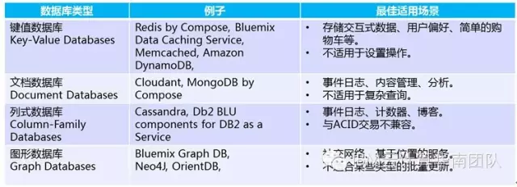

 

**交互式系统基于PaaS云端部署方式**：随着PaaS云技术的日益成熟，企业可以考虑将交互式系统部署于云端，以充分利用PaaS平台上的各种服务。可将应用的Web/移动层迁移到云端，交互模型存储到云端，将记录型系统能力以API形式开放出来实现与交互式系统的连接。

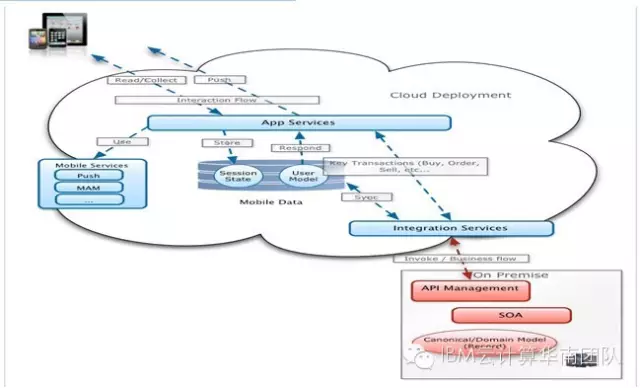

## **交互式系统微服务架构例子**

- 航班预订应用微服务架构设计

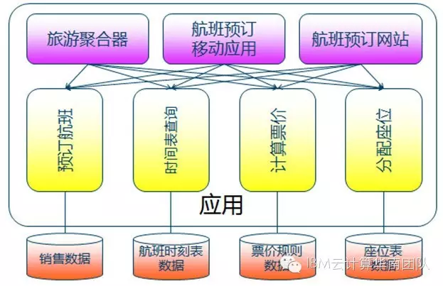

 

- 航班预订应用采用多样化技术满足不同的业务技术特性。

   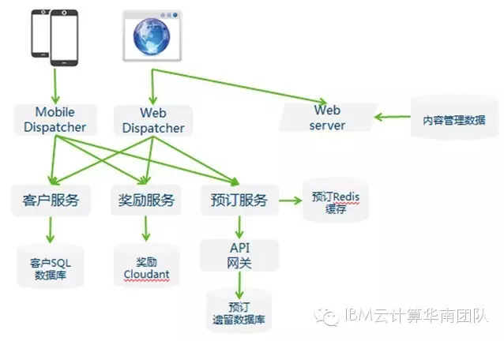

以上内容介绍了融入微服务的企业集成架构的演进，并描述交互式系统微服务模式及相关技术决策，然后给出了一个具体微服务架构业务应用的例子。

# 微服务重构应用及IBM解决方案

将介绍已有IT应用如何进行微服务重构的转型，以及IBM微服务相关解决方案的介绍。

## **微服务转型**

采用微服务架构意味着以更复杂的运维环境为代价，实现更高速的应用交付及更快推出市场。因此企业需要在更快的交付与更复杂的运维之间进行权衡。

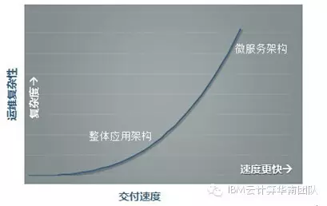

大部分企业都有大量遗留的应用系统，因此对需要更快更好地满足业务需求成为迫切任务时，大部分情况下企业不会全新构建一个完整的应用，通常情况下是企业对**已有应用进行重构**或希望能尽量**重用已有代码**。

向微服务架构演进通常包括以下几个阶段：

1.传统的SOA服务化改造；

\2. 开始引入某些微服务原则，进行针对性重构，如“一个任务一个服务”；

\3. 引入整套完整的微服务原则；

\4. 实现微服务的规模化 – 添加服务发现、服务缩放能力等增强特性。

 

并非所有应用都需要完成上述的各个阶段，一个基本原则是重构解决针对性业务问题，需要避免为了“微服务”而“微服务”化。

 

需要注意的是并非所有应用都可以转变为微服务架构:

- **部分系统无法重构为微服务架构：**例如非常老旧又缺乏维护的系统，对此类系统可以采用“如果应用无法被打破，就不要试图解决它”的策略，其中SOA资产重用化应该是更佳的解决方案。
- **原有应用无法改变数据存储方式：**对这种情况，需要考虑如果数据仍然保持烟囱式或集中式存储，那对应用进行微服务化是否具有业务价值；需要考虑切分数据库是否会导致事务性保障的缺失并进而影响系统的稳定性；同时也可以考虑应用能否采用如BASE、CQRS等模式解决数据的一致性问题。
- **原有系统如何融入微服务架构：**在原有系统中剥离部分功能并重构为微服务时，如何实现微服务与原有系统在高可用性上的隔离，如果原有系统与微服务的扩展性不匹配又如何处理？这些问题也许要在进行微服务重构前考虑清楚。

 

## **微服务重构**

在**重构应用**方面，可通过以下方法梳理微服务：(1)每个REST服务是一个潜在的微服务；(2)每个SOAP web服务或EJB是一个潜在的微服务,特别是无状态的session bean,需要将面向功能的接口重新设计为面向资产的接口，并使接口转变为RESTful形式；(3)使用领域驱动设计(domain-driven design)发现企业资产，这些资产可能是微服务。

在**重构数据**方面，需要考虑以下几个方面：

1. **寻找与其他数据关联不大的数据孤岛**，检查系统的实体-关系图；如果有与其他数据断开的数据，就是一个潜在的数据重构点；
2. **数据表非规范化**，对高规范化数据库中非规范化一些数据表以将数据重组为更大的逻辑块，其目的是增加数据冗余度使其更容易被打破；
3. **反向批数据更新**，对数据重构时需要考虑数据重构失败时可批量地将新数据反向导回旧的数据模式；
4. **使用主数据管理**，对被广泛使用的数据实体组成一个单一的一致性视图，并开发相应的微服务与主数据一起工作；
5. 在SQL数据库中**寻找存储在BLOB(二进制大对象)字段**类型中的代码，转而将这些对象存储在NoSQL数据库中，例如以键值(Key-value)存储方式存储；
6. 寻找活跃的记录模式，与其他无关的Flat对象，使用文档模式数据库进行存储，例如Cloudant或Mongo等。

微服务重构后还需要**重新打包应用**，包括：

1. 分割应用的EAR文件**并打包成独立的WAR文件；**
2. **应用“**一个容器一个服务**”，分别部署每个WAR文件至其自有的WebSphereLiberty实例运行时或Docker容器中；**
3. 分别构建、部署和管理**,为每个WAR文件使用独立的DevOps管线,每个WAR文件独立伸缩和管理。

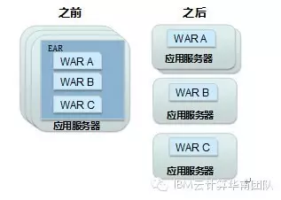

 

## **微服务IBM解决方案**

- **API Connect -** **创建、运行、管理及保护API能力开放和微服务应用的企业级平台。**

企业为了加速应用开发以满足不断增长的需求，需要开放内部的业务和数据能力并吸引合作伙伴及开发者基于其能力快速创新，IBM API Connect为企业提供了一个统一完整的API能力开放平台解决方案，实现API的创建、运行、管理、安全保证和微服务运行环境以满足企业参与API经济的需求。

IBM API Connect平台为数字化应用提供基础能力：

1. 创建微服务并将为其提供对外的API接口；
2. 管理、控制及保护REST和SOAP API；
3. 为企业内外的应用开发者提供自服务的API门户；
4. 将API接口发布到多个开发者门户；
5. 分析API用量和性能指标。

 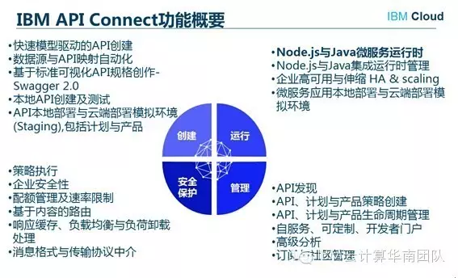

 

- **WAS Liberty+WXS -** **基于OSGi内核，高模块化，高动态性的轻量级WebSphere应用服务器，以及具备企业级高可用性的缓存服务，助力快速交付的微服务应用**

微服务应用要求与各微服务有独立的运行环境，因此传统的应用服务器容器显得过于笨重，因此企业需要使用轻量级的应用服务器容器，但同时还需要考虑完善的技术服务支持。

IBM WAS Liberty是IBM开发的基于Java的**轻量级WebSphere应用服务器**，既满足了创新型应用轻量级的要求，又为企业提供了有效的商业技术支持，避免企业由于使用开源软件而有可能出现的技术支持风险。

 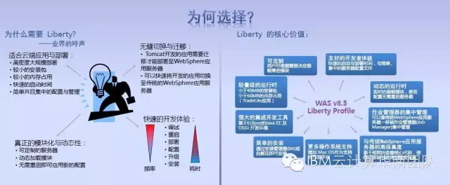
 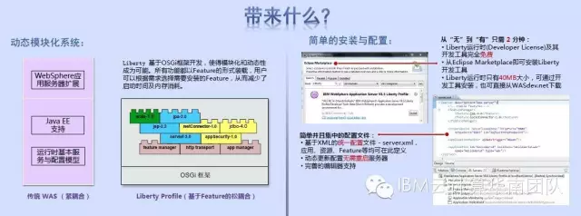
 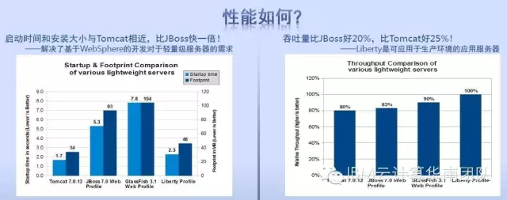

 

   WXS(WebSphere eXtreme Scale)则提供高性能、可扩展的**高速缓存框架和网格技术**，通过多样化数据存储加速微服务应用访问效率。

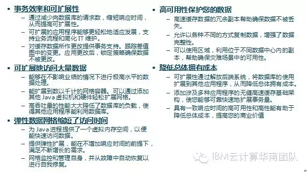

 

- **PureApp+ICO+UCD****组成的混合云框架为企业提供私有云自动化部署的完整解决方案**

微服务应用需要IT基础设施提供多种自动化能力以实现应用的快速上线和自动伸缩。**IBM UrbanCode Deploy、IBM CloudOrchestrator和IBM PureApplication**是三种可供企业客户组合搭配提供包括**企业自动化部署加速应用持续交付、企业私有云自动化弹性伸缩环境和软硬一体化的私有云解决方案**。

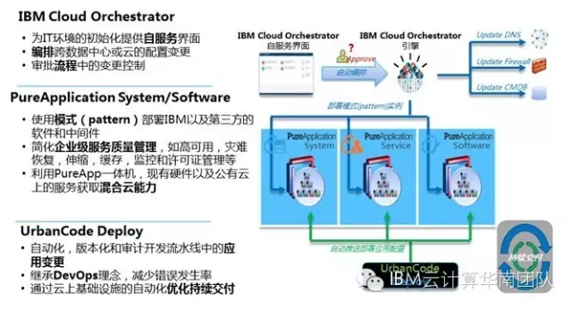

 

- **IBM Bluemix** **创新应用开发平台**

微服务架构提倡使用**多样化的编程语言**和**多样化的存储**，以**最适合的技术**解决业务需求并实现**快速上线**和**自动伸缩**。IBM Bluemix平台能够很好地满足此类需求。

Bluemix 是一个基于开放标准和云的平台，可以用于**应用的快速构建、运行及管理**。Bluemix 由**三大关键的开放计算技术**支撑：**Cloud Foundry, Docker, 以及 OpenStack**。在其上进行了大量服务（目前超过100多种，并且服务数量还在不断增长）的扩展，健壮的 DevOps 工具，集成能力，以及无缝的开发人员体验。

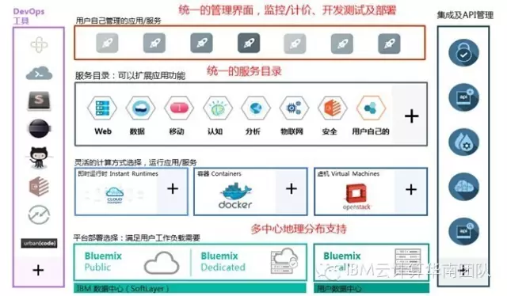

Bluemix四大核心能力提升创新应用交付速度和价值：(1)Bluemix提供一体化运行环境，保证创新应用**秒级上线**；(2) Bluemix提供百余种流行的服务模块，构建应用**简单快速**;(3) Bluemix提供高效管理手段DevOps，保证应用**强健稳定**;(4) Bluemix可以放在本地，又可以无缝连接其公有云，具有**多种部署模式**，让企业具有更大的灵活性，形成**更大的创新生态圈**。

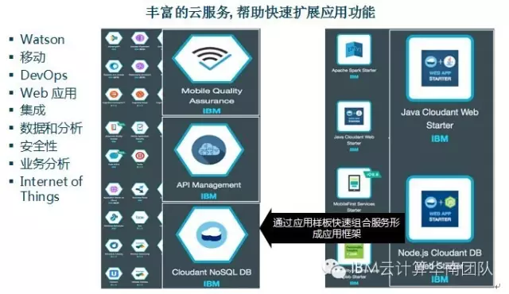

# 参考 #

1. [解析微服务架构(一)：什么是微服务](<https://www.ibm.com/developerworks/community/blogs/3302cc3b-074e-44da-90b1-5055f1dc0d9c/entry/%E8%A7%A3%E6%9E%90%E5%BE%AE%E6%9C%8D%E5%8A%A1%E6%9E%B6%E6%9E%84_%E4%B8%80_%E4%BB%80%E4%B9%88%E6%98%AF%E5%BE%AE%E6%9C%8D%E5%8A%A1?lang=en>)
