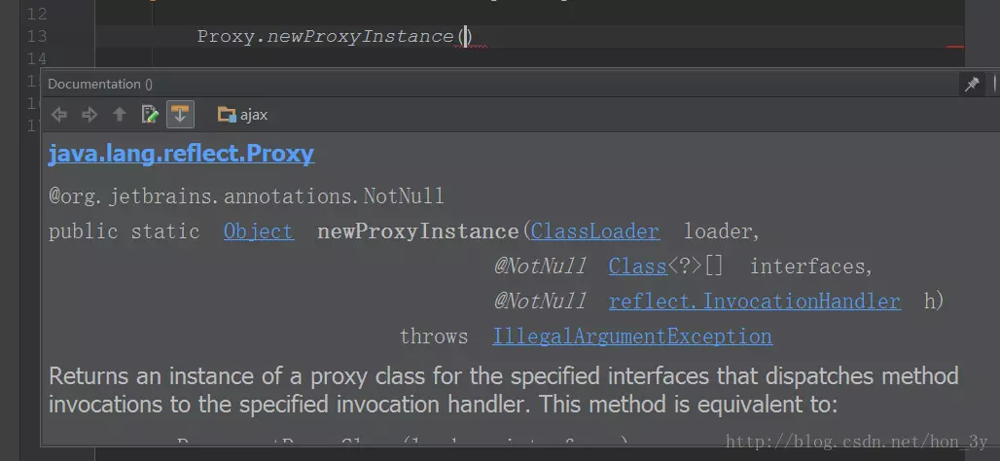
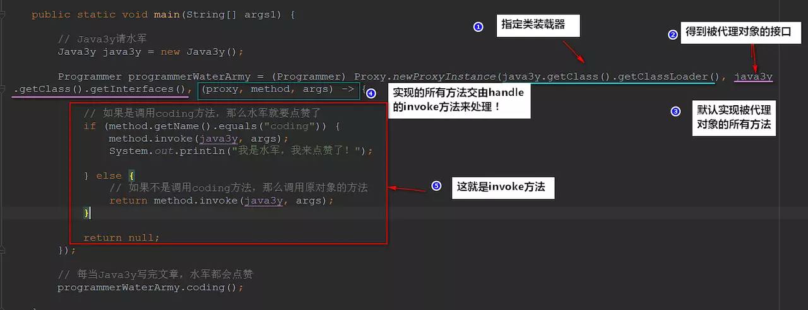
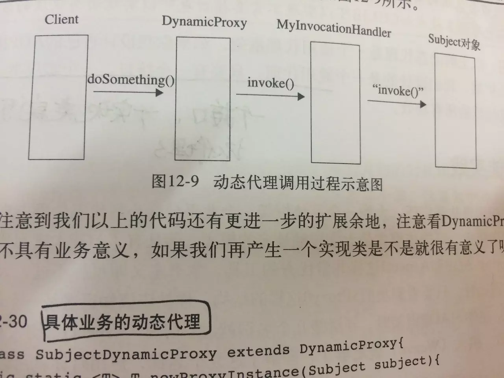

# 代理模式介绍	

代理模式是一种非常好理解的一种设计模式，**生活中处处都有代理**：

- 王宝强作为一个明星，不可能什么事都由他自己干(约电视剧、排期之类的)，于是他请了经纪人
- 去医院挂号很麻烦怎么办？找黄牛帮我们挂号
- 王者荣耀技术水平不够，想要上分怎么办？请游戏代练
- 写点不正经的代码被警察捉走了怎么办？请律师帮我们打官司

无论是经纪人、黄牛、游戏代练、律师他们都是**得帮我们干活**。但是他们**不能一手包办**的，仅仅在“我”的基础上处理一些杂碎的东西(我们不愿意干、或者干不了的东西)。

- 导演找了黄宝强的经纪人**让王宝强去拍电影**！
- 黄牛去排队**让我们能挂上号**！
- 游戏代练上分**是我的微信账号**！
- 律师帮我处理法律上的问题，如果打官司失败，**牢还是由我来坐**！

再举个例子：

- 现在我是一个网红，拥有很多粉丝。粉丝希望我天天写代码给他们看，那我肯定不能天天写代码啊，我岂不是很忙....于是乎，我就去找了个经纪人。这个经纪人就代表了我。当**忠实粉丝**想要我写代码的时候，应该是先找经纪人，告诉经纪人想让我写代码。
- 十年过去了，我越来越红了，**头发也越来越少**。不是粉丝想要我写代码，我就写了。我要收费了。但是呢，作为一个公众人物，不可能是我自己说：我要收10000万，我才会去写代码。于是这就让经纪人对粉丝说：只有10000万，我才会写代码。
- 无论外界是想要我干什么，都要经过我的经纪人。我的经纪人也会在其中考虑收费、推脱它们的请求。
- **经纪人就是代理，实际写代码的还是我**

所以说代理模式就是：**当前对象不愿意干的，没法干的东西委托给别的对象来做**，我只要做好本分的东西就好了！

## 为什么使用代理

我们在写一个功能函数时，经常需要在其中写入与功能不是直接相关但很有必要的代 码，如日志记录，信息发送，安全和事务支持等，这些枝节性代码虽然是必要的，但它会带来以下麻烦：

1. 枝节性代码游离在功能性代码之外，它不是函数的目的，这是对OO是一种破坏
2. 枝节性代码会造成功能性代码对其它类的依赖，加深类之间的耦合，可重用性降低
3. 从法理上说，枝节性代码应该`监视'着功能性代码，然后采取行动，而不是功能性代码 `通知'枝节性代码采取行动，这好比吟游诗人应该是主动记录骑士的功绩而不是骑士主动要求诗人记录自己的功绩

## 定义

- 代理(Proxy)是一种设计模式,定义：为其他对象提供一个代理以控制对某个对象的访问，即通过代理对象访问目标对象.
- 这样做的好处是:可以在目标对象实现的基础上,增强额外的功能操作,即扩展目标对象的功能.

> 这里使用到编程中的一个思想:
>
> 不要随意去修改别人已经写好的代码或者方法,如果需改修改,可以通过代理的方式来扩展该方法

# 静态代理

这里有一个程序员接口，他们每天就是写代码

```Java
public interface Programmer {

    // 程序员每天都写代码
    void coding();

}

```

Java3y也是一个程序员，他也写代码(每个程序员写的代码都不一样，所以分了接口和实现类)

```Java
public class Java3y implements Programmer {

    @Override
    public void coding() {
        System.out.println("Java3y最新文章：......给女朋友讲解什么是代理模式.......");
    }
}

```

此时Java3y已经是一个网红了，他不想枯燥地写代码。他在想：“在写代码时能赚钱就好咯，有人给我钱，我才写代码”。**但是**，Java3y的文笔太烂了，一旦有什么冬瓜豆腐，分分钟变成过气网红，这是Java3y不愿意看到的。

而知乎、博客园这种平台又**不能**自己给自己点赞来吸引流量(-->**当前对象无法做**)

所以Java3y去请了一个**程序员大V(代理)**来实现自己的计划，这个程序员大V会每次让Java3y发文章时，就给Java3y点赞、评论、鼓吹这文章好。只要流量有了，钱就到手了。

```Java
public class ProgrammerBigV implements Programmer {
    
    // 指定程序员大V要让谁发文章(先发文章、后点赞)
    private Java3y java3y ;

    public ProgrammerBigV(Java3y java3y) {
        this.java3y = java3y;
    }

    // 程序员大V点赞评论收藏转发
    public void upvote() {
        System.out.println("程序员大V点赞评论收藏转发！");
    }

    @Override
    public void coding() {

        // 让Java3y发文章
        java3y.coding();

        // 程序员大V点赞评论收藏转发！
        upvote();
    }
}
```

文章(代码)还是由Java3y来发，但每次发送之后程序员大V都会点赞。

```Java
public class Main {

    public static void main(String[] args) {

        // 想要发达的Java3y
        Java3y java3y = new Java3y();

        // 受委托程序员大V
        Programmer programmer = new ProgrammerBigV(java3y);

        // 受委托程序员大V让Java3y发文章，大V(自己)来点赞
        programmer.coding();
    }  
}
```

## 透明代理(普通代理)

经过一段时间，Java3y尝到甜头了，觉得这是一条财路。于是Java3y给足了程序员大V钱，**让程序员大V只做他的生意**，不能做其他人的生意(断了其他人的财路)。

于是乎，程序员大V**只**做Java3y一个人的生意：

```Java
public class ProgrammerBigV implements Programmer {

    // 指定程序员大V要给Java3y点赞
    private Java3y java3y ;

    // 只做Java3y的生意了
    public ProgrammerBigV() {
        this.java3y = new Java3y();
    }

    // 程序员大V点赞评论收藏转发
    public void upvote() {
        System.out.println("程序员大V点赞评论收藏转发！");
    }

    @Override
    public void coding() {

        // 让Java3y发文章了
        java3y.coding();

        // 程序员大V点赞评论收藏转发！
        upvote();

    }
}
```

于是乎，程序员大V想要赚点零花钱的时候直接让Java3y发文章就好了。

```Java
public class Main {

    public static void main(String[] args) {

        // 受委托程序员大V
        Programmer programmer = new ProgrammerBigV();

        // 受委托程序员大V让Java3y发文章，大V来点赞
        programmer.coding();
        
    }
}
```

此时，**真实对象(Java3y)对外界来说是透明的**。

## 代理类自定义方法

程序员大V看到Java3y一直顺风顺水，赚大钱了。觉得是时候要加价了，于是在点赞完毕后就跟Java3y说**每点完一次赞加100块**！

于是乎，程序员大V就增添了另外一个方法：`addMoney()`

```Java
public class ProgrammerBigV implements Programmer {


	// ..省略了上面的代码

    // 加价啦
    public void addMoney() {
        System.out.println("这次我要加100块");
    }

    @Override
    public void coding() {

        // 让Java3y发文章了
        java3y.coding();

        // 程序员大V点赞评论收藏转发！
        upvote();

        // 加价
        addMoney();

    }
}
```

# 动态代理

几年时间过去了，Java3y靠着程序员的大V点赞还是没发财(本质上Java3y还没有干货，没受到大众的认可)。此时已经有很多人晋升成了程序员大V了，但是之前的那个程序员大V还是一直累加着钱...虽然在开始的时候Java3y尝到了甜头，但现在Java3y财政已经匮乏了。

Java3y将自己的失败认为：一定是那个程序员大V转门为我点赞被识破了，吃瓜群众都知道了，他收费又那么贵。

于是Java3y不请程序员大V了，请水军来点赞(水军便宜，**只要能点赞**就行了)：

```Java
public class Main {

    public static void main(String[] args1) {

        // Java3y请水军
        Java3y java3y = new Java3y();

        Programmer programmerWaterArmy = (Programmer) Proxy.newProxyInstance(java3y.getClass().getClassLoader(), java3y.getClass().getInterfaces(), (proxy, method, args) -> {

            // 如果是调用coding方法，那么水军就要点赞了
            if (method.getName().equals("coding")) {
                method.invoke(java3y, args);
                System.out.println("我是水军，我来点赞了！");

            } else {
                // 如果不是调用coding方法，那么调用原对象的方法
                return method.invoke(java3y, args);
            }

            return null;
        });

        // 每当Java3y写完文章，水军都会点赞
        programmerWaterArmy.coding();

    }

}
```

每当Java3y发文章的时候，水军都会点赞。

## 动态代理调用过程

我们来看看究竟是怎么请水军的：

**Java提供了一个Proxy类，调用它的newInstance方法可以生成某个对象的代理对象,该方法需要三个参数：**



- 参数一：生成代理对象使用哪个类装载器【一般我们使用的是被代理类的装载器】
- 参数二：生成哪个对象的代理对象，通过接口指定【指定要被代理类的接口】
- 参数三：生成的代理对象的方法里干什么事【实现handler接口，我们想怎么实现就怎么实现】

在编写动态代理之前，要明确几个概念：

- **代理对象拥有目标对象相同的方法【因为参数二指定了对象的接口，代理对象会实现接口的所有方法**
- **用户调用代理对象的什么方法，都是在调用处理器的invoke方法。【被拦截】**
- **使用JDK动态代理必须要有接口【参数二需要接口】**

上面也说了：代理对象会实现接口的所有方法，这些实现的方法交由我们的**handler**来处理！

- 所有通过动态代理**实现的方法全部**通过`invoke()`调用



所以**动态代理调用过程**是这样子的：



## 静态代理和动态代理的区别

很明显的是：

- 静态代理需要自己写代理类-->代理类需要实现与目标对象相同的接口
- 而动态代理不需要自己编写代理类--->(是动态生成的)

**使用静态代理时：**

- 如果目标对象的接口有**很多方法**的话，那我们还是得一一实现，这样就会比较麻烦

**使用动态代理时：**

- 代理对象的生成，是利用JDK API，**动态地在内存中构建代理对象**(需要我们指定创建 代理对象/目标对象 实现的接口的类型)，并且会**默认实现接口的全部方法**。

# 典型应用

我们之前写中文过滤器的时候，需要使用包装设计模式来设计一个request类。如果不是Servlet提供了实现类给我们，我们使用包装设计模式会比较麻烦。

现在我们学习了动态代理了，动态代理就是**拦截直接访问对象，可以给对象进行增强的一项技能**

## 中文过滤器

```Java
    public void doFilter(final ServletRequest req, ServletResponse resp, FilterChain chain) throws ServletException, IOException {
        final HttpServletRequest request = (HttpServletRequest) req;
        HttpServletResponse response = (HttpServletResponse) resp;

        response.setContentType("text/html;charset=UTF-8");
        request.setCharacterEncoding("UTF-8");


        //放出去的是代理对象
        chain.doFilter((ServletRequest) Proxy.newProxyInstance(CharacterEncodingFilter.class.getClassLoader(), request.getClass().getInterfaces(), new InvocationHandler() {
            @Override
            public Object invoke(Object proxy, Method method, Object[] args) throws Throwable {

                //判断是不是getParameter方法
                if (!method.getName().equals("getParameter")) {

                    //不是就使用request调用
                   return method.invoke(request, args);
                }

                //判断是否是get类型的
                if (!request.getMethod().equalsIgnoreCase("get")) {
                   return method.invoke(request, args);
                }

                //执行到这里，只能是get类型的getParameter方法了。
                String value = (String) method.invoke(request, args);
                if (value == null) {
                    return null;
                }
                return new String(value.getBytes("ISO8859-1"), "UTF-8");
            }

        }), response);

    }
```

# 总结

本文主要讲解了代理模式的几个要点，其实还有一些细节的：比如“强制代理”(只能通过被代理对象找到代理对象，不能绕过代理对象直接访问被代理对象)。只是用得比较少，我就不说了~~

要实现动态代理必须要有接口的，**动态代理是基于接口来代理的**(实现接口的所有方法)，如果没有接口的话我们可以考虑cglib代理。

cglib代理也叫子类代理，**从内存中构建出一个子类来扩展目标对象的功能**！

这里我就不再贴出代码来了，因为cglib的代理教程也很多，与动态代理实现差不多~~~

总的来说：代理模式是我们写代码中用得很多的一种模式了，Spring的AOP底层其实就是**动态代理来实现**的-->面向切面编程。具体可参考我之前写的那篇文章：

其实只要记住一点：**原有的对象需要额外的功能，想想动态代理这项技术**！

# 参考 #

1. 
