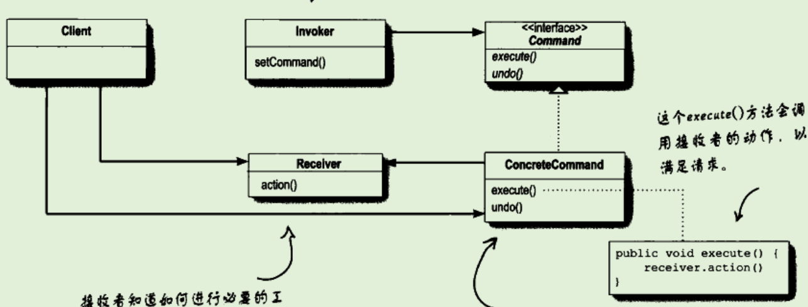

# 命令模式

## 提出问题

## 为什么要用（作用）

- 将“发出请求的对象与“接收与执行这些请求的对象”分离开
- 解耦对象间通过命令对象来沟通，命令对象封装了接受者和一个或一组动作

### 应用场景

- 当有一个遥控器，它需要控制电灯、车门的开关。它不应该去了解电灯开关的具体细节，只需要控制它打开即可

  - 差的设计：

    ```java
    if (slot1 ==light)
    	light.on();
    else if (slot1 == hottub)
    	hottub.jetsOn();
    ```

  - 命令模式：

    - 遥控器是命令的调用者。而启用电灯、开启车门是一项命令。
    - 对于遥控器来讲，执行命令即可，至于命令是什么，是可以随意更换的。是开启电灯、车门不需要关心
    - 命令对象中绑定着接受者，对于开启电灯来讲，具体传递到哪一个电灯，需要绑定到命令中

- 以餐厅考虑。

  - 顾客点餐，在中间涉及到了：顾客、餐单、服务员、厨师
  - 服务员只需要知道这是一份餐单即可，即使餐单更换了也没有影响。服务员不会去关心餐单的信息，只需要接受，然后送给柜台即可。
  - 厨师不需要与服务员交互，只需要获取提交过来的餐单即可。
  - 即实现解耦合

## 基础概述

### 是什么

命令模式：把方法调用封装起来。

将"请求"封装成对象，以便使用不同的请求、队列或日志来参数化其他对象。命令模式也支持可撤销的操作。

### 分类，各个分类是什么

## 基础

### 优缺

### 实现

通过命令对象实现方法，而调用者通过执行命令对象，从而进行动作

#### 实现步骤

- 定义一个命令对象的接口
- 定义一个实现类，实现接口
- 在方法调用类当中，将接口与实现类绑定
- 需要调用方法时，只需要执行命令接口的方法，则无论是哪一个实现类，都可以实现它的方法。

#### 示例

**command接口**

```Java
/**
 * @author Heper
 * @title Command 命令接口
 * @date 2019/4/19 15:33
 */
public interface Command {
    public void execute();

    public void undo();

}
```

**Receiver接收者**

```Java
/**
 * @author Heper
 * @title 接受者 Receiver
 * @date 2019/4/19 15:34
 */
public class Light {
    public void on() {
        System.out.println("on");
    }

    public void off() {
        System.out.println("off");
    }
}
```

**命令对象**

```Java
/**
 * 定义了动作与接收者之间的绑定关系
 *
 * @author Heper
 * @title
 * @date 2019/4/19 15:34
 */
public class LightCommand implements Command {

    Light light;

    //传入实体，以让命令进行控制
    public LightCommand(Light light) {
        this.light = light;
    }

    //发出请求，执行动作
    @Override
    public void execute() {
        light.on();
    }

    @Override
    public void undo() {
        light.off();
    }
}
```

**Invoker调用者**

```Java
/**
 * @author Heper
 * @title 调用者 Invoker
 * @date 2019/4/19 15:36
 */
public class SimpleRemoteControl {
    Command command;

    public SimpleRemoteControl() {

    }

    public void setCommand(Command com) {
        this.command = com;
    }

    public void buttonWasPressed() {
        command.execute();
    }
}
```

**Client**

```java
/**
 * @author Heper
 * @title 客户端
 * @date 2019/4/19 15:38
 */
public class RemoteControlTest {
    public static void main(String[] args) {
        //遥控器，作为命令的调用者
        SimpleRemoteControl simpleRemoteControl = new SimpleRemoteControl();
        //创建请求的接受者
        Light light = new Light();
        //创建命令
        LightCommand lightCommand = new LightCommand(light);
        //命令传递给调用者
        simpleRemoteControl.setCommand(lightCommand);
        //调用者执行
        simpleRemoteControl.buttonWasPressed();
    }
}
```

### 底层原理

#### 与其他的区别

- 为什么接受者一定存在， 命令对象不直接执行execute
  - 尽量设计“傻瓜”命令对象，只懂得调用一个接受者的一个行为。这样解耦程度最高。
  - 可以将接受者作为参数传递给命令。实现多种接受者

### 设计思想

UML类图



## 进阶

命令模式的更多特性：队列请求

命令可以将运算块打包，然后将它传来传去。命令对象可以在不同的线程中调用。因此衍生了一些应用：日程安排、线程池、工作队列等。

**工作队列**：一端添加命令，另一端是线程，从队列当中取出命令，然后调用execute方法

**日志请求：**某些应用需要我们将过去的动作都记录在日志中，并在系统死机后，重新调用这些动作恢复到之前的状态。通过新增两个方法store和load即可实现

## 反省总结

# 参考 #

1. 
