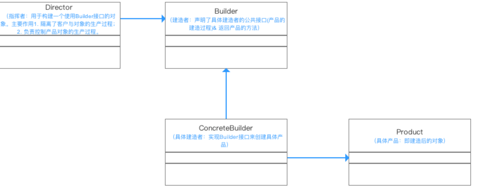

# 建造者模式

## 提出问题

## 为什么要用（作用）

- 方便用户创建复杂的对象（不需要知道实现过程）
- 代码复用性 & 封装性（将对象构建过程和细节进行封装 & 复用）

## 应用场景

## 基础概述

### 是什么

将一个复杂对象的构建与它的表示分离，使得同样的构建过程可以创建不同的表示。

- 用户只需要给出指定复杂对象的类型和内容；
- 建造者模式负责按顺序创建复杂对象（把内部的建造过程和细节隐藏起来)

### 分类，各个分类是什么

## 基础

### 优缺

优点

- 易于解耦 
  将产品本身与产品创建过程进行解耦，可以使用相同的创建过程来得到不同的产品。也就说细节依赖抽象。
- 易于精确控制对象的创建 
  将复杂产品的创建步骤分解在不同的方法中，使得创建过程更加清晰
- 易于拓展 
  增加新的具体建造者无需修改原有类库的代码，易于拓展，符合“开闭原则“。 

> 每一个具体建造者都相对独立，而与其他的具体建造者无关，因此可以很方便地替换具体建造者或增加新的具体建造者，用户使用不同的具体建造者即可得到不同的产品对象。

缺点

- 建造者模式所创建的产品一般具有较多的共同点，其组成部分相似；如果产品之间的差异性很大，则不适合使用建造者模式，因此其使用范围受到一定的限制。
- 如果产品的内部变化复杂，可能会导致需要定义很多具体建造者类来实现这种变化，导致系统变得很庞大。 

### 实现

#### 实现步骤

- 定义组装过程Builder接口
- 定义具体的建造者（Builder的实现）
- 定义产品
- 定义director进行build，获得产品

#### 示例

builder抽象类

```Java
public  abstract class Builder {  

//第一步：装CPU
//声明为抽象方法，具体由子类实现 
    public abstract void  BuildCPU()；

//第二步：装主板
//声明为抽象方法，具体由子类实现 
    public abstract void BuildMainboard（）；

//第三步：装硬盘
//声明为抽象方法，具体由子类实现 
    public abstract void BuildHD（）；

//返回产品的方法：获得组装好的电脑
    public abstract Computer GetComputer（）；
}
```

builder实现

```Java
//装机人员1
  public class ConcreteBuilder extend  Builder{
    //创建产品实例
    Computer computer = new Computer();

    //组装产品
    @Override
    public void  BuildCPU(){  
       computer.Add("组装CPU")
    }  

    @Override
    public void  BuildMainboard（）{  
       computer.Add("组装主板")
    }  

    @Override
    public void  BuildHD（）{  
       computer.Add("组装主板")
    }  

    //返回组装成功的电脑
     @Override
      public  Computer GetComputer（）{  
      return computer
    }  
}
```

产品

```Java
public class Computer{

    //电脑组件的集合
    private List<String> parts = new ArrayList<String>()；

    //用于将组件组装到电脑里
    public void Add(String part){
    parts.add(part);
}

    public void Show(){
          for (int i = 0;i<parts.size();i++){    
          System.out.println(“组件”+parts.get(i)+“装好了”);
          }
          System.out.println(“电脑组装完成，请验收”);


}

}
```

Director

``` java 
public class Director{
	//指挥装机人员组装电脑
	public void Construct(Builder builder){

		builder. BuildCPU();
		builder.BuildMainboard（）;
		builder. BuildHD（）;
        }
 }
```

客户端

```Java
public class Builder Pattern{
  public static void main(String[] args){
    //逛了很久终于发现一家合适的电脑店
    //找到该店的老板和装机人员
      Director director = new Director();
      Builder builder = new ConcreteBuilder();

    //沟通需求后，老板叫装机人员去装电脑
    director.Construct(builder);

    //装完后，组装人员搬来组装好的电脑
    Computer computer = builder.GetComputer();
    //组装人员展示电脑给小成看
    computer.Show()；
    }

}
```


### 底层原理

#### 与其他的区别

### 设计思想

UML类图



1. 指挥者（Director）直接和客户（Client）进行需求沟通； 
2. 沟通后指挥者将客户创建产品的需求划分为各个部件的建造请求（Builder）； 
3. 将各个部件的建造请求委派到具体的建造者（ConcreteBuilder）； 
4. 各个具体建造者负责进行产品部件的构建； 
5. 最终构建成具体产品（Product）。
## 进阶

## 反省总结

# 参考 #

1. [建造者模式（Builder Pattern）- 最易懂的设计模式解析](<https://blog.csdn.net/carson_ho/article/details/54910597>)
