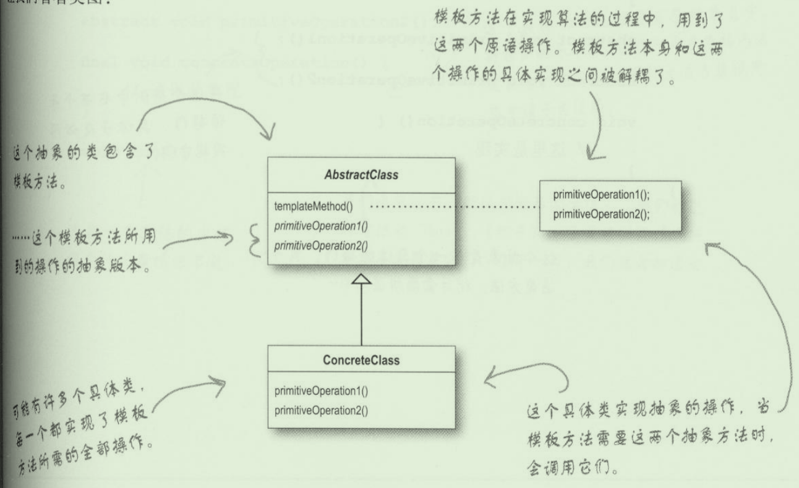

# 模板方法模式

## 提出问题

当多个类当中存在共同或相似的算法，因此有一些重复的代码块（方法）时，因此在这些类当中就有着重复的代码。

## 为什么要用（作用）

- 封装算法块，使得子类可以在任何时候都可以将自己挂接进运算里。

## 应用场景

## 基础概述

### 是什么

> 模板方法模式在一个方法中定义一个算法的骨架，而将一些步骤延迟到子类中。模板方法使得子类可以在不改变算法结构的情况下，重新定义算法中的某些步骤

***模板方法***

骨架prepareRecipe()，步骤即是算法内部的方法。

步骤延迟到子类中，即内部的一些抽象方法

```java
public abstract class CaffeineBeverage{
    //prepareRecipe()是一个模板方法
    //是用来制作咖啡因饮料的算法
   final void prepareRecipe() {
        boilWater();
        brew();
        pourInCup();
        addConiments();
    }

    void boilWater() {
    }

    abstract void brew();

    void pourInCup() {
    }

    abstract void addConiments();
}
```

模板方法原因：

- 是一个方法
- 用做一个算法的模板，在模板当中，算法的每一个步骤都被一个方法代表了。

一些方法由超类处理，即这个类，例如boilWater()

而另一些方法由子类处理，这些方法加上abstract标识，如addConiments()

### 分类，各个分类是什么

## 基础

### 优缺

- 算法存在与模板方法类当中，拥有算法并保护算法，并且容易修改。专注于算法本身
- 模板方法对于子类而言可以将代码的复用最大化。
- 提供了算法框架，新增添的类型可以容易加入

### 实现

#### 实现步骤

```Java
//模板方法的模板类，作为基类，子类必须事先其操作
public abstract class AbstractClass {
    //模板方法，final避免子类改变算法顺序
    final void templateMethod() {
        //定义算法步骤，每个步骤由一个方法代表
        primitiveOperation1();
        primitiveOperation2();
        concreteOperation1();
        hook();
        //利用钩子做判断影响算法流程
        //if(hook()){
        //}
    }
	//子类需要事先的操作
    abstract void primitiveOperation1();

    abstract void primitiveOperation2();
	
    //由超类进行的实现
    //算法的默认流程
    final void concreteOperation1() {
    }
	//一个空的方法，作为钩子，子类视情况决定是否覆盖。
    //子类有能力在算法的不同点进行挂钩
    //当然也可以不是空的
    void hook() {
    }
}
```

***钩子***

- 钩子可以让子类实现算法中可选的部分
- 钩子对子类实现并不重要时可以忽略
- 钩子可以让子类能够有机会对模板方法中某些即将发生的步骤做出反应

#### 示例

### 底层原理

#### 与其他的区别

### 设计思想

UML类图



## 进阶

## 反省总结

# 参考 #

1. 
