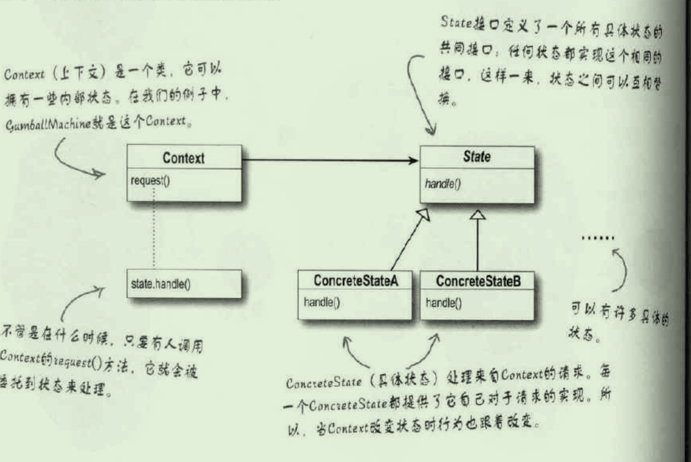

# 状态模式

状态模式与策略模式是双胞胎，在出生时才分开。

## 提出问题

## 为什么要用（作用）

## 应用场景

## 基础概述

### 是什么

状态模式通过改变对象内部的状态来帮助对象控制自己的行为。对象看起来好像修改了它的类。

### 分类，各个分类是什么

## 基础

### 优缺

### 实现

#### 实现步骤

- 首先定义一个state接口，在这个接口当中，每个动作都有一个对应的方法
- 为机器的每个状态实现状态类，这些类将负责在对应的状态下进行机器的行为
- 将动作委托到状态类

#### 示例

**角色类**

```Java
public class Context {
    //持有一个State类型的对象实例
    private State state;
	//可以有多个状态

    public void setState(State state) {
        this.state = state;
    }
    /**
     * 用户感兴趣的接口方法
     */
    public void request(String sampleParameter) {
        //转调state来处理
        state.handle(sampleParameter);
    }
}
```

**状态接口**

```Java
public interface State {
    /**
     * 状态对应的处理
     */
    public void handle(String sampleParameter);
}
```

**具体状态**

```Java
public class ConcreteStateA implements State {

    @Override
    public void handle(String sampleParameter) {
        System.out.println("ConcreteStateA handle ：" + sampleParameter);
    }

}
```

**客户端**

```Java
public class Client {

    public static void main(String[] args){
        //创建状态
        State state = new ConcreteStateB();
        //创建环境
        Context context = new Context();
        //将状态设置到环境中
        context.setState(state);
        //请求
        context.request("test");
        //更改状态，则对象的行为改变
    }
}
```


### 底层原理

#### 与其他的区别

### 设计思想

UML类图



## 进阶

## 反省总结

# 参考 #

1. 
