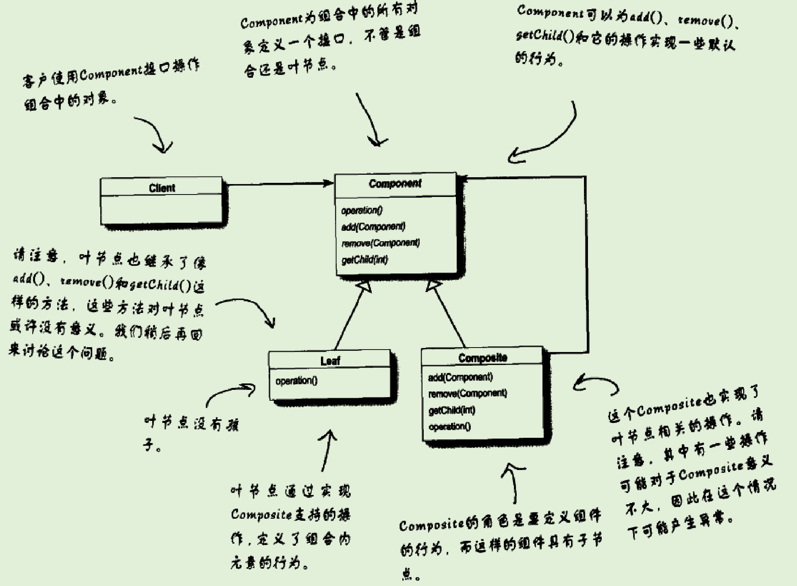

# 组合模式

## 提出问题

## 为什么要用（作用）

## 应用场景

## 基础概述

### 是什么

组合模式允许你将对象组合成树形结构来表现“整体/部分”层次结构。组合能够让客户以一致的方式处理**个别对象以及对象组合**

### 分类，各个分类是什么

## 基础

### 优缺

### 实现

#### 实现步骤

#### 示例

### 底层原理

#### 与其他的区别

### 设计思想

UML类图

## 进阶

## 反省总结

# 参考 #

1. 
