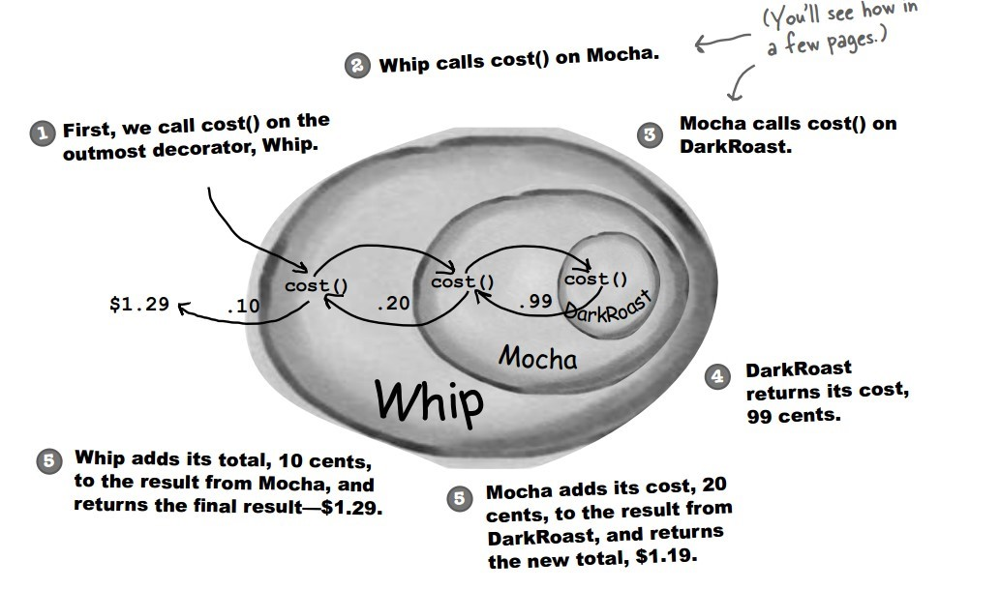

# 装饰者模式

## 提出问题

- 将对象包装起来，赋予他们新的职责

## 为什么要用（作用）

- 为对象动态添加功能。

## 应用场景

## 基础概述

### 是什么

装饰者（Decorator）和具体组件（ConcreteComponent）都继承自组件（Component），具体组件的方法实现不需要依赖于其它对象，而装饰者组合了一个组件，这样它可以装饰其它装饰者或者具体组件。所谓装饰，就是把这个装饰者套在被装饰者之上，从而动态扩展被装饰者的功能。装饰者的方法有一部分是自己的，这属于它的功能，然后调用被装饰者的方法实现，从而也保留了被装饰者的功能。可以看到，具体组件应当是装饰层次的最低层，因为只有具体组件的方法实现不需要依赖于其它对象。


### 分类，各个分类是什么

以饮料为例

- 装饰者：调料
- 具体组件：饮料

饮料可以动态添加新的调料，添加新的功能并不需要修改代码。

## 基础

### 优缺

### 实现

#### 实现步骤

- 设计父类**接口**Component
  - 有着公有的一个方法
- 设计装饰者**类**Decorator实现接口Component
- 设计具体组件**抽象类**ConcreteComponet实现接口Component
- 实现具体组件**类**继承自抽象类
  - 类可以自由添加Decorator，可通过set或者构造器注入

#### 示例

设计不同种类的饮料，饮料可以添加配料，比如可以添加牛奶，并且支持动态添加新配料。每增加一种配料，该饮料的价格就会增加，要求计算一种饮料的价格。

下图表示在 DarkRoast 饮料上新增新添加 Mocha 配料，之后又添加了 Whip 配料。DarkRoast 被 Mocha 包裹，Mocha 又被 Whip 包裹。它们都继承自相同父类，都有 cost() 方法，外层类的 cost() 方法调用了内层类的 cost() 方法。



```java
public interface Beverage {
    double cost();
}
```
```java
public class DarkRoast implements Beverage {
    @Override
    public double cost() {
        return 1;
    }
}
```
```java
public class HouseBlend implements Beverage {
    @Override
    public double cost() {
        return 1;
    }
}
```
```java
public abstract class CondimentDecorator implements Beverage {
    protected Beverage beverage;
}
```
```java
public class Milk extends CondimentDecorator {

    public Milk(Beverage beverage) {
        this.beverage = beverage;
    }

    @Override
    public double cost() {
        return 1 + beverage.cost();
    }
}
```
```java
public class Mocha extends CondimentDecorator {

    public Mocha(Beverage beverage) {
        this.beverage = beverage;
    }

    @Override
    public double cost() {
        return 1 + beverage.cost();
    }
}
```
```java
public class Client {

    public static void main(String[] args) {
        Beverage beverage = new HouseBlend();
        beverage = new Mocha(beverage);
        beverage = new Milk(beverage);
        System.out.println(beverage.cost());
    }
}
3.0
```

### 底层原理

#### 与其他的区别

### 设计思想


## 进阶

## 反省总结

# 参考 #

1. 
