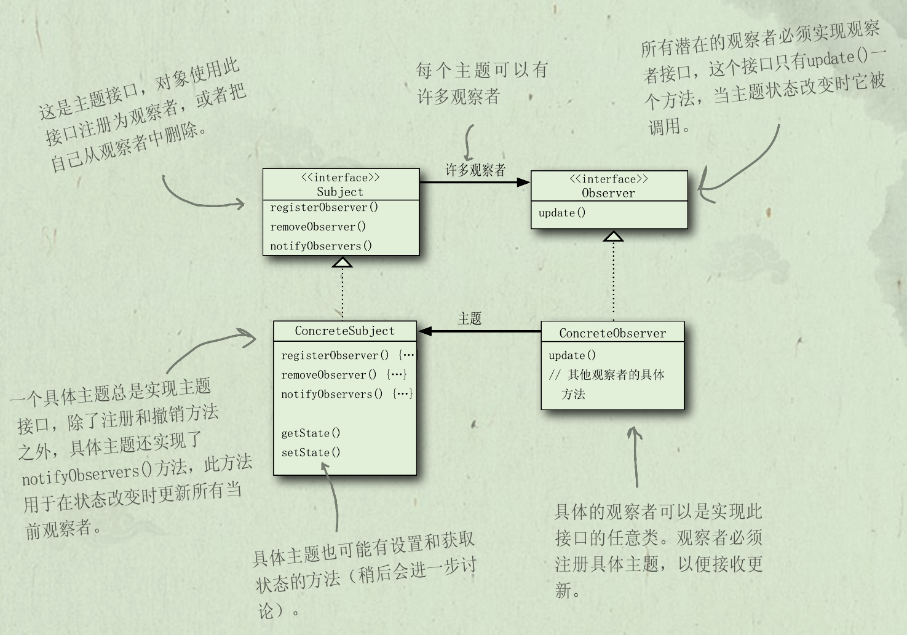

# 观察者模式

## 提出问题

## 为什么要用（作用）

## 应用场景

考虑报纸和杂志的订阅

- 报社的业务就是出版报纸
- 向某家报社订阅报纸，只要他们有新的报纸出版，就会给你送来，只要你是他们的订户，你就会一直收到报纸
- 当你不想再看报纸时，取消订阅，他们就不会再送新报纸过来
- 只要报社还在运营，就会一直有人向他们订阅报纸或取消订阅报纸

在观察者模式当中：出版社为“主题”，订阅者为“观察者”

## 基础概述

### 是什么

> 观察者模式定义了对象之间的一对多依赖，这样一来，当一个对象改变状态时，它的所有依赖者都会收到通知并自动更新

- 帮助对象知晓现状，不会错过该对象感兴趣的事情，对象甚至可以在运行时可决定是否要继续被通知
- 定义了一种对象之间的一对多依赖，这样一来，当一个对象改变时，它的所有依赖者都会收到通知并自动更新
- 可观察者（主题）与观察者

***一对多的依赖关系***

- 主题是真正拥有数据的人 ，观察者是依赖者，只是更新数据，但并不控制数据
- 主题是具有状态的对象，并可以控制状态，观察者使用状态，依赖主题告诉他们状态何时改变

***松耦合***

- 对于观察者的一切，主题只知道观察者实现了某个接口，主题并不需要知道观察者具体是谁。
- 当出现新的观察者或新的具体类，只需要实现观察者接口，并将其注册到主题上即可
- 改变主题与观察者，并不会影响另一方，只要还遵循接口，便可以自由地改变

- 主题对象：管理某些数据
- 观察者对象：订阅（注册）主题，以便在主题数据改变时能受到更新
- 当主题的数据改变便会通知观察者
- 一旦数据改变，新的数据便会以某种形式送到观察者手中

### 分类，各个分类是什么

## 基础

### 优缺

### 实现

实现有两种情景

- 主题进行推送通知
- 观察者拉取通知  

在之后的手动实现中，只考虑推送通知，而拉取通知有Java的内置实现

#### 实现步骤

***IDE支持***

java.util包中包含有最基本的Observer（观察者）接口和Observvable（主题）类，并且可以进行拉取操作

**如何获得观察者**

实现Observer接口，然后使用主题类进行addObserver（）,删除则remove

**主题如何推送通知**

#### 示例

### 底层原理

#### 与其他的区别

### 设计思想

UML

## 进阶

## 反省总结

- 观察者模式定义了对象间一对多的关系
- 主题（可观察者）用一个共同的接口更新观察者
- 观察者与可观察者之间松耦合，二者并不清楚内部的细节
- 使用此模式，可以从观察者处推或拉数据
- 有多个观察者时，不可以依赖特定的观察次序

# 参考 #
1. 
