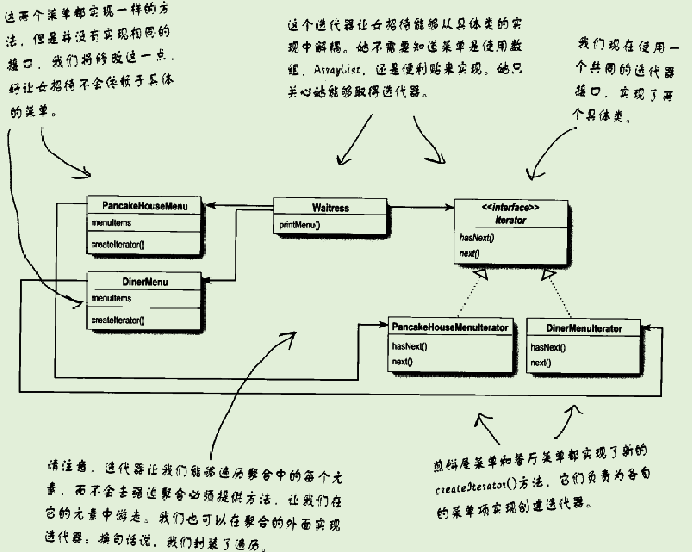
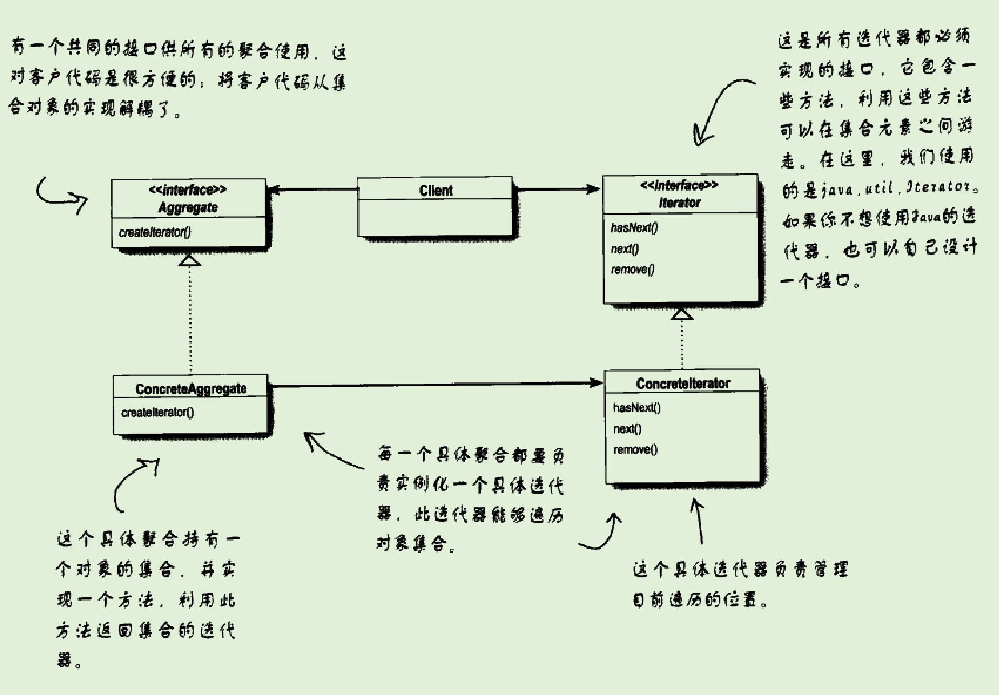

# 迭代器模式

## 提出问题

- 有许多种方法可以将对象堆起来成为一个集合。客户想要遍历的时候，如果让客户看到集合的实现，就有些不优雅。

## 为什么要用（作用）

- 让客户遍历对象，而又无法窥视存储对象的方式。

## 应用场景

- 当有一个ArrayList和一个数组要合并，但是数组对象、ArrayList有很多依赖它的对象和方法。因此不能简单地将数组转换为ArrayList。如果转换，则需要更改它本身的实现
  - 此时，对他们**遍历**就需要写两个循环
  - 对于不同的集合，遍历是变化的部分，则将变化的部分封装起来。即**迭代器**

## 基础概述

### 是什么

迭代器模式提供一种方法顺序访问一个聚合对象中的各个元素，而又不暴露其内部的表示

### 分类，各个分类是什么

## 基础

### 优缺

### 实现

#### 实现步骤

- 依赖于一个名为迭代器的接口

#### 示例

**迭代器接口**

```Java
public interface Iterator{
	//判断是否还有更多的元素
    boolean hasNext();
    //返回下一个元素
    Object next();
}
```

**数组实现迭代器**

- 实现接口方法
- 实现迭代器
- 让对象实现返回迭代器的方法

```Java
//迭代器的实现
public class MenuIterator implements Iterator {
    MenuItem[] items;
    //标记目前遍历到达的位置
    int position;

    public MenuIterator(MenuItem[] menuItem) {
        this.items = menuItem;
    }

    @Override
    public boolean hasNext() {
        if (position >= items.length || items[position] == null)
            return false;
        else
            return true;
    }

    @Override
    public Object next() {
        MenuItem menuItem = items[position];
        position++;
        return menuItem;
    }
}

```

```Java
//对象返回迭代器
public class DinerMenu {
    static final int MAX_ITEMS = 6;
    int numberOfItems = 0;
    MenuItem[] menuItems;

    //返回迭代器接口，客户只需要使用迭代器遍历即可
    public Iterator createIterator() {
        return new MenuIterator(menuItems);
    }
}
```

### 底层原理

#### 与其他的区别

### 设计思想

UML类图





## 进阶

## 反省总结


# 参考 #

1. 
