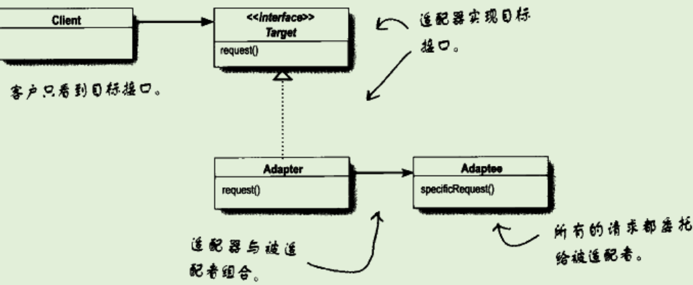
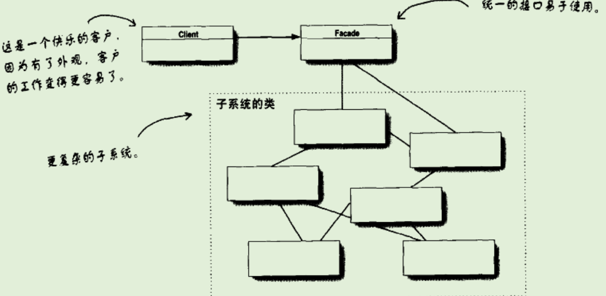

# 适配器模式

## 提出问题

- 将类的接口转换为想要的接口，以便实现不同的接口
- 适配器：我拥有一个三角插头，而只有一个二角的插座，则我需要一个适配器，让我能够重新充电

## 为什么要用（作用）

## 应用场景

- 已有一个软件系统，希望能够与新厂商类库搭配，但是新厂商的接口不同于旧厂的接口
  - 写一个类，将新厂商的接口转换为期望的接口

## 基础概述

### 是什么

适配器模式将一个类的接口转换成客户期望的另一个接口，让原本接口不兼容的类可以合作无间。

### 分类，各个分类是什么

## 基础

### 优缺

- 如果需要实现一个很大的目标接口，要有很多的工作要做
  - 实现一个适配器所需要进行的工作与目标接口的大小成正比
  - 但如果不适用适配器，则需要花更多的力气进行改写工作
- 一个适配器可以封装一个或多个类
- 可以创建一个双向的适配器

### 实现

#### 实现步骤

- 客户通过目标接口调用适配器的方法对适配器发出请求
- 适配器使用被适配接口把请求转换为被适配者的一个或多个调用接口
- 客户接受到调用的结果，但并未察觉到这一切是适配器再起转换作用

#### 示例

鸭子与火鸡：

**Duck**

```Java
public interface Duck {
    public void quack();

    public void fly();

}
```

```Java
public class MallerdDuck implements Duck {

    @Override
    public void quack() {
        System.out.println("Quack");
    }

    @Override
    public void fly() {
        System.out.println("Flying");
    }
}
```

**Turkey**

```Java
public interface Turkey {
    public void gobble();

    public void fly();

}
```

```Java
public class WildTurkey implements Turkey {
    @Override
    public void gobble() {
        System.out.println("Gobble");
    }

    @Override
    public void fly() {
        System.out.println("Fly short time");
    }
}
```

**适配器**

```Java
//实现了Duck接口
public class TurkeyAdapter implements Duck {
    //内部还是turkey
    Turkey turkey;

    public TurkeyAdapter(Turkey turkey) {
        this.turkey = turkey;
    }
	//以turkey的方法转换到Duck的方法
    @Override
    public void quack() {
        turkey.gobble();
    }

    @Override
    public void fly() {
        turkey.fly();
    }
}
```

### 底层原理

#### 与其他的区别

**对象适配器UML类图**



### 设计思想

## 进阶

## 反省总结

# 外观模式

## 提出问题

将一组类转换，提供一个简易接口

## 为什么要用（作用）

## 应用场景

当面对一个场景：需要挑选一个DVD，则需要进行

- 打开爆米花机、开始爆米花、调暗灯光、放下屏幕、打开投影机、输入切换道DVD、打开功放、功放切换道DVD、设置立体声、设置音量、打开DVD、播放DVD
- 倘若关闭，还需要反向操作。非常复杂

## 基础概述

### 是什么

外观模式是一个改变接口的新模式，改变接口的原因是为了简化接口。

外观模式将一个或多个类复杂的一切隐藏在背后，只露出一个干净美好的外观。

**定义：**外观模式提供了一个统一的接口，用来访问子系统中的一群接口。外观定义了一个高层接口，让子系统更容易使用。

### 分类，各个分类是什么

## 基础

### 优缺

- 外观模式允许将客户实现从任何子系统中解耦。
  - 当想要升级自己的家庭影院，只需要修改外观代码即可。不需要去更改底部爆米花机的实现等

### 实现

#### 实现步骤

#### 示例


``` java
public class HomeTheaterFacade {
    //看DVD所需要的全部组件
	Amplifier amp;
	Tuner tuner;
	DvdPlayer dvd;
	CdPlayer cd;
	Projector projector;
	TheaterLights lights;
	Screen screen;
	PopcornPopper popper;

	public HomeTheaterFacade(Amplifier amp, 
				 Tuner tuner, 
				 DvdPlayer dvd, 
				 CdPlayer cd, 
				 Projector projector, 
				 Screen screen,
				 TheaterLights lights,
				 PopcornPopper popper) {
	 
		this.amp = amp;
		this.tuner = tuner;
		this.dvd = dvd;
		this.cd = cd;
		this.projector = projector;
		this.screen = screen;
		this.lights = lights;
		this.popper = popper;
	}
	 //将操作全部封装到外观当中
	public void watchMovie(String movie) {
		System.out.println("Get ready to watch a movie...");
		popper.on();
		popper.pop();
		lights.dim(10);
		screen.down();
		projector.on();
		projector.wideScreenMode();
		amp.on();
		amp.setDvd(dvd);
		amp.setSurroundSound();
		amp.setVolume(5);
		dvd.on();
		dvd.play(movie);
	}

	public void endMovie() {
		System.out.println("Shutting movie theater down...");
		popper.off();
		lights.on();
		screen.up();
		projector.off();
		amp.off();
		dvd.stop();
		dvd.eject();
		dvd.off();
	}
	 
	public void listenToCd(String cdTitle) {
		System.out.println("Get ready for an audiopile experence...");
		lights.on();
		amp.on();
		amp.setVolume(5);
		amp.setCd(cd);
		amp.setStereoSound();
		cd.on();
		cd.play(cdTitle);
	}
	 
	public void endCd() {
		System.out.println("Shutting down CD...");
		amp.off();
		amp.setCd(cd);
		cd.eject();
		cd.off();
	}
	 
	public void listenToRadio(double frequency) {
		System.out.println("Tuning in the airwaves...");
		tuner.on();
		tuner.setFrequency(frequency);
		amp.on();
		amp.setVolume(5);
		amp.setTuner(tuner);
	}
	 
	public void endRadio() {
		System.out.println("Shutting down the tuner...");
		tuner.off();
		amp.off();
	}
}
```
### 底层原理

#### 与其他的区别

UML类图



### 设计思想

## 进阶

## 反省总结

# 参考 #

1. 
