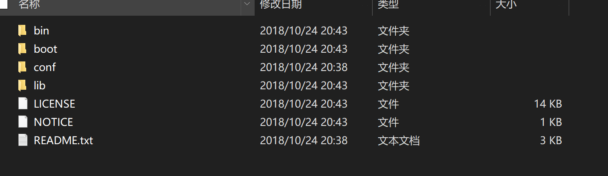
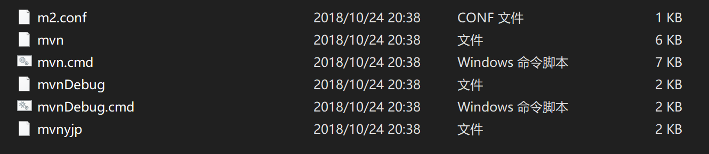
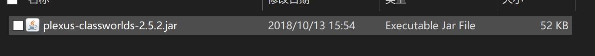
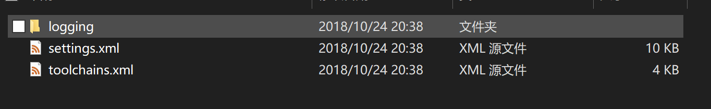
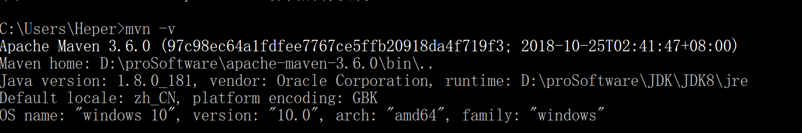

# Maven

## 提出问题

- 当要开发一个新的项目时，需要借助框架如：spring、mybatis，第三方框架。此时需要去各个官网下载各种jar包放到lib目录下
- 此时项目开发并没有开始，但是lib目标拥有很多jar包，并且不知道是否有用、有关联，并且可能存在版本冲突。

## 为什么要用（作用）

Maven是基于项目对象模型（POM），可以通过一小段描述信息来管理项目的构建、报告和文档的软件项目管理工具。

Maven可以帮助我们更有效地管理项目，也是一套自动化构建工具，覆盖编译、测试、运行、清理、打包、部署。提供了一个仓库的概念，统一帮助我们管理第三方的jar包，避免了在你的电脑上可以运行，在我的电脑上不可以运行。

## Maven安装

### Maven目录

maven的文件目录



bin目录。包含mvn的运行脚本，shell当中输入mvn会调用这些脚本



boot目录。包括类加载的框架，maven用来加载自己的类库



conf目录。配置文件



lib目录，maven平时自己会用到的目录

### 配置

用户变量：电脑是多人的话，为不影响他人，在这里配置

系统变量：私人电脑

- 新建一个变量M2_HOME。值为Maven的安装目录

- 修改Path，%M2_hOME/bin%

配置验证：mvn -v



## Maven仓库

***仓库分类***

- local: ~/.m2/repository
- remote 远程仓库
  - 中央仓库http://repo1.maven.org/maven2/ 
  - 私服 http://maven.hellobike.cn/
  - 第三方 jboss、aliyun……

### maven包管理流程

当在pom文件中依赖某个包后，如果没有做特殊配置

1. 到本地仓库进行搜索，若本地仓库没有则下一步
2. 到中央仓库进行获取。

### Mvaen私服

由于中央仓库在国外，因此速度无法保证。

搭建maven私服，保证稳定性。并且可以将一些工具包等放入，提高项目开发的灵活度。

***搭建***

Nexus 是用来搭建 Maven 私服的可以说是唯一的工具，它的官网上是这样说的：“世界上第一个也是唯一的免费使用的仓库解决方案”。目前的最新版本是 OSS 3.x。提供了针对 Windows、Unix、OS X 三种系统的版本。

***配置仓库***

```xml
<mirrors>
	     <mirror>
             <!-- 唯一标识一个mirror -->
      <id>mirrorId</id>
             <!-- 代表了一个镜像的替代位置，例如central就表示代替官方的中央库 -->
      <mirrorOf>repositoryId</mirrorOf>
             <!--描述-->
      <name>Human Readable Name for this Mirror.</name>
     <!--库地址--> <url>http://my.repository.com/repo/path</url>
    </mirror>
    ...
</mirrors>
```

### 配置文件

配置结构：

- localRepository       本地仓库路径
- interactiveMode     值为true/false，true表示mave可以使用用户输入，默认true
- usePluginRegistry   true表示maven使用~/.m2/plugin-registry.xml管理插件版本
- Offline                    true表示构建系统在离线模式下执行
- pluginGroups         当你在命令行中没有提供插件的groupid时，将会使用该列表
- Servers                   账号密码等信息
- Mirrors                   镜像，通过mirrorOf 规则进行匹配
- Proxies                   代理服务
- Profiles                   是pom.xml的profile元素的一个裁剪版本
- activeProfiles          激活Profiles

1. 


## Maven项目

Maven项目与实际项目不是一一对应的关系，而是对应一个模块，一个实际的项目往往有很多个模块

### 项目目录

- src：源代码
  - main
    - java
      - package
    - resources：资源文件
  - test
    - java
      - package
- target
  - classes：编译生成的class字节码文件
    - package
  - maven-status：
  - maven-archiver
  - surefive-reports：生成的测试报告
  - test-classes
  - jar包：mvn package打包后的jar


## maven构建

### maven命令

```shell
mvn -v 		# maven 查看版本
mvn compile # 对项目进行编译，在根目录执行。第一次执行时会下载jar包
mvn test 	# 运行项目的测试
mvn package # 打包项目
mvn clean	# 删除target
mvn install # 安装jar包到软件仓库中
```

### maven引入构建包的流程

- 通过mvn compile编译源代码。如果程序用到了其他的包，会去查找是否引入该依赖包的坐标，即dependency
- 如果引入了这些坐标，会去本地仓库查找。如果仓库中有这些jar包。如果没有，则取网上Maven的中央仓库中查找，并下载下来

### 坐标和仓库

#### 构件

在Maven中任何一个依赖、插件、项目构建的输出均可以称为构件。

所有构件均通过坐标作为其唯一的标识。

基本的坐标：

```Xml
            	<groupId></groupId>
            	<artifactId></artifactId>
            	<version></version>
```

#### 仓库

仓库用来管理项目的依赖

- 本地仓库。如果本地的仓库找不到构件，则去远程仓库寻找

- 远程仓库。默认为全球中央仓库，地址在/bin/maven-model-builder/..../pom.xml当中<repository><url>当中

***镜像仓库***

/maven/conf/setting.xml，在<mirrors>当中

```xml
<mirror>
  <id>mirrorId</id>		<!--该镜像仓库的ID-->、、
  <mirrorOf>repositoryId</mirrorOf>  	<!--为哪个仓库配置镜像，可使用通配符适配-->
  <name>Human Readable Name for this Mirror.</name>
  <url>http://my.repository.com/repo/path</url>
</mirror>
```
### maven生命周期

完整的项目构建过程：清理、编译、测试、打包、 集成测试、验证、部署

***maven常见生命周期：***

- clean：清理项目
  - pre-clean：执行清理前的工作
  - clean：清理上一次构建生成的所有文件
  - post-clean：执行清理后的文件
- vaidate：验证。验证工程配置是否正确
- compile：编译。
- test：单元测试
- package：打包。根据pom描述的打包配置进行打包
- verify：检查。验证工程包有效，并满足质量要求
- install：安装。在本地、远程仓库中安装工程包
- deploy：发布
- default：构建项目
  - compile test package install
- site：生成项目站点
  - pre-site：生成项目站点前要完成的工作
  - site：生成项目的站点文档
  - post-site：
  - site-deploy：发布生成的站点到服务器上

### 插件

build 插件，如package、install、deploy

包括compile test package等都是插件

versions-maven-plugin插件：version管理

## Pom

Pom是Maven项目的核心管理文件，用于项目描述、组织管理、依赖管理和组织信息的管理

### pom文件

- groupId：这是工程组的标识。它在一个组织或者项目中通常是唯一的。若继承parent可不填
- artifactId：这是工程的标识。它通常是工程的名称。
- version：这是工程的版本号。在artifact 的仓库中，它用来区分不同的版本。一般使用语义化版本X.Y.Z规则
- packaging：打包机制，pom、Jar、par、rar、ear、ejb、war、maven-plugin
- parent：用于在子模块对父模块的pom的继承
- modules：子模块
- dependency：依赖
- dependencyManagement：依赖管理，不会被引入到实际的依赖中，定义在父模块，供子模块继承使用
- build：编译、打包
- distributionManagement：Deploy地址
- properties：自定义参数
- profiles：根据环境变量进行配置，使用-P[id]激活，如-Pdev


***版本号***

版本号不写在项目当中，在dependencyManagement当中写，所有子项目的版本就都与父版本一致

#### 实例

```xml
<?xml version="1.0" encoding="UTF-8"?>
<!--pom的根元素，包括一些约束信息-->
<project xmlns="http://maven.apache.org/POM/4.0.0"
         xmlns:xsi="http://www.w3.org/2001/XMLSchema-instance"
         xsi:schemaLocation="http://maven.apache.org/POM/4.0.0 http://maven.apache.org/xsd/maven-4.0.0.xsd">
    
    <modelVersion>4.0.0</modelVersion>    <!--代表当前pom的版本为4.0.0-->
    
    <!--坐标信息-->
    <groupId>com.enet</groupId>    		<!--代表项目的包名-->
    <artifactId>main-cloud</artifactId> <!--代表模块名-->
    <!--第一个0代表大版本号，第2个代表分支版本号，第3个代表小版本号-->
    <!--snapshot快照、alpha内部测试、beta公测、Release稳定、GA正式发布-->
    <version>0.0.1SNAPSHOT</version>		<!--代表版本名。-->
    <name></name>	<!--项目的描述名-->
    <url></url>		<!--项目的地址-->
    <description></description>			<!--描述-->
    <packaging>pom</packaging><!-- packaging: 打包的机制，如pom, jar, maven-plugin, ejb, war, ear, rar, par   默认为jar-->
    
    <properties>
       <!--在其他地方可以通过$(junit.version)对值进行引用-->
        <junit.version><!--可以声明一个值--></junit.version>
    </properties>
    
    
	<parent>	<!--用于在子模块对父模块的pom的继承-->
        <groupId>com.enet</groupId>
        <artifactId>main-cloud</artifactId>
        <version>1.0-SNAPSHOT</version>
        <relativePath>./pom.xml</relativePath> <!-- lookup parent from repository -->
    </parent>
    
    <modules><!--定义多个模块，一起进行编译-->
    </modules>
    
    <dependencyManagement><!--依赖的管理，不会被引入到实际的依赖中，定义在父模块，供子模块继承使用-->
        <dependencies>
            <dependency>
            	<groupId></groupId>
            	<artifactId></artifactId>
            	<version></version>
                <type></type>
                <scope></scope><!--依赖范围，如果值为test，则只在测试时该jar包有效-->
            </dependency>
        </dependencies>
    </dependencyManagement>
    
    
    <dependencies><!--依赖列表-->
        <dependency>
            <groupId></groupId>
            <artifactId></artifactId>
            <version></version>
            <type></type>
            <scope></scope><!--依赖范围-->
            <optional></optional><!--设置依赖是否可选，默认为false即是继承，true则必须显式引入该依赖-->
            <exclusions><!--排除依赖传递列表，如A依赖B，B依赖C，则C传递依赖A，即在导入B包的依赖时，会导入C-->
                <exclusion></exclusion><!--排除传递依赖的C，避免依赖冲突-->
            </exclusions>
        </dependency>
    </dependencies>
    
    <build>		<!--为构建的行为做支持-->
        <plugins><!--导入maven的插件-->
            <plugin>
               	<groupId></groupId>
            	<artifactId></artifactId>
                <version></version>
                <executions><!--可选-->
                    <execution>
                        <phase><!--示例值：package-->
                            <!--绑定的生命周期的阶段，即在哪个阶段运行这个插件，如在package阶段，则会在mvn package的时候运行source--></phase>
                        <goals></goals><!--运行目标-->
                    </execution>
                </executions>
            </plugin>
    	</plugins>
    </build>
</project>
```

### 依赖

#### 依赖范围

将jar包引入项目的classpath当中，项目就可以使用该jar包当中封装好的方法了

maven提供了三种classpath:

- 编译
- 测试
- 运行

在dependency当中导入jar包时，scope的值代表了jar包存在哪个classpath当中，当值为test时，则该jar包将只存在于测试的classpath当中

#### 依赖传递

依赖存在传递性，当依赖于A的时候。导入A的依赖时，就会将A所依赖的jar包也导入进来

当需要清除掉传递依赖所需要的jar包时，就需要使用exclusion

#### 依赖冲突

当A和B依赖了同一个不同版本的构件，就存在了依赖冲突

Maven解决：

- 短路优先
  - A->B->C->X
  - A->D->X（短路，则优先，导入该X的版本）
- 先声明先优先。如果路径长度相同，则谁先声明，先解析谁

### 聚合和继承

如果我们想要将多个项目进行install，将其安装到本地仓库中，需要对多个项目依次进行install。

***聚合***

maven当中有种方式可以将其放在一起运行，这种方式称为聚合。

聚合标签<modules>

***继承***

在多个项目当中，存在共同的一些依赖，可以像Java当中进行继承。

父类继承标签

```xml
<!--在该标签内的依赖，是不会再该项目当中运行，会继承给子类。-->
<dependencyManagement><!--依赖的管理，不会被引入到实际的依赖中，定义在父模块，供子模块继承使用-->
    <dependencies>
        <dependency>
        	<groupId></groupId>
        	<artifactId></artifactId>
        	<version></version>
            <type></type>
            <scope></scope><!--依赖范围，如果值为test，则只在测试时该jar包有效-->
        </dependency>
    </dependencies>
</dependencyManagement>
```

子类继承

```xml
<parent>	<!--用于在子模块对父模块的pom的继承-->
    <groupId>com.enet</groupId>
    <artifactId>main-cloud</artifactId>
    <version>1.0-SNAPSHOT</version>
    <relativePath>./pom.xml</relativePath> <!-- lookup parent from repository -->
</parent>
```

# 参考 #

1. [项目管理利器——maven](<https://www.imooc.com/learn/443>)
