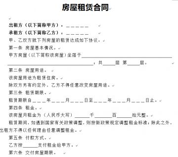

# 租房途径

# 房屋

## 基本信息

确认合同前再次确认房屋设施情况并进行拍照留存，还可以列举详细的清单并附在合同之后。

- 房屋状态
  - 卧室
    - 隔音情况、是否有刺鼻气味（甲醛）、门窗、桌椅等设施是否有损毁，房屋的清洁状况。
    - 如果你是与男女朋友/闺蜜/兄弟等合租，可以考虑租住带有独卫的主卧，会给生活带来相对大的便利，在一定程度上提高生活质量，避免合租矛盾。
    - 观察房屋有没有毛病，如裂缝等，留证照片
  - 厨卫
    - 厨房/卫生间的大小是否合适，是否通风，采光是否良好
    - 燃气设施/热水器等是否有老化现象，是否可用，是否存在安全隐患
    - 马桶是否好用，冲水是否流畅（一言难尽）。厕所是否干净，不干净的千万别租，以后会被恶心死，特指合租
    - 热水器是否好用
  - 房屋设施
    - 水管、门锁、电器、通风等设备的情况是否存在安全隐患，签订合同之前和房东一起确认房屋内家具设施的情况，如有损坏能否进行更换。以及确定入住之后能否换锁。
    - 热水器，冰箱，燃气，衣柜，桌椅，门锁，床，空调，路由器，洗衣机等生活必须设施是否齐全。是否可以“拎包入住”。如果是合租，哪些设施是公用，哪些设施是私用等。
- 室友
  - 尽量向房东/中介方租房管家了解本户已经入住的室友的相关信息。了解信息包括但不限于：已有几间房出租，每间房租客人数，合租室友性别分布，合租室友职业等。
  - 户型不过三
  - 不带孩子、老人长辈、
- 周边
  - 通勤时间，公交是否方便或到就近的地铁站需要多久； 
  - 周围是否有工地，如果周围有工地、装修，十有八九会非常影响休息，建议不选； 
  - 周边的治安状况，如小区是否有门禁及物业安保值守，人口是否相对密集； 
  - 周边设施是否齐全或方便，重点可以留意一下附近的超市、吃饭、药房、社区医疗状况和医院。 
  - 其他个性化要求。

## 合同

### 准备：

- 由于租房合同一般会在看房后立即签订，因此请准备好：**身份证和租金**。
- 鉴于目前甲醛超标问题严重，可以携带**甲醛测试器**实地看房。

### 合同

1.要和房东当面签，一定要当面签！有些租客嫌麻烦，让对方拍照房本和身份证，结果对方P一张图，最后被骗。**千万不要相信对方工作忙，没有空见面签约的说辞，谨防受骗。**

2.**合同签订对象是个人还是公司**，现在有些公司代理了房子，然后随意改装，抬高价格，或者最后以各种理由不退押金，到时候发现自己吃了亏却无力反击。

3.**签的合同是否是银行贷款合同，**有些平台会和租户签银行贷款合同，让租户用支付宝操作，这样租户没有及时交租就会影响个人征信，所以签约时一定要看清楚，问清楚，千万不要随便点击！

4.房东信息要明确，房主姓名、身份证号、手机号等，这里注意一定要是拥有房子的产权的人，不要和二房东签了合同还不自知。

5.明确清楚租期内退房是否需要赔付，能否转租，押金是否给退。有些房东在你住进去的时候，会说想走随时可以走，但是他不会告诉你后半句**“押金是一分不退的”**。不要等到要走的那一刻才发现不退押金哇，小吉是吃过这个亏的。

6.需要租客支付的费用有哪些，房租、水电、管理费、网费、押金，是否还有其他费用，需要确认清楚并分项列出。

7.是否可以对房屋进行改造，可以改造的程度明确清楚。

8.目前家中的物品有哪些，在合同上面写明，小心走的时候，房东要你赔根本不存在的XXX。有必要的话，就拍照留证据。小吉还碰到过租房换家私的，当时没能拍照，只能吃哑巴亏！

9.家私发生损坏，由谁负责，明确清楚。

10.记录水电表的数字，确认宽带和水电是否有欠费。

11.请务必把合同一字不漏，认真查看，**小心文字陷阱**，可以先在百度上看看租房合同模板。

12.凡是能想到的一切有关自身利益的问题，请都在合同上面明确清楚，不要听信房东说的，“行情都是这样”，“没问题的”等等之类的话。到时候他翻脸不认人，哭的可是你。

13.最最最重要的一点：**永远不要相信房东！**虽说做人的原则是诚信，但是小吉发现这个在社会上不成。大把人为了钱做着违背原则的事情，无理由克扣押金、涨租，反正房子不愁租，要租房的是我们，我们又能怎么样呢。

### 签约

- 出租人的基本信息，包括出租人的房屋权属证明原件、产权证（使用证）、身份证号、联系方式（如通过中介也可以添加中介人的联系方式）等，确认是否是原始房东，而其中**请务必注意房产证上的房东信息是否与合同上的相符。**如果是房东的亲戚来代理房东进行出租，则务必留意是否有授权委托书并签订出租委托合同；转租则应该在房东或代理人的见证下签订合同，注意合同的终止日期不应超过原租赁合同的终止日期。 
  - 防止假身份证
  - 审查合同主体是否合格，即出租人与承租人是否具备相应条件，租赁客体，即房屋是否为法律、法规允许出租的房屋。需要房屋租赁许可证
- 明确租赁期限，租金标准、支付时间以及支付方式（月付、季付、年付），是否有押金，并能够提供租金收据，这关系到你能住多久。另外合同里应注意确认押金退还的方式。 
- 明确租客是否可以转租，因为一些情况有可能你会要换地方住而租赁期限没到，而如果进行擅自转租房东是有权利扣押金且收回房子的，这种情况下如果不允许转租则违约费用是多少；以及如果出租人逾期交房或出租人擅自提前收回房屋，约定支付的违约金是多少。 
- 明确租赁期间房租是否可以涨价。 
- 确定租金、押金、**水电费（可能是商用电）**、煤气费、物业费、电视费、网费等金额细项（如应该平摊还是代缴，其中物业费如果在合同内并无缴费的具体要求，则出租人无权要求承租人支付物业费），明确费用交付渠道，并将具体费用写入合同。这里是为了确保在入住前上一位租客已结清相关费用。 
- 明确损坏设施赔偿的细则，如在人为损坏、非人为损坏、自然损耗等场景下是否需要赔偿以及赔偿的细则。 
  - 明确房屋内部的东西与新旧情况，清点设施确实正确运行。房屋维修费用等作出约定
- 对模糊的细节一定注意问清并落实到纸面，如“退房时没有打扫干净要扣押金”中，“干净”应该是什么程度，并注意保留记录录音和租房前的房屋照片。 
- 拍照存档。包括但不限于房屋设施情况细节、租房合同、补充协议以及水表电表数额，注意签合同之前要重新与房东清点家具和电器等设施。 
-  补充说明，如对住房情况不满意，应提前与房东或中介沟通好，决定退房时应提前至少半个月向房东提出，避免浪费双方的时间以及损害自己的信用。

# 参考 #

1. 
