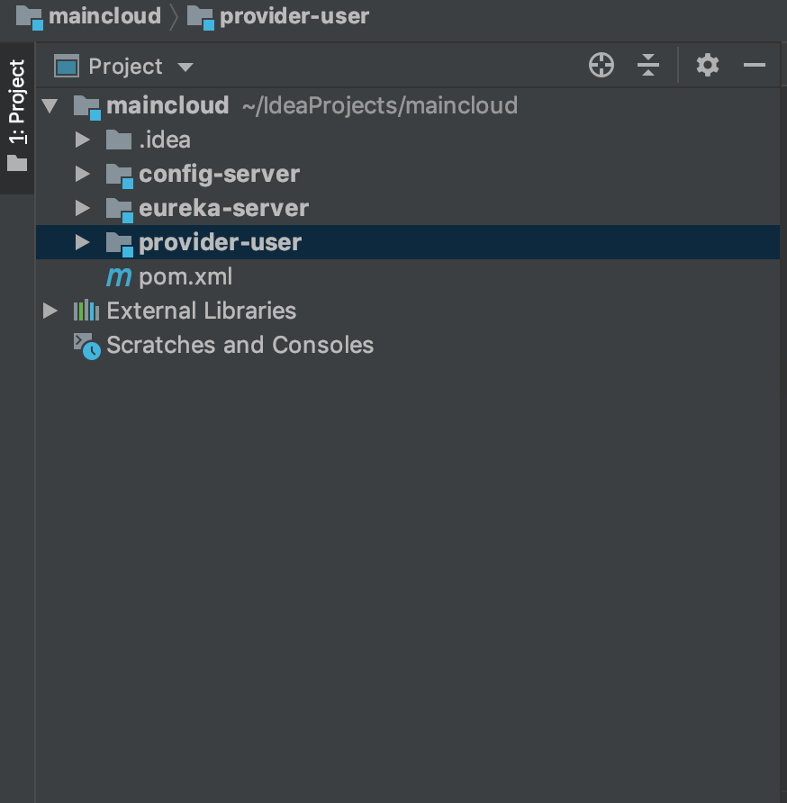
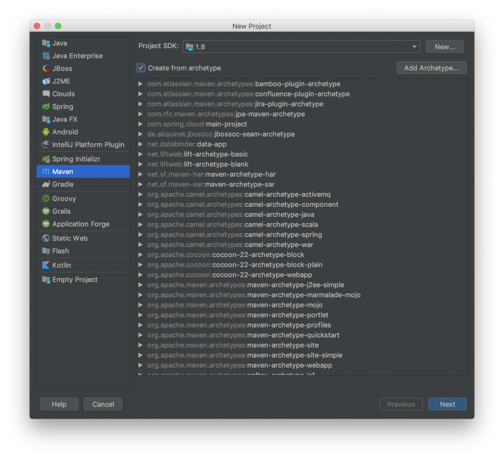
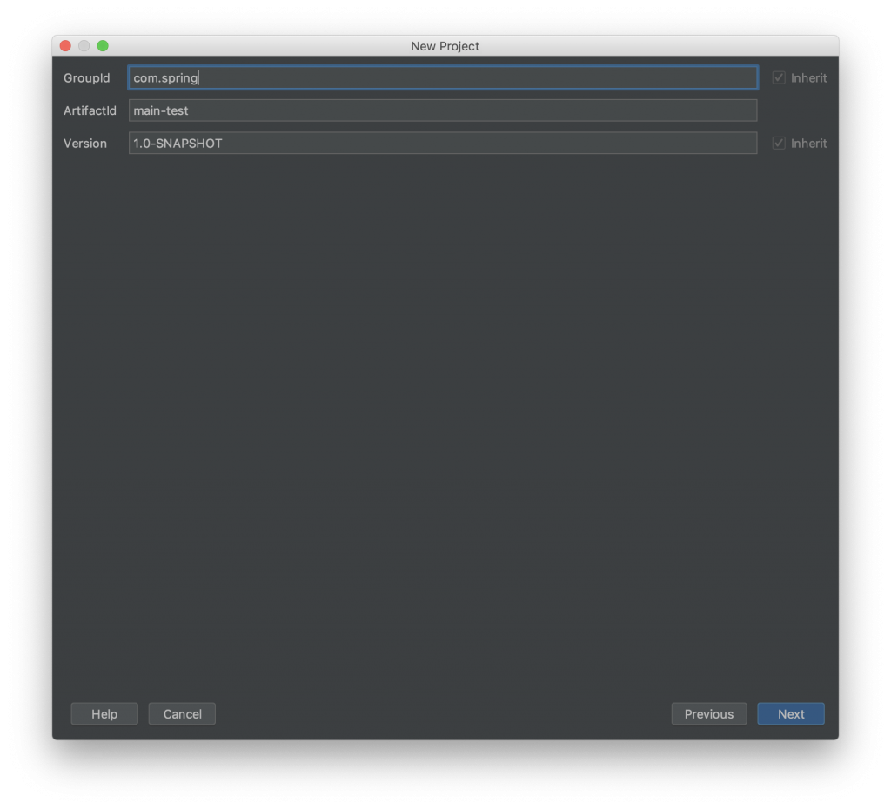
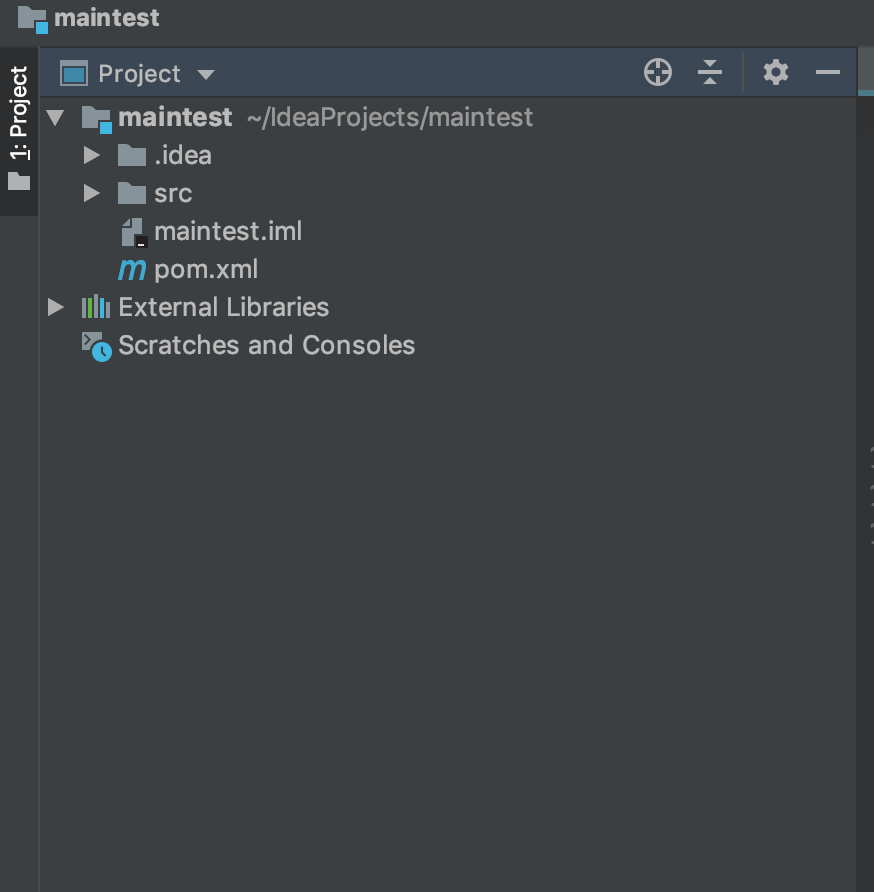
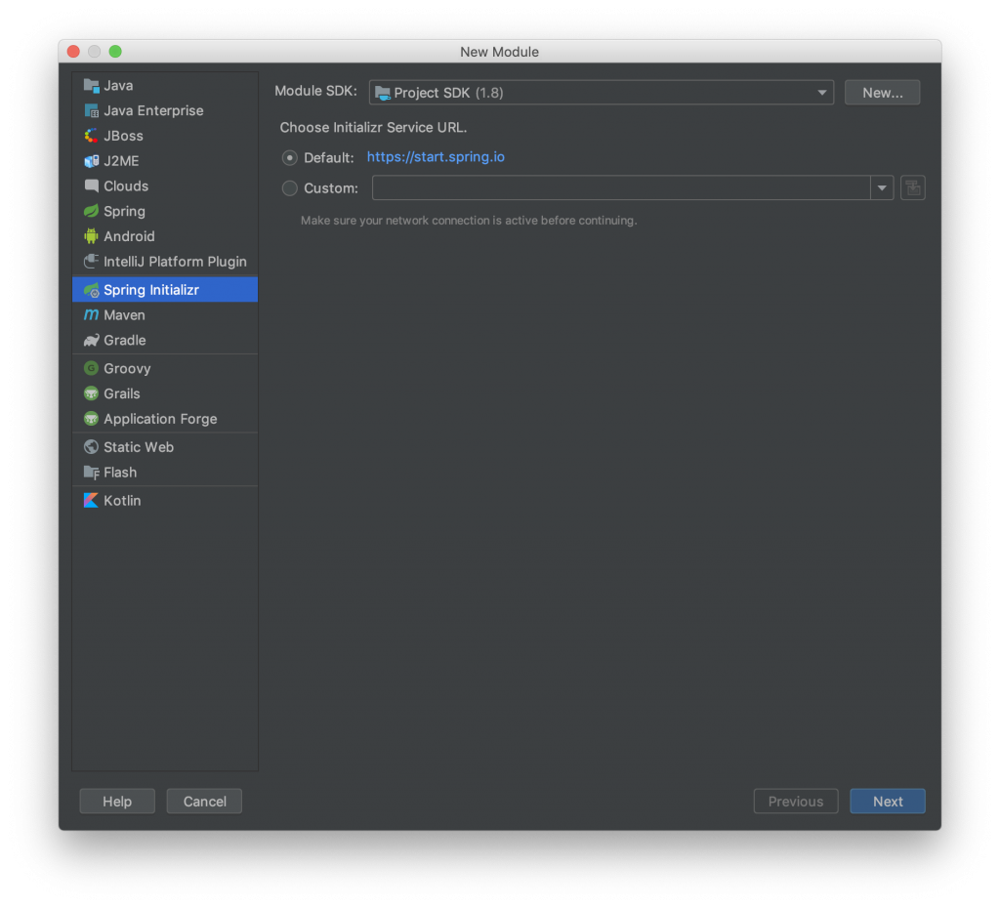
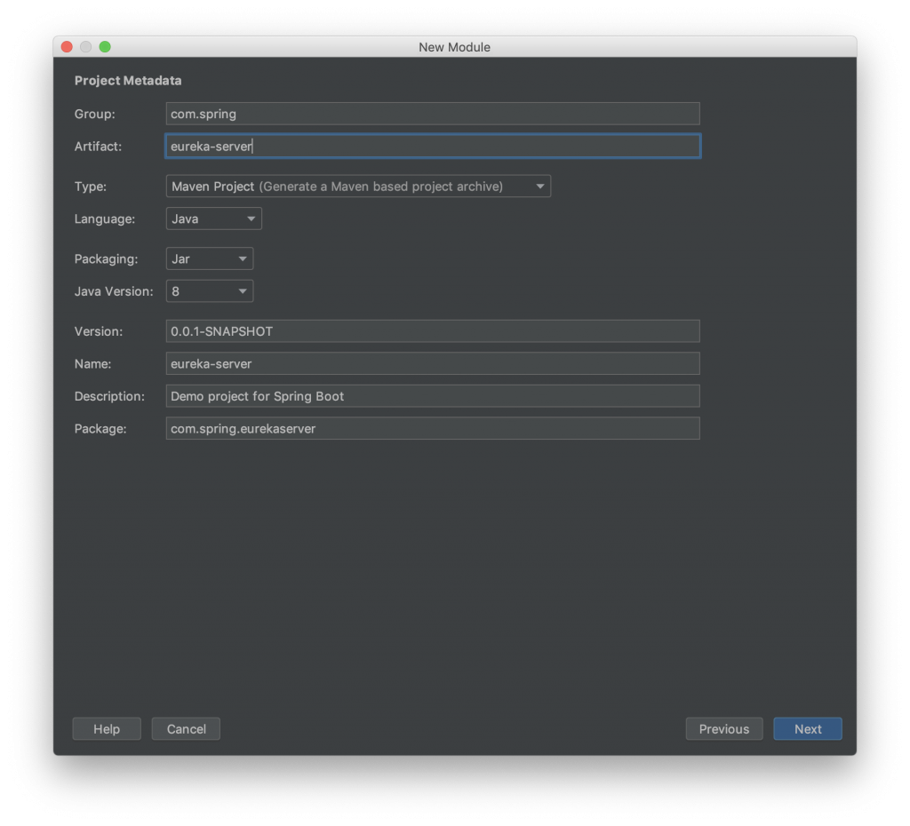
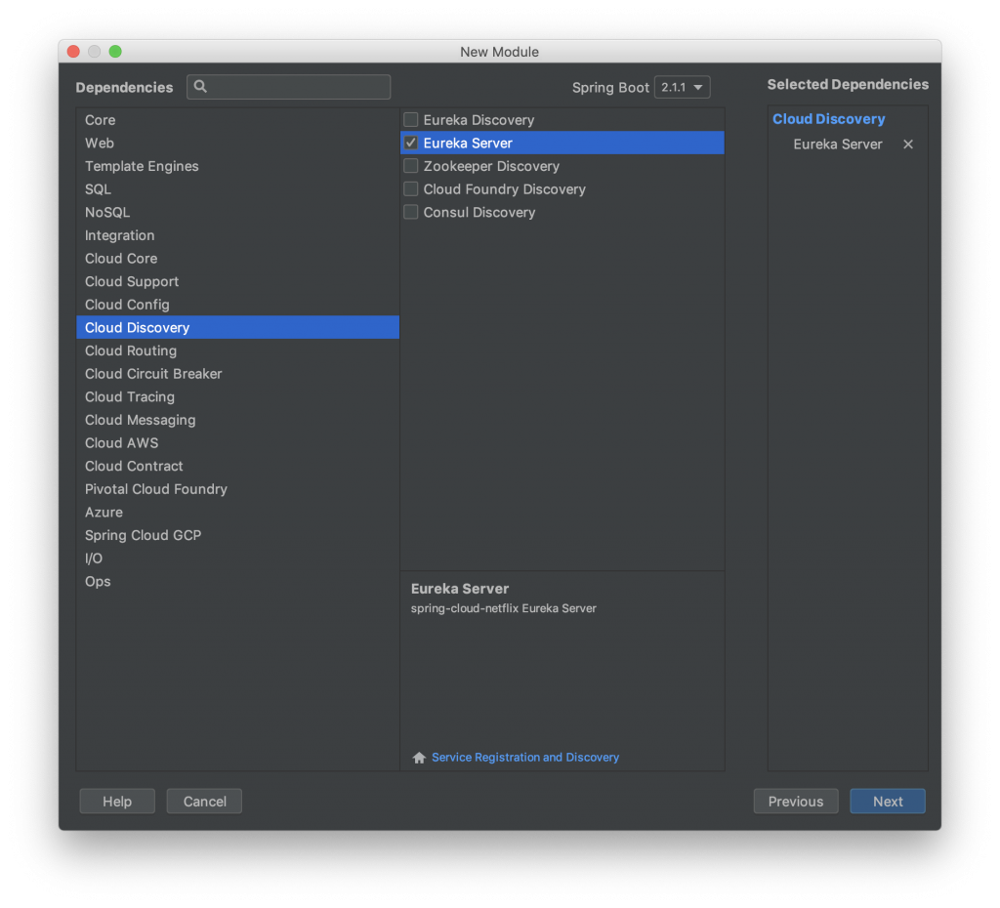
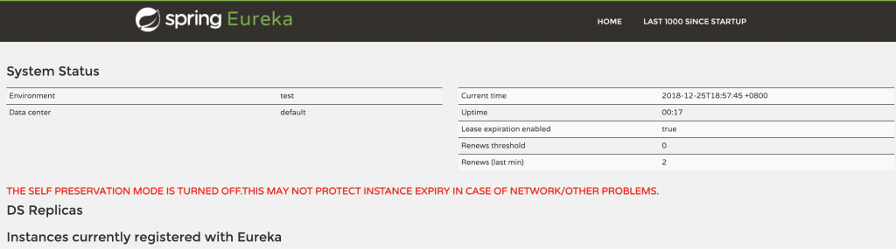

# idea

## 快捷键

### 自动代码格式化

>Ctrl+alt+L

### 插入getter和setter

>alt+insert

## 插件篇

### 直接修改源码，不需要重新启动 ##

>jetbrain插件

### 不用书写get/set方法 ##

>lombok插件

1. 添加依赖

        <dependency>
            <groupId>org.projectlombok</groupId>
            <artifactId>lombok</artifactId>
        </dependency>

2. 添加插件lombok
3. 添加类注解@Data 或 @Get

### 编码规范

> save action插件

> Alibaba Java Coding Guidelines插件

## 使用MAVEN创建多模块的SPRINGCLOUD项目

具体实现的项目目录如下图所示



### 创建父模块

首先打开IDEA，File -> new -> Project，我们选择Maven创建工程项目



点击next，输入GroupId与ArtifactId，以此点击next->finished



依次点击next -> finish ，创建项目完成后目录结构如所示



打开项目目录下的pom.xml，发现与Spring Initializr方式创建的项目有所区别

```xml
<?xml version="1.0" encoding="UTF-8"?>
<project xmlns="http://maven.apache.org/POM/4.0.0"
         xmlns:xsi="http://www.w3.org/2001/XMLSchema-instance"
         xsi:schemaLocation="http://maven.apache.org/POM/4.0.0 http://maven.apache.org/xsd/maven-4.0.0.xsd">
    <modelVersion>4.0.0</modelVersion>

    <groupId>com.spring</groupId>
    <artifactId>main-test</artifactId>
    <version>1.0-SNAPSHOT</version>
</project>
```

修改pom.xml，增加一些依赖下所示

```xml
<?xml version="1.0" encoding="UTF-8"?>
<project xmlns="http://maven.apache.org/POM/4.0.0"
         xmlns:xsi="http://www.w3.org/2001/XMLSchema-instance"
         xsi:schemaLocation="http://maven.apache.org/POM/4.0.0 http://maven.apache.org/xsd/maven-4.0.0.xsd">
    <modelVersion>4.0.0</modelVersion>

    <groupId>com.spring</groupId>
    <artifactId>main-test</artifactId>
    <version>1.0-SNAPSHOT</version>
    <!-- packaging: 打包的机制，如pom, jar, maven-plugin, ejb, war, ear, rar, par   -->
    <packaging>pom</packaging>
 
    <properties>
        <project.build.sourceEncoding>UTF-8</project.build.sourceEncoding>
        <project.build.outputEncoding>UTF-8</project.build.outputEncoding>
        <java.version>1.8</java.version>
        <!--选择最新都Finchley版本-->
        <spring-cloud.version>Finchley.RELEASE</spring-cloud.version>
    </properties>

    <!--增加相应都值给父pom，用于子项目都继承-->
    <parent>
        <groupId>org.springframework.boot</groupId>
        <artifactId>spring-boot-starter-parent</artifactId>
        <version>2.1.1.RELEASE</version>
        <!--relativePath可以不需要，但是用于指明parent的目录，用于快速查询。-->
        <relativePath/> <!-- lookup parent from repository -->
    </parent>

    <!--用于父项目配置共同的依赖关系，主要配置依赖包相同因素 spring-cloud -->
    <dependencyManagement>
        <dependencies>
            <dependency>
                <groupId>org.springframework.cloud</groupId>
                <artifactId>spring-cloud-dependencies</artifactId>
                <version>${spring-cloud.version}</version>
                <type>pom</type>
                <scope>import</scope>
            </dependency>
        </dependencies>
    </dependencyManagement>
    <!--插件需要依赖的包-->
<dependencies>
    <!--Spring Boot的核心启动器-->
    <dependency>
        <groupId>org.springframework.boot</groupId>
        <artifactId>spring-boot-starter</artifactId>
    </dependency>
    <!--web服务依赖-->
    <dependency>
        <groupId>org.springframework.boot</groupId>
        <artifactId>spring-boot-starter-web</artifactId>
    </dependency>
</dependencies>
</project>
```

### 创建子模块

修改完pom.xml后

创建2 模块，依次**file->new->module**,选择Spring Initializr方式创建



next-> 输入Group与Artifact内容，注意group需要与工程项目的相同



next-> 选择eureka-server ， next-> finish



创建完成后，打开pom.xm内容如下

```xml
<?xml version="1.0" encoding="UTF-8"?>
<project xmlns="http://maven.apache.org/POM/4.0.0" xmlns:xsi="http://www.w3.org/2001/XMLSchema-instance"
    xsi:schemaLocation="http://maven.apache.org/POM/4.0.0 http://maven.apache.org/xsd/maven-4.0.0.xsd">
    <modelVersion>4.0.0</modelVersion>
    <parent>
        <groupId>org.springframework.boot</groupId>
        <artifactId>spring-boot-starter-parent</artifactId>
        <version>2.1.1.RELEASE</version>
        <relativePath/> <!-- lookup parent from repository -->
    </parent>
    <groupId>com.spring</groupId>
    <artifactId>eureka-server</artifactId>
    <version>0.0.1-SNAPSHOT</version>
    <name>eureka-server</name>
    <description>Demo project for Spring Boot</description>

    <properties>
        <java.version>1.8</java.version>
        <spring-cloud.version>Greenwich.RC2</spring-cloud.version>
    </properties>

    <dependencies>
        <dependency>
            <groupId>org.springframework.cloud</groupId>
            <artifactId>spring-cloud-starter-netflix-eureka-server</artifactId>
        </dependency>

        <dependency>
            <groupId>org.springframework.boot</groupId>
            <artifactId>spring-boot-starter-test</artifactId>
            <scope>test</scope>
        </dependency>
    </dependencies>

    <dependencyManagement>
        <dependencies>
            <dependency>
                <groupId>org.springframework.cloud</groupId>
                <artifactId>spring-cloud-dependencies</artifactId>
                <version>${spring-cloud.version}</version>
                <type>pom</type>
                <scope>import</scope>
            </dependency>
        </dependencies>
    </dependencyManagement>

    <build>
        <plugins>
            <plugin>
                <groupId>org.springframework.boot</groupId>
                <artifactId>spring-boot-maven-plugin</artifactId>
            </plugin>
        </plugins>
    </build>

    <repositories>
        <repository>
            <id>spring-milestones</id>
            <name>Spring Milestones</name>
            <url>https://repo.spring.io/milestone</url>
        </repository>
    </repositories>

</project>
```

将上面的pom.xml修改为：

```xml
<?xml version="1.0" encoding="UTF-8"?>
<project xmlns="http://maven.apache.org/POM/4.0.0" xmlns:xsi="http://www.w3.org/2001/XMLSchema-instance"
         xsi:schemaLocation="http://maven.apache.org/POM/4.0.0 http://maven.apache.org/xsd/maven-4.0.0.xsd">
    <modelVersion>4.0.0</modelVersion>
   	
    <!--修改parent-->
    <parent>
        <groupId>com.spring</groupId>
        <artifactId>main-test</artifactId>
        <version>1.0-SNAPSHOT</version>
        <relativePath>./pom.xml</relativePath> <!-- lookup parent from repository -->
    </parent>
    
    <groupId>com.spring</groupId>
    <artifactId>eureka-server</artifactId>
    <version>0.0.1-SNAPSHOT</version>
    <name>eureka-server</name>
    <description>Demo project for Spring Boot</description>


    <build>
        <plugins>
            <plugin>
                <groupId>org.springframework.boot</groupId>
                <artifactId>spring-boot-maven-plugin</artifactId>
            </plugin>
        </plugins>
    </build>

</project>
```

复制spring-cloud-starter-netflix-eureka-server依赖到父pom.xml依赖中，并增加模块配置

```xml
<?xml version="1.0" encoding="UTF-8"?>
<project xmlns="http://maven.apache.org/POM/4.0.0"
         xmlns:xsi="http://www.w3.org/2001/XMLSchema-instance"
         xsi:schemaLocation="http://maven.apache.org/POM/4.0.0 http://maven.apache.org/xsd/maven-4.0.0.xsd">
    <modelVersion>4.0.0</modelVersion>

    <groupId>com.yetianyue</groupId>
    <artifactId>main-cloud</artifactId>
    <version>1.0-SNAPSHOT</version>
    <!-- packaging: 打包的机制，如pom, jar, maven-plugin, ejb, war, ear, rar, par   -->
    <packaging>pom</packaging>

    <!--子模块-->
    <modules>
        <module>eureka-server</module>
    </modules>

    <properties>
        <project.build.sourceEncoding>UTF-8</project.build.sourceEncoding>
        <project.build.outputEncoding>UTF-8</project.build.outputEncoding>
        <java.version>1.8</java.version>
        <!--选择最新都Finchley版本-->
        <spring-cloud.version>Finchley.RELEASE</spring-cloud.version>
    </properties>

    <!--增加相应都值给父pom，用于子项目都继承-->
    <parent>
        <groupId>org.springframework.boot</groupId>
        <artifactId>spring-boot-starter-parent</artifactId>
        <version>2.1.1.RELEASE</version>
        <!--relativePath可以不需要，但是用于指明parent的目录，用于快速查询。-->
        <relativePath/> <!-- lookup parent from repository -->
    </parent>

    <!--用于父项目配置共同的依赖关系，主要配置依赖包相同因素 spring-cloud -->
    <dependencyManagement>
        <dependencies>
            <dependency>
                <groupId>org.springframework.cloud</groupId>
                <artifactId>spring-cloud-dependencies</artifactId>
                <version>${spring-cloud.version}</version>
                <type>pom</type>
                <scope>import</scope>
            </dependency>
        </dependencies>
    </dependencyManagement>

    <!--插件需要依赖的包-->
    <dependencies>
         <!--eureka server依赖 -->
        <dependency>
            <groupId>org.springframework.cloud</groupId>
            <artifactId>spring-cloud-netflix-eureka-server</artifactId>
        </dependency>
        <!--Spring Boot的核心启动器-->
        <dependency>
            <groupId>org.springframework.boot</groupId>
            <artifactId>spring-boot-starter</artifactId>
        </dependency>
        <!--web服务依赖-->
        <dependency>
            <groupId>org.springframework.boot</groupId>
            <artifactId>spring-boot-starter-web</artifactId>
        </dependency>
    </dependencies>
</project>
```

简单的配置下单机版的eureka-server，配置如下

```yml
server:
  port: 8761
spring:
  application:
    name: eureka-server
eureka:
  client:
    service-url:
      defaultZone: http://localhsot:8761/eureka/
    fetch-registry: false
    register-with-eureka: false
  instance:
    hostname: localhost
```

在启动类中增加@EnableEurekaServer 注解，运行启动项目，访问http://localhost:8761/ ,发现下图所示，表明搭建成功



其他config-server，provider-user两个模块搭建方式相同，以下列出所有的pom.xml配置提供参考

maintest pom.xml

```xml
<?xml version="1.0" encoding="UTF-8"?>
<project xmlns="http://maven.apache.org/POM/4.0.0"
         xmlns:xsi="http://www.w3.org/2001/XMLSchema-instance"
         xsi:schemaLocation="http://maven.apache.org/POM/4.0.0 http://maven.apache.org/xsd/maven-4.0.0.xsd">
    <modelVersion>4.0.0</modelVersion>

    <groupId>com.spring</groupId>
    <artifactId>main-test</artifactId>
    <version>1.0-SNAPSHOT</version>
    <!-- packaging: 打包的机制，如pom, jar, maven-plugin, ejb, war, ear, rar, par   -->
    <packaging>pom</packaging>

    <!--子模块-->
    <modules>
        <module>config-server</module>
        <module>eureka-server</module>
        <module>provider-user</module>
    </modules>

    <properties>
        <project.build.sourceEncoding>UTF-8</project.build.sourceEncoding>
        <project.build.outputEncoding>UTF-8</project.build.outputEncoding>
        <java.version>1.8</java.version>
        <!--选择最新都Finchley版本-->
        <spring-cloud.version>Finchley.RELEASE</spring-cloud.version>
    </properties>

    <!--增加相应都值给父pom，用于子项目都继承-->
    <parent>
        <groupId>org.springframework.boot</groupId>
        <artifactId>spring-boot-starter-parent</artifactId>
        <version>2.1.1.RELEASE</version>
        <!--relativePath可以不需要，但是用于指明parent的目录，用于快速查询。-->
        <relativePath/> <!-- lookup parent from repository -->
    </parent>

    <!--用于父项目配置共同的依赖关系，主要配置依赖包相同因素 spring-cloud -->
    <dependencyManagement>
        <dependencies>
            <dependency>
                <groupId>org.springframework.cloud</groupId>
                <artifactId>spring-cloud-dependencies</artifactId>
                <version>${spring-cloud.version}</version>
                <type>pom</type>
                <scope>import</scope>
            </dependency>
        </dependencies>
    </dependencyManagement>

    <!--插件需要依赖的包-->
    <dependencies>
        <dependency>
            <groupId>org.springframework.cloud</groupId>
            <artifactId>spring-cloud-netflix-eureka-server</artifactId>
        </dependency>
        <!--配置服务依赖-->
        <dependency>
            <groupId>org.springframework.cloud</groupId>
            <artifactId>spring-cloud-config-server</artifactId>
        </dependency>
        <!--Spring Boot的核心启动器-->
        <dependency>
            <groupId>org.springframework.boot</groupId>
            <artifactId>spring-boot-starter</artifactId>
        </dependency>
        <!--web服务依赖-->
        <dependency>
            <groupId>org.springframework.boot</groupId>
            <artifactId>spring-boot-starter-web</artifactId>
        </dependency>
    </dependencies>
</project>
```

config-server pom.xml

```xml
<?xml version="1.0" encoding="UTF-8"?>
<project xmlns="http://maven.apache.org/POM/4.0.0" xmlns:xsi="http://www.w3.org/2001/XMLSchema-instance"
    xsi:schemaLocation="http://maven.apache.org/POM/4.0.0 http://maven.apache.org/xsd/maven-4.0.0.xsd">
    <modelVersion>4.0.0</modelVersion>

    <groupId>com.spring</groupId>
    <artifactId>config-server</artifactId>
    <version>0.0.1-SNAPSHOT</version>
    <name>config-server</name>
    <description>config-server</description>
    <packaging>jar</packaging>

    <parent>
        <groupId>com.yetianyue</groupId>
        <artifactId>main-cloud</artifactId>
        <version>1.0-SNAPSHOT</version>
        <relativePath>./pom.xml</relativePath> <!-- lookup parent from repository -->
    </parent>

    <build>
        <plugins>
            <plugin>
                <groupId>org.springframework.boot</groupId>
                <artifactId>spring-boot-maven-plugin</artifactId>
            </plugin>
        </plugins>
    </build>

    <repositories>
        <repository>
            <id>spring-milestones</id>
            <name>Spring Milestones</name>
            <url>https://repo.spring.io/milestone</url>
        </repository>
    </repositories>

</project>
```

eureka-server pom.xml

```xml
<?xml version="1.0" encoding="UTF-8"?>
<project xmlns="http://maven.apache.org/POM/4.0.0" xmlns:xsi="http://www.w3.org/2001/XMLSchema-instance"
         xsi:schemaLocation="http://maven.apache.org/POM/4.0.0 http://maven.apache.org/xsd/maven-4.0.0.xsd">
    <modelVersion>4.0.0</modelVersion>
    <groupId>com.spring</groupId>
    <artifactId>eureka-server</artifactId>
    <version>0.0.1-SNAPSHOT</version>
    <name>eureka-server</name>
    <description>Demo project for Spring Boot</description>


    <parent>
        <groupId>com.yetianyue</groupId>
        <artifactId>main-cloud</artifactId>
        <version>1.0-SNAPSHOT</version>
        <relativePath>./pom.xml</relativePath> <!-- lookup parent from repository -->
    </parent>


    <build>
        <plugins>
            <plugin>
                <groupId>org.springframework.boot</groupId>
                <artifactId>spring-boot-maven-plugin</artifactId>
            </plugin>
        </plugins>
    </build>

</project>
```

provider-user pom.xml

```xml
<?xml version="1.0" encoding="UTF-8"?>
<project xmlns="http://maven.apache.org/POM/4.0.0" xmlns:xsi="http://www.w3.org/2001/XMLSchema-instance"
         xsi:schemaLocation="http://maven.apache.org/POM/4.0.0 http://maven.apache.org/xsd/maven-4.0.0.xsd">
    <modelVersion>4.0.0</modelVersion>
    <groupId>com.spring</groupId>
    <artifactId>provider-user</artifactId>
    <version>0.0.1-SNAPSHOT</version>
    <name>provider-user</name>
    <description>Demo project for Spring Boot</description>

    <parent>
        <groupId>com.yetianyue</groupId>
        <artifactId>main-cloud</artifactId>
        <version>1.0-SNAPSHOT</version>
        <relativePath>./pom.xml</relativePath> <!-- lookup parent from repository -->
    </parent>

    <dependencies>
        <dependency>
            <groupId>org.springframework.boot</groupId>
            <artifactId>spring-boot-starter-test</artifactId>
            <scope>test</scope>
        </dependency>
    </dependencies>

    <build>
        <plugins>
            <plugin>
                <groupId>org.springframework.boot</groupId>
                <artifactId>spring-boot-maven-plugin</artifactId>
            </plugin>
        </plugins>
    </build>

</project>
```

最终整体项目目录如下所示，至此完成多模块的搭建

# 参考 #

1.  [Intellij Idea 代码格式化/保存时自动格式化](https://blog.csdn.net/mr_rain/article/details/79279931)
2.  [idea 离线安装 lombok插件](https://blog.csdn.net/shmily_lsl/article/details/80689307 "idea 离线安装 lombok插件")
3.  [使用MAVEN创建多模块的SPRINGCLOUD项目](<https://misterye.com/archives/489.html>)
4.  [IntelliJ idea 创建Maven多模块项目并运行](https://segmentfault.com/a/1190000010252025)(创建SpringCloud不太行)

