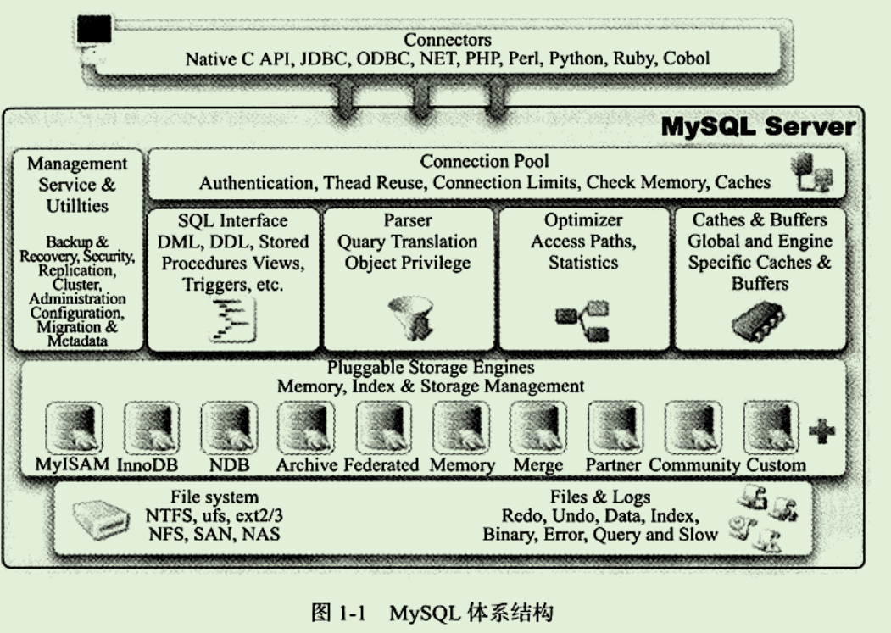
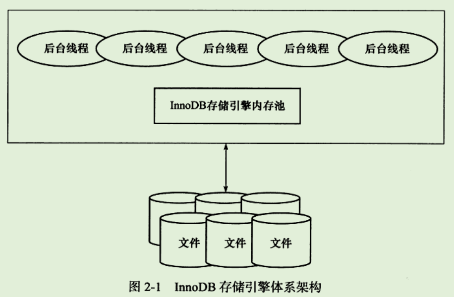
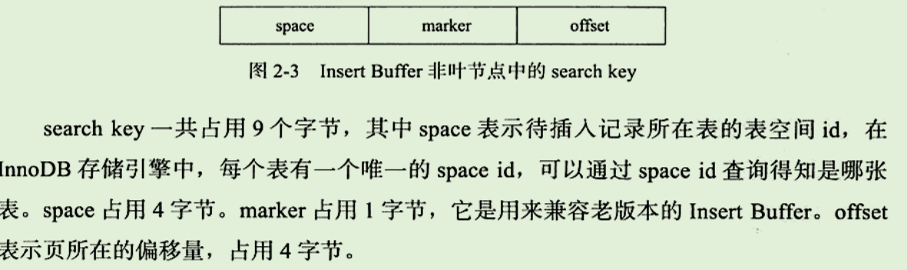
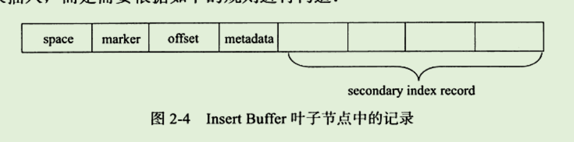
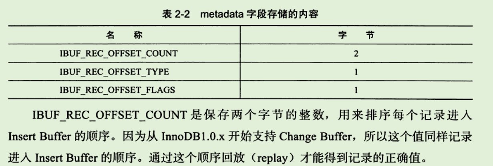
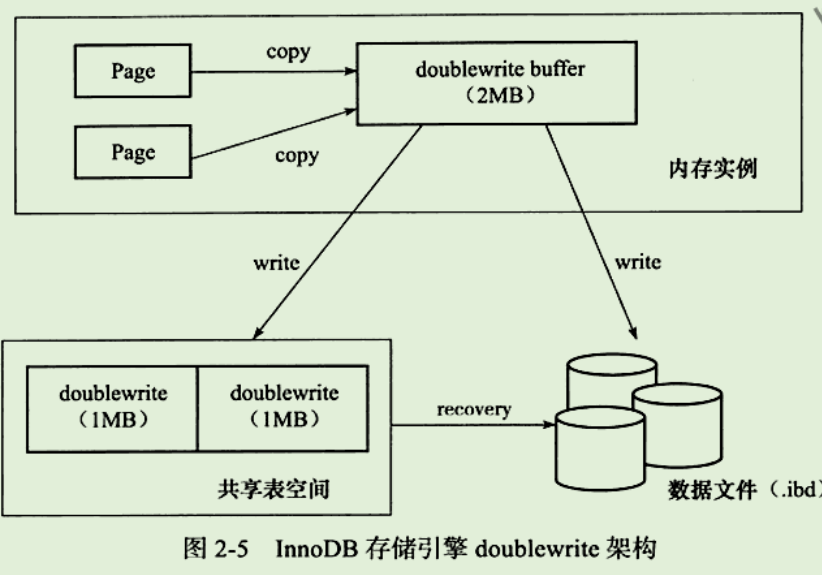
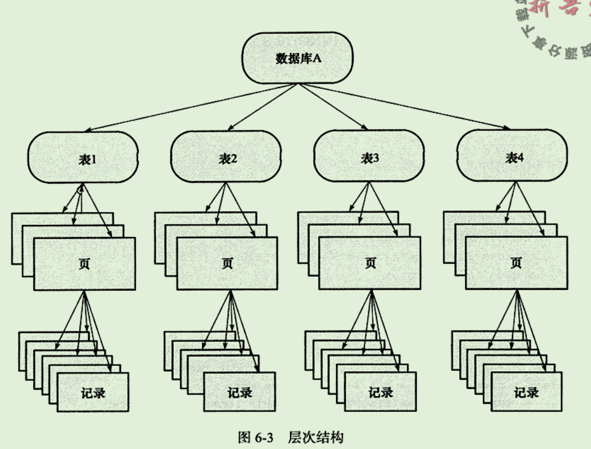
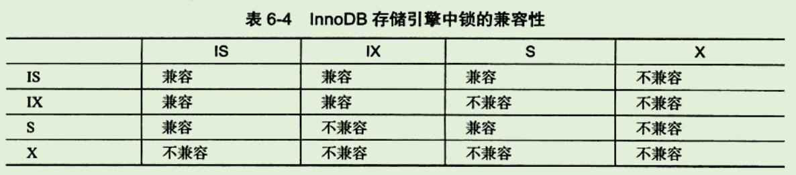
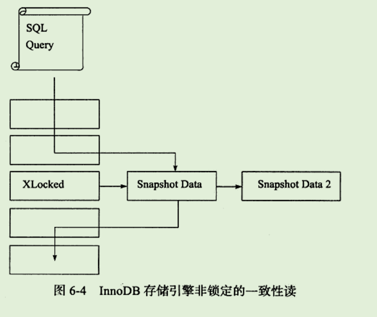
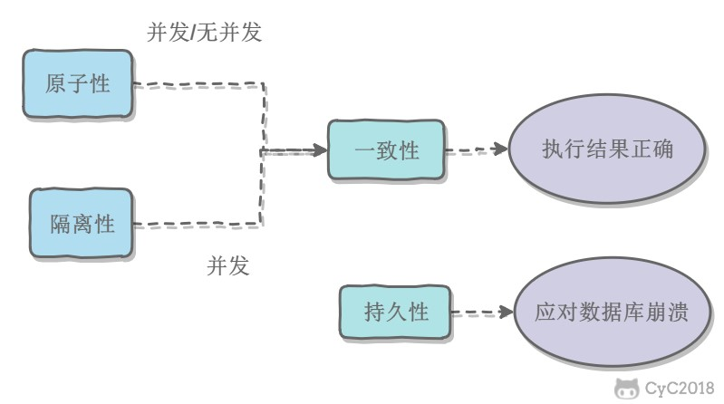

# MySQL体系结构和存储引擎

尽管各平台在底层实现方面都各有不同，但是MySQL基本上能保证在各平台上的物理体系结构的一致性

## 定义数据库和实例

- 数据库
  - 物理操作系统文件或其他形式文件类型的集合。
  - 在MySQL数据库中，文件可以是frm、MYD、MYI等结尾的文件。
  - NDB引擎时，可能是存放于内存当中的文件。
  - 是文件的集合，是依照某种数据模型组织起来并存放于二级存储器中的数据集合。

- 实例
  - MySQL数据库由后台线程以及一个共享内存区组成。可以被运行的后台线程所共享。
  - 是真正用于操作数据库文件的。
  - 是程序，是位于用户与OS间的一层数据管理软件，程序只有通过实例才能和数据库打交道

MySQL是一个**单进程多线程架构的数据库**。

## MySQL体系结构



MySQL组成

- 连接池组件

- 管理服务和工具组件

- SQL接口组件

- 查询分析器组件

- 优化器组件

- 缓冲组件

- **插件式存储引擎**

  基于表而不是数据库

- 物理文件

## MySQL存储引擎

用户应该根据具体的应用选择合适的存储引擎

### InnoDB

- 支持事务，设计目标主要面向在线事务处理的应用
- 特点
  - 行锁设计
  - 支持外键，并支持类似于Oracle的非锁定读，即默认读取操作不会产生锁
- 通过使用多版本并发控制（MVCC）来获得高并发性，并实现了SQL标准的4种隔离级别
  - 默认为Repeatable read
  - 使用一种被称为next-keylocking的策略避免幻读
- 提供插入缓冲、二次写、自适应哈希索引、预读等高性能功能
- InnoDB存储引擎将数据放在一个逻辑的表空间，这个表空间像一个黑盒一样由InnoDB管理，可以将表单独存放到一个独立的idb文件中

### MyISAM

- 不支持事务、表锁设计
- 支持全文索引
- 主要面向一些OLAP数据库应用。适合报表查询系统
- 只缓存索引文件，不缓冲数据文件
- 锁的粒度为表级
- 相对简单，在效率上更优，小型应用更为适合
- 表是保存成文件形式，在跨平台的数据转移中会省去不少麻烦

### NDB

- 一个集群存储引擎。结构为share nothing的集群架构，能够提供更高的可用性
- 特点
  - 数据全部放在内存中，因此主键查找速度极快
  - 可通过添加NDB数据存储结点，线性提高数据库性能
  - 从MySQL5.1开始，可以将非索引数据放在磁盘上。
- 缺陷
  - NDB存储引擎的连接操作是在MySQL数据库层完成的，而不是存储引擎层。因此复杂的连接操作需要巨大的网络开销，查询速度很慢

### Memory

- 适用于存储临时数据的临时表，以及数据仓库中的维度表
- 特点
  - 将表中数据放在内存中，如果数据库重启或崩溃，表中数据都将消失。
  - 默认使用哈希索引
  - 速度非常快。
  - 只支持表锁，并发性能较差，不支持TEXT和BLOB列类型。存储变长字段时是按照定常字段的方式进行，会浪费内存。
- 当作为临时表存放中间结果集，如果中间结果集大于Memory存储引擎表的容量设置，或含有TEXT列类型，则会转换为MyISAM存储引擎

### Archive

- 只支持Insert和select操作
- 从MySQL5.1支持索引
- 适合存储归档数据，如日志。使用zlib算法将数据行压缩存储，压缩比一般可达到1：10。
- 使用行锁实现高并发的插入操作，但本身不是事务安全的，设计目标是提供高速的插入和压缩功能

### Federated

- 不存放数据，只是指向一台远程MySQL数据库服务器上的表

### Maria

- 新开发的引擎，设计目标是取代原有的MyISAM，从而成为MySQL的默认存储引擎
- 支持缓存数据和索引文件
- 应用行锁设计，提供MVCC功能，支持事务和非事务安全的选项，以及更好地blob字符类型的处理性能

## 连接MySQL

管道、命名管道、命名字、TCP/IP套接字、UNIX域套接字

# InnoDB存储引擎

是事务安全的存储引擎

## 概述

- 第一个完整支持ACID事务的存储引擎
  - 原子性（atomicity，或称不可分割性）。一个事务（transaction）中的所有操作，或者全部完成，或者全部不完成，不会结束在中间某个环节。事务在执行过程中发生错误，会被回滚（Rollback）到事务开始前的状态，就像这个事务从来没有执行过一样。即，事务不可分割、不可约简。
  - 一致性（consistency）。在事务开始之前和事务结束以后，数据库的完整性没有被破坏。这表示写入的资料必须完全符合所有的预设**约束**、**触发器**、**级联回滚**等。
  - 隔离性（isolation，又称独立性）。数据库允许多个并发事务同时对其数据进行读写和修改的能力，隔离性可以防止多个事务并发执行时由于交叉执行而导致数据的不一致。事务隔离分为不同级别，包括**读未提交（Read uncommitted）、读提交（read committed）、可重复读（repeatable read）和串行化（Serializable）**。
  - 持久性（durability）。事务处理结束后，对数据的修改就是永久的，即便系统故障也不会丢失。
- 特点
  - 行锁设计、支持MVCC、支持外键、提供一致性非锁定读
- 被设计用来最有效地以及使用内存和CPU

## InnoDB体系架构



InnoDB存储引擎有多个内存块，可以认为他们组成一个大内存池，负责：

- 维护所有进程、线程需要访问的多个内部数据结构
- 缓存磁盘上的数据，方便快速地读取，同时在对磁盘文件的数据修改前在这里缓存
- 重做日志缓冲
- 。。。

### 后台线程

负责

- 刷新内存池中的数据，保证缓冲池中的内存缓存的是最近的数据
- 将已经修改的数据文件刷新到磁盘文件
- 保证数据库在发生异常的情况下InnoDB能恢复到正常允许状态

1. MasterThread

   负责将缓冲池中的数据异步刷新到磁盘，保证数据一致性，包括脏页的刷新、合并插入缓冲、UNDO页的回收

2. IO Thread

   InnoDB大量使用AIO处理写请求，可以极大提高数据库的性能

   负责将IO请求的回调处理。

   Linux下有4个，为write、read、insert buffer、log IO thread

   Windows可以自行设定，write与read增大到了4个，通过参数innodb_read(write)_io_threads设定

3. Purge Thread

   事务提交后，其使用的undolog可能不再需要，使用该线程回收已经使用并分配的undo页

4. Page Cleaner Thread

   将之前版本中脏页的刷新操作放入到单独的线程。

## 内存

### 缓冲池

InnoDB存储引擎基于磁盘存储的，并将其中的记录按照页的方式进行管理。即可认为是基于磁盘的数据库系统。

考虑CPU与磁盘速度，则使用缓冲池技术提高数据库整体性能。缓冲池是一块内存区域，通过内存的速度来弥补磁盘的速度较慢

- 数据库读取页的操作

  - 首先将从磁盘读到的页存放到缓冲池中。
  - 下一次读取相同的页，判断该页是否在缓冲池中。若在，则该页被命中，直接读取。否则读取磁盘。
- 数据库页修改操作
  - 首先修改在缓冲池中的页，再以一定频率刷新到磁盘（Checkpoint机制）。

缓冲池大小配置：innodb_buffer_pool_size。

*数据页类型*

缓冲池当中的数据页类型有：索引页、数据页、undo页、插入缓冲、自适应哈希索引、InnoDB存储的锁信息、数据字典信息等。

*多缓冲池*

InnoDB 1.0.x后允许有多个缓冲池实例。每个页根据哈希值平均分配到不同的缓冲池实例中。

减少了数据库内部的资源竞争，增加数据库的并发处理能力

配置：innodb_buffer_pool_instances

### LRU List、Free List和Flush List

对缓冲池这么大的内存区域进行管理。

### 重做日志缓冲

InnoDB存储引擎的内存区域除了有缓冲池，还有重做日志缓冲。

首先将重做日志信息放入到该缓冲区，然后按一定频率将其刷新到重做日志文件。

- 在事务开始之后逐步写入重做日志文件，而不一定是事务提交才写入重做日志缓存，
- 记录的是物理数据页面的修改的信息

### 额外的内存池

在InnoDB存储引擎中，对内存的管理是通过一种称为**内存堆的方式**进行的。

在对一些数据结构本身的内存进行分配时，需要从额外的内存池中进行申请，当该区域的内存不够时，会从缓冲池中进行申请

## Checkpoint技术

页的操作首先是在缓冲池中完成的。如果一条DML语句，则此时页是脏的，缓冲池中的页版本比磁盘当中新，数据库需要将新版本的页刷新到磁盘。

- 倘若每次一个页发生变化，就刷新到磁盘，则开销极大。
- 倘若在刷新到磁盘的过程中，服务器宕机，则数据无法恢复。

为了避免数据丢失问题，普遍采用**Write Ahead Log策略**

- 当事务提交时，先写重做日志，再修改页
- 当宕机导致数据丢失时，通过重做日志来完成数据的恢复
- 是否不需要将缓冲池中页刷新到磁盘。
  - 缓冲池无法缓存数据库所有的数据
  - 重做日志无法无限增大，即使可以，运维难度大、成本高
  - 日志文件太大，恢复数据库需要时间太久

**Checkpoint技术**

解决的问题：

- 缩短数据库的恢复时间。只需对checkpoint后的重做日志进行恢复
- 缓冲池不够用时，将脏页刷新到磁盘。采用LRU算法溢出页面，如果为脏页则强制执行checkpoint，刷新页面
- 重做日志不可用时，刷新脏页。数据库对重做日志进行循环使用，覆盖重用

Checkpoint发生的时间、条件以及脏页的选择等都非常复杂。Innodb中有两种Checkpoint

- Sharp Checkpoint。
  - 默认的工作方式，发生在数据库关闭时，将所有的脏页都刷新回磁盘
  - 若数据库运行时页使用该技术，则数据库可用性会受到很大限制
- Fuzzy Checkpoint。
  - 只刷新一部分脏页，而不是刷新所有脏页回磁盘

*Fuzzy Checkpoint*

InnoDB存储引擎中可能发生的几种请求的Fuzzy Checkpoint

- Master Thread Checkpoint。每s或每10s刷新，是异步操作
- FLUSH_LRU_LIST Checkpoint。为保证LRU列表有100个空闲页可用。若没有，则移除尾端页，若这些页有脏页，则需要进行Checkpoint
- Async/Sync Flush Checkpoint。为了保证重做日志的循环使用的可用性。重做日志文件不可用的情况下（写满了），需要强制将一些页刷新会磁盘。
- Dirty Page too much Checkpoint。脏页数量太多，目的是为了保证缓冲池当中有足够可用的页。

## Master Thread工作方式

## InnoDB关键特性

### 插入缓冲

Insert Buffer与数据页一样，都是物理页的一个组成部分

在InnoDB存储引擎中，主键是行唯一标识符。

通常应用程序中行记录的插入顺序是按照主键递增的顺序进行插入的。因此插入**聚集索引**一般是顺序的，不需要磁盘的随机读取。

对于主键自增长的列，在页当中，行记录是按照聚集索引的值进行顺序存放的，一般不需要随机读取另一个页中的记录，因此对于此类插入操作，速度非常快。

> 并不是所有的主键插入都是顺序的，若主键类为UUID这样，那么插入和辅助索引一样，同样随机

一张表上同样有多个非聚集的辅助索引，则此时会产生非聚集且不是唯一的索引

- 进行插入操作时，数据页的存放还是按主键进行顺序存放
- 对于非聚集索引叶子结点的插入不再是顺序的了，需要离散地访问非聚集索引的页，由于随机读取的存在而导致了插入操作性能下降
- B+树的特性决定了非聚集索引插入的离散性

***Insert Buffer***

对于非聚集索引的插入或更新操作，不是每一次直接插入到索引页当中

- 判断插入的非聚集索引页是否在缓冲池内，若在，直接插入
- 若不在，则先放入一个Insert Buffer对象中，假装已经插入到叶子结点
- 以一定频率和情况进行Insert Buffer和辅助索引页子节点的合并操作。将多次插入合并到一次操作（因为在一个索引页当中）

需要满足的条件

- 索引是辅助索引。
- 索引不唯一。插入缓冲时，数据库不查找索引页判断记录的唯一性

**缺陷**

宕机时，可能有很多Insert Buffer没有合并，导致恢复需要较长时间

**内部实现**

Insert Buffer的数据结构是B+树，在当前版本全局一颗Insert Buffer B+树

- 负责对所有的表的辅助索引进行Insert Buffer。
- 存放在共享表空间，默认是idbata1中。
  - 试图通过独立表空间idb文件恢复表数据，往往导致Check table失败，因为辅助索引还在Insert Buffer中
  - 通过idb恢复后，还需要进行repair table进行重建辅助索引

B+树非叶子结点存放的是查询的search key键值



当一个辅助索引要插入到页，且页不在缓冲池，则需要先构造一个search key，并插入到叶子结点当中。





***Change Buffer***

Insert Buffer的升级。对DML操作都进行缓冲，即Insert Buffer、Delete Buffer、Purge buffer

对一条记录进行update操作

- 将记录标记为已删除，Delete Buffer
- 真正将记录删除，Purge buffer

***Merge Insert Buffer***

合并辅助索引可能发生在以下几种情况

- 辅助索引页被读取到缓冲池时
- Insert Buffer Bitmap页追踪到该辅助索引页已经没有可用空间时
  - 至少需要有1/32页的空间
- Master Thread
  - 每s或每10s进行一次操作，不同之处在于每次进行merge的页数量不同

### 两次写

提供**数据页的可靠性**

部分写失效：当服务器宕机，可能InnoDB存储引擎正在写入某个页到表中，但只写了一部分就宕机。

面对部分写失效，重做日志可能没有效果

- 重做日志中记录的是对页的物理操作，如偏移量800，写'aaaa'记录，如果页本身发生损坏，则进行重做无意义。
- 在应用重做日志前，用户需要一个页的副本，当写入失效发生时，写通过页的副本来还原该页，再进行重做，即doublewrite

**doublewrite**



在对缓冲池的脏页进行刷新时

- 并不直接写磁盘，而是通过memcpy函数将脏页先赋值到内存的doublewrite buffer
- 通过doublewrite buffer分两次，每次1MB顺序写入共享表空间的物理磁盘。double write页是连续的，顺序写，开销小
- 调用fsync函数，同步磁盘，避免缓冲写带来的问题。表空间是不连续的，写入是离散的

### 自适应哈希索引

在生产环境下B+树的高度一般为3-4层。

自适应哈希索引（AHI）：InnoDB存储引擎会监控对表上各索引页的查询，如果观察到建立哈希索引可以带来速度提升，则建立哈希索引。

- AHI通过缓冲池的B+树页构造，速度很快，而且不需要对整张表构建哈希索引。
- 会自动根据访问的频率和模式来自动为某些热点页建立哈希索引
- 要求对这个页的连续访问模式必须是一样的，如where a= ？与where a=? and b=?是两种访问模式
- 以该模式访问了100次，**或**，页通过该模式访问了N次，N=页中记录/16

### 异步IO（AIO）

提高磁盘操作性能

Sync IO：与AIO对应，每进行一次IO操作，需要等待此次操作结束才能继续接下来的操作

### 刷新临近页

当刷新一个脏页时，InnoDB存储引擎会检测该页所在区的所有页，如果是脏页，那么一起进行刷新。通过AIO可以将多个IO写入操作合并为1个操作。

存在的问题

- 是不是可能将不怎么脏的页进行了写入，而该页又很快变成了脏页
- 固态硬盘有较高的IOPS，是否还需要这个特性
- 因此提供参数来控制是否启用该特性

# 索引与算法

如果知道数据的使用，则一开始就应该在需要处添加索引

## InnoDB存储引擎索引概述

- B+树索引（传统意义上的索引）
  - 不能找到一个给定键值的具体行，能找到的只是被查找数据行所在的页。
  - 然后数据库将页读入到内存，在内存中进行查找，最后得到所要查找的数据
- 全文索引
- 哈希索引（自适应的，不能人为干预）

## 索引

***特点***

- 可以加快数据库的检索速度
- 降低数据库插入、修改、删除等维护的速度
- 只能创建在表上，不能创建到视图上
- 既可以直接创建又可以间接创建
- 可以优化隐藏中使用索引
- 使用查询处理器执行SQL语句，在一个在表上，一次只能使用一个索引

***优点***

- 创建唯一性索引，保证数据库表中每一行数据的唯一性
- 大大加快数据的检索速度，这是创建索引的最主要原因
- 加速数据库表间连接，特别是在实现数据的参考完整性方面特别有意义
- 在使用分组和排序子句进行数据检索时，同样可以显著减少查询中分组和排序的时间
- 通过使用索引，可以在查询中使用优化隐藏器，提高系统的性能

***缺点***

- 创建索引和维护索引需要时间，随着数据量的增加而增加
- 索引需要占用物理空间，除了数据表占用数据空间外，每一个索引需要占用一定的物理空间，如果建立聚簇索引，需要的空间更大
- 当队表中数据进行增加、删除和修改时，索引也需要维护，降低数据维护的速度

***分类***

- 直接创建索引和间接创建索引
- 普通索引与唯一性索引
- 单个索引和复合索引
- 聚簇索引和非聚簇索引

***索引失效***

- 如果条件中有Or，即使其中有条件带索引也不会使用
- 对于多列索引，不是使用的第一部分，则不会使用索引
- like查询时以%开头
- 如果列类型是字符串，那一定要在条件中使用引号引起来，否则不会使用索引
- 如果MySQL估计全表扫描比索引块，则不使用索引

***什么情况下适合建立索引***

- 在经常出现关键字order by、group by、distinct后面的字段，建立索引
- 在union等集合操作的结果集字段上，建立索引
- 为经常用作查询选择的字段，建立索引
- 在经常用作表连接的属性上，建立索引
- 考虑使用索引覆盖，对数据很少被更新的表，如果用户经常只查询其中的几个字段，可以考虑在这几个字段上建立索引，从而将表的扫描改变为索引的扫描

## B+树索引

B+树索引可以分为聚集索引和辅助索引。

聚集索引与辅助索引不同的是，叶子节点存放的是否是一整行的信息

### 聚集索引

InnoDB存储引擎表是索引组织表，即表中数据按照主键顺序存放。

聚集索引就是按照每张表的主键构造一颗B+树，同时叶子节点中存放的即为整张表的行记录数据，也将聚集索引的叶子节点称为数据页。

数据页上存放的是完整的每行的记录，在非数据页的索引页中，存放的仅仅是键值以及指向数据页的偏移量，不是一个完整的行记录。

- 对于主键的排序查找和范围查找非常快
  - 叶子节点的数据就是用户查询的数据，若需要表最后的10位用户，由于是索引是双向链表，则用户可以快速地找到最后一个数据页
  - 对于范围查询，通过叶子节点的上层中间节点就可以得到页的范围，然后直接读取数据页即可

### 辅助索引

叶子节点不包含行记录的全部数据，除了包含键值外，还包含一个书签（告诉InnoDB可以在哪里找到与索引对应的行数据）

- 若辅助索引与聚集索引的高度均为3，则一共需要6次IO以得到最终的数据页

### B+树索引的分裂

与一般B+树的分裂不同，需要涉及到**并发**

当自增的主键插入时，如

1，2，3，4，5（中间值），6，7，8，9

此时插入10需要分裂，则：

- 1，2，3，4
- 5（大于等于键值的在右），6，7，8，9，10

因为自增，则P1这个页不会再插入，从而导致浪费

InnoDB存储引擎的Page Header有以下几个部分用来保存插入的顺序信息

- Page_Last_Insert
- Page_Direction
- Page_N_Direction

通过这些决定向左还是向右进行分裂，同时决定将分裂点记录为哪一个

- 若插入是随机的，则取中间记录分裂
- 若往同一方向进行插入的记录数量为5，并且目前已经**定位**到的记录之后还有3条记录。
  - 则分裂点的记录为定位到的记录后的第三条记录
  - 否则分裂点记录就是待插入的记录（自增插入中普遍存在）
  - 定位：在插入时，首先需要定位，定位到的记录为待插入记录的前一条记录

### B+树索引的管理

## Cardinality值

### 什么是Cardinality

低选择性：对于性别字段、类型字段、地区字段，他们可选择的范围很小

高选择性：某个字段的取值范围很广，几乎没有重复。这时使用B+树索引才是最合适的

通过Show Index结果中的列Cardinality来观察索引是否高选择性。

Cardinality：表示索引中不重复记录数量的预估值，Cardinality/n_rows_in_table应尽可能接近1，如果非常小，则需要考虑是否还必要创建这个索引。

### InnobDB存储引擎的Cardinality统计

数据库对于Cardinality的统计是通过采样的方法完成。

Cardinality统计信息的更新发生在两个操作中：insert与update

更新Cardinality信息的策略为：

- 表中1/16的数据已经发生变化
- stat_modified_counter（某一行数据频繁地变化，每变化一次+1）>2000000000

采样的过程，默认对8个叶子结点采用：

- 取得B+树索引中叶子结点的数量，记为A
- **随机**取得B+树索引中的8个叶子结点。统计每个页不同记录的个数，记为P1，P2，P8
- 根据采样信息给出Cardinality的预估值，即SUM（P）*A/8

## B+树索引的使用

不同应用中B+树索引的使用

联合索引

覆盖索引

优化器旋转不使用索引的情况

索引提示

Multi-Range-Read优化

ICP优化

## 哈希算法

哈希表

InnoDB哈希算法

自适应哈希索引

## 全文检索

*概述*

全文检索是将存储于数据库中的整本书或整篇文章中的任意内容信息查找处理的技术。

InnoDB 1.2.x开始，支持全文检索，支持MyISAM的全部功能，以及一些其他特性。

*倒排索引*

全文检索通常使用倒排索引实现。在辅助表中存储了单词与单词自身在一个或多个文档中所在位置之间的映射。通常使用关联数组实现，有两种表现形式：

- inverted file index，表现为｛单词，单词所在文档的ID｝
- full inverted index，表现为｛单词，（单词所在文档的ID，在文档的具体位置）｝

*InnoDB全文检索*

使用full inverted index，将（单词所在文档的ID，在文档的具体位置）视为一个ilist

在InnoDB存储引擎中，为了提高全文检索的并行性能，共有6张辅助表，每张表根据word的Latin编码进行分区。

辅助表是持久的表，存放于磁盘上。

为了提高全文索引性能，使用了FTS Index Cache（全文检索索引缓存）。是一个红黑树结构，根据（word,ilist）排序

*全文检索*


# 锁

讨论InnoDB如何实现事务的隔离性的。

- 最大程度地利用数据库的并发访问
- 确保每个用户能以一致的方式读取和修改数据

将介绍InnoDB存储引擎对表中的数据的锁定，同时分析InnoDB存储引擎会以怎样的粒度锁定数据。

人们认为行级锁的一个神话：人们认为行级锁总会增加开销。实际上，只有当实现本身会增加开销时，行级锁才会增加开销。InnoDB存储引擎不需要锁升级，因为一个锁和多个锁的开销是相同的。

## 什么是锁

锁机制用于管理对共享资源的并发访问。

InnoDB存储引擎在行级别上对表数据上锁，页会在数据库内部其他多个地方使用锁，从而允许对多种不同资源提供并发访问。如缓冲池的LRU列表。

InnoDB锁提供：

- 一致性的非锁定读
- 行级锁支持，且行级锁没有额外开销，同时得到并发性和一致性

## lock与latch

lock与latch都被称为锁，但具有截然不同的含义

- latch称为轻量级锁，要求锁定的时间必须非常短。若持续时间长，则性能会非常差
  - 分为mutex互斥量和rwlock读写锁
  - 保证并发线程操作临界资源的正确性，并没有死锁检测机制
- lock的对象是事务，用来锁定的是数据库中的对象，如表、页、行
  - lock的对象仅在commit或rollback后释放
  - 存在死锁机制

## InnoDB存储引擎中的锁

### 锁的类型

InnoDB存储引擎实现了两种标准的**行级锁**

- 共享锁S LOCK，允许事务读一行数据
- 排他锁X LOCK，允许事务删除或更新一行数据

兼容性

|      | X      | S      |
| ---- | ------ | ------ |
| X    | 不兼容 | 不兼容 |
| S    | 不兼容 | 兼容   |

InnoDB存储引擎支持**多粒度锁定**，允许事务在行级上的锁和表级上的锁同时存在。为了支持在不同粒度上进行加锁操作，支持一种额外的锁方式：**意向锁**

意向锁：将锁定的对象分为多个层次，意味着事务希望在更细粒度上加锁。



- 如果希望对**记录**上锁，则分别需要对数据库、表、页上意向锁IX，最后对记录上X锁。
- 若其中任一个部分导致等待，那么该操作需要等待粗粒度锁的完成
  - 如有事务在表1进行了S锁，则由于需要IX锁不兼容，需要等待

InnoDB存储引擎支持的**意向锁是表级别的锁**

1. 意向共享锁，事务想获得一张表中某几行的共享锁
2. 意向排他锁，事务想获得一张表中某几行的排他锁
3. 

### 一致性非锁定读

InnoDB存储引擎通过多版本控制（MVCC，多版本并发控制）的方式读取当前执行时间数据库中行的数据。

- 如果读取的行正在执行DEL或update操作，这时读取操作不会因此去等待行上锁的释放，而是会去读行的一个快照数据。
  - 快照数据是指该行的之前版本的数据。该实现是通过undo段来完成。undo用来在事务中回滚数据
  - 快照数据本身没有额外的开销，并不需要上锁，因为没有事务需要对历史的数据进行修改



非锁定读：不需要等待访问的行上X锁的释放。

因此非锁定读机制极大地提高了数据库并发性。

- 是默认的读取方式
- 在不同事务隔离级别下读取方式不同。
- 即使都是使用非锁定的一致性读，对快照数据的定义也各不相同

在已提交读和可重复读下，采用非锁定的一致性读。但是快照数据的定义不同

- 已提交读下，总是读取被锁定行最新一份快照数据
  - 在事务开始后，有其他的事务对该行数据进行了修改并commit，则会出现对一个数据的读取，两次结果不一致
  - 因为每次会读取最新一份快照
- 可重复读下，总是读取**事务开始时**的行数据版本。
  - 即只要事务开始了，在该次事务当中，对同一个数据的读取，永远不会改变

#### MVCC

从上图6-4可以看到，快照数据是当前行数据的历史版本，因此可能存在多个版本，即存在不止一个快照数据。由此带来的并发控制称为多版本并发控制（MVCC）

### 一致性锁定读

在某些情况下，用户需要显式地对数据库读取操作进行加锁以保证数据逻辑的一致性。

InnoDB存储引擎对于Select语句支持两种一致性锁定读操作

- select ... for update
  - 对读取的行记录加一个X锁，其他事务不能对已经锁定的行加任何锁
- select ... lock in share mode
  - 对读取的行记录加一个S锁，其他事务可以加S锁

### 自增长与锁


### 外键和锁

对于一个外键列，如果没有显式地对这个列加索引，InnoDB存储引擎会自动对其加一个索引，因为可以避免表锁。

对于外键值的插入和更新

- 首先向父表查询，并使用select ... lock in share mode，以防止数据不一致的问题。

## 锁的算法

### 行锁的三种算法

- Record Lock：单个行记录上的锁
  - Read Committed下采用
  - 会锁住索引记录（而不是行数据），如果没有索引，则会使用隐式的主键来进行锁定
- Gap Lock：间隙锁，锁定一个范围，但不包含记录本身
  - 作用是阻止多个事务将记录插入到同一范围内，会导致Phantom Problem问题的产生
    - 如果对于辅助索引b，会话A锁定了b=3的记录
    - 若没有gap Lock锁定(3,6)，则用户可以插入索引b=3的记录
    - 此时会话A再次查询时，会返回不同的记录
- Next-Key Lock：Gap Lock+Record Lock，锁定一个范围，并锁定记录本身
  - Repeadtable Read采用
  - 如果一个索引有10，11，13，20
  - 则该索引可能被Next-Key锁定的区间为(-无穷，10]，(10,11]，(11,13]，(13,20]，(20,+无穷）
  - 当查询的索引含有唯一属性（主键），则优化为Record Lock，如主键
  - 对于辅助索引，会对包含该键值的上下两个区间上锁，上区间加next-key lock，下区间加gap lock
    - 如11，则上区间(10,11]，下区间(11,13)

InnoDB存储引擎的锁算法的一些规则如下所示

- 在不通过索引条件查询时，InnoDB 会锁定表中的所有记录。所以，如果考虑性能，WHERE语句中的条件查询的字段都应该加上索引。
- InnoDB通过索引来实现行锁，而不是通过锁住记录。因此，当操作的两条不同记录拥有相同的索引时，也会因为行锁被锁而发生等待。
- 由于InnoDB的索引机制，数据库操作使用了主键索引，InnoDB会锁住主键索引；使用非主键索引时，InnoDB会先锁住非主键索引，再锁定主键索引。
- 当查询的索引是唯一索引(不存在两个数据行具有完全相同的键值)时，InnoDB存储引擎会将Next-Key Lock降级为Record Lock，即只锁住索引本身，而不是范围。
- InnoDB对于辅助索引有特殊的处理，不仅会锁住辅助索引值所在的范围，还会将其下一键值加上Gap LOCK。
- InnoDB使用Next-Key Lock机制来避免Phantom Problem（幻读问题）。

### 解决Phantom Problem幻像问题

InnoDB存储引擎使用Next-Key Lock避免幻像问题

Phantom Problem幻像问题：同一个事务下，连续执行两次同样的SQL语句可能导致不同的结果，第二次的SQL语句可能会返回之前不存在的行。

## 锁问题

锁提高了并发，但会带来潜在的问题

### 脏读

脏读即读取到了脏数据，存在的级别为Read Uncommitted

- 脏数据：事务对缓冲池中行记录的修改，并且还没有被提交
  - 如果读到了脏数据，即一个事务读取到另一个事务未提交的数据，违反了数据库的隔离性

- 脏页：在缓冲池已经被修改的页，但还没有刷新到磁盘中
  - 由于内存与磁盘的一步造成，不影响数据的一致性，并且最终会到达一致性

### 不可重复读

在一个事务内多次读取同一数据集合，在这个事务还没有结束时，另外一个事务也访问该同一数据集合，并做了一些DML操作。因此在第一个事务中的两次读数据间，由于第二个事务的修改，第一个事务两次读取到的数据可能不一样。

与脏读的区别：

- 脏读读到未提交的数据，不可重复读读取到已经提交的数据
- 不可重复读违反了数据库事务一致性的要求

由于读取到的是已经提交的数据，一般而言不会带来很大问题，因此一些数据库允许该现象

### 丢失更新

一个事务的更新操作会被另一个事务的更新操作所覆盖，导致数据的不一致

- 事务T1将行记录r更新为v1，但是事务T1未提交
- 同时，事务T2将行记录r更新为v2，事务T2未提交
- 事务T1提交
- 事务T2提交

在任何隔离级别下都不会发生

但可能出现另一个问题

- 事务T1查询一行数据，放入本地内存，显示给一个用户U1
- 同时，事务T2查询该记录，显式给用户U2
- U1修改这行记录，更新并提交
- U2修改这行记录，更新并提交
- 银行转账场景下回出现问题

## 阻塞

由于不同锁间的兼容性关系，在有些时刻一个事务中的锁需要等待另一个事务中的锁释放它占用的资源

## 死锁

## 锁升级

锁升级是指将当前锁的粒度降低。

将一个表的1000行锁升级为一个页锁

升级保护了系统资源，防止系统使用太多内存来维护锁，一定程度上提高了效率

InnoDB存储引擎不会有锁升级。因为根据页进行加锁，并采用**位图方式**，开销很小

# 事务

事务指的是满足 ACID 特性的一组操作，可以通过 Commit 提交一个事务，也可以使用 Rollback 进行回滚。

主要关注事务的原子性概念

ACID：

- 原子性（atomicity，或称不可分割性）。一个事务（transaction）中的所有操作，或者全部完成，或者全部不完成，不会结束在中间某个环节。事务在执行过程中发生错误，会被回滚（Rollback）到事务开始前的状态，就像这个事务从来没有执行过一样。即，事务不可分割、不可约简。
- 一致性（consistency）。在事务开始之前和事务结束以后，数据库的完整性没有被破坏。这表示写入的资料必须完全符合所有的预设**约束**、**触发器**、**级联回滚**等。
- 隔离性（isolation，又称独立性）。数据库允许多个并发事务同时对其数据进行读写和修改的能力，隔离性可以防止多个事务并发执行时由于交叉执行而导致数据的不一致。事务隔离分为不同级别，包括**读未提交（Read uncommitted）、读提交（read committed）、可重复读（repeatable read）和串行化（Serializable）**。
- 持久性（durability）。事务处理结束后，对数据的修改就是永久的，即便系统故障也不会丢失。
  - 使用重复日志来保证持久性

这几个特性不是一种平级关系：

- 只有满足一致性，事务的执行结果才是正确的。
- 在无并发的情况下，事务串行执行，隔离性一定能够满足。此时只要能满足原子性，就一定能满足一致性。
- 在并发的情况下，多个事务并行执行，事务不仅要满足原子性，还需要满足隔离性，才能满足一致性。
- 事务满足持久化是为了能应对数据库崩溃的情况。



## AUTOCOMMIT

MySQL 默认采用自动提交模式。也就是说，如果不显式使用`START TRANSACTION`语句来开始一个事务，那么每个查询都会被当做一个事务自动提交。

## 认识事务

**分类**

从事务理论的角度来说，可以将事务分为以下几种类型

- 扁平

## 事务的隔离级别

| 隔离级别                  | 脏读   | 不可重复读 | 幻读   |
| ------------------------- | ------ | ---------- | ------ |
| 未提交读 Read uncommitted | 可能   | 可能       | 可能   |
| 已提交读 Read committed   |        | 可能       | 可能   |
| 可重复读 Repeatable read  | 不可能 | 不可能     | 可能   |
| 可串行化Serializable      | 不可能 | 不可能     | 不可能 |

- 未提交读(Read Uncommitted)：允许脏读，也就是可能读取到其他会话中未提交事务修改的数据
- 提交读(Read Committed)：只能读取到已经提交的数据。Oracle等多数数据库默认都是该级别 (不重复读)
  - 脏读：即读取到了脏数据
  - 脏数据：事务对缓冲池中行记录的修改，并且还没有被提交
    - 如果读到了脏数据，即一个事务读取到另一个事务未提交的数据，违反了数据库的隔离性
- 可重复读(Repeated Read)：可重复读。在同一个事务内的查询都是事务开始时刻一致的，InnoDB默认级别。在SQL标准中，该隔离级别消除了不可重复读，但是还存在幻象读
  - 不可重复读：读取到其他事务已经提交的数据
    - 在一个事务内多次读取同一数据集合，在这个事务还没有结束时，另外一个事务也访问该同一数据集合，并做了一些DML操作。因此在第一个事务中的两次读数据间，由于第二个事务的修改，第一个事务两次读取到的数据可能不一样。
    - 不可重复读违反了数据库事务一致性的要
    - 由于读取到的是已经提交的数据，一般而言不会带来很大问题，因此一些数据库允许该现象
- 串行读(Serializable)：完全串行化的读，每次读都需要获得表级共享锁，读写相互都会阻塞
  - 幻读：不可重复读的一种特殊场景
    - 幻读是指当事务不是独立执行时发生的一种现象。
    - 事务A读取与搜索条件相匹配的若干行。事务B以插入或删除行等方式来修改事务A的结果集，然后再提交。
    - 幻读是指当事务不是独立执行时发生的一种现象，例如第一个事务对一个表中的数据进行了修改，比如这种修改涉及到表中的“全部数据行”。同时，第二个事务也修改这个表中的数据，这种修改是向表中插入“一行新数据”。那么，以后就会发生操作第一个事务的用户发现表中还存在没有修改的数据行，就好象发生了幻觉一样.一般解决幻读的方法是增加范围锁RangeS，锁定检索范围为只读，这样就避免了幻读。

默认的隔离级别：可重复读Repeated Read。采用Next-KeyLock算法避免锁的产生。

同时使用隔离级别的开销基本一致。因此即使使用未提交读也不会得到性能的大幅提升

## 分布式事务

## MySQL数据库分布式事务

InnoDB存储引擎提供了对XA事务的支持，并通过XA事务来支持对分布式事务的实现。

- 分布式事务：允许多个独立的事务资源参与到一个全局的事务中。
- 事务资源：通常是关系型数据库系统，页可以是其他类型的资源。
- 全局事务要求在其中的所有参与的事务要么都提交，要么都回滚。

实现分布式事务，InnoDB存储引擎的事务隔离级别必须为Serializable

XA事务允许不同数据库键的分布式事务，如MySQL、oracle数据库，只要参与全局事务中的每个节点都支持XA事务。

XA事务由一个或多个资源管理器、一个事务管理器以及一个应用程序组成。

- 资源管理器：提供访问事务资源的方法，通常一个数据库就是一个资源管理器
- 事务管理器：协调参与全局事务中的各个事务，需要和参与全局事务的所有资源管理器进行通信
- 应用程序：定义事务的边界，指定全局事务中的操作。

*分布式事务的实现*

- 采用两段式提交的方式
- 第一阶段：所有参与全局事务的节点都开始准备，告诉事务管理器它们准备好提交了
- 第二阶段：事务管理器告诉资源管理器执行ROLLBACK或COMMIT。
- 与本地事务不同的是，分布式事务要多一次prepare工作，待收到所有节点的同意信息后，再进行commit或者rollback

### Java实现

Java的JTA可以很好的支持MySQL的分布式事务

```Java
class MyXid implements Xid{
    public int formatId;
    public byte gtrid[];
    public byte bqual[];
    //get方法
    //构造器
}

public class XaDemo {
 
    public static MysqlXADataSource getDataSource(String connStr, String user, String pwd) {
 
        try {
 
            MysqlXADataSource ds = new MysqlXADataSource();
            ds.setUrl(connStr);
            ds.setUser(user);
            ds.setPassword(pwd);
 
            return ds;
        } catch (Exception e) {
            e.printStackTrace();
        }
 
        return null;
    }
 
    public static void main(String[] arg) {
        String connStr1 = "jdbc:mysql://192.168.0.1:3306/test";
        String connStr2 = "jdbc:mysql://192.168.0.2:3306/test";
 
        try {
            //从不同数据库获取数据库数据源
            MysqlXADataSource ds1 = getDataSource(connStr1, "root", "123456");
            MysqlXADataSource ds2 = getDataSource(connStr2, "root", "123456");
 
            //数据库1获取连接
            XAConnection xaConnection1 = ds1.getXAConnection();
            XAResource xaResource1 = xaConnection1.getXAResource();
            Connection connection1 = xaConnection1.getConnection();
            Statement statement1 = connection1.createStatement();
 
            //数据库2获取连接
            XAConnection xaConnection2 = ds2.getXAConnection();
            XAResource xaResource2 = xaConnection2.getXAResource();
            Connection connection2 = xaConnection2.getConnection();
            Statement statement2 = connection2.createStatement();
 
            //创建事务分支的xid
            Xid xid1 = new MysqlXid(new byte[] { 0x01 }, new byte[] { 0x02 }, 100);
            Xid xid2 = new MysqlXid(new byte[] { 0x011 }, new byte[] { 0x012 }, 100);
 
            try {
                //事务分支1关联分支事务sql语句
                xaResource1.start(xid1, XAResource.TMNOFLAGS);
                int update1Result = statement1.executeUpdate("update account_from set money=money - 50 where id=1");
                xaResource1.end(xid1, XAResource.TMSUCCESS);
 
                //事务分支2关联分支事务sql语句
                xaResource2.start(xid2, XAResource.TMNOFLAGS);
                int update2Result = statement2.executeUpdate("update account_to set money= money + 50 where id=1");
                xaResource2.end(xid2, XAResource.TMSUCCESS);
 
                // 两阶段提交协议第一阶段
                int ret1 = xaResource1.prepare(xid1);
                int ret2 = xaResource2.prepare(xid2);
 
                // 两阶段提交协议第二阶段
                if (XAResource.XA_OK == ret1 && XAResource.XA_OK == ret2) {
                    xaResource1.commit(xid1, false);
                    xaResource2.commit(xid2, false);
 
                    System.out.println("reslut1:" + update1Result + ", result2:" + update2Result);
                }
            } catch (Exception e) {
                e.printStackTrace();
            }
        } catch (Exception e) {
            e.printStackTrace();
        }
    }
 
}
```

### 内部XA事务

- 之前的分布式事务时外部事务，即资源管理器是MySQL数据库本身
- 另一种分布式事务在存储引擎与插件间，或者存在于存储引擎与存储引擎间，称为内部XA事务。

常见的为binlog与InnoDB存储引擎间。


# 参考 #

1. 
