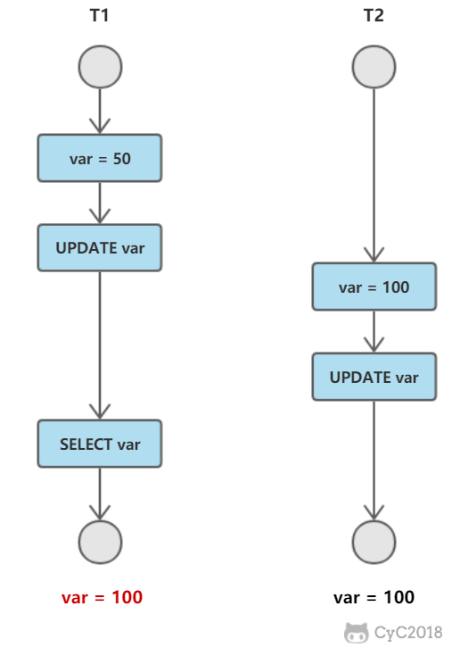
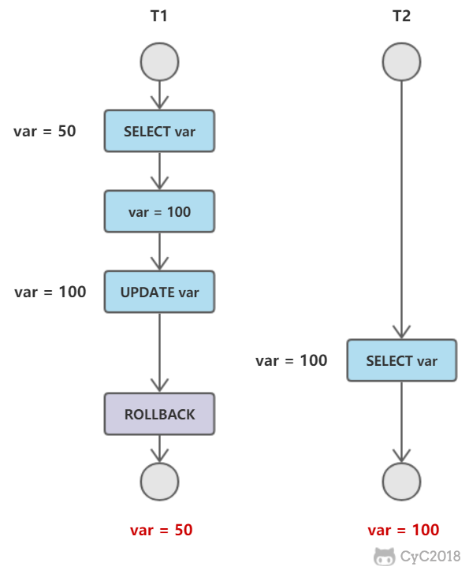
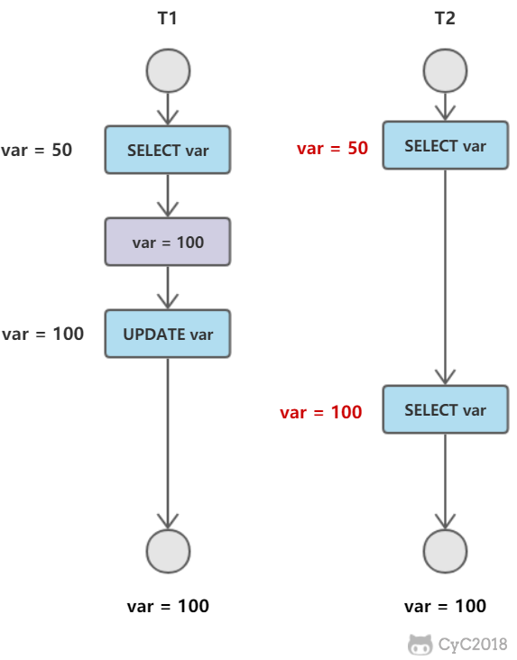
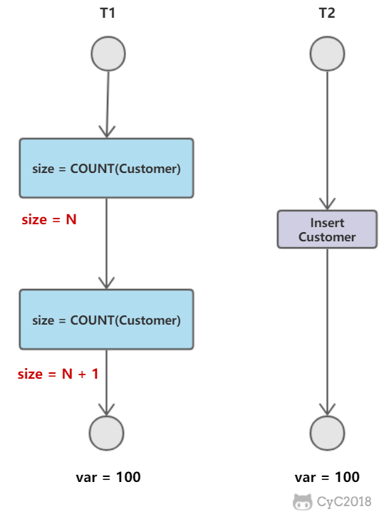
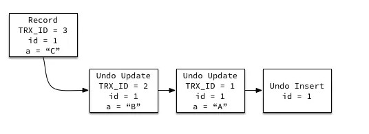

# 关系数据库设计理论

### 函数依赖

记 A->B 表示 A 函数决定 B，也可以说 B 函数依赖于 A。

如果 {A1，A2，... ，An} 是关系的一个或多个属性的集合，该集合函数决定了关系的其它所有属性并且是最小的，那么该集合就称为键码。

对于 A->B，如果能找到 A 的真子集 A'，使得 A'-> B，那么 A->B 就是部分函数依赖，否则就是完全函数依赖。

对于 A->B，B->C，则 A->C 是一个传递函数依赖。

### 异常

以下的学生课程关系的函数依赖为 Sno, Cname -> Sname, Sdept, Mname, Grade，键码为 {Sno, Cname}。也就是说，确定学生和课程之后，就能确定其它信息。

| Sno  | Sname  | Sdept  | Mname  | Cname  | Grade |
| ---- | ------ | ------ | ------ | ------ | ----- |
| 1    | 学生-1 | 学院-1 | 院长-1 | 课程-1 | 90    |
| 2    | 学生-2 | 学院-2 | 院长-2 | 课程-2 | 80    |
| 2    | 学生-2 | 学院-2 | 院长-2 | 课程-1 | 100   |
| 3    | 学生-3 | 学院-2 | 院长-2 | 课程-2 | 95    |

不符合范式的关系，会产生很多异常，主要有以下四种异常：

- 冗余数据：例如 `学生-2` 出现了两次。
- 修改异常：修改了一个记录中的信息，但是另一个记录中相同的信息却没有被修改。
- 删除异常：删除一个信息，那么也会丢失其它信息。例如删除了 `课程-1` 需要删除第一行和第三行，那么 `学生-1` 的信息就会丢失。
- 插入异常：例如想要插入一个学生的信息，如果这个学生还没选课，那么就无法插入。

### 范式

范式理论是为了解决以上提到四种异常。

高级别范式的依赖于低级别的范式，1NF 是最低级别的范式。


***第一范式 (1NF)***

属性不可分。

***第二范式 (2NF)***

每个非主属性完全函数依赖于键码。

可以通过分解来满足。

**分解前** 

| Sno  | Sname  | Sdept  | Mname  | Cname  | Grade |
| ---- | ------ | ------ | ------ | ------ | ----- |
| 1    | 学生-1 | 学院-1 | 院长-1 | 课程-1 | 90    |
| 2    | 学生-2 | 学院-2 | 院长-2 | 课程-2 | 80    |
| 2    | 学生-2 | 学院-2 | 院长-2 | 课程-1 | 100   |
| 3    | 学生-3 | 学院-2 | 院长-2 | 课程-2 | 95    |

以上学生课程关系中，{Sno, Cname} 为键码，有如下函数依赖：

- Sno -> Sname, Sdept
- Sdept -> Mname
- Sno, Cname-> Grade

Grade 完全函数依赖于键码，它没有任何冗余数据，每个学生的每门课都有特定的成绩。

Sname, Sdept 和 Mname 都部分依赖于键码，当一个学生选修了多门课时，这些数据就会出现多次，造成大量冗余数据。

**分解后** 

关系-1

| Sno  | Sname  | Sdept  | Mname  |
| ---- | ------ | ------ | ------ |
| 1    | 学生-1 | 学院-1 | 院长-1 |
| 2    | 学生-2 | 学院-2 | 院长-2 |
| 3    | 学生-3 | 学院-2 | 院长-2 |

有以下函数依赖：

- Sno -> Sname, Sdept
- Sdept -> Mname

关系-2

| Sno  | Cname  | Grade |
| ---- | ------ | ----- |
| 1    | 课程-1 | 90    |
| 2    | 课程-2 | 80    |
| 2    | 课程-1 | 100   |
| 3    | 课程-2 | 95    |

有以下函数依赖：

- Sno, Cname -> Grade

***第三范式 (3NF)***

非主属性不传递函数依赖于键码。

上面的 关系-1 中存在以下传递函数依赖：

- Sno -> Sdept -> Mname

可以进行以下分解：

关系-11

| Sno  | Sname  | Sdept  |
| ---- | ------ | ------ |
| 1    | 学生-1 | 学院-1 |
| 2    | 学生-2 | 学院-2 |
| 3    | 学生-3 | 学院-2 |

关系-12

| Sdept  | Mname  |
| ------ | ------ |
| 学院-1 | 院长-1 |
| 学院-2 | 院长-2 |

## ER 图

Entity-Relationship，有三个组成部分：实体、属性、联系。

用来进行关系型数据库系统的概念设计。

实体的三种联系

包含一对一，一对多，多对多三种。

- 如果 A 到 B 是一对多关系，那么画个带箭头的线段指向 B；
- 如果是一对一，画两个带箭头的线段；
- 如果是多对多，画两个不带箭头的线段。

下图的 Course 和 Student 是一对多的关系。


### 表示出现多次的关系

一个实体在联系出现几次，就要用几条线连接。

下图表示一个课程的先修关系，先修关系出现两个 Course 实体，第一个是先修课程，后一个是后修课程，因此需要用两条线来表示这种关系。


### 联系的多向性

虽然老师可以开设多门课，并且可以教授多名学生，但是对于特定的学生和课程，只有一个老师教授，这就构成了一个三元联系。


一般只使用二元联系，可以把多元联系转换为二元联系。


### 表示子类

用一个三角形和两条线来连接类和子类，与子类有关的属性和联系都连到子类上，而与父类和子类都有关的连到父类上。


# MySQL

## 并发一致性问题

在并发环境下，事务的隔离性很难保证，因此会出现很多并发一致性问题。

产生并发不一致性问题主要原因是破坏了事务的隔离性，解决方法是通过并发控制来保证隔离性。并发控制可以通过封锁来实现，但是封锁操作需要用户自己控制，相当复杂。数据库管理系统提供了事务的隔离级别，让用户以一种更轻松的方式处理并发一致性问题。

### 丢失修改

T1 和 T2 两个事务都对一个数据进行修改，T1 先修改，T2 随后修改，T2 的修改覆盖了 T1 的修改。




在任何隔离级别下都不会发生

但可能出现另一个问题

- 事务T1查询一行数据，放入本地内存，显示给一个用户U1
- 同时，事务T2查询该记录，显式给用户U2
- U1修改这行记录，更新并提交
- U2修改这行记录，更新并提交
- 银行转账场景下会出现问题

### 脏读

T1 修改一个数据，T2 随后读取这个数据。如果 T1 撤销了这次修改，那么 T2 读取的数据是脏数据。

脏数据：事务对缓冲池中行记录的修改，并且还没有被提交

- 如果读到了脏数据，即一个事务读取到另一个事务未提交的数据，违反了数据库的隔离性



### 不可重复读

在一个事务内多次读取同一数据集合，在这个事务还没有结束时，另外一个事务也访问该同一数据集合，并做了一些DML操作。T2 读取一个数据，T1 对该数据做了修改。如果 T2 再次读取这个数据，由于T1事务的修改，此时读取的结果和第一次读取的结果不同。




与脏读的区别：

- 脏读读到未提交的数据，不可重复读读取到已经提交的数据
- 不可重复读违反了数据库事务一致性的要求

由于读取到的是已经提交的数据，一般而言不会带来很大问题，因此一些数据库允许该现象

### 幻读

T1 读取某个范围的数据，T2 在这个范围内插入新的数据，T1 再次读取这个范围的数据，此时读取的结果和和第一次读取的结果不同。



## 封锁

### 封锁粒度

MySQL 中提供了两种封锁粒度：行级锁以及表级锁。

应该尽量只锁定需要修改的那部分数据，而不是所有的资源。锁定的数据量越少，发生锁争用的可能就越小，系统的并发程度就越高。

但是加锁需要消耗资源，锁的各种操作（包括获取锁、释放锁、以及检查锁状态）都会增加系统开销。因此封锁粒度越小，系统开销就越大。

在选择封锁粒度时，需要在锁开销和并发程度之间做一个权衡。

粒度：database、table、page、row

### 封锁类型

#### 读写锁

- 排它锁（Exclusive），简写为 X 锁，又称写锁。
- 共享锁（Shared），简写为 S 锁，又称读锁。

有以下两个规定：

- 一个事务对数据对象 A 加了 X 锁，就可以对 A 进行读取和更新。加锁期间其它事务不能对 A 加任何锁。
- 一个事务对数据对象 A 加了 S 锁，可以对 A 进行读取操作，但是不能进行更新操作。加锁期间其它事务能对 A 加 S 锁，但是不能加 X 锁。

#### 意向锁

使用意向锁（Intention Locks）可以更容易地支持多粒度封锁。

在存在行级锁和表级锁的情况下，事务 T 想要对表 A 加 X 锁，就需要先检测是否有其它事务对表 A 或者表 A 中的任意一行加了锁，那么就需要对表 A 的每一行都检测一次，这是非常耗时的。

意向锁在原来的 X/S 锁之上引入了 IX/IS，IX/IS 都是表锁，用来表示一个事务想要在表中的某个数据行上加 X 锁或 S 锁。有以下两个规定：

- 一个事务在获得某个数据行对象的 S 锁之前，必须先获得表的 IS 锁或者更强的锁；
- 一个事务在获得某个数据行对象的 X 锁之前，必须先获得表的 IX 锁。

通过引入意向锁，事务 T 想要对表 A 加 X 锁，只需要先检测是否有其它事务对表 A 加了 X/IX/S/IS 锁，如果加了就表示有其它事务正在使用这个表或者表中某一行的锁，因此事务 T 加 X 锁失败。

各种锁的兼容关系如下：

| -    | X    | IX   | S    | IS   |
| ---- | ---- | ---- | ---- | ---- |
| X    | ×    | ×    | ×    | ×    |
| IX   | ×    | √    | ×    | √    |
| S    | ×    | ×    | √    | √    |
| IS   | ×    | √    | √    | √    |

解释如下：

- 任意 IS/IX 锁之间都是兼容的，因为它们只是表示想要对表加锁，而不是真正加锁；
- S 锁只与 S 锁和 IS 锁兼容，也就是说事务 T 想要对数据行加 S 锁，其它事务可以已经获得对表或者表中的行的 S 锁。

### 封锁协议

#### 三级封锁协议

**一级封锁协议**

事务 T 要修改数据 A 时必须加 X 锁，直到 T 结束才释放锁。

可以解决丢失修改问题，因为不能同时有两个事务对同一个数据进行修改，那么事务的修改就不会被覆盖。

| T1          | T2          |
| ----------- | ----------- |
| lock-x(A)   |             |
| read A=20   |             |
|             | lock-x(A)   |
|             | wait        |
| write A=19  | .           |
| commit      | .           |
| unlock-x(A) | .           |
|             | obtain      |
|             | read A=19   |
|             | write A=21  |
|             | commit      |
|             | unlock-x(A) |

**二级封锁协议**

在一级的基础上，要求读取数据 A 时必须加 S 锁，读取完马上释放 S 锁。

可以解决读脏数据问题，因为如果一个事务在对数据 A 进行修改，根据 1 级封锁协议，会加 X 锁，那么就不能再加 S 锁了，也就是不会读入数据。

| T1          | T2          |
| ----------- | ----------- |
| lock-x(A)   |             |
| read A=20   |             |
| write A=19  |             |
|             | lock-s(A)   |
|             | wait        |
| rollback    | .           |
| A=20        | .           |
| unlock-x(A) | .           |
|             | obtain      |
|             | read A=20   |
|             | unlock-s(A) |
|             | commit      |

**三级封锁协议**

在二级的基础上，要求读取数据 A 时必须加 S 锁，直到事务结束了才能释放 S 锁。

可以解决不可重复读的问题，因为读 A 时，其它事务不能对 A 加 X 锁，从而避免了在读的期间数据发生改变。

| T1          | T2          |
| ----------- | ----------- |
| lock-s(A)   |             |
| read A=20   |             |
|             | lock-x(A)   |
|             | wait        |
| read A=20   | .           |
| commit      | .           |
| unlock-s(A) | .           |
|             | obtain      |
|             | read A=20   |
|             | write A=19  |
|             | commit      |
|             | unlock-X(A) |

#### 两段锁协议

两段锁协议是指所有事务必须分两个阶段对数据项加锁和解锁：

- 在对任何数据进行读、写操作之前，要申请并获得对该数据的封锁。

- 每个事务中，所有的封锁请求先于所有的解锁请求。

可串行化调度是指，通过并发控制，使得并发执行的事务结果与某个串行执行的事务结果相同。

事务遵循两段锁协议是保证可串行化调度的充分条件。例如以下操作满足两段锁协议，它是可串行化调度。

```SQL
lock-x(A)...lock-s(B)...lock-s(C)...unlock(A)...unlock(C)...unlock(B)
```

但不是必要条件，例如以下操作不满足两段锁协议，但是它还是可串行化调度。

```SQL
lock-x(A)...unlock(A)...lock-s(B)...unlock(B)...lock-s(C)...unlock(C)
```

### MySQL隐式与显式锁定

MySQL 的 InnoDB 存储引擎采用两段锁协议，会根据隔离级别在需要的时候自动加锁，并且所有的锁都是在同一时刻被释放，这被称为隐式锁定。

InnoDB 也可以使用特定的语句进行显示锁定：

```sql
SELECT ... LOCK In SHARE MODE;
SELECT ... FOR UPDATE;
```

## 隔离级别

使用隔离级别的开销基本一致。因此即使使用未提交读也不会得到性能的大幅提升

| 隔离级别                  | 脏读   | 不可重复读 | 幻读   |
| ------------------------- | ------ | ---------- | ------ |
| 未提交读 Read uncommitted | 可能   | 可能       | 可能   |
| 已提交读 Read committed   |        | 可能       | 可能   |
| 可重复读 Repeatable read  | 不可能 | 不可能     | 可能   |
| 可串行化Serializable      | 不可能 | 不可能     | 不可能 |

### 未提交读(Read Uncommitted)

事务中的修改，即使没有提交，对其它事务也是可见的。

允许脏读，也就是可能读取到其他会话中未提交事务修改的数据

### 提交读(Read Committed)

一个事务只能读取已经提交的事务所做的修改。换句话说，一个事务所做的修改在提交之前对其它事务是不可见的。Oracle等多数数据库默认都是该级别 (不重复读)

- 不可重复读违反了数据库事务一致性
- 由于读取到的是已经提交的数据，一般而言不会带来很大问题，因此一些数据库允许该现象

### 可重复读(Repeated Read)

保证在同一个事务中多次读取同样数据的结果是一样的。InnoDB默认级别。

采用Next-KeyLock算法避免锁的产生。

### 串行读(Serializable)

强制事务串行执行。每次读都需要获得表级共享锁，读写相互都会阻塞


## 多版本并发控制

多版本并发控制（Multi-Version Concurrency Control, MVCC）是 MySQL 的 InnoDB 存储引擎实现隔离级别的一种具体方式，用于实现提交读和可重复读这两种隔离级别。而未提交读隔离级别总是读取最新的数据行，无需使用 MVCC。可串行化隔离级别需要对所有读取的行都加锁，单纯使用 MVCC 无法实现。

### 版本号

- 系统版本号：是一个递增的数字，每开始一个新的事务，系统版本号就会自动递增。
- 事务版本号：事务开始时的系统版本号。

### 隐藏的列

MVCC 在每行记录后面都保存着两个隐藏的列，用来存储两个版本号：

- 创建版本号：指示创建一个数据行的快照时的系统版本号；
- 删除版本号：如果该快照的删除版本号大于当前事务版本号表示该快照有效，否则表示该快照已经被删除了。

### Undo日志

MVCC 使用到的快照存储在 Undo 日志中，该日志通过回滚指针把一个数据行（Record）的所有快照连接起来。



### 实现过程

以下实现过程针对可重复读隔离级别。

当开始新一个事务时，该事务的版本号肯定会大于当前所有数据行快照的创建版本号，理解这一点很关键。

**1. SELECT**

多个事务必须读取到同一个数据行的快照，并且这个快照是距离现在最近的一个有效快照。但是也有例外，如果有一个事务正在修改该数据行，那么它可以读取事务本身所做的修改，而不用和其它事务的读取结果一致。

把没有对一个数据行做修改的事务称为 T，T 所要读取的数据行快照的创建版本号必须小于 T 的版本号，因为如果大于或者等于 T 的版本号，那么表示该数据行快照是其它事务的最新修改，因此不能去读取它。除此之外，T 所要读取的数据行快照的删除版本号必须大于 T 的版本号，因为如果小于等于 T 的版本号，那么表示该数据行快照是已经被删除的，不应该去读取它。

**2. INSERT**

将当前系统版本号作为数据行快照的创建版本号。

**3.DELETE**

将当前系统版本号作为数据行快照的删除版本号。

**4. UPDATE**

将当前系统版本号作为更新前的数据行快照的删除版本号，并将当前系统版本号作为更新后的数据行快照的创建版本号。可以理解为先执行 DELETE 后执行 INSERT。

### 快照读与当前读

**快照读**

使用 MVCC 读取的是快照中的数据，这样可以减少加锁所带来的开销。

```sql
select * from table ...;Copy to clipboardErrorCopied
```

**当前读**

读取的是最新的数据，需要加锁。以下第一个语句需要加 S 锁，其它都需要加 X 锁。

```sql
select * from table where ? lock in share mode;
select * from table where ? for update;
insert;
update;
delete;
```

## Next-Key Locks

Next-Key Locks 是 MySQL 的 InnoDB 存储引擎的一种锁实现。

MVCC 不能解决幻读的问题，Next-Key Locks 就是为了解决这个问题而存在的。在可重复读（REPEATABLE READ）隔离级别下，使用 MVCC + Next-Key Locks 可以解决幻读问题。

### Record Locks

锁定一个记录上的索引，而不是记录本身，即不是行数据。

如果表没有设置索引，InnoDB 会自动在主键上创建隐藏的聚簇索引，因此 Record Locks 依然可以使用。

### Gap Locks

锁定索引之间的间隙，但是不包含索引本身。例如当一个事务执行以下语句，其它事务就不能在 t.c 中插入 15。

```sql
SELECT c FROM t WHERE c BETWEEN 10 and 20 FOR UPDATE;
```

locking reads，UPDATE和DELETE时，除了对唯一索引的唯一搜索外都会获取gap锁或next-key锁。即锁住其扫描的范围。

下面对非唯一索引做个测试。

表定义如下:

```SQL
mysql> show create table tb2;
+-------+------------------------------------------------------------------------------------------------------------------------------------------------+
| Table | Create Table                                                                                                                                   |
+-------+------------------------------------------------------------------------------------------------------------------------------------------------+
| tb2   | CREATE TABLE `tb2` (
  `id` int(11) DEFAULT NULL,
  `c1` int(11) DEFAULT NULL,
  KEY `tb2_idx1` (`id`)
) ENGINE=InnoDB DEFAULT CHARSET=utf8mb4 |
+-------+------------------------------------------------------------------------------------------------------------------------------------------------+
1 row in set (0.00 sec) 
```

表中有3条记录： 10,20,30。

```SQL
mysql> select * from tb2;
+------+------+
| id   | c1   |
+------+------+
|   10 |    0 |
|   20 |    0 |
|   30 |    0 |
+------+------+
3 rows in set (0.01 sec) 
```

在REPEATABLE READ下，更新一条记录不提交，然后看看能阻塞另外的会话哪些操作。

**SESSION 1:**

SESSION 1中更新id=20的记录

```
mysql> begin;
Query OK, 0 rows affected (0.00 sec)

mysql> update tb2 set c1=2 where id=20;
Query OK, 1 row affected (0.04 sec)
Rows matched: 1  Changed: 1  Warnings: 0 
```

**SESSION 2:**

SESSION 2中，执行插入操作，发现[10,30)范围不能插入数据。

```SQL
mysql> begin;
Query OK, 0 rows affected (0.00 sec)
mysql> insert into tb2 values(9,4);
Query OK, 1 row affected (0.00 sec)

mysql> insert into tb2 values(10,4);
ERROR 1205 (HY000): Lock wait timeout exceeded; try restarting transaction
mysql> insert into tb2 values(19,4);
ERROR 1205 (HY000): Lock wait timeout exceeded; try restarting transaction
mysql> insert into tb2 values(20,4);
ERROR 1205 (HY000): Lock wait timeout exceeded; try restarting transaction
mysql> insert into tb2 values(21,4);
ERROR 1205 (HY000): Lock wait timeout exceeded; try restarting transaction
mysql> insert into tb2 values(29,4);
ERROR 1205 (HY000): Lock wait timeout exceeded; try restarting transaction
mysql> insert into tb2 values(30,4);
Query OK, 1 row affected (0.01 sec) 
```

对于更新操作，仅20这条记录不能更新，因为更新操作不会去获取gap锁。

```SQL
mysql> begin;
Query OK, 0 rows affected (0.00 sec)
mysql> update tb2 set c1=4 where id=10;
Query OK, 0 rows affected (0.00 sec)
Rows matched: 1  Changed: 0  Warnings: 0

mysql> update tb2 set c1=4 where id=20;
ERROR 1205 (HY000): Lock wait timeout exceeded; try restarting transaction
mysql> update tb2 set c1=4 where id=30;
Query OK, 0 rows affected (0.00 sec)
Rows matched: 2  Changed: 0  Warnings: 0 
```

如果SESSION 1的表扫描没有用到索引，那么gap或next-key锁住的范围是整个表，即任何值都不能插入。

#### READ COMMITTED

```
For locking reads (SELECT with FOR UPDATE or LOCK IN SHARE MODE), UPDATE statements, 
and DELETE statements, InnoDB locks only index records, not the gaps before them,
 and thus permits the free insertion of new records next to locked records. 
```

只会锁住已有记录，不会加gap锁。

#### SERIALIZABLE

```
This level is like REPEATABLE READ, but InnoDB implicitly converts all plain 
SELECT statements to SELECT ... LOCK IN SHARE MODE if autocommit is disabled. 
```

和REPEATABLE READ的主要区别在于把普通的SELECT变成SELECT … LOCK IN SHARE MODE，即对普通的select都会获取gap锁或next-key锁。

### Next-Key Locks

它是 Record Locks 和 Gap Locks 的结合，不仅锁定一个记录上的索引，也锁定索引之间的间隙。例如一个索引包含以下值：10, 11, 13, and 20，那么就需要锁定以下区间：

```sql
(negative infinity, 10]
(10, 11]
(11, 13]
(13, 20]
(20, positive infinity)
```


# 参考 #

1. [数据库系统原理]([http://zhangchangle.com/#/notes/数据库系统原理](http://zhangchangle.com/#/notes/%E6%95%B0%E6%8D%AE%E5%BA%93%E7%B3%BB%E7%BB%9F%E5%8E%9F%E7%90%86))
