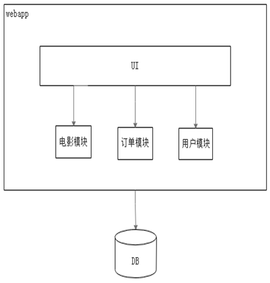

# 单体架构

​​

## 概述

一个归档包（如war格式）包含了应用所有功能的应用程序，我们通常称为单体应用。

架构单体应用的方法论，我们称之微单体应用架构

## 基础

### 优缺

***优点***：

- 部署简单
- 容易测试。不需要外部的依赖，直接就可以启动整个系统

***缺点***：

- 非常臃肿。修改一个模块需要发布整个应用。并且每次发布可能会遇到不同的问题。
- 复杂性高
  - 对于一个百万行级别的单体应用为例，整个项目包含的模块非常多，模块的边界模糊，依赖关系不清晰，代码质量参差不齐，混乱地堆砌在一起
  - 整个项目非常复杂，每次修改代码都要心惊胆战，甚至添加一个简单的功能或修改一个bug都会造成隐含的缺陷。因为应用程序的其他模块可能会以意料之外的方式使用它
- 技术债务
  - 随着时间的推移、需求变更和人员更迭，会逐渐形成应用程序的技术债务，并且越积越多。“不坏不修”的问题会很严重。
- 部署频率低
  - 随着代码的增多，构建和部署的时间也会增加。在单体应用中，每次功能的变更或缺陷的修复都会导致我们需要重新部署整个应用。
  - 全面部署耗时长，影响范围大、 风险高，使得单体应用项目上线部署的频率低，会使得在两次发布间有大量的功能交替和缺陷修复，出错频率高
- 扩展能力受限
  - 单体应用只能作为一个整体扩展，无法结合业务模块的特点进行伸缩。如IO密集型、CPU密集型
- 阻碍技术创新。
  - 要求团队每个成员使用相同的开发语言和框架。难以引入新的框架

# 参考 #

1. 
