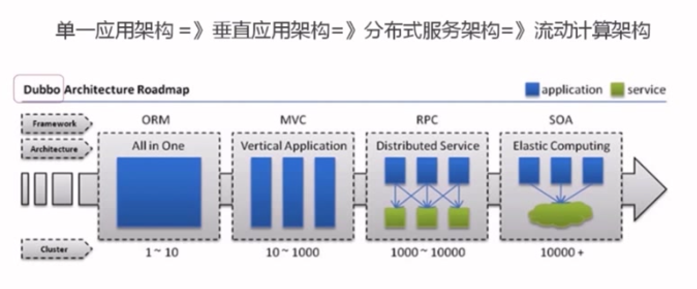

# 概述

如何打造一个高性能、高可用、易扩展、可伸缩且安全的网站。

如何让网站随应用所需灵活变动

# 大型网站软件系统的特点

与传统企业应用系统相比

- 高并发、大流量
  - 需要面对高并发用户，大流量访问
- 高可用
  - 系统7*24小时不间断服务
- 海量数据
  - 需要存储、管理海量数据，需要使用大量服务器
- 用户分布广泛，网络情况复杂
  - 需要为全球用户提供服务，各地网络情况千差万别
  - 国内，各个运营商网络互通难的问题
  - 中美光缆的数次故障，需要一些对国外用户依赖大的网站考虑建立海外数据中心
- 安全环境恶劣
  - 互联网的开放型，容易受到攻击
- 需求快速变更，发布频繁
- 渐进式发展
  - 从一个小网站渐进的发展过来

# 大型网站架构演化发展历程

任何简单的业务一旦需要处理数以P计的数据和面对数以亿计的用户，问题就会很棘手。大型网站架构主要解决这类问题

## 初始阶段的网站架构

- 一台服务器即可
- 应用程序、数据库、文件等所有资源都在一台服务器上。

## 应用服务与数据服务分离

**问题**

- 越来越多的用户导致性能越来越差，越来越多的数据导致存储空间不足

**解决方案**：将数据和应用分离

三台服务器：

- 应用服务器：需要处理大量业务逻辑，需要更强CPU
- 数据库服务器：快速磁盘检索和数据缓存，因此需要更快的磁盘和更大的内存
- 文件服务器：存储大量用户上传的文件，需要更大的硬盘

## 使用缓存改善网站性能

**问题**

- 数据库压力太大导致访问延迟，进而影响整个系统的性能

**解决方案**：

- **网站的访问特点**：二八定律，80%的业务访问集中在20%的数据上
- 将频繁访问的数据缓存在内存当中

缓存分类：

- 本地缓存，缓存在应用服务器上
  - 速度更快
  - 受内存限制，并与应用程序争夺内存
- 远程缓存，缓存在专门的分布式缓存服务器上
  - 理论上不受内存限制

## 使用应用服务器集群改善网站的并发处理能力

**问题**

- 单一应用服务器能够处理的请求连接有限，在网站访问高峰期，应用服务器成为瓶颈

**解决方案：**

增加服务器分担压力，并可以以此方式不断提升系统性能。实现系统的可伸缩性。

**负载均衡调度服务器**：将来自用户的访问请求分发到应用服务器集群的任何一台服务器中

## 数据库读写分离

**问题**：

- 数据库负载压力过高
  - 使用缓存后，绝大部分数据访问都可以不通过数据库就能完成
  - 有一部分读操作（缓存访问不命中、缓存过期）和全部的写操作需要访问数据库。会导致数据库负载压力过高

**解决方案**：

配置数据库的主从关系，将一台数据库服务器上的数据更新同步到另一台服务器上，实现读写分离。

## 使用反向代理和CDN加速网站响应

**问题：**

- 复杂的网络环境，导致不同地区的用户访问网站速度差别极大

**解决方案：**

- 加快网络响应速度，提高用户体验
- 反向代理与CDN加速
  - 原理为：利用缓存
  - CDN：部署在网络提供商的机房，使得用户在请求网站服务时，可以从距离自己最近的网络提供方机房获得数据
  - 反向代理：部署在网站的中心机房，当用户请求到达中心时，首先访问反向代理服务器，如果反向代理服务器缓存着用户请求的数据，就直接返回给用户

## 使用分布式文件系统和分布式数据库系统

**问题：**

- 任何强大的单一服务器都无法满足持续增长的业务需求
- 数据库服务器与文件服务器无法支持

**解决方案：**

- 分布式数据库与分布式文件
  - 分布式数据库是网站数据库拆分的最后手段，只有在单表数据规模非常庞大时才使用
  - 常见手段为业务分库，不同业务的数据库部署在不同服务器上

## 使用NoSQL和搜索引擎

**问题：**

- 网站业务复杂，对数据存储和检索的需求越来越复杂，需要采用一些非关系数据库（NoSQL）以及非数据库查询技术（搜索）

**解决方案：**

- NoSQL与搜索引擎都是源自互联网的技术手段，对于可伸缩的分布式特性有更好地支持
- 应用服务器通过一个统一的数据访问模块访问各种数据，减轻应用程序管理诸多数据源的麻烦

## 业务拆分

**问题：**

**解决方案：**

- 分而治之，将整个网站业务分为不同的产品线
- 将一个网站拆分为许多不同的应用，每个应用独立部署维护。
  - 应用间通过超链接建立关系。
  - 也可以通过消息队列进行数据分发
  - 最多的是通过访问同一个数据存储系统来构成一个关联的完整系统

## 分布式服务

**问题：**

- 随着业务拆分越来越小，存储系统越来越大，应用系统的复杂性指数级增大，部署维护越来越困难
- 所有应用都要与数据库系统相连接，数万台服务器中，连接的数目是服务器^2，导致数据库资源不足，拒绝服务

**解决方案：**

- 将每一个应用系统需要执行的相同业务操作提取出来独立部署
- 由这些可复用的业务连接数据库，提供公共的业务服务。
- 应用系统只需要管理用户界面，通过分布式服务调用共用业务服务完成具体业务操作

# 大型网站架构演化的价值观

网站的价值在于它能够为用户提供什么样的价值，在于能做什么，而不是怎么做的

因此在小网站上追求架构是舍本逐末的，需要做的就是为用户提供更好的服务创造价值

**核心价值观：随网站所需灵活应对**

核心价值是随着小型网站业务的逐步发展，慢慢演化为一个大型网站

**驱动大型网站技术发展的主要力量：网站的业务发展**

创新的业务发展模式对网站架构逐步提出了更高的要求，才使得创新的网站架构得以发展成熟。

业务成就了技术，后努力提高技术回馈业务

# 网站架构设计的误区

**一味追求大公司的解决方案**

**为了技术而技术**

网站技术是为业务而存在的，除此毫无意义。

在技术选型和架构设计中，脱离网站业务发展的实际，一味追求技术，会使得架构之路越走越难

**企图用技术解决所有问题**

12306的故障问题

- 真正的问题是在于业务架构
  - 在几亿中国人一票难求的情况下进行窗口售票模式在网上售票（0点后出售若干天后的车票）
  - 是一种促销秒杀
- 进行分时段售票、排队机制等，控制并发访问的量

技术是解决业务问题，业务手段也可以解决业务问题

# 总结

- 利用云计算资源，便可以对所需要的一切技术资源：计算、存储、网络都可以按需购买，线性伸缩
- 因此亲身经历架构演化之路的人会越来越少。架构师更应该对这个过程深刻了解，理解成熟的网站架构技术方案的来龙去脉和历史渊源，才能在技术选型和架构决策时有的放矢，直击要害

# 大型网站架构模式

# 参考 #

1. 
