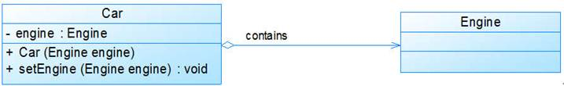
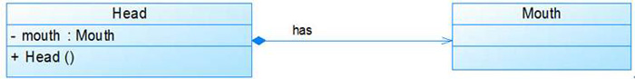
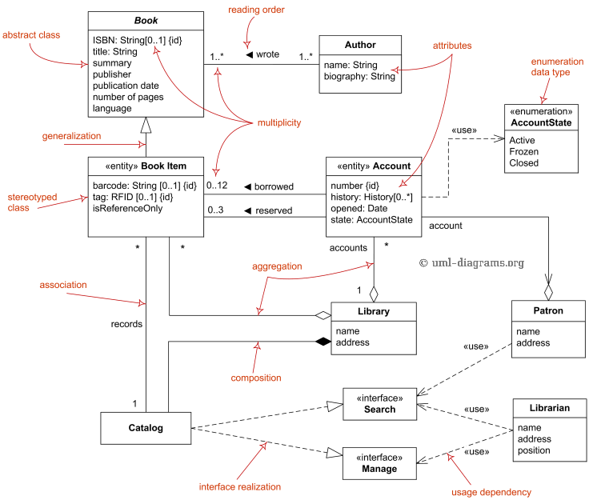

## UML静态建模

静态建模定义了系统中重要对象的属性和操作以及这些对象间的相互关系。主要包括类图、对象图、包图、构件图、部署图。

# 对象与类

## 类图

### 泛化关系

用来描述继承关系，在 Java 中使用 extends 关键字。


### 实现关系

用来实现一个接口，在 Java 中使用 implements 关键字。


### 关联与直接关联

表示不同类对象之间有关联，这是一种静态关系，与运行过程的状态无关，在最开始就可以确定。因此也可以用 1 对 1、多对 1、多对多这种关联关系来表示。比如学生和学校就是一种关联关系，一个学校可以有很多学生，但是一个学生只属于一个学校，因此这是一种多对一的关系，在运行开始之前就可以确定。

- 关联是一种拥有的关系, 它使一个类知道另一个类的属性和方法；
  - 例如企鹅与气候，企鹅是需要知道气候的变化，需要了解气候规律的。即一个类知道另一个类
- 关联暗示了依赖。关联类通常作为一个类成员变量存在
- 关联用来表示无法用聚合和组合表示的关系。如学生与老师的关系

双向关联有两个箭头或者没有箭头。而单向关联有一个箭头，表示关联的方向


### 依赖

和关联关系不同的是，依赖关系是在运行过程中起作用的，是一种使用的关系,  即一个类的实现需要另一个类的协助, 所以要尽量不使用双向的互相依赖。A 类和 B 类是依赖关系主要有三种形式：

- A 类是 B 类方法的局部变量；
- A 类是 B 类方法当中的一个参数；
- A 类向 B 类发送消息，从而影响 B 类发生变化。


- 依赖通常体现为调用一个其他所依赖类的方法
- 在代码中往往体现为依赖类作为函数参数或者局部临时变量。举例：人依赖车（**在逻辑上他们就是依赖的，如同人与空气一般**）

依赖(Dependency)关系是一种使用关系，特定事物的改变有可能会影响到使用该事物的其他事物，在需要表示一个事物使用另一个事物时使用依赖关系。大多数情况下，依赖关系体现在某个类的方法使用另一个类的对象作为参数。在UML中，依赖关系用带箭头的虚线表示，由依赖的一方指向被依赖的一方。例如：驾驶员开车，在Driver类的drive()方法中将Car类型的对象car作为一个参数传递，以便在drive()方法中能够调用car的move()方法，且驾驶员的drive()方法依赖车的move()方法，因此类Driver依赖类Car，如图1所示：


图1 依赖关系实例

在系统实施阶段，依赖关系通常通过三种方式来实现，第一种也是最常用的一种方式是如图1所示的将一个类的对象作为另一个类中方法的参数，第二种方式是在一个类的方法中将另一个类的对象作为其局部变量，第三种方式是在一个类的方法中调用另一个类的静态方法。图1对应的Java代码片段如下：

```Java
`public class Driver { 	
    public void drive(Car car) { 		
        car.move(); 	
    }     
…… }  
public class Car { 	
    public void move() {
        ...... 	
    }     
…… }  `
```

### 聚合与组合

聚合：是整体与部分的关系, 且部分可以离开整体而单独存在. 如车和轮胎是整体和部分的关系, 轮胎离开车仍然可以存在.


- 成员可独立。班级与学生

聚合(Aggregation)关系表示整体与部分的关系。在聚合关系中，成员对象是整体对象的一部分，但是成员对象可以脱离整体对象独立存在。在UML中，聚合关系用带空心菱形的直线表示。例如：汽车发动机(Engine)是汽车(Car)的组成部分，但是汽车发动机可以独立存在，因此，汽车和发动机是聚合关系，如图6所示：



在代码实现聚合关系时，成员对象通常作为构造方法、Setter方法或业务方法的参数注入到整体对象中，图6对应的Java代码片段如下：

```Java
`public class Car { 	private Engine engine;      //构造注入 	public Car(Engine engine) { 		this.engine = engine; 	}          //设值注入 public void setEngine(Engine engine) {     this.engine = engine; } …… }  public class Engine { 	…… } `
```

**组合**：是整体与部分的关系, 但部分不能离开整体而单独存在. 如公司和部门是整体和部分的关系, 没有公司就不存在部门.


- 成员不可独立。汽车与引擎（必须依赖于整体才有意义）

组合(Composition)关系也表示类之间整体和部分的关系，但是在组合关系中整体对象可以控制成员对象的生命周期，一旦整体对象不存在，成员对象也将不存在，成员对象与整体对象之间具有同生共死的关系。在UML中，组合关系用带实心菱形的直线表示。例如：人的头(Head)与嘴巴(Mouth)，嘴巴是头的组成部分之一，而且如果头没了，嘴巴也就没了，因此头和嘴巴是组合关系，如图7所示：



在代码实现组合关系时，通常在整体类的构造方法中直接实例化成员类，图7对应的Java代码片段如下：

```Java
`public class Head { 	private Mouth mouth;  	public Head() { 		mouth = new Mouth(); //实例化成员类 	} …… }  public class Mouth { 	…… } `
```

### 实战

**泛化 = 实现 > 组合 > 聚合 > 关联 > 依赖**



下面围绕类Library类分析下这个图，首先library通过组合方式关联到了Catalog类目类，这说明类目不能独立存在要依赖图书馆存在，所以这里没有使用聚合而使用了组合。另外library通过聚合关联到了Book Item 类和Account账号类，这说明图书馆是有0个或者多个图书和账户组成，这里使用聚合而不是用组合是因为书和账号可以独立于图书馆存在，比如我有学号账号，但是图书馆里面不是必然有你的账号。

下面围绕Catalog分析，类目通过双向关联关联到bookitem，说明一个类目里面可能会有0个或者多个书籍，一个书籍对应着一个类目。另外类目有通过realization实现了search类和manage类的接口，让类目有搜索和管理功能。Search类搜索时候会依赖Patron类图书捐赠人的姓名地址或者Libraian类图书管理员的姓名地址，职位。 图书管理类时候会依赖图书管理员类的信息。

而Patron图书捐赠人有可能是一个学生，学生有自己的账号，所以patron类会聚合到Account.
bookItem类通过泛化继承Book中书的共性部分信息。有通过关联关联到了account,说明一个账户只能接到0本和最多12本书，最多可以预定3本书。

最后Book类双向关联到Author类，数目一个作者至少写了1本书（严格说应该是0），一本书至少有一个作者编写，
Account账户类有依赖一个AccountState的枚举值的类用来存放账号状态。


# 参考 #

1. 
