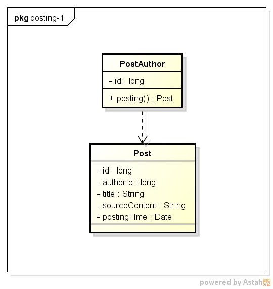
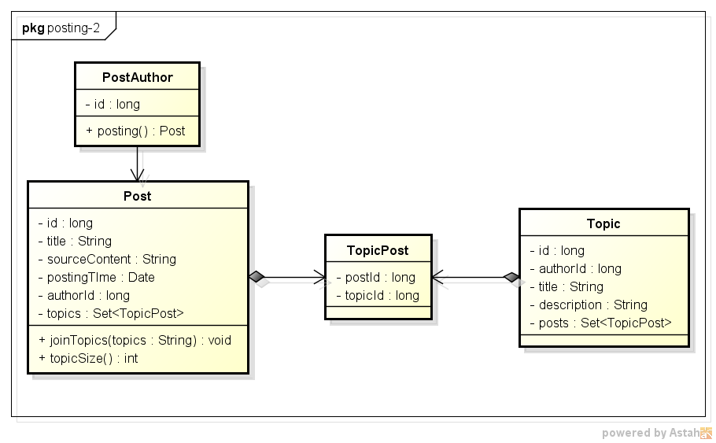
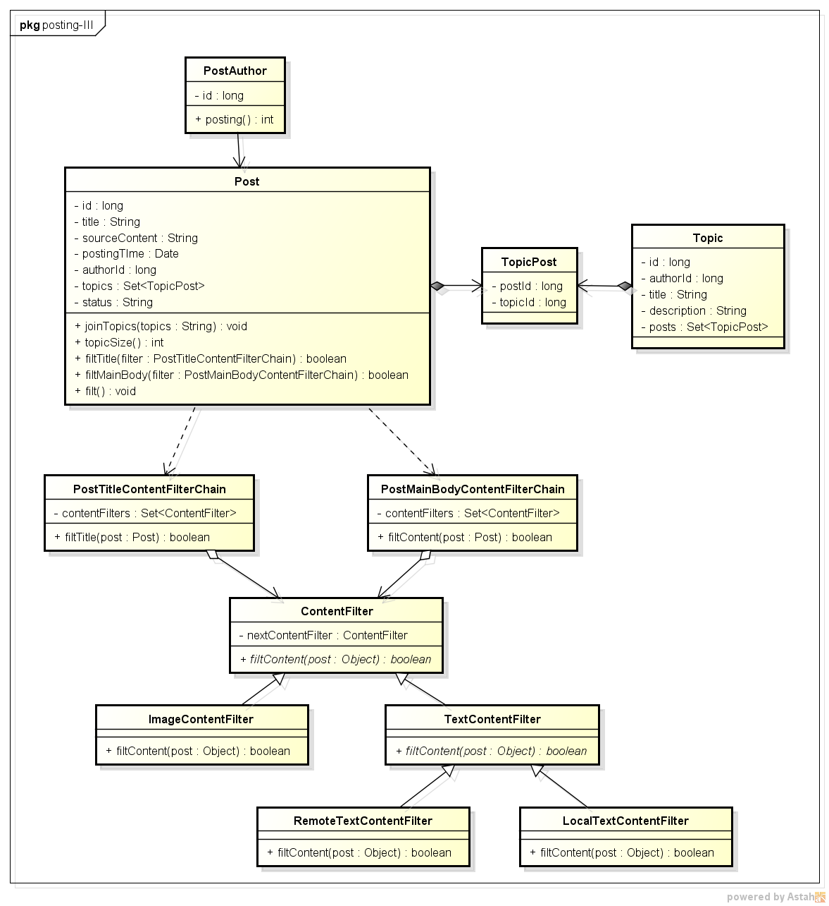

# domain建模示例

# 发布帖子


## Round-I

### 业务建模

在大家的常识中，每个人都有自己的观点，并可以发表自己的观点，在社区中便表现为：发布帖子。那么谁发布帖子呢？ 很明显是帖子作者，于是我们便可以得到如下描述：**帖子作者发布帖子**。从上述描述中，我们很容易得到如下几个实体及其行为：帖子作者（PostAuthor）、帖子（Post），而PostAuthor拥有‘发布帖子’的业务行为，我们记着：posting()。

我们再细化现有的模型中的实体。作为实体，必须有一个唯一业务标识，我们为PostAuthor添加一个'作者编号'（authorId），为Post添加一个‘帖子编号’（postId）；PostAuthor可能还存在其他一些属性，我们暂且不管，因为对于我们现在的业务场景无关紧要；再看Post实体，很明显帖子有‘帖子标题’（postTitle）、‘帖子正文’（postContent）、‘帖子发布时间’（postingTime）等等。同时，从业务上要求：帖子发帖时间即为帖子发布动作发生的时间点，帖子的作者是不能为空的，帖子的内容不能为空，帖子的标题可以为空。

​此外，为了减少垃圾帖对社区的负面影响，对于‘帖子内容'强制要求帖子内容长度必须不少于16个汉字，字母和数字等同于汉字处理。

总结可以得到‘发布帖子’场景的业务模型描述：

- **帖子作者发布帖子，帖子标题可以为空，帖子内容不能为空，且不少于16个汉字。** 

鉴于PostAuthor和Post关系紧密，我们姑且将其和Post放到同一个模块，但是Post看上去并不是PostAuthor的根实体，有点怪怪的感觉，暂且不追究。

### 业务模型

综上，于是我们得到如下的业务模型：

　　

### 代码

#### Post.java

```java
/**
 * 帖子实体
 * @author DAOQIDELV
 * @CreateDate 2017年9月16日
 *
 */
public class Post {
    
    /**
    * 帖子id
    */
    private long id;
    /**
     *帖子作者
     */  
    private long authorId;    
    /**
     * 帖子标题
     */
    private String title;
    /**
     * 帖子源内容
     */
    private String sourceContent;
    /**
     * 发帖时间
     */
    private Timestamp postingTime;
    
    public Post(long authorId, String title, String sourceContent) {
        this.setAuthorId(authorId);
        this.setTitle(title);
        this.setSourceContent(sourceContent);
        this.postingTime = new Timestamp(System.currentTimeMillis());
    }
    
    /**
     * @param authorId the authorId to set
     */
    public void setAuthorId(long authorId) {
        Assert.isTrue(authorId > 0, "Post's authorId must greater than ZERO.");
        this.authorId = authorId;
    }
    
    /**
     * @param sourceContent the sourceContent to set
     */
    public void setSourceContent(String sourceContent) {
        Assert.isTrue(!StringUtils.isEmpty(sourceContent), "Post's sourceContent must NOT be empty.");
        this.sourceContent = sourceContent;
    }

        //ignore some setter/getter
    
}
```

#### PostAuthor.java

```java
/**
 * 帖子作者
 * @author DAOQIDELV
 * @CreateDate 2017年9月16日
 *
 */
public class PostAuthor {
    
    private long id;
    
    public PostAuthor(long id) {
        this.id = id;
    }
    /**
     * 发布帖子
     * @param title
     * @param sourceContent
     * @return Post 发布得到的帖子
     */
    public Post posting(String title, String sourceContent) throws BusinessException {
        if(sourceContent.length() < 16) {
            throw new BusinessException(ExceptionCode.POST_SOURCE_CONTENT_AT_LEAST_SIXTEEN_WORDS);
        }
        Post post = new Post(this.id, title, sourceContent);
        return post;
    }
        
       //ignore some setter/getter
}
```

#### 构造方法

　　在代码示例中，我们为Post实体提供了一个私有的构造函数，其中只完成了postingTime的初始化，我们的目的是为了限制创建一个空内容的帖子，因为这在实际的业务场景中是不存在的，因此模型也不应当提供这样的构造函数；

　　另外，还提供了一个包含（authorId,title,sourceContent）的public构造函数，从当前的情形来看是够用了，如果后续有业务场景需要更多的属性传入构造函数，则我们可以重载实现，但是通常来讲，构造函数的入参最好不要超过五个，否则不利于代码阅读，当然特殊业务场景下除外；

　　最后，在构造函数中，我们并没有直接使用“this.title = title;”的写法，而是使用了这种写法："this.setTitle(title);"，好处在于我们**希望Post实体成为一个“自治的实体”，简单来讲就是可以自我检查 / 自我维护的实体**，使用setter的方式，让我们可以再setter方法中加入一些规则判定，使得外部传入的参数满足一定的规格，具体可以参考下一节中的解释。这种处理方式被Martin Fowler称之为“自封装性”，参考了《实现领域驱动设计》P184。

#### setter方法

　　接上一节中提到的“自治实体”，我们希望setter方法提供一种校验机制，确保外部传入的参数满足实体的一定规格，也就是具体的业务逻辑。比如说Post实体中的setSourceContent(String sourceContent)方法，业务规则要求：帖子的正文不能为空，因此在Post.setSourceContent(sourceContent)中加入了Assert断言，确保这一规则被强制实现。

　　参考自Eric Evans的《领域驱动设计》P154。

#### posting方法

　　PostAuthor实体现在有了一个业务方法：posting()，它接受具体帖子信息属性，最后返回一个Post实体，很明显PostAuthor现在作为一个Post实体的**factory**存在。

　　posting方法对外声明会throw出一个BusinessException异常，BusinessException异常是自定义的业务异常大类，该异常会统一交由框架统一异常处理，这样确保domain领域的干净。posting方法中判定“帖子内容小于16个字”时，便会向上层抛出异常码为2000的BusinessException，

## Round-II

### 业务建模

　　我们继续往下探寻业务实体。在讨论中，我们发现发布帖子时，通常需要选择关联哪些话题，且一次性可以关联多个话题，最多可以关联五个话题，且话题不能重复加入。我们尝试用一句话将上述模型表述出来：

- **帖子可以加入不多于五个话题，且话题不能重复加入。**

　　这样就引入了一个新的实体：话题（Topic），话题持有唯一业务标识，话题应当拥有这些常见的属性：话题名称（title）、话题简介（description）、话题创建者（authorId）、话题创建时间（creatingTime）等；其中，话题名称、话题内容和话题创建者均不能为空。由于这些属性和‘创建话题’的case相关，在这里我们不做过多讨论。

　　那么Post和Topic的关系是什么呢？肯定不是“聚合”的关系，因为即使Topic消失了，但是Post还在；也不会是“组合”关系，Topic并不是由许多的Post组合而成的；正如业务建模中的描述：Post关联多个话题，所以Post和Topic之间是1：N的关联关系。那么我们是否应当让Post持有多个Topic呢？显然太重了，Topic是一个实体，实体的状态/属性值是会发生改变的，Topic状态发生改变就会引起Post实体内容改变，因此，我们可以有如下两种处理方式：

1. 引入一个值对象TopicId，让Post关联多个TopicId，这个值对象只有一个属性值：topicId，表征Topic的唯一标识值；这是《实现领域驱动设计》中的实现方式；
2. 引入一个值对象TopicPost，表征“话题相关的帖子”，这个值对象可以有更多的属性值。

　　对比下来，方案2扩展性会更好，且表达能力更强，同时TopicPost这个值对象还可以应用到Topic实体中，在Topic相关的业务case中，会有找到一个Topic下关联的帖子列表的场景，这时候会发现TopicPost便大有用处了。

　　那么TopicPost和Post之间还是关联关系吗？显然不是。一个Post被删除，那么与其相关的TopicPost值对象也就不复存在了，因此Post持有多个TopicPost，他们是组合关系。

　　那么TopicPost是属于Topic模块（module）还是属于Post模块，很简单，它以“Topic”打头，因此我们将TopicPost放入Topic模块中。

　　再来看业务行为，我们将“帖子加入话题”这个业务行为命名为joinTopics(String topics)，字面上‘帖子’是主语，显然joinTopics是Post的业务方法，在这个业务方法中，我们实现业务规则：帖子可以加入的话题数不能多于五个。

　　上述关于TopicPost值对象引入的讨论非常典型，在两个实体存在关联关系时，可以参考建模。

### 业务模型 

　　综合上面的讨论，我们得到最新的业务模型如下：



### 代码

PostAuthor.java没有变化，更改Post.java，新增Topic.java和TopicPost.java：

#### Post.java(new)

```java
public class Post {
      ......  
    /**
     * 将帖子关联话题 
     * @param topicIds 话题集合
     */
    public void joinTopics(String topicIds) throws BusinessException{
        if(StringUtils.isEmpty(topicIds)) {
            return;
        }
        String[] topicIdArray = topicIds.split(CommonConstants.COMMA);
        for(int i=0; i<topicIdArray.length; i++) {
            TopicPost topicPost = new TopicPost(Long.valueOf(topicIdArray[i]), this.getId());
            this.topics.add(topicPost);
            if(topicSize() > MAX_JOINED_TOPICS_NUM) {
                throw new BusinessException(ExceptionCode.ONE_POST_MOST_JOIN_INTO_FIVE_TOPICS);
            }
        }
    }
    
    /**
     * 获取本帖子加入的话题数，参考jdk collection的api设计
     * @return 本帖子加入的话题数
     */
    public int topicSize() {
        return this.topics.size();
    }
      ......
}
```

#### Topic

```java
/**
 * @author DAOQIDELV
 * @CreateDate 2017年9月16日
 *
 */
public class Topic {
    /**
     * 话题id
     */
    private long id;
    /**
     * 话题标题
     */
    private String title;
    /**
     * 话题描述
     */
    private String description;
    /**
     * 话题创建时间
     */
    private Timestamp createTime;
    /**
     * 话题下的帖子列表
     */
    private Set<TopicPost> posts;

        ......
}
```

#### TopicPost

```java
/**
 * @author DAOQIDELV
 * @CreateDate 2017年9月16日
 *
 */
public class TopicPost {
    
    private long postId;
    
    private long topicId;
    
    public TopicPost(long topicId, long postId) {
        this.setPostId(postId);
        this.setTopicId(topicId);
    }
    
    @Override
    public boolean equals(Object anObject) {
        if (this == anObject) {
            return true;
        }
        if(anObject instanceof TopicPost) {
            if(this.postId == ((TopicPost)anObject).getPostId()
                    && this.topicId == ((TopicPost)anObject).getTopicId()) {
                return true;
            }
        } 
        return false;    
    }    
    
    @Override
    public int hashCode() {
        return Long.hashCode(this.postId+this.topicId);
    }

}
```

### 组合关系集合化处理

　　如前面业务建模分析，Post持有多个TopicPost，他们是组合关系。代码中Post持有一个TopicPost类型的Set，最初这个topics属性没有被初始化，导致在每次用到它的时候都要去判空，代码冗余度高，可读性差，后面参考java集合的api设计，将topics这个Set直接在声明时就完成初始化，后续使用就没有后顾之忧了。这一个模式可以参考Martin Fowler的《重构》P208。

　　‘帖子加入话题’的场景只涉及到了topics集合的元素添加，所以，这里暂且定义了两个api：joinTopics(), topicSize()，至于topics的查询、删除操作在后续的建模场景中会逐一涉及到。

### 改写TopicPost的equals和hashCode方法

　　一个帖子不能重复加入某个话题，因此我们使用了HashSet这种数据结构，HashSet中的元素是不能重复的，所以在向HashSet中add元素时，HashSet会判定元素是否相等（== || equals），默认的Object方法equals实现既是比较两个对象是否相等（==），这会带来一个问题：两个在业务上表征同一个帖子加入同一个话题的TopicPost对象会被认为是不相等的两个对象，因此我们需要重写TopicPost的equals和hashCode方法，使之和业务模型保持一致。

　　equals()的实现参考了java.lang.String的写法；hashCode()的重写最佳实践参考了《重构》P185：读取equals()使用的所有字段的hash码，然后对他们进行按位异或操作。hashCode()的目标是保证在对该对象进行集合类api操作时，能保证较好的散列性，因此只要能达到这个目标就行，鉴于TopicPost中equals方法是用到的topicId和postId均为Long型，也可以简单地这么实现：Long.hashCode(this.postId + this.topicId)。

## Round-III

### 业务建模

　　为确保社区帖子的质量，以及满足国家法律法规的要求，我们需要对帖子标题和内容进行敏感词、广告语、色情、暴力等内容过滤，这些内容过滤即需要调用第三方服务完成，又需要经过社区系统自己积累的敏感词和广告词过滤，对于帖子标题和帖子正文，只要其中一项被过滤服务发现异常，则该帖子就需要被列入待审核队列，等待运营人员审核完成后才能对外发布。我们尝试使用一句话来描述上述case：

- 　　**帖子标题和内容通过内容过滤后方能发布，如果未能通过内容过滤，则需要经过运营审核之后才能发布。**

　　可以看到上面场景中出现了一个新的短语“内容过滤”，它不是一个实体，看上去像是一个业务行为，是对帖子的标题和内容进行内容过滤，那么我们是不是直接放置到Post实体上呢？ 由于这个内容过滤的行为比较复杂，且涉及到第三方过滤服务的调用，且对帖子标题和帖子内容的过滤逻辑类似，因此我们有必要将“内容过滤”从帖子实体中抽离出来，变成一个领域服务，我们将之命名为：ContentFilter。

　　考虑到存在多场景多规则的过滤，且只要一个命中一个过滤规则，就可以认为该帖子审核不通过，因此可以使用‘责任链模式’来设计。关于责任链模式的实现和优缺点这里不再赘述，可参考网上资料，或直接看代码即可。

　　另外，我们发现上面的case描述中，还出现了‘内容过滤未通过’的字样，表明Post需要有一个属性来表征内容过滤的结果，考虑到可见case中存在帖子被用户删除等状态，我们记为“帖子状态”（staus），字典定义为：00 -- 已发布；01 -- 待运营审核；99 -- 已删除。

　　上面虽然已经创建了一个领域服务专门来承担‘内容过滤’的职责，但是这个业务行为仍然应当属于Post实体，因此我们为Post增加一个filt()业务行为，在这个业务行为中，会去调用“过滤标题”（filtTitle()） 和 “过滤正文”（filtMainBody()）l两个业务方法完成。而filtTitle()和filtMainBody()则会将具体的内容过滤工作委托给上面提到的责任链模式实现的领域服务ContentFilter。

　　由于ContentFilter这一领域服务采用责任链模式实现，类较多，如果放置到post module下面，不利于阅读，且考虑到后续的评论等场景可能使用到这个服务，故将其单独建立module，取名为：domain.service.contentfilter。

### 业务模型

　　综上，我们可以得到如下业务模型：

 

### 代码

Post.java(new)

PostStatus.java

PostMainBodyContentFilterChain.java

PostTitleContentFilterChain.java

ContentFilter.java

ImageContentFilter.java

 TextContentFilter.java

LocalTextContentFilter.java

RemoteTextContentFilter.java

## Summarize

### 最终模型

汇总上面建模过程中对模型的描述，我们得到如下：

- **帖子作者发布帖子，帖子标题可以为空，帖子内容不能为空，且不少于16个汉字；**
- **帖子可以加入不多于五个话题，且话题不能重复加入；**
- **帖子标题和内容通过内容过滤后方能发布，如果未能通过内容过滤，则需要经过运营审核之后才能发布。**

业务模型图可以参考Round-III中的模型图。

### 建模经验

#### 尝试用一句完整的话说描述业务场景

　　仔细观察，我们发现最终得到的业务模型描述其实和产品经理的PRD契合度非常高，但是产品经理的PRD描述很多适合缺少主语，或者语言分散，需要我们通过建模，将语言重新组织，找到业务实体，找到业务行为，找到业务规则，并反映在模型上。反过来想，我们的业务模型对于产品经理/业务专家来讲也不会陌生，因为我们都是使用统一的业务模型语言进行描述，大家都能懂才对。

#### 小步快走，逐步迭代

　　’发布帖子‘这个业务场景我们经历了三轮迭代，最终得到了一个较完整的业务模型，每一轮迭代，我们都将焦点聚集在一个case，落实模型之后，再继续往前推进。文章描述起来比较啰嗦，实际建模过程中，可能很快就能完成三轮迭代，得到较满意的模型，但是实际的建模过程应当是和文章描述一样的。

#### 有用的模式

1. 具有关联关系的实体，可以为这种关联关系引入一个值对象，从而降低实体间的耦合，比如：在Post和Topic之间引入了TopicPost值对象；
2. 实体 / 值对象 之间存在组合 / 聚合关系，在设计对外的api时，可以参考jdk中集合的api设计，达到高内聚的目标，这在《重构》这本书中被称为“封装集合（Encapsulate Collection）”，比如：Post实体中的topics话题集便参考Set对外提供api；
3. 配合第2点的实现，通常需要重写equals()和hashCode()方法，最佳实践可以参考示例代码；
4. 极力推荐使用合适的设计模式，提高代码的扩展性和可维护性，比如：contentFilter领域服务组件便采用了“责任链模式”来实现；
5. 当实体依赖于领域服务时，可以讲领域服务作为实体业务方法的参数传入，尤其是当领域服务被ioc容器管理时。比如：contentFilter领域服务组件作为Post的filt()方法的参数传入。

# 参考 #

1. 

