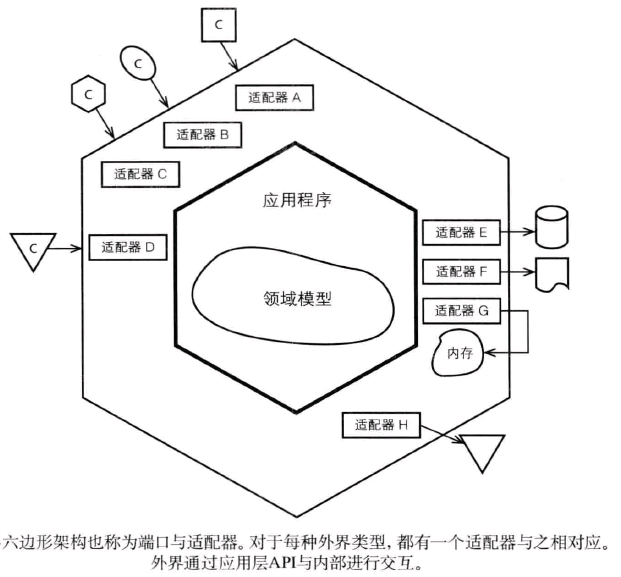
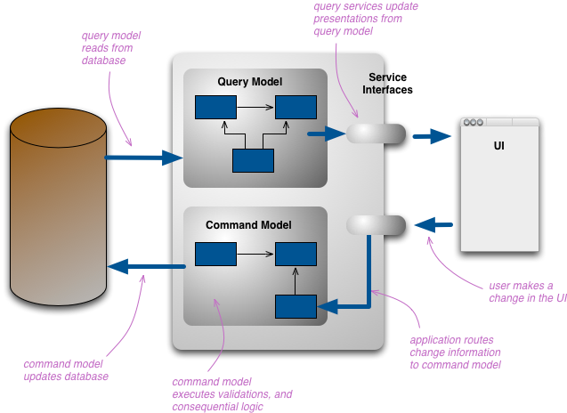

# 精要

### 核心

1. 将所有业务逻辑内聚到业务领域（domain）层，将设计和开发的关注点聚焦到业务领域；
2. 建立通用的‘业务领域语言（Ubiquitous Language）’，Ubiquitous Language是工程师和业务领域专家（可以是产品经理、运营、业务相关人员）的桥梁；
3. 战略上，通‘上下文（Bounded Context）’解耦各个业务系统/组件，通过‘防腐层（Anticorruption layer）’确保自有业务领域不受外界污染，通过‘开放主机服务（Open Host Service）’向外界公开服务；
4. 战术上，将业务对象建模为entity和value object，entity有唯一业务标识且在其生命周期中状态可变，value object与之相反；关联性强的entity和value object聚合成一个Aggregate，每个Aggregate有一个root entity，确保Aggregate内容业务规则和行为的一致性；业务行为尽量建模在entity/ value object 上，当业务行为无法建模到任何业务entity/value object时，可以使用领域服务（domain service），使用factory创建复杂的业务entity，使用repository实现实体的重建和持久化操作；领域相关的通知等可以通过domain event发布出去。

### 概念

- **Bounded context：边界上下文**

划分领域边界，边界内领域模型保持一致，强调内聚，并与边界外的领域模型解耦。

- **Entity：领域实体**

有唯一标识，可变的业务实体对象，它有着自己的生命周期。比如User、帖子等。

- **Value Object：领域值对象**

没有唯一业务标识，通常依附于其他领域实体，值对象的内容不可变，要么被整体替换。如：用户点赞行为等。

- **Aggregate：聚合**

是一组业务关联度很强的实体/值对象集合，每个聚合都有一个根实体（Root Entity），通过根实体可以路由到整个聚合。

- **Domain Event：领域事件**

领域中发生的异步处理事件、异步消息通知等，比如：异步写入的登录历史记录。通常借助消息队列实现。

- **Domain Service：领域服务**

当某些业务行为无法归类到某一个Entity/Value Object时，我们便可以创建领域服务来完成。比如：账户转账场景，涉及到两个不同的Account实体，再比如社区的敏感词过滤场景，帖子可以用，评论亦可以用，因此可以抽离到ContentFilter中完成。

- **Repository：仓库**

严格意义上将仓库是基础设施层的东西，但是为了保持领域模型的整体性，我们将仓库的接口定义放到领域中，这样可以在领域中约束实体/值对象的增删改查接口，同时还可以方便地完成仓库的内存形式实现，使得领域模型弱依赖于持久化层。这一点在书中被成为‘依赖倒置’（参考《实现领域驱动设计》P372）。

- **Factory：领域对象工厂**

用于复杂领域对象的创建/重建。重建是指通过respostory加载持久化对象后，重建领域对象。

### 优点

- 业务逻辑内聚到业务领域层，可以更好的保证业务规则的一致性；
- 软件的可维护性和可扩展性增强，工程师可以聚焦在业务领域层，并致力于业务领域模型的迭代和维护，适应新业务的发展；
- 软件的可测试性增强，领域层代码不需要借助用户接口层的入口便可以独立测试业务逻辑，通过repository的哑实现可以摆脱对数据持久层的依赖；
- 软件工程师和业务领域专家（产品经理）使用同一种语言交流，沟通成本降低，提升效率；【这一点在现实中或多或少在使用，但是比较模糊，很多时候大家会用到‘领域’这个词语，但是并不会刻意地坐下来讨论各自领域应当包含哪些实体......这也是大家可以进步的地方。】

### 缺点

- 对工程师有较高的业务建模技能要求，期望他们能从复杂的业务上下文中识别出正确的业务模型，并将各个业务行为归入合适的entity/value object/domain service中；
- 项目前期需要投入更多的时间进行业务建模，不能快速进入开发阶段；
- 需要资深的业务领域专家参与进来，否则业务模型的频繁重构（重大改动）会带来额外成本；
  DDD适用场景
- 业务逻辑复杂的系统；不太复杂的业务系统没有必要使用DDD，比如内容管理系统，只是对内容进行简单的增删改查；再比如渠道接入层系统，只是做请求的转发和翻译，没有核心业务逻辑，就没有必要使用DDD。
- 有资深的业务领域专家支持，需要有一个很懂业务的人，在业务上提供指导性的意见；
- 工程师都认可DDD设计思路，并积极主动地探讨和迭代，将业务模型日趋完善；
- 项目工期压力可以接受。

# 架构风格

针对DDD的架构，《实现领域驱动设计》提到了几种架构风格：六边形架构、REST架构、CQRS、事件驱动等。在实际使用中，落地的架构并非是纯粹其中的一种，而很有可能户将上述几种架构风格结合起来实现。

## 六边形架构（端口和适配器）

所谓的六边形架构，其实是分层架构的扩展，原来的分层架构通常是上下分层的，比如常见的MVC模式，上层是对外的服务接口，下层是对接存储层或者是集成第三方服务，中层是业务逻辑层。我们跳出分层的概念，会发现上面层和下面层其实都是端口+适配器的实现，上面层开放http/tcp端口，采用rest/soap/mq协议等对外提供服务，同时提供对应协议的适配器；下层也是端口+适配器，只不过应用程序这时候变成了调用者，第三方服务或者存储层提供端口和服务，应用程序本身实现适配功能。

基于上述思考，将分层接口中的上层和下层统一起来就变成了六边形架构，基于端口和适配器的实现，示意图如下：

​                                     *上图来源于《实现领域驱动设计》的P111*

我认为六边形架构并非创造一种新的架构风格，只是将原来的分层架构风格重新解读，使得架构更加简洁通用。同时，在DDD的设计思想下，六边形架构风格，让领域模型处于架构的核心区域，让开发人员将焦点聚集到领域。**DDD和六边形架构是天然契合的，是DDD的首选架构。**

## REST

REST——即Representational State Transfer的缩写，翻译过来是"表现层状态转化"。参考至：[理解RESTful架构](http://www.ruanyifeng.com/blog/2011/09/restful)。

RESTful风格的架构将‘资源’放在第一位，每个‘资源’都有一个URI与之对应，可以将‘资源’看着是ddd中的实体；RESTful采用具有自描述功能的消息实现无状态通信，提高系统的可用性；至于‘资源’的哪些属性可以公开出去，针对‘资源’的操作，RESTful使用HTTP协议的已有方法来实现：GET、PUT、POST和DELETE。

在DDD的实现中，我们可以将对外的服务设计为RESTful风格的服务，将实体/值对象/领域服务作为'资源'对外提供增删改查服务。但是并不建议直接将实体暴露在外，一来实体的某些隐私属性并不能对外暴露，二来某些资源获取场景并不是一个实体就能满足的，因此我们在实际实践过程中，在领域模型上增加了dto这样一个角色，dto可以组合多个实体/值对象的资源对外暴露。

## CQRS

CQRS——Cammand-Query Responsibility Segregation的缩写。翻译过来就是“[命令与查询职责分离](http://www.udidahan.com/2009/12/09/clarified-cqrs/)”。

简而言之，CQRS就是平常大家在讲的读写分离，通常读写分离的目的是为了提高查询性能，同时达到读/写的解耦。让DDD和CQRS结合，我们可以分别对读和写建模，查询模型通常是一种非规范化数据模型，它并不反映领域行为，只是用于数据显示；命令模型执行领域行为，且在领域行为执行完成后，想办法通知到查询模型。

那么命令模型如何通知到查询模型呢？ 如果查询模型和领域模型共享数据源，则可以省却这一步；如果没有共用数据源，则可以借助于‘消息模式’（Messaging Patterns）通知到查询模型，从而达到最终一致性（Eventual Consistency）。

Martin在blog中指出：CQRS适用于极少数复杂的业务领域，如果不是很适合反而会增加复杂度；另一个适用场景为获取高性能的服务。

 

　　　　*图片来源于Martin Fowler的blog，图中表述的查询模型和命令模型共用数据源。*

关于CQRS的讨论可以参考Martin大叔的blog：[CQRS](https://martinfowler.com/bliki/CQRS.html)，以及：[CQRS, Task Based UIs, Event Sourcing agh!](http://codebetter.com/gregyoung/2010/02/16/cqrs-task-based-uis-event-sourcing-agh/)

## 事件驱动

 这一架构风格在实际项目中并未使用，不做过多阐述，感兴趣的同学自行研究。

# 架构实例

结合最近在重构的社区服务系统（COMMUNITY），尝试使用上述的指导思想和架构风格，完成一次架构设计尝试，并详述如下：

## 架构图

 

##  架构详述

COMMUNITY系统架构整合了六边形架构、RESTful架构风格、CQRS架构风格三种架构风格，并遵循经典的分层架构思想。

1、在遵循分层架构思想的基础上，引入了六边形架构风格，对内对外均通过适配器+端口的方式呈现：

- 面向用户侧，提供http端口，并使用SpringMVC框架的RequestMapping、Controller等组件实现对http 请求的解析，转化为Application层可识别的业务dto对象，这里的Controller+RequestMapping便起着适配器的作用；
- 面向第三方服务，通过httpclient和tcpclient的适配，可以对接多种协议的第三方服务端口；
- 面向存储层，通过mongoclient的适配，访问mongodb；通过mybatis的适配，访问oracle；通过redisclient的适配，访问redis；
- 面向消息中间件，通过mqclient的适配，方为rabbitMQ；

2、实现了RESTful架构风格，通过RESTful风格的接口契约对外提供主机开放服务。借助SpringMVC实现。

3、实现了CQRS架构风格：

- orcale作为命令模型存储存在，并配以Transaction事务管理。主要存储帖子、评论、话题、圈子、关注等实体信息；
- Mongodb作为查询模型存储存在，存储个人动态、社区动态等非结构化数据；
- redis同样作为查询模型存储存在，存储用户个人信息、热门评论、热门帖子、热门话题、用户点赞信息等；
- Application层分为QueryService和CommandService两大类应用服务，分别组合查询模型和命令模型；
- 使用rabbitMQ作为消息中间件，CommandService在完成命令模型的维护后，生产事件消息写入rabbitMQ，QueryService作为消费者从rabbitMQ读取事件消息，更新查询模型；
- 查询模型和命令模型极其对应的application service可以独立部署，独立扩展。

4、遵循基本的分层架构风格。

- User Interface —— 用户接口层。对外提供各种协议形式的服务，并提供Validation参数校验，authenticate权限认证，业务实体组装器Assembler等。图中**标绿**组件。
- Application —— 应用服务层。组合多个业务实体、基础设施层的各种组件完成业务服务。图中**标黄**部分。
- Domain —— 业务领域层。DDD概念中的核心业务层，封装所有业务逻辑，包含entity、value object、domain service、domain event等。图中**标蓝**部分。
- Infrastructure —— 基础设施层。提供公共组件，如：Logging、Trascation、HttpClient等。图中**标灰**部分。

# 参考 #

1. 

