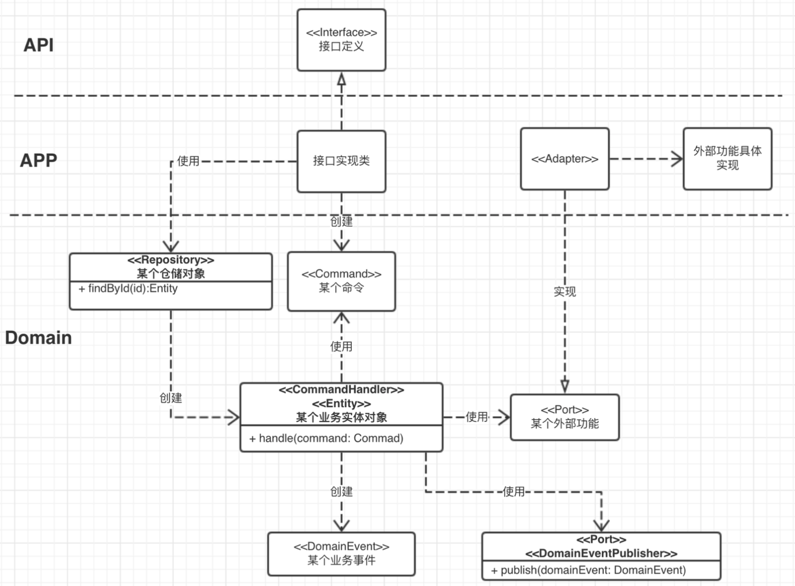

# 代码骨架



- 

# iface

定义接口iface

- 响应返回的类要用RpcResult包装

请求的接口的字段类req

请求返回的类res

# app

在该层实现iface层的接口

将请求转换为命令，handle处理command

若是app抛出的face异常就抛出face的异常，若是domain的异常就抛出domain的异常

## 简介

在DDD设计思想中，Application层主要职责为组装domain层各个组件及基础设施层的公共组件，完成具体的业务服务。Application层可以理解为粘合各个组件的胶水，使得零散的组件组合在一起提供完整的业务服务。在复杂的业务场景下，一个业务case通常需要多个domain实体参与进来，所以Application的粘合效用正好有了用武之地。

Application层主要由：service、assembler组成，下面分别对其做讲解。

## Service

### service是组件粘合剂

这里的Service区别于domain层的domain service，是应用服务。它是组件的粘合剂，组合domain层的各个组件和 infrastructure层的持久化组件、消息组件等等，完成具体的业务逻辑，提供完整的业务服务。

通过不断的实践，我们发现：通过DDD实现业务服务时，检验业务模型的质量的一个标准便是 —— service方法中不要有if/else。如果存在if/else，要么就是系统用例存在耦合，要么就是业务模型不够友好，导致部分业务逻辑泄漏到service了。

通常意义上，一个业务case在service层便会对应一个service方法，这样确保case实现的独立性。拿社区服务中的“帖子”模块来讲，我们有如下几个明显的case：发帖（posting）、删帖（deletePost）、查询帖子详情（queryPostDetail），这些case在service层都对应独立的业务方法。

### 思考

对于较为复杂的case：查询帖子列表，可能需要根据不同的tag过滤帖子，或者查询不同类型的帖子，或者查询热门帖子，这个时候应当用一个service方法实现呢？还是多个呢？

考虑这个问题，主要从这两方面入手：domain的一致性，数据存储的一致性；如果两个一致性都满足，那么我们可以在一个业务方法中完成，否则就要在独立的业务方法中完成。

例如：根据帖子运营标签查询帖子 和 查询全部帖子列表 这两个case我们可以放到一个service方法中实现，因为前一个case只是在后一个case的基础上加了一个过滤条件，这个过滤条件完全可以交给dao层的sql where条件处理掉，除此之外，domain和repository都完全一样；

而“查询热门帖子” 这个case就不能和上面的两个case共用一个service方法了，因为热门帖子列表的数据源并不在数据库中，而是存在于缓存中，因此repository的取数逻辑存在很大差异，如果共用一个service方法，势必要在service层出现if/else判定，这是不友好的。

### 类图


### code

```java
@Service
public class PostServiceImpl implements PostService {
    
    @Autowired
    private IPostRepository postRepository;
    
    @Autowired
    private PostAssembler postAssembler;
    


    public PostingRespBody posting(RequestDto<PostingReqBody> requestDto) throws BusinessException {
        PostingReqBody postingReqBody = requestDto.getBody();
        /**
         *NOTE： 请求参数校验交给了validation，这里无需校验userId和postId是否为空
         */
        String userId = postingReqBody.getUserId();
        String title = postingReqBody.getTitle();
        String sourceContent = postingReqBody.getSourceContent();
        
        long userIdInLong = Long.valueOf(userId);
        
        /**
         * 组装domain model entity
         * NOTE：这里的PostAuthor不需要从repository重载，原因在于：deletePost场景需要用户登录后才能操作，
         *         在进入service之前，已经在controller层完成了用户身份鉴权，故到达这里的userId肯定是合法的用户
         */
        PostAuthor postAuthor = new PostAuthor(userIdInLong);
        Post post = postAuthor.posting(title, sourceContent);
        
        /**
         * NOTE：使用repository将model entity 写入存储
         */
        postRepository.save(post);
        
        /**
         * NOTE：使用postAssembler将Post model组装成dto返回。
         */
        return postAssembler.assemblePostingRespBody(post);
    }
    

    public DeletePostRespBody delete(RequestDto<DeletePostReqBody> requestDto) throws BusinessException {
        DeletePostReqBody deletePostReqBody = requestDto.getBody();
        
        /**
         *NOTE： 请求参数校验交给了validation，这里无需校验userId和postId是否为空
         */
        String userId = deletePostReqBody.getUserId();
        String postId = deletePostReqBody.getPostId();
        
        long userIdInLong = Long.valueOf(userId);
        long postIdInLong = Long.valueOf(postId);
        
        /**
         * 组装domain model entity
         * NOTE：这里的PostAuthor不需要从repository重载，原因在于：deletePost场景需要用户登录后才能操作，
         *         在进入service之前，已经在controller层完成了用户身份鉴权，故到达这里的userId肯定是合法的用户
         */
        PostAuthor postAuthor = new PostAuthor(userIdInLong);
        /**
         * 从repository中重载domain model entity
         * 借此判断该postId是否真的存在帖子
         */
        Post post = postRepository.query(postIdInLong);
        
        postAuthor.deletePost(post);
        
        postRepository.delete(post);        
        
        return null;
    }


    @Override
    public QueryPostDetailRespBody queryPostDetail(RequestDto<QueryPostDetailReqBody> requestDto)
            throws BusinessException {
        QueryPostDetailReqBody queryPostDetailReqBody = requestDto.getBody();
        
        String readerId = queryPostDetailReqBody.getReaderId();
        String postId = queryPostDetailReqBody.getPostId();
        
        long readerIdInLong = Long.valueOf(readerId);
        long postIdInLong = Long.valueOf(postId);
        
        //TODO 可能有一些权限校验，比如：判定该读者是否有查看作者帖子的权限等。这里暂且不展开讨论。
        PostReader postReader = new PostReader(readerIdInLong);
        
        Post post = postRepository.query(postIdInLong);
        
        /**
         * NOTE: 使用postAssembler将domain层的model组装成dto，组装过程：
         *         1、完成类型转换、数据格式化；
         *         2、将多个model组合成一个dto，一并返回。
         */
        return postAssembler.assembleQueryPostDetailRespBody(post);
    }    

}
```

## Assembler

### Assembler是组装器

Assembler是组装器，负责完成domain model对象到dto的转换，组装职责包括：

1. 完成类型转换、数据格式化；如日志格式化，状态enum装换为前端认识的string；
2. 将多个domain领域对象组装为需要的dto对象，比如查询帖子列表，需要从Post（帖子）领域对象中获取帖子的详情，还需要从User（用户）领域对象中获取用户的社交信息（昵称、简介、头像等）；
3. 将domain领域对象属性裁剪并组装为dto；某些场景下，可能并不需要所有domain领域对象的属性，比如User领域对象的password属性属于隐私相关属性，在“查询用户信息”case中不需要返回，需要裁剪掉。

```java
/**
 * Post模块的组装器，完成domain model对象到dto的转换，组装职责包括：
 *         1、完成类型转换、数据格式化；如日志格式化，状态enum装换为前端认识的string；
 *         2、将多个model组合成一个dto，一并返回。
 * TODO: 不太好的地方每个assemble方法都需要先判断入参对象是否为空。
 * @author daoqidelv
 * @createdate 2017年9月24日
 */
@Component
public class PostAssembler {
    
    private final static String POSTING_TIME_STRING_DATE_FORMAT = "yyyy-MM-dd hh:mm:ss";
    
    @Autowired
    private ApplicationUtil applicationUtil;
    
    public PostingRespBody assemblePostingRespBody(Post post) {
        if(post == null) {
            return null;
        }
        PostingRespBody postingRespBody = new PostingRespBody();
        postingRespBody.setPostId(String.valueOf(post.getId()));
        return postingRespBody;
    }
    
    public QueryPostDetailRespBody assembleQueryPostDetailRespBody(Post post) {
        /**
         * NOTE: 判定入参post是否为null
         */
        if(post == null) {
            return null;
        }
        QueryPostDetailRespBody queryPostDetailRespBody = new QueryPostDetailRespBody();
        queryPostDetailRespBody.setAuthorId(String.valueOf(post.getAuthorId())); //完成类型转换
        queryPostDetailRespBody.setPostId(String.valueOf(post.getId()));//完成类型转换
        queryPostDetailRespBody.setPostingTime(
                applicationUtil.convertTimestampToString(post.getPostingTime(), POSTING_TIME_STRING_DATE_FORMAT));//完成日期格式化
        queryPostDetailRespBody.setSourceContent(post.getSourceContent());
        queryPostDetailRespBody.setTitle(post.getTitle());
        return queryPostDetailRespBody;
    }

}
```

### 类图


### code

```java
@Component
public class PostAssembler {
	
	private final static String POSTING_TIME_STRING_DATE_FORMAT = "yyyy-MM-dd hh:mm:ss";
	
	@Autowired
	private ApplicationUtil applicationUtil;
	
	public PostingRespBody assemblePostingRespBody(Post post) {
		if(post == null) {
			return null;
		}
		PostingRespBody postingRespBody = new PostingRespBody();
		postingRespBody.setPostId(String.valueOf(post.getId()));
		return postingRespBody;
	}
	
	public QueryPostDetailRespBody assembleQueryPostDetailRespBody(Post post) {
		/**
		 * NOTE: 判定入参post是否为null
		 */
		if(post == null) {
			return null;
		}
		QueryPostDetailRespBody queryPostDetailRespBody = new QueryPostDetailRespBody();
		//完成类型转换
		queryPostDetailRespBody.setAuthorId(String.valueOf(post.getAuthorId())); 
		//完成类型转换
		queryPostDetailRespBody.setPostId(String.valueOf(post.getId()));
		//完成日期格式化
		queryPostDetailRespBody.setPostingTime(
				applicationUtil.convertTimestampToString(post.getPostingTime(), POSTING_TIME_STRING_DATE_FORMAT));
		queryPostDetailRespBody.setSourceContent(post.getSourceContent());
		queryPostDetailRespBody.setTitle(post.getTitle());
		return queryPostDetailRespBody;
	}

}
```


# jooq

查官网

申请 VPN

jooq的模块pom文件

将表名配置在pom文件中

user:power_rent

includes是表名

mvn命令，前提是表已经创建了的

jdbc的token是不一致，需要申请

# domain

domain层是具体的业务领域层，是发生业务变化最为频繁的地方，是业务系统最核心的一层，是DDD关注的焦点和难点。这一层包含了如下一些domain object：entity、value object、domain event、domain service、factory、repository等。DDD实践的难点其实就在于如何识别这些object。

## entity

领域实体是domain的核心成员。domain entity具有如下三个特征：

- **唯一业务标识**
- **持有自己的业务属性和业务行为**
- **属性可变，有着自己的生命周期**

在社区这一业务领域中，‘帖子’就是一个业务实体，它需要有一个唯一性业务标识表征，拥有这个业务实体相关的业务属性（作者、标题、内容等）和业务行为（关联话题、删帖等），同时他的状态和内容可以不断发生变化。

```java
public class Post {
    
    /**
    * 帖子id
    */
    private long id; //1、‘帖子’实体有唯一业务标识
    /**
     *帖子作者
     */  
    private long authorId;    
    /**
     * 帖子标题
     */
    private String title;//2、‘帖子’实体拥有自己的业务属性
    /**
     * 帖子源内容
     */
    private String sourceContent;
    /**
     * 发帖时间
     */
    private Timestamp postingTime;    
    /**
     * 帖子状态
     * NOTE：使用enum实现，限定status的字典值
     * @see com.dqdl.community.domain.model.post.PostStatus
     */
    private PostStatus status;
    /**
     * 帖子作者
     */
    private PostAuthor postAuthor;
    
    /**
     * 帖子加入的话题
     */
    private Set<TopicPost> topics = new HashSet<TopicPost>();
    
    private Post() {
        this.postingTime = new Timestamp(System.currentTimeMillis());        
    }
    
    public Post(long id) {
        this.setId(id);
    }
    
    public Post(long authorId, String title, String sourceContent) {
        this();
        this.setAuthorId(authorId);
        this.setTitle(title);
        this.setSourceContent(sourceContent);
        this.setPostAuthor(new PostAuthor(authorId));
    }
    
    /**
     * 删除帖子
     */
    public void delete() {
        this.setStatus(PostStatus.HAS_DELETED);//3、帖子的状态可以改变
    }
        
    /**
     * 将帖子关联话题 
     * @param topicIds 话题集合
     */
    public void joinTopics(String topicIds) throws BusinessException{//2、‘帖子’实体拥有自己的业务行为
        if(StringUtils.isEmpty(topicIds)) {
            return;
        }
        String[] topicIdArray = topicIds.split(CommonConstants.COMMA);
        for(int i=0; i<topicIdArray.length; i++) {
            TopicPost topicPost = new TopicPost(Long.valueOf(topicIdArray[i]), this.getId());
            this.topics.add(topicPost);
            if(topicSize() > MAX_JOINED_TOPICS_NUM) {
                throw new BusinessException(ReturnCode.ONE_POST_MOST_JOIN_INTO_FIVE_TOPICS);
            }
        }
    }
    //......
```


## value obj(区别于entity)

领域值对象。value object是相对于domain entity来讲的，对照起来value object有如下特征：

- **可以有唯一业务标识**    *【区别于domain entity】*
- **持有自己的业务属性和业务行为** *【同domain entity】*
- **一旦定义，他是不可变的，它通常是短暂的**，这和java中的值对象（基本类型和String类型）类似 *【区别于domain entity】*

比如社区业务领域中，‘帖子的置顶信息’可以理解为是一个值对象，不需要为这一值对象定义独立的业务唯一性标识，直接使用‘帖子id‘便可表征，同时，它只有’置顶状态‘和’置顶位置‘，一旦其中一个属性需要发生变化，则重建值对象并赋值给’帖子‘实体的引用，不会对领域带来任何负面影响。

```java
/**
 * 帖子置顶消息，value object
 * @author daoqidelv
 * @createdate 2017年10月10日
 */
public class PostTopInfo {
    /**
     * 帖子id
     */
    private long postId;
    /**
     * 置顶标志。true -- 置顶， false -- 不置顶。
     */
    private boolean isTop;
    /**
     * 置顶位置，当isTop == true时，该字段有意义。
     */
    private int topIndex;
    
    public PostTopInfo(long postId, boolean isTop, int topIndex) {
        this.setPostId(postId);
        this.setTop(isTop);
        this.setTopIndex(topIndex);
    }

    public long getPostId() {
        return postId;
    }

    public void setPostId(long postId) {
        this.postId = postId;
    }

    public boolean isTop() {
        return isTop;
    }

    public void setTop(boolean isTop) {
        this.isTop = isTop;
    }

    public int getTopIndex() {
        return topIndex;
    }

    public void setTopIndex(int topIndex) {
        this.topIndex = topIndex;
    }

}
```


## service

领域服务。区别于应用服务，他属于业务领域层。可以认为，如果某种行为无法归类给任何实体/值对象，则就为这些行为建立相应的领域服务即可。传统意义上的util static方法中，涉及到业务逻辑的部分，都可以考虑归入domain service。

比如：‘社区’这一业务领域中的‘内容过滤’这一模块，便是领域服务，他不只属于Post实体，还会被用于评论（Comment）实体中，故我们将他独立成domain service。

即涉及到两个及以上的entity时，就可以将其归类为service

## factory

领域对象工厂。用于复杂领域对象的创建/重建。重建是指通过respostory加载持久化对象后，重建领域对象。

## repository

仓库。我们将仓库的接口定义归类在domain层，因为他和domain entity联系紧密。仓库接口定义了和基础实施的持久化层交互契约，完成领域对应的增删改查操作。domain层的repository只是定义契约的接口，实际实现仍然由infrastructure完成。

仓库的实际实现根据不同的存储介质而不同，可以是redis、oracle、mongodb等。具体仓库的实现会讲给infrastructure层完成，我们会在下一篇blog中详细阐述repository的实现。

对于repository的接口定义，建议规范接口名命名，比如：查询都叫着query等等，减小沟通成本。

```Java
public interface IPostRepository {
    
    Post query(long postId);
    
    int save(Post post);
    
    int delete(Post post);

}
```

# domain-event

领域事件。领域中产生的一些消息事件，可以在性能和解耦层面得到好处。我们通常借助于消息中间件，通过事件通知/订阅的方式落地。

在‘社区’业务领域中，‘发帖’之后，会同时为帖子作者生成一个‘发帖动态’，这个‘生成发帖动态’场景并不同步完成，而是通过领域事件发布异步完成。‘发帖’创建Post实体后，发布一个‘发帖动态’领域事件（PostingDynamic），‘动态’（Dynamic）相关服务消费该领域事件，并生成Dynamic实体。

# 思考

## 查询式和命令式接口使用的domain需要分离

查询式接口domain应当简化，甚至于去掉。通常查询接口的实现逻辑为：入参校验、鉴权、从Repository中获取数据、拼凑不同的数据、数据转换、返回数据。理论上，不应当存在过多的业务逻辑。所以可以淡化domain层。如果仍然按照：entity --> model -->dto的转换路径，实际model的作用没有，反而带来了代码复杂度，不值得。

命令式接口，除去查询式接口的逻辑，还有部分业务相关的，比如“关注”这一业务逻辑，较为复杂，需要收口到domain。

因此，建议如下处理方式：

查询式和命令式接口使用的domain需要分离设计，查询式接口使用的domain可以淡化。

# 参考 #

1. 

