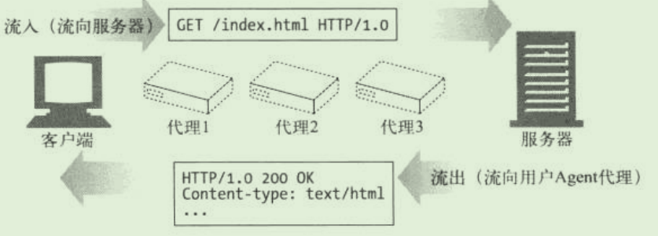
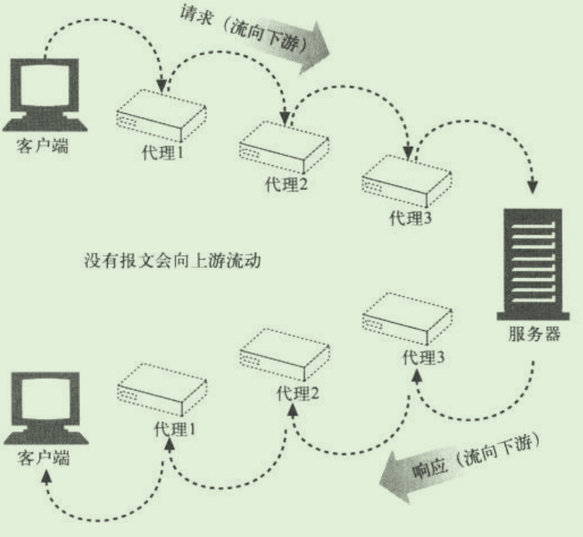

# 了解Web及网络基础

web是建立在何种技术上，HTTP协议是如何诞生并发展的

使用HTTP协议访问web

# HTTP

超文本传输协议（HYperText Transfer Protocol）

## 概述

- 由两个程序实现：一个客户程序和一个服务器程序。运行在不同的端系统当中，通过交换HTTP报文进行会话。
- HTTP定义了这些报文的结构以及客户和服务器进行报文交换的方式
- HTTP定义了web客户向web服务器请求web页面的方式，以及服务器向客户传送web页面的方式
- HTTP使用TCP作为支撑运输协议。一旦连接建立，即可以通过套接字接口访问TCP
- HTTP是无状态协议。不会存储任何关于客户的状态信息
  - 即使一个客户在短时间内两次请求同一个对象，服务器不会因为刚为该客户提供了对象而不再做出反应，而是重新发送该对象
  - 简化了服务器设计，允许工程师开发可以同时处理数千TCP连接的高性能web服务器

**web术语**

web页面是由对象组成的。

- 一个对象只是一个文件。如HTML文件、JPEG图形、Java小程序、一个视频片段这样的文件。且它们可通过一个URL地址寻址。
  - 多数web页面含有一个**HTML基本文件**，以及几个引用对象
  - 如一个Web页面包含HTML文本和5个JPEG图形，则拥有6个对象。HTML基本文件通过对象的URL地址引用页面的其他对象
    - URL组成：存放对象的服务器主机名和对象的路径名。http://www.someSchool.edu(主机名)/someDepartment/picture.gif（路径名）
- web浏览器实现了HTTP的客户端
- web服务器实现了HTTP的服务器端，用于存储web对象，每个对象由URL寻址。流行的服务器由Apache和IIS

## 非持续连接与持续连接

非持续连接：每个**请求\响应对**是经一个单独的TCP连接发送，即传输一个请求报文和一个响应报文

持续连接：所有的请求及响应经相同的TCP连接发送

**采用非持续连接的HTTP**

当服务器向客户传送一个web页面（包含1个HTML与10个JPEG，并存储在一台服务器上）

- HTTP客户进程在端口80（HTTP的默认端口，在客户和服务器上分别有一个套接字与该连接相关联）发起一个到服务器www,someSchool.edu的TCP连接。
- HTTP客户经它的套接字向该服务器发送一个HTTP请求报文。报文包含路径名/someDepartment/home.index
- HTTP服务器进程经套接字接受该请求报文，从存储器中检索出该对象home.index，在一个HTTP相应报文中封装对象，并通过其套接字发送响应报文
- HTTP服务器进程通知TCP断开该TCP连接。
- HTTP客户接受响应报文，TCP连接关闭。报文指出封装的是一个HTML文件，客户从响应报文中提取出文件，检查文件，得到10个JPEG的图形引用
- 对每个引用的JPEG重复前步骤（可能串行，可能并行）

缺陷：

- 每一个新的请求都要建立和维护一个全新的连接，针对每个链接，在客户和服务器中都要分配TCP的缓冲区和保持TCP变量。
- 每一个对象经受2倍的RTT交付时延

**持续连接的HTTP**

服务器在发送响应后，保持该TCP连接打开，在相同的客户与服务器之间的后续请求和响应报文能够通过相同的连接进行传送。

- 带流水线的持续连接：一个接一个地发出对对象的请求，而不必等待对未决请求的回答
- 不带流水线的

## HTTP报文格式

**请求报文**

**响应报文**

## cookie

用户与服务器的交互：cookie

**作用**

- 允许站点对用户进行跟踪，将内容与用户身份联系起来，标识一个用户。
- 在无状态的HTTP上建立了一个用户会话层。但是对用户隐私的一种侵害

**概述**

cookie技术的4个组件：

- 在HTTP响应报文中的一个cookie首部行
- 在HTTP请求报文中的一个cookie首部行
- 在用户端系统中保留有一个cookie文件，并由用户的浏览器进行管理
- 位于web站点的一个后端数据库

cookie实现了站点对用户的跟踪。它可以确切的知道，cookie值为x的用户，按什么顺序、在什么时间访问了哪些页面。因此可以在之后向其推荐相关内容。

## web缓存

web缓存器也叫代理服务器

**作用**

- web缓存器可以大大减少对客户请求的响应时间，特别是当客户与初始服务器之间的瓶颈带宽远低于客户与web缓存器间的瓶颈带宽
- web缓存器可以大大减少一个机构的接入链路到因特网的通信量。因此，该机构不必急于增加带宽，因此降低了费用
- 整体上大大降低了因特网上的Web流量，改善所有应用性能

**概述**

- 能够代表初始web服务器来满足HTTP请求的网络实体。有自己的磁盘存储，在存储空间保存最近请求过的对象的副本。
- 可以配置用户的浏览器，使得用户的所有HTTP请求首先指向web缓存器

web缓存器通常由ISP购买并安装

### CDN

内容分发网络（Content Distribution Network）,Web缓存器正在因特网中发挥着越来越重要的作用。

# HTTP报文

如何创建报文、如何理解报文。

- 报文是如何流动的
- HTTP报文的三个组成部分（起始行、首部和实体的主体部分）
- 请求和响应报文间的区别
- 请求报文支持的各种功能（方法）
- 和响应报文一起返回的各种状态码
- 各种各样的HTTP首部都是用来干什么的

## 报文流

HTTP报文是在HTTP应用程序间发送的数据块。报文在客户端、服务器和代理间流动。“流出”、“流入”、“上游”、“下游”都是描述报文方向的

- 数据块以一些文本形式的**元信息**开头，描述了报文的内容和含义
- 后面跟着可选的数据部分

### 报文流入源端服务器

HTTP使用术语流入、流出描述事务处理的方向。

报文流入源端服务器，工作完成后，会流回用户的Agent代理中。

### 报文向下游流动

无论是请求报文还是响应报文，所有报文都会向下游流动。

所有报文的发送者都在接收者的上游。

## 方法

服务器并不需要实现所有的方法，如果兼容HTTP1.1，只要为资源实现GET方法和HEAD方法。

即使服务器实现了所有的方法，方法的使用可能也是受限的。如DELETE方法或PUT方法的服务器，可能并不希望任何人都能够删除或存储资源。这些限制通常在服务器的配置当中进行设置的，因此会随着站点和服务器的不同而不同

### 安全方法

HTTP定义了安全方法包括GET、HEAD方法。

**目的**是允许HTTP应用程序开发者通知用户，什么时候会使用某个可能引发动作的不安全方法。

- 安全方法意味着使用GET或HEAD方法的HTTP请求都不会产生什么动作。
  - 不产生动作：HTTP请求不会再服务器上产生什么结果。
- 并不一定什么动作都不执行，实际上是由WEB开发者决定的。

### Get

通常用于请求服务器发送某个资源。HTTP1.1要求服务器实现该方法。

### HEAD

与GET类似，服务器在响应中只返回首部，不会反悔实体的主体部分。HTTP1.1要求实现该方法

- 允许客户端在未获取实际资源的情况下，对资源的首部进行检查。判断其类型
- 通过查看响应中的状态码，查看某个对象是否存在
- 通过查看首部，测试资源是否被修改了。

服务器开发者必须确保HEAD方法返回的首部与GET请求返回的首部完全相同。

### PUT

向服务器写入文档。

PUT：让服务器用请求的主体部分来创建一个由所请求的URL命名的新文档。如果该URL已经存在，则用这个主体替代它。

由于PUT允许用户对内容进行修改，因此很多web服务器要求在执行PUT前用密码登录

### POST

起初是用来向服务器输入数据的。

通常用于支持表单。

***使用post请求的情况***

- 无法使用缓存文件（更新服务器上的文件或数据库）

- 向服务器发送大量数据
- 发送包含未知字符的用户输入时，post比Get更稳定可靠
- Post比Get安全性更高

### TRACE

TRACE方法允许客户端在最终将请求发送给服务器时，看看它变成了什么样子

- 客户端发起一个请求，这个请求可能要穿过防火墙、代理、网关或其他一些应用程序。每个中间节点都可能会修改原始的HTTP请求

### OPTIONS

请求WEB服务器告知其支持的各种功能。

### DELETE

请服务器删除请求URL所指定的资源。

但是客户端应用程序无法保证删除操作一定会执行，HTTP规范允许服务在不通知客户端的情况下撤销请求。

### 综述

***Get和Post的区别***

- get被服务器强制支持
- 浏览器对URL长度有限制，因此get请求不能代替post发送大量数据
- get请求发送数据量更小
- get请求是幂等的
- Post请求不能被缓存
- post请求相对于Get是安全的

## 状态码

## [1XX 信息](http://zhangchangle.com/#/notes/HTTP?id=_1xx-%e4%bf%a1%e6%81%af)

- **100 Continue** ：表明到目前为止都很正常，客户端可以继续发送请求或者忽略这个响应。

## [2XX 成功](http://zhangchangle.com/#/notes/HTTP?id=_2xx-%e6%88%90%e5%8a%9f)

- **200 OK**
- **204 No Content** ：请求已经成功处理，但是返回的响应报文不包含实体的主体部分。一般在只需要从客户端往服务器发送信息，而不需要返回数据时使用。
- **206 Partial Content** ：表示客户端进行了范围请求，响应报文包含由 Content-Range 指定范围的实体内容。

## [3XX 重定向](http://zhangchangle.com/#/notes/HTTP?id=_3xx-%e9%87%8d%e5%ae%9a%e5%90%91)

- **301 Moved Permanently** ：永久性重定向
- **302 Found** ：临时性重定向
- **303 See Other** ：和 302 有着相同的功能，但是 303 明确要求客户端应该采用 GET 方法获取资源。
- 注：虽然 HTTP 协议规定 301、302 状态下重定向时不允许把 POST 方法改成 GET 方法，但是大多数浏览器都会在 301、302 和 303 状态下的重定向把 POST 方法改成 GET 方法。
- **304 Not Modified** ：如果请求报文首部包含一些条件，例如：If-Match，If-Modified-Since，If-None-Match，If-Range，If-Unmodified-Since，如果不满足条件，则服务器会返回 304 状态码。
- **307 Temporary Redirect** ：临时重定向，与 302 的含义类似，但是 307 要求浏览器不会把重定向请求的 POST 方法改成 GET 方法。

## [4XX 客户端错误](http://zhangchangle.com/#/notes/HTTP?id=_4xx-%e5%ae%a2%e6%88%b7%e7%ab%af%e9%94%99%e8%af%af)

- **400 Bad Request** ：请求报文中存在语法错误。
- **401 Unauthorized** ：该状态码表示发送的请求需要有认证信息（BASIC 认证、DIGEST 认证）。如果之前已进行过一次请求，则表示用户认证失败。
- **403 Forbidden** ：请求被拒绝。
- **404 Not Found**

## [5XX 服务器错误](http://zhangchangle.com/#/notes/HTTP?id=_5xx-%e6%9c%8d%e5%8a%a1%e5%99%a8%e9%94%99%e8%af%af)

- **500 Internal Server Error** ：服务器正在执行请求时发生错误。
- **503 Service Unavailable** ：服务器暂时处于超负载或正在进行停机维护，现在无法处理请求。

# HTTPS

HTTP协议中有可能存在信息窃听或身份伪装等安全问题。

HTTPS通信机制可以有效地防止这些问题。

## HTTP的缺点

- 通信使用明文（不加密），内容可能被窃听
- 不验证通信方的身份，因此有可能遭遇伪装
- 无法证明报文的完整性，所以有可能已遭篡改
- 等

**通信使用明文可能被窃听**

HTTP本身不具备加密的功能，因此也无法做到对通信整体进行加密。

- TCP/IP是可能被窃听的网络
  - 以TCP/IP的工作机制，通信内容在所有的通信线路上都有可能遭到窥视。
  - 即使已经过加密处理的通信，也会被窥视到通信内容，只是可能让人无法破译密文的含义
  - 窃听方式：收集在互联网上流动的数据包（帧）
    - 对于收集来的数据包的解析工作，可通过抓包或者嗅探工具

***加密处理可防止被窃听***

加密对象：

- 通信的加密。
  - 通过和SSL或TLS组合使用，加密HTTP的通信内容。
- 内容的加密
  - 将报文中包含的内容进行加密处理，客户端需要对HTTP报文进行加密处理后再发送请求
  - 要求客户端和服务端具备加密和解密机制。
  - 内容具有被篡改的风险

**不验证通信方的身份，因此有可能遭遇伪装**

即存在服务器是否就是发送请求中URI真正指定的主机？

返回的响应是否真的返回实际提出请求的客户端等问题。

- 任何人都可发起请求。不存在确认通信方的处理步骤，服务器只要接受到请求，就会返回一个响应
  - 无法确认请求发送至目标的web服务器是否按真实意图返回响应的那台服务器，可能是已伪装的web服务器
  - 无法确认响应返回到的客户端是否按真实意图接受响应的那个客户端，可能是已伪装的客户端
  - 无法确定正在通信的双方是否具备访问权限。因为某些web服务器上保存着重要信息，只想发送给特定用户通信的权限
  - 无法判定请求是来自何方、出自谁手
  - 即使是无意义的请求也会照单全收。无法阻止海量请求下的DOS攻击

***查明对手的证书***

SSL使用了证书的手段，用于确认方

伪造证书从技术角度讲异常困难。通过确认通信方持有的证书，即可判断通信方的真实意图

- 服务器持有证书，即意料中的服务器
- 客户端持有证书，即完成个人信息的确认，页可以用于对web网站的认证环节

**无法证明报文完整性、可能已经被篡改**

没有办法确认，发出的请求/响应和接受到的请求/响应是前后相同的。

- 文件可能在传输途中被更改（中间人攻击MITM）

***防止篡改***：

- MD5与SHA-1等散列值校验的方法
- 用来确认**文件**的数字签名方法
- 都需要客户端的用户本人亲自检查验证是否是原来服务器上的文件，浏览器无法自动帮助用户检查

如果数字前面与MD5本身被改写，用户是没有办法意识到的。

## HTTPS定义

HTTP+加密+认证+完整性保护=HTTPS

- HTTPS是身披SSL外壳的HTTP。
- 当使用SSL，HTTP先和SSL通信，SSL再和TCP通信。

# SSL

## 加密方式

混合加密机制

# 参考 #

1. 
