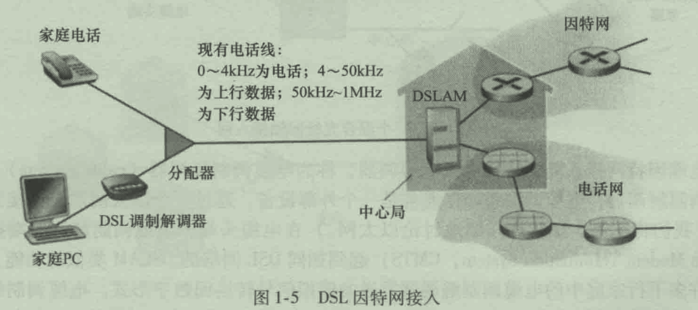
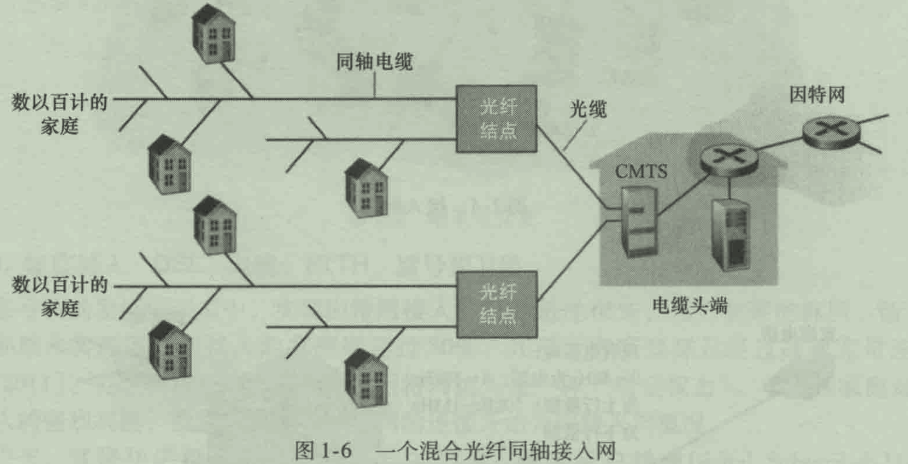
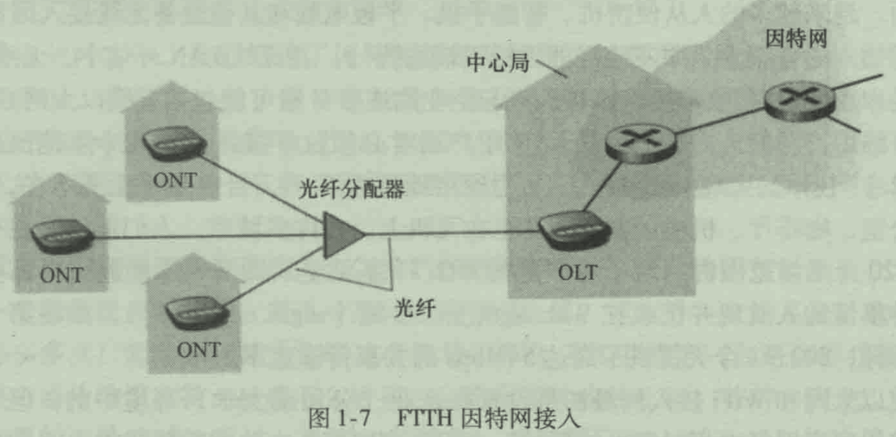
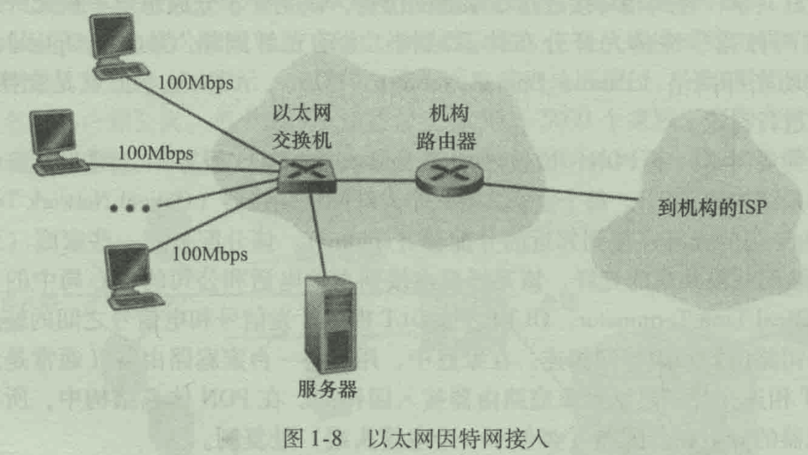
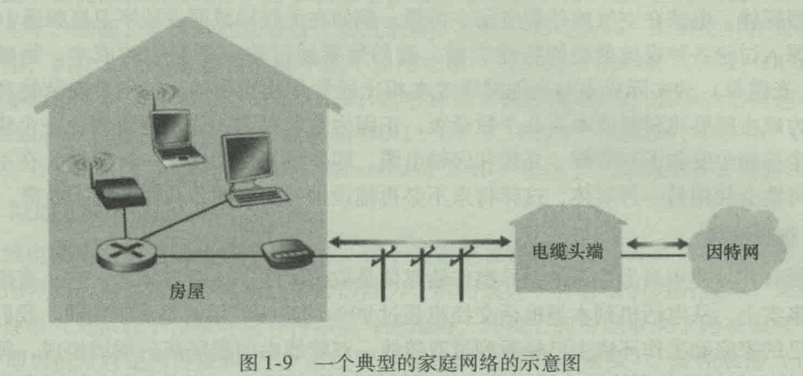
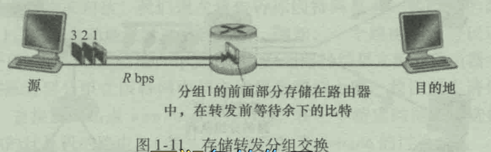
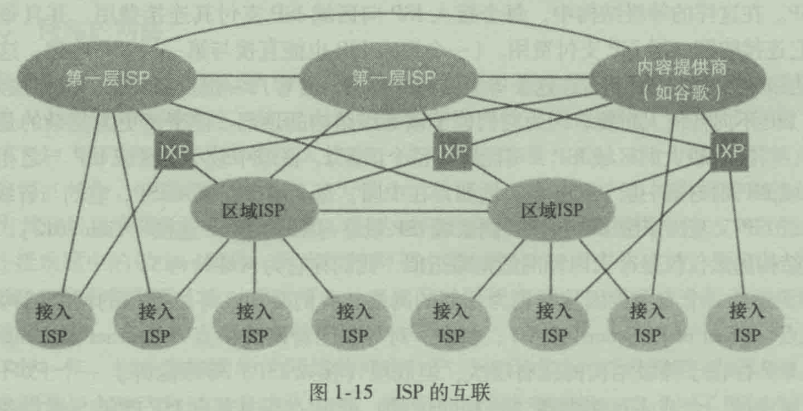

# 概述

因特网目前具有着数以亿计的相连的计算机、通信链路和交换机。

面对如此巨大并且具有如此众多不同组件和用户的因特网，是否能够理解其工作原理。其是否存在某些指导原则和结构，能够作为理解规模和复杂程度惊人的系统的基础。

# 什么是因特网

- 以因特网的具体构成来描述，即构成因特网的基本硬件和软件组件
- 根据为分布式应用提供服务的联网基础设施描述因特网

## 具体构成描述

以因特网的角度来看，所有接入网络的设备都称为主机或**端系统**。

### 端系统间的通信

端系统通过**通信链路**和**分组交换机**连接到一起。当一台端系统要向另一台端系统发送数据时，发送端系统将数据分段，并为每段加上首部字节，由此形成的信息包称为**分组**，分组通过网络发送到目的端系统，在那里装配成初始数据。

### 分组交换机的工作

分组交换机从它的一条入通信链路接受到达的分组，并从它的一条出通信链路转发该分组。

**分类**

- 路由器。位于网络层，通常用于网络核心中。
- 链路层交换机。位于链路层，通常用于接入网中。

***网络路径***

在发送端到接收端，一个分组所经历的一系列通信链路和分组交换机称为通过该网络的**路径**。

***总结***

分组交换网络很类似于承载运输车辆的运输网络，包括着高速公路、公路和立交桥。分组即是卡车，通信链路类似于高速公路与公路，而分组交换机类似于立交桥，端系统就像是建筑物。因此就像卡车寻找目的地意义，分组选取网络中一条路径前行

### ISP（接入因特网）

端系统通过因特网服务提供商（**ISP**）接入因特网。包括了住宅区ISP、公司ISP、学校ISP、WIFI接入的ISP。

每个ISP是一个由多个分组交换机和多段通信链路组成的网络。

各ISP为端系统提供了各种不同类型的网络接入。包括有线接入、高速局域网接入、无线接入等等。ISP也为内容提供者提供因特网接入服务，将Web站点直接接入因特网。

***ISP互联***

因特网就是将端系统彼此关联，因此为端系统提供接入服务的ISP也必须互联。底层的ISP通过国家的高层ISP互联起来，高层ISP由高速的路由器组成。每个ISP都是独立管理，运行着IP协议 。

### 协议

端系统、分组交换机和其他因特网部件都要运行一系列的协议，**控制因特网中信息的接受和发送**。

IP协议定义了在端系统和路由器之间发送和接收的分组格式

## 服务描述 

从应用程序提供服务的基础设施的角度描述因特网

**分布式应用程序**：涉及到多台互相交换数据的端系统。如社交网络等。

为使得运行在一个端系统上的应用程序向因特网上运行在另一个端系统上的软件发送消息。与因特网相连的端系统提供了一个应用程序编程接口API（类似于邮政服务），规定了运行在一个端系统上的软件请求因特网基础设施向运行在另一个端系统上特定目的地软件交付数据的方式。

## 协议

何为协议，协议是做什么的。

### 网络协议

> 一个协议定义了在两个或多个通信实体之间交换的报文格式和次序，以及报文发送和/或接收一条报文或其他事件所采取的动作。

交换报文和采取动作的实体是某些设备的硬件或软件组件，是具有网络能力的设备。

在因特网当中，凡是涉及两个或多个远程通信实体的所有活动都受到协议的制约。

在两台物理上连接的计算机中，硬件实现的协议控制了在两块网络接口卡间的“线上”的比特流。在端系统中，拥塞控制协议控制了在发送端和接收方间的传输的分组发送的速率。

# 网络边缘

在此处，进行深入探究计算机网络的部件。从网络边缘开始观察部件。如计算机、手机等，从边缘向核心推进。

主机或者说端系统，可以分为两类

- 客户
- 服务器。服务器用于存储和发布web页面等。

## 接入网

接入网，即将端系统连接到其**边缘路由器**的物理链路。边缘路由器是端系统到任何其他远程端系统的路径上的第一台路由器。

### 家庭接入

接入方式有DSL、电缆、FTTH、拨号、卫星。DSL（数字用户线）和电缆是当下最流行的方式。

***DSL接入***

用户通常从提供电话接入获得DSL接入，使用DSL时，本地电话公司也是它的ISP。每个用户的DSL调制解调器使用现有的电话线（双绞铜线）与位于本地电话公司的本地中心局中的数字用户线接入复用器（DSLAM）来交换数据。家庭的DSL调制解调器得到数字数据后将其转换为高频音，以通过电话线传输给本地中心局。即模拟信号在DSLAM处被转换回数字形式。

家庭电话线同时承载了数据和传统的电话信号，它们编码位不同的频率。这种方式下，单根的DSL线路如同三根线路，使得一个电话与一个因特网连接同时共享DSL链路（**频分复用**）

- 高速下行信道，50KHZ到1MHZ
- 中速上行信道，4KHZ到50KHZ
- 普通的双向电话信道，0到4KHZ

在用户侧，分频器将到达家庭的数据信号和电话信号分隔，将数据信号转发给DSL调制解调器。在本地电话公司侧，DSLAM将数据和电话信号分割开，并将数据送往因特网。

***电缆接入***

利用了有线电视公司现有的有线电视基础设施。在该系统当中应用了光纤和同轴电缆，因此也被称为**混合光纤同轴**

电缆因特网接入需要特殊的调整解调器，称为**电缆调制解调器**。通常是一个外部设备，以一个以太网端口接入家庭。

在电缆头部，电缆调制解调器端接系统（CMTS）起到如同DSL网络的DSLAM类似的功能，将来自许多下行家庭中的电缆调制解调器发送的模拟信号转回数字形式。

电缆因特网接入的一个重要特征是**共享广播媒体**。特别是由头端发送的每个分组向下行经每段链路到每个家庭；每个家庭发送的每个分组经上行信道向头端传输。

- 因此若几个用户同时经下行信道下载一个视频文件，每个用户接收的实际速率将大大低于电缆总计的下行速率
- 若仅仅有很少的用户在web上，则每个用户都可以以下行速率的全部接收web网页

因为上行信道也是共享的，需要一个分布式多路访问协议来协调传输和避免碰撞

***光纤到户FTTH***

从本地中心局直接到家庭提供一条光纤路径。光纤分布体系结构有：**主动光纤网络AON**和**被动光纤网络PON**

AON基本上就是交换因特网。PON的FTTH结构如下

### 企业和家庭接入

***以太网***

在公司和大学校园以及家庭当中，通常是使用局域网（LAN）将端用户连接到边缘路由器。以太网是目前为止最为流行的接入技术。以太网用户使用双绞铜线与一台以太网交换机相连，以太网交换机再与更大的因特网相连。

在该接入下，用户通常以100mbps速率接入交换机，而服务器可能具有1Gbps甚至10Gbps

***WIFI***

在智能手机的加入后，若是使用无线LAN接入，用户从一个接入点发送/接收分组，该接入点与企业网相连，该企业网再与有线因特网相连。一个无线LAN用户需要在**接入网几十米范围**内。

***WIFI+宽带***

将DSL或电缆调制解调器与WIFI结合起来。组成有：漫游的便携机、有线PC、与无线通信的基站（无线接入点）、提供与因特网宽带接入的电缆调整解调器、互联了基站以及带有电缆调制解调器的固定PC的路由器

该网络允许家庭成员经过宽带接入因特网，可以在各个位置漫游上网。

### 广域无线接入

***3G***

应用了与移动电话相同的基础设施，通过蜂窝网提供商运营的基站发送接收分组。一个用户只需要在基站数万米内即可。

## 物理媒体

HFC使用了光缆和同轴电缆相结合的技术；DSL和以太网使用了双绞铜线；移动接入网使用了无线电频谱。

考虑一个比特的短暂历程。

- 一个比特从一个端系统开始传输，经过一系列链路和路由器，到达另一个端系统。
- 这个比特被传输许多多此，源端系统首先传输这个比特，之后一台路由器接收、传输该比特，由路由器进行转发传输。
- 通过一系列的“传输-接收器”，它们通过跨越一种物理媒体传输电磁波或光脉冲来发送该比特。
  - 该物理媒体可以有多重形状和形式。对于传输-接收器也不必具有相同的类型

物理媒体划分为**两类**：导引型媒体与非导引型媒体。

- 导引型：电波沿着固体媒体前行，如光缆、双绞铜线或同轴电缆
- 非导引型媒体：电波在空气或外层空间中传输，如无线局域网或数字卫星频道

### 双绞铜线

### 同轴电缆

### 光纤

### 陆地无线电信道

### 微信无线电信道

# 网络核心

深入研究网络的核心，即由互联网因特网端系统的分组交换机和链路构成的网状网络。

通过网络链路和交换机移动数据有两种基本方式：电路交换和分组交换。

## 分组交换

端系统彼此交换报文。报文能够包含协议设计者需要的任何东西。报文可以执行一种控制功能，也可以包含数据。

为了从源端系统向目的端系统发送一个报文，源将长报文划分为较小的数据块，称为**分组**，每个分组都通过通信链路和分组交换机（路由器与链路层交换机）传送。分组以**等于该链路最大传输速率的速度**传输通过通信链路。

### 存储转发传输

多数的分组交换机再链路的输入端使用存储转发传输机制。存储转发机制是指交换机能够开始向输出链路传输该分组的第一个比特前，必须接收到整个分组。

***举例***

考虑由两个经一台路由器连接的端系统。

路由器将分组从一条输入链路转移到另一条唯一的连接链路。当分组1的前沿到达路由器时，由于路由器使用存储转发机制，此时还不能将传输已经接收的比特，而是必须先缓存该分组的比特。当路由器已经接收完了该分组的所有比特后，才能向出链路转发该分组。

当源在时刻0进行传输，则在时刻L/R秒，路由器刚好接收到整个分组，此时可以进行转发。在时刻2L/R秒，路由器已经传输了整个分组，并被目的地接收。因此总时延是2L/R。若交换机不必进行存储转发，则总时延是L/R。

***端到端时延***

端到端的时延是d=NL/R（N为链路数目，中间有N-1台路由器）

### 排队时延和分组丢失

每个分组交换机有一个输出缓存（输出队列），用于存储路由器准备发往哪条链路的分组。如果到达的分组需要传输到某条链路，但发现该链路正忙于传输其他分组，该到达分组必须在输出缓存中等待，因此分组还要承受输出缓存的**排队时延**。

排队时延是变化的，程度取决于网络中的拥塞程度。

**分组丢失**：由于缓存空间的大小有限，一个到达的分组可能发现该缓存已经被其他等待传输的分组完全充满了，在此情况下会出现丢包。到达的分组或已经排队的分组之一被丢弃

### 转发表和路由选择协议

路由器从与它相连的一条通信链路获得分组，将其向与它相连的另一条通信链路转发。但是路由器如何决定它应该向哪条链路进行转发呢？不同的额计算机网络以不同的方式完成的

因特网中，每个端系统当中具有一个称为IP地址的地址。当源主机向目的端系统发送一个分组时，源在该分组的首部包含了目的地的IP地址。

***根据IP地址进行转发***

IP地址具有等级结构，当一个分组到达网络中的路由器时，路由器检查该分组的目的地址的一部分，并向一台相邻路由器转发该分组。路由器有一个**转发表**用于映射目的地址（或目的地址的一部分）到	输出链路。

***转发表是如何设置的呢***

因特网具有一些特殊的路由选择协议，用于自动地设置这些转发表。

## 电路交换

电路交换网络中，在端系统间通信会话期间，预留了端系统间通信沿路径所需要的资源（缓存、链路传输速率）。会话的报文按需使用这些资源，其后果可能是不得不等待接入通信线路。

传统的电话网络是电路交换网络的实例，当一个人通过电话网向另一个人发送信息时，在发送方能够发送信息前，该网络必须在发送方和接收方建立一条连接，路径上的交换机都会为该连接维护连接状态。该连接被称为一条**电路**。

当网络创建这种电路时，也在该连接期间在该网络链路上预留了恒定的传输速率，即发送方能够以确保的恒定速率向发送方传送数据。

### 电路交换网络中的复用

***频分复用FDM***

链路的频谱由跨越链路创建创建的所有连接所共享。在连接期间，链路为每条连接专用一个频段。在电话网络中该频段通常具有4kHZ的带宽，该频段的宽度称为**带宽**。调频无线电台使用FDM共享88-108kHZ的频谱，每个电台被分配一个特定的频段。

***时分复用TDM***

时间被划分为固定的帧，每帧被划分为固定的时隙，当网络跨越一条链路创建一条连接时，网络在每个帧内为该连接指定一个时隙。这些时隙专门由该连接单独使用。

### 分组交换与电路交换对比

- 分组交换不适合实时服务（电话等），因为它的端到端时延是可变而不可预测的。（排队时延的变动）
- 分组交换提供了比电路交换更好地带宽共享
- 分组交换比电路交换更简单、更有效、成本更低。

***分组交换为何更加有效***

假设

- 当多个用户共享一条1Mbps的链路，假定用户活跃周期是变化的
- 某用户以100kps恒定速率产生数据，时而静止。
- 假定用户有10%时间活跃。

***电路交换***

对于电路交换，在所有的时间内必须为每个用户预留100kbps。因此该电路交换链路只能支撑10个并发用户。

***分组交换***

对于分组交换，一个用户的活跃概率为10%，若有35个用户，则存在11个或更多个活跃用户的概率大约是0.0004，当存在10个以下时，到达的聚合数据率小于输出速率1Mbps，因此基本没有时延，与电路交换一致。

当活跃用户超过10人，则输出队列开始变长，直到聚合输入率小于输出率。由于概率较低，因此总是提供了电路交换相同的性能

***情境2***

- 有10个用户，每个用户突然产生1000个1000比特的分组，其他用户静默。

在电路交换中，若有10个时隙，则只有一个时隙用来传输数据。而在分组交换下，活跃用户能够连续以1Mbps速度进行发送数据。

## 网络的网络

端系统通过接入ISP与因特网相连，但为端用户和内容提供商提供和接入ISP仅解决了连接难题中的很小一部分，因为因特网是由数以亿计的用户构成的。因此接入ISP自身必须互联。通过创建**网络的网络**可以做到这一点。

为了能够使得所有端系统都能够彼此发送分组。较为幼稚的做法是接入ISP直接与其他ISP连接，但是成本太高。

### 网络结构1

用单一的全球承载ISP互联所有接入ISP，假象的全球承载ISP是一个由路由器和通信链路构成的网络，该网络至少具有一个路由器靠近数十万接入ISP中的每一个。为了有利可图，接入ISP被认为是客户，全球承载ISP被认为是提供商

### 网络结构2

若某个公司建立并运行了一个可盈利的全球承载ISP，其他公司建立自己的全球承载ISP并与最初的全球承载ISP竞争。即 数十万接入ISP与多个全球承载ISP组成，并且这些全球承载ISP互联。

### 网络结构3

在网络的第一层，有多个竞争的第一层ISP。在一个区域当中，有多个竞争的区域ISP。在某些区域当中，可能有较大的区域ISP（跨越国家），区域中较小的ISP与之相连等。

每个接入ISP向区域ISP支付连接费用，每个区域ISP向第一层ISP付费。

### 网络结构4

为了建造一个与今天因特网更为相似的网络，需要在网络结构3的基础上增加存在点（POP）、多宿、对等和因特网交换点（IXP）。

***PoP***

PoP存在于等级结构中的所有层次，除底层（接入ISP）外，一个PoP只是提供商网络中的一台或多台（在相同位置）路由器群组，其中客户ISP能够与提供商ISP连接。对于要与提供商PoP连接的客户网络，能够从第三方通信提供商租用高速链路直接将它的路由器之一连到位于该PoP的一台路由器。

***多宿***

任何ISP（除接入ISP）可以选择为多宿，即与两个或更多提供商ISP连接，即使提供商之一出现故障，仍然可以接收和发送分组。

***对等***

客户ISP向它们的提供商ISP付费已获得全球因特网互联能力，客户ISP支付的费用反映了它的流量。为了减少费用，位于相同等级结构层次的临近一对ISP能够对等。即他们的网络可以直接相连，使得他们间所有流量经直接连接而不是通过上游的中间ISP传输

对等的ISP通常不进行结算，第三方公司创建一个**因特网交换点（IXP）**，多个ISP在这里共同对等。

### 网络结构5

描述2012年的因特网

在网络结构4的顶部增加内容提供商网络构建而成。该网络仅仅承载出入其服务器主机的流量，并且尝试与较低层ISP对等尝试绕过较高层

# 分组交换网中的时延、丢包和吞吐量

# 协议层次及其服务模型

# 面对攻击的网络

# 参考 #

1. 

